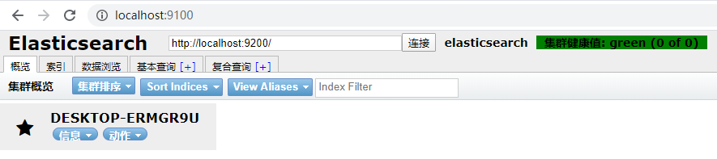

# 概念P10

## ElasticSearch

- 是全文检索服务器。基于Apache Lucene构建的开源搜索引擎，采用java开发。

## 原理

- 输入检索关键字 -> 向es集群发送检索请求 -> 返回检索内容

## 数据来源

- 利用爬虫从网页上爬取数据存到本地索引库

## 应用场景

- 站内搜索，nosql json文档，监控日志

## 为什么不存到关系型db？

- 因为关系型db承载不了大量数据，ES也可以当作缓存db使用（就像redis）

## ES和Solr对比

- 相同点：都是基于Lucene进行封闭

- 不同点：

  1. 使用：Solr安装复杂；es开箱即用，简单

  2. 接口：Solr基于webservice；es基于RESTFul接口风格

  3. 分布式存储：solrCloud solr4.x才支持；es为分布式而生

  4. 支持风格：solr支持更多格式数据，如json,xml,csv；es仅支持json格式

  5. 实时搜索：solr查询快，插入删除慢；es查询慢，实时查询快

## ES 和 关系型db

| ElasticSearch    | 关系型数据库 |
| ---------------- | ------------ |
| index（索引）    | database     |
| type（类型）     | table        |
| document（文档） | row          |
| field            | column       |

> 在 ES 中，索引被分成多个分片，每份分片都是一个Lucene的索引。
>
> 所以一个 ES 索引（库）由多个 Lucene ==倒排索引==组成。

## ELK

- 搜索清洗，elasticsearch + logstash + kibana

## 数据类型

- 字符串类型：text，keyword
- 数据类型：long，integer，short，byte，double，float，half float，scaled float
- 日期类型：date
- 布尔类型：boolean
- 二进制类型：binary
- 等等...

# 安装-配置

## 单机版（默认配置）

1. 解压后cd到bin下，执行 elasticsearch

2. 访问 http://localhost:9200

3. 显示结果：(表示安装成功)

```json
{
  "name" : "DESKTOP-851SFRJ",
  "cluster_name" : "elasticsearch",
  "cluster_uuid" : "e7epiYRGQFS4PnbwAA_plQ",
  "version" : {
    "number" : "7.6.2",
    "build_flavor" : "default",
    "build_type" : "zip",
    "build_hash" : "ef48eb35cf30adf4db14086e8aabd07ef6fb113f",
    "build_date" : "2020-03-26T06:34:37.794943Z",
    "build_snapshot" : false,
    "lucene_version" : "8.4.0",
    "minimum_wire_compatibility_version" : "6.8.0",
    "minimum_index_compatibility_version" : "6.0.0-beta1"
  },
  "tagline" : "You Know, for Search"
}
```

## CentOS下安装

1. 切换个非root用户（useradd passwd su -l 用户）

2. 解压

3. 在阿里云上手动添加9200端口

4. 命令开放9200端口

5. 修改config/jvm.options （因为阿里服务器总共1G，所以这里改小些）

     ```shell
     -Xms1g    =>     -Xms128m
     -Xmx1g    =>     -Xms128m
     ```

6. 修改环境变量（==7.13.2版本需要这一步==）

     ```bash
     # elasticsearch-7.13.2/jdk 自带有最新的jdk
     # 在 /etc/profile 添加：
     export ES_JAVA_HOME=/home/gt/elasticsearch-7.13.2/jdk # 非root用户下的路径
     source /etc/profile # 需要切到root用户下刷新环境变量操作
     ```

7. 修配 config/elasticsearch.yml（==7.13.2版本需要这一步==）

     ```bash
     node.name: node-1                          # 给节点起个名
     network.host: 0.0.0.0                      # 表示内网外网都能访问
     http.port: 9200                            # es 端口
     cluster.initial_master_nodes: ["node-1"]   # 指定主节点
     ```

8. 修改 vm.max_map_count（==7.13.2版本需要这一步==）

     ```bash
     vim /etc/sysctl.conf
     vm.max_map_count = 262144 # 添加这行，具体数值可根据es运行报错后给的建议值
     sysctl -p                 # 刷新内核参数
     ```

9. 运行 ./bin/elasticsearch

10. 查看是否正常运行

     ```bash
     curl 'http://localhost:9200/?pretty'
     # 结果：
     {
       "name" : "iZm5eaxi8auirtokim5tofZ",
       "cluster_name" : "elasticsearch",
       "cluster_uuid" : "gwy44bq3Sei-9lE1Fg2_4Q",
       "version" : {
         "number" : "7.13.2",
         "build_flavor" : "default",
         "build_type" : "tar",
         "build_hash" : "4d960a0733be83dd2543ca018aa4ddc42e956800",
         "build_date" : "2021-06-10T21:01:55.251515791Z",
         "build_snapshot" : false,
         "lucene_version" : "8.8.2",
         "minimum_wire_compatibility_version" : "6.8.0",
         "minimum_index_compatibility_version" : "6.0.0-beta1"
       },
       "tagline" : "You Know, for Search"
     } # 代表成功运行
     ```

## ES 的目录结构

bin             启动文件

config        配置文件

​    log4j2             日志配置文件

​    jvm.options     jvm配置文件

​    elasticsearch  ES的配置文件；默认端口9200；跨域问题配置。

lib              相关jar包

modules    功能模块

plugins      插件；ik

## 配置跨域

```yaml
# config/elasticsearch.yml
http.cors.enabled: true
http.cors.allow-origin: "*"
```

## 可视化界面head插件安装

1. nodejs安装
2. 下载地址：https://github.com/mobz/elasticsearch-head
3. 解压后cmd进入到目录：cnpm install
4. 配置ES跨域
5. npm run start



# Kibana

- 下载地址：https://www.elastic.co/cn/downloads/kibana

- config/kibana.yml

  ```bash
  elasticsearch.hosts: ["http://47.105.141.18:9200"]  # 连接es服务
  i18n.locale: "zh-CN"                                # 汉化
  ```

- 下载好后双击 bin/kibana.bat 启动

- 进入控制台敲命令：左侧扳手图标（倒第3个）

# IK分词器

- 从 github 上下载好后解压到 plugin/ik 下
- 重启 ES 即可
- cmd 到 ES 的 bin 目录下：==elasticsearch-plugin list== 查看所有安装的插件

- IK 分词算法
  - **ik_smart**：最少切分
  - **ik_max_word**：最细粒度划分

```json
// ik_smart 只分出来个词
GET _analyze
{"analyzer":"ik_smart","text":"中华人民共和国"}
// ik_max_word 分出9组词
GET _analyze
{"analyzer":"ik_max_word","text":"中华人民共和国"}
```

## 增加词典

1. config 下添加文件 xxx.dic
2. 编辑文件 config/IKAnalyzer.cfg.xml

```xml
<?xml version="1.0" encoding="UTF-8"?>
<!DOCTYPE properties SYSTEM "http://java.sun.com/dtd/properties.dtd">
<properties>
	<comment>IK Analyzer 扩展配置</comment>
	<!--用户可以在这里配置自己的扩展字典 -->
	<entry key="ext_dict">xxx.dic</entry>   <!-- 上一步自己创建的 .dic 文件 -->
	 <!--用户可以在这里配置自己的扩展停止词字典-->
	<entry key="ext_stopwords"></entry>
	<!--用户可以在这里配置远程扩展字典 -->
	<!-- <entry key="remote_ext_dict">words_location</entry> -->
	<!--用户可以在这里配置远程扩展停止词字典-->
	<!-- <entry key="remote_ext_stopwords">words_location</entry> -->
</properties>
```

3. 重启 ES 和 kibana

4. 在控制台里输入一个在.dic里添加过的词后，运行结果就不分拆分了

# 基础应用

## 基于 RESTful 命令

| method | url                                             | 描述                   |
| ------ | ----------------------------------------------- | ---------------------- |
| PUT    | localhost:9200/索引名称/类型名称/文档id         | 创建文档（指定文档id） |
| POST   | localhost:9200/索引名称/类型名称                | 创建文档（随机文档id） |
| POST   | localhost:9200/索引名称/类型名称/文档id/_update | 修改文档（根据文档id） |
| DELETE | localhost:9200/索引名称/类型名称/文档id         | 删除文档（根据文档id） |
| GET    | localhost:9200/索引名称/类型名称/文档id         | 查询文档（根据文档id） |
| POST   | localhost:9200/索引名称/类型名称/_search        | 查询所有数据           |

- 创建索引db01.类型db01_01.文档user 及一行数据

```json
PUT /db01/db01_01/user
{"userId": "gt001", "userName": "关桐", "age": 35}
```

- 创建规则（类似表结构，没有数据）

```json
PUT /db02
{
  "mappings": {
    "properties": {
      // 字段名：字段类型
      "userId": {"type": "text"},
      "userName": {"type": "text"},
      "age": {"type": "short"}
    }
  }
}
```

- 获取索引（库）信息

```json
get /db01
```

- get _cat 命令：获取 ES 当前很多信息

```json
// 查看 ES 健康状况
GET _cat/health
// 查看 ES 都有哪些库
GET _cat/indices
// 查看 ES 都有哪些库（带表头/列名）
GET _cat/indices?v
```

- 更新数据

```json
POST /db01/db01_01/user/_update
// 关键字 doc
{"doc": {"userId": "gt001", "userName": "关桐", "age": 35}}
```

- 删除索引（db）

```json
DELETE db02
```

# 整合springboot

```xml
<parent>
    <groupId>org.springframework.boot</groupId>
    <artifactId>spring-boot-starter-parent</artifactId>
    <version>2.5.0</version>
</parent>

<dependency>
    <groupId>org.elasticsearch.client</groupId>
    <artifactId>elasticsearch-rest-high-level-client</artifactId>
</dependency>
```

```java
@Configuration
public class ElasticSearchConfig {
    public static final RequestOptions OPTIONS = RequestOptions.DEFAULT.toBuilder().build(); // 官方建议将 Ops 做成单例

    @Bean
    public RestHighLevelClient restHighLevelClient() {
        RestClientBuilder http = RestClient.builder(new HttpHost("47.105.141.18", 9200, "http"));
        return new RestHighLevelClient(http);
    }
}
```

```java
@Autowired
private RestHighLevelClient client;

@GetMapping("create/{index}") // 创建index
public String create(@PathVariable String index) throws IOException {
    CreateIndexRequest req = new CreateIndexRequest(index);
    req.settings(Settings.builder()
                 .put("index.number_of_shards", 1)     // 分片数：1
                 .put("index.number_of_replicas", 0)); // 副本数：0

    // mapping 作用是约束
    req.mapping(XContentFactory.jsonBuilder()
          .startObject()
              .startObject("properties")
                .startObject("id").field("type", "integer").endObject()
                .startObject("name").field("type", "keyword").endObject()
                .startObject("dept").field("type", "keyword").endObject()
                .startObject("city").field("type", "keyword").endObject()
              .endObject()
           .endObject());
    // 格式相当于：{ properties: { id: {type: 'integer'}, name: {type: 'keyword'}, city: {type: 'keyword'} } }
    CreateIndexResponse res = client.indices().create(req, ElasticSearchConfig.OPTIONS);
    return "create result：" + res.isAcknowledged();
}

@GetMapping("insert/kv/{id}") // 向index里插入文档
public String insert_kv(@PathVariable String id) throws IOException {
    IndexRequest usr = new IndexRequest("user");
    usr.id(id);
    usr.source("name", "name - " + id, "dept", "dept - " + id, "city", "city - " + id);
    IndexResponse i = client.index(usr, ElasticSearchConfig.OPTIONS);
    System.out.println(i);
    return "index";
}
```

