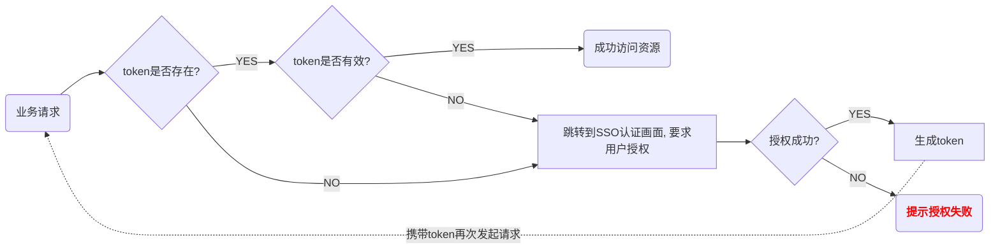

https://www.bilibili.com/video/BV1RK4y1C7Xx?p=8

# 1. SSO 概述

## 1.1 SSO 体系结构

- 认证中心
  - 对用户发起的请求进行验证
  - 用户认证界面或接口
- 用户与账号系统，用户数据获取接口
- 客户端模块
- 令牌（token）：用户每次请求必须携带

## 1.2 认证流程




## 1.3 SSO 相关核心技术

**1，http，cookie，session**

**2，cookie 和 session 的关系**

- cookie：存放客户端的唯一id，该id能让服务器识别其身份
- session：服务器内存中维护一个map，通过cookie中的id可以从map中获取该客户端的状态

**3，cookie => SSO 令牌的载体（即 cookie 存储 SSO 令牌）**

**4，决定 cookie 内容、生命周期和有效范围的7个属性**

> 使用 cookie 应注意
>
> 1，过多的 cookie 浪费流量
>
> 2，浏览器对 cookie 有个数限制
>
> 3，浏览器对 cookie 大小有限制
>
> 4，cookie 不要存敏感信息

​       ==当 name，secure，path，domain 都相同，浏览器才会认为是同一个 cookie==

- name & value

  ```java
  cookie.getName();
  cookie.getValue();
  ```

- expires：生命周期 ==( 浏览器不会回发给服务器)==

  ```java
  // 删除 cookie：设置一个过去的时间
  cookie.getMaxAge();
  ```

- path & domain（路径 & 域） ==( 浏览器不会回发给服务器)==

  ```java
  // setPath("/") 表示 cookie 的作用域在 localhost:8080/ 下任何路径都有效
  // 默认在当前路径下才有效，再请求别的路径该 cookie 就无效了
  cookie.getPath();
  cookie.getDomain();
  ```

- httpOnly & secure（很少用） ==( 浏览器不会回发给服务器)==
  - httpOnly：如果一个cookie设置成了 httpOnly，只有网络传送时才有效，==不允许 js 操作==。JSSESSIONID 就是 httpOnly
  - secure：https 协议
  
  ```java
  cookie.isHttpOnly();
  // setSecure(true) 仅支持 https
  cookie.getSecure();
  ```
  
- javascript 操作 cookie 的方法

  ==只有跑在服务下的页面才好用，静态页不好用==

  ```javascript
  // 用来读写 cookie
  // 当前作用域下所有有效 cookie 拼接成的字符串
  let cookies = document.cookie;
  // 假如有两个 cookie 分别是 c1=text1 和 c2=test2
  // 输出字符串：c1=test1;c2=test2
  console.log(cookies);
  // 写 cookie
  document.cookie = 'a=a'; // 一次只能赋一组 key/value
  console.log(document.cookie); // 结果：a=a
  document.cookie = 'b=b';
  console.log(document.cookie); // 结果：a=a;b=b
  // 写一个 cookie 并带有路径、有效期、domain等属性
  // [GMT时间] = new Date(d).toGMTString();
  document.cookie = 'c=c;expires=[GMT时间];path=/;domain=www.xxx.com;secure=true';
  // 存值需要 escape 和 unescape 转码配合使用
  // 删除 cookie
  function delCookie(name) {
      document.cookie = name + '=随便给个值;expires=' + new Date(0).toGMTString();
  }
  ```

- java web 应用中操作 cookie 的方法

- filter，web 层的拦截器

# 2. 同域下单点登陆

## 2.1 数据库

```mysql
-- ----------------------------
-- Table structure for user
-- ----------------------------
DROP TABLE IF EXISTS `user`;
CREATE TABLE `user` (
  `id` int(11) NOT NULL AUTO_INCREMENT,
  `name` varchar(50) NOT NULL,
  `account` varchar(20) NOT NULL,
  `password` varchar(20) NOT NULL,
  PRIMARY KEY (`id`)
) ENGINE=InnoDB AUTO_INCREMENT=3 DEFAULT CHARSET=utf8;

-- ----------------------------
-- Records of user
-- ----------------------------
INSERT INTO `user` VALUES ('1', 'user1', 'u1', '123');
INSERT INTO `user` VALUES ('2', 'user2', 'u2', '123');
```

## 2.2 认证中心

**module：server**


## 2.3 客户端模块

**module：client**

**作为 lib 提供给 app1 和 app2**

## 2.4 业务系统

**module：app1 和 app2**

> 用户登陆之后才允许访问

# 3. 跨域单点登陆

- server 域
  - 1，提供登陆界面，供用户身份认证
  - 2，用户认证通过后，生成新 token
  - 3，将 token / user 存入全局 map 中供校验
  - ==4，将 token 写入所在域的 cookie中==**（与同域不一样地方）**
  - 5，页面重定向回原始请求 url
- ==核心问题：跨域 cookie 的读写==

## 3.1 跨域读写 cookie

Cookie 跨域共享的实现：

- 利用 script 的 src 实现跨域写 cookie
- P3P 协议

# 4. 开源产品

- XXL：https://www.xuxueli.com/xxl-sso/
- CAS

# 附录

## 1. Chrome浏览器SameSite设置

> 问题描述：单点登陆后，本系统要在iframe引用主系统的页面，但发现iframe里的页面直接跳转到了主系统的login画面
>
> ​                   经调查，是因为谷歌浏览器80+版本的SameSite的默认值是Fax

### 1.1 SameSite安全性

设置 cookie 在什么场景下被发送

- Strice：只允许同站请求携带 cookie。（最严格）
- Lax：允许部分第三方请求携带 cookie。（chrome80以后的版本默认）
- None：允许任何请求携带 cookie，但必须加上 Secure 属性，否则无效（chrome80以前的版本默认）

### 1.2 浏览器设置SameSite=None

1. 谷歌浏览器里输入：chrome://flags/
2. 找到 SameSite by default cookies和Cookies without SameSite must be secure，都设置成 Disable

### 1.3 代码设置 SameSite=None

在本系统里写一个代理，请求第三方url

https://blog.csdn.net/weixin_36751895/article/details/79126091