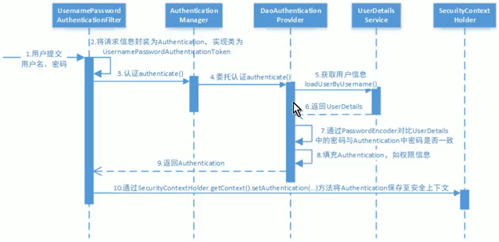
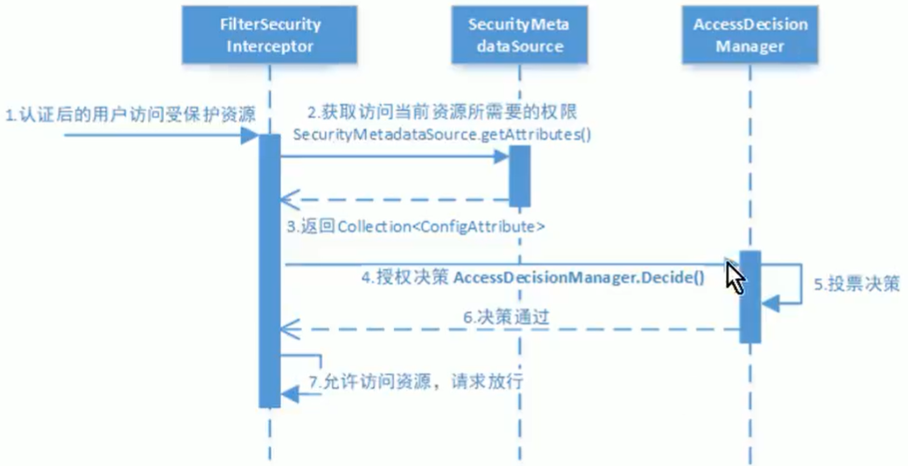
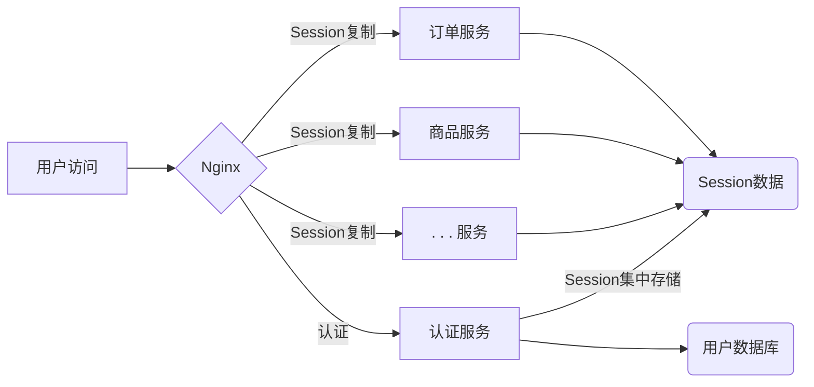

# 1. 概念

## 1.1 核心功能

- 认证：判断一个用户身份是否合法的过程（账号密码/二维码/短信/指纹----登陆）
- 会话：为避免用户每次操作都需要认证，将用户信息保存到会话中
  - session：**放到 cookie 中**
  - token：用户通过认证后，服务端生成一个token给客户端（放到 cookie，localStorage 或其它地方保存），每次认证带上token，服务收到 token 后确认其身份。**不要求必须放到 cookie 中**
- 资源：分为**数据资源和功能资源**
- 角色：为方便给用户分配权限
- 授权：**认证通过后**，根据用户权限来控制用户访问资源的过程（哪些用户对什么样资源进行什么操作）
- 攻击防护（防止伪造身份）
  - csrf：cross-site request forgery 即**跨站请求伪造**
- UAA：全称User Account and Authentication

> ==至少要创建 5 张表：用户，角色，权限（权限和资源合并），用户角色关系，角色权限关系==

## 1.2 原理技术

Filter，Servlet，Spring DI，Spring AOP

## 1.3 与 shiro 对比

### 1.3.1 相同点

认证，授权，加密，会话，缓存，remeber me

### 1.3.2 不同点

**优点**

- security 基于 spring 开发，spring 项目中用 security 做权限更方便。shiro 需要和 spring 整合
- security 比功能比 shiro 更丰富，如安全防护方面
- security 社区资源比 shiro 丰富
- springboot，springcloud 能与 security 无缝结合

**缺点**

- shiro 配置和使用比较简单，security 上手复杂
- shiro 依赖性低，不需要任何框架和容器，可独立运行。而 security 依赖 spring 容器

## 1.4 RBAC

业界通常基于 RBAC 实现授权

### 1.4.1 基于角色的访问控制

role-based access control，按角色进行授权。

```java
if (主体.hasRole("经理角色") || 主体.hasRole("部长角色")) {
    // 查询工资
}
```

缺点：系统可扩展性差

### 1.4.2 基于资源的访问控制

```java
if (主体.hasPermission("查询工资权限标识")) {
    // 查询工资
}
```

优点：系统可扩展性强

# 2. 快速上手

```xml
<dependency>
    <groupId>org.springframework.boot</groupId>
    <artifactId>spring-boot-starter-web</artifactId>
</dependency>
<dependency>
    <groupId>org.springframework.boot</groupId>
    <artifactId>spring-boot-starter-security</artifactId>
</dependency>
```

启动后不用添加任何 controller 就能访问 http://localhost:8080/login

> 启动后会生成一个密码并显示在idea控制台上
>
> Using generated security password: f2543273-cd2c-4757-a7cc-714784912af5
>
> 登陆账号：user

## 2.1 停止 security

```java
// exclude = SecurityAutoConfiguration.class
@SpringBootApplication(exclude = SecurityAutoConfiguration.class)
public class SecurityApp {
    public static void main(String[] args) {
        SpringApplication.run(SecurityApp.class, args);
    }
}
```

## 2.2 自定义账号密码

```yaml
# application.yml
spring:
  security:
    user:
      name: admin
      password: 123
```

## 2.3 基于内存认证授权

```java
// 继承 WebSecurityConfigurerAdapter 并实现 configure 来完成安全拦截
@Configuration
public class WebSecurityConfig extends WebSecurityConfigurerAdapter {
    // 1. 定义查询用户信息服务
    @Bean
    public UserDetailsService userDetailsService() {
        // 基于内存的
        InMemoryUserDetailsManager mgr = new InMemoryUserDetailsManager();
        // 创建两个用户
        mgr.createUser(User.withUsername("admin").password("111").authorities("p1").build());
        mgr.createUser(User.withUsername("guest").password("111").authorities("p2").build());
        return mgr;
    }

    // 2. 密码编码器
    @Bean
    public PasswordEncoder passwordEncoder() {
        // 不加密的密码
        return NoOpPasswordEncoder.getInstance();
    }

    // 3. 安全拦截机制（重要）
    @Override
    protected void configure(HttpSecurity http) throws Exception {
        http.authorizeRequests()
                .antMatchers("/r/**").authenticated() // 所有 /r/** 必须要认证
                .anyRequest().permitAll() // 除 /r/** 以外都可以访问
                .and().formLogin() // 并且允许从 login 画面登陆
                .defaultSuccessUrl("/index", true); // 登陆成功后跳到 /index，true: 表示登陆后始终会到/index
    }
}
```

## 2.4 默认跳转 login 画面

如果所有画面都需要登陆后才能访问，spring security 不需要任何配置。

如果==有不需要登陆就能访问的 action==（如果上面的/r/**），则需要继承 WebMvcConfigurer

```java
@Configuration
public class WebMvcConfig implements WebMvcConfigurer {
    @Override
    public void addViewControllers(ViewControllerRegistry registry) {
        registry.addViewController("/").setViewName("redirect:/login");
    }
}
```

# 3. 功能详解

## 3.1 工作原理

### 3.1.1 结构总览

- filter + aop：实现对 web 资源的保护

- 初始化 security 时，会创建 FilterChainProxy（实现了 filter） 类型的 Servlet 过滤器
  - FilterChainProxy 内管理着 filter 链
    - filter1 委托 AuthenticationManager 来校验用户身份
    - filter2 委托 AccessDecisionManager 来核验用户权限
    - ...

**SecurityContextPersistenceFilter**

是整个拦截过程中的==出入口==（也就是第一个和最后一个拦截器）。

入口：会在请求开始时从配置好的 SecurityContextRepository 中获取 SecurityContext，然后把它设置给 SecurityContextHolder。

出口：请求完成后将 SecurityContextHolder 持有的 SecurityContext 再保存到 SecurityContextRepository，同时清除 Holder 和 Context。

**UsernamePasswordAuthenticationFilter**

用于处理来自表单提交的认证。表单必须提供用户名/密码，

及登陆成功（AuthenticationSuccessHandler）和失败（AuthenticationFailureHandler）后的处理。

**FilterSecurityInterceptor**

用于保护 Web 资源，使用 AccessDecisionManager 对当前用户进行授权访问。

**ExceptionTranslationFilter**

捕获来自 FilterChain 所有的异常并进行处理，但只处理 AuthenticationException 和 AccessDecisionManager 两类异常，其它异常会继续抛出。

## 3.2 认证流程



### 3.2.1 AuthenticationProvider

被认证管理器（AuthenticationManager）委托来完成认证工作

```java
public interface AuthenticationProvider {
    // 定义了认证的实现过程
    // 参数：包含了登录用户所提交的用户名/密码
    // 返回：认证成功后，将权限及其它信息返回
    Authentication authenticate(Authentication var1) throws AuthenticationException;
    // 是哪种认证类型
    boolean supports(Class<?> var1);
}

// 如：
public boolean supports(Class<?> aClass) {
    return UsernamePasswordAuthenticationToken.class.isAssignableFrom(aClass);
}
```

### 3.2.2 UserDetailsService

Provider 中**包含一个 UserDetailsService 实例**，它==负责根据用户名提取用户信息== UserDetails（含密码），而 provider 会对比提取出来的用户名/密码和表单提交过来的用户名/密码作为认证成功的关键依据。

==只负责从特定地方加载用户信息（通常是数据库）==

```java
public class CustUserDetailsService implements UserDetailsService {
    // 根据账号查询用户信息
    @Override
    public UserDetails loadUserByUsername(String s) throws UsernameNotFoundException {
        if ("admin".equals(s)) {
            // 必须给个.authorities("p1")，否则无法登陆
            // .password("222") 代表页面上也得输入 222
            return User.withUsername("admin").password("222").authorities("p1").build();
        }
        // 返回 null 告诉 security 用户名或密码不对
        return null;
    }
}
```

### 3.2.3 PasswordEncoder

```java
// 加密；gensalt() -> 生成一个盐
String after = BCrypt.hashpw("明文密码", BCrypt.gensalt());
// 校验密码
boolean b = BCrypt.checkpw("明文密码", after);
```

## 3.3 授权流程

认证通过了之后用户访问受保护资源



## 3.1 拦截请求

已认证用户访问受保护的 web 资源将被 SecurityFilterChain 中的 FilterSecurityInterceptor  的子类拦截

## 3.2 获取资源访问策略

FilterSecurityInterceptor 会从 SecurityMetadataSource 的子类 DefaultFilterInvocationSecurityMetadataSource 获取要访问当前资源所需要的权限 Collection<ConfigAttribute>。例如：

```java
// hasAnyAuthority("p1", "p2", "pn") 可传多个参数
http.authorizeRequests().antMatchers("/r/r1").hasAuthority("p1")
    					.antMatchers("/r/r2").hasAuthority("p2")
```

==原则：范围小的在上，范围大的在下==

## 3.3 决策

最后 FilterSecurityInterceptor 会调用 AccessDecisionManager 进行授权决策，若决策通过，则允许访问资源；否则禁止访问

```java
public interface AccessDecisionManager {
    // 通过传递参数决定用户是否有访问对应受保护资源的权限
    void decide(Authentication var1, Object var2, Collection<ConfigAttribute> var3) throws AccessDeniedException, InsufficientAuthenticationException;
}
```

- 三个实现类
  - AffirmativeBased：只要有一个赞成就通过；全弃权也通过；全反对则拒绝==（默认）==
  - ConsensusBased：少数服从多数。
  - UnanimousBased：有一个反对则拒绝

# 4. 自定义认证

## 4.1 自定义 login 画面

> 坑1：覆盖 spring security 默认的 /login 画面

```java
// 直接设置 /login 就可以
http.formLogin().loginPage("/login")
// 因为只要这个方法被调用，则表示是自定义的 login 画面
protected T loginPage(String loginPage) {
    this.setLoginPage(loginPage);
    this.updateAuthenticationDefaults();
    this.customLoginPage = true; // 关键属性就是这个
    return this.getSelf();
}
```

> 坑2：当设置自定义的 /login 画面后，显示错误页，F12浏览器后发现一堆 login 302 的请求

```java
// 只要把 /login 的访问权限开放就行
// 当 .loginPage("/login") 后，/login 就不是 security 提供的登陆画面了
// 此时的 /login 就是一个普通的 action，当然需要开放
http.authorizeRequests().antMatchers("/login").permitAll()
```

> 坑3：只自定义了前台 /login，发现提交不了

```html
<form method="post" action="/login">
    <input type="text" name="username" placeholder="Username" /><br>
    <input type="password" name="password" placeholder="Password" /><br>
    <!-- 一种是加上 csrf -->
    <input type="hidden" name="${_csrf.parameterName}" value="${_csrf.token}" />
    <button type="submit">登陆</button>
</form>
```

```java
// 别一种是禁用 csrf
http.csrf().disable()
```

## 4.2 定义 UserDetailService

参照 3.2.2 和 3.2.3

## 4.3 会话

### 4.3.1 获取用户身份

```java
// 当前认证通过的用户身份
Authentication auth = SecurityContextHolder.getContext().getAuthentication();
// 用户身份
// 即 org.springframework.security.core.userdetails.User
// 即 3.2.2 返回的 user
auth.getPrincipal();
// 取得 userName，即 login 画面登的账号
String userName = ((UserDetails) auth.getPrincipal()).getUsername();
```

### 4.3.2 会话控制

```java
// always：如果没有 session，则创建一个
// ifRequired：如果需要就创建一个 session（默认，登陆时）
// never：SpringSecurity 不会创建 session，但如果应用中其它地方创建了 session，那么 SpringSecurity 将会使用它
// stateless：不会创建，也不会使用 session（基于 rest api 无状态机制，通过 token 保持会话）
http.sessionManagement().sessionCreationPolicy(SessionCreationPolicy.IF_REQUIRED)
```

## 4.4 退出（Log Out）

```java
// 即出后跳转到 /login
http.logout().logoutUrl("/logout").logoutSuccessUrl("/login")
```

## 4.5 授权

**包括 web 授权和方法授权**，都会调用 **AccessDecisionManager** 进行授权**决策**。==同时有 web 和方法授权，则先执行 web 后执行方法==，最后决策通过，则访问资源 ，否则禁止访问。

### 4.5.1 web 授权

通过 url 拦截进行授权，拦截器为 **FilterSecurityInterceptor**==（例如3.2）==

### 4.5.2 方法授权

通过方法拦截进行授权（即自己写的 controller 或 service 里授权），拦截器为 **MethodSecurityInterceptor**

**方法授权有三个注解**

- @PreAuthorize

  ```java
  // 1. 需要在有 @Configuration 的类上加
  @EnableGlobalMethodSecurity(prePostEnabled = true)
  @Configuration
  public class xxx {}
  ```

  ```java
  // 2. 需要有 p1 权限
  User.withUsername("admin").password("222").authorities("p1").build();
  ```

  ```java
  // 3. 有 p1 权限可以访问（'p1' 单引号）
  @PreAuthorize("hasAuthority('p1')")
  //    有 p1 并且有 p2 两个权限才可以访问
  //    p1 or p2 的话就是有其中一个就可访问
  @PreAuthorize("hasAuthority('p1') and hasAuthority('p2')")
  @GetMapping("action1")
  @ResponseBody
  public Object action1() {
      return "action1";
  }
  ```

- @PostAuthorize

- @Secured：有易用性差的缺点

  ```java
  // 1. 需要在有 @Configuration 的类上加
  @EnableGlobalMethodSecurity(securedEnabled = true)
  @Configuration
  ```

# 5. 分布式认证

## 5.1 分布式认证需求

### 5.1.1 统一认证授权

提供独立的认证服务，统一处理认证授权。

无论是不同类型用户，还是不同各类客户端（web / h5 / app），均采用一致的认证、授权、会话机制，实现统一认证授权。

要实现统一，则认证方式必须可扩展，支持各种认证需求。如：密码认证、短信验证码、二维码、人脸识别等认证方式，并可灵活切换。

### 5.1.2 应用接入认证

应提供扩展和开放能力，提供安全的系统对接机制，并可开放部分 API 给接入第三方使用，一方应用（内部系统服务）和第三方应用均采用统一机制接入。

## 5.2 分布式认证方案

### 5.2.1 选型分析

#### 1. 基于 session 认证

分布式环境下，基于 session 方式会出现一个问题，每个应用服务都需要在 session 中存储用户身份信息，通过负载均衡将本地请求分配到另一个应用服务，需要将 session 信息带过去，否则会重新认证。



通常做法有以下几种：

**Session 复制：**多台应用服务器之间同步 session，使 session 保持一致，对外透明。

**Session 黏贴：**当用户访问集群中某台服务器后，强制指定后续所有请求均落到此机器 上。

**Session 集中存储：**将 session 存入分布式缓存中，所有服务器应用实例统一从分布式缓存中存取 session。

总的来说，基于 session 认证方式，可以**更好的在服务端对会话进行控制，且安全性较高**。但 session 方式基于 cookie，在复杂多样的移动客户端上不能有效的使用，并且无法跨域，另外随着系统的扩展需提高 session 的复制、黏贴及存储的容错性。

#### 2. 基于 token 认证

服务端不用存储认证数据，易维护扩展性强，客户端可以把 token 存在任意地方，并且可以实现 web 和 app 统一认证机制。其缺点也很明显，token 由于自包含信息，因此一般数据量较大，而且每次请求都需要传递，==因此比较占带宽==。另外，token 的签名验签操作也会给 cpu 带来额外的处理负担。

### 5.2.2 解决方案

**token 方式的优点：**

1，适合统一认证机制，客户端 / 一方应用 / 三方应用都遵循一致的认证机制。

2，token 认证方式对第三方应用接入更适合，因此它更开放，可使用当前流行的开放协议OAuth2.0、JWT等。

3，一般情况服务端无需存储会话信息，减轻了服务端的压力。

# 6. OAuth2.0

## 6.1 介绍

是一个开放标准，允许用户授权第三方应用访问他们**存储在其它服务器提供者**上的信息，而不需要将用户名密码提供给第三方应用。

> **举个例子**
>
> 黑马程序员网站使用微信认证的过程描述如下：

用户借助微信认证登陆黑马程序员网站，用户不必单独在黑马程序员注册账户。黑马程序员**成功从微信获取用户的身份信息则认为认证成功**。用户信息的拥有者是用户本人，**微信需要经过用户同意方可为黑马程序员网站生成令牌，黑马拿到此令牌方可获取用户信息**。

- 1，客户端请求第三方授权（登陆画面上点击微信图标 -> 扫码）
- 2，资源拥有者（用户本人）同意给客户端（黑马）授权
- 3，客户端得到授权码，请求认证服务器（微信），申请令牌
- 4，认证服务器向客户端响应令牌
- 5，客户端拿着令牌请求资源服务器的资源（存放在微信的用户信息）
- 6，资源服务器返回受保护资源（返回用户本人存放在微信的用户信息）

### 6.1.1 OAuth2.0 的角色

1，客户端

- 本身不存储资源，需要通过资源拥有者授权去资源服务器获取资源。如：app，浏览器等

2，资源拥有者

- 通常为用户，也可以是应用程序，即该资源的拥有者

3，授权服务器（或称认证服务器）

- 认证成功后会给客户端发放令牌，作为客户端访问资源服务器的凭据（本例为微信）

4，资源服务器

- 存储资源的服务器（本例为微信）
- 不允许任意客户端接入**授权服务器**，会给准入接入方一个==身份==，**用于接入的凭据**
  - **client_id：**客户端标识
  - **client_secret：**客户端秘钥
- 因此，授权服务器**对两种 OAuth2 的角色进行认证授权**，分别是==资源拥有者==和==客户端==

### 6.1.2 OAuth2.0 的模式

#### 授权码模式（==authorization_code==）
- A. 用户访问客户端，后者将前者导向认证服务器。
  - **grant_type：**必选，授权模式，值为 "authorization_code"。
  - **response_type：**授权类型，必选项，固定为"code"
  - **client_id：**客户端的ID，必选项
  - **redirect_uri：**重定向URI，可选项
  - **scope：**权限范围，可选项
  - **state：**客户端当前状态，可以指定任意值，认证服务器会原封不动地返回这个值。
- B. 用户选择是否给予客户端授权。
- C. 用户给予授权，认证服务器将用户导向客户端事先指定的URI，同时附上一个授权码。
  - **code：**授权码，必选项。客户端只能使用一次，否则会被授权服务器拒绝。该码与客户端ID和重定向URI是一一对应的。
  - **state：**如果客户端的请求中包含这个参数，认证服务器的回应也必须一模一样包含这个参数。
- D. 客户端收到授权码，附上早先的重定向URI，向认证服务器**申请令牌**。这一步是在客户端的后台的服务器上完成的，对用户不可见。
  - **grant_type：**固定为"authorization_code"。
  - **code：**上一步获得的授权码，必选项。
  - **redirect_uri：**重定向URI，必选项，且必须与A步骤中的该参数值保持一致。
  - **client_id：**客户端ID，必选项。
- E. 认证服务器核对了授权码和重定向URI，确认无误后，向客户端发送访问令牌（access token）和更新令牌（refresh token）。
  - **access_token：**访问令牌，必选项。
  - **token_type：**令牌类型，大小写不敏感，必选项，可以是bearer或mac类型。
  - **expires_in：**过期时间，单位为秒。如果省略该参数，必须其他方式设置过期时间。
  - **refresh_token：**更新令牌，用来获取下一次的访问令牌，可选项。
  - **scope：**权限范围，如果与客户端申请的范围一致，此项可省略。

#### 简化模式（==implicit==）
- A. 客户端将用户导向认证服务器。
  - **response_type：**授权类型，此处的值固定为"token"，必选项。
  - **client_id：**客户端的ID，必选项。
  - **redirect_uri：**重定向的URI，可选项。URL 中会包含 access_token。
  - **scope：**权限范围，可选项。
  - **state：**客户端的当前状态，可以指定任意值，认证服务器会原封不动地返回这个值。
- B. 用户决定是否给于客户端授权。
- C. 用户给予授权，认证服务器将用户导向客户端指定的重定向URI，并在URI的Hash部分包含了访问令牌。
  - **access_token：**访问令牌，必选项。
  - **token_type：**令牌类型，该值大小写不敏感，必选项。
  - **expires_in：**过期时间，单位为秒。如果省略该参数，必须其他方式设置过期时间。
  - **scope：**权限范围，如果与客户端申请的范围一致，此项可省略。
  - **state：**客户端的请求中包含这个参数，认证服务器的回应也必须一模一样包含这个参数。
- D. 浏览器向资源服务器发出请求，其中不包括上一步收到的Hash值。
- E. 资源服务器返回一个网页，其中包含的代码可以获取Hash值中的令牌。
- F. 浏览器执行上一步获得的脚本，提取出令牌。
- G. 浏览器将令牌发给客户端。

#### 密码模式（==password==）
- A. 用户向客户端提供用户名和密码。
- B. 客户端将用户名和密码发给认证服务器，请求令牌。
  - **grant_type：**授权类型，值固定为"password"，必选项。
  - **username：**用户名，必选项。
  - **password：**用户的密码，必选项。
  - **scope：**权限范围，可选项。
- C. 认证服务器确认无误后，向客户端提供访问令牌。

```json
// 认证服务器向客户端发送访问令牌
{
    "access_token":"2YotnFZFEjr1zCsicMWpAA",
    "token_type":"example",
    "expires_in":3600,
    "refresh_token":"tGzv3JOkF0XG5Qx2TlKWIA",
    "example_parameter":"example_value"
}
```

#### 客户端模式（==client_credentials==）
- A. 客户端向认证服务器进行身份认证，并要求一个访问令牌。
  - **grant_type：**授权类型，固定为"client_credentials"，必选项。
  - **client_id：**必选，客户端 ID。
  - **client_secret：**必选，客户端密码。
  - **scope：**权限范围，可选项。
- B. 认证服务器确认无误后，向客户端提供访问令牌。

```json
// 认证服务器向客户端发送访问令牌
{
    "access_token":"2YotnFZFEjr1zCsicMWpAA",
    "token_type":"example",
    "expires_in":3600,
    "example_parameter":"example_value"
}
```

#### 更新令牌（==refresh_token==）
如果客户端的"访问令牌"过期，则需要使用"更新令牌"申请一个新的访问令牌。

- **grant_type：**授权类型，固定为"refresh_token"，必选项。
- **refresh_token：**早前收到的更新令牌，必选项。
- **scope：**申请的授权范围，不可以超出上一次申请的范围，如果省略该参数，则表示与上一次一致。

## 6.2 Spring Cloud Security OAuth2

==let scso2 == Spring Cloud Security OAuth2==

scso2 是对 OAuth2 的一种实现，并且跟 spring security 相辅相成，与 spring cloud 的集成也非常便利。这里使用它来实现分布式认证授权解决方案。

**OAuth2涵盖两个服务：**

- **授权服务（Authorization server）**
  - AuthorizationEndpoint：服务于认证请求。默认url：/oauth/authorize
  - TokenEndpoint：服务于令牌访问请求。默认url：/oauth/token
    - 资源服务：包含对资源保护功能，对非法请求的拦截，对请求中的 token 进行解析鉴权（OAuth2AuthenticationProcessingFilter）
- **资源服务（Resource server）**

使用 scso2 时**可以选择它俩在同一个应用中实现**，**也可选择一个授权多个资源**。

### 6.2.1 授权服务器配置

```xml
<dependency>
    <groupId>org.springframework.cloud</groupId>
    <!-- spring-security-oauth2 在未来版本会被废弃 -->
    <artifactId>spring-cloud-starter-oauth2</artifactId>
    <version>2.2.2.RELEASE</version>
</dependency>
```

#### 6.2.1.1 EnableAuthorizationServer 

用 **@EnableAuthorizationServer** 注解 + 继承 **AuthorizationServerConfigurerAdapter** 来配置 OAuth2 授权服务器

```java
@Configuration
@EnableAuthorizationServer
public class AuthorizationServer extends AuthorizationServerConfigurerAdapter
```

```java
public class AuthorizationServerConfigurerAdapter implements AuthorizationServerConfigurer {
	public void configure(AuthorizationServerSecurityConfigurer security) throws Exception {}
	public void configure(ClientDetailsServiceConfigurer clients) throws Exception {}
	public void configure(AuthorizationServerEndpointsConfigurer endpoints) throws Exception {}
}
```

- **ClientDetailsServiceConfigurer：**用来配置客户端详情服务（ClientDetailsService），可以写死或从db里读。（哪些客户端可以来申请）
- **AuthorizationServerEndpointsConfigurer：**用来配置令牌（token）的访问端点和令牌服务（token services）
- **AuthorizationServerSecurityConfigurer：**用来配置令牌端点的安全约束。比如 HttpSecurity 里的/r/**

#### 6.2.1.2 配置客户端详细信息

```java
@Override
public void configure(ClientDetailsServiceConfigurer clients) throws Exception {
    clients.inMemory() // 使用内存存储
        .withClient("c1") // client_id
        .secret(new BCryptPasswordEncoder().encode("secret")) // 给个密钥
        .resourceIds("res1") // 客户端将来能访问哪些资源
        // 该 client 允许的授权类型（5种）
        // 实际上是前4种，而 refresh_token 是当访问令牌（access_token）失效后，拿 refresh_token 再去申请一个访问令牌
        .authorizedGrantTypes("authorization_code", "password", "client_credenials", "implicit", "refresh_token")
        .scopes("all") // 允许的授权范围，可以认为客户端的权限
        // false：如果是授权码模式会跳转到授权页面
        // true：不用跳转到授权页面，直接发令牌
        .autoApprove(false)
        .redirectUris(""); // 验证回调地址
}
```

#### 6.2.1.3 管理令牌

```java
// 定义了一些操作，可以对令牌进行必要的管理，令牌可以被用来加载身份信息，里边包含了令牌的相关权限
public interface AuthorizationServerTokenServices {
	OAuth2AccessToken createAccessToken(OAuth2Authentication authentication) throws AuthenticationException;
	OAuth2AccessToken refreshAccessToken(String refreshToken, TokenRequest tokenRequest) throws AuthenticationException;
	OAuth2AccessToken getAccessToken(OAuth2Authentication authentication);
}
```

实现这个接口需要继承类 **DefaultTokenServices** 。可**修改令牌的格式和存储**。令牌持久化委托给了 TokenStore：

- InMemoryTokenStore：默认采用。单服务器运行，失败不会备份，不会保存到磁盘，易于调式。
- JdbcTokenStore：基于 JDBC 实现，令牌被保存到数据库。可以在**不同服务器间共享令牌**。
- JwtTokenStore：全称 Json Web Token。把令牌相关信息进行编码，后端服务不需要对其进行存储。
  - 缺点：很难撤销一个已经授权的令牌，所以通常用来处理生命周期短的令牌以及撤销刷新令牌。

**1，定义 TokenStore**

```java
@Bean
public TokenStore tokenStore() {
    return new InMemoryTokenStore();
}
```

2，**定义 AuthorizationServerTokenServices**

```java
@Autowired
private TokenStore tokenStore;
@Autowired
private ClientDetailsService clientDetailsService;

@Bean
public AuthorizationServerTokenServices tokenServices() {
    DefaultTokenServices srv = new DefaultTokenServices();
    srv.setClientDetailsService(clientDetailsService);
    srv.setSupportRefreshToken(true);            // 是否产生刷新令牌
    srv.setTokenStore(tokenStore);               // 令牌存储策略（InMemoryTokenStore）
    srv.setAccessTokenValiditySeconds(7200);     // 令牌默认有效期 2 小时
    srv.setRefreshTokenValiditySeconds(259200);  // 刷新令牌默认有效期 3 天
    return srv;
}
```

#### 6.2.1.4 配置令牌访问端点

**配置授权类型（Grant Types）**

AuthorizationServerEndpointsConfigurer 通过以下属性决定支持的授权类型：

- authenticationManager：认证管理器。当选择密码授权时，注入一个 AuthenticationManager 并设置给该属性
- userDetailsService：如果设置了说明有一个自己实现了 UserDetailsService 接口的类
- authorizationCodeServices：用来设置授权码服务，主要用于“authorization_code”授权码类型
- tokenGranter：当设置并实现了 TokenGranter 接口，==会忽略上面设置的属性==。当四种标准模式无法满足才侍使用

**配置授权端点的URL**

用 AuthorizationServerEndpointsConfigurer.pathMapping 方法来配置

- 两个参数：
  - 参数一：这个端点的默认 url 链接
    - /oauth/authorize：授权端点，验证用户身份合法性
    - /oauth/token：颁发令牌端点
    - /oauth/confirm_access：用户确认授权提交端点
    - /oauth/error：授权服务错误信息端点
    - /oauth/check_token：用于校验令牌端点
    - /oauth/token_key：如果使用了 JWT 令牌的话，用于提供公有密钥的端点
  - 参数二：要替代的 url 链接

```java
@Override
public void configure(AuthorizationServerEndpointsConfigurer ps) throws Exception {
    ps.authenticationManager(authenticationManager) // 密码模式需要
        .authorizationCodeServices(authorizationCodeServices) // 授权码模式需要
        .tokenServices(authorizationServerTokenServices) // 令牌管理服务
        .allowedTokenEndpointRequestMethods(HttpMethod.POST); // 允许 post 提交
}
```

#### 6.2.1.5 令牌端点的安全约束

```java
@Override
public void configure(AuthorizationServerSecurityConfigurer security) throws Exception {
    // permitAll：全部允许
    security
        // 公开 /oauth/token_key
        .tokenKeyAccess("permitAll()")
        // 公开 /oauth/check_token
        .checkTokenAccess("permitAll()")
        // 允许表单认证
        .allowFormAuthenticationForClients();
}
```

#### 6.2.1.6 授权服务配置总结

**关联记忆**配置的三大块

- 既然要认证，得先知道客户端信息从哪儿读，因此要配置客户端
- 既然要发布 token，得先定义 token 的相关 endpoint（暴露url），token 如何存取，客户端支持哪些类型 token
- 既然暴露了一些 endpoint（url），还得配上些安全约束


# 附录

## HttpSecurity

| 方法                | 说明                                                         |
| ------------------- | ------------------------------------------------------------ |
| openidLogin()       | 用于基于 OpenId 的验证                                       |
| headers()           | 将安全标头添加到响应                                         |
| cors()              | 配置跨域资源共享                                             |
| sessionManagement() | 配置会话管理                                                 |
| portMapper()        | 配置从 http 重定向的 https                                   |
| jee()               | 配置基于容器的预认证。此时认证由 servlet 容器管理            |
| x509()              | 配置基于 x509 的认证                                         |
| rememberMe()        | 配置“记住我”的验证                                           |
| authorizeRequests() | 配置限制 HttpServletRequest 的访问                           |
| requestCache()      | 配置请求缓存                                                 |
| exceptionHandling() | 配置错误处理                                                 |
| securityContext()   | 在 HttpServletRequest 之间的 SecurityContextHolder 上设置 SecurityContext 的管理。<br>当使用 WebSecurityConfigurerAdapter 时，将自动应用 |
| servletApi()        | 将 HttpServletRequest 方法与在其上找到的值集成到 SecurityContext 中。<br>当使用 WebSecurityConfigurerAdapter 时，将自动应用 |
| csrf()              | 添加 CSRF 支持，使用 WebSecurityConfigurerAdapter 时，默认启用 |
| logout()            | 添加退出支持，使用 WebSecurityConfigurerAdapter 时，自动应用。默认 /logout。<br>当访问 /logout 时，**1.清除 session，2.清除 rememberMe，3.清除 SecurityContextHolder，4.重定向到 /login** |
| anonymous()         | 配置匿名用户表示方法。默认使用 AnonymousAuthenticationToken 表示，并包含角色 ROLE_ANONYMOUS<br />==和 permitAll 区别：==anonymous传token就校验，不传就不校验；permitAll传不传token都不校验 |
| formLogin()         | 基于表单身份验证。如果未指定 loginPage(String)，则生成默认登陆页面 |
| oauth2Login()       | 根据外部 OAuth2.0 或 OpenId Connect1.0 提供程序配置身份验证  |
| requiresChannel()   | 配置通道安全。为使该配置有用，必须提供至少一个到所需信道的映射 |
| httpBasic()         | 配置 http base 验证                                          |
| addFilterAt()       | 在指定的 Filter 类的位置添加过滤器                           |

## 手动登陆

```java
@Resource
private AuthenticationSuccessHandler handler;
@Resource
private UserDetailsService service;


public void abi(String userId, HttpServletRequest req, HttpServletResponse res) throws Exception {
    // 看着奇怪，因为已登陆的话 userId == null
    if (!StringUtils.isEmpty(userId)) {
        // 根据账号取得要登陆的用户
		UserDetails user = service.loadUserByUsername(userId);
        PreAuthenticatedAuthenticationToken auth = new PreAuthenticatedAuthenticationToken(
            user,
            user.getPassword(),
            user.getAuthorities()
        );
        auth.setDetails(new WebAuthenticationDetails(req));
        SecurityContextHolder.getContext().setAuthentication(auth);
        HttpSession session = req.getSession(true);
        session.setAttribute("SPRING_SECURITY_CONTEXT", SecurityContextHolder.getContext());
    }
    if (req.isRequestedSessionIdValid()) {
        handler.onAuthenticationSuccess(req, res, SecurityContextHolder.getContext().getAuthentication());
    }
}
```

## 绕过密码验证

> 需求：在原有的密码验证体系下，需要一个免密码登陆的功能

```java
// 原码
// 该方法会去调用UserDetailsService.loadUserByUsername
authentication = authenticationManager.authenticate(new UsernamePasswordAuthenticationToken(username, password));

/************ 免密码改成 ***************/
if (免密码条件) {
    // 第一个参数直接调用 UserDetailsService.loadUserByUsername
    // 第二个参数密码给空
    authentication = new UsernamePasswordAuthenticationToken(userDetailsService.loadUserByUsername(username), null);
} else {
    // 否则，就执行原来密码验证体系
    authentication = authenticationManager.authenticate(new UsernamePasswordAuthenticationToken(username, password));
}
// getPrincipal取得的实际就是 UserDetailsService.loadUserByUsername
LoginUser loginUser = (LoginUser) authentication.getPrincipal();
```


# 99. 基于 session 认证

| 方法                                         | 含义                      |
| -------------------------------------------- | ------------------------- |
| HttpSession.getSession(Boolean create)       | 获取当前 HttpSession 对象 |
| void setAttribute(String name, Object value) | 向 session 中存放对象     |
| Object getAttribute(String name)             | 从 session 中获取对象     |
| void removeAttribute(String name)            | 从 sessio 中移除对象      |
| void invalidate()                            | 使 HttpSession 失效       |


https://www.bilibili.com/video/BV1VE411h7aL?p=42    ==评论区附有全面的视频教程==