# 目标-32

- **开发**

1. 掌握微服务架构和前后分享架构设计

2. 掌握基于 spring boot 搭建微服务基础框架

3. 进一步提升 java/spring 微服务开发技能

4. 掌握 spring boot 微服务测试和相差实践

5. 理解 SaaS 多租户应用的架构和设计

- **运维**

6. 理解可运维架构理念和相差实践

7. 掌握服务容器化和容器云部署相差实践

8. 理解云时代的软件工程流程和实践

   

# 概念

- **Dubbo	Spring Cloud	K8s 都是为解决同一个问题而生，尽量不要混搭，保持体系一致性**
- **Metrics监控：监控系统运行时各方面数据的工具**
- **讲师倾向 K8s + Spring boot**
- **单体仓库（Mono Repo）- 所有代码都在一个仓库管理，但发布时是微服务**
- **gRPC：谷歌出品的微服务框架，契约优先跨语言**

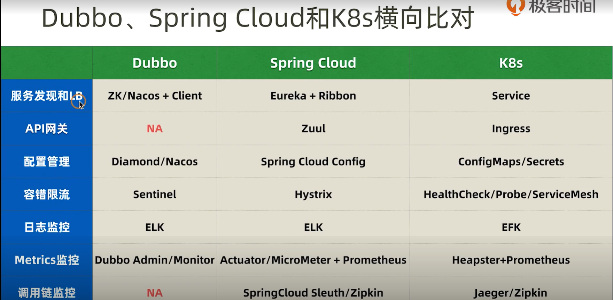

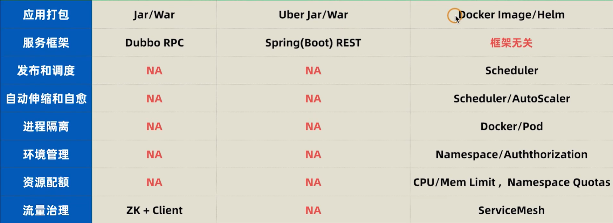

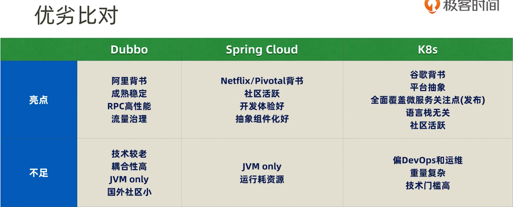

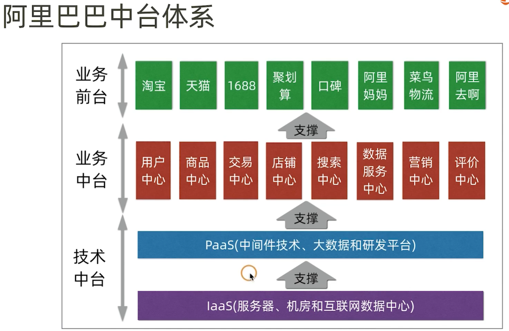

- **谷歌代码仓库 - https://bazel.build**
- **脸书代码仓库 - https://buck.build**

# 微服务开发框架设计和实践

- **接口和实现分离 - 即接口一个 module 实现一个 module**

- **服务接口参数校验（@NotBlank @Email ...）**

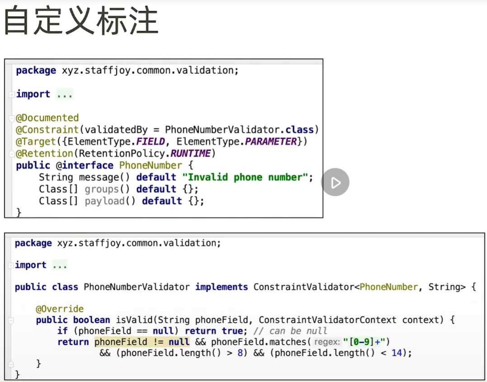

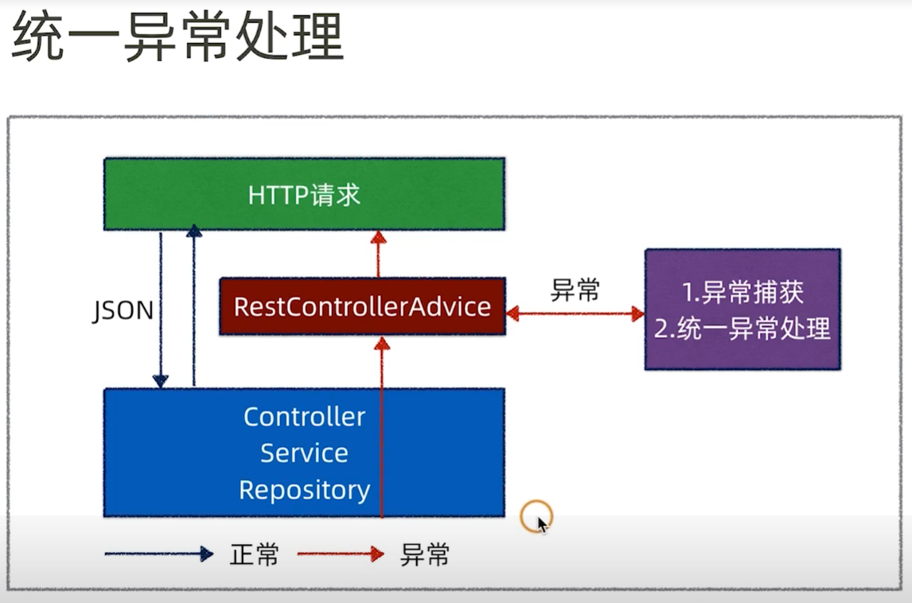

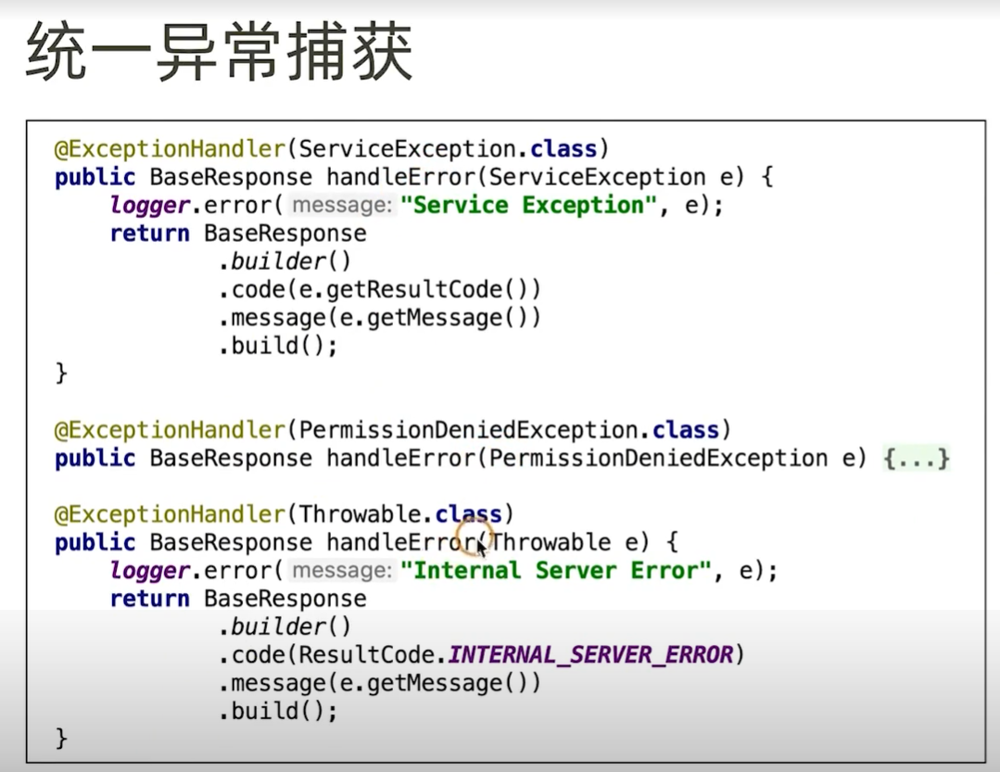

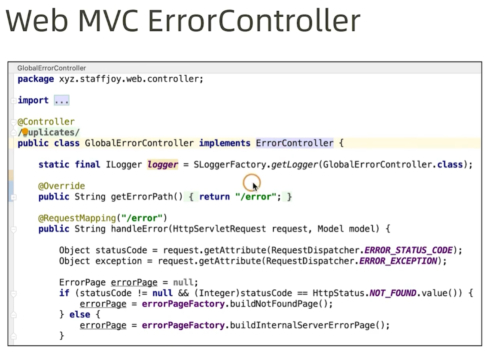

-  **DTO和DMO互转**

> 1. DTO是调用方和被调用方之间互传的参数
> 2. DMO是对应表结构的类型
> 3. 解决方案 - http://modelmapper.org/

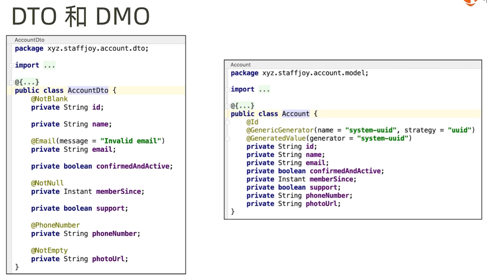

- **设计强类型接口 - Feign**

- **框架层考虑分环境配置（dev,test,prod）**

- **异步调用处理（ThreadPoolTaskExecutor）**

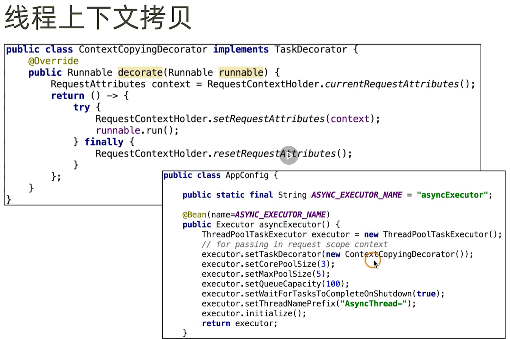

- **Swagger 接口文档**

- **可编程网关设计实践（Geteway）**
- **网关和BFF的演化过**
    - BFF：为前端而开发的后端
    - 网关用于管理BFF，这样多个BFF就可按业务解耦。
  
- **分层**
    - 用户体验层：浏览器，App，H5
    - 网关层
    - BFF层
    - 微服务层
  
- **网关 vs 反向代理：职能一样**
  
- **生产级网关扩展点**
  - 限流熔断
  - 动态路由和负载均衡
  - 基于 Path 的路由（api.xxx.com/xxx）
  - 截获器链
  - 日志采集和 Metrics 埋点
  - 响应流优化

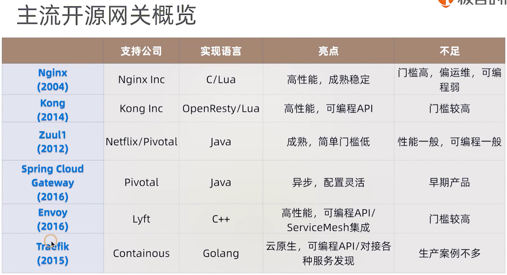

# 安全认证架构

- **认证：识别你是谁**
- **授权：识别你能做什么，具有什么权限**

- **V1阶段：Session + Cookie**
- **V1.1阶段：Web 服务集群会 Session 会不一致**
  - 方法一：通过配置 nginx 可解决（把 Session 绑定到服务上）
  - 方法二：服务器间 Session 同步复制
  - 方法三：无状态服务（即用户信息存放在浏览器，每次请求都发送）

- **V1.5阶段：用 redis 存 Session**
- **Auth3.0阶段：独立的 Auth 服务 + Token**

- **Auth3.5阶段：Token + Geteway**
- **Auth3.6阶段：JWT + Geteway（比3.5轻，适用安全校验不严的服务，类似无状态Session）**
- **JWT（json web token） 原理**
  - JWT 令牌结构：Header + Payload（消息体）+ Signature（签名）
  - JWT 令牌解码：https://jwt.io/
  - pom.xml：com.auth0/java-jwt/3.6.0

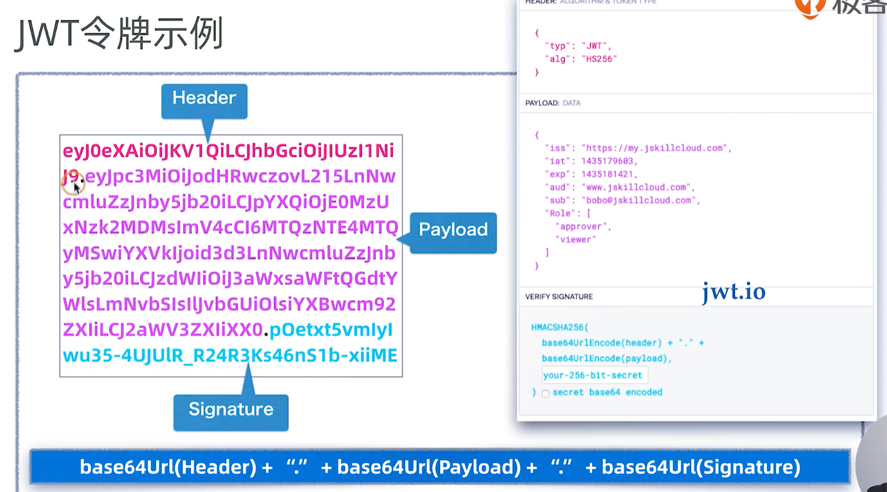