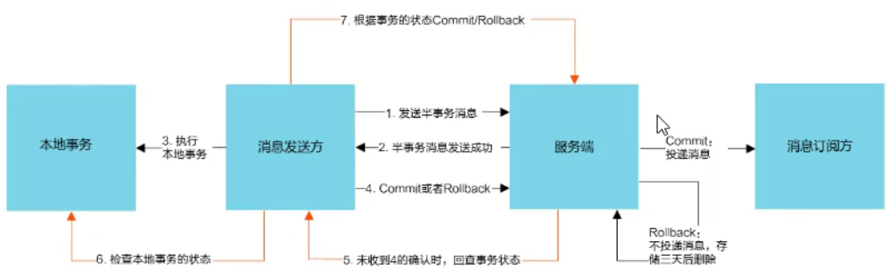
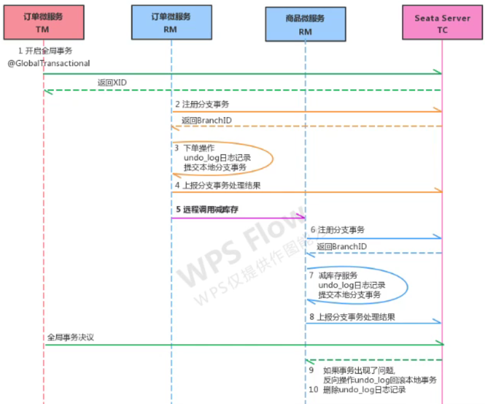

# Cloud 和 Alibaba 区别

| 组件           | SpringCloud                   | CloudAlibaba             |
| -------------- | ----------------------------- | ------------------------ |
| 注册中心       | Eureka                        | nacos                    |
| 消息中间件     | 无 (第三方替代方案：rabbitmq) | RocketMq                 |
| 分布式事务     | 无 (第三方替代方案：2pc)      | Seata                    |
| 分布式调度     | 无 (第三方替代方案：xxl-job)  | Alibaba Cloud SchedulerX |
| 短信平台       | 无                            | Alibaba Cloud SMS        |
| 分布式配置中心 | SpringCloudConfig             | nacos                    |
| 熔断降级       | Hystrix                       | Sentinel                 |

# 微服务架构

服务的原子化拆分（往小了拆，拆到最小为止）

## 1. 生产的问题

1）小服务太多，怎么管理？

2）小服务太多，它们之间如何调用？

3）小服务太多，客户端怎么访问？

4）在一连串调用当中，如果其中一个小服务出问题了，该如何==自==处理？

5）在一连串调用当中，如果其中一个小服务出问题了，程序员怎么排查？

## 2. 常见概念

### 2.1 服务治理

就是服务的自动化管理，其核心是服务的自动注册与发现==（解答上面问题1）==。

**服务注册**：服务实例将自身注册到注册中心。注册中心内部维护一份服务清单，清单里记录每个服务的ip、端口、名称等信息

**服务发现**：比如A服务要调B服务，A会到注册中心里找到B的ip和端口，找到后就可以调用了

**服务剔除**：注册中心将出问题的服务从服务清单中剔除（发送心跳包的方式），使其不会被调用

### 2.2 服务调用

服务与服务之间的调用，目前远程调用有：

- http 的 RESTFul：性能低于RPC，灵活度高于RPC
- TCP 的 RPC：一种进程间通信方式，像调本地服务一样调远程服务，因为 RPC 框架已经封装好了底层通信方式、序列/反序列化等细节

==解决了上面问题2==

### 2.3 服务网关

如果让客户端直接调用微服务，可能会出现：

- 客户端调用不同的 url 地址，增加难度
- 存在跨域请求问题
- 每个服务都需要单独的身份认证

API 网关解决了这仨问题：将所有微服务的入口统一到了网关层。

基本功能有：统一接入、安全防护、协议适配、流量管控、长短连接支持、容错能力。==解决上面问题3==

### 2.4 服务容错

当一连串的服务调用中，其中一个服务不可用了，又没有做服务容错的话，极可能引发雪崩效应（一连串服务不可用）

服务容错三核心：

- 不被外界环境影响
- 不被上游请求压垮
- 不被下游响应拖垮

==解决上面问题4==

### 2.5 链路追踪

在一条完成的业务处理中，记录每一个经过的微服务执行状态（成功或失败、处理时间等），然后存到某个地方，方便查看（日志记录）。==解决上面问题5==

## 3. 常见解决方案

**1）ServiceComb**：前身是华为云的微服务引擎 CES（Cloud Service Engine）云服务，全球首个 Apache 微服务顶极项目。上述提到的问题 ServiceComb 全都能解决。

**2）SpringCloud**

**3）SpringCloudAlibaba**

# Cloud Alibaba 介绍

## 1. 主要功能

1）服务限流降级：默认支持 WebServlet、WebFlux、OpenFeign、RestTemplate、Spring Cloud Gateway、Zuul、Dubbo、RocketMQ 限流降级功能的接入。运行期间可通过控制台实时修改限流降级规则，支持 Metrics 限流降级监控。（限流防止被上级压垮、降级防止被下级拖垮）

2）服务注册与发现：适配 Spring Cloud 服务注册与发现标准，默认集成 Ribbon 支持

3）分布式配置管理：支持分布式系统中的外部化配置，配置更改时自动刷新

4）消息驱动能力：基于 Spring Cloud Stream 为微服务应用构建消息驱动能力

5）分布式事务：使用 @GlobalTransactional 注解，高效并对业务零侵入的解决分布式事务问题

6）阿里云对象存储==（收费）==：阿里云提供的云存储服务支持任何应用、任何时间、任何地点存储和访问任意类型的数据

7）分布式任务调度==（收费）==：提供基于 Cron 表达式任务调度服务。同时提供分布式的任务执行模型（如风格任务）。风格任务支持海量子任务均匀分配到所有 Worker 上执行

8）阿里云短信服务==（收费）==

## 2. 组件

1）Sentinel：用做服务容错。从流量控制（防上级压垮）、熔断降级（防下级拖垮）、系统负载保护等多个维度保护服务的稳定性

2）Nocas：相当于 euerka + config，动态服务发现、配置管理和服务管理

3）RocketMQ：分布式消息系统，发布订阅服务

4）Dubbo：高性能 java RPC 框架

5）Seata：阿里产品，微服务分布式事务解决方案。一个注解就能解决，像做本地事务一样

6）Alibaba Cloud ACM==（收费）==：在分布式环境中对应用配置进行集中管理和推送的`应用配置中心产品`。

7）Alibaba Cloud OSS==（收费）==：阿里云对象存储服务（Object Storage Service，简称OSS）

8）Alibaba Cloud SchedulerX==（收费）==：分布式任务调度

9）Alibaba Cloud==（收费）==：短信服务

# 环境搭建

## 1. 模块设计

1）springcloud-alibaba 父工程

2）shop-common 公共模块（实体类及ORM）

3）shop-user 用户微服务

4）shop-product 商品微服务

5）shop-order 订单微服务

## 2. 版本对应

| cloud      | cloud alibaba | boot          |
| ---------- | ------------- | ------------- |
| Hoxton.SR8 | 2.2.3.RELEASE | 2.3.2.RELEASE |
| Hoxton.SR3 | 2.2.1.RELEASE | 2.2.5.RELEASE |
| Greenwich  | 2.1.x.RELEASE | 2.1.x.RELEASE |
| Finchley   | 2.0.x.RELEASE | 2.0.x.RELEASE |
| Edgware    | 1.5.x.RELEASE | 1.5.x.RELEASE |

查看最新的对应关系：


## 3. 创建父工程

创建一个maven工程后，删除src文件夹，编辑pom.xml：

```xml
<properties>
    <maven.compiler.source>8</maven.compiler.source>
    <maven.compiler.target>8</maven.compiler.target>

    <boot.version>2.5.0</boot.version>
    <cloud.version>2020.0.3</cloud.version>
    <cloud-alibaba.version>2.2.1.RELEASE</cloud-alibaba.version>
</properties>

<parent>
    <groupId>org.springframework.boot</groupId>
    <artifactId>spring-boot-starter-parent</artifactId>
    <version>${boot.version}</version>
</parent>

<dependencyManagement>
    <dependencies>
        <dependency>
            <groupId>org.springframework.cloud</groupId>
            <artifactId>spring-cloud-dependencies</artifactId>
            <version>${cloud.version}</version>
            <type>pom</type>
            <scope>import</scope>
        </dependency>
        <dependency>
            <groupId>com.alibaba.cloud</groupId>
            <artifactId>spring-cloud-alibaba-dependencies</artifactId>
            <version>${cloud-alibaba.version}</version>
            <type>pom</type>
            <scope>import</scope>
        </dependency>
    </dependencies>
</dependencyManagement>
```

## 4. shop-common

```xml
<dependencies>
    <dependency>
        <groupId>org.projectlombok</groupId>
        <artifactId>lombok</artifactId>
        <version>1.18.20</version>
        <scope>provided</scope>
    </dependency>
    <dependency>
        <groupId>com.baomidou</groupId>
        <artifactId>mybatis-plus-boot-starter</artifactId>
        <version>3.4.3</version>
    </dependency>
    <dependency>
        <groupId>mysql</groupId>
        <artifactId>mysql-connector-java</artifactId>
        <version>8.0.25</version>
    </dependency>
    <dependency>
        <groupId>com.alibaba</groupId>
        <artifactId>fastjson</artifactId>
        <version>1.2.76</version>
    </dependency>
</dependencies>
```

```java
// src/main/java/shop/common/domain 下的三个实体类
@Data
@Accessors(chain = true)
public class User extends Model<User> {
    @TableId(type = IdType.AUTO) // 自增主键id
    private Integer id;
    private String userName;
    private String password;
    private String phone;
}

@Data
@Accessors(chain = true)
public class Product extends Model<Product> {
    @TableId(type = IdType.AUTO)
    private Integer id;
    private String name;
    private Double price;
    private Integer stock;
}

@Data
@Accessors(chain = true)
public class Order extends Model<Order> {
    @TableId(type = IdType.AUTO)
    private Long id;
    private Integer userId;
    private String userName;
    private String name;
    private Double price;
    private Integer number;
}
```

## 5. user|order|product

这三个微服务大体上差不多，写一个其它参考就行

```xml
<dependencies>
    <dependency>
        <groupId>org.springframework.boot</groupId>
        <artifactId>spring-boot-starter-web</artifactId>
    </dependency>
    <dependency>
        <groupId>org.example</groupId>
        <artifactId>shop-common</artifactId> <!-- 这里就把lombok、mysql、mybatisplus都加进来了 -->
        <version>1.0-SNAPSHOT</version>
    </dependency>
</dependencies>
```

```yaml
# application.yml
server:
  port: 8071
spring:
  application:
    name: shop-user-service
  datasource:
    driver-class-name: com.mysql.cj.jdbc.Driver
    url: jdbc:mysql://localhost:3306/shop?useUnicode=true&characterEncoding=utf8&serverTimezone=UTC
    username: root
    password: 123
```

```java
// src/java/main/shop/user/mapper
public interface UserMapper extends BaseMapper<User> { }
```

```java
// src/java/main/shop/user/controller
@RestController
public class UserController {
    @GetMapping
    public String index() {
        User usr = new User().setUserName("admin").setPassword("admin").setPhone("1397777777");
        usr.insert();
        return "shop-user-index";
    }
}
```

```java
// src/java/main/shop/user/App
@SpringBootApplication
@MapperScan("shop.user.mapper") // 指定mb的路径
public class App {
    public static void main(String[] args) {
        SpringApplication.run(App.class, args);
    }
}
```

# Nacos

官网：https://nacos.io/zh-cn/ 

文档：https://nacos.io/zh-cn/docs/what-is-nacos.html

下载地址：https://github.com/alibaba/nacos/releases

## 1. 问题

```java
// 写死地址带来的问题
// 1. 一旦服务提供者的地址变了，就得改代码
// 2. 服务提供者一旦做了集群，调用者无法均衡负载去调用
// 3. 一旦微服务越来越多，管理服务清单是个问题
restTemplate.getForObject("http://localhost:8071", User.class);
```

## 2. 启动使用

1）下载、安装、运行 nacos-server。

```bash
startup.cmd -m standalone # 启动

# 访问：http://localhost:8848/nacos
# 默认账号密码：nacos/nacos
```

2）在每个微服务中引用 nacos-client 包并进行配置

```xml
<dependency>
    <groupId>com.alibaba.cloud</groupId>
    <artifactId>spring-cloud-starter-alibaba-nacos-discovery</artifactId>
</dependency>
```

```java
@SpringBootApplication
@EnableDiscoveryClient // 开启客户端
public class App { SpringApplication.run(App.class, args); }
```

```yaml
spring:
  cloud:
    nacos:
      discovery:
        server-addr: localhost:8848 # 为该微服务添加注册中心地址

# 最后启动微服务，在 nacos 的web页面里找 “服务管理 -> 服务列表” 可以看到刚启动的微服务已经注册到服务列表里了
```

3）微服务A调用B，从 nacos 里拿到 B 的地址极端口，然后调用

```java
@Autowired
private RestTemplate restTemplate;
@Autowired
private DiscoveryClient discovery; // 服务发现客户端

@GetMapping
public User index() {
    // 根据服务名获取服务信息，因为同一个微服务可能是集群，所以返回list
    // 参数是 application.yml 里配置的 spring.application.name
    List<ServiceInstance> list = discovery.getInstances("shop-user-service");
    ServiceInstance ins = list.get(0); // 这里存在个问题，如果是多台同名服务（集群），每次都只调第一个。。。参考下面负载均衡
    String url = "http://" + ins.getHost() + ":" + ins.getPort(); // 拼要调用哪个服务的 url

    return restTemplate.getForObject(url, User.class);
}
```

## 3. 服务配置

微服务架构下关于配置文件的一些问题：

1. 配置文件相对分散，随着微服务的增多，配置文件会越来越多，且分散在各个微服务中，不好统一配置和管理
2. 配置文件无法区分环境，如：开发、测试、预发布、生产。每个环境理论上是不同的配置文件，一旦要改，就得到各个微服务下改，太麻烦
3. 配置文件无法实时更新。一般n入了配置文件必需重启服务才生效，对正在运行的项目来说不友好

**配置中心**解决了上面3个问题，其思路是：

- 先把项目各种配置全集中到一个地方统一管理，并提供一套标准接口
- 当各个服务需要获取配置时，就来配置中心接口拉取自己的配置
- 当配置中心的各种参数有更新时，也能通知各服务实时同步最新的配置，使之动态更新


业界常见的配置中心：

- **Apollo**：携程开源的
- **Disconf**：百度开源的，基于 zookeeper 实现
- **Spring Cloud Config**：缺点没有可视化界面，修改配置后需要重启或刷新
- **Nacos**：弥补了 spring cloud config 的缺点

### 3.1 搭建环境

将 nacos 当作一个服务器，将各微服务看成客户端，将客户端的配置文件统一存放在 nacos 上，然后各微服务从 nacos 上摘取配置

```xml
<dependency> <!-- 1. 在微服务中添加依赖 -->
    <groupId>com.alibaba.cloud</groupId>
    <artifactId>spring-cloud-starter-alibaba-nacos-config</artifactId>
</dependency>
```

```bash
# 2. 剪切微服务 application.yml 里的内容到 nacos 控制台（配置管理 -> 配置列表 -> 点右侧 + 号）
#		2.1 粘贴到`配置内容`中去
#		2.2 `配置格式`选yaml
#		2.3 `描述`随便写个
#		2.4 `* Group` 默认就好
#		2.5 `* Data ID` 为 [shop-product-service-dev.yml]，即 "3." bootstrap.yml 里的：
#				shop-product-server   -         dev             .yml
#			${spring.application.name}-${spring.profiles.active}.${spring.cloud.nacos.config.file-extension}
#		2.6 最后点`发布`
```

```yaml
# 3. 从 nacos 里拉取配置
#		3.1 创建 resources/bootstrap.yml 文件（不能用 application.yml）
#			springboot配置文件的优先级为：
#				bootstrap.properties -> bootstrap.yml -> application.properties -> application.yml
#		3.2 内容为：
spring:
  application:
    name: shop-product-service
  cloud:
    nacos:
      config:
        server-addr: localhost:8848 # nacos 服务地址
        file-extension: yml # 往 nacos 里存放配置文件的格式（上一步`配置格式`里选的 YAML）
  profiles:
    active: dev # 表示使用开发环境
```

```bash
# 4. 点运行，结果正常运行
# 5. 访问该微服务里的任一接口，OK 正常！
```

### 3.2 配置动态刷新

```yaml
abc: # 1. 在 nacos 的配置文件里加上一组配置
  efg: haha
```

```java
// 2. 编码方式读取配置内容
@Autowired
private ConfigurableApplicationContext ctx;

@GetMapping("abc")
public String abc() {
    return ctx.getEnvironment().getProperty("abc.efg"); // 结果：haha
}
// 此时修改 nacos 的配置信息（haha hello world）后再次刷新画面，结果：haha hello world
```

```java
// 3. 注入方式获取配置内容
@Value("${abc.efg}")
private String str; // 此时修改 nacos 配置后再刷新画面，发现没有取最新的

@RefreshScope // 只要在 controller 上加这个注解，就能实现 @Value 实时获取 nacos 的配置了
public class ProductController
```

```java
// 4. 本地配置文件获取 nacos 上的配置信息
config:  // 本地 bootstrap.yml 里加上
  abc: ${abc.efg} // 读取 nacos 上的 abc.efg

@RefreshScope
public class ProductController {
    @Autowired
    private ConfigurableApplicationContext ctx;
    @Value("${config.abc}") // 改成从本地配置里拿
    private String str;

    @GetMapping("abc")
    public String abc() {
        return str + "," + ctx.getEnvironment().getProperty("config.abc"); // 实时修改 nacos 也都OK
    }
}
```

### 3.3 配置共享

当配置越来越多时会发现，有很多配置项是重复的，此时可以把重复的配置提取到**公共配置**里。分成两大类别：

1. **同一微服务的不同环境之间共享配置**

   ```yaml
   # 1. 在 nacos 上新建公共配置：shop-product-service.yml（把环境部分去掉）
   # 2. 然后将原来 dev 里的内容全部拷过来（除abc.efg）
   ```

   ```yaml
   # 3. dev 环境：shop-product-service-dev.yml
   abc:
     efg: dev
   ```

   ```yaml
   # 4. test 环境：shop-product-service-test.yml
   abc:
     efg: test
   # 5. 最后跑 3.2 的代码，切换环境跑，结果 OK
   ```

2. **不同微服务之间共享配置**

   实现原理类似于文件引入，就是创建一个公共配置文件，然后在当前配置中引入

   ```yaml
   common: # 1. 创建公共配置文件 app-common.yml
     sys-name: alibaba
   ```

   ```yaml
   spring:
     cloud:
       nacos:
         config: # 2. 在本地配置文件 bootstrap.yml 里引入 app-common.yml
           shared-configs[0]: # [0] 表示可以配置多个公共配置文件
             data-id: app-common.yml # 引入公共配置（老版本的shared-dataids将被废弃）
             group: DEFAULT_GROUP # 组。即 nacos 上的 * Group:，默认 DEFAULT_GROUP
             refresh: true # 实时刷新（默认false）（老版本的refreshable-dataids将被废弃）
   ```

   ```java
   config: // 3. 测试
     abc: ${common.sys-name} // 修改本地 bootstrap.yml
   
   @GetMapping("abc")
   public String abc() {
       return str + "," + ctx.getEnvironment().getProperty("common.sys-name"); // 改成 common.sys-name
   } // 访问页面 OK，修改 app-common.yml 后，再刷新也 OK
   ```

### 3.4 命名空间

https://www.bilibili.com/video/BV1R7411774f?p=70&spm_id_from=pageDriver

# Ribbon

## 1. 介绍

根据负载均衡发生的位置，一般分为：

- 服务端负载均衡：发生在服务提供者一方，如常见的 nginx
- 客户端负载均衡：发生在请求端一方，即在请求之前就选好了调哪个服务

## 2. 使用

Ribbon 是 Spring Cloud 的一个组件，用一个注解就能轻松搞定负载均衡。步骤：

1. 在 RestTemplate 的创建方法上添加 @LoadBalanced 注解

   ```java
   @Bean
   @LoadBalanced // 加注解
   public RestTemplate restTemplate() {
       return new RestTemplate();
   }
   ```

2. 修改服务调用方法

   ```java
   @GetMapping
   public User index() {
       // shop-user-service 为application.yml 里配置的 spring.application.name
       // shop-user-service 启动一个以上实例
       return restTemplate.getForObject("http://shop-user-service", User.class);
       // 这么写带来的问题：
       // 1. 可读性不好
       // 2. 风格不统一（本地服务用service调，而远程是restTemplate）
       // 解决办法用 Fegin，下面介绍
   }
   ```

## 3. 负载均衡策略

7种负载均衡策略：

| 名称                       | 策略描述               | 实现说明                                                   |
| -------------------------- | ---------------------- | ---------------------------------------------------------- |
| BestAvailableRule          | 选择一个最空闲的server | 逐个考查server，选择其中 ActiveRequestsCount 最小的 server |
| RoundRobinRule==（默认）== | 轮循方式选择 server    | 轮循 index 选择对应的 server                               |

太多了，不写了 https://www.cnblogs.com/zhangjianbin/p/7157709.html


> 使用：

```yaml
# 在上游服务的 application.yml 里加上下面的配置
shop-user-service: # 下游服务名，因为客户端均衡负载是在调用前决定好了的。所以这个配置说明下游服务要做均衡负载
  ribbon:
    NFLoadBalancerRuleClassName: com.netflix.loadbalancer.RandomRule # 默认轮循，这里给改成随机。测试效果OK
```

# Feign

是 Spring Cloud 提供的声明式 Http 客户端，使得远程调用就像调用本地服务一样简单。只需要创建个接口并添加个注解即可。feign集成了 Ribbon，所以 Nacos 下的 feign默认实现了均衡负载。实现步骤：

1）上游服务添加依赖

```xml
<dependency>
    <groupId>com.alibaba.cloud</groupId>
    <artifactId>spring-cloud-starter-alibaba-nacos-discovery</artifactId>
    <exclusions><!-- 3. 将 ribbon 从依赖里移除掉。因为nacos中，ribbon会造成loadbalancer失效 -->
        <exclusion>
            <groupId>org.springframework.cloud</groupId>
            <artifactId>spring-cloud-starter-netflix-ribbon</artifactId>
        </exclusion>
    </exclusions>
</dependency>
<dependency><!-- 1. 添加openfeign -->
    <groupId>org.springframework.cloud</groupId>
    <artifactId>spring-cloud-starter-openfeign</artifactId>
</dependency>
<dependency><!-- 2. 添加loadbalancer，否则跑不起来 -->
    <groupId>org.springframework.cloud</groupId>
    <artifactId>spring-cloud-starter-loadbalancer</artifactId>
</dependency>
```

2）上游服务添加注解

```java
@SpringBootApplication
@EnableDiscoveryClient
@EnableFeignClients // 开启 feign
public class App {
    public static void main(String[] args) {
        SpringApplication.run(App.class, args);
    }

    @Bean
    @LoadBalanced
    public RestTemplate restTemplate() {
        return new RestTemplate();
    }
}
```

3）上游服务创建一个 service，并用 Fegin 实现微服务调用

```java
@FeignClient("shop-user-service") // 1. 下游服务的名（yml 里的 spring.application.name）
public interface ProductService {
    @GetMapping("/{id}")          // 2. 和下游服务的 controller 里的接口访问方式一样
    User getUser(@PathVariable Integer id);
}
```

4）修改调用方服务的 controller

```java
@Autowired
private ProductService service;

@GetMapping("user/{id}")
public User index(@PathVariable Integer id) {
    return service.getUser(id);
}
```

# 处理高并发

## 1. 高并发带来的问题

在微服务架构中，将业务拆分成一个个服务，服务与服务间相互调用。但由于网络或其它原因，服务并不能保证100%可用。如果单个服务出问题，调用该服务会出现延迟，此时若大量请求涌入，会形成任务堆积，最终导致服务瘫痪。

> **模拟个高并发场景**

```yaml
server:
  tomcat:
    threads:
      max: 10 # 默认最大线程数有点大，这里给改小一点，方便测试
```

```java
@GetMapping("{id}") // 用jmeter发送20线程1秒100请求这个接口
public User index(@PathVariable Integer id) throws InterruptedException {
    Thread.sleep(2000); // 阻塞2秒
    return new User().selectById(id);
}

@GetMapping("msg") // 然后用浏览器访问这个接口，此时发现明显变慢
public String msg() { return "haha"; }
```

> 总结：由此发现，index 方法堆积了大量请求，导致msg方法访问出现了问题，这是就==服务雪崩==的雏形

## 2. 服务雪崩效应

分布式系统中，当一个服务由于网络或其它原因导致阻塞，此时有大量请求涌入，就会多条线程阻塞，进而服务瘫痪。

由于服务与服务间依赖性，故障会传播，对整个微服务系统造成灾难性后果，这就是==雪崩效应==。

> 举个例子：假如有A、B、C三个服务，B调C，A调B。
>
> - 当C挂掉后，B在调用C时，B会阻塞；此时B里会堆积大量的线程阻塞，直到B也挂掉
> - 当B也挂掉后，A调用B时，A也会阿克塞；此时A里也会规程大量线程阻塞，最后A也挂掉了
> - 就这样一级一级的向上传播，直到整个微服务系统都挂掉。。。（没错雪崩了）

## 3. 常见容错方案

防止雪崩扩散，要做好服务容错，容错说白了就是**保护自己不被猪队友拖垮**的一些措施。

常见的容错思路有：

- 隔离：将系统按一定规则划分为若干个模块，各模块间相对独立无强依赖。当故障发生时，能将问题和响应隔离在某个模块内，实现不扩展、不波及其它模块，不影响整体服务。方法有**线程池隔离**和**信号量隔离**
- 超时：上游服务调下游时，设置最大响应时间，如果下游超时未反应，就断开请求释放线程
- 限流：限制输入输出浏览。比如1秒内只接收3个请求，多了要么排除，要么丢弃
- 熔断：当下游压力大变慢或失败，上游服务为保护整体系统，可暂时切断对下游的调用。这种牺牲局部保护整体叫**熔断**
  - 熔断三种状态：
    - 熔断关闭状态（Closed）：无故障时的熔断状态，不做任何限制
    - 熔断开启状态（Open）：对该服务的调用不再经过网络，直接执行 fallback 方法
    - 半熔断状态（Half-Open）：尝试恢复服务调用，允许有限的流量调用该服务，并监控成功率。如果成功率达到预期，则进入熔断关闭状态；如果成功率仍旧很低，则重新进入熔断状态
- 降级：为服务提供一个托底方案，一旦服务无法正常调用，就用托底方案

## 4. 容错组件

1）Hystrix：由 Netflix 开源的延迟和容错库，用于隔离访问远程系统，防止级联失败==（已停止维护）==

2）Resilience4J：一款轻量、简单，并且文档清晰、丰富的熔断工具。是 Hystrix 官方推荐的替代品。还支持 Spring Boot 1.x/2.x，支持第三方监控组件如 prometheus 等多款主流产品整合。

3）Sentinel：阿里开源的断路器，阿里内部大规模采用，非常稳定

> **三款组件的对比：**

|                | Sentinel                               | Hystrix                | resilience4j             |
| -------------- | -------------------------------------- | ---------------------- | ------------------------ |
| 隔离策略       | 信号量隔离（并发线程数限流）           | 线程池隔离/信号量隔离  | 信号量隔离               |
| 熔断降级策略   | 基于响应时间、异常比率、异常数         | 基于异常比率           | 基于异常比率、响应时间   |
| 实时统计       | 滑动窗口（LeapArray）                  | 滑动窗口（基于RxJava） | Ring Bit Buffer          |
| 动态规则配置   | 支持多种数据源                         | 支持多种数据源         | 有限支持                 |
| 扩展性         | 多个扩展点                             | 插件形式               | 接口形式                 |
| 基于注解的支持 | 支持                                   | 支持                   | 支持                     |
| 限流           | 基于 QPS，支持基于调用关系的限流       | 有限支持               | Rate Limiter             |
| 流量整形       | 支持预热模式、匀速器模式、预热排除模式 | 不支持                 | 简单的 Rate Limiter 模式 |
| 系统自适应保护 | 支持                                   | 不支持                 | 不支持                   |

# Sentinel

## 1. 介绍

从流量为切入点，从**流量控制、熔断降级、系统负载保护**等多个维度来保护服务的稳定性

**具有如下特征：**

- 丰富的应用场景：秒杀（突发流量控制在可承受范围）、消息消峰、集群流量控制、实时熔断下游不可用服务
- 完备的实时监控：提供了实时监控功能。通过控制台可看到接入应用的单台机器秒级数据，甚至500台以下规模集群的汇总运行情况
- 广泛的开源生态：提供开箱即用，与其它开源框架整合模块，如 Spring Cloud、Dubbo、gRPC 的整合
- 完善的 SPI 扩展点：提供简单易用、完善的 SPI 扩展接口，如定制规则管理、适配动态数据源

**分为两部分：**

- 核心库（Java 客户端）不依赖任何框架，能够运行于所有 java 运行时环境，同时对 Dubbo / Spring Cloud 等框架也有固然好的支持
- 控制台（Dashboard）基于 Spring Boot 开发，打包后可以直接运行，不需要额外的 Tomcat 等容器

## 2. 安装运行

1）下载地址：https://github.com/alibaba/sentinel/releases

2）启动sentinel控制台

```bash
# 进到目录后直接运行命令
java -Dserver.port=8000 -Dcsp.sentinel.dashboard.server=localhost:8000 -Dproject.name=sentinel-dashboard -jar sentinel-dashboard-1.8.1.jar
# 运行起来后访问：http://localhost:8000
# 账号密码：sentinel/sentinel
```

3）微服务添加依赖

```xml
<dependency>
    <groupId>com.alibaba.cloud</groupId>
    <artifactId>spring-cloud-starter-alibaba-sentinel</artifactId>
</dependency>
```

4）配置微服务连 sentinel

```yaml
spring:
  cloud:
    sentinel:
      transport:
        port: 9999 # 跟控制台通信的端口，可以随便写个没被占用的
        dashboard: localhost:8000 # 控制台服务地址
```

4）启动这个微服务，然后刷新控制台，发现没有连上！因为控制台是懒加载的，要先访问下微服务后才有效果。访问下微服务后：


OK 成功！

## 3. 通信原理

控制台与微服务间的通信原理：

- 微服务通过 spring.cloud.sentinel.transport.dashboard 将自己注册到控制台里
- 然后控制台与微服务就可以通过 spring.cloud.sentinel.transport.port 进行通信了

## 4. 给接口限流

添加一个简单的流控规则，限制某个接口每秒钟可访问两次

1）控制台 -> 左侧微服务 -> 簇点链路 -> 在右侧列表里选个接口 -> “+流控” 按钮

2）在弹出的窗口中选 “阈值类型 = QPS”，“单机阈值 = 2”，代表每秒只能访问2次，最后点“新增”

3）在浏览器里快速刷新刚被流控的接口后，发现页面上返回 “Blocked by Sentinel (flow limiting)”。OK，流控成功

## 5. 概念和功能

### 5.1 基本概念

> **资源**

是 Sentinel 的关键概念。它可以是 java 程序中任何内容，可以是个服务、是个方法、甚至一段代码

> **规则**

作用在资源之上，定义以什么样的方式保护资源，主要包括流量控制规则、熔断降级规则以及保护规则

### 5.2 重要功能

Sentinel 主要功能就是容错，体现为下面三个：

- 流量控制：根据系统处理能力对流量进行控制，Sentinel 作为一个调配器，可根据需要把随机请求调整成合适的形状
- 熔断降级：调用链中当检测到某个资源表现不稳定时，则对其进行限制，让请求快速失败，避免影响其它资源而导致级联故障
  - Sentinel 对这个问题采取两种手段：
    - 限制资源并发线程数量
    - 限制响应时间，当资源出现响应时间过长后，对该资源的访问都会被直接拒绝
- 系统负载保护：上两项是资源维度，这项则是系统维度。在集群环境下，会把本机流量转发给其它机器上，如果其它机器也边缘状态（非常忙），Sentinel 提供对应的保护机制，让入口流量和系统的负载达到一个平衡，保证在能力范围之内处理最多请求。

> **和 Hystrix 的区别**
>
> 在限制手段上，采取了完全不同的方法：
>
> - Hystrix：采用线程池隔离方式，优点是做到了资源间隔离；缺点是增加了线程切换成本
> - Sentinel：采用并发线程数量和响应时间来对资源限制

## 6. 规则配置

规则有：流控规则、降级规则、热点规则、系统规则、授权规则。前三个最常见

### 6.1 流控规则

就是流量控制。原理是监控应用流量的QPS（每秒查询率）或并发线程数等指标，当达到指定阈值时，对流量进行控制。

具体操作参照上面 `4.给接口限流`

`新增流控规则`画面项目说明：

- 针对来源：针对哪个微服务限流（比如A和B都要调用该接口，是给A还B限流）。默认 default 不区分来源

- 阈值类型：选`QPS`且`单机阈值`=3，代表每秒允许访问3次；选`线程娄`且`单机阈值`=3，代表最大并发3个线程

- 是否集群：

- 高级选项

  - 流控模式

    - 直接：接口达到限流条件时，开启限流（**默认**）

    - 关联：当关联资源达到限流条件时，本资源开启限流。该选项需要填写`关联资源`。

      - 适合做应用让步，比如当关联资源update达到限流条件了，那么本资源query就限下流，让update多占流量执行

    - 链路：（用的不多）和`关联`差不多，区别在于

      - `关联`是==针对上级服务==，而`链路`是==针对上级接口==，也就是`链路`粒度更细
      - 需要在微服务里额外加代码

      ```xml
      <dependency> <!--  1. 引入 com.alibaba.csp.sentinel.adapter.servlet.CommonFilter -->
          <groupId>com.alibaba.csp</groupId>
          <artifactId>sentinel-web-servlet</artifactId>
      </dependency>
      ```

      ```java
      import com.alibaba.csp.sentinel.adapter.servlet.CommonFilter; // 由上面的依赖引入
      import org.springframework.boot.web.servlet.FilterRegistrationBean;
      import org.springframework.context.annotation.Bean;
      import org.springframework.context.annotation.Configuration;
      
      @Configuration
      public class SentinelConfig {
          @Bean // 2. 添加设置 FilterRegistrationBean
          public FilterRegistrationBean sentinelFilterRegistration() {
              FilterRegistrationBean bean = new FilterRegistrationBean();
              bean.setFilter(new CommonFilter());
              bean.addUrlPatterns("/*");
              // 入口资源关闭聚合
              bean.addInitParameter(CommonFilter.WEB_CONTEXT_UNIFY, "false");
              bean.setName("sentinelFilter");
              bean.setOrder(1);
              return bean;
          }
      }
      ```
      
      ```java
      @Service
      public class UserService {
          @SentinelResource("send") // 3. 添加一个service，并且命名为 “send”
          public String send() {
              return "send";
          }
      }
      ```
      
      ```java
      public class UserController {
          @Autowired
          private UserService service;
      
          @GetMapping("msg1")
          public String msg1() {
              return service.send(); // 4. msg1 和 msg2 两个接口调用 send
          }
      
          @GetMapping("msg2")
          public String msg2() {
              return service.send();
          }
      }
      ```
      
      ```bash
      # 5. 在 Sentinel 控制台里按下图设置好后，在浏览器里狂刷 /msg2 后会有错误画面，代理流控起作用了
      ```
      
      
  
  - 流控效果：当服务被流控了，以一个什么效果去处理
  
    - 快速失败：会直接抛一个异常内容，不做任何额外处理。这个内容可以自定义，后面会介绍
    - Warm Up（预热）：从开始阈值到最大QPS阈值有个缓冲阶段。开始是最大QPS阈值的1/3，后慢慢增长，直到最大阈值。适用突然增大流量，转换为缓步增长的场景
    - 排除效果：需要设一个`超时时间`，如果排除超过这个时间就会抛异常

### 6.2 降级规则

设置满足什么条件时，对服务进行降级。Sentinel 提供了三个衡量条件（==熔断策略==项）：

- 慢调用比例：当资源平均响应时间超过==最大RT==(ms)后，资源进入==准（不是立即）==熔断状态。若1s内持续==最小请求数==个请求都持续超过==最大RT==，接下来就会熔断==熔断时长==（秒）。==熔断时长==过后恢复正常，然后接着判断是否再熔断

  

  > 设置好后，浏览器里狂刷 /msg2，触发熔断后就会熔断30秒

- 异常比例：当每秒异常数的比例超过==比例阈值==后，进行熔断

  ```java
  int i = 0;
  @GetMapping("msg1")
  public String msg1() {
      i++;
      if (i % 3 == 0) throw new RuntimeException(); // 每3次异常1次，异常率33%
      return service.send();
  }
  ```

  

  > 狂刷 /msg1 后熔断

- 异常数：当1分钟内的异常数超过==异常数==，则熔断。==注意：`熔断时长`一定要大于1分钟==

### 6.3 热点规则

是一种更细粒度的流控规则，允许将规则具体到参数上

#### 6.3.1 简单限流

```java
@GetMapping("msg2")
@SentinelResource("热点") // 下面图中的 “热点”
public String msg2(String name, Integer age) {
    return "msg2：" + name + "," + age;
}
```


> 狂刷 http://localhost:8010/msg2?name=haha 后会熔断（参数name必须给，否则不会熔断）

#### 6.3.2 高级选项

这个例子是给 age = 7 时不限流


> 狂刷 http://localhost:8010/msg2?age=7 后不会熔断，其它数字则会熔断

### 6.4 授权规则

当需要根据调用来源判断请求是否放行时，可使用 Sentinel 的来源访问控制功能：

- 若配白名单，则白名单内的请求才能通过，其余不能通过
- 若配黑名单，则黑名单内的请求不能通过，其余能通过

```java
// 1. 先要实现一个请求解析器

//import com.alibaba.csp.sentinel.adapter.servlet.callback.RequestOriginParser;         // 旧版的 v2.1.x 不好用
  import com.alibaba.csp.sentinel.adapter.spring.webmvc.callback.RequestOriginParser;   // 新版的 v2.2.1 好用

@Component
public class OriginDefinition implements RequestOriginParser {
    @Override
    public String parseOrigin(HttpServletRequest r) {
        return r.getParameter("serviceName"); // 浏览器请求时一带 serviceName 参数
    }
}
```


### 6.5 系统规则

是从应该级别的入口流量进行控制的，前4种都是资源级别的，而`系统规则`则是系统级别的。系统保护规则的五个维度：

- Load（仅对Linux/Unix-like 机器生效）：当系统 Load1（1分钟内平均负载，linux 下的 load1、load5、load15）超过阈值，具系统前梁的并发线程数超过系统容量才会触发系统保护。系统容量由系统的 maxQps * minRt 计算得出。设定参考值一般为 CPU cores * 2.5
- RT（响应时间）：当单台机器上所有入口流量的平均 RT 达到阈值即触发系统保护（单位毫秒）
- 线程数：当单台机器上所有入口流量的并发线程数达到阈值即触发系统保护
- 入口QPS：当单台机器上所有入口流量的 QPS 达到阈值即触发系统保护
- CPU使用率：当单台机器上所有入口流量的 CPU 使用率达到阈值即触发系统保护

> ==很少用，一般属于运维的活儿==

## 7. 自定义异常规则

```java
@Component // sentinel 1.8 版本是 BlockExceptionHandler，1.8 以前版本是 UrlBlockHandler
public class ExceptionSentinelPage implements BlockExceptionHandler {
    @Override
    public void handle(HttpServletRequest req, HttpServletResponse res, BlockException e) throws Exception {
        res.setContentType("application/json;charset=utf-8"); // 防汉字乱码
        String d = null;

        if (e instanceof FlowException)        d = "限流异常";
        if (e instanceof DegradeException)     d = "降级异常";
        if (e instanceof ParamFlowException)   d = "参数限流异常";
        if (e instanceof AuthorityException)   d = "授权异常";
        if (e instanceof SystemBlockException) d = "系统负载异常";
        if (e instanceof BlockException)       d = "上面5个异常都会走 BlockException，因为是上面5个的父类";

        res.getWriter().write(d);
    }
}
// 最后添加一个流控后，页面上刷两下就出来自定义信息了
```

## 8. @SentinelResource

```java
@Service
public class UserService {
    // value 属性：给资源命名
    // blockHandler 属性：当资源发生了 BlockException 时调用的方法
	// fallback 属性：当资源发生了 Throwable 时调用的方法
    // 注意：在 sentinel 管理画面中添加流控时，一定要在 send 资源上加，而不是在父节点接口上加，切记！！！
    @SentinelResource(value = "send", blockHandler = "a", fallback = "b")
    public String send() {
        i++;
        if (i % 3 == 0) throw new RuntimeException(); // 当异常抛出，会走 b 方法
        return "send";
    }

    // 要求：
    // 1. 返回值和参数要和 send 方法一样
    // 2. 但允许在最后一个参数加上一个 BlockException，用来接收 send 方法中属于哪个流控
    // 当方法 a 被注掉后，会直接走 b 方法
    public String a(BlockException e) { return "blockHandler"; }
    
    // 要求：
    // 1. 返回值和参数要和 send 方法一样
    // 2. 但允许在最后一个参数加上一个 Throwable
    public String b(Throwable e) { return "fallback"; }
}
```

> 上面方法写的比较臃肿，可以把 a 和 b 方法拿到另一个类里

```java
@Service
public class UserService {
    int i = 0;
    @SentinelResource(
        value = "send",
        blockHandlerClass = BlockAndFallHandler.class, blockHandler = "a", // 指定类和方法
        fallbackClass = BlockAndFallHandler.class, fallback = "b"          // 指定类和方法
    )
    public String send() {
        i++;
        if (i % 3 == 0) throw new RuntimeException(); // 当异常抛出，会走 b 方法
        return "send";
    }
}
```

```java
public class BlockAndFallHandler { // 1. class 必须是 public
    public static String a(BlockException e) { return "blockHandler"; } // 2. 方法必须是 public static
    public static String b(Throwable e) { return "fallback"; }
}
```

## 9. 规则持久化

在控制台中设置的流控默认放在内存中，当微服务重启就会消失。Sentinel 支持将规则持久化到文件中，Sentinel 会定时轮询该文件是否变化并读取最新规则。这样即可以通过修改文件、也可以通过控制台设置最新规则。

实现方式：

1. 版本调整到下面 ==`10. Feign 整合`==
2. 参考 https://www.cnblogs.com/huqi96/p/13629024.html

> 1.8 和以前版本方式不一样

## 10. Feign 整合

当 .yml 里添加 `feign.sentinel.enabled=true` 时总报 `Unsatisfied dependency expressed through field` ，大概是说循环依赖了。。。没办法，重新对应版本吧

```xml
<!-- 1. 重新调整版本 -->
<spring-cloud.version>Hoxton.SR8</spring-cloud.version>
<spring-cloud-alibaba.version>2.2.3.RELEASE</spring-cloud-alibaba.version>
<spring-boot.version>2.3.2.RELEASE</spring-boot.version>
```

```xml
<!-- 2. 上游服务引入依赖 -->
<dependency>
    <groupId>com.alibaba.cloud</groupId>
    <artifactId>spring-cloud-starter-alibaba-nacos-discovery</artifactId>
    <!-- 重新调整版本后这里要注掉 -->
    <!--            <exclusions>-->
    <!--                <exclusion>-->
    <!--                    <groupId>org.springframework.cloud</groupId>-->
    <!--                    <artifactId>spring-cloud-starter-netflix-ribbon</artifactId>-->
    <!--                </exclusion>-->
    <!--            </exclusions>-->
</dependency>
<dependency>
    <groupId>org.springframework.cloud</groupId>
    <artifactId>spring-cloud-starter-openfeign</artifactId>
</dependency>
<dependency>
    <groupId>org.springframework.cloud</groupId>
    <artifactId>spring-cloud-starter-loadbalancer</artifactId>
</dependency>
<dependency>
    <groupId>com.alibaba.cloud</groupId>
    <artifactId>spring-cloud-starter-alibaba-sentinel</artifactId>
</dependency>
```

```yaml
feign: # 3. 上游服务添加配置
  sentinel:
    enabled: true # 开启 sentinel 对 feign 的支持
```

```java
// 4. 上游服务创建容错类
//   1）需要实现 Feign 所在的接口中的方法
//   2）一旦 Feign 调用出问题，就会进入该类中同名方法执行容错逻辑
@Service
public class ProductServiceFallBack implements ProductService {
    @Override
    public User getUser(Integer id) {
        return new User().setId(-1).setUserName("Feign调用失败！");
    }
}
```
```java
@FeignClient(value = "shop-user-service", fallback = ProductServiceFallBack.class) // 5. 设定 fallback
public interface ProductService {
    @GetMapping("/{id}")
    User getUser(@PathVariable Integer id);
}
```

> 上面方法有个缺陷，就是没法记录异常，即不知道在哪个环节出了问题。改为：

```java
@Component // 1. 实现 FallbackFactory
public class ProductServiceFallBack implements FallbackFactory<ProductService> {
    @Override
    public ProductService create(Throwable e) {
        // 这里可以根据 e 来记录log
        return id -> new User().setId(-1).setUserName("Feign调用失败！");
    }
}
```

```java
@FeignClient(value = "shop-user-service", fallbackFactory = ProductServiceFallBack.class) // 2. 设定 fallbackFactory
public interface ProductService {
    @GetMapping("/{id}")
    User getUser(@PathVariable Integer id);
}
```

# 服务网关

## 1. 介绍

学到这里，架构还存在如下问题：

1. 客户端需要维护很多服务端的地址
2. 认证、鉴权复杂（可能每个微服务都需要鉴权）
3. 跨域问题

上面问题可以借助**API网关**来解决。

> 所谓网关，就是指系统的统一入口，一些与业务无关的公共逻辑都可在这里实现。如：认证、鉴权、监控、路由转发等。网关也是一个微服务，也可注册到 Nocas 上。

业界比较流行的网关有：

- nginx + lua：lua 是一种可编写简单逻辑的脚本语言，nginx 支持 lua
- kong：基于 nginx + lua 开发，有多个插件（限流、鉴权等）可开箱即用。只支持 http 协议，二次开发、扩展困难；提供管理 API，缺乏易用的管控、配置方式
- zuul：netflix 开源的网关，java 开发，功能丰富，易于二次开发。但缺乏管控，无法动态配置，依赖组件较多，处理 http 依赖 web 容器，性能不如 nginx
- spring cloud gateway：spring 公司为替换 zuul 而开发的网关服务

==Spring Cloud alibaba 中没有提供自己的网关，可以采用 Spring Cloud Gateway 来做网关==

## 2. Gateway 简介

Spring Cloud Gateway 是 Spring 公司基于 Spring 5.0、Spring Boot 2.0 和 Project Reactor 等技术开发的风关，旨在为微服务架构提供简单有效的 API 路由管理方式，目标是替代 Netflix Zuul。不仅提供统一的路由方式，还基于 Filter 链的方式提供了网关基本功能，如：安全、监控和限流。

**优点：**

- 性能强劲：是第 Zuul 第一代的1.6倍
- 功能强大：内置很多实用功能，如转发、监控、限流等
- 设计优雅：易扩展

**缺点：**

- 依赖 Netty 与 WebFlux，不是传统的 Servlet 模型，学习成本高
- 不能将其部署在 Tomcat、Jetty 等 Servlet 容器里，只能打成 jar 包执行
- 需要 Spring Boot 2.0 及以上的版本才能支持

## 3. 快速入门

要求：通过浏览器访问api网关，然后通过网关将请求转发到微服务

### 3.1 基础版

```xml
<!-- 1. 创建一个 gateway 模块，导入相关依赖 -->
<dependency>
    <groupId>org.springframework.cloud</groupId>
    <artifactId>spring-cloud-starter-gateway</artifactId> <!-- 不需要导 spring-boot-starter-web，其内部自带 -->
</dependency>
```

```java
// 2. 创建启动类
@SpringBootApplication
public class App {
    public static void main(String[] args) {
        SpringApplication.run(App.class, args);
    }
}
```

```yaml
# 3. 添加配置文件
server:
  port: 7000
spring:
  application:
    name: api-gateway
  cloud:
    gateway:
      routes:                               # 路由数组（路由：当满足什么条件，转发到哪个微服务）
        - id: product_route                 # 当前路由的唯一标识，默认UUID，可随便写，通常_route结尾
          uri: http://localhost:8020        # 请求最终要被转发的地址
          order: 1                          # 多个路由之间的优先级，数字越小代表的优先级越高
          predicates:                       # 断言（是个数组，条件判断返回 bool，转发请求要满足的条件）
          	# 1. 正常的话会将 localhost:7000/shop-product-service/user/1 转成 localhost:8020/shop-product-service/user/1
            - Path=/shop-product-service/** # 当请求路径满足 path 指定的规则时，此路由信息才会正常转发（注：P要大写）
            								# shop-product-service 是微服务名（即：yml 里的 spring.application.name）
          filters:                          # 过滤器（在请求传递过程中，对请求做一些手脚）
            - StripPrefix=1                 # 在语法转发之前去掉一层路径
            # 2. 而这里去掉一层，就是将 /shop-product-service/** 匹配到的这层去掉，如：
            # 	 localhost:8020/shop-product-service/user/1 替换成 localhost:8020/user/1
```

```bash
# 4. 访问测试
http://localhost:8020/user/1                       # 这是访问没有通过网关的微服务
http://localhost:7000/shop-product-service/user/1  # 这是通过网关访问的微服务
# 结果两个访问结果显示一样 OK
```

### 3.2 连接 Nacos 版

`基础版`的转发地址是写死的，这一版是从注册中心里取地址

```xml
<dependency> <!-- 1. 在gateway端将 nacos 依赖加进来 -->
    <groupId>com.alibaba.cloud</groupId>
    <artifactId>spring-cloud-starter-alibaba-nacos-discovery</artifactId>
</dependency>
```

```java
// 2. 在gateway端启动类上开启服务发现
@SpringBootApplication
@EnableDiscoveryClient // 开启
public class App
```

```yaml
# 3. 修改gateway端yml配置文件
server:
  port: 7000
spring:
  application:
    name: api-gateway
  cloud:
    nacos:
      discovery:
        server-addr: localhost:8848      # 1). 将 gateway 注册到 nacos 里
    gateway:
      discovery:
        locator:
          enabled: true                  # 2). 让 gateway 能发现 nacos 里的微服务
      routes:
        - id: product_route
          uri: lb://shop-product-service # 3). lb 指从 nacos 里按名获取微服务，且遵循负载均衡
          predicates:
            - Path=/shop-product-service/**
          filters:
            - StripPrefix=1
```

```bash
# 4. 访问测试
http://localhost:8020/user/1                       # 这是访问没有通过网关的微服务
http://localhost:7000/shop-product-service/user/1  # 这是通过网关访问的微服务
# 结果两个访问结果显示一样 OK
```

### 3.3 简写版

```yaml
server:
  port: 7000
spring:
  application:
    name: api-gateway
  cloud:
    nacos:
      discovery:
        server-addr: localhost:8848
    gateway:
      discovery:
        locator:
          enabled: true
# 简写版就是将 routes 这部分去掉，用的默认实现
#      routes:
#        - id: product_route
#          uri: lb://shop-product-service # 3). lb 指从 nacos 里按名获取微服务，且遵循负载均衡
#          predicates:
#            - Path=/shop-product-service/**
#          filters:
#            - StripPrefix=1
```

## 4. Gateway核心架构

路由（route）是 gateway 中最基本的组件之一，表示一个具体的路由信息载体。主要定义了id、uri、order、predicate、filter（具体参照上面 `3.1 基础版`）

### 4.1 执行流程


大概流程：

1. Gateway Client 向 Gateway Server 发送请求
2. 请求首先会被 HttpWebHandlerAdapter 进行提取组装成网关上下文
3. 然后网关的上下文会传递到 DispatcherHandler，它负责将请求分发给 RoutePredicateHandlerMapping
4. RoutePredicateHandlerMapping 负责路由查找，并根据路由断言判断路由是否可用
5. 如果断言成功，由FilteringWebHandler创建过滤器链并调用
6. 请求会一次经过 PreFilter -> 微服务 -> PostFilter，最终返回响应

### 4.2 断言

#### 4.2.1 内置断言

spring cloud gateway 包括许多内置断言工厂，所有这些断言都与 http 请求的不同属性匹配：

- 基于 DateTime 类型的断言工厂

  ```java
  // 此类型根据时间来做判断，主要有三个：
  AfterRoutePredicateFactory;   // 接收个日期参数，判断请求日期是否晚于指定日期
  BeforeRoutePredicateFactory;  // ...........................早于........
  BetweenRoutePredicateFactory; // 接收俩日期参数，判断请求日期是否在指定时间段内
  ```

  ```yaml
  # 如：
  predicates:
    - After=2021-06-10T23:59:59+08:00[Asia/Shanghai]
    - Before=...
    - Between=2021-06-10T23:59:59+08:00[Asia/Shanghai],2021-07-10T23:59:59+08:00[Asia/Shanghai]
  ```

- 基于远程地址的断言工厂

  ```java
  RemoteAddrRoutePredicateFactory; // 接收一个IP地址段，判断请求主机地址是否在地址段中
  ```

  ```yaml
  # 如：
  predicates:
    - RemoteAddr=192.168.1.1/24
  ```

- 基于 Cookie 的断言工厂

  ```java
  CookieRoutePredicateFactory; // 接收两个参数，cookie 名字和一个正则表达式。
                               // 判断请求 cookie 是否具有给定名称且值丐正则表达式匹配
  ```

  ```yaml
  # 如：
  - Cookie=chocolate,ch. # 判断 chocolate 是否能和正则 ch. 匹配
  ```

- 基于 Header 的断言工厂

  ```java
  HeaderRoutePredicateFactory; // 接收两个参数，标题名和正则。判断请求 header 是否和正则匹配
  ```

  ```yaml
  # 如：
  - Header=X-Request-Id,\d+
  ```

- 基于 Host 的断言工厂

  ```java
  HostRoutePredicateFactory; // 接收一个参数，主机名模式。判断请求的 host 是否满足匹配规则
  ```

  ```yaml
  # 如：
  - Host=**.testhost.org
  ```

- 基于 Method（请求方法）的断言工厂

  ```java
  MethodRoutePredicateFactory; // 接收一个参数，判断请求类型是否跟指定的类型匹配
  ```

  ```yaml
  # 如：
  - Method=GET
  ```

- 基于 Path 请求路径的断言工厂

  ```java
  PathRoutePredicateFactory; // 接收一个参数，判断请求的 URI 部分是否满足路径规则
  ```

  ```yaml
  # 如：
  - Path=/foo/{id}
  ```

- 基于 Query 请求参数的断言工厂

  ```java
  QueryRoutePredicateFactory; // 接收两个参数，请求 param 和正则表达式，判断请求参数是否具有给定名称且匹配正则
  ```

  ```yaml
  - Query=baz,ba. # 例如
  ```

- 基于路由权重的断言工厂

  ```java
  WeightRoutePredicateFactory; // 接收一个组名+权重，然后对同一个组内的路由按照权重转发
  ```

  ```yaml
  # 如：
  routes:
    - id: weight_route1            # 第一个路由
      uri: http://localhost:8001
      predicates:
        - Path=/user/**
        - Weight=group3,1          # 组名,权重
    - id: weight_route2            # 第二个路由
      uri: http://localhost:8002
      predicates:
        - Path:/xxxx/**
        - Weight=group3,9          # 与上面第一个路由同组，就是按1比9的比例转发（10个请求，1个到route1上，9个到route2上）  
  ```

==注意：亲测，需要注掉这两段，上面的内置断言才好用==

```yaml
spring:
  application:
    name: api-gateway
  cloud:
    nacos:
      discovery:
        server-addr: localhost:8848
    gateway:
#      discovery:
#        locator:
#          enabled: true
      routes:
        - id: product_route
          uri: lb://shop-product-service
          order: 1
          predicates:
            - Path=/shop-product-service/**
            - After=2021-06-10T23:59:59+08:00[Asia/Shanghai]
          filters:
            - StripPrefix=1
```

#### 4.2.2 自定义路由断言

场景：假设场景仅需要让 age 在 min、max 之间的人来访问

```yaml
# 1. 添加 age 的断言配置
spring:
  application:
    name: api-gateway
  cloud:
    nacos:
      discovery:
        server-addr: localhost:8848
    gateway:
#      discovery:
#        locator:
#          enabled: true # 这个还是得注掉，否则不起作用
      routes:
        - id: product_route
          uri: lb://shop-product-service
          order: 1
          predicates:
            - Path=/shop-product-service/**
            - Age=18,30 # 限制年龄在18到30之间的人能访问
          filters:
            - StripPrefix=1
```

```java
// 2. 自定义一个断言工厂，实现断言方法
//    2.1 类名必须以 Age（.yml 里配置的 - Age=18,30）开头
//    2.2 泛型用于接收一个配置类，配置类用于接收年龄的min、max值
@Component
public class AgeRoutePredicateFactory extends AbstractRoutePredicateFactory<AgeRoutePredicateFactory.Config> {

    public AgeRoutePredicateFactory() {
        super(AgeRoutePredicateFactory.Config.class);
    }

    @Override // 从配置文件中获取参数值，并赋值到配置类的属性上
    public List<String> shortcutFieldOrder() {
        return Arrays.asList("minAge", "maxAge"); // min、max 要跟配置类中成员的顺序一致
    }

    @Override // 断言
    public Predicate<ServerWebExchange> apply(Config cfg) {
        return svr -> {
            String s = svr.getRequest().getQueryParams().getFirst("age");
            if (!StringUtil.isNullOrEmpty(s)) {
                int age = Integer.parseInt(s);
                return age > cfg.getMinAge() && age < cfg.getMaxAge();
            }
            return true; // 如果不配置 - Age=18,30 的话，让访问通过
        };
    }

    public static class Config { // 内部类 注意：lombok的@Data不好用，必要 public static
        private int minAge;
        private int maxAge;

        public int getMinAge() { return minAge; }
        public void setMinAge(int minAge) { this.minAge = minAge; }
        public int getMaxAge() { return maxAge; }
        public void setMaxAge(int maxAge) { this.maxAge = maxAge; }
    }
}
```

```bash
# 3. 测试访问
http://localhost:7000/shop-product-service/user/1?age=19 # OK通过
http://localhost:7000/shop-product-service/user/1?age=17 # 404错误页
```

## 5. 过滤器

三个知识点：

1）作用：在请求的传递过程中，对请求和响应做些手脚

2）生命周期

- Pre（之前）：在请求被路由之前调用。可利用其实现身份验证、在集群中选择请求的微服务、记录调试信息等
- Post（之后）：在路由到微服务以之后调用。可用来为响应添加 HTTP Header、收集统计信息和指标、将响应从微服务发送给客户端等

3）分类

- 局部过滤器（GatewayFilter）：作用在某一个路由上
- 全局过滤器（GlobalFilter）：作用在全部路由上

### 5.1 内置局部过滤器

| 过滤器工厂                  | 作用                                                         | 参数                                                         |
| --------------------------- | ------------------------------------------------------------ | ------------------------------------------------------------ |
| AddRequestHeader            | 为原始请求添加 Header                                        | Header 的名称及值                                            |
| AddRequestParameter         | 为原始请求添加请求参数                                       | 参数名及值                                                   |
| AddResponseHeader           | 为原始响应添加Header                                         | Header的名称及值                                             |
| DedupeResponseHeader        | 剔除响应头中重复的值                                         | 需要去重的Header名称及去重策略                               |
| Hystrix                     | 为路由引入Hystrix的断路由器保护                              | `HystrixCommand`的名称                                       |
| FallbackHeaders             | 为fallbackUri的请求头中添加具体的异常信息                    | Header的名称                                                 |
| PrefixPath                  | 为原始请求路径添加前缀                                       | 前缀路径                                                     |
| PreserveHostHeader          | 为请求添加一个preserveHostHeader=true属性，路由过滤器会检查该属性以决定是否要发送原始的Host | 无                                                           |
| RequestRateLimiter          | 用于对请求限流，限流算法为停牌桶                             | keyResolver、rateLimiter、statusCode、denyEmptyKey、emptyKeyStatus |
| RedirectTo                  | 将原始请求重定向到指定的URL                                  | http状态码及重定向的url                                      |
| RemoveHopByHopHeadersFilter | 为原始请求删除IETF组织规定的一系列Header                     | 默认就会启用，可以通过配置指定仅删除哪些Header               |
| RemoveRequestHeader         | 为原始请求删除某个Header                                     | Header名称                                                   |
| RemoveResponseHeader        | 为原始响应删除某个Header                                     | Header名称                                                   |
| RewritePath                 | 重写原始的请求路径                                           | 原始路径正则表达式以及重写后路径的正则表达式                 |
| RewriteResponseHeader       | 重写原始响应中的某个Header                                   | Header名称，值的正则表达式，重写后的值                       |
| SaveSession                 | 在转发请求之前，强制执行 WebSession::Save 操作               | 无                                                           |
| SecureHeaders               | 为原始响应添加一系列起安全作用的响应头                       | 无，支持修改这些安全响应头的值                               |
| SetPath                     | 修改原始的请求路径                                           | 修改后的路径                                                 |
| SetResponseHeader           | 修改原始响应中某个Header的值                                 | Header名称、修改后的值                                       |
| SetStatus                   | 修改原始响应的状态码                                         | HTTP 状态码，可以是数字，也可以是字符串                      |
| StripPrefix                 | 用于截断原始请求的路径                                       | 使用数字表示要截断的路径的数量                               |
| Retry                       | 针对不同的响应进行重试                                       | retries、statuses、methods、series                           |
| RequestSize                 | 设置允许接收最大请求包的大小。如果请求包大小超过设置的值，则返回 `413 Payload Too Large` | 请求包大小、单位为字节，默认为5M                             |
| ModifyRequestBody           | 在转发请求之前修改原始请求体内容                             | 修改后的请求体内容                                           |
| ModifyResponseBody          | 修改原始响应体的内容                                         | 修改后的响应体内容                                           |

### 5.2 自定义局部过滤器

和 `4.2.2 自定义路由断言` 差不多

```yaml
spring:  # 1. 配置文件中添加 Log 过滤器配置
  cloud:
    geteway:
      routes:
        filters:
          - StripPrefix=1
          - Log=true,false # 控制日志是否开启
```

```java
@Component // 2. 自定义一个过滤器工厂
public class LogGatewayFilterFactory extends AbstractGatewayFilterFactory<LogGatewayFilterFactory.config> {...}
```

### 5.3 全局过滤器

作用于所有路由，无需配置。通过全局过滤器可实现对权限的统一校验，安全性验证等功能

#### 5.3.1 内置全局过滤器

SpringCloud Gateway 内部也是通过一系统的内置全局过滤器对整个路由转发进行处理：


#### 5.3.2 自定义全局过滤器

内置的过滤器可以完成大部分功能，但对企业开发的一些业务处理，还是需要自己编写过滤器来实现

开发中的鉴权逻辑：

- 当客户端第一次请求服务时，服务端对用户进行信息认证（登陆）
- 认证通过，将用户信息进行加密形成token，返回给客户端，作为登录凭证
- 以后每次请求，客户端都携带认证的token
- 服务端对token进行解密，判断是否有效


如图，对验证的用户是否已经登录鉴权的过程在网关统一检证，检验的标准是请求中是否携带token凭证及token的正确性。

下例实现一个自定义全局过滤器，校验请求中是否包含token，不包含则不转发路由

```java
@Component // 需要实现 GlobalFilter 和 Ordered
public class AuthGlobalFilter implements GlobalFilter, Ordered {
    @Override // 过滤器逻辑
    public Mono<Void> filter(ServerWebExchange exchange, GatewayFilterChain chain) {
        String token = exchange.getRequest().getQueryParams().getFirst("token");
        if (StringUtils.isEmpty(token) || !token.equals("admin")) {
            // 认证失败
            exchange.getResponse().setStatusCode(HttpStatus.UNAUTHORIZED);
            return exchange.getResponse().setComplete();
        }
        return chain.filter(exchange);
    }

    @Override // 标识当前过滤器的优先级。返回值越小优先级越高
    public int getOrder() {
        return 0;
    }
}
```

```bash
http://localhost:7000/shop-product-service/user/1              # 访问时不带token，则返回401错误
http://localhost:7000/shop-product-service/user/1?token=admin1 # 访问时带错误的token，也返回401
http://localhost:7000/shop-product-service/user/1?token=admin  # Ok 正确访问
```

## 6. 网关限流

网关是所有请求的公共入口，可在网关进行限流，且方式很多。本次采用 Sentinel 组件来实现网关限流，Sentinel 支持对 SpringCloud Gateway、Zuul 等主流网关进行限流


Sentinel 1.6.0 版本开始，提供了 SpringCloud Gateway 的适配模块，可提供两种资源维度的限流：

- route 维度：即在Spring配置文件中配置的路由条目，资源名为对应的routeId

  ```xml
  <dependency> <!-- 1. 导入依赖 -->
      <groupId>com.alibaba.csp</groupId>
      <artifactId>sentinel-spring-cloud-gateway-adapter</artifactId>
  </dependency>
  ```

  ```java
  // 2. 编写配置类
  //		基于 Sentinel 的 Gateway 限流是通过其提供的 Filter 来完成的，使用时只需注入对应的 SentinelGatewayFilter 实例及 SentinelGatewayBlockExceptionHandler 实例即可
  @Configuration
  public class GatewayConfiguration {
      private final List<ViewResolver> viewResolvers;
      private final ServerCodecConfigurer serverCodecConfigurer;
      public GatewayConfiguration(ObjectProvider<List<ViewResolver>> views, ServerCodecConfigurer server) {
          this.viewResolvers = views.getIfAvailable(Collections::emptyList);
          this.serverCodecConfigurer = server;
      }
  
      @Bean // 初始化一个限流的过滤器
      @Order(Ordered.HIGHEST_PRECEDENCE)
      public GlobalFilter sentinelGatewayFilter() {
          return new SentinelGatewayFilter();
      }
  
      @PostConstruct // 配置初始化的限流参数
      public void initGatewayRules() {
          HashSet<GatewayFlowRule> rules = new HashSet<>();
          rules.add(
              new GatewayFlowRule("product_route")        // 资源名、对应路由id（即yml里的spring.cloud.gateway.routes.- id）
                  .setCount(1)                            // 限流阈值
                  .setIntervalSec(1)                      // 统计时间窗口，单位秒，默认1秒
          );
          GatewayRuleManager.loadRules(rules);
      }
  
      @Bean // 配置限流的异常处理器
      @Order(Ordered.HIGHEST_PRECEDENCE)
      public SentinelGatewayBlockExceptionHandler sentinelGatewayBlockExceptionHandler() {
          return new SentinelGatewayBlockExceptionHandler(viewResolvers, serverCodecConfigurer);
      }
  
      @PostConstruct // 自定义限流异常页面
      public void initBlockHandlers() {
          BlockRequestHandler handler = (svr, e) -> {
              Map map = new HashMap<>();
              map.put("code", 0);
              map.put("message", "接口被限流了");
              return ServerResponse
                      .status(HttpStatus.OK)
                      .contentType(MediaType.APPLICATION_JSON_UTF8)
                      .body(BodyInserters.fromObject(map));
          };
          GatewayCallbackManager.setBlockHandler(handler);
      }
  }
  ```

  ```bash
  # 3. 测试
  http://localhost:7000/shop-product-service/user/1 # 多刷几次后出现, {"code":0,"message":"接口被限流了"}
  ```

- 自定义API维度：用户可以利用 Sentinel 提供的 API 来自定义一些 API 分组（更细粒度的限流规则定义）

  ```java
  // 1. 还在上面 GatewayConfiguration 类里写：
  @PostConstruct // 自定义 API 分组
  private void initCustomizedApis() {
      Set<ApiDefinition> defs = new HashSet<>();
      ApiDefinition api1 = new ApiDefinition("prod_api1")
          .setPredicateItems(new HashSet<ApiPredicateItem>() {{
              // 以 /shop-product-service/api1 开头的请求
              add(new ApiPathPredicateItem().setPattern("/shop-product-service/api1/**")
                  .setMatchStrategy(SentinelGatewayConstants.URL_MATCH_STRATEGY_PREFIX));
          }});
      ApiDefinition api2 = new ApiDefinition("prod_api2")
          .setPredicateItems(new HashSet<ApiPredicateItem>() {{
              // 以 /shop-product-service/api2/demo 完成的 url 路径匹配
              add(new ApiPathPredicateItem().setPattern("/shop-product-service/api2/demo"));
          }});
      defs.add(api1);
      defs.add(api2);
      GatewayApiDefinitionManager.loadApiDefinitions(defs);
  }
  
  @PostConstruct // 配置初始化的限流参数
  public void initGatewayRules() {
      HashSet<GatewayFlowRule> rules = new HashSet<>();
      rules.add(new GatewayFlowRule("prod_api1").setCount(1).setIntervalSec(1)); // 将 init 里的两个分组加到配置里
      rules.add(new GatewayFlowRule("prod_api2").setCount(1).setIntervalSec(1));
      GatewayRuleManager.loadRules(rules);
  }
  ```

  ```java
  // 2. 在微服务里加上两个接口
  @GetMapping("api1/xx")
  public String xx() { return "xx"; }
  
  @GetMapping("api2/demo")
  public String demo() { return "demo"; }
  ```

  ```bash
  # 3. 测试
  http://localhost:7000/shop-product-service/api1/xx   # 多刷几次后出现, {"code":0,"message":"接口被限流了"}
  http://localhost:7000/shop-product-service/api2/demo # 多刷几次后出现, {"code":0,"message":"接口被限流了"}
  ```

# 链路追踪

在大型系统的微服务化构建中，系统被拆分成许多微服务。这种架构中一次请求往往需要涉及到多个服务，各服务可能由不同团队开发、可能用不同语言实现、可能部署在多台服务器上，横跨多个不同数据中心，意味着会存在一些问题：

- 如何快速发现问题
- 如何判断故障影响范围
- 如何梳理服务依赖及依赖的合理性
- 如何分析链路性能问题及实时容量规划

分布式链路追踪（Distributed Tracing），就是将一次分布式请求还原成调用链路，进行日志记录，性能监控；并将一次分布式请求的调用情况集中展示。如各个服务节点上的耗时、请求具体到达哪台机器上、每个服务节点的请求状态等等。

常见链路追踪技术有：

- **cat**

  由大众点评开源，基于 java 开发的实时应用监控平台，包括实时应用监控、业务监控。集成方案是通过代码埋点的方式来实现监控，如：拦截器、过滤器等。对代码的侵入性很大，集成成本较高，风险较大

- **zipkin**

  由 twitter 开源，用于收集服务的定时数据，以解决微服务架构中的延迟问题。包括：数据收集、存储、查找和展现。结合 spring cloud sleuth 使用较为简单，集成很方便，但功能简单

- **pinpoint**

  是韩国人开源的，基于字节码注入的调用链分析，及应用监控分析工具。特点是支持多种插件，UI功能强大，接入端无代码侵入

- **skywalking**

  本土开源基于字节码注入的调用链分析，以及应用监控分析工具。特点是支持多种插件，UI功能较强，接入端无代码侵入。目前已加入 Apache 孵化器

- **sleuth**

  SpringCloud 提供的分布式系统中链路追踪解决方案。只有链路追踪，没有界面，需要把数据输出给 zipkin，由后者来进行数据收集、存储、查找和展示

**注意**：spring cloud alibaba 没有提供自己的链路追踪，所以一般采用 Sleuth + Zipkin 来解决

## 1. Sleuth介绍

主要在分布式系统中提供追踪解决方案，大量借用了 Google Dapper 的设计。Sleuth 相关概念：

- Trace

  由一组 Trace Id 相同的 Span 串联形成一个树状结构。为了实现请求追踪，当请求达到分布式系统的入口端点时，只需要服务跟踪框架为该请求创建一个唯一标识（即TraceId），同时在分布式系统内部流转的时候，框架始终保持传递该唯一值，直到整个请求的返回。那么我们就可以使用该唯一标识将所有的请求串联起来，形成一条完整的请求链路。

- Span

  代表一组基本的工作单元。为了统计各处理单元的延迟，当请求到达各个服务组件的时候，也通过一个唯一标识（SpanId）来标记它的开始、具体过程和结束。通过 SpanId 的开始和结束时间戳，就能统计该 Span 的调用时间。除此之外，还可以获取如事件的名称、请求信息等元数据。

- Annotation：用它记录一段时间内的事件，内部使用的重要注释

  - cs（Client Send）：客户端发出请求，开始一个请求的生命
  - sr（Server Received）：服务端接受到请求开始进行处理，sr - cs = 网络延迟（服务调用的时间）
  - ss（Server Send）：服务端处理完毕准备发送到客户端，ss - sr = 服务器上的请求处理时间
  - cr（Client Reveived）：客户端接受到服务端的响应，请求结束。cr - sr = 请求的总时间

## 2. Sleuth入门

```xml
<dependency> <!-- 1. 在父工程中添加 sleuth 依赖 -->
    <groupId>org.springframework.cloud</groupId>
    <artifactId>spring-cloud-starter-sleuth</artifactId>
</dependency>
```

```bash
# 2. 启动起来一个网关+两个微服务后，随便访问一个（比如访问网关调 prod 后调 user），得到日志：
#		[api-gateway,06ec3bab6ee18581,06ec3bab6ee18581,true]：
#			arg1 是微服务名
#			arg2 是 traceId，这仨微服务的这个id都是一样的
#			arg3 是 spanId，每个工作单元都有各自的 spanId
#			arg4 是否将链路结果输出到第三方平台
2021-06-14 16:10:31.631  INFO [api-gateway,06ec3bab6ee18581,06ec3bab6ee18581,true]
2021-06-14 16:10:32.266  INFO [shop-product-service,06ec3bab6ee18581,9b8c631c2fe1c712,true]
2021-06-14 16:10:32.830  INFO [shop-user-service,06ec3bab6ee18581,0007487569b2a669,true]
```

查看上面日志并不是一个好方法，当微服务越来越多日志也越来越多，通过 Zipkin 可将日志聚合，并进行可视化展示和全文检索

## 3. Zipkin介绍

对数据的**收集、存储、查找和展现**。并通过它提供的 REST API 接口来辅助查询跟踪数据以实现对分布式系统的监控程序，从而及时地发现系统中出现的延迟升高问题并找出系统性能瓶颈的根源。

除了 API 接口外，也提供了方便的UI组件来帮助我们直观的搜索跟踪信息和分析请求链路明细，如：查询某段时间内各用户请求的处理时间等。

Zipkin 提供了可挺拔数据存储方式：In-Memory（默认）、Mysql、Cassandra 及 Elasticsearchs


上图 Zipkin 基础架构由 4 个核心组件构成：

- Collector：收集器组件，主要用于处理从外部系统发过来的跟踪信息，并将其转换为 Zipkin 内部处理的 Span 格式
- Storage：存储组件，收集器接收到的跟踪信息默认存到内存中，也可修改存储策略，通过其它组件存储到数据库中
- RESTful API：API组件，用来提供外部接口。如给客户端展示跟踪信息，或外部系统访问以实现监控等
- Web UI：UI组件，基于 API 组件实现的上层应用。通过UI组件，可方便而直观的查询和分析跟踪信息

Zipkin 分为客户端和服务端，客户端也是微服务应用。客户端会配置服务端的 URL 地址，一旦发生服务间调用，会被配置在微服务里的 Sleuth 监听，并生成相应的 Trace 和 Span 信息发送给服务端

## 4. Zipkin服务端安装

下载地址：https://search.maven.org/remote_content?g=io.zipkin&a=zipkin-server&v=LATEST&c=exec

```bash
java -jar zipkin-server-2.23.2-exec.jar       # 启动
http://localhost:9411/                        # 访问 Web UI
```

## 5. Zipkin客户端集成

和 Sleuth 集成非常简单，只需要在每个微服务中添加依赖和配置即可

```xml
<dependency> <!-- 1. 依赖，可以放到父工程里 -->
    <groupId>org.springframework.cloud</groupId>
    <artifactId>spring-cloud-starter-zipkin</artifactId>
</dependency>
```

```yaml
# 2. 配置，每个微服务都要加
spring:
  zipkin:
    base-url: http://localhost:9411 # zipkin 服务端地址
    discovery-client-enabled: false # 让 nacos 把它当成一个 URL，而不是服务名
  sleuth:
    sampler:
      probability: 1.0 # 100%的采样百分比（0.1表10%，100条采10条）
```

```bash
# 3. 访问一次网关转发到相应微服务上后，Web UI 上就可以查询到结果
```

## 6. 持久化到mysql

Zipkin Server 默认将追踪数据保存在内存，一重启就没了。可以将数据持久化到 mysql 或 elasticsearch 中

表结构：https://github.com/shf-1218/zipkin/blob/master/zipkin-storage/mysql-v1/src/main/resources/mysql.sql

```mysql
# 1. 创建表结构
CREATE TABLE IF NOT EXISTS zipkin_spans (
  `trace_id_high` BIGINT NOT NULL DEFAULT 0 COMMENT 'If non zero, this means the trace uses 128 bit traceIds instead of 64 bit',
  `trace_id` BIGINT NOT NULL,
  `id` BIGINT NOT NULL,
  `name` VARCHAR(255) NOT NULL,
  `remote_service_name` VARCHAR(255),
  `parent_id` BIGINT,
  `debug` BIT(1),
  `start_ts` BIGINT COMMENT 'Span.timestamp(): epoch micros used for endTs query and to implement TTL',
  `duration` BIGINT COMMENT 'Span.duration(): micros used for minDuration and maxDuration query',
  PRIMARY KEY (`trace_id_high`, `trace_id`, `id`)
) ENGINE=InnoDB ROW_FORMAT=COMPRESSED CHARACTER SET=utf8 COLLATE utf8_general_ci;

ALTER TABLE zipkin_spans ADD INDEX(`trace_id_high`, `trace_id`) COMMENT 'for getTracesByIds';
ALTER TABLE zipkin_spans ADD INDEX(`name`) COMMENT 'for getTraces and getSpanNames';
ALTER TABLE zipkin_spans ADD INDEX(`remote_service_name`) COMMENT 'for getTraces and getRemoteServiceNames';
ALTER TABLE zipkin_spans ADD INDEX(`start_ts`) COMMENT 'for getTraces ordering and range';

CREATE TABLE IF NOT EXISTS zipkin_annotations (
  `trace_id_high` BIGINT NOT NULL DEFAULT 0 COMMENT 'If non zero, this means the trace uses 128 bit traceIds instead of 64 bit',
  `trace_id` BIGINT NOT NULL COMMENT 'coincides with zipkin_spans.trace_id',
  `span_id` BIGINT NOT NULL COMMENT 'coincides with zipkin_spans.id',
  `a_key` VARCHAR(255) NOT NULL COMMENT 'BinaryAnnotation.key or Annotation.value if type == -1',
  `a_value` BLOB COMMENT 'BinaryAnnotation.value(), which must be smaller than 64KB',
  `a_type` INT NOT NULL COMMENT 'BinaryAnnotation.type() or -1 if Annotation',
  `a_timestamp` BIGINT COMMENT 'Used to implement TTL; Annotation.timestamp or zipkin_spans.timestamp',
  `endpoint_ipv4` INT COMMENT 'Null when Binary/Annotation.endpoint is null',
  `endpoint_ipv6` BINARY(16) COMMENT 'Null when Binary/Annotation.endpoint is null, or no IPv6 address',
  `endpoint_port` SMALLINT COMMENT 'Null when Binary/Annotation.endpoint is null',
  `endpoint_service_name` VARCHAR(255) COMMENT 'Null when Binary/Annotation.endpoint is null'
) ENGINE=InnoDB ROW_FORMAT=COMPRESSED CHARACTER SET=utf8 COLLATE utf8_general_ci;

ALTER TABLE zipkin_annotations ADD UNIQUE KEY(`trace_id_high`, `trace_id`, `span_id`, `a_key`, `a_timestamp`) COMMENT 'Ignore insert on duplicate';
ALTER TABLE zipkin_annotations ADD INDEX(`trace_id_high`, `trace_id`, `span_id`) COMMENT 'for joining with zipkin_spans';
ALTER TABLE zipkin_annotations ADD INDEX(`trace_id_high`, `trace_id`) COMMENT 'for getTraces/ByIds';
ALTER TABLE zipkin_annotations ADD INDEX(`endpoint_service_name`) COMMENT 'for getTraces and getServiceNames';
ALTER TABLE zipkin_annotations ADD INDEX(`a_type`) COMMENT 'for getTraces and autocomplete values';
ALTER TABLE zipkin_annotations ADD INDEX(`a_key`) COMMENT 'for getTraces and autocomplete values';
ALTER TABLE zipkin_annotations ADD INDEX(`trace_id`, `span_id`, `a_key`) COMMENT 'for dependencies job';

CREATE TABLE IF NOT EXISTS zipkin_dependencies (
  `day` DATE NOT NULL,
  `parent` VARCHAR(255) NOT NULL,
  `child` VARCHAR(255) NOT NULL,
  `call_count` BIGINT,
  `error_count` BIGINT,
  PRIMARY KEY (`day`, `parent`, `child`)
) ENGINE=InnoDB ROW_FORMAT=COMPRESSED CHARACTER SET=utf8 COLLATE utf8_general_ci;
```

```bash
# 2. 带db信息启动zipkin
java -jar zipkin-server-2.23.2-exec.jar --STORAGE_TYPE=mysql --MYSQL_HOST=localhost --MYSQL_TCP_PORT=3306 --MYSQL_DB=zipkin --MYSQL_USER=root --MYSQL_PASS=123
# 3. 通过网关访问下微服务，发现db里有数据了
```

## 7. 持久化到elasticsearch

1）下载地址：https://artifacts.elastic.co/downloads/elasticsearch/elasticsearch-7.13.1-windows-x86_64.zip

2）启动：bin/elasticsearch.bat

```bash
# 3. 启动zipkin server
java -jar zipkin-server-2.23.2-exec.jar --STORAGE_TYPE=elasticsearch --ES-HOST=localhost:9200
```

# RocketMQ

MQ（Message Queue，消息队列）一种跨进程通信机制，用于传递消息。通俗说是一个先进先出的数据结构。

下载地址：https://mirrors.bfsu.edu.cn/apache/rocketmq/4.8.0/rocketmq-all-4.8.0-bin-release.zip

namesrv：用于管理 broker

broker：核心。用于接收、存储、投递消息。会提前向 namesrv 注册自身信息。

- 内部以 message queue 存储消息，queue 可以分组（即 topic）。必须先创建 topic，然后针对 topic 来发送、接收消息

生产者：通过 namesrv 获取 broker，然后将消息投递给 broker

消费者：通过 namesrv 获取 broker，然后从 broker 获取消息

> 举例说明它们的关系：生产者 => 寄件人，namesrv => 邮局，broker => 邮递员（被邮局管理），topic => 地区，message queue => 邮件，消费者 => 收件人

## 1. 安装

```bash
# 1. 先安装解压缩包
yum install unzip
# 2. 解压缩
unzip rocketmq-all-4.8.0-bin-release.zip
# 3.更改name server启动内存 改小点儿 256m 256m 128m
vim runserver.sh
JAVA_OPT="${JAVA_OPT} -server -Xms256m -Xmx256m -Xmn128m -XX:MetaspaceSize=128m -XX:MaxMetaspaceSize=320m"
# 4.启动name server
nohup sh bin/mqnamesrv &
# 5.更改broker启动内存 改小点儿 256m 256m 128m
vim runbroker.sh
JAVA_OPT="${JAVA_OPT} -server -Xms256m -Xmx256m -Xmn128m"
# 6.启动broker   
nohup sh bin/mqbroker -n localhost:9876 &
# 7.配下环境变量
export NAMESRV_ADDR=localhost:9876
# 8.测试下送信/消费
sh tools.sh org.apache.rocketmq.example.quickstart.Producer  # 送信
sh tools.sh org.apache.rocketmq.example.quickstart.Consumer  # 消费

# 关闭服务
sh mqshutdown broker  #先关broker
sh mqshutdown namesrv #后关name server
```

## 2. 控制台安装

下载页面：https://github.com/apache/rocketmq-externals/releases

下载控制台：https://github.com/apache/rocketmq-externals/archive/refs/tags/rocketmq-console-1.0.0.zip

```properties
# 1. 下载解压好后，编辑 src\main\resources\application.properties
server.contextPath=
server.port=7777                                      # 1. 修改下端口
#spring.application.index=true
spring.application.name=rocketmq-console
spring.http.encoding.charset=UTF-8
spring.http.encoding.enabled=true
spring.http.encoding.force=true
logging.config=classpath:logback.xml
#if this value is empty,use env value rocketmq.config.namesrvAddr  NAMESRV_ADDR | now, you can set it in ops page.default localhost:9876
rocketmq.config.namesrvAddr=192.168.1.106:9876        # 2. 写上mq服务地址及端口，如果在centos上，则localhost:9876就行
#if you use rocketmq version < 3.5.8, rocketmq.config.isVIPChannel should be false.default true
rocketmq.config.isVIPChannel=
#rocketmq-console's data path:dashboard/monitor
rocketmq.config.dataPath=/tmp/rocketmq-console/data
#set it false if you don't want use dashboard.default true
rocketmq.config.enableDashBoardCollect=true
```

==注意：==上面配置里不能写汉字，否则执行下面会报错！！！

```bash
# 2. 在 rocketmq-console 下运行打包命令
mvn clean package -Dmaven.test.skip=true
# 3. 打包成功后运行jar包
java -jar rocketmq-console-ng-1.0.0.jar
# 4. 访问控制台
http://localhost:7777
```

==坑：==如果总是出现 connect to 172.xx.xx.xxx:10909 或 10991 这样错误，那就把 jar 包传到 centos 上去运行

## 3. 发送消息

```xml
<dependency> <!-- 依赖 -->
    <groupId>org.apache.rocketmq</groupId>
    <artifactId>rocketmq-spring-boot-starter</artifactId>
    <version>2.2.0</version>
</dependency>

<!-- 如果不行换这个（之前连这个都不行，后来cmd进到某不好用那个微服务） -->
<!-- 然后 mvn clean install -U，发现是 rockepmq-client 引起的，就把那个依赖注掉，最后刷新 maven ok了 -->
<dependency>
    <groupId>org.springframework.cloud</groupId>
    <artifactId>spring-cloud-openfeign-core</artifactId>
</dependency>
```

```java
// 发送消息步骤：
public static void main(String[] args) throws Exception {
    // 1. 创建消息生产者，指定生产者所属组名
    DefaultMQProducer mq = new DefaultMQProducer("my-send-group");
	// 2. 为生产者指定 namesrv 地址
    mq.setNamesrvAddr("192.168.1.103:9876");
	// 3. 启动生产者
    mq.start();
	// 4. 创建消息对象，指定标题、标签和消息体
    Message msg = new Message("my-topic", "my-tag", "my message".getBytes(StandardCharsets.UTF_8));
	// 5. 发送消息
    System.out.println(mq.send(msg, 10000));
	// 6. 关闭生产者
    mq.shutdown();
}
```

> ==如果报==：RemotingConnectException: connect to 172.17.0.1:10911 failed 错
>
> ```bash
> # 1. 修改 rocketmq-all-4.8.0-bin-release/conf/broker.conf
> brokerIP1 = 192.168.1.103 # 自己服务器的外网地址，如果是虚拟机就写 ip
> # 2. 重启 broker
> nohup sh bin/mqbroker -n localhost:9876 -c conf/broker.conf & # 多了个 -c conf/broker.conf，因为这个文件有改动
> ```

## 4. 接收消息

```java
// 接收消息步骤：
public static void main(String[] args) throws MQClientException {
    // 1. 创建消息消费者，指定消费者所属组名
    DefaultMQPushConsumer mq = new DefaultMQPushConsumer("my-send-group");
    // 2. 指定 namesrv 地址
    mq.setNamesrvAddr("192.168.1.103:9876");
    // 3. 指定消费者订阅的主题和标签
    mq.subscribe("my-topic", "*");
    // 4. 设置回调函数，编写处理消息的方法
    mq.registerMessageListener((MessageListenerConcurrently) (list, ctx) -> {
        System.out.println(list);
        return ConsumeConcurrentlyStatus.CONSUME_SUCCESS;
    });
    // 5. 启动消息消费者
    mq.start(); // 此时处理监听模式，并没结束；当生产者再次发送，这里又会监听到
}
```

## 5. 案例

模拟个场景：下单成功后，向下单用户发短信通知，正常是订单服务调用户服务发短信。但现在能过mq来实现，那么就是订单服务发mq，用户服务订阅mq，当用户服务收到mq后自动发短信。

### 5.1 订单服务(生产)

```xml
<dependency> <!-- 1. 添加依赖 -->
    <groupId>org.apache.rocketmq</groupId>
    <artifactId>rocketmq-spring-boot-starter</artifactId>
</dependency>
<dependency>
    <groupId>org.apache.rocketmq</groupId>
    <artifactId>rocketmq-client</artifactId>
</dependency>
```

```yaml
rocketmq: # 2. 添加配置
  name-server: 192.168.1.103:9876 # rocketmq服务地址
  producer:
    group: shop-order             # 生产者组
```

```java
@Autowired
private RocketMQTemplate mqTemplate;

@GetMapping("order/{id}")
public Order order(@PathVariable long id) {
    Order order = new Order()
        .setId(id).setName("订单" + id).setUserName("admin")
        .setUserId(1).setNumber(1).setPrice(199.0);

    // arg1：指定topic
    // arg2：指定消息体
    mqTemplate.convertAndSend("order-topic", order); // 向 mq 投递消息

    return order;
}
```

### 5.2 用户服务(消费)

```xml
<dependency> <!-- 1. 添加依赖 -->
    <groupId>org.apache.rocketmq</groupId>
    <artifactId>rocketmq-spring-boot-starter</artifactId>
</dependency>
<dependency>
    <groupId>org.apache.rocketmq</groupId>
    <artifactId>rocketmq-client</artifactId>
</dependency>
```

```yaml
rocketmq:
  name-server: 192.168.1.103:9876 # 指定 rocketmq 服务地址就可以了
```

```java
@Service
// 标注该类为监听mq，两个参数必须和生产端保持一致
@RocketMQMessageListener(consumerGroup = "shop-user", topic = "order-topic")
class ReceiveMqService implements RocketMQListener<Order> {
    @Override // 消费入口
    public void onMessage(Order order) {
        System.out.println("==接收到了订单==：" + order.toString());
    }
}
```

```bash
# 测试
http://localhost:8030/order/3  # 浏览器访问便生产一条mq
==接收到了订单==：Order(id=3, userId=1, userName=admin, name=订单3, price=199.0, number=1) # 此时消费端收到的消息
```

## 6. 发不同类型消息

消息分3类：普通消息、顺序消息、事务消息

### 6.1 普通消息

rocketmq提供三种方式发送普通消息：

- **可靠同步发送**

  > 指发送方发出消息后，会在收到接收方发回的响应后才发下一个数据包的通讯方式。
  >
  > 这种方式应用场景非常广泛，如重要通知邮件、短信通知、营销短信系统等

  ```java
  Order order = new Order() // 偷懒，为了不再写个消费端
      .setId(1L).setName("订单" + 1).setUserName("admin")
      .setUserId(1).setNumber(1).setPrice(199.0);
  // arg1: topic。:tag1表示发送一个tag叫tag1的消息
  // arg2: 消息体
  // arg3: 超时时间（10秒）
  SendResult rlt = mqTemplate.syncSend("order-topic:tag1", order, 10000); // 一直阻塞，直到收到接收方发回的响应才往下走
  // 结果：SendResult [sendStatus=SEND_OK, msgId=7F00000138EC18B4AAC270CE112E0000, offsetMsgId=C0A8016700002A9F00000000000980AD, messageQueue=MessageQueue [topic=order-topic, brokerName=192.168.1.103, queueId=3], queueOffset=2]
  System.out.println(rlt);
  ```

- **可靠异步发送**

  > 指发送方发出消息后，不等接收方发回响应，接着发送下个数据包的通讯方式。发送方通过回调接口接收服务器响应，并处理响应结果。
  >
  > 异步发送一般用于链路耗时较长、对 RT 响应时间较为敏感的业务场景。如用户视频上传后通知启动转码服务，转码完成后推送转码结果等

  ```java
  // arg1: topic
  // arg2: 消息体
  // arg3: 回调
  mqTemplate.asyncSend("msg-topic:tag_aa", "一条异步消息！", new SendCallback() {
      @Override
      public void onSuccess(SendResult sendResult) {
          System.out.println("发送成功");
      }
  
      @Override
      public void onException(Throwable throwable) {
          System.out.println("发送失败");
      }
  });
  TimeUnit.SECONDS.sleep(2); // 等待回调完成后再结束，否则线程就结束，回调就无法执行了
  ```

- **单向发送**

  > 指发送方只负责发送消息，不等服务器回应且没有回调函数触发，即只发送请求不等待响应。
  >
  > 适用于某些耗时短，对可靠性要求不高的场景，如日志收集。

  ```java
  // arg1: topic
  // arg2: 消息体
  mqTemplate.sendOneWay("msg-topic:xxx", "一条单向发送");
  ```

### 6.2 顺序消息

是消息队列提供的一种严格按照顺序来发布和消费的消息类型

```java
// arg1: topic
// arg2: 消息体
// arg3: 决定消息发送到哪个队列上
mqTemplate.sendOneWayOrderly("msg-topic:xxx", "一条单向发送", key);
```

### 6.3 事务消息

通过事务消息就能达到分布式事务的最终一致，事务消息交互流程：



<h3>两个概念：</h3>

1. 半事务消息：暂不能投递的消息，发送方已经成功将消息发送到 rocketmq 服务端，但服务端未收到生产者对该消息的二次确认，此时该消息被标记成 `暂不能投递` 状态，处于该状态下的消息即**半事务消息**
2. 消息回查：由于网络闪断、生产者应用重启等原因，导致某条事务消息的二次确认丢失，rocketmq 服务端通过扫描发现某条消息长期处于 `半事务消息` 时，需要主动向消息生产者询问该消息的最终状态（commit 或是 rollback），该询问过程即消息加查

```java
@GetMapping("half/tx")
public void half_tx() {
    String txId = UUID.randomUUID().toString(); // 全局事务ID
    ShopOrder ob = new ShopOrder()
        .setUserId(1)
        .setName("半事务消息").setUserName("admin")
        .setPrice(299.0).setNumber(20);

    mqTemplate.sendMessageInTransaction(
        "half_tx_topic",
        // header 里携带全局事务ID
        MessageBuilder.withPayload(ob).setHeader("txId", txId).build(),
        ob
    );
}
```

```java
@Data
@Accessors(chain = true)
public class TxLog extends Model<TxLog> { // tx_log 表
    private String id; // uuid 主键
    private Date date;
}
```

```java
@Service
public class OrderService {
    @Transactional(rollbackFor = Exception.class)
    public void save(String txId, ShopOrder ob) throws Exception {
        ob.insert(); // 1. 存订单，2. 存事务日志
        new TxLog().setId(txId).setDate(new Date()).insert(); // 需要创建 tx_log 表，拿到全局事务后 insert
//        throw new Exception();
    }
}
```

```java
@Service // 需要实现本地消息事务 listener
@RocketMQTransactionListener
public class HalfTxListener implements RocketMQLocalTransactionListener {
    @Autowired
    private OrderService service; // 带事务的save

    @Override // 用于执行本地事务
    public RocketMQLocalTransactionState executeLocalTransaction(Message msg, Object arg) {
        try {
            ShopOrder ob = (ShopOrder) arg;
            // save带事务
            // 当断点走到这时，先 jps 查看本服务的 pid
            // 然后 taskkill -F /pid 9668 杀掉本服务进程，再重启，等一小会儿后，下面的 `消息回查` 方法就会走
            service.save(msg.getHeaders().get("txId").toString(), ob); // 传全局事务ID
            return RocketMQLocalTransactionState.COMMIT;
        } catch (Exception e) {
            return RocketMQLocalTransactionState.ROLLBACK;
        }
    }

    @Override // 用于消息回查
    public RocketMQLocalTransactionState checkLocalTransaction(Message msg) {
        String txId = msg.getHeaders().get("txId").toString();
        // 如果表里有了该次事务的log，那么就成功并提交，否则回滚
        if (new TxLog().setId(txId).selectById() != null) {
            return RocketMQLocalTransactionState.COMMIT; // commit后，rocketmq里就有消息
        }
        return RocketMQLocalTransactionState.ROLLBACK; // 回滚的话，mq里就没有消息
    }
}
```

## 7. 消费者细节

```java
@RocketMQMessageListener(
    consumerGroup = "shop-user",       // 消费者组名
    topic = "msg-topic",               // 消费主题
    // 消费模式，两个值：
    //      ORDERLY：按顺序消费
    //      CONCURRENTLY：同步消费（默认），即无顺序消费
    consumeMode = ConsumeMode.ORDERLY,
    // 消息模式，也两个值：
    //      BROADCASTING：广播模式，每个消费者实例都会收到消息
    //      CLUSTERING：集群模式（默认），一条消息只能被一个消费者实例消费
    messageModel = MessageModel.CLUSTERING
)
```

# SMS -- 短信服务

## 1. 介绍

是阿里云为用户提供的一种通信服务能力

- 产品优势：覆盖全面、高并发处理、消息规程处理、开发管理简单、智能监控高度
- 产品功能：短信通知、短信验证码、推广短信、异步通知、数据统计
- 应用场景：短信验证码、系统信息推送、推广短信等
- 统一了移动、联通、电信三大运营商，对外只通过一个接口


## 2. 使用

流程：入驻阿里云 -> 开通短信服务 -> 获取AccessKey -> 创建签名和模板 -> 短信接口配置 -> 发送短信


实名认证：https://help.aliyun.com/document_detail/48263.html

开通短信：产品 -> 企业应用与云通信 -> 短信服务 -> 免费开通 -> 立即开通 -> 国内消息

获取AccessKey：鼠标移到右上角头像，选 AccessKey 管理 -> 创建 AccessKey

==签名和模板申请不上，需要三合一证，停了！==

https://www.bilibili.com/video/BV1R7411774f?p=64&spm_id_from=pageDriver

# 分布式事务

## 1. 本地事务

可认为是数据库提供的事务机制，分四大特性：

- A：原子性（Atomicity），一个事务中的所有操作，要么全完成，要么全不完成
- C：一致性（Consistency），一个事务执行前后，数据库都必须处于一致性状态
- I：隔离性（Isolation），并发环境下，不同事务同时操作相同数据时，事务间互不影响
- D：持久性（Durability），只要事务成功结束，对 db 所做的更新必须永久保存

## 2. 分布式事务

指事务的参与者、支持事务的服务器、资源服务器及事务管理器分别位于不同的分布式系统的不同节点上

通俗讲，就是一次大的操作由不同小操作组成，这些小操作分布在不同的服务器上，且属于不同的应用，分布式事务需要保证这些小操作要么全成功，要么全失败

本质上分布式事务就是为了保证不同数据库的数据一致性

## 3. 分布式事务应用场景

1）单体系统访问多个数据库

2）多个微服务访问同一个数据库

3）多个微服务访问多个数据库

## 4. 解决方案

### 4.1 全局事务

基于 DTP 模型实现。DTP 是由 X/Open 组织提出的一种分布式事务模型 ---- X/Open Distributed Transactin Processing Reference Model。

它规定要实现分布式事务需要有一种角色：

- AP：Application 应用系统**（微服务）**
- TM：Transaction Manager 事务管理器**（管理全局事务）**
- RM：Resource Manager 资源管理器**（本地事务管理者，即数据库）**

整个事务分成两个阶段：

- 表决阶段，所有参与者都将本事务执行预提交，并将能否成功的信息反馈给协调者
- 执行阶段，协调者根据所有参与者的反馈，通知所有参与者，步调一致地执行提交或者回滚

> **优点**

提高了数据一致性的概率，实现成本较低

> **缺点**

- 单点问题：事务协调者宕机，整个分布式事务都玩完了
- 同步阻塞：延迟了提交时间，加长了资源阻塞时间
- 数据不一致：提交第二阶段，依然存在 commit 结果未知的情况，有可能导致数据不一致

### 4.2 可靠消息服务

通过消息中间件保证上、下游应用数据操作的一致性。假设有A和B两个系统，分别可以处理任务A和B。此时存在一个业务流程，需要将任务A和任务B在同一个事务中处理。就可以使用消息中间件来实现这种分布式事务。


**第一步：消息由系统 A 投递到中间件**

1. 在系统A处理任务A前，首先向mq发送一条消息

2. mq收到后将该条消息持久化，但并不投递。持久化成功后，向A回复一个确认应答

3. 系统A收到确认应答后，开始处理任务A

4. 任务A处理完成后，向mq发送 commit 或 rollback 请求。该请求发送完成后，对系统A而言，该事务的处理过程就结束了

5. 若mq收到 commit，则向B系统投递消息；若收到 rollback，则直接丢弃消息。但如果mq收不到提交或回滚指令，就要依靠 “`超时询问机制`”

   > **超时询问机制**
   >
   > ​	   系统A除了实现正常业务流程外，还需提供一个事务询问接口，供mq调用。当mq收到发布消息便开始计时，如果到了超时没收到确认指令，就会主动调用系统A提供的事务询问接口询问该系统目前的状态。该接口会返回三种结果，mq根据三种结果做出不同反应：
   >
   > - 提交：将该消息投递给系统B
   > - 回滚：直接将消息丢弃
   > - 处理中：断续等待

**第二步：mq投递到系统B**

mq向下游系统投递完消息后便进入阻塞等待状态，下游系统立即进行任务处理，任务处理完成后便向mq返回应答

- 如果mq收到确认应答后便认为该事务处理完毕
- 如果mq在等待确认应答超时后会重新投递，直到下游系统返回成功响应为止。一般mq可以设置消息重试的次数和时间间隔，如果最终还是不能成功投递，则需要人工干预。为何不让A系统回滚？主要考虑系统复杂问题

基于可靠消息服务的分布式事务，前半部分使用异步，注重性能；后半部分使用同步，注重开发成本

### 4.3 最大努力通知

也被称作定期校对，其实是对第二种解决方案的进一步优化。引入了本地消息表来记录错误消息，然后加入失败消息的定期校对功能，来进一步保证消息会被下游系统消费


**第一步：消息由系统A投递到mq**

1. 处理业务的同一事务中，向本地消息表中写入一条记录
2. 准备专门的消息发送者不断地发送本地消息表中的消息到mq，如果发送失败则重试

**第二步：消息由mq投递到系统B**

1. mq收到消息后负责将该消息同步投递给相应的下游系统，并触发下游系统的任务执行
2. 当下游系统处理成功后，向mq反馈确认答应，mq便可以将该条消息删除，从而该事务完成
3. 对于投递失败的消息，利用重试机制进行重试，对于重试失败的，写入错误消息表
4. mq需要提供失败消息的查询接口，下游系统会定期查询失败消息，并将其消费

**优点：**一种非常经典的实现，实现了最终一致性

**缺点：**消息表会耦合到业务系统中，如果没有封装好的解决方案，会有很多杂活需要处理

> ==该方案业界不流行==

### 4.4 TCC 事务

即 Try Confirm Cancel，属于补偿型分布式事务。一共三个步骤：

- Try：尝试待执行的业务

  这个过程并未执行业务，只是完成所有业务的一致性检查，并预留好执行所需的全部资源

- Confirm：确认执行业务

  不做任务业务检查，只使用Try阶段预留的业务资源。通常情况下，采用TCC则认为Confirm阶段是不会出错的。即：只要Try成功，Confirm一定成功。若Confirm出错，需引入重试机制或人工处理

- Cancel：取消待执行的业务

  取消Try阶段预留的业务资源。通常采用TCC则认为Cancel阶段也一定成功。若Cancel出错，需引入重试机制或人工处理


TCC两阶段提交和XA两阶段提交的区别：

- XA是资源（即数据库）层面的分布式事务，强一致性，在两阶段提交的整个过程中，一直会持有资源的锁
- TCC是业务层面的分布式事务，最终一致性，不会一直持有资源锁

**优点：**把数据库层的二阶段提交，给拿到应用层上实现，规避了数据库层的2PC性能低问题

**缺点：**TCC和Try、Confirm和Cancel操作功能需业务提供，开发成本高

# Seata

## 1. 介绍

​       2019年1月，阿里发起了开源项目 Fescar（Fast & EaSy Commit And Rollback），让分布式事务像使用本地事务一样简单高效，并逐步解决开发者遇到的分布式事务方面的所有难题。后更名为 Seata（Simple Extensible Autonomous Transaction Architecture），是一套分布式事务解决方案

​        设计目标是对业务无侵入，从业务无侵入的2PC方案入手，在传统的2PC基础上演进。把一个分布式事务理解成一个包含了若干分支事务的全局事务。全局事务的职责是协调其管辖的分支事务达成一致，要么一起成功提交，要么一起失败回滚。此外，分支事务本身就是一个关系数据库的本地事务


**主要由三个重要组件组成：**

- TC（Transaction Coordinator）：事务协调器，管理全局的分支事务==状态==，用于全局性事务的提交和回滚
- TM（Transaction Manager）：事务管理器，用于开启全局、提交或回滚全局事务
- RM（Resource Manager）：资源管理器，用于分支事务上的资源管理，向TC注册分支事务，上报分支事务的状态，接受TC的命令来提交或回滚分支事务


**执行流程：**上图前两个蓝框分别命名为A、B两个服务

1. A服务的TM向TC申请开启一个全局事务，TC创建一个全局事务并返回唯一的XID
2. A服务的RM向TC注册分支事务，并将其纳入XID对应的全局事务管辖
3. A服务执行分支事务，向数据库做操作
4. A服务开始远程调用B服务，此时XID会在微服务的调用链上传播
5. B服务的RM向TC注册分支服务，并将其纳入XID对应的全局事务管辖
6. B服务执行分支事务，向数据库做操作
7. 全局事务调用链处理完毕，TM根据有无异常向TC发起全局事务的提交或回滚
8. TC协调其管辖下的所有分支事务，决定是否回滚

**Seata实现2PC与传统2PC的差别：**

1. 架构层方面：传统2PC方案的RM实际上是在数据库层，本质就是数据库自身，通过XA协议实现，而Seata的RM是以jar包的形式作为中间件层部署在应用程序侧

2. 两阶段提交方面：传统2PC无论第二阶段是提交还是回滚，事务性资源的锁都要保持到第二阶段完成才释放。而Seata是在第一阶段就将本地事务提交，这样就活动了第二阶段持锁的时间，整体提高效率。

   ```bash
   # 问题：第一阶段就提交了，那怎么回滚呢？
   # 答：回滚是通过读取提交前的sql日志，往加修改
   ```

## 2. 环境

文档：https://seata.io/zh-cn/docs/overview/what-is-seata.html

下载地址（seata-server-1.4.2）：https://seata.io/zh-cn/blog/download.html  ==这步是 TC==

```bash
# 1. 修改 conf/registry.conf
registry {
  # file 、nacos 、eureka、redis、zk、consul、etcd3、sofa
  type = "nacos"      # 支持的注册中心（默认file，改成nacos）

  nacos {
    application = "seata-server"
    serverAddr = "localhost:8848"
    group = "SEATA_GROUP"
    namespace = "357d7f41-2eae-4298-bd64-dda339586dc9" # nacos 上新建个叫`seata`的命名空间的id
    cluster = "default"
    username = "nacos"
    password = "nacos"
  }
}

config {
  # file、nacos 、apollo、zk、consul、etcd3
  type = "nacos"      # 支持的控制中心（默认file，改成nacos）

  nacos {
    serverAddr = "localhost:8848"
    namespace = "357d7f41-2eae-4298-bd64-dda339586dc9" # nacos 上新建个叫`seata`的命名空间的id
    group = "SEATA_GROUP"
    username = "nacos"
    password = "nacos"
    dataId = "seataServer.properties"
  }
}
```

```bash
# 2. seata 根目录下创建 config.txt，内容：
transport.type=TCP
transport.server=NIO
transport.heartbeat=true
transport.enableClientBatchSendRequest=false
transport.threadFactory.bossThreadPrefix=NettyBoss
transport.threadFactory.workerThreadPrefix=NettyServerNIOWorker
transport.threadFactory.serverExecutorThreadPrefix=NettyServerBizHandler
transport.threadFactory.shareBossWorker=false
transport.threadFactory.clientSelectorThreadPrefix=NettyClientSelector
transport.threadFactory.clientSelectorThreadSize=1
transport.threadFactory.clientWorkerThreadPrefix=NettyClientWorkerThread
transport.threadFactory.bossThreadSize=1
transport.threadFactory.workerThreadSize=default
transport.shutdown.wait=3
service.vgroupMapping.my_test_tx_group=default

service.vgroupMapping.order-seata-group=default   # 随便起个事务分组名，下面.yml要用
service.vgroupMapping.product-seata-group=default # 随便起个事务分组名，下面.yml要用

service.default.grouplist=127.0.0.1:8091
service.enableDegrade=false
service.disableGlobalTransaction=false
client.rm.asyncCommitBufferLimit=10000
client.rm.lock.retryInterval=10
client.rm.lock.retryTimes=30
client.rm.lock.retryPolicyBranchRollbackOnConflict=true
client.rm.reportRetryCount=5
client.rm.tableMetaCheckEnable=false
client.rm.tableMetaCheckerInterval=60000
client.rm.sqlParserType=druid
client.rm.reportSuccessEnable=false
client.rm.sagaBranchRegisterEnable=false
client.tm.commitRetryCount=5
client.tm.rollbackRetryCount=5
client.tm.defaultGlobalTransactionTimeout=60000
client.tm.degradeCheck=false
client.tm.degradeCheckAllowTimes=10
client.tm.degradeCheckPeriod=2000
store.mode=file
store.publicKey=
store.file.dir=file_store/data
store.file.maxBranchSessionSize=16384
store.file.maxGlobalSessionSize=512
store.file.fileWriteBufferCacheSize=16384
store.file.flushDiskMode=async
store.file.sessionReloadReadSize=100
store.db.datasource=druid
store.db.dbType=mysql
store.db.driverClassName=com.mysql.jdbc.Driver
store.db.url=jdbc:mysql://127.0.0.1:3306/seata?useUnicode=true&rewriteBatchedStatements=true
store.db.user=username
store.db.password=password
store.db.minConn=5
store.db.maxConn=30
store.db.globalTable=global_table
store.db.branchTable=branch_table
store.db.queryLimit=100
store.db.lockTable=lock_table
store.db.maxWait=5000
store.redis.mode=single
store.redis.single.host=127.0.0.1
store.redis.single.port=6379
store.redis.maxConn=10
store.redis.minConn=1
store.redis.maxTotal=100
store.redis.database=0
store.redis.password=
store.redis.queryLimit=100
server.recovery.committingRetryPeriod=1000
server.recovery.asynCommittingRetryPeriod=1000
server.recovery.rollbackingRetryPeriod=1000
server.recovery.timeoutRetryPeriod=1000
server.maxCommitRetryTimeout=-1
server.maxRollbackRetryTimeout=-1
server.rollbackRetryTimeoutUnlockEnable=false
client.undo.dataValidation=true
client.undo.logSerialization=jackson
client.undo.onlyCareUpdateColumns=true
server.undo.logSaveDays=7
server.undo.logDeletePeriod=86400000
client.undo.logTable=undo_log
client.undo.compress.enable=true
client.undo.compress.type=zip
client.undo.compress.threshold=64k
log.exceptionRate=100
transport.serialization=seata
transport.compressor=none
metrics.enabled=false
metrics.registryType=compact
metrics.exporterList=prometheus
metrics.exporterPrometheusPort=9898
```

```bash
# 3. 创建 conf/nacos-config.sh，内容：
while getopts ":h:p:g:t:u:w:" opt
do
  case $opt in
  h)
    host=$OPTARG
    ;;
  p)
    port=$OPTARG
    ;;
  g)
    group=$OPTARG
    ;;
  t)
    tenant=$OPTARG
    ;;
  u)
    username=$OPTARG
    ;;
  w)
    password=$OPTARG
    ;;
  ?)
    echo " USAGE OPTION: $0 [-h host] [-p port] [-g group] [-t tenant] [-u username] [-w password] "
    exit 1
    ;;
  esac
done

urlencode() {
  for ((i=0; i < ${#1}; i++))
  do
    char="${1:$i:1}"
    case $char in
    [a-zA-Z0-9.~_-]) printf $char ;;
    *) printf '%%%02X' "'$char" ;;
    esac
  done
}

if [[ -z ${host} ]]; then
    host=localhost
fi
if [[ -z ${port} ]]; then
    port=8848
fi
if [[ -z ${group} ]]; then
    group="SEATA_GROUP"
fi
if [[ -z ${tenant} ]]; then
    tenant=""
fi
if [[ -z ${username} ]]; then
    username=""
fi
if [[ -z ${password} ]]; then
    password=""
fi

nacosAddr=$host:$port
contentType="content-type:application/json;charset=UTF-8"

echo "set nacosAddr=$nacosAddr"
echo "set group=$group"

failCount=0
tempLog=$(mktemp -u)
function addConfig() {
  curl -X POST -H "${contentType}" "http://$nacosAddr/nacos/v1/cs/configs?dataId=$(urlencode $1)&group=$group&content=$(urlencode $2)&tenant=$tenant&username=$username&password=$password" >"${tempLog}" 2>/dev/null
  if [[ -z $(cat "${tempLog}") ]]; then
    echo " Please check the cluster status. "
    exit 1
  fi
  if [[ $(cat "${tempLog}") =~ "true" ]]; then
    echo "Set $1=$2 successfully "
  else
    echo "Set $1=$2 failure "
    (( failCount++ ))
  fi
}

count=0
for line in $(cat $(dirname "$PWD")/config.txt | sed s/[[:space:]]//g); do
  (( count++ ))
	key=${line%%=*}
    value=${line#*=}
	addConfig "${key}" "${value}"
done

echo "========================================================================="
echo " Complete initialization parameters,  total-count:$count ,  failure-count:$failCount "
echo "========================================================================="

if [[ ${failCount} -eq 0 ]]; then
	echo " Init nacos config finished, please start seata-server. "
else
	echo " init nacos config fail. "
fi
```

```bash
# 4. 初始化 seata 配置信息到 nacos 中，执行完后会发现 nacos 配置列表的另一个空间中有了一堆新seata配置
#	-h nacos地址，-p nacos端口，-g seata分组（默认SEATA_GROUP）
#	-t nacos 上新建个叫`seata`的命名空间的id
#	-u -w 登陆nacos的用户名/密码
nacos-config.sh -h localhost -p 8848 -g SEATA_GROUP -t 357d7f41-2eae-4298-bd64-dda339586dc9 -u nacos -w nacos
# 5. 启动
seata-server.bat -p 9000 -m file # cd 到 bin 下执行，然后在 nacos 的服务列表里就能看到 seata 了
```

## 3. 案例

本例通过Seata中间件实现分布式事务，模拟电商下单和扣库存的过程（order服务执行下单，调product服务扣库存）

==注意几点：==

1. spring-cloud-starter-alibaba-seata 两个服务（order、product）都要有
2. seata配置两个服务都要有
3. service.vgroupMapping.xxx 在 nacos 上要有两个，.yml 里也要指定两个

```mysql
# 1. 在业务库里（这里是 shop 库）创建 undo_log 表
CREATE TABLE `undo_log` (
  `id` bigint(20) NOT NULL AUTO_INCREMENT,
  `branch_id` bigint(20) NOT NULL,
  `xid` varchar(100) NOT NULL,
  `context` varchar(128) NOT NULL,
  `rollback_info` longblob NOT NULL,
  `log_status` int(11) NOT NULL,
  `log_created` datetime NOT NULL,
  `log_modified` datetime NOT NULL,
  PRIMARY KEY (`id`),
  UNIQUE KEY `ux_undo_log` (`xid`,`branch_id`)
) ENGINE=InnoDB AUTO_INCREMENT=1 DEFAULT CHARSET=utf8;
```

```xml
<dependency> <!-- 2. 添加依赖（order、product两个服务都要） -->
    <groupId>com.alibaba.cloud</groupId>
    <artifactId>spring-cloud-starter-alibaba-seata</artifactId>
</dependency>
```

```yaml
# 2. nacos 上的公共配置 app-common.yml
spring:
  datasource:
    driver-class-name: com.mysql.cj.jdbc.Driver
    url: jdbc:mysql://localhost:3306/shop?useUnicode=true&characterEncoding=utf8&serverTimezone=UTC
    username: root
    password: 123
  cloud:
    nacos:
      discovery:
        server-addr: localhost:8848
```

```yaml
# 3. order 服务的 bootstrap.yml
server:
  port: 8020
spring:
  application:
    name: shop-order-service
  cloud:
    nacos:
      config:
        server-addr: localhost:8848
        file-extension: yml
        shared-configs[0]:
          data-id: app-common.yml # 从 nacos 上这个文件里读db连接
          group: DEFAULT_GROUP
          refresh: true
seata: # seata 客户端配置
  tx-service-group: order-seata-group # 第2.步里的 service.vgroupMapping.order-seata-group=default
  registry:
    type: nacos
    nacos:
      server-addr: ${spring.cloud.nacos.config.server-addr}
      username: nacos
      password: nacos
      namespace: 357d7f41-2eae-4298-bd64-dda339586dc9 # nacos 上新建个叫`seata`的命名空间的id
  config:
    type: nacos
    nacos:
      server-addr: ${spring.cloud.nacos.config.server-addr}
      namespace: 357d7f41-2eae-4298-bd64-dda339586dc9 # nacos 上新建个叫`seata`的命名空间的id
      username: nacos
      password: nacos
  service:
    vgroup-mapping:
      order-seata-group: default # 第2.步里的 service.vgroupMapping.order-seata-group=default
```

```yaml
# 4. product 服务的 bootstrap.yml
server:
  port: 8010
spring:
  application:
    name: shop-product-service # 这里和上面 order 不一样
  cloud:
    nacos:
      config:
        server-addr: localhost:8848
        file-extension: yml
        shared-configs[0]:
          data-id: app-common.yml
          group: DEFAULT_GROUP
          refresh: true
seata:
  tx-service-group: product-seata-group # 这里和上面 order 不一样
  registry:
    type: nacos
    nacos:
      server-addr: ${spring.cloud.nacos.config.server-addr}
      namespace: 357d7f41-2eae-4298-bd64-dda339586dc9
      username: nacos
      password: nacos
  config:
    type: nacos
    nacos:
      server-addr: ${spring.cloud.nacos.config.server-addr}
      namespace: 357d7f41-2eae-4298-bd64-dda339586dc9
      username: nacos
      password: nacos
  service:
    vgroup-mapping:
      product-seata-group: default # 这里和上面 order 不一样
```

```java
// 5. order 服务（主调方）
@FeignClient("shop-product-service")        // 5.1 先来个 feign
public interface FeignProductService {
    @PostMapping
    String index(@RequestBody Product ob);
}
// 5.2 controller
@RestController
public class OrderController {
    @Autowired
    private FeignProductService feign;

    @GetMapping("{prodId}/{num}")
    @GlobalTransactional
    public String buy(@PathVariable Integer prodId, @PathVariable Integer num) {
        Product p = new Product().setId(prodId).setStock(num);
        new ShopOrder().setName(prodId + "-" + num).setNumber(num).setUserName("admin").setPrice(199.0).insert(); // 插 order 表
        return feign.index(p); // 调 product 服务保存
    }
}
```

```java
// 6. product 服务
@RestController
public class ProductController {
    @PostMapping
    public String index(@RequestBody Product ob) {
        Product upd = ob.selectById();
        upd.setStock(upd.getStock() - ob.getStock());
        upd.updateById();
        int i = 1 / 0; // 制造异常，使两个服务都回滚
        return "stock：" + ob.getStock();
    }
}
```

## 4. 运行流程



# Dubbo rpc 通信

## 1. 概要

spring-cloud-alibaba-dubbo 基于 SpringCloudAlibaba 技术栈对 dubbo 技术的一种封装，目地在于实现基于 RPC 的服务调用

> **RESTful 与 RPC 区别**

| 比较项   | RESTful    | RPC       |
| -------- | ---------- | --------- |
| 通讯协议 | HTTP       | 一般用TCP |
| 性能     | 略低       | 较高      |
| 灵活度   | 高         | 低        |
| 应用     | 微服务架构 | SOA架构   |


# ==坑==

## 1. 依赖不上

有时发现 idea 里不管怎么刷新maven都始终是红字，此时 cmd 进入该微服务，然后执行 `mvn clean install -U`，最后再在 idea 里刷一下maven


https://www.bilibili.com/video/BV1R7411774f?p=79&spm_id_from=pageDriver  10:37
