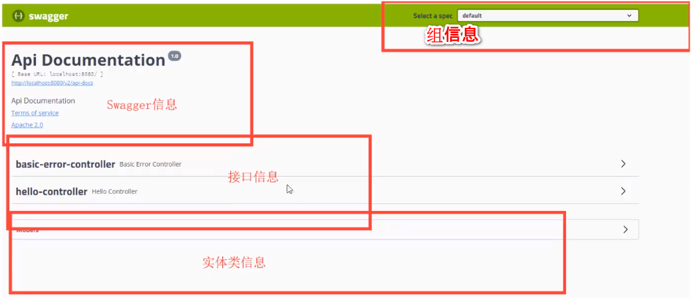
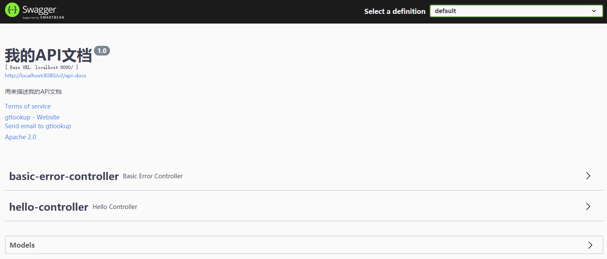
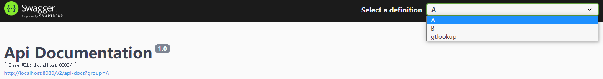
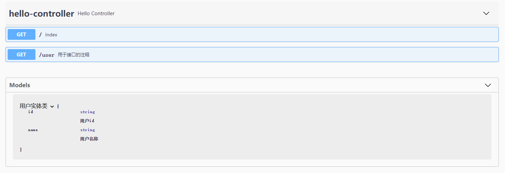

# 1. 导入依赖

```xml
<dependency>
    <groupId>io.springfox</groupId>
    <artifactId>springfox-swagger-ui</artifactId>
    <version>3.0.0</version>
</dependency>
<dependency>
    <groupId>io.springfox</groupId>
    <artifactId>springfox-swagger2</artifactId>
    <version>3.0.0</version>
</dependency>
<dependency>
    <groupId>io.springfox</groupId>
    <artifactId>springfox-boot-starter</artifactId>
    <version>3.0.0</version>
</dependency>
```

# 2. 集成swagger

```java
@Configuration
@EnableSwagger2
public class SwaggerConfig { }
```

访问：http://localhost:8080/swagger-ui/index.html



# 3. 配置swagger

swagger 的 bean 实例为 Docket

```java
@Bean
public Docket docket() {
    return new Docket(DocumentationType.SWAGGER_2)
        // 配置是否启动swagger，false 不启动
        // 打开页面后只有一行字：Could not render n, see the console.
        .enable(false)
        .apiInfo(apiInfo());
}

// swagger信息
private ApiInfo apiInfo() {
    return new ApiInfo(
        "我的API文档",  // title
        "用来描述我的API文档", // description
        "1.0",  // version
        "http://www.baidu.com", // termsOfServiceUrl
        // contact：作者信息
        new Contact("gtlookup", "http://www.baidu.com", "114875552@qq"),
        "Apache 2.0", // license
        "http://www.apache.org/licenses/LICENSE-2.0", // licenseUrl
        new ArrayList()
    );
}
```



# 4. 扫描接口

Docket.select()

```java
@Bean
public Docket docket() {
    return new Docket(DocumentationType.SWAGGER_2)
        .apiInfo(apiInfo())
        .select()
        // RequestHandlerSelectors：配置要扫描接口方式的方式
        // basePackage：按包扫描
        // any：扫描全部
        // none：都不扫描
        // withClassAnnotation：扫描类上的注解
        // withMethodAnnotation：扫描方法上的注解
        .apis(RequestHandlerSelectors.basePackage("com.gt.controller"))
        // 过滤什么路径
        // PathSelectors.any：全部过滤
        // PathSelectors.none：全不过滤
        // PathSelectors.regex：按正则过滤
        // PathSelectors.ant("/api/v1/**")：只扫描/api/v1/**的
        .paths(PathSelectors.ant("/api/v1/**"))
        .build();
}
```

# 5. 根据环境设置swagger是否可用

```java
@Bean
public Docket docket(Environment evn) { // Environment：整个应用的运行环境
    // 哪些环境下的swagger好用
    Profiles of = Profiles.of("dev", "test");
    // 判断当前环境是不是dev或test
    boolean b = evn.acceptsProfiles(of)

    return new Docket(DocumentationType.SWAGGER_2)
        .apiInfo(apiInfo())
        // 设置swagger是否可用
        .enable(b);
}
```

# 6. 配置分组

## 6.1 默认分组

```java
return new Docket(DocumentationType.SWAGGER_2)
                .apiInfo(apiInfo())
                .groupName("组名"); // 设置默认组名
```

## 6.2 配置多分组

多创建几个Docket Bean 就可以了

```java
@Bean
public Docket docketA() {
    return new Docket(DocumentationType.SWAGGER_2).groupName("A");
}
@Bean
public Docket docketB() {
    return new Docket(DocumentationType.SWAGGER_2).groupName("B");
}
```



# 7. 扫描实体类

```java
// 1. 创建实体类
@ApiModel("用户实体类") // 给实体类加说明
public class UserVO {
    @ApiModelProperty("用户id") // 给实体类属性加说明
    public String id;
    @ApiModelProperty("用户名称")
    public String name;
}

@Api(tags = "用于controller的注释")
@RestController
public class ApiController {}

// 2. 只要有接口返回实体类，页面上
@ApiOperation("用于接口的注释") // 给接口加说明
@GetMapping("user")
public UserVO user(@ApiParam("用户id") String id) { // 给参数加注释
    return new UserVO();
}
```

