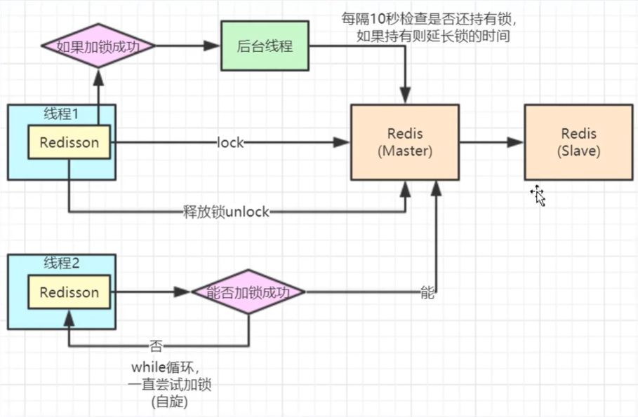

# 概念

用来解决分布式场景下，由网络因素对不同实例的同一接口重复请求；及高并发下类似商品超卖的问题。

# 一个例子

```java
@RestController
public class IndexController {
    @Autowired
    private StringRedisTemplate redisTemplate;

    @GetMapping
    public String stock() {
        // 假如stock = 10
        // 如果不加锁，拿jmater并发5个请求后，get stock结果为9
        // 如果加锁的话，相同操作后结果为5
        // java里的锁只能锁一个jvm，但集群场景下是多个jvm，也就是说锁不了分布式场景
        synchronized (this) {
            int stock = Integer.parseInt(redisTemplate.opsForValue().get("stock"));
            if (stock > 0) {
                stock--;
                redisTemplate.opsForValue().set("stock", stock + "");
                return stock + " 成功";
            } else {
                return stock + " 失败，小于1";
            }
        }
    }
}
```

```java
String lockKey = "xxx";
try {
    // 通过setnx能够实现简单的分布式锁，因为redis是单线程的，所以不管怎么多线程请求，到redis这一层它都会是单线程的
    // 设置10秒后过期，防止没释放锁的时候服务就挂掉
    Boolean b = redisTemplate.opsForValue().setIfAbsent(lockKey, 10, 10, TimeUnit.SECONDS); // setIfAbsent = setnx
    if (!b) { // b = true 设置成功(获得锁)，b = false 获取锁失败
        return "重复提交";
    }
    // 其它操作
} finally {
    redisTemplate.delete(lockKey); // 释放锁
}
// 这段代码的问题：
// 锁的过期时间为10秒，如果在10秒后还没执行到释放锁，那么其它请求就会进来；此时再释放锁，那释放的就不是自己加的锁了。
```

```java
// 解决上面问题的办法 
String clientId = UUID.randomUUID().toString(); // 生成一个本次请求的id
String lockKey = "xxx";
try {
    Boolean b = redisTemplate.opsForValue().setIfAbsent(lockKey, clientId, 10, TimeUnit.SECONDS);
    if (!b) {
        return "重复提交";
    }
    // 其它操作
} finally {
    // 如果是自己加的锁才能释放
    if (clientId.equals(redisTemplate.opsForValue().get(lockKey))) {
        redisTemplate.delete("stock");
    }
}
```

# redisson

redis的java客户端一种，本身有分布式锁的功能，一线大厂用的很多



> 添加依赖

```xml
<dependency>
    <groupId>org.redisson</groupId>
    <artifactId>redisson</artifactId>
    <version>3.13.6</version>
</dependency>
```

> 添加bean

```java
@Bean
public Redisson redisson() {
    Config config = new Config();
    config.useSingleServer().setAddress("redis://47.105.141.18:6379").setDatabase(1);
    return (Redisson) Redisson.create(config);
}
```

> 使用

```java
// 这部分也就实现上面 setIfAbsent 的功能
@Autowired
private Redisson redisson;

@GetMapping
public String stock() {
    String lockKey = "xxx";

    try {
        // 其它线程会在这儿阻塞，直到锁释放才能往下走
        // lock里有自旋锁，因此当10秒后还持有锁（即上锁的这部分代码没执行完），则自动延长锁
        redisson.getLock(lockKey).lock(10, TimeUnit.SECONDS); // 锁10秒
        // 其它操作
    } finally {
        RLock lock = redisson.getLock(key);
        // isHeldByCurrentThread 用来解决：
        //       "attempt to unlock lock, not locked by current thread by node id: xxxxxx thread-id: 1" 这个错误
        if (lock != null && lock.isHeldByCurrentThread()) lock.unlock();
    }
}
```

==如果redis主从同步导致锁失效的话，不建议使用redisLock，建议使用zookeeper实现分布式锁==

redis的分布式锁效率最高，但zookeeper的分布式锁安全性最高（性能不如redis）

## RLock

```java
lock.isLocked();               // 此锁定是否由任意线程保持
lock.isHeldByCurrentThread();  // 当前线程是否保持此锁定
```


# aop + redisson 防重复提交

> 问题描述：生产环境上2台+的集群，导致总重复提交，数据库里总是好几条相同数据

```java
@Component
@Aspect
public class TryLockAspect {
    @Autowired
    private Redisson redisson;
    @Autowired
    private TokenService tokenService; // 用来取token

    @Pointcut("@annotation(com.trace.framework.trylock.annotation.TryLock)")
    public void aspect() {}

    @Around("aspect()")
    public Object around(ProceedingJoinPoint point) throws Throwable {
        RLock lock = redisson.getLock(getKey(point));

        // 取到锁则锁，然后执行请求，没取到则返回不能重复提交信息
        // 注：为什么不在@Before里加锁，为什么要在@After里释放锁？参考aop.md里的【切面执行顺序】
        if (lock.tryLock()) {
            return point.proceed(point.getArgs());
        } else {
            return AjaxResult.error("不允许重复提交，请稍后再试");
        }
    }

    // 之前的写法是在@Around里释放锁，发现在insert之前的唯一check不起作用（几十个并发有几个没起作用）
    // 于是怀疑@Around里释放的话可能会在事务提交之前，所以放到@After里了，不管怎样唯一check好用了（100个并发没问题）
    @After("aspect()")
    public void after(JoinPoint point) {
        RLock lock = redisson.getLock(getKey(point));
        // isHeldByCurrentThread 是不是自己的锁
        if (lock != null && lock.isHeldByCurrentThread()) lock.unlock();
    }

    private String getKey(JoinPoint point) {
        Signature signature = point.getSignature(); // 取包+类名
        String key = signature.getDeclaringTypeName() + signature.getName(); // 包+类+方法名作为key

        try {
            String token = tokenService.getToken(ServletUtils.getRequest());
            key = key + token; // 有token则把token也拼到key里
        } catch (Throwable e) {}

        return key;
    }
}
```


https://www.bilibili.com/video/BV1d4411y79Y