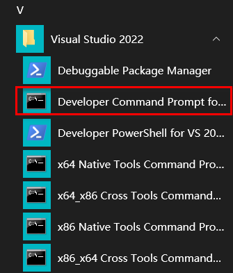
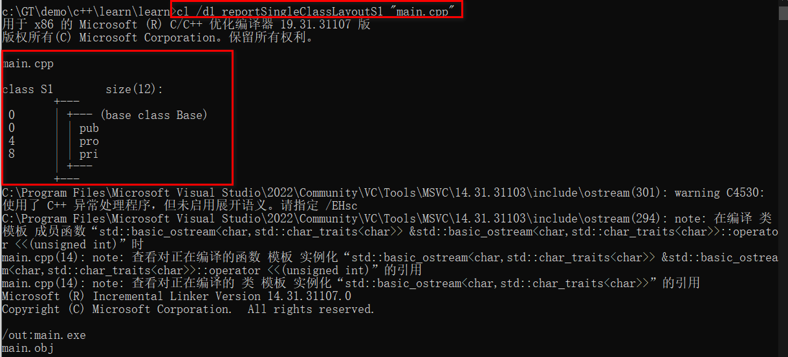

# 基础

## 预处理

以 `#` 开头的语句，比如 `#include`

## system

```c++
system("pause"); // 请按任意键继续
system("cls"); // 清屏
```

## using

```c++
#include <iostream>

std::cout << "haha"<<std::endl; // 不加 using

using namespace std;  // 加上后
cout << "haha"<<endl; // 可省略 std::
```

## main

```c++
int main() {
    // return 0; 通常0代表正常，不写 return 也不会报错，系统会默认返回0
}
```

## 常量

```c++
// 第一种：宏常量
// #define 常量名 常量值
#define L 7

// 第二种：const
// const 常量类型 常量名 = 常量值
const int I = 77;

#include <iostream>
std::cout << L << "," << I; // 结果：7,77
```

## 数据类型

### 1. 整形

| 类型      | 空间(字节)                          | 范围           |
| --------- | ----------------------------------- | -------------- |
| short     | 2                                   | -2^15 ~ 2^15-1 |
| int       | 4                                   | -2^31 ~ 2^31-1 |
| long      | win(4)，linux(32位4字节，64位8字节) | -2^31 ~ 2^31-1 |
| long long | 8                                   | -2^63 ~ 2^63-1 |

```c++
short x = 32768; // 溢出了，打印后得出 -32768
```

### 2. 浮点型

```c++
// 1. 单精度 float（4字节）

// 通常最后加个f, 否则会默认是双精度, 还要转成单精度再赋给f1
// 加个f就不用再转一下再赋给f1了
float f1 = 3.14f;
// 科学记数法
float f2 = 3e2;  // 表示 3 * 10  的2次方
float f3 = 3e-2; // 表示 3 * 0.1 的2次方

// 2. 双精度 double（8字节）
double d1 = 3.14; // 就不用加f了，因为默认是double
```

### 3. 字符型

```c++
// 单引号里一个字符，占1个字节
// 变量存的不是字符，而是ascll码
char c = 'a'; // 直接 std::cout 还是 a
std::count << (int)c; // 结果：97，输出的是ascll码
```

### 4. 字符串

```c++
// 1. c语言风格
char ar[] = "abc";

// 2. c++风格
std::string s = "abc";
```

### 5. 布尔型

两个值：true(本质是1)，false(本质是0)，占1字节

## 关键字

### 1. sizeof

```c++
// sizeof(变量 或 类型)
long long x = 1;
sizeof(x);        // 8
sizeof(long long) // 8
```

## 数组

```C++
// 数组长度
int ar[] = { 1,2,3 };
int len = sizeof(ar) / sizeof(ar[0]); // 结果：3
```

# 函数

## 1. 声明

```c++
void test(); // 如果方法体在调用者的下面，需要先声明，如果在调用者上面则不需要声明
void test(); // 声明可以有多个，但定义只能有一个

int main() {
	test();
}

void test1(); // test1方法体在调用者test的下方，要声明
void test() { test1(); }
void test1() { std::cout << "test1"; }
```

## 2. 分文件

函数分文件一般4个步骤：

1. 创建后缀名为.h的头文件（源文件里所需的所有头文件要在这里 `#include` 进来）
2. 创建后缀名为.cpp的源文件，并 `#include "头文件.h"`
3. 在头文件中写函数声明
4. 在源文件中写函数定义
5. 在调用方里 `#include "头文件.h"` 后才能用

## 3. 默认参数

```c++
int test(int a, int b = 10) { return a + b; }
int v = test(10);     // 结果：20
int v = test(10, 20); // 结果：30
```

注意1：默认参数只能在参数列表最后的连续区域，不能前面有后面没有

```c++
int test(int a, int b = 10, int c); // 错误：b 后面的参数都必须是默认参数
```

注意2：函数的声明和实现，只能一方有默认函数

```c++
int test(int a, int b = 10); // 函数声明
// 函数实现
int test(int a, int b = 10) { return a + b; } // 错误，函数实现不能有默认参数
int test(int a, int b) { return a + b; }      // OK
```

```c++
// OK
int test(int a, int b); // 函数声明
int test(int a, int b = 10) { return a + b; } // 函数实现
```

## 4. 占位参数

参数列表中只写参数类型就表示占位参数

```c++
int test(int a, int) { return a; }
int test(int a, int = 10) { return a; } // 占位能数默认参数
int v = test(10, 100); // 结果：10
```

## 5. 函数重载

作用：函数名可以相同，提高复用性

函数重载满足条件：

- 同一个作用域下
- 函数名相同
- 函数参数**类型不同**或**个数不同**或**顺序不同**

==注意：==

- **返回值**不作为重载条件

  ```c++
  int test() {}
  void test() {} // 报错，因为 test() 不知道调哪个
  ```

- 引用作为重载条件

  ```c++
  void test(int& a) { std::cout << "int& a"; }
  void test(const int& a) { std::cout << "const int& a"; }
  
  int a = 7;
  test(a); // int& a = 7 是不合法的，结果：int& a
  test(7); // const int& a = 7 合法，结果：const int& a
  // 参考 `引用 -> 4.常量引用`
  ```

- 函数重载碰到默认参数

  ```c++
  void test(int a, int b = 7) {}
  void test(int a) {} 
  test(7);    // 报错，因为 test(7) 不知道调哪个
  test(7, 7); // OK
  ```

# 指针

## 1. 定义

```c++
int a = 7;
int* p = &a;
// int* p = &7; 错误
```

## 2. 所占内存空间

32位系统点4字节，64位系统点8字节

## 3. 空指针

指针变量指向内存编号为0的空间，用于初始化指针变量，但空指针是不可以访问的

==0~255是系统内存编号，不可访问==

```c++
int* p = NULL;   // #define NULL 0
std::cout << p;  // 0000000000000000
// 只要解引用 0~255 都会报错，因为是系统内存，没有访问权限
*p = 7;          // 报错：提示 p 是 nullptr
std::cout << *p; // 报错：提示 p 是 nullptr
```

## 4. 野指针

指针变量指向非法的内存空间

```C++
int* p = (int*)0x1100;
// 没有申请就去访问是不允许的
std::cout << *p; // 报错：读取访问权限冲突
```

==非申请的内存不要访问==

## 5. const指针

```c++
int a = 1;
int b = 2;

// const修饰指针的三各情况：
//		1. 常量指针：指针的值不可以改(指解引用)，指针的指向能改
const int* p = &a;
p = &b; // OK，指向可以改
*p = b; // error，指针的值(解引用)不能改

//		2. 指针常量：指针的值可以改(解引用)，指针的指向不能改
int* const p = &a;
p = &b; // error，指针的指向不能改
*p = b; // OK，指针的值可以改(解引用)

//		3. const 即修饰指针又修饰常量，指向和值都不能改
const int* const p = &a;
p = &b; // error，指针的指向不能改
*p = b; // error，指针的值(解引用)不能改
```

## 6. 指针和数组

利用指针也可以访问数组中的元素

```c++
int ar[3] = {1, 2, 3};
int* p = ar; // 指向首地址
std::cout << *p << std::endl; // 第1个元素，结果：1
p++; // 向后偏移4字节(int 4字节)
std::cout << *p << std::endl; // 第2个元素，结果：2
```

## 7. 指针和函数

```c++
void swap(int *p1, int *p2);
int a = 1;
int b = 2;
swap(&a, &b); // 通过传引用修改copy语义的值
```

## 8. 作为返回值

==不能返回指向局部变量的指针==

# 结构体

## 1. 定义和使用

```c++
struct Person {
	std::string name;
	int age;
	int height;
}p2; // 定义。p2为定义时顺便创建个变量

struct Person p1; // 实例化（struct可以省略）
Person p1 = { "gt", 37, 160 }; // 带初值实例化

// p2为定义时顺便创建的变量
p2.name = "haha";
p2.age = 33;
p2.height = 110;
```

## 2. 结构体数组

```c++
Person ar[2] = { {"gt", 37, 160}, {"haha", 8, 80} }; // 俩结构体元素
```

## 3. 结构体指针

通过指针访问结构体成员（通过 `->` 引用成员）

```c++
Person s = { "gt", 37, 160 };
Person* p = &s;

std::cout << p->name << "," << p->age << "," << p->height << std::endl;
```

## 4. 嵌套结构体

结构体中的成员可以是另一个结构体

## 5. 做为函数参数

同样分两种：值传递（实参改变形参不变）、地址传递（实参改变形参也变）

## 6. 结构体中const

用 `const` 来防止成员被误修改

```c++
// 应用场景：如果结构体很大，那么每次值传递都会产生一次深拷贝，即影响效率，又占内存
//    当不想多次拷贝，又不想结构体值被修改，那么 const T * 很适用
void print(const Person* p) {
    p->age = 7; // 报错，不允许修改
}
```

# 异常处理

对C/C++来说，异常捕获实际上没什么意义

```c++
try {
    throw std::exception("haha");
} catch (const std::exception& e) { // 必须捕获同类型异常，否则还是崩
    std::cerr << e.what(); // std::cout 一样
}
```

# 内存分区模型

C++将内存划分为**4个区域**

- 代码区：存放所有代码的二进制码，由操作系统管理。两个特性：

  - 是共享的，目地是对于频繁执行的程序，内存中有一份即可
  - 是只读的，防止程序意外修改指令

- 全局区：存放**全局变量**和**静态变量**及**常量**，程序结束后操作系统自动释放该区。==(局部变量、const修饰的局部变量不在全局区)==

- 栈区：由编译器自动分配释放，存放函数的参数值，局部变量等

  ```c++
  int* test() {
      int a = 7; // 栈区
      return &a; // 悬垂指针，不允许
  }
  cout << a; // 7，但第一次正确，因为编译器会保留一次
  cout << a; // -858993460，无效值，编译器只会保留一次
  ```

- 堆区：由开发人员分配释放，若不释放则程序结束后自动释放

  ```c++
  int* test() {
  	return new int(7); // 堆区
  }
  int *p = test();
  delete p; // 释放
  ```

  ```c++
  int* ar = new int[]{1,2,3}; // 堆上分配，并初赋初值1,2,3
  delete[] ar; // 释放数组
  ```

`代码区`和`全局区`是程序==运行前==划分的区，`栈区`和`堆区`则是程序==运行后==划分的区

# 引用

作用：给变量起别名

```c++
int a = 7;
int& b = a; // b 引用 a

std::cout << a << "," << b << std::endl; // 7,7
a = 8;
std::cout << a << "," << b << std::endl; // 8,8
b = 9;
std::cout << a << "," << b << std::endl; // 9,9
```

## 1. 注意事项

1）引用必须初始化

```c++
int& b; // 报错，未初始化
```

2）初始化后不可改变

```c++
int a1 = 7;
int a2 = 8;
int& b = a1; // 初始始化别名
b = a2;  // OK，不是改引用，而是赋值
&b = a2; // 报错，引用不可更改
```

## 2. 作为函数参数

作用：可替代`地址传递`

```c++
void test(int &a) {a = 7;}

int main() {
	int a = 0;
	test(a);
	std::cout << a; // 结果：7
}
```

## 3. 作为返回值

作用：可以作为`左值`

```c++
int& test() {
	static int a = 7; // 静态变量，存在全局区，程序结束后释放
	return a;
}

int main() {
	int& ref = test();
	std::cout << ref << std::endl; // 7
	test() = 100; // 作为左值
	std::cout << ref << std::endl; // 100
}
```

注意：==不能返回局部变量引用（数字类型可以）==

```c++
// 经测，数值、bool型可以
//      字符/字符串不行
std::string& test() {
	std::string a = "7";
	return a;
}

int main() {
	std::string &ref = test();
	std::cout << ref << std::endl; // 乱码
}
```

## 3. 引用本质

引用本质是一个指针常量（即指向不可修改）

```c++
int a = 7;
int& ref = a; // 自动转为 int* const ref = &a;
ref = 20;     // 自动转为 *ref = 20
```

## 4. 常量引用

主要用来修饰形参，防止误操作

```c++
int& ref1 = 7;       // 报错：非常量引用的初始值必须为左值
const int& ref2 = 7; // OK，编译器转为：int tmp=7;const int& ref=tmp;
ref2 = 10;           // 报错：表达式必须是可修改的左值；防止了误操作
```

```c++
void test(const int& v) {
	v = 10; // 报错：表达式必须是可修改的左值；防止了误操作
}
```

# 面向对象

C++面向对象三大特性：封装、继承、多态

万物皆可对象，对象上有其属性和行为

## 1. 类和对象

```c++
class Person {
public: // 权限
	int id;
	std::string name;
	int age;

	void print() {
		std::cout << id << "," << name << "," << age << std::endl;
	}
};

Person p = {1, "haha", 7}; // 可以像结构体一样赋初值，前提只能是 public
p.print(); // 结果：1,haha,7
```

## 2. 成员权限

**三种访问权限：**

| 权限      | 访问范围               | 可否被继承 |
| --------- | ---------------------- | ---------- |
| public    | class **内外**都能访问 | 可         |
| protected | class **内**能访问     | 可         |
| private   | class **内**能访问     | 不可       |

将成员属性设为私有的好处：

- 可以自行控制读、写权限（set / get 方法）
- set 方法里可以验证参数的有效性（非空验证等），这是 `public` 做不到的

## 3. 与struct区别

`class` 成员默认 `private`，`struct` 默认 `public`

## 4. 构造析构函数

由编译器自动调用，如果代码里没写，则编译器默认构造析构函数是空实现

### 4.1 构造函数语法

1）与类名相同，没返回值，不写 `void`

2）可以有参数，可以重载

3）实例化对象时自动调用且只调一次，不需手动调

4）可以一个不写，写了的话，至少有一个是 `public`，否则无法实例化

```c++
class A {
public: 
    A() { std::cout << "A()"; }
	A(int) { std::cout << "A(int)"; }
    ~A() { std::cout << "~A" << std::endl; }
};

A a;    // 结果：A()
A a(7); // 结果：A(int)
```

### 4.2 析构函数语法

1）类名前加 `~`，没返回值，不写 `void`

2）不能有参数，因此不能重载

3）对象销毁前自动调用且只调一次，无需手动调

4）可以不写，写了的话必须是 `public`，否则无法实例化

```c++
class A {public:~A() { std::cout << "A()"; }};

A a; // new
std::cout << "create -> "; // 结果：create -> A()
```

### 4.3 构造函数分类

两种分类方式：

- 按参数分：有参构造和无参（默认）构造

- 按类型分：普通构造和拷贝构造

  ```c++
  // 拷贝构造函数
  class A {
  public:
      int m_i;
  	A(int i) { m_i = i; }
      // 必须是 const 本类型& x
      // 若不是本类型则下面13行报：表达式必须具有类类型，但它具有类型 "A (*)(xxx)"
  	A(const A& a) { m_i = a.m_i; }
  };
  
  // 括号法构造函数
  A a1(7);
  A a2(a1);
  std::cout << a2.m_i; // 结果：7
  // 显示法构造函数
  A a3 = A(7);
  A a4 = A(a3);
  ```

三种调用方式：

- 括号法：

  - 例如上面 `括号法构造函数`

  - **注意：**调用默认（无参）构造函数时，不要加 `()`

    ```c++
    class A {public:int m_i;};
    
    A a();
    a.m_i = 1; // 报错：编译器会认为上一行是函数声明
    ```
  
- 显示法：例如上面 `显示法构造函数`

- 隐式转换法：

  ```c++
  class A {
  public:
  	int m_i;
  	A(int v) { m_i = v; }
  };
  
  A a1 = 7;  // 相当于 A a1 = A(10);
  A a2 = a1; // 调用拷贝构造函数
  ```

### 4.4 拷贝构造函数

```c++
class A {
public:
	int m_i;
	A() { m_i = 0; std::cout << "无参" << std::endl; }
	A(int v) { m_i = v; std::cout << "有参" << std::endl; }
	A(const A& a) { m_i = a.m_i; std::cout << "拷贝" << std::endl; }
};
```

#### 4.4.1 调用时机

拷贝构造函数调用时机通常有三种情况：

- 使用一个已经创建完毕的对象来初始化一个新对象（例如上面 `4.3 -> 按类型分`）

- 给函数参数传值

  ```c++
  void test(A) {} // 函数
  A a1 = 10; // 结果：有参
  test(a1);  // 结果：拷贝
  ```

- 以值方式返回局部对象

  ```c++
  A test() {
      // return A(7); 注意：直接返回匿名对象不会调用拷贝构造
      
  	A a = A(7); // 结果：有参
  	return a;
  }
  
  A a1 = test(); // 结果：拷贝
  ```

#### 4.4.2 调用规则

默认情况下，编译器至少给一个类添加4个函数：

1. 默认构造函数（无参，函数体为空）
2. 默认析构函数（无参，函数体为空）
3. 默认拷贝构造函数，对属性进行值拷贝
3. 赋值运算符 `operator=`，对属性进行值拷贝（==参考15.4==）

调用规则如下：

- 如果**定义了有参**构造函数，编译器**不再提供默认构造**函数，但**会提供默认拷贝**构造函数

  ```c++
  // 将拷贝构造函数注掉后
  A a1 = 7;
  A a2(a1); // 结果a2.m_i=7，说明走了默认`拷贝`构造函数
  ```

- 如果**定义了拷贝**构造函数，编译器**不再提供其它构造**函数

  ```c++
  // 打开拷贝构造，且注掉无参和有参构造
  A a1 = 7; // 报错
  A a2;     // 也报错
  ```

### 4.5. 深浅拷贝

浅拷贝：简单的赋值拷贝操作（==默认拷贝构造函数为浅拷贝==）

```c++
class A {
public:
	int* m_p;
	A(int v) { m_p = new int(v); }
	~A() {
		if (m_p != NULL) {
			delete m_p;
			m_p = NULL;
		}
	}
};

A a1 = 7;
A a2(a1);
// 程序结束后报错
// 原因为二次释放
//    当创建 a2 时，会走默认拷贝构造函数，又因默认拷贝是浅拷贝
//	  所以，a1、a2的 m_p 都指向同一个地址
//	  当程序结束后依次析构，这就造成同一个地址被释放两次
```

深拷贝：在堆区重新申请空间后，进行拷贝操作

```c++
A(const A& a) { m_p = new int(*a.m_p); } // 上面加个深拷贝构造函数就OK了
```

## 5. 匿名对象

没有变量接的实例叫做 `匿名对象`

要注意几点：

1. 创建后会立即销毁（析构）

   ```c++
   class A {
   public: 
       A() { std::cout << "A()"; }
   	A(int) { std::cout << "A(int)"; }
       ~A() { std::cout << "~A" << std::endl; }
   };
   
   A();
   std::cout << "---" << std::endl; // 结果：A()~A---
   A(7);
   std::cout << "---" << std::endl; // 结果：A(int)~A---
   ```

2. 正常情况下，调用 `默认` 构造函数是不能加 `()` 的，但匿名对象需要加

   ```c++
   class A {
   public:int m_i;
   };
   
   std::cout << A().m_i; // 匿名对象要加 `()`，结果：0
   ```

## 6. 初始化列表

```c++
class A {
private:
	int i1;
	int i2;
	int i3;
public:
    // 
	A(int a, int b, int c): i1(a),i2(b),i3(c) {}
};

A a(1, 2, 3);
```

## 7. 对象成员

一个对象作为另一个对象的成员

==注意：==对象成员先构造，自身后构造；先析构自身，再析构对象成员

```c++
class B {
public: 
	int i;
	B(int v) { i = v; }
};

class A {
public:
	int i;
	B b;
    // b(v2) 相当于 B b = v2;
	A(int v1, int v2): i(v1), b(v2) {}
};

A a(1, 2); // a.i = 1, a.b.i = 2;
```

## 8. 静态成员

语法：成员变量/函数前加 `static`

访问方式：有对象 (`对象.静态成员`) 、类 (`类名::静态成员`) 两种访问方式

静态成员变量：

- 所有对象共享一份数据
- 编译阶段分配内存
- 类内声明，类外初始化

```c++
class A {
public:
	static int i; // 静态变量
};

// 私有静态成员也这么初始化
int A::i = 7; // 在类外（全局处）初始化（前面要加静态成员类型）

A a; // 不加第7行会报错
cout << a.i; // 结果：7
a.i = 8;
A x;
std::cout << x.i; // 结果：8，所有对象共享

x.i;  // 对象访问方式
A::i; // 类访问方式
```

静态成员函数：

- 所有对象共享一个函数
- **只能**访问静态成员变量

## 9. 对象模型

> **成员变量和成员函数分开存储**

```c++
class A {};
sizeof(A); // 结果：1
// 编译器给空对象也分配1个字节，如果加个int成员，就是4
// 如果再加个static int，则还是4，因为static不属于对象的
// 再加上成员函数(无论静态还是非静态)，都不占空间，和static一样，不属于对象
```

## 10. this指针

上一节说所有对象拥有一份成员函数，那成员函数如何区分哪个对象呢？通过 `this` 指针指向被调用的成员函数所属的对象

用途：

- 当形参和成员变量同名时，可通过 `this` 来区分

- 在类的非静态成员函数中返回对象本身，可以 `return *this`

  ```c++
  class A {
  public:
  	int i;
  	A add(int v) {
  		i += v;
  		return *this;
  	}
  };
  
  A a = A{ 1 };
  a.add(1).add(1).add(1).add(1); // 结果：2
  // 改成 A& add(int v) {...} 就对了，结果：5
  // 如果不返回引用，则每次 add 后都返回新的
  ```

`this` 指针本质是一个**指针常量**（即指向不能改）

## 11. 空指针调成员函数

空指针可以调成员函数，但要注意有没有用到 `this` 指针，如果用到要判断 `this` 为不为空

```c++
class A {
public:
	int i;
	void test1() { std::cout << "test1" << std::endl; }
	void test2() { std::cout << i << std::endl; }
};

A* p = NULL;
p->test1(); // 结果：test1
p->test2(); // 报空指针错，所以要在 test2 里判断下 this 是不是 NULL
```

## 12. const成员函数

常函数：

- 成员函数加 `const` 叫**常函数**（本质上修饰 `this`，让指针指向的值也不能改）
- 常函数不可修改成员变量
- 成员变量加 `mutable` 后，常函数才可修改

```c++
class A {
public:
	int i;
    mutable int j; // 让常函数可以修改j
    // this 本质是 const A* this;
    // 常函数相当于 const A* const this;
	void test1() const {
		i = 1; // 报错
        j = 1; // OK
	}
    void test2() {}
};
```

常对象：

- 创建对象加 `const` 叫**常对象**
- 常对象只能调常函数
- 常对象只能改 `mutable` 变量

```c++
const A a;
a.i = 1; // 报错
a.j = 2; // OK
a.test1(); // OK
a.test2(); // 报错
```

## 13. 友元

作用：让一个函数或者类访问另一个类的私有成员，关键字 `friend`

三种实现：

- 全局函数做友元

  ```c++
  class A {
  	friend void test(); // 全局函数做友元
  	int i;
  };
  
  void test() { // 全局函数
  	A a;
  	a.i = 1; // OK，可以访问私有
  }
  ```

- 类做友元

  ```c++
  class A {
  	friend class B; // 让B能访问A的私有
  	int i; // 私有
  };
  
  class B { // 必须在 A 下面
  public:
      // a.i访问私有
      void call_a() { A a = A(); std::cout << a.i; }
  };
  ```

- 成员函数做友元

  ```c++
  class B { public: void call_a(); }; // 必须在 A 上面声明
  
  class A {
  	friend void B::call_a(); // 让 B::call_a 能访问 
  	int i;
  };
  // 必须在 A 下面实现
  void B::call_a() { A a = A(); std::cout << a.i; }
  ```

## 14. 类外成员函数

在类外面实现成员函数

```c++
class A {
public: void print(); // 先声明
};

// 后实现
void A::print() {
	std::cout << "print";
}
```

## 15. 运算符重载

对已有运算符进行重新定义，赋予其新功能，以适用不同数据类型

注意：内置类型不允许重载，和 rust 的孤儿规则差不多

### 15.1 重载+

```c++
class Point {
public: 
	int x;
	int y;
    // const 不想改 a，且不想拷贝
    // operator+ 重载加号
	Point operator+(const Point& a) {
		Point ob = Point();
		ob.x = x + a.x;
		ob.y = y + a.y;
		return ob;
	}
    // 再重载一个
    Point operator+(int v) {
		Point ob = Point();
		ob.x = x + v;
		ob.y = y + v;
		return ob;
	}
};

Point a = Point{ 1, 2 };
Point b{3, 4};
Point c = a + b; // 结果：x=4,y=6
// 本质上：Point c = a.operator+(b);
c = c + 100;     // 结果：x=104,y=106
```

### 15.2 重载<<

不会利用成员函数来重载，因为无法实现 `std::cout` 在左侧，==只能利用全局函数重载==

```c++
class Point {
public: 
	int x;
	int y;
};
// 1) std::cout 的类型为 std::ostream
// 2) 又因为 std::cout 全局只能有一个，所以要&
// 3) 要实现链式，才能 cout << xx 多次
std::ostream& operator<<(std::ostream& cout, const Point& p) {
	cout << "x: " << p.x << ", y: " << p.y ;
	return cout;
}

Point p{ 7, 17 };
std::cout << p << std::endl; // 结果：x: 7, y: 17
```

### 15.3 重载++

```c++
class A {
public:
	int i;
    // 前置++
	void operator++() {++i;}
    // 后置++
    // 加个占位int，就能区分前置还是后置（必须是int）
	void operator++(int) {i++;}
};
```

### 15.4 重载=

编译器默认提供的 `=` 是浅拷贝（==编译器提供4个函数，参考4.4.2==）

应用场景：当 `class` 里的成员变量是指针且要在堆上分配（深拷贝），则析构里也要释放；此时默认的 `=` 只是浅拷贝，作用域结束后势必会造成二次释放

```c++
class A {
public:
	int* i;
	A(int x) { i = new int(x); } // 构造里堆上分配
	~A() { // 析构里释放
		if (i != NULL) {
			delete i;
			i = NULL;
		}
	}
    // 如果不返回自身引用，则只能 = 一次，不能 a = b = c
	A& operator=(const A& a) {
		if (i != NULL) { // 先释放原有的
			delete i;
			i = NULL;
		}
		i = new int(*a.i); // 再重新分配（深拷贝）
		return *this;
	}
};

A a(1);
A b(2);
A c(3);
a = b = c; // 结果：3, 3, 3
```

### 15.5 重载关系运算符

作用：让两个 `class` 对象进行对比操作

```c++
class A {
public:
	int i;
	A(int x) { i = x; }
	bool operator>(const A a) {
		return i > a.i;
	}
    bool operator==(const A a) {
		return i == a.i;
	}
};

A a(3);
A b(2);
std::cout << (a > b) << "," << (a == b); // 结果：1, 0
```

### 15.6 重载()

1）函数调用运算符是 `()`，由于重载后使用的方式非常像函数调用，因此==称为仿函数==

2）仿函数没有固定写法，非常灵活（==STL里比较常用==）

```c++
class A {
public:
	void operator()(std::string s) {
		std::cout << s;
	}
    int operator()(int a, int b) {
		return a + b;
	}
};

A a;
a("haha"); // 结果：haha
a(1, 2);   // 结果：3

/* 匿名写法 */
A()("haha");
std::cout << std::endl << A()(1, 2);
```

## 16. 继承

### 16.1 基操

```c++
class Base {
public:
	void fn_common() { std::cout << "common" << std::endl; }
};
// 语法：class 子类 : 继承方式 父类
class A : public Base { public: void fn_a() { std::cout << "a" << std::endl; } };
class B : public Base { public: void fn_b() { std::cout << "b" << std::endl; } };

A a;
B b;
a.fn_common(); // common
a.fn_a();      // a
b.fn_common(); // common
b.fn_b();      // b
```

### 16.2 继承方式

三种继承方式：

- 公共继承：公有/保护权限不变
- 保护继承：公有/保护都变成保护
- 私有继承：公有/保护都变成私有

==父类的私有成员在子类中都访问不到，不是不继承==

```c++
class Base {
public:      int pub;
protected: int pro;
private:     int pri;
};

class S1 : public Base { };
class S2 : protected Base { };
class S3 : private Base { };

std::cout << sizeof(Base) << "," << sizeof(S1) << "," << sizeof(S2) << "," << sizeof(S3);
// 结果：12,12,12,12
```

### 16.3 构造析构顺序

继承后构造和析构的顺序：先构造子再构造父，先析构子再析构父

### 16.4 继承同名成员

1）访问子类同名成员直接访问

2）访问父类同名成员需加作用域（==对象.父类::同名成员==）

3）若父/子类中出现**同名函数重载**，则都需要加作用域

```c++
class Base {
public:
	int i;
	Base() { i = 7; }
    void fn() { std::cout << "Base fn" << std::endl; }
};

class S : public Base {
public: 
	int i;
	S() { i = 8; }
    void fn(int) { std::cout << "S fn" << std::endl; }
};

S s;
std::cout << s.i << "," << s.Base::i; // 结果：8,7
s.Base::fn(); // 结果：Base fn
s.S::fn(123); // 结果：S fn
```

### 16.5 继承静态成员

处理方式和**同名成员**一样。注意：访问方式分对象访问和类名访问

```c++
class Base {
public:
	static int i;
	Base() { i = 7; }
	static void fn() { std::cout << "Base fn" << std::endl; }
};

class S : public Base {
public: 
	static int i;
	S() { i = 8; }
	static void fn(int) { std::cout << "S fn" << std::endl; }
};

int Base::i = 7; // 静态成员初始化赋值
int S::i = 8;

// 通过对象访问
S s;
std::cout << s.i << "," << s.Base::i; // 结果：8,7
s.Base::fn(); // 结果：Base fn
s.S::fn(123); // 结果：S fn
// 通过类名访问
std::cout << S::i << "," << S::Base::i << std::endl; // 结果：8,7
S::Base::fn(); // 结果：Base fn
S::fn(123);    // 结果：S fn
```

## 17. 多继承

允许一个子类继承多个父类，语法：`class 子类 : 继承方式 父类1, 继承方式 父类2...`

注意：

- 很大概率会出现同名成员，只要**加作用域**就能解决
- ==实际开发中不建议多继承==
- 所占空间：`本身 + 父类1 + 父类2...`

## 18. 菱形继承

概念：或叫钻石继承。两个子类继承同一个基类，又有X类同时继承这两个子类

引发的问题：

1. 当X类继承两个子类会产生二义性（**加作用域可解决**）
2. X类继承了两份基类数据（实际上只需要一份），浪费资源（**虚继承可解决，包括`问题1`也能解决**）

```c++
class S : virtual public S1 {...} // virtual：虚继承关键字
```

## 19. 多态

### 19.1 概念

多态（多种形态）分两类：

- 静态多态：函数重载、运算符重载
- 动态多态：派生类和虚函数（类似 rust 动态分发）

静态多态和动态多态区别：

- 静态多态的函数地址在**编译阶段**确定
- 动态多态的函数地址在**运行阶段**确定

动态多态满足条件：

1. 有继承关系
2. 子类**重写**父类虚函数==（返回类型、函数名、参数列表完全一致才叫重写）==

动态多态使用：父类指针或引用指向子类对象，并调用**重写**的函数

```c++
class Base {
public:
    // 不加 virtual 是静态多态，编译时绑定
    // 加上 virtual 是动态多态，运行时绑定
	virtual void fn() { std::cout << "Base fn" << std::endl; }
};

class S1 : public Base { public: void fn() { std::cout << "S1 fn" << std::endl; } };
class S2 : public Base { public: void fn() { std::cout << "S2 fn" << std::endl; } };

void test(Base& ref) {ref.fn();}

S1 s1;
S2 s2;
test(s1); // 结果：S1 fn
test(s2); // 结果：S2 fn，不加 virtual 都是 Base fn
```

> ==底层原理：==
>
> 上面代码 `Base` 加了 `virtual` 的 `sizeof` 是8，去掉就变成了1。
>
> 当加上 `virtual` 后，`Base` 内部结构会有个 `vfptr（虚函数指针）`：
>
> - v：virtual
> - f：function
> - ptr：pointer
>
> `vfptr` 指向 `vftable（虚函数表）`，`vftable` 内部记录虚函数的地址（&Base::fn）
>
> 当 `S1` 继承 `Base` 后，`vftable` 也一并继承下来，但当 `S1` 重写了 `fn` 后，`S1.vftable` 就变成了 `&S1::fn`
>
> 当 `Base& r = s1` 时，`r` 会去 `s1.vftable` 里找虚函数（也就是 &S1::fn）

### 19.2 优点

1）代码组织结构清晰

2）可读性强

3）利于前后期的扩展及维护

### 19.3 纯虚函数抽象类

概念：当类中有了`纯虚函数`，该类就叫`抽象类`

作用：给子类重写用

语法：`virtual 返回类型 函数名(参数列表) = 0;`

抽象类特点：

- 无法实例化对象
- 子类必须重写抽象类中的纯虚函数，否则该子类也是抽象类

```c++
class Base {
public:
	virtual void fn() = 0; // 语法
};

class S : public Base {};

// 报错，纯虚函数不能实例化
Base base;
Base* p = new Base();

// 报错，子类没重写纯虚函数也是抽象类
S s;
S* sp = new S();
```

### 19.4 虚析构纯虚析构

作用：使用多态时，若子类中有堆中开辟的属性，则父类指针在释放时无法调用子类的析构函数

解决办法：将父类中的析构函数改为**虚析构**或**纯虚析构**

虚析构和纯虚析构的共性：

- 可解决父类指针释放子类对象
- 都需要有具体的代码实现
- 子类没有堆上属性时可以不重写析构函数

虚析构和纯虚析构的区别：纯虚析构的类是抽象类，无法实例化

虚析构语法：`virtual ~类名() {}`

```c++
class Base {
public:
	virtual ~Base() { std::cout << "~Base" << std::endl; }
};

class S : public Base {
public:
	int* i;
	S(int v) { i = new int(v); }
	~S() { delete i; i = NULL; std::cout << "~S" << std::endl;}
};

Base base; // OK，非纯虚析构、非抽象类、可以实例化
S s(1);    // 结果：~S, ~Base
```

纯虚析构语法：

- 声明部分：`virtual ~类名() = 0;`
- 实现部分：`类名::~类名() {...}`

```c++
class Base {
public:
	virtual ~Base() = 0; // 纯虚析构（声明）
};
// 不管虚析构还是纯虚析构，都要有具体实现
Base::~Base() { std::cout << "~Base" << std::endl; }

class S : public Base {
public:
	int* i;
	S(int v) { i = new int(v); }
	~S() { delete i; i = NULL; std::cout << "~S" << std::endl;}
};

Base base; // 报错，纯虚析构、为抽象类、不可以实例化
S s(1);    // 结果：~S, ~Base
```

# 动态库

https://blog.csdn.net/elaine_bao/article/details/51784864

## 1. 创建dll工程

```c++
// 1. 创建一个c++ dll工程
// 2. pch.h文件添加：
int test(int a, int b);
// 3. pch.cpp文件添加：
int test(int a, int b) { return a + b; }
// 4. 在 pch.cpp 同级文件中添加 .def 文件：
LIBRARY Dll1
EXPORTS
test
// 5. 右键工程属性 -> 配置属性 -> 链接器 -> 输入 -> 模块定义文件 -> 设置为刚添加的.def文件
```

## 2. 错误

https://blog.csdn.net/b2292486308/article/details/75286540 # 相关文章

> Run-Time Check Failure #0 - The value of ESP was not properly saved across a function call.  This is usually a result of calling a function declared with one calling convention with a function pointer declared with a different calling convention.

```c#
#include <windows.h>

HINSTANCE h1, h2;

h1 = LoadLibraryA("C:\\GT\\soft\\rtdb\\4.2\\DeviceDataBuffer.dll");
h2 = LoadLibraryA("C:\\GT\\soft\\rtdb\\4.2\\DeviceRtdb.dll");
// 上面的错误是没加 “__stdcall”
typedef long(__stdcall* DRTDB_RegisterDeviceEx)(LPSTR s1, UINT p, LPSTR s2, BOOL b);
typedef long(__stdcall* DRTDB_UnregisterDevice)(LPSTR sCause, long lErrCode);

DRTDB_RegisterDeviceEx open = (DRTDB_RegisterDeviceEx)GetProcAddress(h2, "DRTDB_RegisterDeviceEx");
DRTDB_UnregisterDevice close = (DRTDB_UnregisterDevice)GetProcAddress(h2, "DRTDB_UnregisterDevice");

std::cout << open((LPSTR)"192.168.3.166", 700, (LPSTR)"Simu1", false);
std::cout << "\n" << close((LPSTR)"", 0);
```

# 文件操作

```c++
#include <fstream> // 头文件
```

两种文件类型：

1. 文本文件：以 **ASCII** 码形式存储在硬盘上
2. 二进制文件：以二进制形式存储在硬盘上，打开类似乱码看不懂

文件操作三个class：

1. ofstream：写操作
2. ifstream：读操作
3. fstream：读写操作

文件打开方式：

| 方式        | 说明             |
| ----------- | ---------------- |
| ios::in     | 读方式           |
| ios::out    | 写方式           |
| ios::ate    | 初始位置在文件尾 |
| ios::app    | 追加方式         |
| ios::trunc  | 先删除，再创建   |
| ios::binary | 二进制方式       |

注意：如果想多种方式打开，用 `|`，如：`ios::in | ios:: out`

## 1. 写文本文件

```c++
#include <fstream>

std::ofstream ofs;
ofs.open("a.txt", std::ios::out | std::ios::trunc);
if (ofs.is_open()) {
    ofs << "haha 大瓦国 大大大"; // 写入
    ofs.close();               // 关闭
}
```

## 2. 读文本文件

```c++
#include <fstream>

std::ifstream os;
os.open("a.txt", std::ios::in); // 读方式打开
if (!os.is_open()) {
    return 1;
}

char bf[1024] = { 0 };
// 第一种读法
while (os >> bf) {
    std::cout << bf << std::endl; 
    // 结果：haha
    //      大瓦国
    //      大大大
}
// 第二种读法
while (os.getline(bf, 1024)) {
    std::cout << bf << std::endl; // 结果：haha 大瓦国 大大大
}

// 第三种
// std::basic_istream::getline() 不识别

// 第四种（不推荐，一个字一个字读没有一行一行读快）
char c;
while ((c = os.get()) != EOF) {
    std::cout << c;  // 结果：haha 大瓦国 大大大
}

os.close();
```

## 3. 写二进制文件

```c++
class Person {
public:
	char name[128];
	int age;
};

// 用 ofstream 构造函数就可以少写 os.open 这步
std::ofstream os("a.txt", std::ios::out | std::ios::trunc | std::ios::binary);
	
if (!os.is_open()) {
    return 1;
}
// 把对象写进文件
Person p = {"张三123", 19};
os.write((const char*)&p, sizeof(p));

os.close();
```

## 4. 读二进制文件

```c++
// 切记：此时不能有 std::ios::trunc 了
std::ifstream os("a.txt", std::ios::in | std::ios::binary);

if (!os.is_open()) {
    return 1;
}

Person p;
os.read((char*)&p, sizeof(p));
std::cout << p.name << "," << p.age; // 结果：张三,19

os.close();
```

# 模板(泛型)

指 `C++` 的泛型编程，`C++`中提供的两种模板机制：**函数模板**和**类模板**

## 1. 函数模板

### 1.1 基操

> 语法

```c++
template<typename T> 函数声明或定义
```

```c++
template<typename T> // 定义泛型（模板）
// 或 template<class T>
void swap(T& a, T& b) {
	T c = a;
	a = b;
	b = c;
}

int i1 = 1;
int i2 = 2;
// 自动类型推导
swap(i1, i2); // 结果：2,1
// 显示指定类型
// swap<int>(i1, i2); 

float f1 = 1.1f;
float f2 = 2.2f;
swap(f1, f2); // 结果：2.2,1.1

std::string s1 = "a";
std::string s2 = "b";
swap(s1, s2); // 结果：b,a
```

### 1.2 注意事项

1）`T` 的类型必须一致

2）如果参数列表里没有 `T`，则必须显示指定类型

```c++
template<class T> void test() { }
test<char>(); // 调用时必须显示指定类型
```

### 1.3 区别于普通函数

1）调用普通函数可以发生隐式类型转换

```c++
int add(int a, int b) { return a + b; }
std::cout << add(1, 'a'); // 结果：98，发生了隐式类型转换
```

2）模板函数用自动类型推导，不会发生隐式类型转换

```c++
template<class T> T add(T a, T b) { return a + b; }
std::cout << add(1, 'a'); // 直接报错（参考：注意事项 2)）,当然不会隐式转换
```

3）模板函数用显示指定类型，可以发生隐式类型转换

```c++
template<class T> T add(T a, T b) { return a + b; }
std::cout << add<int>(1, 'a'); // 结果：98，发生了隐式类型转换
```

### 1.4 调用规则

1）如果函数模板和普通函数都能调，则优先调普通函数

```c++
template<class T> void test(T a, T b) { std::cout << "模板"; }
void test(int a, int b) { std::cout << "普通"; }

test(1, 2); // 结果：普通
```

2）可以通过空模板参数列表来**强制调用函数模板**

```c++
test<>(1, 2); // 结果：模板。<>：空模板参数列表
```

3）函数模板也可以发生重载

```c++
template<class T> void test(T a, T b, T c) { std::cout << "模板"; }

test<>(1, 2);  // 结果：模板
test(1, 2, 3); // 结果：模板
```

4）如果函数模板可以产生更好的匹配，优先调用函数模板

```c++
test('a', 'b'); // 结果：模板
// 说明：因为`普通函数`参数是int，而调用方传的是char
//      所以编译器认为`普通函数`的int不是好的匹配，而模板才是更好的匹配
```

### 1.5 局限性(重载)

```c++
class A { public: int i; };

template<class T> bool cmp(T& a, T& b) { return a == b; }

A a = { 1 };
A b = { 2 };
cmp(a, b); // 会报错，因为cmp里的a==b只能是基础类型
```

> 解决办法可以再重载一个模板，并限定其类型

```c++
// template<> 表是个模板
// cmp(A& a, A& b) 重载并限定了类型
template<> bool cmp(A& a, A& b) { return a.i == b.i; }

A a = { 1 };
A b = { 2 };
cmp(a, b); // 结果：false
```

## 2. 类模板

建立一个通用类，类中成员数据类型可不具体指定

> 语法

```c++
template<class T1, class T2...> 类
```

### 2.1 与函数模板区别

类模板与函数模板的两点区别：

1. 类模板没有自动类型推导

   ```c++
   template<class N, class A> class Person { public: N name; A age; };
   // 必须指定泛型类型<string,int>
   Person<std::string, int> p = { "haha", 77 };
   ```

2. 类模板在模板参数列表中可以有默认参数

   ```c++
   // 默认类型 A = int
   template<class N, class A = int> class Person { public: N name; A age; };
   // 调用时就不用指定第二个泛型了
   Person<std::string> p = { "haha", 77 };
   ```

### 2.2 成员函数创建时机

**类模板**中成员函数和**普通类**中成员函数创建时机的区别：

- 普通类中的成员函数一开始就可以创建

- 类模板中的成员函数在调用时才创建

  ```c++
  template<class T> 
  class A {
  public:
  	T ob;
  	void fn() { // 类型 T 的成员函数名随便调，此时编译都通过
  		ob.a(); ob.b(); ob.c();
  		ob.d(333); ob.d(false);
  	}
  };
  
  A<int> a;
  a.fn(); // 当有具体类型后就会报错了，因为成员函数调用时才创建
  // int 里没有 a、b、c、d 这4个方法
  ```


### 2.3 模板对象做参数

```c++
template<class T1, class T2> // 假如有个模板类
class Person {
public:
	T1 name;
	T2 age;
	void show() {
		std::cout << "name: " << name << ", age: " << age << std::endl;
	}
};
```

类模板实例化后向函数传参，共三种方式：

1. 指定传入的类型

   ```c++
   void test(Person<std::string, int>& p) { p.show(); } // 直接指定类型
   
   Person<std::string, int> p = { "张三", 20 };
   test(p); // 结果：name: 张三, age: 20
   ```

2. 参数模板化

   ```c++
   template<class T1, class T2> // 将该函数也模板化
   void test(Person<T1, T2>& p) {
   	p.show();
       // 打印泛型类型
   	std::cout << "T1类型：" << typeid(T1).name() << ", T2类型：" << typeid(T2).name() << std::endl;
   }
   
   Person<std::string, int> p = { "张三", 20 };
   test(p);
   // name: 张三, age: 20
   // T1类型：class std::basic_string<char,struct std::char_traits<char>,class std::allocator<char> >
   // T2类型：int
   ```

3. 整个类模板化

   ```c++
   template<class T> void test(T& p) { p.show(); } // 将类模板化
   
   Person<std::string, int> p = { "张三", 20 };
   test(p); // 结果：name: 张三, age: 20
   ```

### 2.4 类模板与继承

```c++
template<class T> class Base { T o; }; // 假如有个父模板类
```

类模板继承要注意：

- 当父类是一个模板时，子类在声明时要指定父类中的 `T` 类型；若不指定，编译器无法给子类分配内存

  ```c++
  class Sub : public Base {};      // 错误继承，必须指定父类泛型
  class Sub : public Base<int> {}; // 正确
  ```

- 如果想灵活指定父类中的 `T` 类型，则子类也要变为模板

  ```c++
  template<class T> class Sub : public Base<T> {};
  ```

### 2.5 成员函数类外实现

目标：掌握类模板中的成员函数在类外实现

```c++
template<class T1, class T2>
class Person {
	T1 name;
	T2 age;
public:
	Person(T1 t1, T2 t2); // 构造声明
	void show();          // 成员函数声明
};

// 类外实现：
template<class T1, class T2> // 标注下模板
Person<T1, T2>::Person(T1 t1, T2 t2) { // 标注泛型
	name = t1;
	age = t2;
}

template<class T1, class T2>
void Person<T1, T2>::show() {
	std::cout << name << ", " << age;
}

Person<std::string, int> p("张三", 22);
p.show(); // 结果：张三, 22
```

### 2.6 分文件写

目标：掌握类模板成员函数分文件编写产生的问题及解决办法

问题：类模板中成员函数创建时机是在调用阶段，导致分文件时链接不到

解决：

- 方式1（不常用）：在调用的文件中，直接将 `#include "xx.h"` 改成 `#include "xx.cpp"`

  ```c++
  // #include "person.h" 报错
  #include "person.cpp" // ok
  
  int main() {
  	Person<std::string, int> p("张三", 22);
  	p.show();
  }
  ```

- 方式2（常用）：将声明和实现写到一个文件中（.h文件），后将后缀名改为 `.hpp`（只是约定名称，并不强制）

### 2.7 与友元

目标：掌握类模板配合友元函数的类内、类外实现

全局函数类内实现：直接在类内声明友元即可

```c++
template<class T1, class T2>
class Person {
    // 全局函数类内实现
	friend void show(Person<T1, T2>& p) {
		std::cout << p.name << "," << p.age;
	}
public:
	T1 name;
	T2 age;
};

Person<std::string, int> p = { "张三", 22 };
show(p); // 结果：张三,22
```

全局函数类外实现：需要提前让编译器知道全局函数的存在（比较麻烦）

```c++
// 1. 先声明下类模板，好让show知道Person模板的存在
template<class T1, class T2>
class Person;

// 2. 全局函数show，也要知道T1和T2是泛型
template<class T1, class T2>
void show(Person<T1, T2>& p) {
	std::cout << p.name << "," << p.age;
}

template<class T1, class T2>
class Person {
    // 3. show后要加<>
	friend void show<>(Person<T1, T2>& p);
public:
	T1 name;
	T2 age;
};

Person<std::string, int> p = { "张三", 22 };
show(p); // 结果：张三,22
```

# STL

## 1. 概念

1）STL：Standard Template Library，**标准模板库**

2）STL 从广义上分为：容器(container)、算法(algorithm)、迭代器(iterator)

3）**容器**和**算法**之间通过**迭代器**进行无缝连接

4）STL 几乎所有的代码都采用了模板类或模板函数

**六大组件：**

- 容器：各种数据结构（如：vector、list、deque、set、map等）
  - 序列式容器：强调值的排序，每个元素均有固定位置
  - 关联式容器：二叉树结构，元素间没有严格的顺序关系
- 算法：各种常用的算法（如：sort、find、copy、for_each等）
  - 质变算法：运算过程中会改元素内容（如：拷贝、替换、删除）
  - 非质变算法：运算过程中不会改元素内容
- 迭代器：扮演容器与算法间沟通的桥梁
- 仿函数：行为类似函数（`operator()`），可作为算法的某种策略
- 适配器：用来修饰容器或仿函数或迭代大接口的东西
- 空间配置器：负责空间的配置与管理（即内存分配与释放）

## 2. vector

相当于 `rust` 里的 `Vec`，头文件：`#include <vector>`

### 2.1 构造

原型：

- `vector<T> v`，构造空容器
- `vector(v.begin(), v.end())`，拷贝`v`的元素构造个新的
- `vector(int n, T el)`，拷贝`n`个`el`构造个新的
- `vector(const vector& vec)`，拷贝`vec`构造个新的

### 2.2 遍历

```c++
#include <vector>

std::vector<int> v = { 1,2,3,4,5 }; // 初始化赋值
v.push_back(6); // 尾插法（尾部添加）
v.push_back(7);

// 第一种遍历方式
std::vector<int>::iterator b_iter = v.begin(); // 起始迭代器
std::vector<int>::iterator e_iter = v.end();   // 结束迭代器，指向最后元素的下一个

while (b_iter != e_iter) {
    std::cout << *b_iter << std::endl; // 解引用迭代器后就取到元素
    b_iter++; // 指向下一个元素
}
```

```c++
// 第二种遍历方式（常用）
for (std::vector<int>::iterator iter = v.begin(); iter != v.end(); iter++) {
    std::cout << *iter << std::endl;
}
```

```c++
// 第三种遍历方式
#include <algorithm> // 标准算法头文件

void print(int v) { std::cout << v << std::endl; } // 回调函数
std::for_each(v.begin(), v.end(), print);
```

### 2.4 赋值

原型：

- `vector& operator=(const vector&)`
- `assign(b_iter, end_iter)`
- `assign(n, el)`

### 2.5 容量和大小

容器的容量和大小的操作，原型：

- `bool empty()`，判断容器是否为空
- `capacity()`，容量，用于动态扩展（比如填10个元素可能容量是13，填满13后又会动态扩充容量）
- `int size()`，元素个数
- `resize(int)`，重新设置长度，若变长则填充默认值；若变短则删除超出部分
- `resize(int, T el)`，重新设置长度，若变长则以`el`填充；若变短则删除超出部分

### 2.6 插入

原型：

- `push_back(T el)`，尾插
- `pop_back()`，尾删
- `insert(iterator pos, T el)`，在迭代器`pos`处插入`el`
- `insert(iterator pos, int n, T el)`，在迭代器`pos`处插入`n`个`el`

### 2.7 删除

原型：

- `erase(iterator pos)`，删除迭代器指向的元素
- `erase(iterator start, iterator end)`，删除`start`~`end`间的元素
- `clear()`，清空元素

### 2.8 数据存取

原型：

- `at(int)`
- `operator[](int)`
- `front()`，返回第一个元素
- `back()`，返回最后一个元素

### 2.9 互换

实现两个容器内元素互换，原型：`swap(vec)`

用途：巧用`swap`可以收缩内存空间

```c++
std::vector<int> vs;
for (int i = 0; i < 100000; i++) vs.push_back(i);
std::cout << "len: " << vs.size() << ", cap: " << vs.capacity() << std::endl;
// 结果：100000, 138255
vs.resize(3);
std::cout << "len: " << vs.size() << ", cap: " << vs.capacity() << std::endl;
// 结果：3, 138255。resize后大小只用到了3，而容量却还是13w多，太浪费
std::vector<int>(vs).swap(vs); // swap后容量和大小就都是3了
// 解释：
// std::vector<int>(vs) 是创建匿名对象，此时容量和长度都是3
// .swap(vs) 匿名对象和vs进行互换，此时vs的容量和长度也是3，而匿名对象的容量就成了138255
//           而匿名对象的特性是当前行执行完就释放，则原来13w多没用到的空间就被释放了
```

### 2.10 预留空间

功能：减少`vec`在动态扩展容量时扩展的次数。

原型：`reserve(int len)`，给容器预留`len`个元素长度，预留位置不初始化，也不可访问（访问会报错）

```c++
// 统计插入10w个元素扩展了多少次容量
std::vector<int> vs;
int num = 0;
int* p = NULL;
// vs.reserve(100000); 预留容量
for (int i = 0; i < 100000; i++) {
    vs.push_back(i);
    if (p != &vs[0]) { // 每一次扩展，vs的首地址都会变
        p = &vs[0];    // 因为扩展就是换一块儿更大的内存
        num++;         // 换更大内存，也就是会把原地址的数据拷贝到新地址上，30次扩展就拷贝了30次
    }
}
std::cout << num; // 结果：30，打开第5行，结果就是1
```

## 3. string

本质上是个类，与 `char*` 的区别：

- `char*` 是个指针
- `string` 是个类，内部封装并管理 `char*`

特点：内部封装了查找、拷贝、删除、替换、插入等方法；管理 `char*` 内存分配，不用担心内存释放或取值越界

### 3.1 构造

| 原型                    | 说明                           |
| ----------------------- | ------------------------------ |
| `string()`              | 创建空字符串                   |
| `string(const char*)`   | 用 `char*` 构造 `string`       |
| `string(const string&)` | 用 `string` 构造 `string`      |
| `string(int, char)`     | 用 `n` 个 `char` 构造 `string` |

### 3.2 赋值

| 原型                               | 说明                           |
| ---------------------------------- | ------------------------------ |
| `string& operator=(const char*)`   | `char*`赋给`string`            |
| `string& operator=(const string&)` | `string`赋给`string`           |
| `string& operator=(char)`          | `char`赋给`string`             |
| `string& assign(const char*)`      | `char*`赋给`string`            |
| `string& assign(const char*, int)` | `char*`的前n个字符赋给`string` |
| `string& assign(const string&)`    | `string`赋给`string`           |
| `string& assign(int, char)`        | `n` 个 `char` 赋给 `string`    |

### 3.3 拼接

描述：在字符串末尾再追加字符串

原型：

- `string& operator+=(const char*)`
- `string& operator+=(const char)`
- `string& operator+=(const string&)`
- `string& append(const char*)`
- `string& append(const char*, int)`，追加`char*`前`n`个字符
- `string& append(const string&)`
- `string& append(const string&, int, int)`，追加 `string` 从第 `n` 个开始 `len` 个字符

### 3.4 查找

查找指定字符串是否存在，原型：

- `int find(const string& s, int pos = 0) const`，`s`从`pos`开始（从左往右找）第一次出现的位置
- `int find(const char* s, int pos = 0) const`
- `int find(const char* s, int pos, int n) const`
- `int find(const char c, int pos = 0) const`
- `int rfind(const string& s, int pos = 0) const`，`s`从`pos`开始（从右往左找）第一次出现的位置
- `int rfind(const char* s, int pos = 0) const`
- `int rfind(const char* s, int pos, int n) const`
- `int rfind(const char c, int pos = 0) const`

### 3.5 替换

原型：

- `string& replace(int pos, int n, const string& s)`，将`pos`开始，`n`个字符串替换成`s`
- `string& replace(int pos, int n, const char* s)`

### 3.6 比较

比较方式：按字符串的ASCII码值进行比较

原型：

- `int compare(const string&) const`
- `int compare(const char*) const`

### 3.7 单个字符存取

原型：

- `char& operator[](int)`，通过下标方式取
- `char& at(int)`，通过方法取

### 3.8 插入

原型：

- `string& insert(int pos, const char* s)`
- `string& insert(int pos, const string& s)`
- `string& insert(int pos, int n, char c)`

### 3.9 删除

原型：`string& erase(int pos, int n = npos)`，删除从`pos`开始的`n`个字符

### 3.10 截取子串

原型：`string substr(int pos = 0, int n = npos) const`，返回`pos`开始的`n`个字符

## 4. deque

双端队列，可以对头/尾进行插入/删除操作，头文件：`#include <deque>`

与 `vector` 的区别：

- `vector` 对头部的插入删除效率低，数据量越大效率越低
- `deque` 对头部插入删除比 `vector` 快
- `vector` 访问元素的速度比 `deque` 快

### 4.1 构造

原型：

- `deque<T> d`，默认构造
- `deque(b_iter, e_iter)`，将`b_iter`和`e_iter`区间的数据拷贝给本身并构造新的
- `deque(int n, T el)`，构造`n`个`el`
- `deque(const deque&)`，拷贝构造

### 4.2 只读迭代

> 注：`vector`同样写法

```c++
// 1. 加 const 限定
void test(const std::deque<int>& d) {
    // 2. 用::const_iterator
	for (std::deque<int>::const_iterator iter = d.begin(); iter != d.end(); iter++) {
		*iter = 100; // 报错，不允许修改
	}
}
```

### 4.3 赋值

原型：

- `deque& operator=(const deque&)`
- `assign(b_iter, e_iter)`，将迭代器区间的传拷贝给本身
- `assign(int n, T el)`，拷贝`n`个`el`给本身

### 4.4 大小

对`deque`大小操作（不像`vector`有**容量**限制），原型：

- `deque.empty()`，判断是否空元素
- `deque.size()`，元素个数
- `deque.resize(int)`，重置长度。若变长，则默认值填充；若变短，则末尾超出部分删除
- `deque.resize(int n, T el)`，重置长度。若变长，则用`el`填充；若弯短，则末尾超出部分删除

### 4.5 插入

原型：

- `push_back(T)`，尾插
- `push_front(T)`，头插
- `int insert(int, T)`，在`int`位置插入一个`T`的拷贝，返回新数据位置
- `void insert(int pos, int n, T)`，在`pos`位置插入`n`个`T`
- `void insert(int pos, b_iter, e_iter)`，在`pos`位置插入迭代区间的数据

### 4.6 删除

原型：

- `pop_back()`，删除最后一个元素
- `pop_front()`，删除第一个元素
- `clear()`，清空所有元素
- `int erase(b_iter, e_iter)`，删除迭代区间的元素，返回下个元素位置
- `int erase(int)`，删除`int`位置元素，返回下个元素位置

### 4.7 数据存取

原型：

- `at(int)`
- `operator[](int)`
- `front()`，返回第一个
- `back()`，返回最后一个

## 5. stack 容器

栈，**先进后出**的数据结构

构造函数：

- `stack<T> stk`，默认构造个空栈
- `stack(const stack&)`，拷贝构造

赋值操作：`stack& operator=(const stack&)`

数据存取：

- `push(T el)`，栈顶添加元素
- `pop()`，移除栈顶元素
- `top()`，返回栈顶元素

大小操作：

- `empty()`，判断是否为空
- `size()`，返回元素个数

## 6. queue

队列，**先进先出**数据结构

构造：

- `queue<T> q`，默认构造空队列
- `queue(const queue&)`，拷贝构造

赋值操作：`queue& operator=(const queue&)`

数据存取：

- `push(T el)`，队尾添加
- `pop()`，队头移出
- `back()`，返回最后一个
- `front()`，返回第一个

大小操作：

- `empty()`，判断是否为空
- `size()`，返回元素数量

## 7. list

将数据进行链表式存储

优点：

1. 插入删除比数组快
2. 插入删除后不会影响前一个迭代器，但`vector`会影响

缺点：

1. 比数组遍历慢，比数组占用空间大(多了`next`、`prev`指针)
2. 迭代器不支持随机（跨越式）访问，如：`list[0]`

构造函数：

- `list<T> lst`，默认构造个空链表

- `list(b_iter, e_iter)`，拷贝构造迭代区间的元素

- `list(int, T el)`，构造`n`个`el`元素

- `list(const list&)`，拷贝构造函数

赋值：

- `assign(b_iter, e_iter)`，拷贝构造迭代区间中的元素
- `assign(int, T)`，构造`int`个`T`
- `list& operator=(const list&)`

互换：`swap(list)`，本身与`list`互换

大小操作：

- `size()`
- `empty()`
- `resize(int)`
- `resize(int, T)`

插入：

- `push_back(T)`，尾插
- `push_front(T)`，头插
- `int insert(int, T)`，在`int`位置插入`T``
- `void insert(int, int n, T)`，在`int`位置插入`n`个`T`
- `void insert(int, b_iter, e_iter)`，在`int`位置插入迭代区间的元素

删除：

- `pop_back()`，尾删
- `pop_front()`，头删
- `clear()`，清空
- `int erase(b_iter, e_iter)`，删除迭代区间的元素，返回下个元素位置
- `int erase(int)`，删除`int`位置的元素
- `remove(T)`，删除所有与`T`值匹配的元素

数据存取：

- `front()`，返回第一个
- `back()`，返回最后一个

反转：`reverse()`，反转链表

排序：`sort()`，链表升序排序。==不支持随机访问的迭代器胜不了`algorithm`，只能用内部提供的算法==

```c++
#include <list>

std::list<int> d = { 4,2,3,1,5 };
d.sort(); // 结果：1,2,3,4,5

// 降序排序
bool cmp(int a, int b) { return a > b; }
d.sort(cmp); // 结果：5,4,3,2,1
```

## 8. set | multiset

所有元素都会在**插入后自动升序排序**，本质属于**关联容器**，底层用二叉树结构实现，头文件都是`#include <set>`

两者区别：`set`不允许有重复元素（不会报错，但插不进去），`multiset`允许有重复

插入：`pair<set<T>::iterator, bool> insert(T)`，而`multiset`只会返回插入值的迭代

```c++
std::set<int> s = { 3,1,4,2 };
std::pair<std::set<int>::iterator, bool> p = s.insert(4);
// p.first是pair的第1个泛型参数，表示插入值的迭代
// p.second是pair的第2个泛型参数，表示插入是否成功
std::cout << *p.first << "," << p.second; // 结果：4,0
// 失败原因是set不允许有重复值
```

```c++
std::multiset<int> s = { 3,1,4,2 };
std::multiset<int>::iterator iter = s.insert(4);
std::cout << *iter; // 结果：4
```

大小：

- `empty()`
- `size()`

交换：`swap(const set&)`

删除：

- `clear()`
- `erase(int)`
- `erase(b_iter)`
- `erase(b_iter, e_iter)`
- `erase(T)`

查找：`find(T)`，若值存在则返回该值迭代，否则返回`set.end()`

统计：`count(T)`，统计值个数

### 排序

默认升序排序，可利用仿函数（参照**面向对象 -> 15.6**）改变排序规则

> 改变排序规则方式一：仿函数

```c++
class Cmp { // 定义仿函数
public:
    // 注意：必须是 const 常函数，否则编译不过
	bool operator()(int a, int b) const { return a > b; }
};

std::set<int, Cmp> s = { 3,1,5,2,4 };
for (std::set<int, Cmp>::iterator iter = s.begin(); iter != s.end(); iter++)
    std::cout << *iter; // 结果：54321
```

> 改变排序规则方式二：set存放自定义类型

```c++
class A {
public: 
	int i;
	A(int v) { i = v; }
};

std::set<A> s = {A(1), A(2)}; // 报错，因为set不知道A的排序规则
// 所以要像`方式一`那样，指定一个`仿函数`的排序规则

class Cmp {
public:
	bool operator()(const A& a, const A& b) const { return a.i > b.i; }
};

for (std::set<A, Cmp>::iterator iter = s.begin(); iter != s.end(); iter++)
    std::cout << iter->i; // 结果：21
```

## 9. pair

一种`key / value`结构的类型，头文件`#include <iostream>`

构造：

- `pair<key_type, val_type> p(key, val)`

- `pait<key_type, val_type> p = make_pair(key, val)`

  ```c++
  std::pair<int, int> p = std::make_pair(1, 2);
  ```

## 10. map | multimap

介绍：头文件`#include <map>`

- `map` 中所有元素都是 `pair`
- 所有元素都会根据`pair`的键自动排序

本质：map | multimap 属性关联式容器，底层用二叉树实现

优点：可根据`key`快速找到`value`

map | mutimap 区别：map不允许有重复key，multimap允许

大小操作：

- `size()`
- `empty()`

交换：`swap(map)`

插入：

- `insert(pair<K, V>)`
- `insert(make_pair(K, V))`
- `insert(map<K, V>::value_type(k, v))`
- `operator[K](V)`，==取值时如果没有会创建一个默认值==

```c++
std::map<int, char> m = { std::pair<int, char>(1, 'a'), std::pair<int, char>(2, 'b') }; // 构造
m.insert(std::pair<int, char>(3, 'c'));            // 第一种插入
m.insert(std::make_pair(4, 'd'));                  // 第二种插入
m.insert(std::map<int, char>::value_type(5, 'e')); // 第三种插入
m[6] = 'f';                                        // 第四种插入
std::cout << m[7]; // 此时会给7创建一个空字符
```

删除：

- `erase(iter)`，根据迭代删
- `erase(K)`，根据`Key`删
- `erase(b_iter, e_iter)`，删除迭代区间的
- `clear()`，全删

查找：`find(K)`，根据`key`找，找到返回迭代，否则返回`map.end()`

统计：`coutn(K)`，根据`key`统计元素个数（要么1要么0，因为`map`的`key`不能重复）

排序：默认升序，自定义排序需要仿函数，和`set`一样

## 11. 函数对象(仿函数)

概念

- 重载函数调用操作符的类，其对象称为**函数对象**
- 函数对象使用重载的`()`时，行为类似函数调用，也叫**仿函数**

本质：函数对象(仿函数)是一个类，不是函数

特点：

- 使用时像普通函数一样调用，可有参数和返回值

- 超出普通函数的概念，可以有自己的状态

  ```c++
  class Print {
  public:
  	int count = 0; // 自己的状态
  	void operator()(std::string s) {
  		std::cout << s << std::endl;
  		count++;
  	}
  };
  
  Print print;
  print("haha");
  print("haha");
  std::cout << print.count; // 结果：2
  ```

- 可作为参数传递

  ```c++
  void fn(Print& p) { p("haha"); }
  ```

==代码参照：面向对象 -> 15.6==

## 12. 谓词

概念：

- 返回`bool`类型的仿函数叫谓词
- 如果`operator()`接受一个参数，叫一元谓词
- 如果`operator()`接受两个参数，叫二元谓词

## 13. 内建仿函数

`STL`提供了一些内建的函数对象(仿函数)

分类：

- 算术仿函数
- 关系仿函数
- 逻辑仿函数

用法：

- 和普通函数用法完全相同
- 要引头文件`#include <functional>`

### 13.1 算术仿函数

实现四则运算，其中`negate（取反）`是一元运算，其它都是二元运算，原型：

- `template<class T> T plus<T>`，加法

  ```c++
  #include <functional>
  
  std::plus<int> fn;
  std::cout << fn(1, 2); // 结果：3
  // 可以写成匿名对象
  std::cout << std::plus<int>()(1, 2); // 结果：3
  ```

- `template<class T> T minus<T>`，减法

- `template<class T> T multiplies<T>`，乘法

- `template<class T> T divides<T>`，除法

- `template<class T> T modulus<T>`，取模

- `template<class T> T negate<T>`，取反

  ```c++
  std::cout << std::negate<int>()(7); // 结果：-7
  ```

### 13.2 关系仿函数

实现大小对比，原型：

- `template<class T> bool equal_to<T>`，等于

- `template<class T> bool not_equal_to<T>`，不等于

- `template<class T> bool greater<T>`，大于

  ```c++
  std::vector<int> vec = { 3,1,5,2,4 };
  std::sort(vec.begin(), vec.end(), std::greater<int>()); // 仿函数不用自己写了
  // 结果：54321
  ```

- `template<class T> bool greater_equal<T>`，大于等于

- `template<class T> bool less<T>`，小于

- `template<class T> bool less_equal<T>`，小于等于

### 13.3 逻辑仿函数

实现逻辑运算：原型：

- `template<class T> bool logical_and<T>`，与

- `template<class T> bool logical_or<T>`，或

- `template<class T> bool logical_not<T>`，非

  ```c++
  #include <algorithm>
  #include <functional>
  
  std::vector<bool> v1 = { true, true };
  std::vector<bool> v2;
  v2.resize(v1.size()); // 开辟空间
  std::transform(v1.begin(), v1.end(), v2.begin(), std::logical_not<bool>());
  // 结果：v2=[false,false]
  ```

## 14. 常用算法

概述：

- 主要头文件有`<algorithm> <functional> <numeric>`
- `<algorithm>` 是 `STL` 中体积最大一个，范围涉及比较、交换、查找、遍历、复制、修改等
- `<numeric>` 体积最小，只包括几个简单数据运算的模板函数
- `<functional>` 定义了一些模板类，用以声明函数对象

### 14.1 遍历

遍历算法原型：

- `for_each(b_iter, e_iter, fn)`，遍历；参数`fn`可以是**普通函数**或**仿函数对象**
- `transform(from_b_iter, from_b_iter, to_b_iter, fn)`，搬运源容目标容器（目标容器必须 `resize`）

### 14.2 查找

常用查找算法原型：

- `iterator find(b_iter, e_iter, val)`，查找

  ```c++
  class A {
  public: 
  	int i = 0;
  	A(int v) { i = v; }
      // find自定义class，必须重载==
  	bool operator==(int v) { return i == v; }
  };
  
  std::vector<A> vs = { A(1), A(2), A(3) };
  std::vector<A>::iterator iter = std::find(vs.begin(), vs.end(), 3);
  std::cout << iter->i; // 结果：3
  ```

- `iterator find_if(b_iter, e_iter, fn)`，按条件查找，`fn`可以是函数或谓词

- `iterator adjacent_find(b_iter, e_iter)`，查找位置连续的重复元素

  ```c++
  std::vector<int> vs = { 1,2,1,3,3,4 };
  std::vector<int>::iterator it = std::adjacent_find(vs.begin(), vs.end());
  std::cout << *it; // 结果：3
  // 1,2,1不是连续的，只有3是连续的
  ```

- `bool binary_search(b_iter, e_iter, val)`，二分查找元素是否存在(==因为二分，所以无序序列不可用==)

  ```c++
  std::vector<int> vs = { 1,2,1,3,3,4 };
  std::cout << std::binary_search(vs.begin(), vs.end(), 30); // 结果：false 未找到
  ```

### 14.3 统计

- `int count(b_iter, e_iter, val)`，统计
- `int count_if(b_iter, e_iter, fn)`，按条件统计，条件`fn`可以是普通函数或谓词

### 14.4 排序

- `sort(b_iter, e_iter)`，默认升序排序

- `sort(b_iter, e_iter, fn)`，指定排序算法

- `random_shuffle(b_iter, e_iter)`，随机调整顺序

  ```c++
  void print(int v) { std::cout << v; }
  
  std::vector<int> vs = { 1,2,3,4,5,6,7 };
  std::random_shuffle(vs.begin(), vs.end());
  std::for_each(vs.begin(), vs.end(), print); // 结果：5273164，每次都是这个结果
  ```

  ```c++
  #include <ctime>
  std::srand((unsigned)time(NULL)); // 上面例子不想每次结果都一样，需加上随机数种子
  ```

### 14.5 合并

- `merge(b_it1, e_it1, b_it2, e_it2, b_it3)`，将两个==有序==的容器合并成一个容器

  ```c++
  std::vector<int> v1 = { 1,2,3,4,5,6,7 };
  std::vector<int> v2 = { 11,22,33,44,55,66,77 };
  std::vector<int> v3;
  v3.resize(v1.size() + v2.size()); // 设置v3空间
  std::merge(v1.begin(), v1.end(), v2.begin(), v2.end(), v3.begin()); // v1、v2合并到v3
  std::for_each(v3.begin(), v3.end(), print); // 结果：1 2 3 4 5 6 7 11 22 33 44 55 66 77
  ```

### 14.6 反转

- `reverse(b_iter, e_iter)`，将容器中的元素反转

### 14.7 拷贝

- `copy(from_b_iter, from_e_iter, to_iter)`，将迭代间的元素拷贝到另一个容器

### 14.8 替换

- `replace(b_iter, e_iter, old_val, new_val)`，将迭代区间内的旧元素换成新元素

- `replace_if(b_iter, e_iter, fn, new_val)`

### 14.9 互换

- `swap(容器1, 容器2)`

### 14.10 算术生成

包含于 `#include <numeric>`，原型：

- `accumulate(b_iter, e_iter, val)`，计算迭代区间内元素累计总和，`val`为起始累加值

  ```c++
  #include <numeric>
  
  std::vector<int> v1 = { 1,2,3,4,5,6,7 };
  std::cout << std::accumulate(v1.begin(), v1.end(), 1000); // 结果：1028
  ```

- `fill(b_iter, e_iter, val)`，向迭代区间中填充`val`

  ```c++
  std::vector<int> v1 = { 1, 2, 3 };
  std::fill(v1.begin(), v1.end(), 7); // 结果：7 7 7，会替换原有的元素
  ```

### 14.11 集合算法

交集：`iterator set_intersection(b_iter1, e_iter1, b_iter2, e_iter2, new_iter)`，求俩容器交集

```c++
vector<int> v1 = { 1, 2, 3,4,5 };
vector<int> v2 = { 3,4,5,6,7 };
vector<int> v;
v.resize(min(v1.size(), v2.size())); // 取最小的长度，min在<algorithm>中
// 返回目标容器.end()
vector<int>::iterator v_end = set_intersection(v1.begin(), v1.end(), v2.begin(), v2.end(), v.begin());
for_each(v.begin(), v_end, print); // 结果：3 4 5
```

并集：`iterator set_union(b_iter1, e_iter1, b_iter2, e_iter2, new_iter)`，不重复元素的集合

```c++
v.resize(v1.size() + v2.size()); // 俩容器大小之和
```

差集：`iterator set_difference(b_iter1, e_iter1, b_iter2, e_iter2, new_iter)`，v1里有，v2里没有的元素集合

```c++
v.resize(max(v1.size(), v2.size())); // 取最大的长度
```


# 工具

## 1. 查看类布局



打开后 `cd` 到想查看布局的类所在源文件目录，然后敲命令：

```bash
# reportSingleClassLayoutS1 = reportSingleClassLayout+类名
# 也就是要查看 main.cpp 里的 S1 的布局
cl /d1 reportSingleClassLayoutS1 "main.cpp"
```



## 2. vs2022

### 2.1 工程附加外部库

右键工程 -> 属性 -> 配置属性：

- 头文件：C/C++ -> 常规 -> **附加包含目录**
- lib：
  - 链接器 -> 常规 -> **附加库目录**（.lib所在目录）
  - 链接器 -> 输入 -> **附加依赖项**（具体哪个.lib）

# 收藏

```bash
https://zh.cppreference.com               # c++参考手册（中文）
https://www.learncpp.com/                 # 教程，貌似有中文，没找到
https://cplusplus.com/                    # 教程（e文）
https://www.tutorialspoint.com/cplusplus  # 教程，貌似有中文，没找到
https://github.com/fffaraz/awesome-cpp    # 各种库的整理
https://www.lintcode.com/                 # 刷题

################## 视频教程 ################
https://www.bilibili.com/video/BV1xT4y1z7hX?p=1 # linux服务器开发
https://www.bilibili.com/video/BV1b34y1h73E?p=1 # 比较深的基础+外挂
```
