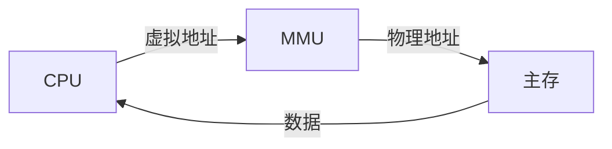

# 环境

## GNU

linux下编程永远绕不开`GNU`；是 `GNU's Not Unix` 的缩写，意思是`GNU`不是`Unix`。GNU下的软件都是开源免费的

GNU下的知名软件：

- C编译器：GNU C，就是传说中的GCC
- C++编译器：G++
- GNU C Library（GLIBC）
- Bash Shell

## GCC与G++

**gcc**是GNU的C编译器，**g++**是GNU的C++编译器，两者都是 `GNU Compiler Collection` 的一部分

编译器从拿到一个c文件到生成一个可执行程序，中间经历了四步：


```bash
# 假如源文件为：pid.c
gcc -E pid.c -o pid.i # 预处理：头文件展开、宏替换、去掉注释
gcc -S pid.i -o pid.s # 生成汇编文件
gcc -c pid.s -o pid.o # 生成目标（二进制）文件
gcc pid.o -o pid      # 生成可执行文件
```

安装搜`yum groupinstall`，centos/ubuntu都有

### 命令

```bash
-v / --version # 查看编译器版本，-v字多，另一个字少
-g             # 包含调试信息
-Wall          # 显示所有警告信息
-Wall -Werror  # 将警告信息当错误信息处理
-D             # 编译时定义宏，如：
gcc/g++ xx.c -o xxx -DHOME=7 # 此时，代码里就可以用HOME宏了(printf("%d", HOME);)

gcc/g++ xxx.c/cpp    # 编译链接并生成可执行文件（a.out）
gcc/g++ -c xxx.c/cpp # 编译成目标文件不链接，生成.o文件
gcc/g++ -O xxx.c/cpp -c # 编译成目标文件并优化执行速度，生成.o文件

# 将目标文件链接成二进制（可执行）文件
gcc 目标文件(.o) -o 可执行文件名 -lstdc++
g++ 目标文件(.o) -o 可执行文件名

gcc/g++ 源代码文件(.c/.cpp) -o 可执行文件名 # 直接编译成可执行文件
```

#### hello world

```c++
// 1. vim hello.cpp
#include <iostream>
int main() {
    // gcc hello.cpp 会报错，因为c不识别c++的库
    std::cout << "hello world!!!" << std::endl;
    // 如果关文件换成 #include <stdio.h>
    // 则 gcc hello.cpp / g++ hello.cpp 都好用
    printf("hello world!!!\n");
}
// 2. 编译：g++ hello.cpp
// 3. 执行：./a.out
// 结果：hello world!!!
```

#### 多个源文件

```c++
// dyn.h
#include <iostream>
void test();
// dyn.cpp
#include "dyn.h"
void test() { std::cout << "test" << std::endl; }
// main.cpp
#include "dyn.h"
int main() { test(); }
```

```bash
# 编译成可执行文件命令：
g++ -o abc main.cpp dyn.cpp
# 把代码里的c++库换成c库（iostream => stdio.h）
gcc -o abc main.cpp dyn.cpp
./abc # 结果：test
```

### g++与gcc区别

上面说g++是c++编译器，gcc是c编译器；但是g++也能编译c，gcc也能编译c++，区别为：

1. gcc会把.c文件当成c程序，g++会把.c文件当成c++程序。gcc / g++都会把.cpp文件当成c++程序

2. 编译阶段g++会调用gcc，但gcc不会自动连c++标准库，所以c和c++程序一般都用g++来编译。

3. gcc想要编译c++标准库需要加上选项：

   ```c++
   #include <iostream>
   int main() {
       std::cout << "hello world!!!" << std::endl;
   }
   // 这段代码通过 gcc hello.cpp -lstdc++ 就可以编译
   ```

## GDB

GDB（GNU Debugger）是一个调试程序，可以做四个主要事情：

1. 开始一个程序，指定任何可能影响其行为的事情
2. 让程序在特定条件下暂停
3. 程序停止时检查发生了什么
4. 改变程序中变量或数据

可调试的语言有：Ada、C / C++、Objective-C、Pascal等。**支持本地调试和远程调试**，可运行在windows和unix平台

linux 下的调试工具还有：xxgdb、ddd、kgdb、ups。会用 gdb 其它几种也能会用

```bash
apt install gdb # 安装
```

### 调试步骤

```bash
# 1. 生成调试信息：
#    gdb 一般调试 c/c++ 程序。首先在编译时，需要把调试信息加到可执行文件中，使用 `gcc/g++ -g` 如：
gcc/g++ -g xx.c -o xx
#    如果没有 -g，将看不到函数名、变量名，所代替的全是运行时内存地址
# 2. 启动gdb，并进入调试环境
gdb 可执行文件名
# 3. 设置运行参数
(gdb) set args 参数 # 如：set args 1 2 3 4 5
(gdb) show args # 查看设置好了的参数
(gdb) run      # 4. 启动程序，如果有断点，则停在第一个断点处，简写 r
(gdb) continue #    运行到下一个断点，简写 c
(gdb) step     #    执行下一行，会进入子函数，简写 s
(gdb) next     #    执行下一行，不会进入子函数，简写 n
(gdb) until    #    在一个循环体内单步跟踪时，该命令可以运行程序直到退出循环体，简写 u
(gdb) start # 5. 启动程序后单步执行
(gdb) quit  # 7. 退出gdb
```

### 显示源代码

```bash
(gdb) list    # 显示当前行后面的代码，默认10行，可简写成 l
(gdb) l -     # 显示当前行前面代码
(gdb) l n     # 显示第n行上下10行代码（5~14行）
(gdb) l main  # 显示函数名 main 上下10行代码
```

### 设置显示行数

```bash
(gdb) show listsize  # 显示当前listsize
(gdb) set listsize n # 设置 list 显示行数
```

### 断点操作

```bash
# 简单断点，break设置断点，可简写成b
(gdb) b 行号      # 根据行号下断点
(gdb) b 函数名     # 根据函数名下断点
(gdb) info break  # 显示断点，可简写 i b
```

```bash
# 多文件断点
(gdb) b 文件名:行号
(gdb) b 文件名:函数名
(gdb) b 类名::方法名 # 在类的方法上下断点
(gdb) b namespace::类名::方法名
```

```c
// 设置条件断点，如果代码：
for (int i = 0; i < 10; i++) {
    printf("...");
}

(gdb)b 3 if i == 7 // 如果i=7，则断点停下
```

### 断点维护

```bash
(gdb) delete  # 删除所有断点，简写 d
(gdb) d 1-5   # 删除1~5的断点，1~5是通过 i b 显示的 Num 列编号
(gdb) d 6     # 删除Num=6的断点
(gdb) disable # 禁用断点，简写 dis
(gdb) enable  # 启用断点，简写 en
```

### 自动显示

设置自动显示的变量，在单步跟踪时会显示

```bash
(gdb) display 变量名                  # 运行后一直显示变量，简写 disp
(gdb) undisplay [Num或变量名]          # 取消自动显示，不写参数表示取消全部，简写 und
(gdb) delete display [Num或变量名]     # 删除自动显示，不写参数表示取消全部，简写 d disp [num]
(gdb) info display                   # 查看全部自动显示，简写 i disp
(gdb) disable display                # 禁用断点，简写 dis disp
(gdb) enable display                 # 启用断点，简写 en disp
```

### 变量操作

```bash
(gdb) print 变量     # 打印变量值，简写 p
(gdb) ptype 变量     # 查看变量类型，简写 pt
(gdb) set var 变量=值 # 设置运行时变量的值
```

### 调试多进程

```bash
(gdb) set follow-fork-mode child  # 设置 gdb 在 fork 后跟踪子进程
(gdb) set follow-fork-mode parent # 设置跟踪父进程（默认）
```


## makefile

是程序编译规则，其记录整个工程的编译规则，如：源文件的编译顺序、依赖关系等，通过**make**工具进行编译

make根据makefile定义的规则将源代码编译成二进制文件。

在跨平台（特别是类Unix系统）程序中，一般都会通过makefile来进行编译

### 基本三要素

1）目标（必须）：通常是要产生的文件名，可以是可执行文件或obj文件，也可以是动作名称

2）依赖文件：

- 用来输入从而产生目标文件
- 一个目标通常有几个依赖文件（可以没有）

3）命令：

- make 执行的动作，一个规则可以含几个命令（可以没有）
- 有多个命令时，每个命令占一行

### 规则

```bash
# 一条规则：
目标: 依赖文件列表
<tab键>命令列表
```

### 变量

makefile文件中可以定义变量，使得更易于维护

#### 自定义变量

定义：变量名 = 变量值

引用：$(变量名) 或 ${变量名}

命名规则：

- 可以数字开头
- 大小写敏感
- 一般都在 makefile 头部定义
- 几乎可在 makefile 任何地方使用

#### makefile 提供的变量

都是大写的，可以对其赋值：

- CC = gcc
- CPPFLAGS：C预处理的选项 如：-l
- CFLAGS：C编译器的选项 如：-Wall -g -c
- LDFLAGS：链接器选项 如：-L -l

#### 三个变量

这三个变量不能单独使用，必须在命令中使用：

- $@  表示目标

- $^   表示所有依赖

- $<   表示第一个依赖

```makefile
OBJS = add.o sub.o main.o

main:$(OBJS)
	# gcc $(OBJS) -o main
	gcc $^ -o $@ # 上一句改成仨变量写法
add.o:add.c
	# gcc -c add.c -o add.o
	gcc -c $< -o $@ # 仨变量写法
sub.o:sub.c
	# gcc -c sub.c -o sub.o
	gcc -c $< -o $@ # 仨变量写法
main.o:main.c
	# gcc -c main.c -o main.o
	gcc -c $< -o $@ # 仨变量写法
clear: # 单独的目标，可以 make clear 删除所有编译文件
	rm -rf $(OBJS)
```

#### 模式规则

```makefile
# add.o:add.c
#	gcc -c $< -o $@
# sub.o:sub.c
#	gcc -c $< -o $@
# main.o:main.c
#	gcc -c $< -o $@

%.o: %.c  # 所有的.o都依赖于各自的.c
	gcc -c $< -o $@ # 将所有的.c生成.o，所以上面的部分可以被这两行替换
```

### 函数

makefile 中的函数很多，最常用的两个：

- wildcard：查找指定目录下的指定指定类型文件。`src = $(wildcard ./*.c)`，表示当前目录下所有.c文件
- patsubst：匹配替换。`o = $(patsubst %.c, %.o, $(src))`，把 src 里所有.c文件替换成.o文件

```makefile
# 最终的 makefile 文件形态
src = $(wildcard *.c)
all_target = $(patsubst %.c, %.o, $(src))

main: $(all_target)
    gcc $^ -o $@
%.o: %.c
    gcc -c $< -o $@
clear:
    rm -rf $(all_target) main
```

### 伪目标

上面例子中有个 `clear` 目标，若当前目录下有个叫 `clear` 的文件，再执行 `make clear` 则报：

```
make: 'clear' is up to date.
```

解决办法：给目标 `clear` 声明为伪目标（无条件执行）

```makefile
.PHONY:clear # 声明伪目标
clear:
    rm -rf $(all_target) main
```


## make

用于执行 makefile 文件里的指定(规则)

格式：`make [-f file] [options] [targets]`

- [-f file]：
  - make 默认在工作目录中找名为 GNUmakefile、makefile、Makefile 的文件执行
  - -f 可指定其它名字的文件
- [options]：
  - -v：显示 make 工具的版本
  - -w：处理 makefile 前、后显示工作路径
  - -C dir：读取 makefile 之前，切换工作目录到 dir 下
  - -n：只打印要执行的命令，但不执行==（一般用于测试命令写的对不对）==
  - -s：执行但不显示执行命令
- [targets]：
  - make 时如果没指定目标，则 make 工具默认执行 makefile 里第一个目标，然后退出
  - 可以指定一个或多个目标，多个用空格隔开

```makefile
# filename：mk1
all: test1 test2 # all 大目标
	echo "all"
test1: # 目标1
	echo "test1"
test2: # 目标2
	echo "test2"
```

```bash
make -f mk1
# 结果：
echo "test1"
test1
echo "test2"
test2
echo "all"
all
```

## cmake

高级编译配置工具。当多人用不同语言或编译器开发一个项目，最终要输出一个可执行文件或共享库（dll、so等），可以更加简单的==根据 CMakeList.txt 跨平台==生成 `makefile` 给 `make` 用。

### 关键字

#### PROJECT

用来指定工程的名字和支持的语言，默认支持所有语言

```bash
PROJECT(HELLO)        # 工程名 HELLO，并支持所有语言
PROJECT(HELLO CXX)    # ...         并支持C++语言
PROJECT(HELLO C CXX)  # ...         并支持C和C++
```

隐式定义了两个CMAKE变量：都是指向当前工作目录

- 工程名_BINARY_DIR：上面例子中是 `HELLO_BINARY_DIR`
- 工程名_SOURCE_DIR：上面例子中是 `HELLO_SOURCE_DIR`

==【注】==：当改变了工程名，这两个变量名也会变。此时可以使用 `PROJECT_BINARY_DIR` 和 `PROJECT_SOURCE_DIR` 来代替

#### SET

用来给变量赋值

```makefile
SET(SRC_LIST a.cpp b.cpp c.cpp ...) # 变量包含3个源文件
```

#### MESSAGE

向终端输出用户自定义信息，主要包含三种信息：

- SEND_ERROR：如果产生错误，则直接跳过
- SATUS：输出前缀为 `-` 的信息
- FATAL_ERROR：立即终止所有 cmake 过程

#### ADD_EXECUTABLE

生成可执行文件

```makefile
ADD_EXECUTABLE(hello ${SRC_LIST}) # 将src变量里的源文件生成 hello 可执行文件
```

#### ADD_SUBDIRECTORY

```makefile
ADD_SUBDIRECTORY(sourct_dir [binary_dir] [EXCLUDE_FROM_ALL])
```

功能：向当前目录添加存放资源的子目录，并可以指定编译后文件的存放目录。（==告诉cmake，我还有个目录要编译==）

- EXCLUDE_FROM_ALL：将目录从编译中排除

```makefile
ADD_SUBDIRECTORY(src bin)
# 将 src 目录加入工程并编译输出到 bin 目录
# 如果不指定 bin，则编译结果放在 build/src 下
```

#### ADD_LIBRARY

```makefile
ADD_LIBRARY(库名 SHARED/STATIC 源文件)
```

生成动、静态库

- 库名：lib库名.so
- SHARED：动态库
- STATIC：静态库

#### SET_TARGET_PROPERTIES

输出动、静态库名称，还可以指定版本

```makefile
SET_TARGET_PROPERTIES(库名 PROPERTIES OUTPUT_NAME "新名")     # 重命名库名
SET_TARGET_PROPERTIES(库名 PROPERTIES CLEAN_DIRECT_OUTPUT 1) # 清理提其它使用过该名的库
# VERSION：设置动态库版本，SOVERSION 设置API版本
SET_TARGET_PROPERTIES(库名 PROPERTIES VERSION 1.2 SOVERSION 1.2)
```

#### INCLUDE_DIRECTORIES

```makefile
INCLUDE_DIRECTORIES(/usr/local/include) # 添加头文件搜索路径
```

#### LINK_DIRECTORIES

```makefile
LINK_DIRECTORIES(/root/gt/libs) # 添加非标准库(/usr/local/lib /usr/lib 环境变量以外的)搜索路径
```

#### TARGET_LINK_LIBRARIES

```makefile
TARGET_LINK_LIBRARIES(main libxxx.so) # 指定要链接的共享库（环境变量以内的库 /usr/local/lib /usr/lib）
```


### 语法原则

1）变量用${}方式取值，但在 IF 语句中直接使用变量名

2）关键字不区分大小写，但关键字里参数区分；通常大写

3）关键字里多个参数用分号或空格分隔，通常空格

4）参数里有空格则必须加引号，如：`SET(SRC, "m ain.cpp")`

### 内部构建

上述例子就是内部构建，产生的临时文件特别多，不方便清理

### 外部构建

所生成的临时文件放到 build 目录下，不会对源文件有任何影响，强烈建议外部构建

```bash
# 比如当前目录下有 add.h add.c sub.h sub.c main.c
# 1. CMakeLists.txt
project(main C CXX)
set(src add.c sub.c main.c)
add_executable(main ${src})
# 2. mkdir build & cd build 新建build目录表示外部构建
# 3. cmake ..
# 4. make 编译
# 5. ./main 执行
```

### 工程示例

```bash
# 1. 构建如下目录结构
├── CMakeLists.txt
├── build
└── src
    ├── CMakeLists.txt
    └── main.cpp
```

```makefile
# 2. 编辑 CMakeLists.txt
# 2.1 src/CMakeLists.txt
add_executable(main main.cpp) # 只编译 main.cpp
# 2.2 ./CMakeLists.txt
project(mkt CXX) # 项目名mkt，用c++编译
add_subdirectory(src bin) # 编译src目录，到build/bin
```

```bash
# 3. 编译
cd build
cmake ..
make # 结果如下：
```

```bash
├── CMakeLists.txt
├── build
│   ├── CMakeCache.txt
│   ├── CMakeFiles
│   │   ├── 3.16.3
│   │   │   ├── CMakeCXXCompiler.cmake
│   │   │   ├── CMakeDetermineCompilerABI_CXX.bin
│   │   │   ├── CMakeSystem.cmake
│   │   │   └── CompilerIdCXX
│   │   │       ├── CMakeCXXCompilerId.cpp
│   │   │       ├── a.out
│   │   │       └── tmp
│   │   ├── CMakeDirectoryInformation.cmake
│   │   ├── CMakeOutput.log
│   │   ├── CMakeTmp
│   │   ├── Makefile.cmake
│   │   ├── Makefile2
│   │   ├── TargetDirectories.txt
│   │   ├── cmake.check_cache
│   │   └── progress.marks
│   ├── Makefile
│   ├── bin
│   │   ├── CMakeFiles
│   │   │   ├── CMakeDirectoryInformation.cmake
│   │   │   ├── main.dir
│   │   │   │   ├── CXX.includecache
│   │   │   │   ├── DependInfo.cmake
│   │   │   │   ├── build.make
│   │   │   │   ├── cmake_clean.cmake
│   │   │   │   ├── depend.internal
│   │   │   │   ├── depend.make
│   │   │   │   ├── flags.make
│   │   │   │   ├── link.txt
│   │   │   │   ├── main.o
│   │   │   │   └── progress.make
│   │   │   └── progress.marks
│   │   ├── Makefile
│   │   ├── cmake_install.cmake
│   │   └── main # 最终可执行文件
│   └── cmake_install.cmake
└── src
    ├── CMakeLists.txt
    └── main.cpp
```

### 变量

变量 `CMAKE_INSTALL_PREFIX` 用于指定安装目录，默认是 `/usr/local/`，注意用${}取值

```makefile
cmake -D CMAKE_INSTALL_PREFIX=/usr # CMAKE_INSTALL_PREFIX 的默认路径
```

### install

可以安装：二进制、动态库、静态库以及文件、目录、脚本等。语法为：

```makefile
install(FILES 文件1 文件2 文件n... DESTINATION 安装目录)
```

- FIELS：要安装的文件
- DESTINATION：安装到哪个路径
- PROGRAMS：安装的脚本文件
- DIRECTORY：后面连的是工程目录下的相对路径

#### 示例

1）添加 src 子目录，用来放代码

2）添加 lib 库目录，用来生成动、静态库

3）添加 doc 子目录，用来放文档

4）工程目录中添加 COPYRIGHT（版本），README

5）工程目录添加 run.sh脚本，用来调用编译好的可执行文件

6）将构建后的目标放入构建目录的bin子目录

7）将 doc 目录及 COPYRIGHT、README，安装到 /usr/share/doc/cmake

```bash
# 1. 在上个例子基础上，再建文件：run.sh、COPYRIGHT、README、lib/add.h add.cpp、doc/main.txt
├── CMakeLists.txt
├── COPYRIGHT
├── README
├── build
├── doc
│   └── main.txt
├── lib
│   ├── CMakeLists.txt
│   ├── add.cpp
│   └── add.h
├── run.sh
└── src
    ├── CMakeLists.txt
    └── main.cpp
```

```makefile
# 1. 编辑 ./CMakeLists.txt
project(mkt CXX)
add_subdirectory(lib lib) # 添加编译lib目录
add_subdirectory(src bin) # 添加编译src目录
install(FILES COPYRIGHT README DESTINATION share/doc/cmake/) # 安装 COPYRIGHT、README 到 /usr/local/share...
install(FILES lib/add.h DESTINATION include/add/) # 安装头文件，安装后就不用下面 INCLUDE_DIRECTORIES  
install(PROGRAMS run.sh DESTINATION bin) # 安装脚本 run.sh 到 /usr/local/bin
install(DIRECTORY doc/ DESTINATION share/doc/cmake/) # 安装 main.txt
# 注意：doc 和 doc/ 的区别
#	doc： 将doc安装到 share/doc/cmake 下
#   doc/：将doc下的内容安装到 share/doc/cmake 下

# 2. 编辑 lib/CMakeLists.txt
ADD_LIBRARY(add_dyn SHARED add.cpp) # 添加编译动态库
SET_TARGET_PROPERTIES(add_dyn PROPERTIES OUTPUT_NAME "add") # 重命名 libadd.so
SET_TARGET_PROPERTIES(add_dyn PROPERTIES CLEAN_DIRECT_OUTPUT 1) # 清理编译文件，同名动静态库必须

ADD_LIBRARY(add_static STATIC add.cpp) # 添加编译静态库
SET_TARGET_PROPERTIES(add_static PROPERTIES OUTPUT_NAME "add") # 重命名 libadd.a
SET_TARGET_PROPERTIES(add_static PROPERTIES CLEAN_DIRECT_OUTPUT 1) # 清理编译文件，同名动静态库必须

# 3. 编辑 src/CMakeLists.txt
INCLUDE_DIRECTORIES(/root/demo/cmk/lib)    # 头文件目录(相对路径没成功)
LINK_DIRECTORIES(/root/demo/cmk/build/lib) # 编译后的库文件目录(相对路径没成功)
add_executable(main main.cpp) # 可执行文件
target_link_libraries(main libadd.so) # 可执行文件依赖的库文件，改成 libadd.a 表示引静态库

cd build & cmake ..
make # 4. 编译结果：
[ 16%] Building CXX object lib/CMakeFiles/add_static.dir/add.o
[ 33%] Linking CXX static library libadd.a
[ 33%] Built target add_static
Scanning dependencies of target add_dyn
[ 50%] Building CXX object lib/CMakeFiles/add_dyn.dir/add.o
[ 66%] Linking CXX shared library libadd.so
[ 66%] Built target add_dyn
Scanning dependencies of target main
[ 83%] Building CXX object bin/CMakeFiles/main.dir/main.o
[100%] Linking CXX executable main
[100%] Built target main

make install # 5. 安装，结果：
[100%] Built target main
Install the project...
-- Install configuration: ""
-- Installing: /usr/local/share/doc/cmake/COPYRIGHT
-- Installing: /usr/local/share/doc/cmake/README
-- Installing: /usr/local/bin/run.sh
-- Up-to-date: /usr/local/share/doc/cmake/
-- Installing: /usr/local/share/doc/cmake//main.txt
```


# 动态库

动态链接：链接器在链接时仅仅建立与所需库函数之间的链接关系，在程序运行时才将所需的库调入可执行程序

```bash
# 生成动态库(.so)
#   -shared：指定生成动态库
#   -fpic：编译为独立的代码（pic小写大写都行）
#   -include：包含头文件，很少用，因为工程中一般都有相应的头文件
#   -I(大写i)：指定头文件路径，可用相对路径
gcc/g++ -shared x1.cpp x2.cpp xn.cpp -fpic -o libxx.so
# 生成.so后，可以通过下面命令查看是否包含源文件里的方法名：
nm libxx.so
nm libxx.so | grep "xxx" # 或者直接查找方法名
```

```bash
# 使用动态库
#   -L.：表示要链接的目录为当前目录。-L/usr/lib 表在要链接库的目录是/usr/lib
#   -l(小写L)：动态库的名称(并非动态库的文件名)，比如libabc.so，则名称为abc
gcc/g++ xx.cpp -L. -lxx -o 可执行文件名
```

## 示例

```c++
// dyn.h
#include <stdio.h>
void test();
// dyn.cpp
#include "dyn.h"
void test() { printf("test\n");}
// main.cpp
#include "dyn.h"
int main() {test();}
```

```bash
gcc/g++ -shared dyn.cpp -fPIC -o libdyn.so # 1. 生成动态库
gcc/g++ main.cpp -L. -ldyn -o aaa          # 2. 链接生成可执行文件aaa
export LD_LIBRARY_PATH=.:$LD_LIBRARY_PATH  # 设置当前目录为动态库的搜索路径之一
./aaa # 再次执行结果：test
```

## OS找到动态库

当上面例子一执行，便会报 `error while loading shared libraries: libxx.so: cannot open shared object file: No such file or directory`

五种解决办法：

1. 临时设置 LD_LIBRARY_PATH

   ```bash
   export LD_LIBRARY_PATH=.:$LD_LIBRARY_PATH
   ```

2. 将自己的共享库拷贝到 /lib 或 /usr/lib 下（不能是/lib64）

3. 永久设置：`export LD_LIBRARY_PATH=$LD_LIBRARY_PATH:库绝对路径`，设置到 ~/.bashrc 或 /etc/profile 中

   ```bash
   export LD_LIBRARY_PATH=$LD_LIBRARY_PATH:库绝对路径
   source ~/.bashrc 或 /etc/profile # 使配置生效，如果注掉配置并source后，发现还是能执行，此时关闭后重新再打开控制台就不生效了
   ```

4. 将 `库绝对路径` 添加到 `/etc/ld.so.conf` 中

   ```bash
   include /etc/ld.so.conf.d/*.conf
   /root/demo/s_lib # 后添加的 `库绝对路径`
   ldconfig         # 使配置生效。如果注掉也是当场生效，不需要重新开控制台
   ```

5. 使用符号链接（ln），必须是绝对路径

   ```bash
   ln -s /root/demo/s_lib/libxxxx.so /lib/libxxxx.so 或 /usr/lib/libxxxx.so
   ```

   

# 静态库

静态链接：由链接器在链接时将库的内容加入到可执行程序中

写个静态库步骤：

1. 将要生成静态库的源文件.c生成.o文件
2. 使用打包工具ar，将.o文件打包成.a文件（如：libxxx.a）
   - ar 工具参数：==r==更新，==c==创建，==s==建立索引

## 示例

```c
// add.h
int add(int,int);
// add.c
int add(int x, int y) { return x + y; }
// sub.h
int sub(int, int);
// sub.c
int sub(int x, int y) { return x - y; }
// main.c
#include "add.h"
#include "sub.h"
#include <stdio.h>
int main() {
    printf("7 + 77 = %d\n", add(7, 77));
    printf("77 - 7 = %d\n", sub(77, 7));
}
```

```bash
gcc -c add.c -o add.o
gcc -c sub.c -o sub.o        # 1. 生成目标文件
ar -rcs libxxx.a add.o sub.o # 2. 打包生成静态库
# 3. 将 add.h sub.h libxxx.a main.c 拷到另一个目录下（为验证.a是否生效）
gcc main.c -o main -L. -lxxx # 4. 生成可执行文件
# 5. 生成后，无论单独将 main 拷到哪里，都能跑
```


# mkfifo

**命名管道**，作用是进程间通信。本质是`linux`中的一个命令，用于创建一个0大小的文件（管道名）。

一个进程往该文件里写，另一个进程从该文件读取，就实现了进程间通信，和写普通文件一样

```bash
mkfifo [-m 权限(8进制数)] 管道名
mkfifo -m 666 test # 例：创建名叫test的管道，权限是666
```

```c
// 函数原型
#include <sys/stat.h>
int mkfifo(const char *pathname, mode_t mode); // 0：成功，1：失败
```

## 1. 写入端

```c++
#include <sys/stat.h>   // mkfifo
#include <stdio.h>
#include <fcntl.h>      // open、O_WRONLY
#include <unistd.h>     // write、close、sleep
#include <stdlib.h>     // exit(1)
#include <limits.h>     // PIPE_BUF
#define BUFES PIPE_BUF

int main() {
    char f_fifo[] = "pipe1";

    // 没有就创建，有就返回-1
    if (mkfifo(f_fifo, 0666) < 0) printf("mkfifo failed, maybe there exist a same fifo file\n");
    else printf("mkfifo ok\n");

    int fh, sz_buf;
    char buf[BUFES];
    // 打开
    if ((fh = open(f_fifo, O_WRONLY)) < 0) {
        printf("Open failed!\n");
        exit(1);
    } else printf("Open fifo ok!\n");

    for (int i = 0; i < 20000; i++) {
        sz_buf = sprintf(buf, "write data %d", i);
        printf("Send msg: %s\n", buf);
        if (write(fh, buf, sz_buf + 1) < 0) {
            printf("Write failed!\n");
            close(fh);
            exit(1);
        }

        usleep(1000); // 不能写的太快，否则监听端丢数据
    }

    close(fh);
    unlink(f_fifo);
    exit(0);
}
```

## 2. 监听端

```c++
#include <sys/stat.h>
#include <unistd.h>
#include <stdio.h>
#include <stdlib.h>
#include <limits.h>
#include <fcntl.h>
#include <unistd.h>
#define BUFES PIPE_BUF

int main() {
    int fh, len;
    char f_fifo[] = "pipe1";
    char buf[BUFES];

    if ((fh = open(f_fifo, O_RDONLY)) < 0) {
        printf("Open failed!\n");
        exit(1);
    }

    while ((len = read(fh, buf, BUFES)) > 0) printf("Read_fifo read:%s\n", buf);
    
    close(fh);

    exit(0);
}
```

## 3. java监听

```java
import java.io.BufferedReader;
import java.io.FileReader;
import java.io.IOException;

public class RecvFifo {
    public static void main(String args[]) {
        while (true) {
            try {
                BufferedReader in = new BufferedReader(new FileReader("pipe1"));
                char buf[] = new char[4096];
                while (in.read(buf) > 0) {
                    System.out.println(new String(buf));
                }
            } catch (IOException e) {}
        }
    }
}
```

说明：先运行写入端，会在`open`处阻塞；当监听端以读权限打开`pipe1`文件时，写入端才会写数据

# 文件

## 文件描述符

linux 里一切皆文件。打开或新建文件时，系统会返回一个文件描述符（相当于标号，非负数，`fopen` 返回的 `FILE*`），用来指定已打开的文件。

程序运行起来后（每个进程）都有一张文件描述符表，系统占用0（标准输入）、1（标准输出）、2（标准错误输出）这三个描述符，其它文件要从3开始

对文件描述符进行操作，就相当于对文件进行操作

## 最大打开文件数

linux 中一个进程最多只能打开 `NR_OPEN_DEFAULT`（即1024）个文件，因此要及时 `close()` 不用的文件

```bash
cat /proc/sys/fs/file-max # 当前系统允许打开最大文件数
ulimit -a # 当前默认最大打开文件个数（open file = 1024）注：参考os -> ubuntu.md -> ulimit
ulimit -n 4096 # 设置默认最大打开文件数为4096（open file）
```

## 阻塞非阻塞

1）常规读文件不会阻塞，不管读多少，`read` 都会在有限时间内返回

2）从终端设备或网络读则不一定。

- `read` 终端设备的数据没有换行符会阻塞
- `read` 网络上没有接收到数据包会阻塞，没有数据就一直阻塞

3）写常规文件不会阻塞，但向终端设备或网络写则不一定

## 文件描述符复制

`dup()` 和 `dup2()` 都是复制一个文件的描述符，用来文件重定向

好比配钥匙，钥匙相当于文件描述符，锁相当于文件，这样就能多把钥匙开一把锁

# 进程

## MMU

是 `Memory Management Unit` 的缩写，译为 `内存管理单元`，是 CPU 管理`虚拟存储器`、`物理存储器`的控制线路，同时也负责虚拟地址映射为物理地址，以及提供硬件的内存访问权限



## 进程控制块

进程运行时，内核为每个进程分配一个 PCB（process control block 译：进程控制块）来维护进程相关信息。其中包含：

- state（进程状态）：就绪、运行、等待、停止
- number（进程号）：唯一编号，即进程号PID
- counter：保存下一条进程要执行指令的内存地址
- register：在CPU上运行时，用了哪些寄存器，以及这些寄存器的值
- memory limits：保存一些和内存相关的信息
- files（打开的文件）

C里PCB是`task_struct`结构体

## 进程状态

三态模型中：运行太、就绪态、阻塞态

五态模型中：新建态、终止态、运行态、就绪态、阻塞态

## 进程号相关

每个进程都有一个进程号相关标识，类型为 `pid_t`（整形），范围是 0 ~ 32767。进程号是唯一的，但可以重用，当一个进程终止后，其进程号可以再次使用

## 进程组

一个或多个进程的集合。它们之间相互关联（父子关系），可接收同一终端各种信息，关联的进程有一个进程组号（PGID）

## 孤儿进程

当父进程 fork 了个子进程后就结束了，但子进程还没结束，此时子进程就成了**孤儿进程**。

孤儿进程会托管给系统进程（pid=1）

## 僵尸进程

子进程终止，父进程尚未回收，子进程残留资源（PCB）存放于内核中，变成僵尸（zombie）进程

导致的问题是：如果进程不调 `wait()` 或 `waitpid()` 的话，那么进程资源不会被释放，其进程号就会一直被占用。系统进程号是有限的，如果大量产生僵尸进程，将没有可用的进程号，导致系统不再产生新进程。

```c
#include <sys/types.h>
#include <unistd.h>
#include <stdlib.h>
#include <stdio.h>

int main() {
    if (fork() == 0) { // 子进程
        for (int i = 0; i < 5; i++) {
            printf("sub proc %d \n", i);
            sleep(1);
        }
        exit(0); // 子进程退出
    }
    sleep(20); // 没有调用wait，未回收子进程资源。sleep过后，僵尸进程消失
}
```

```bash
# 上面程序跑起来后再执行
ps aux | grep Z
# 结果：                                        Z+表示僵尸进程
USER       PID %CPU %MEM    VSZ   RSS TTY      STAT START   TIME COMMAND
root       294  0.0  0.0      0     0 pts/1    Z+   09:12   0:00 [z] <defunct>
```

## 进程间通信

IPC（Inter Processes Communication）目的：

- 数据传输：一个进程传数据给另一个进程
- 通知事件：一个进程向另一个或一组进程发消息
- 资源共享：多个进程间共享资源，需要内核提供互斥、同步机制
- 进程控制：一个进程对另一个进程实施有效管理，具有对目标进程的创建、撤销、状态转换

同主机进程间通信：

- Unix进程间通信方式：
  - 无名管道
  - 有名管道
  - 信号
- System V 和 POSIX 进程间通信方式：
  - 消息队列
  - 共享内存
  - 信号量

不同主机（网络）进程间通信：Socket

### 无名管道

是 Unix 系统进程间通信最古老形式，所有 Uinx 都支持

管道特点：

- 半双工，同一时刻一端只能发或只能收
- 写入管道的数据先进先出（队列）
- 写入方和接收方要事先给定好数据格式，如多少字节算一条消息
- 管道不是文件，只存在于内存中
- 管道在内存中对应一个缓冲区，不同系统大小不同
- 从管道读数据是一次性操作，一旦被读取，管道就会释放该数据的空间资源
- 管道没有名，只能在具有公共祖先（父与子进程，或两个兄弟进程）的进程间使用

#### 例子

```c
// 父子进程利用无名管道通信
// 父进程写，子进程读
#include <string.h>
#include <stdlib.h>
#include <stdio.h>
#include <unistd.h>

#define SZ 64

int main() {
    int fds[2];
    char bf[SZ];
    memset(bf, 0, SZ);

    if (0 != pipe(fds)) {
        perror("pipe");
        exit(-1);
    }

    if (0 == fork()) { // 子进程
        close(fds[1]); // 关闭写管道
        if (-1 == read(fds[0], bf, SZ)) {
            perror("read pipe");
            exit(-1);
        }
        printf("child read：%s\n", bf);
        close(fds[0]);
    } else {           // 父进程
        close(fds[0]);
        printf("father write: haha\n");
        if (-1 == write(fds[1], "haha", 4)) {
            perror("father write");
            exit(-1);
        }
        close(fds[1]);
    }
} // 执行结果：
// father write: haha
// child read：haha
```

#### 读写特点

需要注意以下4种情况：假设都是阻塞I/O操作，没有设置 O_NONBLOCK 标志

1. 如果写端的描述符（fd[1]）关闭，而仍有进程从读端读数据，那么管道中数据读完后再读就返回0，就像读到文件尾一样
2. 如果写端（fd[1]）没关闭，而写端也没往管道里写数据，那么读端读完数据后再读，会一直阻塞，直到写端写入数据
3. 如果读端（fd[0]）关闭，此时有写端定入，那么写进程会收到 `SIGPIPE` 信号，通常进程会异常终止。也可以捕获 `SIGPIPE` 信号不终止进程
4. 如果读端（fd[0]）没关闭，而写端一直在写，但读端没有读，那么管道写满后再写，就会一直阻塞，直到读了数据有空位置后才能再写

# 系统api

所有的api可通过`man`查看用法及包含的头文件

## 进程

### getpid

返回当前进程号。rust：`unsafe { libc::getpid() }`

### getppid

获取父进程号

### getpgid

获取进程组号（PGID）

### fork

创建一个当前进程的子进程，成功返回 pid，失败则返回-1，被创建的子进程返回 0。rust：`unsafe { libc::fork() }`

fork 后的父子进程是异步执行的，==子进程不会执行fork上面代码==

windows下调该方法报错，因为没有

```rust
unsafe {
    println!("before fork pid: {}", libc::getpid());
    let cid: libc::c_int = libc::fork(); // 子进不执行fork以上代码
    println!("cid: {}", cid);
    println!("after fork pid: {}", libc::getpid());
    libc::wait(std::ptr::null_mut()); // 等待子进程结束，c里的 NULL == std::ptr::null_mut()
} // 结果：
// before fork pid: 563 父进程的结果
// cid: 584             父进程的结果，正常返回pid
// after fork pid: 563  父进程的结果
// cid: 0               子进程的结果，返回 0
// after fork pid: 584  子进程的结果
```

### wait

```c
#include <sys/types.h>
#include <sys/wait.h>

pid_t wait(int *wstatus);
pid_t waitpid(pid_t pid, int *wstatus, int options);
int waitid(idtype_t idtype, id_t id, siginfo_t *infop, int options);
```

功能：等待fork出来的一个子进程结束，==并回收子进程资源==，`wait(NULL)` == `libc::wait(std::ptr::null_mut())`

参数：进程退出时的状态信息

返回值：成功返回子进程号，失败-1

```c
int status = 0;

wait(&status);

if (WIFEXITED(status))    printf("正常结束: %d\n", WIFEXITED(status));
if (WEXITSTATUS(status))  printf("获取进程退出状态: %d\n", WEXITSTATUS(status));

if (WIFSIGNALED(status))  printf("进程异常终止: %d\n", WIFSIGNALED(status));
if (WTERMSIG(status))     printf("获取进程异常终止号: %d\n", WTERMSIG(status));

if (WIFSTOPPED(status))   printf("暂停状态: %d\n", WIFSTOPPED(status));
if (WSTOPSIG(status))     printf("获取进程暂停号: %d\n", WSTOPSIG(status));
if (WIFCONTINUED(status)) printf("进程暂停后已继续运行: %d\n", WIFCONTINUED(status));
```

### waitpid

```c
#include <sys/types.h>
#include <sys/wait.h>

pid_t waitpid(pid_t pid, int *wstatus, int options);
```

功能：可以设置不阻塞，也可以设置等待哪个子进程

参数：

- pid > 0：等待指定pid的子进程
- pid = 0：等待同一进程组中的所有子进程
- pid = -1：等同于 wait
- pid < -1：等待指定进程组的所有子进程，此时pid的==绝对值==是该进程组的pid
- status：和 wait 一样
- options：提供了些额外选项来控制
  - 0：同 wait，阻塞父进程，等待子进程结束
  - WNOHANG：非阻塞，立即返回
  - WUNTRACED：如果子进程暂停，则马上返回，不管子进程是什么状态（因涉及到调试知识，极少使用）

返回值：三种情况

1. 正常返回时，返回已经回收了的子进程号
2. 设置了 WNOHANG 时，且没有可等待的子进程，返回0
3. 调用出错返回-1

### sleep

`sleep(3)` 睡3秒

### exit

```c
#include <stdlib.h>
void exit(int status);
void _Exit(int status);

#include <unistd.h>
void _exit(int status);
```

功能：结束此进程

参数：返回给父进程的参数（低8位有效）

`exit()`和`_exit()`区别：`exit`是标准库函数，`_exit`是系统调用（不会做任何善后处理）

```c
// 例：
#include <stdlib.h>
#include <stdio.h>
#include <unistd.h>

int main() {
    printf("haha\n");
    exit(0);
    _Exit(0); // #include <stdlib.h>，这两个退出后的结果会显示haha
    _exit(0); // #include <unistd.h>，不显示haha，不做善后处理
}
```

### execl

```c
#include <unistd.h>

extern char **environ;

int execl(const char *pathname, const char *arg, .../* (char  *) NULL */);
int execlp(const char *file, const char *arg, .../* (char  *) NULL */);
int execle(const char *pathname, const char *arg, .../*, (char *) NULL, char *const envp[] */);
int execv(const char *pathname, char *const argv[]);
int execvp(const char *file, char *const argv[]);
int execvpe(const char *file, char *const argv[],char *const envp[]);

int execve(const char *pathname, char *const argv[],char *const envp[]);
```

==只有 execve 是真正的系统调用，其它都是封装它的库函数==

一个进程调用 exec 函数族，根据指定的可执行文件后启动进程，此时新进程将替换原进程。进程号、父进程号、进程组号、当前工作目录并不会改变

参数arg：是多个参数，其最后一个必须是 NULL

```c
#include <stdio.h>
#include <unistd.h>

int main() {
    printf("start\n");
    // 执行 ls /usr
    // arg1：ls是可执行文件，ls /usr 是参数 arg，最后要以NULL结尾
    execlp("ls", "ls", "/usr", NULL);
    // arg1：是ls的绝对路径
    execl("/bin/ls", "ls", "/usr", NULL);
    // 将参数直接放到数组里
    char* args[] = { "ls", "/usr", NULL };
    execvp("ls", args);
    
    printf("end\n"); // 没有执行，说明新进程替换了原进程
}
// 结果：
start
bin  games  include  lib  lib32  lib64  libexec  libx32  local  sbin  share  src // ls /usr
```


## 线程

### pthread_create

创建一个线程，创建成功后x86_64默认分配2M的栈大小

==注意==：由于 `pthread` 不是 linux 系统默认库，连接时需要静态库 `libpthread.a`，所以编译时要加 ==`-lpthread`或`-pthread(推荐)`==，如：

==`gcc thr.c -o thr -pthread`==

```c
// 返回值：成功0，失败返回错误码
int pthread_create(
    pthread_t *thread,               // 成功后返回thread id
    const pthread_attr_t *attr,      // 线程属性，可以给NULL
    void *(*start_routine) (void *), // 执行线程的函数指针
    void *arg                        // 传给线程的参数，可以给NULL
);
```

### pthread_join

等待线程结束

```c
// 成功返回0，失败返回错误号
int pthread_join(pthread_t thread, void **retval); // arg1：要等待的线程id，arg2：可以NULL
```

### pthread_exit

`pthread_exit(0);` 正常结束返回一个线程

### 例子

> 创建、等待、传参

```c
#include <stdio.h>
#include <pthread.h>

void* fn(void* arg) {
    printf("thread run fn, paramter: %d\n", *((int*)arg));
}

int main() {
    int p = 7;
    pthread_t tid;
    pthread_create(&tid, NULL, fn, (void*)&p);
    pthread_join(tid, NULL); // 结果：thread run fn, paramter: 7
}
```

## 错误处理

`errno` 是记录系统的最后一次错误代码（int 型值），在 `error.h` 中。当 linux c api 函数发生异常时，一般会将 errno 赋一个值，不同值不同含义

```c
#include <stdio.h>
#include <errno.h>
#include <string.h> // strerror

int main() {
    FILE* fp = fopen("haha", "r");
    if (NULL == fp) {
        printf("no: %d\n", errno); // 结果：no: 2
        printf("str: %s\n", strerror(errno)); // 结果：str: No such file or directory
        // 比 strerror 常用，参数是提示信息
        perror("fopen"); // 结果：fopen: No such file or directory
    }
}
```

## 文件

open、read、write等等（fopen、fwrite、fread等则是c的标准库，并非系统api，可以从头文件看出来）

### lseek

```c
#include <sys/types.h>
#include <unistd.h>

off_t lseek(int fd, off_t offset, int whence);
```

功能：改变文件偏移量
参数：

- fd：文件描述符
- offset：根据 `whence` 移动偏移量，可以是正（向右或后）或负（向左或前）数。
  - 如果向前超过了开头则报错返回
  - 如果向后超过了文件末尾，则再写入时增大文件尺寸
- whence：
  - SEEK_SET：从文件开头移动 `offset` 个字节
  - SEEK_CUR：从当前位置移动 `offset` 个字节
  - SEEK_END：从文件末尾移动 `offset` 个字节

返回值：成功则返回新的偏移量，失败则返回-1

> 所有打开的文件都有一个当前偏移量（current file offset），简称 `cfo`。通常是非负整数，用于表明文件开始处到当前位置的字节数

> 读写操作通常开始于 `cfo`，并使 `cfo` 增大，增量为读写的字节数。文件被打开时，`cfo` 被初始为0，除非 `O_APPEND`（末尾追加）

```c
// 例子
#include <stdio.h>
#include <sys/types.h>
#include <sys/stat.h>
#include <fcntl.h>
#include <unistd.h>
#include <sys/types.h>
#include <string.h>

int main() {
    int fd = open("txt", O_RDWR | O_CREAT, 0644);
	char bf[128];
    
    if (fd == -1) {
        perror("open");
        return 1;
    }
    printf("fd = %d\n", fd);

    write(fd, "ABCDEFG", 7); // 先写入7个字

    if (lseek(fd, 32, SEEK_SET) == -1) { // 再后移32位(包含上一行的7个字符)
        perror("lseek");
        return 1;
    }

    write(fd, "1234567890", 10); // 再写入10个字

    memset(bf, 0, 128);
    lseek(fd, 0, SEEK_SET); // 从文件开头移0个，就是把位置移到文件首，如果不移下面read不出来，因为已经在文件尾了
    int sz = read(fd, bf, 128);
    printf("size: %d, bf: %s\n", sz, bf); // 结果： size: 42, bf: ABCDEFG
                                          //    因为遇到 ^@ 这种不可表示的符号就当作结束称了，因此1~0那10个没显示
    
    close(fd);
}
// vim txt 内容：
// 		ABCDEFG^@^@^@^@^@^@^@^@^@^@^@^@^@^@^@^@^@^@^@^@^@^@^@^@^@1234567890
// ll 查看文件大小：
// 		-rw-r--r-- 1 root root    42 Jul 22 18:40 txt
//      最终 右移的32 + 后写入10 = 42
```

### stat

```c
#include <sys/types.h>
#include <sys/stat.h>
#include <unistd.h>

int stat(const char *pathname, struct stat *statbuf);
int fstat(int fd, struct stat *statbuf);
int lstat(const char *pathname, struct stat *statbuf);
```

功能：获取文件信息。当文件是一个符号链接时：

- lstat：返回符号链接的信息
- stat：返回链接指向的文件信息

参数：pathname 文件名，statbuf 保存文件信息的结构体

返回值：成功0，失败-1

```c
struct stat {
    dev_t     st_dev;         /* 文件设备编号 ID of device containing file */
    ino_t     st_ino;         /* 节点 Inode number */
    mode_t    st_mode;        /* 文件类型和存取权限 File type and mode */
    nlink_t   st_nlink;       /* 硬连接数，刚创建时为1 Number of hard links */
    uid_t     st_uid;         /* 用户id User ID of owner */
    gid_t     st_gid;         /* 组id Group ID of owner */
    dev_t     st_rdev;        /* 若该文件为设备文件，则为设备编号 Device ID (if special file) */
    off_t     st_size;        /* 文件大小（字节数）Total size, in bytes */
    blksize_t st_blksize;     /* 块大小（文件系统的I/O）Block size for filesystem I/O */
    blkcnt_t  st_blocks;      /* 块数 Number of 512B blocks allocated */

    /* Since Linux 2.6, the kernel supports nanosecond
                  precision for the following timestamp fields.
                  For the details before Linux 2.6, see NOTES. */

    struct timespec st_atim;  /* 最后一次访问时间 Time of last access */
    struct timespec st_mtim;  /* 最后一次修改时间 Time of last modification */
    struct timespec st_ctim;  /* 最后一次改变时间（比如修改权限）Time of last status change */

    #define st_atime st_atim.tv_sec      /* Backward compatibility */
    #define st_mtime st_mtim.tv_sec
    #define st_ctime st_ctim.tv_sec
}
```

```c
// 例子
#include <sys/types.h>
#include <sys/stat.h>
#include <unistd.h>
#include <stdio.h>

int main() {
    struct stat s;
    if (-1 == stat("txt", &s)) {
        perror("stat");
        return -1;
    }

    printf("st_dev: %lu\n", s.st_dev);
}
```

#### st_mode

1）文件类型：

```c
switch (sb.st_mode & S_IFMT) { // 需要先 & 下 S_IFMT，后才能 case 类型
    case S_IFBLK:  printf("块设备\n");                  break;
    case S_IFCHR:  printf("字符设备\n");                 break;
    case S_IFDIR:  printf("目录\n");                    break;
    case S_IFIFO:  printf("管道 FIFO/pipe\n");          break;
    case S_IFLNK:  printf("符号链接\n");                 break;
    case S_IFREG:  printf("普通文件\n");                 break;
    case S_IFSOCK: printf("套接字\n");                  break;
    default:       printf("unknown?\n");                break;
}
```

```c
// 另一种写法
S_ISREG(s.st_mode);  // 1：普通文件，0：不是
S_ISDIR(s.st_mode);  // 1：普通文件，0：不是
S_ISCHR(s.st_mode);  // 1：字符设备，0：不是
S_ISBLK(s.st_mode);  // 1：块设备，0：不是
S_ISFIFO(s.st_mode); // 1：管道，0：不是
S_ISLNK(s.st_mode);  // 1：符号链接，0：不是
S_ISSOCK(s.st_mode); // 1：套接字，0：不是
```

2）文件权限：

```c
if (s.st_mode & S_ISUID) // 文件的(set user-id on execution)位
if (s.st_mode & S_ISGID) // 文件的(set group-id on execution)位
if (s.st_mode & S_ISVTX) // 文件的sticky位

if (s.st_mode & S_IRUSR) // 文件所有者具可读取权限
if (s.st_mode & S_IWUSR) // 文件所有者具可写入权限
if (s.st_mode & S_IXUSR) // 文件所有者具可执行权限

if (s.st_mode & S_IRGRP) // 用户组具可读取权限
if (s.st_mode & S_IWGRP) // 用户组具可写入权限
if (s.st_mode & S_IXGRP) // 用户组具可执行权限

if (s.st_mode & S_IROTH) // 其他用户具可读取权限
if (s.st_mode & S_IWOTH) // 其他用户具可写入权限
if (s.st_mode & S_IXOTH) // 其他用户具可执行权限
```

### access

```c
#include <unistd.h>
int access(const char *pathname, int mode);
```

功能：测试某文件是否具有某属性

参数：

- pathname：文件名
- mode：4种文件权限
  - R_OK：是否有读权限
  - W_OK：写权限
  - X_OK：执行权限
  - F_OK：测试文件是否存在

返回值：0有，-1没有

### chmod

```c
#include <sys/stat.h>
int chmod(const char *pathname, mode_t mode);
int fchmod(int fd, mode_t mode);
```

功能：修改文件权限

参数：filename 文件名，mode 权限(8进制数)

返回值：0成功，-1失败

### chown

修改文件所有者和所属组

### truncate

修改文件大小

### link

创建一个硬链接

### symlink

创建一个软链接

### readlink

读软连接对应的文件名，不是内容

### unlink

删除一个软/硬连接文件

### rename

文件重命名

### dup

目地是可将同一个文件在不同处修改

```c
#include <.h>
int dup(int oldfd);
```

功能：通过 oldfd 复制个新的文件描述符

返回值：失败-1，成功返回新文件描述符

```c
int dup2(int oldfd, int newfd);
```

参数：newfd 新文件描述符，可以人为指定（0~1023）；如果指定的被占用，则先废弃被占用的关联，再使用

返回值：成功返回 newfd（等于参数里的newfd），失败-1

### fcntl

```c
#include <unistd.h>
#include <fcntl.h>

int fcntl(int fd, int cmd, ... /* arg */ );
```

功能：改变已打开的文件性质

参数：

- fd：要操作的文件描述符
- cmd：操作方式
  - F_DUPFD：复制一个现有描述符，==区别于dup，操作同一文件的多个fd会相互覆盖==
  - F_GETFD / F_SETFD：获取 / 设置文件描述符标记
  - F_GETFL / F_SETFL：获取 / 设置文件状态标记
  - F_GETOWN / F_SETOWN：获取 / 设置异步I/O所有权
  - F_GETTLK / F_SETTLK / F_SETLKW：获取 / 设置记录锁
- arg：针对cmd的值

返回值：成功返回某个其它值，失败-1

==【注】==：只能改变 O_APPEND(追加)、O_ASYNC(异步)、O_DIRECT(不缓存写入，内容多了快)、O_NONBLOCK(非阻塞)

## 目录

### getcwd

```c
#include <unistd.h>

char *getcwd(char *buf, size_t size);
char *getwd(char *buf);
char *get_current_dir_name(void);
```

功能：获取当前进程的工作目录

参数：

- buf：返回当前工作目录
- size：buf的大小

返回值：成功返回和buf一样的内容（地址也相同），失败NULL

### chdir

```c
#include <unistd.h>

int chdir(const char *path);
int fchdir(int fd);
```

功能：修改当前进程（应用程序）的路径

参数：切换的路径

返回值：成功0，失败-1

### opendir

```c
#include <sys/types.h>
#include <dirent.h>

DIR *opendir(const char *name);
DIR *fdopendir(int fd);
```

功能：打开一个目录

参数：目录名

返回值：成功返回 `DIR` 结构体指针，失败NULL

### closedir

```c
#include <sys/types.h>
#include <dirent.h>

int closedir(DIR *dirp);
```

功能：关闭目录

参数：返回打开的 `DIR` 指针

返回值：成功0，失败-1

### mkdir

创建目录

### readdir

```c
#include <dirent.h>

struct dirent *readdir(DIR *dirp);
```

```c
struct dirent {
    ino_t          d_ino;       /* Inode number */
    off_t          d_off;       /* Not an offset; see below */
    unsigned short d_reclen;    /* d_name的长度 */
    unsigned char  d_type;      /* 指向的文件类型 */
    char           d_name[256]; /* 文件名 */
};
```

功能：读取目录

参数：返回目录结构打针

返回值：成功返回目录结构指针，失败NULL

## 管道

### pipe

```c
#include <unistd.h>

/* On Alpha, IA-64, MIPS, SuperH, and SPARC/SPARC64; see NOTES */
struct fd_pair {long fd[2];};
struct fd_pair pipe();

/* On all other architectures */
int pipe(int pipefd[2]);
```

功能：创建无名管道

参数：

- int 型数组首地址，存放管道描述符
- 当一个管道建立时，会创建两个文件描述符 fd[0] 和 fd[1]。其中 fd[0] 用于读管道，而 fd[1] 用于写管道
- 一般的文件 I/O 函数都可以操作管道（lseek除外）

返回值：0成功，1失败


https://www.bilibili.com/video/BV1Yo4y1D7Ap?p=120&vd_source=2ddb3806f7e4c08fd841529f280d8bee
