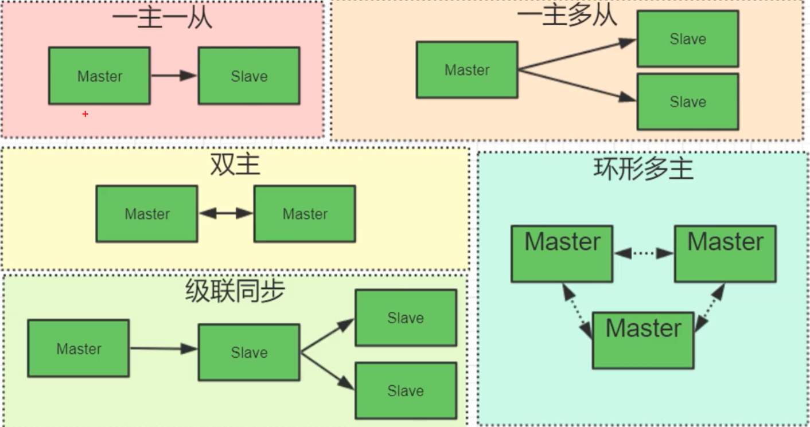

# 1，索引

- 是帮助 mysql 高效获取数据**排好序**的**数据结构**
- 主键尽量用整型
- 自增主键效率最高

```mysql
-- 显示某表的索引
show index from 表名;
-- 添加索引
-- CREATE INDEX 索引名 ON 表名(列名)
CREATE INDEX person_name ON person(name)

-- 插入100w条数据 好测索引
CREATE FUNCTION data_100w() -- 创建函数
RETURNS INT -- RETURN + 'S'
BEGIN
	DECLARE n INT DEFAULT 1000000;
	DECLARE i INT DEFAULT 0;
	WHILE i < n DO
		INSERT INTO person VALUES(CONCAT(i,'id'),CONCAT(i,'name'),1,20,30,40);
		SET i = i + 1;
	END WHILE;
	RETURN i;
END;
SELECT data_100w() -- 调用函数

# 索引有无的效率差很多
-- [SQL]SELECT * FROM person WHERE id='483659id';
-- 受影响的行: 0
-- 时间: 0.000s

-- [SQL]SELECT * FROM person WHERE name='483659name';
-- 受影响的行: 0
-- 时间: 3.003s
```


## 1.1 四类索引

```mysql
# 主键索引（PRIMARY KEY）
ALTER TABLE `table_name` ADD PRIMARY KEY (`column`) 
# 唯一索引（UNIQUE KEY）
ALTER TABLE `table_name` ADD UNIQUE (`column`)
# 常规（普通）索引（KEY/INDEX）--- 默认
ALTER TABLE `table_name` ADD INDEX index_name (`column`)
# 多列索引
ALTER TABLE `table_name` ADD INDEX index_name (`column1`,`column2`,`column3`)
# 全文索引（FULLTEXT）
ALTER TABLE `table_name` ADD FULLTEXT (`column`)

# 删除索引
alter table table_name drop index index_name ;
```

- 主键索引（PRIMARY KEY）
  
  - 唯一的标识，每个表只有一个
- 唯一索引（UNIQUE KEY）
  
  - 值必须唯一。可以多个列组合成一个唯一索引；同样，组合后的值也必须唯一
- 常规（普通）索引（Normal）--- **默认**
  
  - 没有任何限制
- 全文索引（FULLTEXT）
  
  - 类似于 like 这种关键字模糊查询，但比 like 快。适用于大文本
  
  - ==坑点==
  
    ```mysql
    # 注：navcat里创建时，“索引方法”要空着，不能先 BTREE 和 BASH
    # 1. 要在配置文件里加上（window：my.ini）（linux：my.cnf）后，重启mysql
    ft_min_word_len=1 # 默认是4，即使=0也会是1
    # 2. 添加fulltext索引，配置完 ft_min_word_len 后需要删除原来的全文索引重新添加
    # 	 mysql8+版本要加上 WITH parser ngram，重新设置的 ft_min_word_len 才起作用，mysql5版本没试
    ALTER TABLE 表名 ADD FULLTEXT 索引名(字段) WITH parser ngram;
    # 3. 用法
    SELECT xx FROM d_oa_mjh WHERE MATCH (xx) against('00'); # 检索字符只有1个以上才能检出数据（字母/数字/汉字 都要1个以上）
    ```

## 1.2 EXPLAIN

翻译过来叫执行计划，通过 explain 可以分析查询语句的执行效率

- 分析 sql 的执行状况

```mysql
EXPLAIN SELECT * FROM person WHERE `id`='483659id';     -- 带索引
EXPLAIN SELECT * FROM person WHERE `name`='483659name'; -- 不带索引
```

- 分析结果：每一行代表sql文中一个表的执行情况


| type  | possible_type | key     | key_len | ref   | rows       | filtered | extra       |
| ----- | ------------- | ------- | ------- | ----- | ---------- | -------- | ----------- |
| const | PRIMARY       | PRIMARY | 110     | const | ==1==      | 100      |             |
| ALL   |               |         |         |       | ==919085== | 10       | Using where |

**type：**连接类型。常用6种：all < index < range < ref < eq_ref < const，从左到右效率依次增强。https://blog.csdn.net/dennis211/article/details/78170079

- const：查询索引字段，并且表中最多只有一行匹配（只有主键查询才会是const）
- eq_ref：使用到了 primary key 或 unique 类型索引
- ref：根据索引查找到一个或多个值（非唯一索引）
- range：对索引列进行范围查找（如 between，and，or，in，>，<）
- index：根据索引对数据的排序，进行全表扫描
- ==all：无索引的全表扫描==

**possible_type：**可能会用到的索引

**key：**实际上真正用到的索引

**key_len：**索引字段长度，==在不损失精确度情况下，越小越好==

- int = 4，long = 8

- 计算公式：varchar(n) + 允许null = n * (utf8=3，gbk=2，latin1=1) + 1（null）+ 2（字符串额外要加上个2）

**ref：**索引用到哪列，但它只是个常量。比如索引用到了a, b两列，那么就会显示 "const,const"

**rows：**扫描行数

**filtered：**按条件过滤行的百分比

**extra：**执行情况描述

## 1.3 索引原则

- 不是越多越好
- 不要对经常变动的数据加索引
- 数据量少的表不要加索引
- 要加在经常查询的字段上


## 1.4 索引数据结构

- 二叉树

- 红黑树，又叫二叉平衡树。**缺点：数据越多，树越高**
  
- Hash表
  
  - 很少用，不满足范围查找
  
- B-Tree

  - **B树：**在红黑树基础上，每个结点做横向扩容(从左到右依次递增)，叶结点没有双向指针

    - **缺点：没解决范围查找**

  - **B+树：**B树的变种，又叫多路二叉/平衡树，也是==mysql索引采用的结构==

    - **树的高度一般3层，再多要考虑分库分表**

    - 非叶子结点只存索引==（不存数据可以多存索引）==，叶子结点存data+索引
    - 不同于B树，叶子节点有双向指针
    - 顺序访问指针，提高区间访问性能

    ```mysql
    -- 每个结点大小 16k 可以设置
    SHOW GLOBAL STATUS LIKE 'Innodb_page_size'
    -- 结果
    -- Innodb_page_size  16384 
    ```

    - 索引 + 指针 = 14B，一个结点能存 16kb / 14b = 1170 个元素
    - 索引结点有2层，第3层是叶子结点
      - mysql把第1层会放到内存，这样查询时就只会2次IO
    - 所以能存 1170 * 1170 * 16 大概2千多万行数据

## 1.5 联合索引

- 跟单索引一样，只不过把联合的字段放在一起(a,b,c)，排序方法跟order by a,b,c一样
- 单索引少用
- 最左前缀原则
  - 在where的时候，如果有跳过字段则不会触发索引。
  - 设 a，b，c 三个字段联合索引。假如：b，c，b c，不会触发；因为跳过了a
    - ==因为跳过 a 会导致B+树结构无法快速定位==
  - **但单个条件 where a 或 a b 可以触发索引**
  - **只要3个字段都在 where 里，无论谁前谁后都会触发（mysql 会自行优化）**

## 1.6 存储引擎

- 针对表级别

- **myisan**
  
  - 索引B+树
  - .frm：存表结构信息
  - .MYD：存数据
  - .MYI：存索引
  - **非聚集索引：数据跟索引分开存储**
- **innodb**==（性能高于myisan，因为数据和索引在一起）==
  
  - 索引B+树
  - .frm：存表结构信息
  - .ibd：存索引和数据
  - ==聚集索引：叶结点包含完整数据（即索引 + 数据）==
  
  > 问：innodb 表为什么要有主键？
  >
  > 如果没设主键，mysql会在现有的列里挑选个能**唯一标识列**做主键，如果没选出来，则生成一个隐藏列做主键。因为 innodb 是以 B+树为体系组织数据的，没有主键就没法组织数据
  
  > 问：为什么推荐自增主键？
  >
  > 1.省空间，2.数字比大小时效率高，3.插入时会往最后加，这样导致结点分裂重排的概率会小些


# 2，语句优化

## 2.1 sql语句和解析顺序

| 编写sql语句 | mysql 解析 |
| ----------- | ---------- |
| select *    | from table |
| from table  | where 条件 |
| where 条件  | group by   |
| group by    | having     |
| having      | select *   |
| order by    | order by   |

## 2.2 语句优化

1）少用 *，尽量用列名

- 给*的话，mysql会去集合里查所有列名；给列名的话就不用查了

2）少嵌套子查询，子查询会消耗大量CPU资源

3）避免使用耗费资源的操作，如：

- distinct

- union / union all：union 会去重复，比union all 更费资源

- order by

- minus：翻译过来是 “减” 的意思，A minus B 意味着结果集A删掉B结果集中包含的行（即A中有，B中没有）

  ```mysql
  # mysql 不支持 minus 语句，但可以通过连接来模拟
  
  # 第一种：
  select xxx from T1 left join T2 ON xxx where T2.id is null;
  # 第二种：
  select xxx from T1 where T1.id not in (select T2.id from T2)
  ```

- intersect：查询两张表的交集（即 inner join）

- 对于次多or条件的查询，建议分成多个查询用 union all 合并

- 合理使用索引

## 2.3 索引策略

1）尽量全值匹配

```mysql
# 比如有一个联合索引(name,age,title)
select xx from where name='x' and age=20 and title='x' # 就是说把索引里的字段全都用到条件里
```

2）不在索引列上做任何操作（计算、函数、类型转换），计算要放到业务层

3）范围条件后，索引会失效

```mysql
EXPLAIN SELECT * FROM remark WHERE remark='b' and version>0 and create_by='a' # 失效，此时ref=null
EXPLAIN SELECT * FROM remark WHERE remark='b' and version=0 and create_by='a' # 有效，此时ref=const,const,const
```

4）覆盖索引尽量使用：查询列和索引列一致就叫覆盖索引

- 当select的字段是从索引中取得，那就不必再从表中取
- 如果一个索引包含了满足查询语句中字段与条件，就叫做覆盖索引

5）不等于慎用：不等于会使索引失效，如果是==覆盖索引==，又会触发范围查找（即：explain里type = range）

6）is null 和 is not null 慎用

7）like 前置通配符（如：% ，*，_等）不会触发索引，后置会

8）条件里，字符串类型的字段不能省略引号，否则会类型转换导致索引失效（如：name=3，会失效，='3'才有效）

9）or 不会用到索引，改成union效率更高

10）exists 替换 in 场景

```mysql
# T1表大的场景适用
select * from T1 where T1.id in (select T2.id from T2);
# T2表大的场景适用
select * from T1 where exists (select 1 from T2 where T1.id=T2.id)
```

11）索引的列尽量不允许为null

12）join的表最好不要超过3个，且on的字段必须类型一致

13）能使用limit的时候尽量使用limit

14）单表索引控制在5个以内

15）联合索引的字段数不允许超过5个

16）如果一个字符串索引字段前n个字符就能使多个行唯一，那就建立前n个字符的短索引

17）where 主键 in (这里不要超过3个)，否则不会触发索引

## 2.4 查看每步耗时多少

```mysql
# 在cmd里操作
# 1. 开启
mysql> set profiling=1;
# 2. 执行一个sql
mysql> select * from tb;
# 3. 查看每步耗时
mysql> show profile for query 1;
+--------------------------------+----------+
| Status                         | Duration |
+--------------------------------+----------+
| starting                       | 0.000121 |
| Executing hook on transaction  | 0.000014 |
| starting                       | 0.000019 |
| checking permissions           | 0.000014 |
| Opening tables                 | 0.000043 |
| init                           | 0.000012 |
| System lock                    | 0.000015 |
| optimizing                     | 0.000008 |
| statistics                     | 0.000023 |
| preparing                      | 0.000024 |
| executing                      | 0.000075 |
| end                            | 0.000011 |
| query end                      | 0.000008 |
| waiting for handler commit     | 0.000014 |
| closing tables                 | 0.000014 |
| freeing items                  | 0.000052 |
| cleaning up                    | 0.000022 |
+--------------------------------+----------+
17 rows in set (0.10 sec)
```

## 2.5 ==分页优化==

https://developer.aliyun.com/article/719738

```mysql
# 假设该表是id自增列，下面4条会越来越慢
select * from orders limit 0,100;
select * from orders limit 100,100;
select * from orders limit 10000,100;
select * from orders limit 1000000,100;
# 可以优化成
select * from orders where id>=(select id from orders limit 100000,1) limit 100;
# 如果需要按索引字段外排序的话，可以优化成
# 降序：<=,desc,desc
# 升序：>=,asc,asc
select * from orders 
        # 升序这里>=                                                 这里 asc
where create_time<=(select create_time from orders order by create_time desc limit 100000,1) 
order by create_time desc # 这里升序asc
limit 100;
```


## 习题

### 1. 根据多条语句创建索引

```mysql
# 假如有这么4条查询：
select * from t1 where name = 'xxx';
select * from t1 where name = 'xxx' and age = 10;
select * from t1 where age = 10;
select * from t1 where age = 10 and name = 'xxx';
# 问：需要创建几个索引？
# 答：2个
# 问：name/age组合+age好，还是age/name组合+name好？
# 答：其实都差不多，但name/age + age占用索引空间比另一个组合要小（单独的一个name肯定要大于单独一个age），所以更好些
```


## 坑点

### 1. left join 没触发索引

```mysql
LEFT JOIN SYS_USER ON SYS_USER.ID = D_OA_MJH.NFH_EIGYO_TANTOSYA_MEI
# 比如说这句没有触发索引，都是varchar(20)
# 原因在于两个字段的编码不同：
# 		一个是 utf8_general_ci 另一个是 utf8mb4_general_ci
#       将两个字段都改成 utf8mb4 utf8mb4_general_ci 就可以触发了
```

### 2. count(*)

版本是：`mysql  Ver 8.0.21 for Win64 on x86_64 (MySQL Community Server - GPL)`

一个表168个字段，23w行，主键Id是varchar(20)类型的，当 select count(*) from tb 后每次都达20几快30秒了

优化方法：

- 给该表加了个自增主键(i)后，select count(*) ==where i > 0==，就能到2 3秒，如果==不加 where i > 0==则需要10秒左右
- 更优化方法：给i 加上唯一索引（UNIQUE），再 select count(*) ==where i > 0==后瞬间出来（只有0.几秒）

> 后添加自增ID参考 `mysql.md -> 附录 -> 给后添加的ID自增列赋值`


# 3，读写分离

- **没有一个方案是完美的**

## 3.1 主从同步

>==#执行下面命令出现You are not using binary logging错误==
>
>==#放开my.ini(centos里叫my.cnf)里加上==
>
>log-bin=mysql-bin
>
>==#加上后若发现mysql无法启动，再在log-bin上面加上==
>
>server-id=7 ==#随便个数字==

```mysql
#查看bin_log是否开户
show variables like 'log_bin';
#设置全局配置
set global max_allowed_packet = 20 * 1024 * 1024;
#查看当前正在使用的二进制log文件列表
show master status;
#查看所有二进制log文件列表
show master logs;
show binary logs;
#查看二进制log文件内容(只保存增删改的log)
#如果db被删，只要这log文件还在就可以恢复，但相当麻烦，需要一条一条排查
show binlog events in 'mysql-bin.000001';
#显示从库的二进制log
show relaylog events;
```

- master（主）
  - binlog：存储所有sql文
- slave（从）
  - I/O 线程：从主库拷贝数据，放到 relay binlog（中继日志或临时日志）
  - SQL 线程：从 relay binlog 里读取，然后存到 db 里
- 缺点：牺牲了一致性，还有延迟

## 3.2 主从==半==同步

> 解决主从同步过程中发生网络故障导致同步中断

- 利用一个第3方插件
- 主库插入后等待从库的==同步到relay binlog==，同步完成后等待结束（像事务）
- 与全同步的区别在于：前者数据要**插到从库的 db 里**，后者只需到 **relay binlog** 就行
- **缺点：牺牲了写的效率**

## 3.3 企业常用架构



- 一主一从：并不提高性能，只直到**容灾**作用（当主挂了，从可以充当主）
  - 不能代替数据备份，比如不小心在主里delete了，也会同步到从里
- 一主从多：从一般2到4个不能再多了，再多给主造成压力太大
  - 3个用于正常读写
  - 最后一个用于特殊处理，比如特别耗时的处理

- 剩下3种尽量不要用

## 3.4 主从配置

### 3.4.1 主结点（master）

```ini
# my.cnf
[mysqld]
# 服务id，不能和集群中的其它实例重复
server-id=1
# bin log 文件前缀
log-bin=mysql-bin
# 对应要同步的数据库
binlog-do-db=gt
# 不需要同步的数据库
binlog-ignore-db=information_schema
binlog-ignore-db=mysql
binlog-ignore-db=performance_schema
binlog-ignore-db=sys
```

- 此时 show master status; 后显示

  | File             | Position | Binlog_Do_DB | Binlog_Ignore_DB==(不同步)==               |
  | ---------------- | -------- | ------------ | ------------------------------------------ |
  | mysql-bin.000003 | 1796     | gt==(同步)== | information_schema,mysql,personalsite,test |

### 3.4.2 从结点（slave）

```ini
# my.cnf
[mysqld]
# 服务id，不能和集群中的其它实例重复
server-id=2
# bin log 文件前缀，可加可不加。
# 如果该结点要往其它结点同步数据就必须得加
log-bin=mysql-bin
# 对应要同步的数据库
replicate-do-db=gt
# 不需要同步的数据库
replicate-ignore-db=information_schema
replicate-ignore-db=mysql
replicate-ignore-db=performance_schema
replicate-ignore-db=sys
```

### 3.4.3 设置主从关系

```mysql
# 从结点中执行
# 如果报错，执行 stop slave;最后 start slave;
change master to master_host='172.17.0.2',master_user='root',master_password='123'
# 如果没报错，也要重启下 slave
```

### 3.4.4 解决不同步

```mysql
# 1. 查看从库状态
show slave status
# 发现 Slave_SQL_Running = No
# 2. 停止从库
stop slave
# 3. 查看主库状态
show master status
# File: mysql-bin.000006
# Position: 1481
# 4. 从库执行
change master to master_host='172.17.0.2',master_user='root',master_password='123',
master_log_file='mysql-bin.000006',# File: mysql-bin.000006
master_log_pos=1481 # Position: 1481
# 5. 开启从库
start slave
# 7. 查看从库状态
# 发现 Slave_SQL_Running = Yes
```