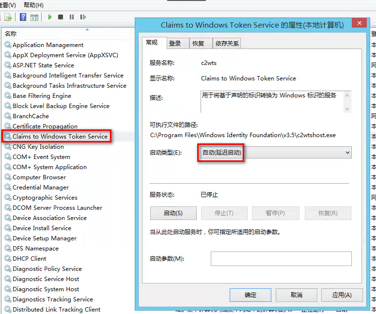
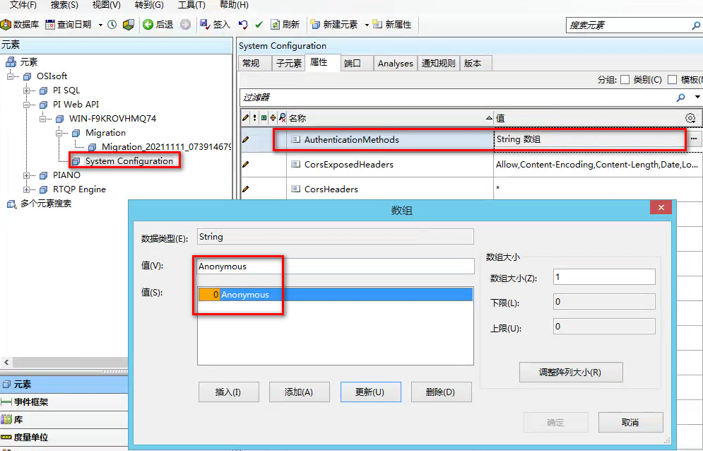

```bash
host="http://192.168.10.53:8713/agilorapi/v6/write?db=MY_DB"
token="Token XXX"
location="agilordb"
dbtemplate="HX,AGPOINTNAME=BA:ACTIVE.1 Value=1 {timestamp}"
2887913329(950)
2894998103(800) 
```

# pi 环境

```bash
账号：administrator
密码：Agilor123

向日葵：101619209 / k5vyhj
todesk：189621948 / 043266
```

```bash
# 中文安装指南
https://docsplayer.com/docview/49/25382996/#file=/storage/49/25382996/25382996.pdf
https://www.bkvibro.com/wp-content/uploads/2021/09/CMS_Instructions_S1176125_015_cn_v07.pdf
```

==也可以使用 MDB 客户端访问 PI AF 内容==

# pi web api 安装

```bash
# 安装 Windows Identity Foundation 3.5
# server 2012 中打开 power shell 执行下面
Install-WindowsFeature Windows-Identity-Foundation # 需要重启才能完成安装
```

```xml
<!-- C:\Program Files\Windows Identity Foundation\v3.5\c2wtshost.exe.config --> 
<allowedCallers>
    <clear/>
    <add value="NT SERVICE\piwebapi" /> <!-- 添加这句 --> 
</allowedCallers>
```

```bash
# 以管理员身份进 cmd 执行：
sc config c2wts depend=CryptSvc # 后会提示成功
```



确定后启动（此时==该服务启动不起来==）

双击安装 PI Web API-1.13.0.6518_ 2019 SP1_.exe

安装好后再次启动 `Claims to Windows Token Service`，启动成功

# pi web api 权限

共分4类权限：kerberos、basic、bearer、anonymous

## bearer

该权限表示可用 `jwt` 进行鉴权

安装文档：https://blog.joden123.top/2019/03/11/sso/adfs/adfs-install/，需要先点进 `安装前准备` 进行操作再

https://docs.microsoft.com/zh-cn/windows-server/identity/ad-fs/development/enabling-openId-connect-with-ad-fs 再操作

```js
setRequestHeader("Authorization", "Bearer " + user.access_token)
```

## anonymous

设置该权限后，表示没有任何权限，官方建议该权限下只让 `读` 接口好用

### 1. 去掉权限



### 2. nginx代理https

```bash
server {
    listen       8080;
    location / {
        proxy_pass https://localhost;
    }
}
```

### 3. 内网穿透

```bash
ding -config=./ding.cfg -subdomain=pi 8080
# 浏览器中访问：http://pi.vaiwan.com/piwebapi
```

# pi web api 查询

## List

data server 的实例数组

```bash
/piwebapi/dataservers # link：self、points、enumerationsets
```

## GetPoints

```bash
# startIndex：从第几个开始取，默认0
# maxCount：一次请求最多取多少个point，默认1000
# 这俩结合可以做分页查询
dataservers/{webId}/points?startIndex=10&maxCount=1000 # Items下列出所有点
```

## GetInterpolated

带 step 的查询

https://docs.osisoft.com/bundle/pi-web-api-reference/page/help/controllers/stream/actions/getinterpolated.html

```bash
# startTime：开始时间、endTime：结束时间、
# interval：1秒间隔的数据，会有重复
/streams/{webid}/interpolated?startTime=2021-10-01T00:00:00.000Z&endTime=2021-10-01T00:01:00.000Z&interval=1s
```

```bash
# 检索从 2000/01 ~ 2021/12 有没有数据
# 有数据特征："Good": true,
# 无数据特征："Good": false,
/interpolated?startTime=2000-01-01T00:00:00.000Z&endTime=2021-12-31T00:00:00.000Z&interval=1mo
```

```bash
# interval 单位说明：
ms # 毫秒
s  # 秒
m  # 分钟
h  # 小时
d  # 天
w  # 周
mo # 月
y  # 年
```


## GetRecorded

不带 step 的查询，即：实际上要取的数据

```bash
# maxCount：返回前 n 条
/streams/{webid}/recorded?startTime=2021-09-30T01:00:00.000Z&endTime=2021-09-30T02:00:00.000Z&maxCount=3
```

# PISDK

https://docs.osisoft.com/bundle/af-sdk/page/html/T_OSIsoft_AF_PI_PIServers.htm

## 1. dll位置

```bash
# SDK 位置
.../Program Files/PIPC/pisdk/PISDK.dll        # PISDK.PISDK
.../Program Files/PIPC/pisdk/PISDKCommon.dll  # PISDK.PIValues
.../Program Files/PIPC/pisdk/PITimeServer.dll # PISDK.PIValue
```

## 2. 连接

```c#
// 1. 导入PISDK.dll
PISDK.PISDK sdk = new PISDK.PISDK();
// 取一个server, srv.Connected 为 false
PISDK.Server srv = sdk.Servers["WIN-Q374PPGAH6C"];
srv.Open();  // 连接服务，后 srv.Connected 为 true
srv.Close(); // 关闭
```

## 3. 遍历所有点

```c#
// srv.PIPoints 没有 Count 属性，应该是遍历一次取一个点，所以效率相当慢
foreach (PISDK.PIPoint p in srv.PIPoints) p.Name;
```

## 4. 查询点

```c#
PISDK.PointList list = srv.GetPoints("tag = 'xxx*'");
foreach (PISDK.PIPoint o in list) {
    Console.WriteLine(o.Name);
}
```

## 5. recorded

```c#
PISDK.PIPoint p = srv.PIPoints["DBDW_DBGS_HBN_Fir_1_TLCKFCND_ZS"];
DateTime start = Convert.ToDateTime("2022-01-16 13:00:00.000");
DateTime end = Convert.ToDateTime("2022-01-20 13:00:00.000");

foreach (PISDK.PIValue v in p.Data.RecordedValues(start, end)) {
    Console.WriteLine(v.Value);
}
```

## 6. interpolated

```c#
DateTime start = Convert.ToDateTime("2022-01-16 13:00:00.000");
DateTime end = Convert.ToDateTime("2022-01-20 13:00:00.000");
// 10表示返回10条数据，这10条为 start ~ end 期间平均多长时间一条
// 比如start ~ end为0点到23点，参数3为24：表示0到23共24小时，显示24条数据
// 那么每条数据的时间就是0点到23点
PISDK.PIValues vs = p.Data.InterpolatedValues(start, end, 10);
foreach (PISDK.PIValue v in vs) {
    if (v.IsGood()) { // good 才有值
        Console.WriteLine(v.Value);
    }
}
```

# PIAPI

http://blog.sina.com.cn/s/blog_4a5e327701000b7o.html # .net 调c例子

## 1. dll 位置

```bash
C:\Windows\SysWOW64\piapi32.dll     # 32位库
C:\Program Files\PIPC\bin\piapi.dll # 64位库
```

## 2. 连接

### 2.1 piut_setservernode

如果在 PI 服务器跑，则不需要这个方法；一旦跨网络连接`（piut_connect）`，就会返回 `-1`，此时需要该方法

```c#
// C#
[DllImport(@"C:\Program Files\PIPC\bin\piapi.dll")]
public static extern int piut_setservernode(string serverName);
```

```rust
// rust
let f: libloading::Symbol<unsafe extern fn(*const c_char) -> i32> = lib.get(b"piut_setservernode")?;
let n = f(CString::new("192.168.30.72")?.as_ptr());
```

### 2.2 piut_connect

连接服务器

```c#
// C#
[DllImport(@"C:\Program Files\PIPC\bin\piapi.dll")]
public static extern int piut_connect(string ServerName);
```

```rust
// rust
let f: libloading::Symbol<unsafe extern fn(*const c_char) -> i32> = lib.get(b"piut_connect")?;
let n = f(CString::new("192.168.30.72")?.as_ptr());
// 跨网络时为-1，在pi服务器本机上跑是为0(正常)
println!("{}", n);
```

### 2.3 piut_login

用户登陆

```C#
// C#
[DllImport(@"C:\Program Files\PIPC\bin\piapi.dll")]
public static extern int piut_login(string user, string pwd, ref int valid);
```

```rust
// rust
let f: libloading::Symbol<unsafe extern fn(*const c_char, *const c_char, &mut i32) -> i32> = lib.get(b"piut_login")?;
let mut valid = 0;
let n = f(CString::new("piadmin")?.as_ptr(), CString::new("")?.as_ptr(), &mut valid);

println!("login {}, {}", n, valid);
```

> ==注意：==
>
> 1）当没跨网络连接时，即在PI服务器本机上跑，只需要调用 `piut_connect` 即可
>
> 2）当跨网络连接时，需要 piut_setservernode -> piut_connect -> piut_login 依次调用
>
> ​      否则取不到数据

## 3. 点操作

### 3.1 pipt_tag

根据 `point id` 获取短点名，短名定死13个字符

```c#
// C#
[DllImport(@"C:\Program Files\PIPC\bin\piapi.dll")]
public static extern int pipt_tag(int pt, ref byte name, int len);
```

```rust
// rust
let f: libloading::Symbol<unsafe extern fn(i32, *mut u8, i32) -> i32> = lib.get(b"pipt_tag")?;
let mut c: [u8;13] = [0;13];

let n = f(117, &mut c[0], 13);
println!("{}, {}", n, String::from_utf8(c.to_vec())?); // 结果：0, DL-GH001-MMJ
```

### 3.2 pipt_wildcardsearch

可以遍历所有点的方法，参数说明：

- char PIPTR * tagmask：想要查询点名的一部分，`*` 表示遍历所有的点

- int32 direction：从0开始，每次加1表示下一个点

- int32 PIPTR * found：返回0表示没找到

- char PIPTR * tagname：返回找到的点名

- int32 len：固定13长度

- int32 PIPTR * pt：点的ID，可以传给 pipt_tag 用

- int32 PIPTR * numfound：当前用户一共能访问到多少个点

```C#
// C#
[DllImport(@"C:\Program Files\PIPC\bin\piapi.dll")]
public static extern int pipt_wildcardsearch(
    string tag, int dir, ref int found,
    ref byte tagName, int len, ref int pt, ref int numfound);

byte[] nm = new byte[13];
int found = 0;
int pt = 0;
int numfound = 0;
for (int j = 0; j < 5; j++)
{
    i = pipt_wildcardsearch("*", j, ref found, ref nm[0], 13, ref pt, ref numfound);
    Console.WriteLine($"j={j}, found={found}, {f(nm)}, pt={pt}, {numfound}");

    i = pipt_tag(pt, ref nm[0], 13);
    Console.WriteLine($"{i}, {f(nm)}");
}
```

```rust
// rust
let f: libloading::Symbol<unsafe extern fn(*const c_char, i32, *mut i32, *mut u8, i32, *mut i32, *mut i32) -> i32> = lib.get(b"pipt_wildcardsearch")?;

let mut found = 0;
let mut name = [0u8;13];
let mut pt = 0;
let mut total = 0;
f(CString::new("*")?.as_ptr(), 0, &mut found, &mut name[0], &mut pt, &mut total);
```

### 3.3 pipt_tagnamex

获取全长点名（一般都是18/80长度），该方法不限制长度

```rust
let f: libloading::Symbol<unsafe extern fn(i32, *mut u8, *mut i32) -> i32> = lib.get(b"pipt_tagnamex")?;

let mut name = [0u8;256];
let mut len = 256;
// len 会返回点名的长度，给大了会变小，但给小了不会变大
// 比如len=5，甭管名字多长都只返回前5个字
// 比如len=1024，当点名只有20个字符时，返回的len也是20
f(7, &mut name[0], &mut len);
return name[0..len as usize].as_ref(); // 重点：要去除256个中多余的0u8
```

### 3.4 pipt_descriptorx

获取全长点备注（一般都是18/80长度），该方法不限制长度

```rust
let f: Symbol<unsafe extern fn(i32, *mut u8, *mut i32) -> i32> = lib.get(b"pipt_descriptorx")?;

let mut name = [0u8;256];
let mut len = 256;
// len 会返回点名的长度，给大了会变小，但给小了不会变大
// 比如len=5，甭管名字多长都只返回前5个字
// 比如len=1024，当点名只有20个字符时，返回的len也是20
f(7, &mut name[0], &mut len);
return name[0..len as usize].as_ref(); // 重点：要去除256个中多余的0u8
// 因为有汉字（且可能不是utf8格式）直接 String::from_utf8 会报：
// Error: invalid utf-8 sequence of 1 bytes from index
// 参考 lib.md -> encoding_rs
```

## 4. 数据操作

### 4.1 piar_getarcvaluesx

取点真实数据（recorded）

```bash
# 参数说明：
int32 ptnum：    # 点id
int32 arcmode：  # 一般都用 ARCflag_comp(0x040)
int32 *count：   # 值的数量(t0、t1区间内)
float64 *drval： # float类型点的值
int32 *ival：    # int类型点的值
void *bval：     # stirng类型点的值
uint32 *bsize：  # string值的长度
int32 *istat：   # digital类型点的值
int16 *flags
PITIMESTAMP *t0：# 开始时间
PITIMESTAMP *t1：# 入参表示结束时间，出参表示该值的时间
# GETFIRST(0)：第一次调用要指定
# GETNEXT(1)：查找下一下值时要指定
# GETSAME(2)：返回前一次查找的值，字符型要用。字符串值要调该方法两次，
#    第一次指定GETFIRST(0)或GETNEXT(1)返回字符串长度
#    第二次指定GETSAME(2)返回字符串值
int32 funccode
```

### 4.2 pipt_digpointers

当点是 `PiTypeDigital` 类型时，通过上面 `4.1` 返回的 `istat` 值来计算 value

```rust
let mut cd = 0;
let mut n = 0;
pipt_digpointers(10, &mut cd, &mut n);
// 例1
//   假如结果为：cd=196608 n=4，说明该点的值范围是0~4
//   当4.1返回的istat值为：
//		-196609：表示 -(196608 + (-196609)) = 1，则 -196609 就表示值为 1
// 例2
//   假如结果为：cd=131072 n=7，说明该点的值范围是0~7
//   当4.1返回的istat值为：
//		-196609：表示 -(196608 + (-196609)) = 1，则 -196609 就表示值为 1
```


# 收藏

https://techsupport.osisoft.com/Products/PI-Interfaces-and-PI-Connectors # 各种工具

https://pisquare.osisoft.com/s/  # PI 的知乎
