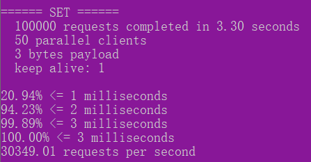
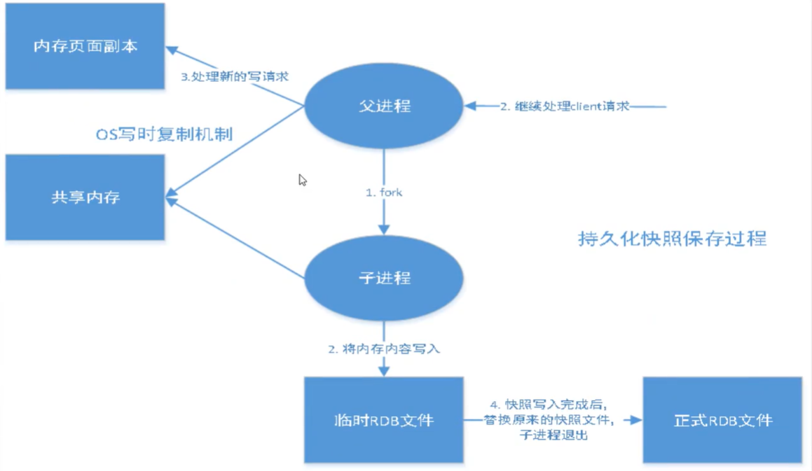
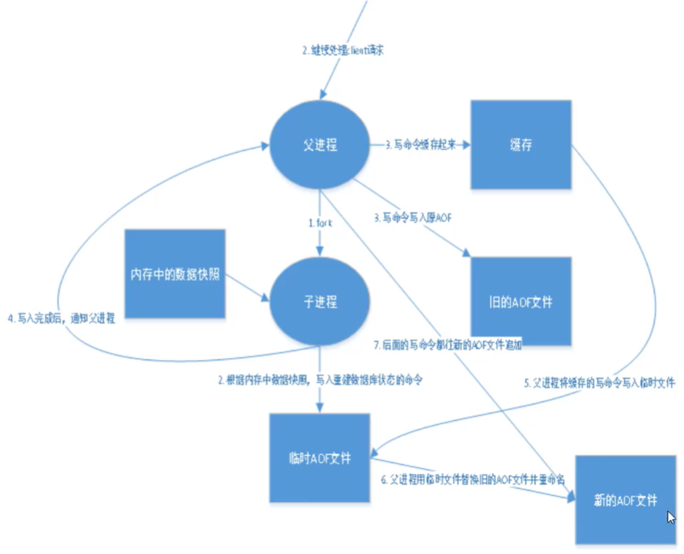
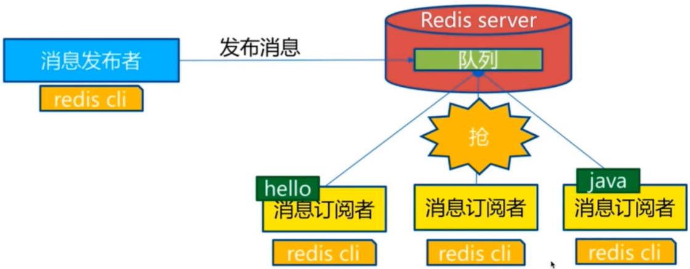
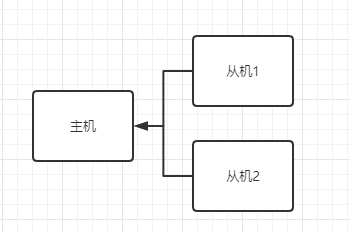
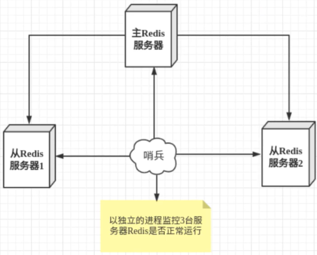
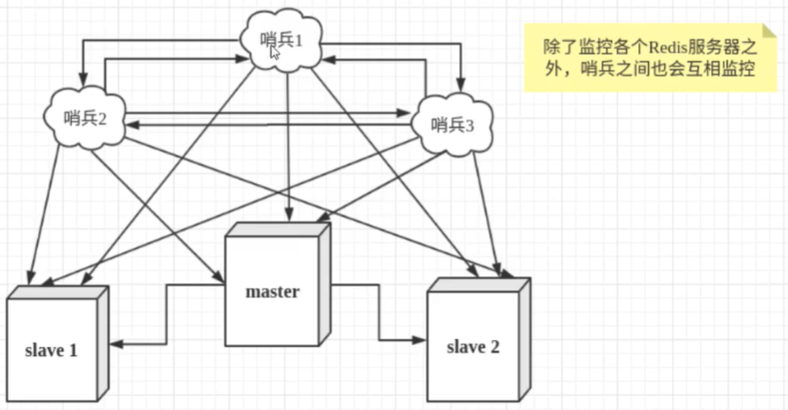
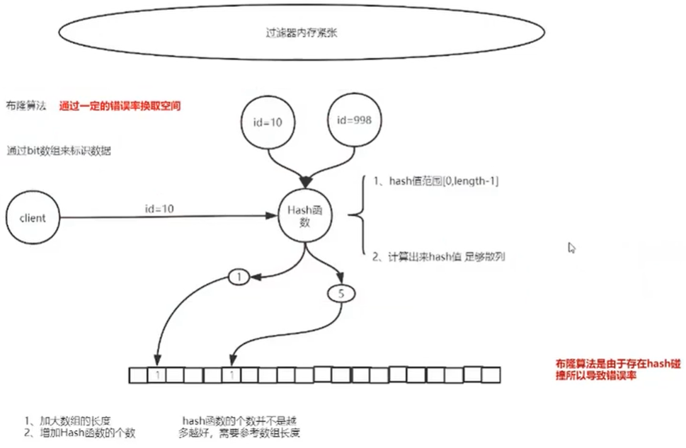

# 概念

- 1秒能写8w次，读11w次
- 官网：http://redis.cn/

> 推荐文章：阿里去的那群疯子
>
> 一名凑合的架构师：没有什么是加一层解决不了的

# 入门

- 是什么？
  - *Redis*（==Re==mote ==Di==ctionary ==S==erver )，即远程字典服务，免费开源的 key-value 数据库

- 能干嘛？
  - 1、内存存储、持久化。（内存是断电即失，所以需要持久化） 2、效率高，可用于高速缓存  3、发布订阅系统  4、地图信息分析  5、计时器，计数器

- 特性：1、多样的数据类型  2、持久化  3、集群  4、事务

- 常用于：数据库，缓存，消息中间件（MQ）

# windows版

下载地址：https://github.com/microsoftarchive/redis/releases/download/win-3.0.504/Redis-x64-3.0.504.zip

- redis-server.exe 启动服务

- redis-cli.exe 登陆客户端

  - 进入后输入*ping*测试时否连通，返回*pong*表示连接成功

- redis-benchmark.exe 压力测试工具

  

  ```bash
  # 测试50个并发，每个并发1W个请求
  redis-benchmark.exe -c 50 # 不写-c 50 也行，因为是默认的
  ```

  

  > 10w个请求 3.3秒，50个并发，每次只写入3个byte，只有1台服务器处理请求
  >
  > 第1秒处理20.94%，第2秒处理94.23%，第3秒处理99.89%，第3.3秒处理100%
  >
  > 每秒处理30349.01个请求

# linux版

```bash
#1.下载
wget http://download.redis.io/releases/redis-5.0.5.tar.gz
#2.解压
tar xzf redis-5.0.5.tar.gz
#3.进入
cd redis-5.0.5
#4.编译
make
#如果是阿里云还需要开放一个6379端口及以下操作
#5.修改redis.conf文件
bind 私有ip #就是ifconfig显示的ip
protected-mode no #yes：默认,需要bind ip或设置密码访问;no：外网可直接访问

ps -ef | grep redis             # 查看服务是否启动
src/redis-server redis.conf     # 启动服务
src/redis-cli shutdown          # 关闭服务
src/redis-cli -h 公网ip -p 端口  # 连接到指定ip:port，-p 可省略（默认6379）
exit                            # 退出连接
src/redis-server -v             # 查看版本
src/redis-cli -v                # 查看版本
```

# 基础知识

手册：https://www.runoob.com/redis，http://redisdoc.com/

```bash
# 默认有16个数据库，默认使用第0个
### redis.conf ###
databases 16

### 命令 ###
config get 配置文件里的key        # 获取配置文件里某个配置的信息，*表示查看所有
config get databases            # 查看所有db数量（默认16个）
config get requirepass          # 获取密码
config set requirepass "123456" # 设置密码
config set requirepass ""       # 删除密码
auth 123456                     # 用密码登陆。设置完密码后所有命令都不好用，只有登陆后才能用
save                            # 触发持久化
select 3  # 切换到第3个数据库
# 结果：
127.0.0.1:6379[3]> # [3]代表第3个数据库

dbsize         # 查看当前db的key的个数
keys *         # 查看当前db的所有key
keys v*        # v开头的所有key
keys *v        # v结尾的所有key
flushall       # 清空所有db
flushdb        # 清空当前db
exists key     # 查看key是否存在
move key 1     # 将key移动到数据库1里

expire key 10  # 设置key 10秒后过期
pexpire key 10 # 设置key 10毫秒后过期
persist key    # 移除key的过期时间
ttl key        # 查看key还剩几秒过期
pttl key       # 查看key还剩几毫秒过期

type key       # 查看key的类型
del key        # 删除

randomkey        # 随机返回一个key
rename old new   # 修改key名
renamenx old new # 新key不存在时修改旧key名

#dump key：如果key不存在，那么返回nil。否则，返回序列化之后的值。
set v 1
dump v #结果：\x00\xc0\x01\x06\x00\xb0\x95\x8f6$T-o
```

> redis是单线程的

基于内存操作，cpu不是性能瓶颈，瓶颈是机器内存和网络带宽

> 为什么单线程还快？

误区一：高性能的服务器一定是多线程的？不是！

误区二：多线程（多线程CPU会上下文切换，比较耗时）一定比单线程效率高？不是！

CPU > 内存 > 硬盘

核心：redis将全部数据放到内存中，所以用单线程操作效率最高，多线程CPU会上下文切换，较为耗时。

# 数据类型

## 五大基本数据类型

### string（字符串）

```bash
append key value       # 在key的基础上追加内容（如果key不存在，相当于set）。如：key=aaa，append后为aaavalue
strlen key             # key的内容长度
incr key               # set key 0 后，每当 incr key 都会加1
decr key               # 减1，和incr相反
incrby key 10          # 加10
decrby key 10          # 减10
getrange key start end # 获取字符串区间（即截取）值
                       # 如：k=haha，getrange k 1 3，结果为：aha
                       # getrange key 0 -1 等同于get key
setrange key i v       # 将值v覆盖到i的位置
setex key 秒 value     # 设置key为value多少秒后过期
setnx key value        # 如果key不存在则设置，存在则设置无效
mset k1 v1 k2 v2 ...   # 一次设置多个k-v
mget k1 k2 k3 ...      # 一次获取多个k-v
msetnx k1 v1 k2 v2 ... # 设置多个k-v（如果没有一个存在则设置成功，否则失败），要么都成功，要么都失败
getset key value       # 先get再set（第1次会显示nil）
```

### list（列表）

所有list命令都是==l==开头的

```bash
lpush key val       # 关部添加
rpush key val       # 尾部添加
lrange 0 -1         # 取得key下所有值（没有rrange）
lpop key            # 取头部第1个元素，并在list里移除
lpop key            # 取尾部第1个元素，并在list里移除
lindex key i        # 通过下标i获取值
llen key            # 返回list元素个数
lrem key count v    # 移除key里的count个v值
ltrim key start end # key里只保留第start到end个元素，其它删掉
rpoplpush key other # 弹出key里的最后一个值到other里的头部第1个
lset key i v        # 设置key的第i个值v（直接替换原值，key或i不存在都会报错，相当于更新操作）
linsert key before|after p v  # 往key里插一个值v，在p的前面（before）或后面（after）
```

### set（无序集合）

set是无序不能重复的集合

```bash
sadd key val        # 添加值（若添加重复值不会有任何反映），添加多个 sadd key v1 v2 v3
smembers key        # 取得集合所有值
sismember key val   # 判断val是否在key里
scard key           # 查看key里有多少个元素
srem key val        # 删除值val
srandmember key n   # 随机取出n个元素（n省略则随机取1个）
spop key            # 随机取出并删除一个元素
smove key1 key2 val # 将key1里的值val移到key2中
sdiff key1 key2     # 差集，key1里有，但key2里没有的元素
sinter key1 key2    # 交集，key1和key2里共同拥有的元素
sunion key1 key2    # 并集，key1和key2里所有元素
```

### hash（哈希）

map集合，key-value

```bash
hset map key val      # 往map里添加一组key-val
hget map key          # 取出map里key的值
hmset map k1 v1 k2 v2 # 往map里添加多组key-val（k1-v1,k2-v2）
hmget map k1 k2 k3    # 获取map里多个key的值(k1,k2,k3的值)
hgetall map           # 获取map里所有的key-val
hdel map k1 k2 k3     # 删除map里多个key（k1,k2,k3）
hlen map              # 查看map里有多少对k-v
hexists map key       # 判断map里key是否存在
hkeys map             # 获取map所有的key
hvals map             # 获取map所有的value
hincrby map key n     # map里key的值加n（key的值必须为数值型,否则报错）
hsetnx map key val    # 如果key不存在，则设置成功；存在则不设置
```

### zset（有序集合）

在set基础上增加了一个排序值

```bash
zadd key n1 v1 n2 v2                   # 添加多个值v1v2，排序为n1n2
zrange key 0 -1                        # 取集合所有元素
zrangebyscore key -inf +inf            # 升序排序（默认，与zrange一样）,inf为最小最大值（可替换为数字来表示区间）
zrangebyscore key -inf +inf withscores # 升序排序，并且显示序号
zrevrange key 0 -1                     # 降序排序
zrem key v                             # 删除值v
zcount key i iEnd                      # 从i到iEnd有多少元素
```

## 三种特殊类型

### geospatial（地理位置）

==底层其实是zset==

```bash
geoadd china:city 116.40 39.90 beijing # 添加地理位置：geoadd key 经 纬 name
geopos china:city beijing              # 获取位置：geopos key name1 name2 ...
geodist key nm1 nm2 unit               # nm1和nm2之间距离（unit：m米，km千米，mi英里，ft英尺）
# 查找以经纬度(100 30)为中心，半径10000公里内的元素
# withdist：显示距离
# withcoord：显示经纬度
# count n：显示n条
georadius key 100 30 10000 km [withdist] [withcoord] [count n]
georadiusbymember city beijing 300 km   # 查找beijing周围300千米内的元素
geohash key nm1 nm2                     # 将nm1和nm2的经纬度转换为一维字符串
```

### hyperloglog

#### 简介

用来做基数统计的算法，redis 2.8.9 版本就有了 hyperloglog 数据结构。

**应用场景：**统计网页UV（一个人访问一个网站多次，但还是算作一个人！）。传统实现方式用set保存用户id，然后统计set元素个数；这种方式如果保存大量用户id会比较占内存！其实根本目地不是保存id，而是计数。

**优点：**占用内存是固定的（比较小，2^64只需要12kb内存）

**缺点：**会有0.81%的错误率，==如果不允许容错，则要使用set==

> 什么是基数？答：不重复的元素

比如集合[1,3,5,7,5,7,8]，那么这个集合的基数集为[1,3,5,7,8]，基数（不重复的元素）为5

```bash
pfadd key v1 v2 ... # 添加
pfcount key         # 统计元素个数
pfmerge new k1 k2   # 合并k1和k2到new里
```

### bitmap

按位存储(只有0或1两个状态)

**应用场景：**比如统计疫情感染人数，首页产生14亿个0，感染一人就置成一个1

```bash
setbit key i v # 存值，给key的第i(0开始)位存v(0或1)
getbit key i   # 查看第i位是0还是1
bitcount key   # 统计key里多少个1
```


# 事务

redis事务本质 ：一组命令一块执行

redis单条命令保证原子性，但==事务不保证原子性，没有隔离级别的概念==

所有的命令在事务中，并没有直接被执行，只有发起执行命令的时候才会执行。

## 正常事务

**redis事务三阶段：**

- 开启事务（multi）
- 命令入队（其它redis命令）
- 执行事务（exec）

```bash
# 执行一个事务示例

47.105.141.18:6379[1]> multi        # 开启事务
OK
47.105.141.18:6379[1]> set k1 1a    # 命令入队
QUEUED
47.105.141.18:6379[1]> set k2 2b    # 命令入队
QUEUED
47.105.141.18:6379[1]> get k2       # 命令入队
QUEUED
47.105.141.18:6379[1]> set k3 3c    # 命令入队
QUEUED
47.105.141.18:6379[1]> exec         # 执行事务
1) OK
2) OK
3) "2b"
4) OK                               # 4个执行结果
```

## 放弃事务

```bash
discard # 将上面的执行事务exec换成discard就行了
```

## 异常事务

> 编译异常：命令有错误，==整个事务的命令不会被执行==

```bash
47.105.141.18:6379[1]> multi
OK
47.105.141.18:6379[1]> set k1 a
QUEUED
47.105.141.18:6379[1]> set k2 b
QUEUED
47.105.141.18:6379[1]> getset k3  # 语法错误
(error) ERR wrong number of arguments for 'getset' command
47.105.141.18:6379[1]> set k3 c   # 语法错误后又继续正确语法
QUEUED
47.105.141.18:6379[1]> exec       # 执行后就报下面错误，此时事务中的所有命令都不会执行
(error) EXECABORT Transaction discarded because of previous errors.
```

> 运行时异常，==整个事务没报错的命令正常执行（不回滚）==

```bash
47.105.141.18:6379[1]> multi
OK
47.105.141.18:6379[1]> set k1 a
QUEUED
47.105.141.18:6379[1]> incr k1       # 给字符加1肯定报错
QUEUED
47.105.141.18:6379[1]> set k2 b
QUEUED
47.105.141.18:6379[1]> get k2
QUEUED
47.105.141.18:6379[1]> exec
1) OK
2) (error) ERR value is not an integer or out of range # 报错后下面命令正常执行
3) OK
4) "b"
47.105.141.18:6379[1]> get k2        # 报错后其它命令正常被执行
"b"
```


# 乐观锁

只有更新数据时去判断一下，在此期间这条数据是否被改动过

```bash
# 客户端一
47.105.141.18:6379[1]> set money 100
OK
47.105.141.18:6379[1]> watch money         # 乐观锁核心，watch 监视某个key
OK
47.105.141.18:6379[1]> multi
OK
47.105.141.18:6379[1]> decrby money 20
QUEUED
# 客户端改变money后再exec
```

```bash
# 客户端二
decrby money 10 # 直接改被监视的key
```

```bash
# 回到客户端一
47.105.141.18:6379[1]> exec       # 执行事务
(nil)                             # 发现money被改了，起到乐观锁的作用，事务没有执行成功
47.105.141.18:6379[1]> get money  # money还是客户端二执行的结果
"90"
```

```bash
# 如果发现事务被乐观锁check住，则重新监视money
unwatch
watch money
```


# jedis

jedis是redis官方推荐的java开发工具，java操作redis的中间件，实际就是一个jar包

**1、导入依赖**

```xml
<dependency>
    <groupId>redis.clients</groupId>
    <artifactId>jedis</artifactId>
    <version>3.3.0</version>
</dependency>
```

**2、代码示例**

- 连接redis
- 操作命令
- 断开连接

==上面所有命令在Jedis对象里都有相应的方法==

```java
// new Jedis对象
Jedis jedis = new Jedis("47.105.141.18", 6379);
// 切换db
jedis.select(1);
// 测试连接
String ping = jedis.ping();  // PONG
// 开启事务
Transaction tran = jedis.multi();
try {
    // 设置money
    tran.set("money", "100");
    // 减20
    tran.decrBy("money", 20);
    // 执行
    System.out.println(tran.exec());
} catch (Exception e) {
    // 放弃事务
    tran.discard();
} finally {
    // 关闭连接
    jedis.close();
}
```


# springboot整合

springData来操作数据，包含：jpa，jdbc，mongodb，redis

springData是和springBoot齐名的项目

说明：SpringBoot2.x之后，原来的jedis被替换成了==lettuce==

jedis：采用直连，多线程操作时会不安全；若要避免多线程不安全，则要使用 jedis pool 连接池（像BIO）

lettuce：采用netty，实例可以在多个线程中共享，不存在线程不安全的状况！可以减少线程数量（像NIO）

## 源码分析

```bash
# SpringBoot 所有的配置类都有一个自动配置类（RedisAutoConfiguration）
# 自动配置类都会绑定一个 properties 配置文件（RedisProperties）

# 1. 找spring-boot-autoconfigaure/MAT-INF/spring.factories文件
#    搜redis，找到redis自动配置类为 RedisAutoConfiguration --> 下面【注(1)】
#    通过 RedisAutoConfiguration 找到 RedisProperties --> 下面【注(2)】
```

```java
// 【注(1)】
@Configuration(proxyBeanMethods = false)
@ConditionalOnClass({RedisOperations.class})
@EnableConfigurationProperties({RedisProperties.class}) // 绑定了属性类【注(2)】
@Import({LettuceConnectionConfiguration.class, JedisConnectionConfiguration.class})
public class RedisAutoConfiguration {
    public RedisAutoConfiguration() {}

    @Bean
    @ConditionalOnMissingBean(name = {"redisTemplate"}) // 可以自己定义一个 RedisTemplate
    // SpringBoot集成了各种template，只要操作这些个template就能快速上手
    // 如：JdbcTemplate，RestTemplate
    // RedisConnectionFactory有两个实现：
    // 		JedisConnectionFactory：SpringBoot2.x以前
    //		LettuceConnectionFactory：SpringBoot2.x以后
    public RedisTemplate<Object, Object> redisTemplate(RedisConnectionFactory redisConnectionFactory)
        	throws UnknownHostException {
        // 默认的template，没有过多的设置
        // 期望 RedisTemplate<String, Object>
        RedisTemplate<Object, Object> template = new RedisTemplate();
        template.setConnectionFactory(redisConnectionFactory);
        return template;
    }

    @Bean
    @ConditionalOnMissingBean // redis最常用的是String类型，所以单独提出来个bean
    public StringRedisTemplate stringRedisTemplate(RedisConnectionFactory redisConnectionFactory)
        	throws UnknownHostException {
        StringRedisTemplate template = new StringRedisTemplate();
        template.setConnectionFactory(redisConnectionFactory);
        return template;
    }
}
```

```java
// 【注(2)】
@ConfigurationProperties(prefix = "spring.redis")
public class RedisProperties {
    private int database = 0;          // 默认用0库，yml里可以不用配
    private String url;
    private String host = "localhost"; // 默认localhost，yml里可以不用配
    private String password;
    private int port = 6379;           // 默认6379，yml里可以不用配
    private boolean ssl;
    private Duration timeout;
    private String clientName;
    private RedisProperties.Sentinel sentinel;
    private RedisProperties.Cluster cluster;
    private final RedisProperties.Jedis jedis = new RedisProperties.Jedis();
    private final RedisProperties.Lettuce lettuce = new RedisProperties.Lettuce();

    public RedisProperties() {}
}
```


## 示例

```xml
<!-- maven依赖 -->
<dependency>
    <groupId>org.springframework.boot</groupId>
    <artifactId>spring-boot-starter-data-redis</artifactId>
</dependency>
<dependency> <!-- 测试用，就可以不跑起来在浏览器里触发执行了 -->
    <groupId>org.springframework.boot</groupId>
    <artifactId>spring-boot-starter-test</artifactId>
</dependency>
```

```yaml
# application.yml
# redis配置连接
spring:
  redis:
    host: 47.105.141.18 # 默认localhost
    # port: 6379 默认的，不写也行
```

```java
@RunWith(SpringRunner.class)
@SpringBootTest
public class RedisTest {
    @Autowired
    private RedisTemplate redisTemplate;

    @Test
    public void exec() {
        // ops开头的表示操作类型，如：
        //      opsForValue()：操作字符串
        //      opsForList()：操作list
        //      opsForGeo()：操作地理位置
        redisTemplate.opsForValue().set("k1", "haha"); // set k1
        System.out.println(redisTemplate.opsForValue().get("k1")); // get k1

        // flushAll / flushDb
        RedisConnection cnn = redisTemplate.getConnectionFactory().getConnection();
        cnn.flushAll();
        cnn.flushDb();
    }
}
```

```bash
# 当上面set一个key后发现是序列化后的字符，以及存一些对象实例都需要设定序列化 --> 【注(3)】
47.105.141.18:6379[1]> keys *
1) "\xac\xed\x00\x05t\x00\x02k1"
```

```java
// 【注(3)】
@Configuration
public class RedisConfig {
    @Bean
    @Primary // 设置为主的，如有相同类型的取这个。防止 bean but found 2: redisTemplate,stringRedisTemplate 错误
    public RedisTemplate<String, Object> redisTemplate(RedisConnectionFactory factory) {
        RedisTemplate<String, Object> template = new RedisTemplate();
        template.setConnectionFactory(factory);

        /*** 序列化配置 ***/
        // json的列化
        Jackson2JsonRedisSerializer json = new Jackson2JsonRedisSerializer(Object.class);
        ObjectMapper om = new ObjectMapper();
        // 指定要序列化的域，field,get和set,以及修饰符范围，ANY是都有包括private和public
        om.setVisibility(PropertyAccessor.ALL, JsonAutoDetect.Visibility.ANY);
        // 指定序列化输入的类型，类必须是非final修饰的，final修饰的类，比如String,Integer等会跑出异常
        om.activateDefaultTyping(LaissezFaireSubTypeValidator.instance, ObjectMapper.DefaultTyping.NON_FINAL);
        json.setObjectMapper(om);
        
        // String 的序列化
        StringRedisSerializer strRedisSerializer = new StringRedisSerializer();

        // key采用String序列化
        template.setKeySerializer(strRedisSerializer);
        // hash的key采用String序列化
        template.setHashKeySerializer(strRedisSerializer);
        // hash的value采用json序列化
        template.setHashValueSerializer(json);
        // value采用json序列化
        template.setValueSerializer(json);
        // 设置Properties之后再设置一次(也就是用新的覆盖旧的)
        template.afterPropertiesSet();

        return template;
    }
}

// 此时运行结果
// 47.105.141.18:6379[1]> keys *
// 1) "k1"
```


```java
/*** 模糊删除 ***/
// set a a,set a1 a1,set a2 a2
Set keys = redisTemplate.keys("a*");
redisTemplate.delete(keys);
```


# redis.conf详解

通过配置文件来启动的

```bash
indlude /xx/xx/xx.conf          # 包含其它的配置文件
bind 127.0.0.1                  # 只让本机访问，* 表示不限制访问的ip
protected-mode yes              # yes表示受保护模式，需要配置bind ip或访问密码。no表示关闭保护模式，此时外网可直接访问
port 6379                       # 端口
daemonize yes                   # 以守护方式后台运行，默认no
pidfile /var/run/redis_6379.pid # 进程文件。如果 daemonize yes，就需要指定一个xx.pid文件
loglevel debug                  # 日志级别。有debug,verbose（很像debug）,notice（生产环境适用）,warning
logfile ""                      # log文件名
databases 16                    # 默认16个数据库
always-show-logo yes            # 总显示logo

maxclients 100                  # 设置最大连接redis的数量
maxmemory <bytes>               # 配置redis的最大内存容量
# 内存满了6种处理策略：
# 		volatile-lru：   只对设置了过期时间的key进行LRU（移除）（默认值）
# 		allkeys-lru：    删除lru算法的key
# 		volatile-random：随机删除即将过期key
# 		allkeys-random： 随机删除
# 		volatile-ttl：   删除即将过期的
# 		noeviction：     永不过期，直接错误
maxmemory-policy noevication
```


# 持久化

redis是内存数据库，一旦服务重启，则数据消失，所以要提供持久化功能。

在指定时间间隔内将内存中的数据定稿磁盘，也就是行话讲的Snapshot快照，恢复时将快照文件直接读到内存里。

redis会单独创建（fork）一个子进程来进行持久化，先将数据写入一个临时文件中，待持久化过程结束，再用这个临时文件替换上次持久化好的文件。整个过程中，主进程是不进行任何IO操作的，这就确保了极高的性能。

## RDB（Redis DataBase）



RDB保存的是==dump.rdb==文件

```bash
# 配置

# 持久化，在规定的时间内，执行了多少次操作会持久化到文件 .rad .aof
# redis 是内存数据库，如果没有持久化，那么数据断电即丢失
# 这3个save都注掉的话，就关闭了持久化
save 900 1                      # 900秒内，至少有一个key进行了修改，就进行持久化操作
save 300 10                     # 300秒内，至少有10个key进行了修改，...
save 60 10000                   # 60秒内，有1w个key进行修改，...

stop-writes-on-bgsave-error yes # 持久化出错，是否还需要持续工作。默认yes
rdbcompression yes              # 是否压缩rdb文件，需要消耗cpu资源
rdbchecksum yes                 # 保存rdb文件时候，进行错误检查校验
dir ./                          # rdb文件保存目录
dbfilename dump.rdb             # rdb快照保存的文件
```

### 触发RDB机制

- save 规则满足的情况下
- 执行 flushall 命令
- 退出 redis

### 如何恢复RDB文件

- 只需将.rdb文件放到启动目录下（即配置文件里符合 ==dir ./和dbfilename dump.rdb==的配置）就可以，redis启动时检索.rdb且恢复其中数据

### RDB的优缺点

若需要==大规模数据恢复==，且对于数据恢复的完整性不是非常敏感，那**RDB**方式要比**AOF**方式更加高效。**RDB**的缺点是最后一次持久化后的数据可能丢失（比如redis服务挂了）。==默认是RDB，==一般不需要修改配置。

- 优点：
  - 适合大规模数据恢复
  - 对数据完整性要求不高
- 缺点：
  - 需要一定时间间隔进行操作，如果redis挂掉，最后一次修改的数据就没了
  - fork进程的时候，会占用一定的内存空间


## AOF（Append Only Fild）

以日志的形式记录下每个写操作（读不记录），只许追加不可修改。redis启动（或恢复）时把记录的写命令全部再执行一遍。



保存的是 appendonly.aof 文件

```bash
appendonly no                   # 默认不开启aof模式，因为默认使用rdb持久化模式（大部分情况下rdb够用）
appendfilename "xxx.aof"        # 持久化文件名字

# 共三个值：
# 		everysec：每秒执行一次 sync（同步），可能会丢失这1秒的数据
# 		always：每次修改都会 sync（同步）
# 		no：不同步（效率最高）
appendsync no

# no：安全的方式，不会丢失数据，但是要忍受阻塞的问题
# yes：相当于将appendfsync设置为no，说明并没有执行磁盘操作，只是写入了缓冲区，因此这样并不会造成阻塞（因为没有竞争磁盘）
#      但是如果这个时候redis挂掉，就会丢失数据。丢失多少数据呢？在linux的操作系统的默认设置下，最多会丢失30s的数据。
# 因此，如果应用系统无法忍受延迟，而可以容忍少量的数据丢失，则设置为yes。如果应用系统无法忍受数据丢失，则设置为no。
no-appendfsync-on-rewrite no
# aof文件增长比例，指当前aof文件比上次重写的增长比例大小。aof重写即在aof文件在一定大小之后，重新将整个内存写到aof文件当中，
# 以反映最新的状态(相当于bgsave)。这样就避免了aof文件过大而实际内存数据小的问题(频繁修改数据问题).
auto-aof-rewrite-percentage 100
# aof文件重写最小的文件大小，即最开始aof文件必须要达到这个文件时才触发，后面的每次重写就不会根据这个变量了(根据上一次重写完成之后的大小).
# 此变量仅初始化启动redis有效.如果是redis恢复时，则lastSize等于初始aof文件大小.
auto-aof-rewrite-min-size 64mb
```

### 重写机制

aof默认文件无限追加，文件会越来越大，此时就需要no-appendfsync-on-rewrite | auto-aof-rewrite-percentage | auto-aof-rewrite-min-size 三个配置属性来设置aof文件的重写机制

### 修复appendonly.aof 文件

```bash
# 如果appendonly.aof有错误或损坏，那么redis启动不起来
# rdb没有修复功能！
redis-check-aof --fix appendonly.aof  # 修复
```

### AOF优缺点

- 优点：
  - 每次修改都同步，文件完整性更好
- 缺点：
  - aof文件远远大于rdb，修复速度也比rdb慢
  - aof运行效率比rdb慢，所以默认配置rdb


## 扩展：

1，redis 能对aof文件进行后台重写，使得aof文件体积不至于过大。

2，只做缓存的话就没必要使用持久化

3，同时开启两种持久化，redis优先加载aof文件恢复数据，因为aof比rdb数据更完整。建议两者都开启rdb可作为aof的备份

4，rdb建议只要slave上持开启，且15分钟备份一次就够（即：`save 900 1`）

5，aof在最恶劣情况下只会丢失不超2秒的数据，代价是持续IO以及rewrite过程中造成的阻塞，就减少rewrite频率。aof重写默认大小为64M，可设到5G以上

6，不开启aof，仅靠主/从实现高可用也可以，少掉一大比IO，代价是主/从同时挂掉，会丢失10几分钟数据，再启动也要比较主/从中的rdb


# 发布订阅

redis 发布订阅（pub/sub）是一种==消息通信模式==：发送者（pub）发送消息，订阅者（sub）接收消息。

reids 客户端可以订阅任意数量的频道。

订阅/发布消息图：

三个角色：消息发送者，频道，消息订阅者

使用场景：实时消息系统，实时聊天系统 ，订阅关注系统 。稍微复杂的场景需要用专业的消息队列来做（kafka，rocketMQ等）



```bash
subscribe pindaoName   # 订阅频道 pindaoName，等待发送者发送消息
publish pindaoName 123 # 向频道 pindaoName 里发送 123，发送完后订阅该频道的 redis-cli 就会自动收到消息
```

## 集成springboot

```xml
<dependency>
    <groupId>org.springframework.boot</groupId>
    <artifactId>spring-boot-starter-data-redis</artifactId>
</dependency>
```

```java
@Component // 监听类
public class RedisReceiver implements MessageListener {
    @Override
    public void onMessage(Message msg, byte[] bytes) {
        System.out.println("接收到的消息:" + new String(msg.getBody()) + " ********************");
        System.out.println("管道信息:" + new String(msg.getChannel()) + " ********************");
    }
}
```

```java
// 添加 bean
@Bean
public RedisMessageListenerContainer redisMessageListenerContainer(
    RedisConnectionFactory factory, MessageListenerAdapter adapter) {

    RedisMessageListenerContainer container = new RedisMessageListenerContainer();
    container.setConnectionFactory(factory);
    // 可添加多个 listener
    container.addMessageListener(adapter, new PatternTopic("p1")); // p1:管道名
    return container;
}

@Bean
public MessageListenerAdapter listenerAdapter(RedisReceiver receiver) {
    return new MessageListenerAdapter(receiver, "onMessage");
}
```

```java
// 向管道里发送消息
@Autowired
private RedisTemplate template;

@GetMapping("publish/{msg}")
public void publish(@PathVariable String msg) {
    template.convertAndSend("p1", msg); // 发送消息
}
```


# 主从复制

主从复制是==单向==的，只能从主复制到从。如果单台redis最大使用内存超过20G，则需要集群。redis 默认是主节点

- 主从复制作用：
  - 数据冗余：主从复制实现了数据热备份，是持久化以外的一种数据冗余方式。（数据冗余意思是同一数据存储在不同文件的现象）
  - 故障恢复：主节点出问题时，可由从节点提供服务
  - 负载均衡：主从复制基础上配合读写分离，主写从读，分担服务器负载
  - 高可用（即集群）：主从复制还是哨兵模式和集群能够实施的基础

## 集群配置

```bash
# 1. 想配置几台从机就复制几份redis.conf文件
# 2. 修改各自对应的端口
# 3. 修改各自对应的pidfile
pidfile /var/run/redis_63xx.pid
# 4. 主从机都要配置各自的log文件
logfile "端口号.log"
# 5. 修改各自的dump.rdb文件名
dbfilename xxx-xx.rdb
```

## 主从配置

一般只配从机，主机不用配（因为默认就是主节点）

### 主从复制原理

从机启动成功连接到主机后会发送一个sync同步命令

主机接到命令，启动后台的存盘进程，同时收集所有接收到的用于修改数据集命令，在后台进程执行完毕后，主机将传送整个数据文件到从机，并完成一次完全同步。

**全量复制：**而从机在接收到数据文件后，将其存盘并加载到内存中。

**增量复制：**主机继续将新的所有收集到的修改命令依次传给从机，完成同步。

==只要重新连接到主机，就将自动执行一次完全同步（全量复制）。==

### 通过命令配置（暂时）

==从机重启后又会变为主机==，这种会比==（永久）==版方便灵活，出问题后不用去改配置文件，直接敲命令就行

```bash
slaveof 主机ip 主机端口 # 设置自己是谁的从机
info replication      # 查看主从配置信息
```

```bash
# info replication 主机显示结果：
# Replication
role:master           # 当前角色：主机
connected_slaves:2    # 连接的从机数
slave0:ip=172.17.0.1,port=6380,state=online,offset=84,lag=1 # 从机1，state=online表示在线
slave1:ip=172.17.0.1,port=6381,state=online,offset=84,lag=1 # 从机2
```

```bash
# info replication 从机显示结果：
# Replication
role:slave                    # 当前角色：从机
master_host:192.168.2.36      # 主机ip
master_port:6379              # 主机端口
```

### 通过文件配置（永久）

```bash
# redis.conf 文件
slaveof 主机ip 主机端口 # 设置自己是谁的从机
```

此时当从机设置了一个key，就会报错：

```
192.168.2.36:6380> set k2 v2
(error) READONLY You can't write against a read only replica.
```

因为==从机不能写，只能读==

### 测试

- 主机断开再连接后，从机依旧能获取到主机再连接后写入的数据
- 从机断开再连接后，从机依旧能获取到主机在从机断开后写入的数据

## 主机挂掉从机取代

### 手动版

**主从第一种模式：**主机断开后，就全是从机了



**主从第二种模式：**主机断开后，从机1可以取代主机（从机2是从机1的从机，而不是主机的从机）


```bash
# 主从设置
slaveof 主机    # 从机1
slaveof 从机1   # 从机2
# 当主机断开后，想让从机1变成主机（拥有写能力）
slaveof no one # 将从机1变成主机（此时原来断开的主机重新连接后，不会影响从机1的主机地位）
```

### 自动版==（哨兵模式）==

当主机宕机后，需要手动把一台从机切换为主机，需要人工干预费时费力还会造成一段时间内服务不可用。redis从2.8开始正式提供了Sentinel（哨兵模式）来实现自动切换主机。

哨兵是一个独立运行的进程，其作用：

- 通过发送命令等待主从机的响应，从而监控运行的多个redis实例。
- 当监控到主机挂掉，会自动投票选举一台从机切换成主机，然后通过**发布订阅模式**通知其它从机切换到新的主机。



哨兵进程为：/usr/local/bin/==redis-sentinel==

而一个哨兵进程做监控可能会出问题，这时需要多个哨兵进程来监控。各个哨兵间还会互相监控，就是多哨兵模式（哨兵集群）。



假设主机宕机，哨兵1先检测到了，并不会立即进行failover（故障转移）。当其它哨兵也检测g主机宕机，并且达到一定数量时，那么哨兵之间会进行一次投票。得出投票结果后由一个哨兵发起，从机间进行failover（投票选举主机）。主机切换成功后，再发布订阅，让其它从机切到新主机。

#### 哨兵配置

```bash
# 新建一个sentinel.conf配置文件
# sentinel monitor <被监控的名称（随便写）> <被监控的主机ip> <被监控的主机端口> <主机挂了从机投票让谁当主机>
sentinel monitor name 192.168.2.36 6379 1
# 注意：如果docker运行多个从机时，千万不能写localhost或127.0.0.1
```

#### 哨兵启动

```bash
redis-sentinel /etc/redis/conf/sentinel.conf
```

```bash
# 启动结果信息
9:X 30 Oct 2020 07:54:30.727 # oO0OoO0OoO0Oo Redis is starting oO0OoO0OoO0Oo
9:X 30 Oct 2020 07:54:30.727 # Redis version=6.0.8, bits=64, commit=00000000, modified=0, pid=9, just started
9:X 30 Oct 2020 07:54:30.727 # Configuration loaded
                _._
           _.-``__ ''-._
      _.-``    `.  `_.  ''-._           Redis 6.0.8 (00000000/0) 64 bit
  .-`` .-```.  ```\/    _.,_ ''-._
 (    '      ,       .-`  | `,    )     Running in sentinel mode
 |`-._`-...-` __...-.``-._|'` _.-'|     Port: 26379
 |    `-._   `._    /     _.-'    |     PID: 9
  `-._    `-._  `-./  _.-'    _.-'
 |`-._`-._    `-.__.-'    _.-'_.-'|
 |    `-._`-._        _.-'_.-'    |           http://redis.io
  `-._    `-._`-.__.-'_.-'    _.-'
 |`-._`-._    `-.__.-'    _.-'_.-'|
 |    `-._`-._        _.-'_.-'    |
  `-._    `-._`-.__.-'_.-'    _.-'
      `-._    `-.__.-'    _.-'
          `-._        _.-'
              `-.__.-'

9:X 30 Oct 2020 07:54:30.732 # WARNING: The TCP backlog setting of 511 cannot be enforced because /proc/sys/net/core/somaxconn is set to the lower value of 128.
9:X 30 Oct 2020 07:54:30.735 # Sentinel ID is 5802e6e3a88e67bcc4e634f96fac7c72cb192ac4
9:X 30 Oct 2020 07:54:30.735 # +monitor master meredis 192.168.2.36 6379 quorum 1
9:X 30 Oct 2020 07:54:30.739 * +slave slave 172.17.0.1:6380 172.17.0.1 6380 @ meredis 192.168.2.36 6379 # 从机1
9:X 30 Oct 2020 07:54:30.741 * +slave slave 172.17.0.1:6381 172.17.0.1 6381 @ meredis 192.168.2.36 6379 # 从机2
# 当主机关掉后，显示的信息
9:X 30 Oct 2020 07:57:48.569 # +sdown master meredis 192.168.2.36 6379
9:X 30 Oct 2020 07:57:48.569 # +odown master meredis 192.168.2.36 6379 #quorum 1/1
9:X 30 Oct 2020 07:57:48.569 # +new-epoch 1
9:X 30 Oct 2020 07:57:48.569 # +try-failover master meredis 192.168.2.36 6379
9:X 30 Oct 2020 07:57:48.573 # +vote-for-leader 5802e6e3a88e67bcc4e634f96fac7c72cb192ac4 1
9:X 30 Oct 2020 07:57:48.573 # +elected-leader master meredis 192.168.2.36 6379
9:X 30 Oct 2020 07:57:48.573 # +failover-state-select-slave master meredis 192.168.2.36 6379
# 下面就是把从机1给切换成了主机log
9:X 30 Oct 2020 07:57:48.650 # +selected-slave slave 172.17.0.1:6380 172.17.0.1 6380 @ meredis 192.168.2.36 6379
9:X 30 Oct 2020 07:57:48.651 * +failover-state-send-slaveof-noone slave 172.17.0.1:6380 172.17.0.1 6380 @ meredis 192.168.2.36 6379
9:X 30 Oct 2020 07:57:48.723 * +failover-state-wait-promotion slave 172.17.0.1:6380 172.17.0.1 6380 @ meredis 192.168.2.36 6379
9:X 30 Oct 2020 07:57:49.677 # +promoted-slave slave 172.17.0.1:6380 172.17.0.1 6380 @ meredis 192.168.2.36 6379
9:X 30 Oct 2020 07:57:49.677 # +failover-state-reconf-slaves master meredis 192.168.2.36 6379
9:X 30 Oct 2020 07:57:49.754 * +slave-reconf-sent slave 172.17.0.1:6381 172.17.0.1 6381 @ meredis 192.168.2.36 6379
9:X 30 Oct 2020 07:57:50.688 * +slave-reconf-inprog slave 172.17.0.1:6381 172.17.0.1 6381 @ meredis 192.168.2.36 6379
9:X 30 Oct 2020 07:57:50.688 * +slave-reconf-done slave 172.17.0.1:6381 172.17.0.1 6381 @ meredis 192.168.2.36 6379
9:X 30 Oct 2020 07:57:50.739 # +failover-end master meredis 192.168.2.36 6379
9:X 30 Oct 2020 07:57:50.739 # +switch-master meredis 192.168.2.36 6379 172.17.0.1 6380
# 下面是再次将断开的原主机重新连接后的log
9:X 30 Oct 2020 07:57:50.739 * +slave slave 172.17.0.1:6381 172.17.0.1 6381 @ meredis 172.17.0.1 6380
9:X 30 Oct 2020 07:57:50.739 * +slave slave 192.168.2.36:6379 192.168.2.36 6379 @ meredis 172.17.0.1 6380
```

#### 测试

当主机6379断开后，从机6780被选为主机；当原主机6379再次连接后，会成为6380的从机。

#### 优点

- 基于主从复制，所有的主从配置优点它全有
- 主从可切换，故障可转移，系统可用性会更好
- 主从模式的升级，将手动变成了自动

#### 缺点

- redis 不好在线扩容，集群一旦达到上限，在线扩容很麻烦
- 配置哨兵模式其实很麻烦，里面有很多选择

#### 全部配置

```bash
port 26379             # 哨兵端口，默认26379。如果哨兵集群还得配置每个实例的端口
dir "/"                # 工作目录
sentinel monitor name 192.168.2.36 6379 1 # 参考上面

# 当开启了 requirepass foobared 授权密码，所有连redis实例的客户端都要提供密码
# 设置哨兵连接主从的密码，必须要为主从设置一样的密码
# sentinel auth-pass <主机名> <密码>
sentinel auth-pass meredis pwd2020

# 指定多少毫秒后，主节点没有响应哨兵时，哨兵主观上认为主节点下线（默认30秒）
# sentinel down-after-milliseconds <主机名> <毫秒>
sentinel down-after-milliseconds meredis 30000

# 指定发生从机切换到新主机时，最多有多少个从机同时对新的主机进行同步。
# slaves-nums越小完成主从切换的时间越长
# slaves-nums越大，就意味着越多的从机切换到新主机时不可用。可以设置为1，一个一个来切到新主机。
# sentinel parallel-syncs <主机名> <slaves-nums>
sentinel parallel-syncs meredis 1

# 故障转移过期时间，当故障转移开始后，在此时间内仍然没有触发任何故障转移操作，当前哨兵将会认为此次故障转移失败。 
# 执行故障转移超时时间，即在指定时间内没有大多数的哨兵反馈主机下线，则该故障转移计划失效。
# sentinel failover-timeout <主机名> <毫秒>
sentinel failover-timeout meredis 180000 # 默认3分钟

# 通知脚本。比如当故障发生时，可以执行该脚本给管理员发邮件等等
# sentinel notification-script <主机名> <脚本路径>
sentinel notification-script meredis /var/redis/notify.sh

# 当从机取代主机时，这个脚本被调用，通知相关客户端关于主机地址已经改变的信息
# sentinel client-reconfig-script <主机名> <脚本路径>
sentinel client-reconfig-script meredis /var/redis/reconfig.sh
```


# 穿透雪崩击穿

https://www.bilibili.com/video/BV1ii4y1t7oP?p=2 36:00

> 布隆过滤器：一种数据结构，对所有可查询的参数以hash形式存储，在控制层进行核验，不符合则丢弃，从而避免对底层存储系统的查询压力。

- 穿透：访问一个不存在的key，缓存不起作用，请求会穿透缓存到DB，流量大时DB会挂掉。
  - 解决：
    - 采用布隆过滤器，使用一个足够大的bitmap，用于存储可能访问的key，不存在的key直接被过滤；
    - 访问key未在DB查询到值，也将空值写进缓存，但可以设置较短过期时间。
- 雪崩：大量的key设置了相同的过期时间，导致在缓存在同一时刻全部失效，造成瞬时DB请求量大、压力骤增，引起雪崩。
  - 解决：可以给缓存设置过期时间时加上一个随机值时间，使得每个key的过期时间分布开来，不会集中在同一时刻失效。
- 击穿：一个存在的key，在缓存过期的一刻，同时有大量的请求，这些请求都会击穿缓存到DB，造成瞬时DB请求量大、压力骤增。
  - 解决：
    - 在访问key之前，采用SETNX（set if not exists）来设置另一个短期key来锁住当前key的访问，访问结束再删除该短期key。
    - 给过期的key加个==分布式锁==，如果过期了到db里取到缓存中，然后释放锁

## 穿透

- 当请求为 where id = -1 时，db里没有-1的数据，redis里更没有了，此时将 id = -1 返回的null缓存到redis里即可。

- 当请求为 where id = uuid 时，每次请求都会穿透redis，此时就不适用上面的场景了。解决办法为：

  - 在redis与db之间加一层过滤器，将表中每行主键缓存到过滤器中，当外部访问的主键在过滤器中不存在，直接过滤掉这次请求。

    - 但是会出现内存紧张问题，可通过布隆算法来解决

      

      ==hash错误率==：布隆算法说数据存在，那么实际有可能==不存在==；布隆说数据不存在，那么一定不存在。

## 雪崩

大面积缓存失效

## 击穿

一条缓存失效。一般的公司不需要解决，因为很难会有一条热门数据能把db击穿


# hash一致性算法

将一块数据平均分配到redis1和redis2中，可以根据这块数据的自增id%2方法来做。此时若集群扩展了redis3，那么需要将redis1和2里的数据重新拿出来，再%3来做，很麻烦。==hash一致性算法==就是用来解决这种集群扩展的问题。

- 算法：一条hash环上有2`^`32个点，将集群里每台redis映射到这条hash环的点上，即每台redis的ip先做下hash值然后再模上2`^`32【hash(ip) % `^`32】，其结果为0到2`^`32之间的值。
- 存储策略：将数据以同样的方法映射到hash环的点上，数据再按顺时针查找第1台redis，最后将数据存到这台redis上。
- 扩容：此时如果新增一台redis，那么只有两台redis之间发生数据迁移就可以了。
- 缺点：容易发生数据倾斜，即大部分数据存到少量节点上 。
  - 解决办法：多虚拟几个redis结点；如果数据还不均衡，那就再多虚拟几个。