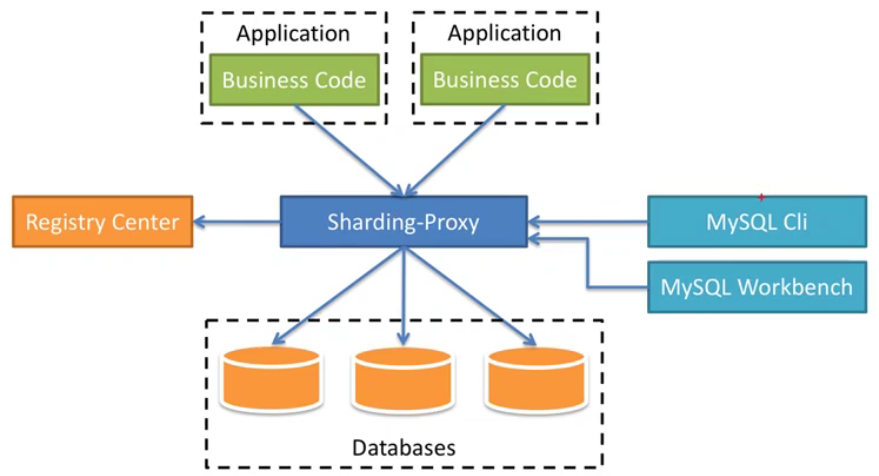

# 介绍

一套开源的分布式数据库中间件解决方案组成的生态圈，由**Sharding-JDBC、Sharding-Proxy和Sharding-Sidecar（规划中）3款相互独立**，却又能混合部署配合使用的产品组成。ShardingSphere 定位为关系型数据库中间件。

**三个组件对比认识**

|            | Sharding-JDBC | Sharding-Proxy | Sharding-Sidecar |
| ---------- | ------------- | -------------- | ---------------- |
| 数据库     | 任意          | MySQL          | MySQL            |
| 连接消耗数 | 高            | 低             | 高               |
| 异构语言   | 仅java        | 任意           | 任意             |
| 性能       | 损耗低        | 损耗略高       | 损耗低           |
| 无中心化   | 是            | 否             | 是               |
| 静态入口   | 无            | 有             | 无               |

OLTP：On-line Transaction Processing，联机事务处理。特点是会有高并发且数据量级不大的查询，==主要用于管理事务的系统==。此类系统专注于INSERT, UPDATE, DELETE操作。

OLAP：On-line Analytical Processing，联机分析处理。其特点是查询频率较OLTP系统更低，==通常涉及到非常复杂的聚合计算==。

Sharding-JDBC 采用无中心化结构，适用于 Java 开发的高性能轻量级 OLTA 应用；Sharding-Proxy 提供静态入口以及异构语言的支持，适用于 OLAP 应用以及对分片数据库进行管理和运维的场景。

**Sharding-Sphere 功能清单**

数据分片：分库分表，读写分离，分布式主键

分布式事务：XA强一致性事务，柔性事务（目前尚在开发中）

数据库治理：配置动态化，熔断/禁用，调用链路追踪，弹性伸缩（规划中）


- 分库分表方式
  - 垂直拆分
    - 垂直分表：将一张表的==字段==分拆成两张表
      - 好处1：当只需要查一些常用的信息时，另一个放不常用字段的表就不需要查
      - 好处2：当需要做一部分更新时，另一个表也不必锁
    - 垂直分库：把数据库按业务进行划分
  - 水平拆分
    - 水平分表：同一个库里，创建多张结构相同的表【基数id存A表，偶数id存B表】
    - 水平分库：给db集群化（非主从）【基数id存A库，偶数id存B库】
- 分库分表应用
  - 在设计db时考虑垂直分库分表
  - 随着数据增加，不要马上考虑水平拆分。先考虑缓存处理、读写分离、使用索引等方式，都不行的话最后再考虑水平拆分
- 分库分表带来的问题
  - 跨节点连接查询问题（包含分页、排序）
  - 多数据源问题


# Sharding-JDBC

轻量级java框架，在jdbc层提供额外服务。使用客户端连db，以jar包形式提供服务，无需额外部署和依赖，可理解为增加版jdbc驱动，完全兼容jdbc和各种orm。

==并不是做分库分表，而是简化了分库分表后的操作==

功能：数据分片和读写分离

## 1. 依赖

```xml
<dependency><!-- spring boot 用 -->
    <groupId>io.shardingsphere</groupId>
    <artifactId>sharding-jdbc-spring-boot-starter</artifactId>
    <version>3.1.0</version>
</dependency>
<dependency><!-- mybatis以xml方式配置用（可以不写） -->
    <groupId>io.shardingsphere</groupId>
    <artifactId>sharding-jdbc-spring-namespace</artifactId>
    <version>xxx</version>
</dependency>
<dependency><!-- sharding-jdbc不兼容8.x版本，得用5.x版本 -->
    <groupId>mysql</groupId>
    <artifactId>mysql-connector-java</artifactId>
    <version>5.1.47</version>
</dependency>
<dependency><!-- spring boot 自带的HikariDataSource没法扩展，得用扩展性强的druid -->
    <groupId>com.alibaba</groupId>
    <artifactId>druid</artifactId>
    <version>1.2.3</version>
</dependency>
```

## 2. 配置说明

```yaml
sharding:
  jdbc:
    # 配置数据源列表，目前仅支持mysql与postgresql
    datasource: 
      ds0: # 数据源名称
        url: jdbc:mysql://localhost:3306/xx?serverTimezone=Asia/Shanghai # 尚不兼容mysql8.x版本
        username: root # mysql用户名
        password: 123  # mysql明文密码
# 属性配置
props:
  sql.show: # 是否开户sql显示，默认false
  acceptor.size: # 接受连接的线程数量，默认为cpu核数的2倍
  executor.size: # 工作线程数量，默认值:无限制。（用于一条sql去不同分片查时，启用多线程并行查询）
  max.connections.size.per.query: # 每个查询可以打开的最大连接数，默认为1
  check.table.metadata.enabled:   # 是否在启动时检察分表元数据一致性，默认值：false
  proxy.frontend.flush.threshold: # 代理服务时，对于单个大查询，每多少个网络包返回一次
  proxy.transaction.type:         # 默认LOCAL，代理的事务模型，允许LOCAL,XA,BASE三个值
  								  # 	LOCAL：无分布式事务
  								  #		XA：   采用atomikos实现分布式事务
  								  #		BASE:  目前尚未实现
  proxy.opentracting.enable:      # 是否开启opentracting
  proxy.backend.use.nio:          # 是否采用netty的nio机制连接后端数据库，默认false，使用epoll机制
  proxy.backend.max.connections:  # 使用nio机制的话，代理后台连接每个netty客户端允许的最大连接数（注意不是数据库连接限制），默认8
  proxy.backend.connection.timeout.seconds: # 使用nio的话，代理后台连接的超时时间，默认60s
```

## 3. 先跑起来

```yaml
# application.yml
sharding:
  jdbc:
    datasource:
      names: ds0,ds1
      ds0:
        type: com.alibaba.druid.pool.DruidDataSource
        driver-class-name: com.mysql.jdbc.Driver
        url: jdbc:mysql://192.168.1.106:3306/db0?characterEncoding=utf8&serverTimezone=Asia/Shanghai&useSSL=false # ssl给false 否则有红字
        username: root
        password: 123
      ds1:
        type: com.alibaba.druid.pool.DruidDataSource
        driver-class-name: com.mysql.jdbc.Driver
        url: jdbc:mysql://192.168.1.106:3306/db1?characterEncoding=utf8&serverTimezone=Asia/Shanghai&useSSL=false
        username: root
        password: 123
    config:
      sharding:
        default-data-source-name: ds1
      # 通过maven包 -> spring.factories -> SpringBootConfiguration -> propMapProperties -> 
      #				  @ConfigurationProperties(prefix = "sharding.jdbc.config")
      props: # 之前写错了，要和sharding平级。
        sql.show: true
```

```java
@Bean // 得用DruidDataSource。HikariDataSource报错
public DruidDataSource druidDataSource() {
    return new DruidDataSource();
}
```

## 4. 读写分离

### 4.1 配置说明

```yaml
masterSlaveRule:
  name: # 数据源名
  masterDataSourceName: # 主数据源名称
  slaveDataSourceNames: # 从数据源列表
	- slave-1
	- slave-2 ...
  loadBalanceAlgorithmClassName: # 从库负载均衡算法名。需实现MasterSlaveloadBalanceAlgorithmClassName接口，且提供无参构造函数
  loadBalanceAlgorithmType: # 从库负载均衡算法类型，可选值：ROUND_ROBIN（轮询），RANDOM（随机）。若上一行存在，则该配置会被忽略。
configMap: # 自定义配置
  key1: value1
  key2: value2
```

### 4.2 案例

先准备两台主从复制的mysql，参照db -> mysql优化.md -> 2，读写分离

```yaml
# application.yml
# 比 3. 先跑起来 多了如下配置
    config:
      sharding:
        default-data-source-name: ds0
      masterslave:
        name: ms
        master-data-source-name: ds0
        slave-data-source-names: ds1
```

```java
@TableName("user") // 数据类，可以指定表名
public class User extends Model<User> {
    @TableId(value = "id", type = IdType.AUTO)
    private Long id;
    @TableField("nickname")
    private String nickname;
    @TableField("phone")
    private String phone;
}
```

```java
@Test // 测试代码
public void contextLoads() {
    User o = new User();
    o.setNickname("i").setPhone("1").insert(); // 先插一条
    System.out.println(o.selectById(1));       // 再读一条
}
```

```bash
# 显示log
Rule Type: master-slave
SQL: INSERT INTO user ( nickname,phone ) VALUES ( ?,? ) ::: DataSources: ds0 # ds0 主库写
Rule Type: master-slave
SQL: SELECT id,nickname,phone FROM user WHERE id=? ::: DataSources: ds1 User(id=1, nickname=a, phone=1) # ds1 从库读
```

## 5. 分库分表

### 5.1 配置说明

```yaml
sharding.jdbc.config.sharding:
  tables:    # 分片表定义
    t_order: # 逻辑表               #.t_order$...为真实表：db中真实存在的表，即 t_order0 和 t_order1
      actualDataNodes: ds$->{0..1}.t_order$->{0..1} # 数据节点：数据分片的最小单元，由数据源名称和数据表组成（如：ds0.t_order0）
      databaseStrategy:  # 库（数据源）分片策略
        inline:
          shardingCoulumn: user_id # 分片键
          algorithmInlineExpression: ds$->{user_id % 2} # 分片算法
      tableStrategy:     # 表分片策略
        inline:          # 行表达式分片策略
          shardingCoulumn: order_id
          algorithmInlineExpression: t_order$->{order_id % 2}
```

- 数据节点分布说明：
  - 均匀分布：db0和db1上都有表tb0和tb1，则配置 db$->{0..1}.tb$->{0..1}
  - 自定义分布：db0上有tb0和tb1，但db1上有tb2/tb3/tb4，则配置 db0.tb$->{0..1},db1.tb$->{2..4}

- 分片策略：数据源分片、表分片仅是两个不同维度的分片，分片策略规则都是一样的。分片策略由两部分组成：
  - 分片键（shardingCoulumn）
  - 分片算法（algorithmInlineExpression）
- 不分片策略：对应 NoneShardingStrategy，该策略不会把sql发给所有节点去执行
- 行表达式分片策略（==inline==）：对应 InlineShardingStrategy。使用groovy的表达式，提供对sql语句中的=和IN的分片操作支持，==只支持单分片键==。对于简单的分片算法，可以通过配置使用，从而避免java代码开发。如：t_user_$->{u_id % 8} 表示t_user表根据u_id模8分成8张表表名为t_user_0到t_user_7。
  - ${0..2} 表示范围区间
  - ${[tb0,tb1,tb2]} 表示枚举值

- 标准分片策略（==standard==）

  - 对应 StandardShardingStrategy。提供对sql语句中的=、IN、BETWEEN AND 的分片操作

  - 只支持单分片键，提供 PreciseShardingAlgorithm(==精确分片==) 和 RangeShardingAlgorithm(==范围分片==) 两个分片算法

  - PreciseShardingAlgorithm 是必选的，用于处理=和IN。==返回单个数据源名，即让一个数据源执行sql==

  - RangeShardingAlgorithm 是可选的，用于 BETWEEN AND。如果不配置，sql中的 BETWEEN AND 将按照全库路由处理。

    - ==返回多个数据源名，即让多个数据源执行sql==
    
    ```yaml
    databaseStrategy:
      standard:
        shardingColumn: # 列名，允许单列
        preciseShardingAlgorithm: # 该接口的实现类
        rangeShardingAlgorithm:   # 该接口的实现类
    ```

- 复合分片策略（==complex==）：

  - 对应 ComplexShardingStrategy。复合分片策略提供对sql语句中的=、IN 和 BETWEEN AND 的分片操作支持。
  - ComplexShardingStrategy支持多分片键，由于多分片键之间的关系复杂，因此并未进行过多封装，而是直接将分片键值组合以及分片操作符传至分片算法，完全由开发者实现，提供最大的灵活度。

  ```yaml
  database-strategy:
    complex: # 支持多列的 sharding，目前无生产可用实现
      sharding-columns:   # 逗号分割的列名
      sharding-algorithm: # ComplexKeysShardingAlgorithm 接口的实现类
  ```

- hint分片策略：

  - 对应 HintShardingStrategy。通过 Hint 而非sql解析的方式分片策略。
  - 对于分片字段非SQL决定，而由其它外置条件决定的场景，可使用 Hint 灵活的注入分片字段。如：内部系统按员工主键分库，而数据库中并无此字段。
  - Hint 支持通过java api 和 sql 注入（待实现）两种方式。

  ```yaml
  database-strategy:
    hint:
      sharding-algorithm: # HintShardingAlgorithm 接口的实现类。
  ```

- 默认数据源分片策略：可配置默认的数据源（数据源分片策略和表分片策略）

### 5.2 案例

#### 5.2.1 同库分表

```yaml
sharding:
  jdbc:
    datasource:
      names: ds0 # 可以配多个，只要下面没用到就跟没配一样
      ds0:       # 可以配多个，只要下面没用到就跟没配一样
        type: com.alibaba.druid.pool.DruidDataSource
        driver-class-name: com.mysql.jdbc.Driver
        url: jdbc:mysql://192.168.2.36:3306/db0?characterEncoding=utf8&serverTimezone=Asia/Shanghai&useSSL=false
        username: root
        password: 123
    config:
      sharding:
        tables:
          user: # 这个名字要和sql文里的表名一样，或者和@TableName("user")一样
            actual-data-nodes: ds0.user_$->{0..1}
            table-strategy:
              inline:
                sharding-column: id
                algorithm-expression: user_$->{id % 2}
      props:
        sql.show: true
```

```java
@Data
@Accessors(chain = true)
@TableName("user") // 和 sharding.tables.user 一样
public class User extends Model<User> {
    @TableId("id")
    private Long id;
    @TableField("nickname")
    private String nickname;
    @TableField("phone")
    private String phone;
}
```

```java
// mapper写法
public interface UserMapper extends BaseMapper<User> {
    // into user == sharding.tables.user
    @Insert("insert into user(nickname, phone) values(#{nickname},#{phone})")
    void shardInsert(String nickname, String phone);
}
```

```java
User o = new User();
o.setId(1L).setNickname("a").setPhone("1").insert(); // 进到db0.user_0
o.setId(2L).setNickname("b").setPhone("2").insert(); // 进到db0.user_1
```

==坑点：==每当insert一条都会插到0和1两个表里，问题在于==两个表的id都是自增的==且都从0开始，把自增去掉，insert时指定id就可以了。

#### 5.2.2 分库分表

```yaml
# 与 5.2.1 不同处在于
user:
  actual-data-nodes: ds$->{0..1}.user_$->{0..1}
  database-strategy: # 多配置了db分片
    inline:
      sharding-column: id
      algorithm-expression: ds$->{id % 2} # db分片算法
  table-strategy:
    inline:
      sharding-column: id
      algorithm-expression: user_0 # 既然都分db了，表就没必要分了，写死表0就行；这样就只分库不分表了
      							   # 当然也可以表分片，这样就即分库又分表了
```

#### 5.2.3 标准(standard)分片

##### 5.2.3.1 数据源级精确分片

```java
public class UserPreciseShardingAlgorithm implements PreciseShardingAlgorithm<Long> {
    /**
     * @param names 数据源名称集合（ds0，ds1)
     * @param val:
     *       logicTableName：为user（application.yml里路径为 sharding.jdbc.config.sharding.tables.user）
     *       columnName：表的主键id
     *		 value：insert时表的主键id值
     * @return 返回数据源名称。也就是说当id等于多少时用哪个db执行sql文
     */
    @Override
    public String doSharding(Collection<String> names, PreciseShardingValue<Long> val) {
        List<String> list = names.stream().collect(Collectors.toList());
        return val.getValue() > 100 ? list.get(1) : list.get(0); // >100的存到ds1里，<=100的存到ds0里
    }
}
```

```yaml
# 与 5.2.1 不同处在于
user:
  actual-data-nodes: ds$->{0..1}.user_$->{0..1}
  database-strategy:
    standard: # 可以做数据源级分片，也可以做表级分片
      sharding-column: id
      precise-algorithm-class-name: com.gtlookup.sharding.UserPreciseShardingAlgorithm
  # 没写表分片，应该就是默认user_0了
```

```java
User o = new User();
o.setId(1L).setNickname("a").setPhone("1").insert();
o.setId(2L).setNickname("b").setPhone("2").insert();   // 1和2插到ds0里
o.setId(101L).setNickname("c").setPhone("3").insert();
o.setId(102L).setNickname("d").setPhone("4").insert(); // 101和102插到了ds1里
```

##### 5.2.3.2  表级精确分片

```java
public String doSharding(Collection<String> names // 此时的数据源名称集合就成了表名（user_0，user_1），上面例子则是ds0,ds1
```

```yaml
user:
  actual-data-nodes: ds0.user_$->{0..1}
  table-strategy:
    standard:
      sharding-column: id
      precise-algorithm-class-name: com.gtlookup.sharding.UserPreciseShardingAlgorithm
# 其它都和 5.2.3.1 一样，最后结果：>100 的存到 user_1 里，<=100 的存到 user_0 里
```

## 6. 分布式主键

在分片规则配置模块可配置每个表的主键生成策略，默认使用雪花算法（snowflake）生成64bit的长整形数据。当前提供了 snowflake、uuid 两种方式。

==原码里没看到有uuid，==不过insert时给个uuid也不麻烦，不一定非要在yml里配置。再一个，uuid也没法做分片。

```yaml
config:
  sharding:
    tables:
      user:
        actual-data-nodes: ds$->{0..1}.user_$->{0..1}
        database-strategy:
          inline:
            sharding-column: id
            algorithm-expression: ds$->{id % 2}
        table-strategy:
          inline:
            sharding-column: id
            algorithm-expression: user_0 # $->{id % 2}
        key-generator-column-name: id # 生成主键，默认雪花算法
        #keyGeneratorColumnName: id     驼峰写法也行
```

```java
// 注意点1：若用mapper自己写insert语句时，不能插id
public interface UserMapper extends BaseMapper<User> {
    @Insert("insert into user(nickname, phone) values(#{nickname},#{phone})")
    void shardInsert(String nickname, String phone);
}
mapper.shardInsert("a", "1");
mapper.shardInsert("b", "2");
// 注意点2：model.insert写法
@TableName("user")
public class User extends Model<User> {
    @TableId("id")    // type用默认的IdType.NONE就行
    private Long id;  // 表里要用bigint，不能是int，否则宽度不够装不下雪花算法产生的id值
}
//		这样写虽然能通过，但有个严重的问题，就是分片不均衡（可能这个表里1条，另一个表里3条）
//			试过了很多办法，都不行：
//				1. 把 @TableId 换成 @TableField => 不行
//				2. 只 new 一个 user，并在 insert 前 .setId(null) => 不行
//				3. mapper.insert(new User()) => 不行
//				4. mapper.insert(o.setId(null)) => 不行
//				5. @TableField(exist = false) =>   不行
//		所以，分片均衡这个问题只能用【注意点1】那种办法（自己写inser语句）
new User().setNickname("b").setPhone("1").insert();
new User().setNickname("b").setPhone("2").insert();
new User().setNickname("c").setPhone("3").insert();
new User().setNickname("d").setPhone("4").insert();
```

## 7. 分布式事务

https://www.cnblogs.com/dalianpai/p/14001823.html

```xml
<dependency><!-- 依赖包 -->
    <groupId>io.shardingsphere</groupId>
    <artifactId>sharding-transaction-spring-boot-starter</artifactId>
    <version>3.1.0</version>
</dependency>
```

```java
// LOCAL：适用于没有跨库
// XA：跨库了用（两阶段提交）
// BASE：柔性事务，基于BASE理论，追求最终一致性
@ShardingTransactionType(TransactionType.BASE)
@Transactional // 两个注解都要加
```


# Sharding-Proxy

## 1. 介绍

数据库代理，提供封装了数据库二进制协议的服务端版本，用于完成对**异构语言**的支持。目前只提供mysql/postgresql。

- 向应用程序完全透明，可直接当做mysql使用。（sharding-jdbc的分库分表配置都省了，配好proxy后就像直接用单库一样）
- 适用于任何兼容mysql协议的客户端。
- proxy是一个独立应用，使用前先要安装，再进行分库分表、读写分离配置，最后启动。

> 异构语言：是继面向对象编程思想又一种较新的编程思想（即面向服务编程），不用顾虑语言的差别，提供规范的服务接口，无论什么语言都能访问。



## 2. 安装配置（分库不分表）

```bash
# 1. 下载
wget https://mirror.bit.edu.cn/apache/shardingsphere/5.0.0-alpha/apache-shardingsphere-5.0.0-alpha-shardingsphere-proxy-bin.tar.gz
tar -zxvf ... # 2. 解压

conf/server.yaml               # 注册中心、认证信息以及公用属性配置
conf/config-sharding.yaml      # 分库分表配置
conf/config-shadow.yaml        # 影子库配置（用来存生产环境下做压测的数据，为了不和生产环境的真实数据混淆）
conf/config-replica-query.yaml # 主从配置
conf/config-encrypt.yaml       # 数据加密配置
```

```yaml
# 3.1 vi conf/server.yaml配置

######################################################################################################
#
# If you want to configure governance, authorization and proxy properties, please refer to this file.
# 配置注册中心、认证信息以及公用属性
######################################################################################################
#
#governance: # 配置zookeeper治理
#  name: governance_ds
#  registryCenter:
#    type: ZooKeeper
#    serverLists: localhost:2181
#    props:
#      retryIntervalMilliseconds: 500
#      timeToLiveSeconds: 60
#      maxRetries: 3
#      operationTimeoutMilliseconds: 500
#  overwrite: false

authentication:
  users:
    root: # 逻辑库用户名
      password: root # 逻辑库密码
    # sharding:
    #   password: sharding
      authorizedSchemas: sharding_db # 逻辑库名

props:
  max-connections-size-per-query: 1
  acceptor-size: 16  # The default value is available processors count * 2.
  executor-size: 16  # Infinite by default.
  proxy-frontend-flush-threshold: 128  # The default value is 128.
    # LOCAL: Proxy will run with LOCAL transaction.
    # XA: Proxy will run with XA transaction.
    # BASE: Proxy will run with B.A.S.E transaction.
  proxy-transaction-type: LOCAL
  proxy-opentracing-enabled: false
  proxy-hint-enabled: false
  query-with-cipher-column: true
  sql-show: true
  check-table-metadata-enabled: false
```

```yaml
# vi conf/config-sharding.yaml 配置
######################################################################################################
#
# If you want to connect to MySQL, you should manually copy MySQL driver to lib directory.
# 
######################################################################################################
# 如果想连mysql，需要把mysql驱动（我这里用的 mysql-connector-java-5.1.49.jar）复制到ext-lib/下
# pom里的驱动必须和ext-lib下的是一个版本

schemaName: sharding_db # 逻辑库名

dataSourceCommon: # 共通配置，如果ds0,ds1的这些配置都一样，可以写在这里
  username: root
  password: 123
  connectionTimeoutMilliseconds: 30000
  idleTimeoutMilliseconds: 60000
  maxLifetimeMilliseconds: 1800000
  maxPoolSize: 50
  minPoolSize: 1
  maintenanceIntervalMilliseconds: 30000

dataSources: # 账号密码等信息如果都一样可放到上面 dataSourceCommon 里
  ds0: # 物理库1
    url: jdbc:mysql://192.168.1.107:3306/db0?serverTimezone=Asia/Shanghai&useSSL=false
  ds1: # 物理库2
    url: jdbc:mysql://192.168.1.107:3306/db1?serverTimezone=Asia/Shanghai&useSSL=false
rules:
- !SHARDING # 前面没空格
  tables:
    user: # 逻辑表名
      actualDataNodes: ds${0..1}.user_${0..1}
      tableStrategy:
        standard:
          shardingColumn: id
          shardingAlgorithmName: user_inline # 下面52
      keyGenerateStrategy:
        column: id
        keyGeneratorName: snowflake # 下面57行
  bindingTables:
    - user # 绑定的表，多个用逗号隔开
  defaultDatabaseStrategy:
    standard:
      shardingColumn: id
      shardingAlgorithmName: database_inline # 下面48
  defaultTableStrategy:
    standard:
      shardingColumn: id
      shardingAlgorithmName: user_inline # 下面52
  shardingAlgorithms:
    database_inline: # 上面42
      type: INLINE
      props:
        algorithm-expression: ds${id % 2}
    user_inline: # 上面33 46 行
      type: INLINE
      props:
        algorithm-expression: user_0
  keyGenerators:
    snowflake: # 上面36行
      type: SNOWFLAKE # 雪花算法
    #  props:
    #    worker-id: 123 # 注掉才好用
```

```bash
# 启动 sharding-proxy
bin/start.sh 3308 # 端口不写默认是3307（.sh是linux下，.bat是window下）
# 当start.sh 3307出现：o.a.s.p.frontend.ShardingSphereProxy - ShardingSphere-Proxy start success.代表启动成功
# 当再次start.sh 3307会出：io.netty.channel.unix.Errors$NativeIoException: bind(..) failed: Address already in use 
#    代表已经启动，此时需要先stop.sh再start.sh
bin/stop.sh 3307  # 关闭服务

mysql -uroot -p -P 3307 # 此时就可以用mysql连接
use sharding_db;        # 选择逻辑库
select * from user;     # 查询逻辑表，此时两个物理库中的user_0表的数据全查出来了
```

## 3. 代码案例

```yaml
# application.yml
spring:
  datasource: # 就像连普通mysql数据库一样
    driver-class-name: com.mysql.jdbc.Driver
    url: jdbc:mysql://localhost:3307/sharding_db?useSSL=false&serverTimezone=Asia/Shanghai # 逻辑库
    username: root # 逻辑库账号
    password: root # 逻辑库密码
# 此时应该注掉pom里的shardingsphere，以及@Bean里的DruidDataSource
```

```java
@Data // 表user_0,user_1的实体类
@Accessors(chain = true)
@TableName("user") // 逻辑表名
public class User
```

```java
@GetMapping // 给id的insert
public void index() {
    new User().setNickName("name").setId(1L).setPhone("0").insert();
    // id=1L 进 ds1.user_0，id=2L 进 ds0.user_0
}
```

```java
// 雪花算法的insert
public interface UserMapper extends BaseMapper<User> {
    @Insert("insert into user(nickname, phone) values(#{nickname},#{phone})")
    void shardInsert(String nickname, String phone);
}
mapper.shardInsert("a", "1");
mapper.shardInsert("b", "2");
mapper.shardInsert("c", "3");
mapper.shardInsert("d", "4");
```

## 4. 读写分离

### 4.1 sharding-proxy 侧

如果之前配的分库分表也和本次读写分离用同样的表，那么最好把==config-sharding.yaml==先给注掉 ==（*坑二）==

```yaml
# config-replica-query.yaml 配置主从的文件
schemaName: master_slave_db # 逻辑数据源（库）名称

dataSourceCommon:
  username: root
  password: 123
  connectionTimeoutMilliseconds: 30000
  idleTimeoutMilliseconds: 60000
  maxLifetimeMilliseconds: 1800000
  maxPoolSize: 50
  minPoolSize: 1
  maintenanceIntervalMilliseconds: 30000

dataSources:
  master:
    url: jdbc:mysql://192.168.2.36:3306/db0?characterEncoding=utf8&serverTimezone=Asia/Shanghai&useSSL=false
  slave0:
    url: jdbc:mysql://192.168.2.204:3306/db0?characterEncoding=utf8&serverTimezone=Asia/Shanghai&useSSL=false

rules:
- !REPLICA_QUERY
  dataSources:
    pr_ds:         # 可以随便写，*坑二：当 use master_slave_db 后，show tables;报错正常，不会影响使用，insert select 都正常
      name: pr_ds  # 可以随便写
      primaryDataSourceName: master
      replicaDataSourceNames:
        - slave0
```

==（*坑一）==

```yaml
# server.yaml
authentication:
  users:
    root:
      password: 123
      # *坑一：这里要加上和上面 schemaName 对应的 master_slave_db
      #      否则sharding proxy启动后 show databases;看不到 master_slave_db
      authorizedSchemas: sharding_db,master_slave_db
```

### 4.2 springboot 侧

```yaml
# application.yml
spring:
  datasource:
    # type: com.alibaba.druid.pool.DruidDataSource # sharding-jdbc必须指定阿里的连接池，sharding-proxy则不用指定
    driver-class-name: com.mysql.jdbc.Driver
    # 逻辑库名
    url: jdbc:mysql://192.168.2.36:3307/master_slave_db?characterEncoding=utf8&serverTimezone=Asia/Shanghai&useSSL=false
    username: root
    password: 123
```

```java
@Data
@Accessors(chain = true)
@TableName("user_0") // 指向物理表名
public class User extends Model<User>
```

```java
User ob = new User();
ob.setId(2L).setPhone("2").setNickname("2").insert();
System.out.println(ob.selectAll()); // 如果配置了主从复制，则能查出来；如果没配，则查不出来
```

==（*坑三）==：当主从库分别是mysql8和mysql5时，springboot一运行就会报 ==Unknown system variable 'query_cache_size'==，都给换成mysql5就可以了


https://www.bilibili.com/video/BV1hi4y1479B

https://www.bilibili.com/video/BV1LK411s7RX

