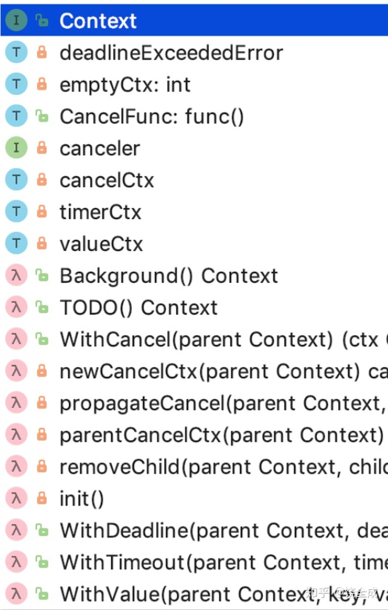
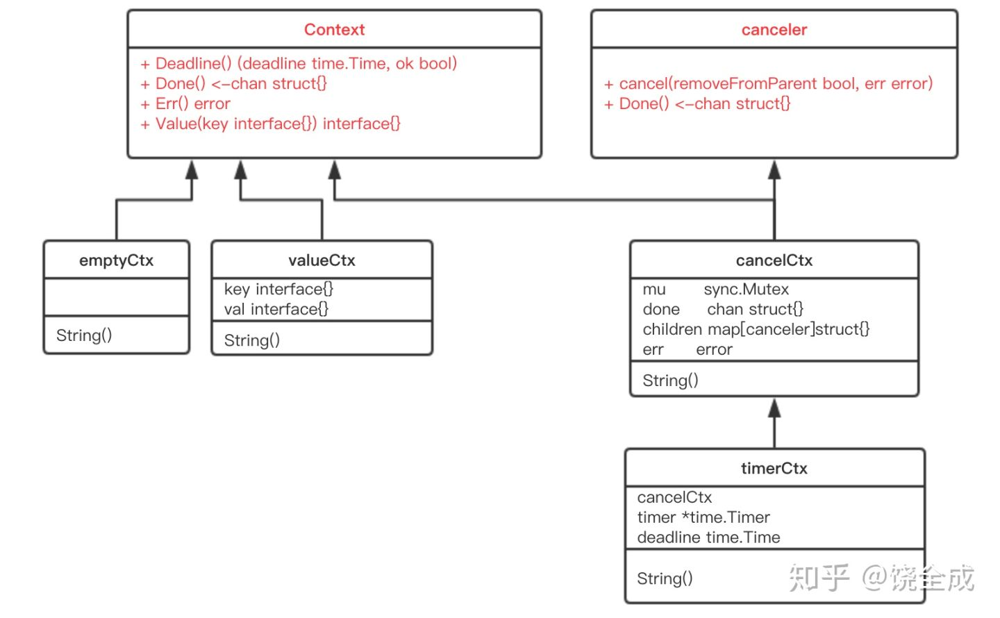
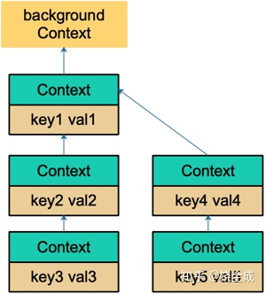

# 安装

## 1. windows

```bash
# 1. 上官网上下载安装包并安装
# 2. vscode 上安装 golang 插件（直接搜索go）
#    2.1. 安装 Rich Go language support for Visual Studio Code
#    2.2. 上面安装完成后，当打开一个.go文件，右下方分提示一些需要安装的插件，直接 install all
```

**上面安装失败**

```bash
# 1. 设置代理   https://github.com/goproxy/goproxy.cn/blob/master/README.zh-CN.md
go env -w GO111MODULE=on
go env -w GOPROXY=https://goproxy.cn,direct
# 2. vscode关了重新打开
# 3. ctrl + shift + p -> Install/Update Tools -> 全选后确定
#   如果发现代码不提示：
#      点右下角go -> 配置go语言基础设置 -> 
#      "go.useLanguageServer": true,
#      "[go]": {
```

## 2. linux

```bash
yum install epel-release
yum install golang

# 上面安装完应该不是最新版本
https://studygolang.com/dl/golang/go1.17.3.linux-amd64.tar.gz # 下载最新版本
```

# 介绍

- google 开源
- 新时代的 c 语言
- 适用于任何没有界面的程序

# 命令

```bash
go version       # 查看版本
go env           # 查看安装环境
go run xxx.go    # 运行go文件
go run .         # 上一行简写
go build xxx.go  # 生成exe文件
```

# 环境配置

GO111MODULE：开启或关闭模块支持

- off：无模块支持，go 会从 GOPATH 文件寻找包
- on：模块支持，go 会==忽略 GOPATH==，只根据 go.mod 下载依赖。==一般都会开启==
- auto：在 $GOPATH/src 外面且根目录有 go.mod 文件时，开户模块支持。==默认==

<h3>创建项目</h3>

```go
// 1. mkdir demo
// 2. cd demo
// 3. go mod init 项目名
//    此时会生成一个 go.mod 文件
//    此时再 go get xxx 包的话，都会在该文件里体现
module init-demo

go 1.16

// 比如在该目录下 go get 了这两个包，就体现出来了
require (
	github.com/jmoiron/sqlx v1.3.4 // indirect
	github.com/robfig/config v0.0.0-20141207224736-0f78529c8c7e
)
// 这样也是避免了 go run 时报：no required module provides package github.com/xxx 这种错
```

# 基础

## 1. 变量

定义的变量必须使用，不使用则报错

```go
var 变量名 类型  // 声明变量
// 初始化
var a, b, c = 3, 4, "foo"
fmt.Println(a, b, c)  // 3 4 foo
```

### 1.1 短变量声明法

不需要 var，作用域只在当前的 {} 内，且不能用做全局变量

```go
// 变量名 := 值
name := "名称"
// 初始化
a, b, c := 1, "a", false
fmt.Println(a, b, c) // 1 a false
```

### 1.2 匿名变量

在使用多重赋值时，如果想忽略掉某个变量，可使用匿名变量。

不会占用命名空间，不会分配内存，不存在重复声明

```go
// 一个方法返回多个值
func get() (string, int) {
	return "haha", 666
}
// 此时只想要一个返回值，不需要的值用匿名符号(_)
var s, _ = get()
```

## 2. fmt

%d：10进制，%b：2进制，%o：8进制，%x：16进制，%f：保留6位小数并四舍五入，%.2f：保留2位小数，%c：字符原型

```go
// 导包
import "fmt"

// 单行打印
fmt.Println("a", "b", "c") // a b c
// 打印类型
fmt.Printf("%T", "a") // string
// 打印值
fmt.Printf("%v", 123) // 123
// $4v：向左填充空格
// $-4v：负数表示向右填充空格
fmt.Printf("%4v\n", "*") // 3空格 + * = 4位
```

## 3. 常量

```go
const v = 11
// 只给 a 赋1的话，b 和 c 都是1
const (
    a = 1
    b
    c
)
```

### 3.1 iota

是go语言的常量计数器，只能在常量表达式中使用

```go
const v = iota // 相当于0
const (
    a = iota  // 0 和上面直接给1不同，iota 递增
    b         // 1
    c         // 2
)
const (
	a = iota  // 0
    _
    c         // 2
    d         // 3
)
const (
	a = iota  // 0
    b = 100   // 100
    c = iota  // 2
    d         // 3
)
```

## 4. 数据类型

基本类型：整型，浮点，布尔，字符串

复合数据类型：数组，切片，结构体，函数，map，通道（channel），接口等

```go
// 类型转换
var int32 v1 = 1
var int64 v2 = 2
int64(v1) + v2

// math
math.MaxFloat64
math.MinInt16
```

### 4.1 科学计数法

```go
// 表示3.14 * 10的4次方
var v = 3.14e4    // 结果：31400
// 表示31400 / 10的4次方
var v = 31400e-4  // 结果：3.14
```

### 4.2 精度丢失

```go
var f64 float64 = 1129.6
fmt.Println(f64 * 100)  // 结果：112959.99999999999
```

解决办法：https://github.com/shopspring/decimal

### 4.3 字符串

```go
// 多行字符串
str := `aaaa
bbbb`
strings.Contains(str, "a") // 判断 str 里是否包含 'a'
```

**常用方法**

| 方法                                                         | 功能           |
| ------------------------------------------------------------ | -------------- |
| len(str)                                                     | 字符串长度     |
| s1 + s2 或 fmt.Sprintf("%v%v", s1, s2)                       | 字符串拼接     |
| strings.Split("a,b,c", ",")                                  | 字符串分割     |
| strings.==Join==([]string{"a", "b", "c"}, "#")               | 字符串连接     |
| strings.Contains("abc", "c")                                 | 是否包含       |
| strings.HasPrefix("abc", "a")                                | 判断是否有前缀 |
| strings.HasSuffix("abcc", "c")  // 2                         | 判断是否有后缀 |
| strings.Index("abcc", "c")  // 3                             | 字符串出现位置 |
| a, b, c := "a", "  b  ", "c"<br>fmt.Println(a + strings.Trim(b, " ") + c)<br>==// 或 strings.TrimSpace 结果：abc== | trim掉空格     |
| strings.Replace("abc", "b", "B", -1) // 结果：aBc            | 替换           |

## 5. 字符类型

uint8类型：byte 型，代表ascll一个字符

rune类型：代表一个utf8字符

```go
s := "北京欢迎您，hello world"
for i, v := range s {
    fmt.Printf("%v, %c\n", i, v)
    // 0，北
    // 3，京
}
// 修改字符串内容
ar := []rune(s)
ar[0] = '大'  // 单引号
fmt.Println(string(ar))
```

**转换**

```go
// 转换成字符串
strconv.FormatBool/Float/Int
// 字符串转换成其它类型
strconv.ParseBool/Float/Int
strconv.ParseInt("100", 10, 32) // 转成10进制32位整形
```

## 6. 流程控制

```go
age := 30
if age > 20 {}
// 等同于上面
// 不同点：上面的age是全局的 下面的age只作用于这个if
if age := 30; age > 20 {}
// 没有while语句，可以有for实现类似while
for age < 50 {
    ...
    age++
}
```

### 6.1 for range

键值循环，用于遍历数组、切片、字符串、map及通道（channel）

- 数组、切片、字符串返回索引和值
- map 返回键和值
- 通道（channel）只返回通道内的值

```go
for index, val := range "你好golang" {}
```

### 6.2 switch / case

```go
switch n := 5; n {
    // case 可以有多个值
    case 1, 2, 3, 4, 5:
    fmt.Println(n)
    break
    // case 可以写多个条件
    case n > 3 && n < 6:
    break
}

// case 可以写多个条件
// 但switch后面不能跟变量
switch {
    case age > 3 && age < 6:
    break
}
```

**穿透问题**

别的语言switch时，如果不写break会执行下一个case。但go不写break不会执行下一个case，需要加==fallthrough==才会往下走

```go
n := 100
switch {
    case n > 1:
    fmt.Println(1)
    fallthrough
    case n > 2:
    fmt.Println(2)
    //fallthrough 加上结果就是123
    case n > 3:
    fmt.Println(3)
}
// 结果：1 2
```

### 6.3 break

跳出多层循环

```go
xxx:
for i := 0; i < 10; i++ {
    for j := 0; j < 10; j++ {
        if j == 3 {
            // 当 j=3 时，跳出这两层循环
            break xxx
        }
        fmt.Printf("%v|%v", i, j)
    }
}
// 结果：0|0 0|1 0|2
```

### 6.4 continue

```go
xxx:
for i := 0; i < 10; i++ {
    for j := 0; j < 10; j++ {
        if j == 3 {
            continue xxx
        }
        fmt.Printf("%v|%v", i, j)
    }
}
// 结果：0|0 0|1 0|2 1|0 1|1 1|2
```

### 6.5 goto

跳转到本方法内任意地方

## 7. 数组

==一旦初始化后宽度就不可更改==

```go
// 定义
var arr [3]int
// 初始化
var ar = [3]int{1, 2, 3}   // 可以活力数组宽度
arr := [3]string{"a", "bb", "ccc"}  // 可以 arr :=
// 初始化指定下标
ar := [4]string{0: "a", 1: "b", 3: "d"}  // [a b  d]
ar1 := [6]int{3: 3, 5: 5} // [0 0 0 3 0 5]
```

基本类型和数组都是==值类型==（非引用类型）

```go
a := 100
b := a
ar1 := [4]int{1, 2, 3, a}
a = 200
fmt.Println(ar1, a, b) // [1 2 3 100] 200 100
```

```go
// 获取数组全部/部分值

a := [5]int{1, 2, 3, 4, 5}
// 全部
b := a[:]    // [1 2 3 4 5]
// 获取下标0到3的值
// 实际取:后的下标-1
c := a[0:4]  // [1 2 3 4]
d := a[0:0]  // []
e := a[1:1]  // []
// 获取下标3到最后
f := a[3:]   // [4 5]
// 获取第1到第2个
g := a[:3]   // [1 2 3]
```

### 7.1 多维数组

```go
ar := [2][3]int{{1, 2, 3}, {11, 22, 33}} // [[1 2 3] [11 22 33]]
```

## 8. 切片（slice）

是一个拥有相同类型元素的可变长度的序列。基于**数组**类型做的一层**封装**。==（可理解为数组）==

- 与数组的区别：

  - 数组不可变长（ar := [3]int{1,2,3}）
  - 切片可变长（ar := []int{1,2,3}）
  - 数组是值类型，切片是引用类型

  ```go
  // 数组
  a1 := [1]int{1}
  a2 := a1
  a1[0] = 2
  fmt.Println(a1, a2) // [2][1]
  // 切片
  a1 := []int{1}
  a2 := a1
  a1[0] = 2
  fmt.Println(a1, a2) // [2][2]
  ```

### 8.1 长度(len) / 容量(cap)

容量：底层数组（原数组）的**第（冒号前下标）个**到最后一个的个数**（无视冒号后的下标）**

```go
a := []int{1, 2, 3, 4, 5}
b := a[0:2]   // 结果：[1 2]，cap(b) = 5，冒号前下标0到最后一个
c := a[3:4]   // 结果：[4]，cap(c) = 2
d := a[4:]    // 结果：[5]，cap(d) = 1
e := a[3:]    // 结果：[4 5]
```

### 8.2 make() 创建切片

常用于数组或切片复制

```go
// make([]T, size, cap)
make([]int, 4, 8) // v: [0,0,0,0], len：4, cap：8
```

### 8.3 扩容（增加）

```go
a := []int{1}             // [1]
a = append(a, 2)          // [1 2]
a = append(a, 3, 4, 5, 6) // [1 2 3 4 5 6]
// 合并两个切片
a := []int{1}
b := []int{2}
// b...三个点固定写法
a = append(a, b...)
```

### 8.4 拷贝

```go
a := []int{1}
b := make([]int, 1, 1)  // b := []int 会报错，所以要make
copy(b, a)  // 拷贝给b
// 切换是引用类型，但当 copy 后就成了值类型
a[0] = 2  // a=2, b=1
```

### 8.5 删除元素

```go
// 删除元素2
a := []int{1, 2, 3}
// 取出第1个，再取出第3个，最后一合并
a = append(a[:1], a[2:]...) // [1 3]
```

## 9. 内置 sort 包排序

升序

```go
// 整形排序
a := []int{5, 1, 9, 7, 0}
sort.Ints(a) // [0 1 5 7 9]
// 字符串排序
s := []string{"g", "u", "a", "n", "t", "o"}
sort.Strings(s) // [a g n o t u]
f := []float64{5.5, 1.1, 9.9, 7.7, 0.0}
sort.Float64s(f) // [0 1.1 5.5 7.7 9.9]
```

降序

```go
// 1. 先 IntSlice / Float64Slice / StringSlice
// 2. 再 Reverse
// 3. 最后 sort.Sort
sort.Sort(sort.Reverse(sort.IntSlice(f)))
```

## 10. map 类型

```go
// make 创建 map
// make(map[key类型]value类型)
m1 := make(map[string]string)

// 初始化方法1
m1["k1"] = "v1"
m1["k2"] = "v2" // map[k1:v1 k2:v2]

// 初始化方法2
// 注：如果不在一行写，"v2"后面必须要有逗号","
m1 := map[string]string{"k1": "v1", "k2": "v2"}

// 遍历
for k, v := range m1 {...}

// 判断map里是否有某个key
val, has := m1["k2"] // v2 true
val, has := m1["k3"] //    false

// 删除
// 删除map里key为k1的
delete(m1, "k1")
```

# 指针

几乎和C语言一样

```go
var a int = 10
var p = &a  // a的地址赋给p
// %p：打印地址
// &a：取变量地址
// *p：取地址p里的值
// &p：存地址的地址
fmt.Printf("%p, %p, %v", &a, p, *p)  // 0xc0000120a0, 0xc0000120a0, 10
*p = 20  // 改变地址p的值
// 此时a的值也变成了20
fmt.Println(a)
```

## 1. 指针参数

```go
func f1(x int) {
	x = 2
}
// *int：表示接收int型地址
func f2(x *int) {
	*x = 3 // 给地址里的值赋值
}
func main() {
	var a = 1
	f1(a)
	fmt.Println(a) // 1
	f2(&a) // 传地址
	fmt.Println(a) // 3
}
```

## 2. 指针变量

```go
var a *int            // 错误，因为没有new
var a *int = new(int) // 正确
*a = 1
fmt.Println(*a) // 1
```

## 3. make 和 new 区别

都是分配内存的

make：用于 slice / map / channel

new：用于值类型，返回指针

# type 关键字

用来自定义类型

```go
type myInt int
var b myInt = 1
fmt.Printf("%v, %T", b, b)  // 1， main.myInt
```

## 1. 类型别名

```go
type oInt = int
var c oInt = 2
fmt.Printf("%v, %T", c, c) // 2, int
```

## 2 给自定义类型加方法

```go
type myInt int

func (t myInt) print() {
	fmt.Println(t)
}

var i myInt = 2
i.print() // 结果：2
```

# 函数

```go
func 函数名(a int, b int)(string, string){ 函数体 }
// 如果返回一个值，则返回值列表不需要加括号
func 函数名()int {函数体}
// 如果n个参数都是同类型的，则可简写成一个参数类型
func 函数名(a,b,c int)int{ 函数体 }
```

## 1. 可变参数

```go
// 此时的参数是一个切片即[]int
func 函数名(x ...int)
```

## 2. 返回值命名法

```go
func named(x ...int) (a int, b int) {
	// 变量a和b不能定义，要直接用
    a = x[2]
	b = x[3]
	return // 最后一定要rturn
}
fmt.Println(named(1, 2, 3, 4, 5)) // 结果：3 4
```

## 3. 函数类型与变量

```go
// 两个普通的加减函数
func add(x, y int) int {
	return x + y
}
func sub(x, y int) int {
	return x - y
}
func main() {
	// 字义一个clsA的类型，两个整型参数和整型返回值
    // 可以局部，也可以全局（main函数外面）
	type clsA func(int, int) int
	var c clsA
	c = add
	fmt.Println(c(1, 2))  // 结果：3
	c = sub
	fmt.Println(c(1, 2))  // 结果：-1
}
```

## 4. 方法作为参数

```go
func clsB(x, y int, cb func(int, int) int) int {
	return cb(x, y)
}
clsB(1, 2, add)  // 结果：3
```

## 5. 匿名函数

```go
// 方法体作为参数
fmt.Println(clsB(10, 2, func(x, y int) int {
    return x * y
})) // 结果：20

a := func() {
    fmt.Println("方法a")
}
a()  // 结果：方法a
func() {
    fmt.Println("匿名方法")
}() // 结果：匿名方法
```

## 6. 返回方法

```go
func do(s string) func(x, y int) int {
	switch s {
	case "+":
		return add
	case "-":
		return sub
	case "*":
        // 匿名函数
		return func(x, y int) int {
			return x * y
		}
	default:
		return nil
	}
}
fmt.Println(do("+")(10, 2), do("-")(10, 2), do("*")(10, 2)) // 结果：12 8 20
```

## 7. 闭包

全局变量

- 常驻内存
- 污染全局

闭包

- 变量常驻内存
- 变量不污染全局

```go
func bibao() func() int {
	i := 1
	return func() int {
		return i + 1
	}
}
bibao()() // 结果：2
```

## 8. defer 语句

defer后的语句将会延时处理，相当于js里的settimerout

```go
defer fmt.Println(1)
fmt.Println(2)
// 结果：2 1
```

## 9. 内置函数

| 函数            | 描述                                               |
| --------------- | -------------------------------------------------- |
| close           | 主要用来关闭 channel                               |
| len             | 求长度，如：string / array / slice / map / channel |
| new             | 分配值类型内存，如：int / struct                   |
| make            | 分配引用类型内存，如：channel / map / slice        |
| append          | 追加元素到 array / slice 中                        |
| panic / recover | 用来处理错误                                       |

## 10. panic /recover

panic：相当于 throw new

recover：相当于 catch

error：相当于 Exception

```go
// 注意点：
// 1. recover 必须在 defer 匿名自执行函数内
// 2. 匿名自执行函数必须在 panic 前，
// 3. 必须放在函数最开始地方
defer func() {
    err := recover()
    if err != nil {
        fmt.Println(err)
    }
}()
panic("throw new Exp")
// 结果：throw new Exp
a, b := 1, 0
a = a / b // 直接 a = 1 / 0 捕获不到，必须把0赋给一个变量 
// 结果：runtime error: integer divide by zero

var x = 1 / 0 // 这个捕获不到
```

```go
// errors.New 相当于 new Exception
var err error = errors.New("haha")
panic(err)
```

# time

```go
// 当前日时，类型为 time.Time
var t time.Time = time.Now() // 2020-08-18 21:49:36.7983776 +0800 CST m=+0.004026701
t.Year()   // 年

// const (
// 	January Month = 1 + iota
// 	February
// 	March
// 	April
// 	May
// 	June
// 	July
// 	August
// 	September
// 	October
// 	November
// 	December
// )
// month比较特殊，是1-12的常量（const），类似枚举
t.Month()  // 月   ->  int(t.Month())为数字月

t.Day()    // 日
t.Hour()   // 时
t.Minute() // 分
t.Second() // 秒
// %02d：表示当1位数字时，前面被0
// 2020/08/18 22:05:15
fmt.Printf("%d/%02d/%02d %02d:%02d:%02d", t.Year(), t.Month(), t.Day(), t.Hour(), t.Minute(), t.Second())
```

## 1.1 格式化（format）

年：2006，月：01，日：02，时：03（==为12小时制，15为24小时制==），分：04，秒：05

```go
// 2020/08/18 22:16:08
var s string = time.Now().Format("2006/01/02 15:04:05")
```

## 1.2 时间戳

自1970年1月1日（08:00:00GMT）到当前时间的总毫秒数

```go
// 当前时间戳
var u int64 = time.Now().Unix() // 1597760372
// 当前纳秒时间戳
var u int64 = time.Now().UnixNano() // 1597760583952706500

// 时间戳转日期
time.Unix(1597760372, 0).Format("2006/01/02 15:04:05")          // 再给转成字符串
time.Unix(0, 1597760583952706500).Format("2006/01/02 15:04:05") // 再给转成字符串
```

## 1.3 字符串转时间

```go
// 字符串转成时间戳
// 参数1：格式（必须2006/01/02 15:04:05），参数2：字符串时期，参数3：time.Local
time.ParseInLocation("2006/01/02 15:04:05", "2020/08/08 08:08:08", time.Local)

// 带毫秒
// time.RFC3339Nano = 2006-01-02T15:04:05.999999999Z07:00
time.ParseInLocation(time.RFC3339Nano, "2021-05-17T10:53:02.953Z", time.Local)
```

## 1.4 时间间隔常量

```go
const (
	Nanosecond  Duration = 1                    // 1纳秒
	Microsecond          = 1000 * Nanosecond    // 1微秒
	Millisecond          = 1000 * Microsecond   // 1毫秒
	Second               = 1000 * Millisecond   // 1秒
	Minute               = 60 * Second          // 1分钟
	Hour                 = 60 * Minute          // 1小时
)
time.Minute  // 1m0s
time.Hour    // 1h0m0s
```

## 1.5 时间操作函数

```go
// 加1小时
time.Now().Add(time.Hour)
// 减2小时
time.Now().Add(-time.Hour * 2)
// 两个日期相减
time.Now().Add(time.Hour).Sub(time.Now()) // 1h0m0s（即1小时）
```

## 1.6 定时器

方法一：time.NewTicker

```go
// 创建一个定时器 Ticker
var t *time.Ticker = time.NewTicker(time.Second)
// 跑几次
var i int = 0
// 循环Ticker.C
for v := range t.C {
    if i > 5 {
        // 停止定时器
        t.Stop()
        // 跳出死循环
        break
    }
    fmt.Println(v)
    i++
}
```

方法二：time.Sleep

```go
for i := 0; i < 3; i++ {
    fmt.Println(i)
    // 睡眠1秒
    time.Sleep(time.Second)
}
// 睡2秒
time.Sleep(time.Second * 2)
// 睡n秒
n := 10
time.Sleep(time.Second * time.Duration(n))
```

计算代码块执行时间

```go
begin := time.Now().Unix()
// 代码块
time.Sleep(time.Second * 10)
end := time.Now().Unix()
end - begin // 结果：10（秒）
```

## 1.7 比较大小

```go
t1.Before(t2) // t1 < t2 为 true
t1.After(t2)  // t1 > t2 为 true
```


# 结构体

go 里没有类的概念，与类相似的就是结构体。==值类型（非引用类型）==，但用new实例化除外

## 1. 定义

类名 / 字段名：首字母大写表示公有，首字母小写表示私有

```go
type 类名 struct {
    字段名 字段类型 `key1:"别名1" key2:"别名2"`
    ...
}
```

## 2. 实例化

方法一：

```go
type User struct {
	id   int
	name string
}
var u User
u.id = 1
u.name = "aaa"  // fmt.println 结果：{1 aa}
// %#v：打印具体信息
fmt.Printf("%#v", u) // main.User{id:1, name:"aa"}
```

方法二：

```go
var u = new(User)
u.id = 1
u.name = "aaa"  // fmt.println 结果：&{1 aa}
fmt.Printf("%#v", u) // &main.user{id:1, Name:"aa"}
```

方法三：

```go
var u = &user{}  // 结果同方法二
```

方法四：

```go
var u = user{id: 1, name: "aa"} // 结果同方法一
var u = user{name: "aa"} // 可以只给部分属性
```

方法五：

```go
var u = &user{id: 1, name: "aa"} // 结果同方法二
var u = &user{id: 1} // 可以只给部分属性
```

方法六：

```go
// 可以不写key，但值顺序必须写定义的顺序一致
var u = &user{1, "aa"} //  结果同方法二
```

## 3. 方法 / 接收者

**接收者**的概念类似 this / self。由于go没有类概念，所有类方法只能定义在外面，与普通方法的不同是多了**接收者**

```go
type user struct {
	id   int
	name string
}
// (u user) 为接收者
func (u user) getName() string {
	return u.name
}
// 因为结构体是值类型，所以set方法的接收者必须的指针类型，否则赋不上值
func (u *user) setName(name string) {
	u.name = name
}

var u = &user{id: 1}
var s = &user{id: 2}
u.setName("u")
s.setName("s")
u.getName() // u
s.getName() // s
```

## 4. 匿名字段

没有字段名，只有字段类型，==且类型不能重复==，**常用于结构体嵌套**

```go
type user struct {
	string
	int
    // 再有个 int 或 string 会报错，因为类型不能重复
}
var u = user{"aaa", 1} // {aaa 1}
```

### 4.1 结构体嵌套

即结构体的字段是结构体（==也叫继承==）

```go
type user struct {
	name string
	//dept department 非匿名字段
    department // 不写名称为匿名字段，结果一样的
    a string // 
}
type department struct {
	deptID   int
	deptName string
}
var u = user{"aaa", department{1, "部门"}}  // {aaa {1 部门}}
u.dept.deptName // 非匿名
// 匿名有两种写法
u.deptName // 匿名：方法一
u.department.deptName // 匿名：方法二，u.类名.deptName
```

### 4.2 嵌套时有相同字段

```go
type A struct {
	a string
	Sub1
}
type Sub1 struct {
	a string
}
var a A
a.a = "a"  // A.a
a.Sub1.a = "aaa" // Sub1.a
```

## 5. 继承

```go
type person struct {
	name string
}
// person.print 方法
func (p person) print() {
	fmt.Println(p)
}

type user struct {
	id     int
	age    int
	person // 继承 person
}
// user.getName方法
func (u user) getName() string {
	return u.name
}

var u = user{1, 20, person{"user"}}
// 调用父类方法
u.print()   // 结果:{user}
u.getName() // 结果：user
```

## 6. 匿名结构体切片

```go
lst := []struct {
    Id   int
    Name string
}{{Id: 1, Name: "nm1"}, {Id: 2, Name: "nm2"}}
```

## 7. json

```go
import "encoding/json"
```

结构体名和字段名==大写表示公有，小写表示私有，私有的不会被json转换==

> 转成json字符串

```go
type person struct {
	Name string // 字段名必须大写，否则json转换出来没值
}

jbyt, _ := json.Marshal([]string{"aa", "bb"}) // 切片转json串
jbyt, _ := json.Marshal(person{"haha"}) // 结构转json串

var s = string(jbyt) // 结果：{"Name":"haha"}
```

> json字符串转成实例

```go
var s = `{"Name":"haha"}`
var p person
err := json.Unmarshal([]byte(s), &p)  // &p 取地址
if err == nil {
    fmt.Println(p)  // 结果：{haha}
}
```

## 8. 结构体标签

```go
type person struct {
	Name string `json:"id"` // 给字段起个别名
}
var p = person{"haha"}
jb, _ := json.Marshal(p)
fmt.Println(string(jb))  // 结果：{"id":"haha"}
```

# 包

分三种包：

- 系统内置包

- 自定义包

  - ==一个项目里必须有一个main包和一个main方法==

    ```go
    // 项目下建新 calc/calc.go
    package calc
    func Add(x, y int) int {
        return x + y
    }
    ```

    ```go
    // 引用
    package main
    // demo1为：go mod init demo1（项目名）
    // calc为：文件夹名
    import "demo1/calc"
    
    func main() {
        // calc为包名
        sum := calc.Add(1, 2)
    }
    ```

- 第三方包

一个 package 不可放在多个文件夹下

main 包是应用程序入口，编译后会生成可执行文件

## 1. 引入包

```go
// 方法一
import package1
import package2
// 方法二
import (
    "package1"
    "package2"
)
```

## 2. 包别名

```go
import t "demo1/calc"
t.Add(1, 2)
```

## 3. init函数

每个包里都可以有 init

```go
package main
func init() {} // 先走init
func main() {} // 再走main
```

## 4. go mod

包管理工具

```bash
# 初始化项目
# go mod init 项目名
go mod init demo1
```

# 第三方包

在 https://pkg.go.dev/ 上找

## 1. 安装

全局下载

```bash
# go get 包名
# 前提要 go mod init
# 如：获取decimal
# -u：表示拉取最新的或升级
go get -u github.com/shopspring/decimal
```

```go
v, _ := decimal.NewFromString("123.45") // v结果：123.45
```

## 2. go mod download

```go
// 1. 先在代码里写上 import "github.com/shopspring/decimal"
// 2. 执行 go mod download
```

## 3. go mod vendor

和 download 一样，代码里先 import ，然后执行。会在下载到项目 verdor 文件夹下 github.com/shopspring/decimal

# 接口

```go
type 接口名 interface { 方法1(参数1) 返回值1 }
```

## 1. 定义和实现

```go
// 定义接口
type IUsb interface {
	start(string, string) string
    start1() string
	stop()
}
// 通过结构体或自定义类型来实现接口
type Phone struct {
	Name string
}
// 实现 IUsb 的所有方法
func (p Phone) start(a, b string) string {
	return a + b
}
func (p Phone) start1() string {
	return p.Name + "启动"
}
func (p Phone) stop() {
	fmt.Println("shutdown")
}
```

## 2. 调用

通过实现类调用

```go
// 实现类 = new 实现类
var p = Phone{"Huawei"}
p.start(p.Name, "启动") // Huawei启动
p.stop() // shutdown
```

通过接口调用

```go
// 接口 = new 实现类
var i IUsb = Phone{"小米"}
i.start1() // 小米启动
i.stop() // shutdown
```

## 3. 接口作为参数

```go
type Pc struct{}
// work 有一个接口参数
func (pc Pc) work(i IUsb) {
	fmt.Println(i.start1())
	i.stop()
}
var pc Pc
var p = Phone{"Huawei"}
pc.work(p) // Huawei启动 shutdown
```

## 4. 空接口

没有任何方法的接口。空接口表示没有任何约束，任何类型变量都可实现空接口。==(有点儿像 java 里的 Object)==

```go
type A interface{}
var a interface{} = 20 // 20
var aa A = 10 // 10
```

### 4.1 作为函数参数

当一个方法的参数是空接口类型，意味着该方法将接受任何参数

```go
func show(o interface{}) { fmt.Println(o) }
```

```go
// java 里的 Map<String, Object> 等同于
map[string]intface{}
// 任何类型切片
var sc = []interface{}{1, true, "haha", 1, 2, 'c'}
```

### 4.2 类型断言

接口的值由一个具体类型和具体类型值两部分组成，分别称为接口的**动态类型**和**动态值**。

判断接口中值的类型：

```go
// x：表示类型为 interface{}的变量
// T：表示断言 x 可能是什么类型
x.(T)

var a interface{} = "20"
v, ok := a.(int)  // 0 false
a = 20
v, ok = a.(int)   // 20 true
// if 判断是不是int
if _, ok := a.(int); ok {
    fmt.Println("是int")
}

// switch 可以用x.(type)
switch t := a.(type) {
    case string:
    case int:
}
```

### 4.3 和断言细节

```go
type User struct {
	Name string
	Age  int
}

var m = map[string]interface{}{"ary": []string{"123", "456", "789"}, "ob": User{"gt", 35}}
var s = m["ary"][0]   // 会报错
var s = m["ob"].Name  // 会报错
// 改为断言取值
ar, _ := m["ary"].([]string)
var s = ar[0]
ob, _ := m["ob"].(User)
var s = ob.Name
// 或者
var s = m["ary"].([]string)[0]
var s = m["ob"].(User).Name
```

## 5. 值和指针接收者

值和指针接收者实现接口的区别：

- 值接收者：如果结构体中方法==是值接收者==，那么实例化后的结构体值类型和指针类型都可以赋给接口变量
  - 只要实现类里有一个方法是指针接收者，就只能用指针类型赋给接口变量

```go
type IUsb interface { // 接口
	work()
}

type Phone struct { // 实现类
	Name string
}
// 值接收者 p
func (p Phone) work() { // 实现方法
	fmt.Println(p.Name + " in work")
}

// 值接收者场合，结构体值类型直接赋给接口变量
var p IUsb = Phone{"Huawei"}
p.work() // Huawei in work
// 值接收者场合，结构体指针类型直接赋给接口变量
var p1 IUsb = &Phone{"小米"}
p1.work() // 小米 in work
```

- 指针接收者：如果结构体中方法==是指针接收者==，那么实例化后只有结构体指针类型才可以赋值给接口变量

```go
// 指针接收者 p
func (p *Phone) work() {
	fmt.Println(p.Name + " in work")
}
// 值接收者场合，结构体指针类型直接赋给接口变量
var p1 IUsb = &Phone{"小米"}
p1.work() // 小米 in work
```

## 6. 实现多接口

```go
type IAnimal interface { // 接口1
	GetName() string
}
type IDog interface { // 接口2
	GetVoice() string
}
type Dog struct {
	Name  string
	Voice string
}

func (d Dog) GetName() string {
	return d.Name
}
func (d Dog) GetVoice() string {
	return d.Voice
}

var d = Dog{"狗子", "旺旺"}
var i1 IAnimal = d // 实现接口1
var i2 IDog = d // 实现接口2
fmt.Println(i1.GetName(), i2.GetVoice()) // 狗子 旺旺
```

## 7. 接口嵌套

接口与接口嵌套生成新接口

```go
type A interface { // 接口A
	Fa()
}
type B interface { // 接口B
	Fb()
}
type AB interface { // A和B组成新接口AB
	A
	B
}

type AbImpl struct {
	Name string
}

func (o AbImpl) Fa() {
	fmt.Println("A：" + o.Name)
}
func (o AbImpl) Fb() {
	fmt.Println("B" + o.Name)
}

var ab nest.AB = nest.AbImpl{"haha"}
ab.Fa() // A：haha
ab.Fb() // B：haha
```

# goroutine

## 1. 概念

**并发：**多个线程竞争同一块资源，竞争到才可执行。同一时间只能有一个线程在执行

**并行：**多个线程同一时间可以同时执行。

**区别：**多线程在单核CPU上运行叫并发，在多核CPU上运行就并行。

**goroutine：**又叫==协程（用户级线程）==，是更加轻量级的线程。一个线程内可执行多个协程。

- 与线程区别：线程（如java、C）一般固定占内存2M左右，而协程只占2KB左右。多协程调度开销远比线程少，这也是为什么越来越多公司使用golang
- 只要启动了一个协程（相当于启动一个任务）就会启动一堆线程（即线程池），多个任务分布在不同的任务队列中，最终的任务会在线程池中执行。

## 2. 例子

开启协程：go xx方法()

> 每隔50毫秒输出一段文字，输出10次后退出

```go
for i := 0; i < 10; i++ {
    fmt.Println(i)
    time.Sleep(time.Millisecond * 50)
}
```

> 扩展上面例子，主线程分两个协程来执行上面操作

```go
func thread(s string) {
	for i := 0; i < 10; i++ {
		fmt.Println(s + strconv.FormatInt(int64(i), 10)) // 数字转换成字符串
		time.Sleep(time.Millisecond * 50)
	}
}

go thread("a") // 开启一个协程
go thread("b") // 再开启一个协程
time.Sleep(time.Millisecond * 1000) // 等待上面两个协程执行完，否则看不到输出结果
```

## 3. sync.WaitGroup

类似于 java 里的 CountDownLatch 计数器

> 上面的扩展例子用sleep等待不是很好，因为不知道协程什么时候结束

```go
var wg sync.WaitGroup // 定义一个全局计算器
func thread(s string) {
	for i := 0; i < 10; i++ {
		fmt.Println(s + "：" + strconv.FormatInt(int64(i), 10))
		time.Sleep(time.Millisecond * 50)
	}
	wg.Done() // 计算器减1
}

wg.Add(1) // 计算器加1
go thread("a") // 开协程
wg.Add(1) // 加1
go thread("b") // 开协程
wg.Wait() // 等待
```

> 匿名开启协程

```go
go func() { fmt.Println("匿名") }()
```

## 4. CPU核数

```go
n := runtime.NumCPU() // 获取核数：8
runtime.GOMAXPROCS(1) // 设置1核执行
```

# channel

## 1. 概念

1）又叫==管道==，是go语言中特殊的类型，用来给协程与协程之间提供通讯方式。

2）我们用 channel 在多个 goroutine 之间传递消息。

3）goroutine 是程序并发的执行体，channel 则是它们之间的连接。

4）channel 可以让一个 goroutine 发送特定值到另一个 goroutine。

5）go语言的并发模型提倡**通过通信共享内存**，而不是**通过共享内存而实现通信**

6）channel 遵循**先进先出**（相当于队列），属于引用类型

## 2. 类型

是一种**引用**类型，默认双向管道

### 2.1 声明管道

双向

```go
// var 变量 chan 元素类型
var ch1 chan int      // 传递整形的管道
var ch2 chan bool     // 传递布尔的管道
var ch3 chan []string // 传递字符切片的管道
```

单向：一般作为参数传给一个方法，限制该方法里对管道是只读还是只写

```go
 // 只写
var ch chan<- int
ch := make(chan<- int, 1) // 或
 // 只读
var ch <-chan int
ch := make(<-chan int, 1) // 或

// 单向应用
var ch chan int = make(chan int, 2) // 创建一个双向
var chWrite chan<- int = ch // 赋给只写管道
var chRead <-chan int = ch // 赋给只读管道
chWrite <- 1 // 写
i := <-chRead // 读
```

### 2.2 实例化管道

```go
// make(chan 元素类型, 容量)
var ch1 chan int = make(chan int, 5) // 创建一个存储5个int型数据的管道
var ch1 chan int = make(chan []int, 5) // 创建一个存储5个[]int切片的管道
```

## 3. 操作

三种操作：

- 发送（send）：ch <- 1
- 接收（receive）：i := <- ch
- 关闭（close）：close(ch)

发送接收：都用 <- 符号

```go
ch1 <- 10 // 把 10 发送到管道 ch1 中
var i int = <- ch1 // 从管道里取值
```

```go
var ch1 chan int = make(chan int, 3) // 能放3个int值
ch1 <- 1
ch1 <- 2
ch1 <- 3
ch1 <- 4 // 报错，满了放不下了，导致管道阻塞（）
fmt.Println(<-ch1, <-ch1, <-ch1) // 因为先进先出，所以结果：1 2 3
i := <- ch1 // 上一行取完了，没的取了，也会阻塞报错
```

```go
cap(ch1) // 管道容量（make时第2个参数）
len(ch1) // 长度，即当前管道里有几个值
```

## 4. 循环遍历

```go
// for range 前必须关闭，否则阻塞死锁报错
// for i++ 这种循环时不用关闭
close(ch1) 
for v := range ch1 { // 管道for range时没有key
    fmt.Println(v)
}
```

## 5. select 多路复用

应用场景：从多个管道里获取数据

```go
var iCh chan int = make(chan int, 2)
var sCh chan string = make(chan string, 3)
iCh <- 11
iCh <- 22
sCh <- "a"
sCh <- "b"
sCh <- "c"
i := 0
for {
    fmt.Println("第", i, "次") // 一共循环了5次
    i++
    var v interface{}
    select { // select 取值是不需要关闭管道
    case v = <-iCh:
    case v = <-sCh:
    default:
        v = "default"
        fmt.Println(v)
        return // 退出循环
    }
    fmt.Println(v)
}
```

## 6. 结合 goroutine

一个协程往管道里写10个数，另一个协程从管理里读10个数

```go
var wg sync.WaitGroup

func read(ch chan int) { // 读管道
	for v := range ch {
		fmt.Println("read：", v)
		time.Sleep(time.Millisecond * 10)
	}
	wg.Done()
}
func write(ch chan int) { // 写管道
	for i := 0; i < 10; i++ {
		ch <- i + 1
		fmt.Println("write", i+1)
		time.Sleep(time.Millisecond * 100)
	}
	close(ch)
	wg.Done()
}

var ch chan int = make(chan int, 10)
wg.Add(1)
go write(ch) // 先读先写都行
wg.Add(1)
go read(ch) // 先读先写都行
wg.Wait()
```

# 锁

## 1. 锁竞争例子

```go
package lock

var count int
var wg sync.WaitGroup

func test() {
	count++
	fmt.Println("the count is：", count)
	time.Sleep(time.Millisecond)
	wg.Done()
}

func Run() {
	for i := 0; i < 20; i++ {
		wg.Add(1)
		go test()
	}
	wg.Wait()
}

lock.Run() // 启动
```

```bash
# 生成.exe, -race：查看是否存在协程竞争的问题
go build -race main.go
```

```bash
// main.exe 运行后

the count is： 1
==================
WARNING: DATA RACE
Read at 0x00000063ded8 by goroutine 8:
  demo1/lock.test()
      E:/GT/demo/go/demo01/lock/lock.go:13 +0x45

Previous write at 0x00000063ded8 by goroutine 7:
  demo1/lock.test()
      E:/GT/demo/go/demo01/lock/lock.go:13 +0x61

Goroutine 8 (running) created at:
  demo1/lock.Run()
      E:/GT/demo/go/demo01/lock/lock.go:22 +0x6f
  main.main()
      E:/GT/demo/go/demo01/main.go:77 +0x36

Goroutine 7 (running) created at:
  demo1/lock.Run()
      E:/GT/demo/go/demo01/lock/lock.go:22 +0x6f
  main.main()
      E:/GT/demo/go/demo01/main.go:77 +0x36
==================
the count is： 2
==================
WARNING: DATA RACEthe count is： 3  // 产生了竞争关系

Read at 0x00000063ded8 by goroutine 9:
  demo1/lock.test()
      E:/GT/demo/go/demo01/lock/lock.go:13 +0x45

Previous write at 0x00000063ded8 by goroutine 7:
  demo1/lock.test()
      E:/GT/demo/go/demo01/lock/lock.go:13 +0x61

Goroutine 9 (running) created at:
  demo1/lock.Run()
      E:/GT/demo/go/demo01/lock/lock.go:22 +0x6f
  main.main()
      E:/GT/demo/go/demo01/main.go:77 +0x36

Goroutine 7 (running) created at:
  demo1/lock.Run()
      E:/GT/demo/go/demo01/lock/lock.go:22 +0x6f
  main.main()
      E:/GT/demo/go/demo01/main.go:77 +0x36
==================
the count is： 4
the count is： 5
the count is： 5
the count is： 6
the count is： 7
the count is： 19
the count is： 9
the count is： 10
the count is： 11
the count is： 12
the count is： 13
the count is： 14
the count is： 15
the count is： 16
the count is： 17
the count is： 18
the count is： 8
Found 2 data race(s)  // 有2个竞争关系
```

## 2. 互斥锁

```go
// 上面代码改为
var mutex sync.Mutex // 声明一个mutex

func test() {
	mutex.Lock()   // 加锁
	count++
	fmt.Println("the count is：", count)
	time.Sleep(time.Millisecond)
	mutex.Unlock() // 解锁
	wg.Done()
}
```

## 3. 读写互斥锁

本质是当一个协程访问时，其它协程不能访问。这样会降低程序的并发性能，程序原来多条线执行变成了一条线执行。

当程序对一个不会变化的数据只进行”读“操作时，是不会存在资源竞争问题的；所以问题不是出在**”读读“**上，而是在**”读写和写写“**上。

即：当一个协程在**”写“**时，其它协程是不可以**”读和写“**的。

```go
// 由结构体 sync.RWMutex 表示读写锁，其中包括两对方法：

// 写锁定 和 写解锁
func (*RWMutex)Lock()
func (*RWMutex)Unlock()

// 读锁定 和 读解锁
func (*RWMutex)RLock()
func (*RWMutex)RUnlock()
```

应用场景：对于一块资源，让读的协程并行执行，让写的协程互斥执行

# context

https://zhuanlan.zhihu.com/p/110085652

https://zhuanlan.zhihu.com/p/68792989

## 1. 概念

==`context` 用来实现 `goroutine` 之间【退出通知】、【元数据传递】的功能==

1）`goroutine` 的上下文，包含 `goroutine` 的运行状态、环境等信息。

2）主要用于 `goroutine` 间传递上下文信息，包含：取消信号、超时时间、截止时间、k-v键值等

3）`context` 几乎成了并发控制和超时控制的标准做法

4）可协调多个 `goroutine` 中的代码执行 “取消” 操作，并可以存键值对，最重要的是并发安全

5）在一组 `goroutine` 之间传递共享值、取消信号等

> 当 web server 接到一个请求时，会开启 n 多个 `goroutine`，此时每个 `goroutine` 中都要共享某些数据（如 token）。
>
> 在 go 里不能直接杀死协程，协程的关闭一般用 `channel + select` 控制。但在一个请求衍生多个协程时，且协程间相互关联；此时再用 `channel + select` 控制会比较麻烦，这时就可通过 `context` 来实现

## 2. 整体概览



| 名称            | 类型   | 作用                                                         |
| --------------- | ------ | ------------------------------------------------------------ |
| Context         | 接口   | 定义 `Context` 接口的四个方法                                |
| emptyCtx        | 结构体 | 实现 `Context` 接口，其实是个空 `context`                    |
| CancelFunc      | 函数   | 取消函数                                                     |
| canceler        | 接口   | context 取消接口，定义了俩方法                               |
| cancelCtx       | 结构体 | 可以被取消                                                   |
| timerCtx        | 结构体 | 超时会被取消                                                 |
| valueCtx        | 结构体 | 可以存储键值对                                               |
| Background      | 函数   | 返回一个空 context，常作为根 context，即 main 函数           |
| TODO            | 函数   | 返回个空 context，常用于重构时没有合适的 context 可用，<br>即：先点个位置，最终要换成其它 context |
| WithCancel      | 函数   | 基于父 context，生成一个可取消的 context                     |
| newCancelCtx    | 函数   | 创建一个可取消的 context                                     |
| propagateCancel | 函数   | 向上查找可挂靠且可取消的 context，找到后挂靠上去             |
| parentCancelCtx | 函数   | 找到第一个可取消的父节点                                     |
| removeChild     | 函数   | 去掉父节点的孩子节点                                         |
| init            | 函数   | 包初始化                                                     |
| WithDeadline    | 函数   | 创建一个有 deadline 的 context                               |
| WithTimeout     | 函数   | 创建一个有 timeout 的 context                                |
| WithValue       | 函数   | 创建一个存键值对的 context                                   |

整体关系图：



## 3. Context 接口

连续多次调用同一方法，得到的结果都相同

```go
type Context interface {
    // 返回绑定当前 context 要被取消的截止时间 (deadline)，若没设定期限则 ok = false
    Deadline() (deadline time.Time, ok bool)
    // 当 context 被取消或者 deadline（到期），返回一个被关闭了的 channel
    //            没被取消，返回 nil
    Done() <-chan struct{}
    // 当 done 返回的 channel 没关闭，则返回 nil
    //                        关闭，返回非空值，表示任务结束的原因
    // 当 context 被取消，返回 Canceled
    // 当 context 超时，返回 DeadlineExceeded
    Err() error
    // 返回 context 存储的当前 key 对应的值
    // 如果没有 key，返回 nil
    Value(key interface{}) interface{}
}
```

## 4. emptyCtx 结构体

`int` 型变量，没实现 `context` 接口，没有超时时间、不能取消、不存额外信息，所以只用来做 `context` 根节点。

一般不会直接用到，可通过 `Background` 和 `TODO` 方法得到：

- Background：通常用于主函数、初始化及测试中，一般都用这个
- TODO：用于不确定使用什么 `context`

源码实现：

```go
type emptyCtx int
func (*emptyCtx) Deadline() (deadline time.Time, ok bool) { return }
func (*emptyCtx) Done() <-chan struct{} { return nil }
func (*emptyCtx) Err() error { return nil }
func (*emptyCtx) Value(key interface{}) interface{} { return nil }
```

## 5. valueCtx 结构体

```go
type valueCtx struct {
    Context // 继承 Context，则自身也是 Context
    key, val interface{}
}
```

实现了俩方法：

```go
func (c *valueCtx) String() string {
    return fmt.Sprintf("%v.WithValue(%#v, %#v)", c.Context, c.key, c.val)
}

func (c *valueCtx) Value(key interface{}) interface{} {
    if c.key == key {
        return c.val
    }
    return c.Context.Value(key)
}
```

创建 valueCtx 的函数：

```go
func WithValue(parent Context, key, val interface{}) Context {
    if key == nil {
        panic("nil key")
    }
    // 要求 key 可以比较
    if !reflect.TypeOf(key).Comparable() {
        panic("key is not comparable")
    }
    return &valueCtx{parent, key, val}
}
```

通过层层传递 context，最终形成一棵树：



类似链表，但方向相反：Context 指向父节点，链表则指向下个节点。通过 `WithValue` 函数，创建多层 valueCtx 来存储 goroutine 间可共享的变量。

取值过程是递归查找：

```go
func (c *valueCtx) Value(key interface{}) interface{} {
    if c.key == key {
        return c.val
    }
    // 顺着链路往上找，找到则返回 value
    // 否则一直找到根节点（一般是 emptyCtx），下拉返回 nil
    // 因为是向上找，所以父取不到子的值，但子能取到父的值
    return c.Context.Value(key)
}
```

`WithValue` 创建的链表，key 可以相同，但却是不同的 context 节点。查找时向上找离自己最近的父 context 节点，所以是一个低效率的链表。

假设这种场景：

> 处理过程中有若干个子函数、子协程，在不同地方向 context 里写入不同的 k-v，最后在某个地方使用。
>
> 根本不知道什么地方会写入什么值，且值会被覆盖（key 相同则是不同的 context 节点，查找时只返回离当前节点最近的父 context），所以==尽量不用 context 传值==

## 6. canceler 接口

实现该接口的 context 表示可以被取消，`*cancelCtx` 和 `*timerCtx` 这两个==指针==实现了该接口

```go
type canceler interface {
    cancel(removeFromParent bool, err error)
    // 监听者监听返回的 channel，一旦 channel 关闭，所有的监听都能知道
    Done() <-chan struct{}
}
```

## 7. cancelCtx 结构体

一个可取消的 Context，实现了 canceler 接口

```go
type cancelCtx struct {
    Context // Context 作为匿名字段，表示可被看成一个 Context

    mu       sync.Mutex
    done     chan struct{}
    children map[canceler]struct{}
    err      error
}
```

```go
// Done 方法的实现
func (c *cancelCtx) Done() <-chan struct{} {
    // 直接读取该 channel 会阻塞，一般搭配 select 使用，一旦关闭会立即读出0值
    c.mu.Lock()
    if c.done == nil {
        // 只有调用时才被创建（懒汉式）
        c.done = make(chan struct{})
    }
    d := c.done
    c.mu.Unlock()
    return d
}
```

```go
// cancel 方法的实现
// 一般调用 `WithCancel()` 函数时会给第一个参数传 true
func (c *cancelCtx) cancel(removeFromParent bool, err error) {
    if err == nil { // 必须要传 err
        panic("context: internal error: missing cancel error")
    }
    c.mu.Lock()
    if c.err != nil {
        c.mu.Unlock()
        return // 已经被其他协程取消
    }
    c.err = err // 给 err 字段赋值
    // 关闭 channel，通知其他协程
    if c.done == nil {
        c.done = closedchan
    } else {
        close(c.done)
    }

    // 遍历它的所有子节点
    for child := range c.children {
        // 递归地取消所有子节点
        child.cancel(false, err)
    }
    // 将子节点置空
    c.children = nil
    c.mu.Unlock()

    if removeFromParent { // 第一个参数传true时，将自己从父节点中删除
        removeChild(c.Context, c)
    }
}
```

## 8. propagateCancel 方法

向上查找`可挂靠`且`可取消`的 context，找到后挂靠上去。然后，就可以调用上层 `cancel` 方法，层层传递下来，将挂靠的子 `context` 都给取消。

```go
func propagateCancel(parent Context, child canceler) {
    if parent.Done() == nil {
        return // 父节点永远不会被取消
    }
    // 找到可以取消的父 context
    if p, ok := parentCancelCtx(parent); ok {
        p.mu.Lock()
        if p.err != nil {
            child.cancel(false, p.err) // 父节点已经被取消了，本节点及子节点也要取消
        } else {
            // 父节点未取消
            if p.children == nil {
                p.children = make(map[canceler]struct{})
            }
            // "挂到"父节点上
            p.children[child] = struct{}{}
        }
        p.mu.Unlock()
    } else {
        // 如果没有找到可取消的父 context。新启动一个协程监控父节点或子节点取消信号
        go func() {
            select {
            case <-parent.Done():
                child.cancel(false, parent.Err())
            case <-child.Done():
            }
        }()
    }
}
```

## 9. timerCtx 结构体

基于 `cancelCtx` ，只多了 `time.Timer` 和 `deadline`。Timer 会在 deadline 到来时自动取消 context

```go
type timerCtx struct {
    cancelCtx
    timer *time.Timer // Under cancelCtx.mu.
    deadline time.Time
}
```

`timerCtx` 首先是个 `cancelCtx`，所以能取消。cancel 方法：

```go
func (c *timerCtx) cancel(removeFromParent bool, err error) {
    c.cancelCtx.cancel(false, err) // 直接调用 cancelCtx 的取消方法
    if removeFromParent {
        removeChild(c.cancelCtx.Context, c) // 从父节点中删除子节点
    }
    c.mu.Lock()
    if c.timer != nil {
        c.timer.Stop() // 关掉定时器，这样，在deadline 到来时，不会再次取消
        c.timer = nil
    }
    c.mu.Unlock()
}
```

## 10. WithTimeout 方法

```go
func WithTimeout(parent Context, timeout time.Duration) (Context, CancelFunc) {
    return WithDeadline(parent, time.Now().Add(timeout))
}
```

直接调用 `WithDeadline`，传入的 deadline 是当前时间加上 timeout 时间。即：从现在开始，经过 timeout 就算超时。

## 11. WithDeadline 方法

```go
func WithDeadline(parent Context, deadline time.Time) (Context, CancelFunc) {
    if cur, ok := parent.Deadline(); ok && cur.Before(deadline) {
        // 如果父节点 context 的 deadline 早于指定时间。直接构建一个可取消的 context。
        // 原因是一旦父节点超时，自动调用 cancel 函数，子节点也会随之取消。
        // 所以不用单独处理子节点的计时器时间到了之后，自动调用 cancel 函数
        return WithCancel(parent)
    }

    c := &timerCtx{ // 构建 timerCtx
        cancelCtx: newCancelCtx(parent),
        deadline:  deadline,
    }
    
    propagateCancel(parent, c) // 挂靠到父节点上

    d := time.Until(deadline) // 计算当前距离 deadline 的时间
    if d <= 0 { // 直接取消
        c.cancel(true, DeadlineExceeded) // deadline has already passed
        return c, func() { c.cancel(true, Canceled) }
    }
    c.mu.Lock()
    defer c.mu.Unlock()
    if c.err == nil {
        // d 时间后，timer 会自动调用 cancel 函数。自动取消
        c.timer = time.AfterFunc(d, func() {
            c.cancel(true, DeadlineExceeded)
        })
    }
    return c, func() { c.cancel(true, Canceled) }
}
```

## 12. 如何使用

`Background()` 创建一个根节点（空的、不能被取消、没值、没超时时间）

有了根节点，可以调用4个函数创建子节点：

```go
WithCancel(parent Context) (ctx Context, cancel CancelFunc)
WithDeadline(parent Context, deadline time.Time) (Context, CancelFunc)
WithTimeout(parent Context, timeout time.Duration) (Context, CancelFunc)
WithValue(parent Context, key, val interface{}) Context
// ctx 会在协程间共享，在某个时机调用 cancel 函数向 协程发送取消信号或调 Value 函数取 ctx 中的值
```

官方的4点建议：

1. 不要将 ctx 塞到结构体中。直接将其作为函数第一个参数，且一般命名为 ctx
2. 不要向函数传一个 nil 的 context，如果实现不知道传什么，就传 TODO 函数返回的 ctx
3. 不要将作为函数参数塞到 ctx 里，ctx 应存储共享数据。如：session、cookie 等
4. 同一个 ctx 可能被传进多个协程，别担心，ctx 并发安全

## 13. 传共享数据

```go
func process(ctx context.Context) {
    traceId, ok := ctx.Value("traceId").(string)
    if ok {
        fmt.Printf("process over. trace_id=%s\n", traceId)
    } else {
        fmt.Printf("process over. no trace_id\n")
    }
}
```

```go
func main() {
    ctx := context.Background() // new 个根节点
    process(ctx)

    ctx = context.WithValue(ctx, "traceId", "qcrao-2019") // 在根结点上创建个带value的子节点
    process(ctx)
}
```

## 14. 取消协程

> 假设一个场景：打开外卖订单页，地图上显示外卖小哥位置，1秒更新1次。后台启动协程，1秒计算1次发给前端。如果用户退出页面，需要取消协程。

```go
// 后台可能实现如下
func Perform() {
    for {
        if 用户离开页面 {
            return
        }
        calculatePos()           // 计算外卖小可位置
        sendResult()             // 发送位置给前端
        time.Sleep(time.Second)  // 停1秒
    }
}
// 如果协程数多且各种嵌套，这种实现就会很麻烦，好的做法当然要用 context
```

```go
// 好的做法
func Perform(ctx context.Context) {
    for {
        calculatePos()  // 计算外卖小可位置
        sendResult()    // 发送位置给前端

        select {
        case <-ctx.Done():
            return // 被取消，直接返回
        case <-time.After(time.Second):
            time.Sleep(time.Second)
        }
    }
}
```

```go
// 主流程可能是这样：

// WithTimeout 返回的 ctx 和 cancelFun 分开
// ctx 本身并没有取消函数，这样能保证取消只能由外层调用，防止子 ctx 调用取消
// 从而严格控制流向：由父 ctx 流向子 ctx
ctx, cancel := context.WithTimeout(context.Background(), time.Hour)
go Perform(ctx)

// app 端返回页面，调用cancel 函数
cancel()
```

## 15. 协程泄漏

泄漏示例：

```go
// 这是个生成无限整数的协程
func gen() <-chan int {
    ch := make(chan int)
    go func() {
        var n int
        for {
            ch <- n
            n++
            time.Sleep(time.Second)
        }
    }()
    return ch
}

// 如果只需要前5个数，就会泄漏
func main() {
    for n := range gen() {
        fmt.Println(n)
        if n == 5 {
            // 等于5时直接break掉
            // 那么 gen 协程就会无限循环，即泄漏
            break
        }
    }
    // ......
}
```

解决泄漏示例：

```go
func gen(ctx context.Context) <-chan int {
    ch := make(chan int)
    go func() {
        var n int
        for {
            select {
            case <-ctx.Done():
                return
            case ch <- n:
                n++
                time.Sleep(time.Second)
            }
        }
    }()
    return ch
}

func main() {
    ctx, cancel := context.WithCancel(context.Background())
    defer cancel() // 避免其他地方忘记 cancel，且重复调用不影响

    for n := range gen(ctx) {
        fmt.Println(n)
        if n == 5 {
            cancel()
            break
        }
    }
    // ……
}
```

## 总结

ctx 只适用于`控制取消协程`，因为 ctx 的链表太糟糕


# 反射

## 1. 概念

变量分为两部分

- 类型信息：预先定义好的元信息
- 值信息：程序运行过程中可动态变化的

go 反射机制中，任何接口值都由一个**具体类型**和**具体类型值**两部分组成

## 2. 反射方法

```go
reflect.TypeOf(变量)  // 获取类型
reflect.ValueOf(变量)  // 获取值

// 类型名称
// 指针、数组、切片均为空
reflect.TypeOf(变量).Name()

// 获取变量的底层类型，如：
// type myInt int，底层类型为 int
// type A struct {}，底层类型为 struce
// *int，底层类型为 ptr
// [3]int => array
// []int => slice
reflect.TypeOf(变量).Kind()
```

## 3. ValueOf 用法

反射取值计算

```go
func val(x interface{}) {
	// 方法1：断言取值
	v, _ := x.(int)
	fmt.Println(v + 1) // 2
	// 方法2：反射
    //       .Int() 方法获得原始值
	fmt.Println(reflect.ValueOf(x).Int() + 1) // 2
}
val(1)
```

## 4. 判断类型

```go
// 方法一：
func f1(x interface{}) {
	v := reflect.ValueOf(x)
	switch v.Kind() {
	case reflect.String:
		fmt.Println(v.String())
	case reflect.Bool:
		fmt.Println(v.Bool()) // 转成bool
	case reflect.Int:
		fmt.Println(v.Int()) // 转成int
	case reflect.Float64:
		fmt.Println(v.Float()) // 转成float
	}
}
```

```go
// 方法二：
func f2(x interface{}) {
	switch x.(type) {
	case string:
		fmt.Println(x.(string))
	case bool:
		fmt.Println(x.(bool))
	case int:
		fmt.Println(x.(int))
	case float64:
		fmt.Println(x.(float64))
	}
}
```

反射设置值

```go
i := 1
// 1.传入地址&i
// 2.Elem().SetInt
reflect.ValueOf(&i).Elem().SetInt(100) // 结果：100
```

## 5. 结构体反射

### 5.1 结构体相关的方法

通过 reflect.TypeOf 获得反射对象后，如果是结构体类型，可以通过 reflect.Type 的 NumField() 和 Field() 获得结构体成员信息。

| 方法                                         | 说明                                  |
| -------------------------------------------- | ------------------------------------- |
| Field(i inr) StructField                     | 根据索引返回字段信息                  |
| NumField() int                               | 返回结构体成员字段变量                |
| FieldByName(name string) (StructField, bool) | 根据字段名返回结构体字段信息          |
| FieldByIndex(index []int) StruceField        | 根据[]int提供的字段索引，返回字段信息 |

### 5.2 反射==获取==结构体==字段==

```go
// 定义一个结构休
type User struct {
	Id   int    `json:"id" form:"formId"`
	Name string `json:"name"`
	Age  int    `json:"age"`
}
func (u User) Get() string {
	var s = fmt.Sprintf("%v, %v, %v", u.Id, u.Name, u.Age)
	return s
}
// 需要改变类属性的方法必须传指针
func (u *User) Set(id int, name string, age int) {
	u.Id = id
	u.Name = name
	u.Age = age
}

func PrintField(x interface{}) {
	t := reflect.TypeOf(x)
	// 判断是不是结构体
	if t.Kind() != reflect.Struct && t.Elem().Kind() != reflect.Struct {
		fmt.Println("参数不是结构体")
		return
	}
    
    // 1. 通过Field获取结构体 字段名/类型/别名
    //f := t.Field(0)
    // 2. 通过FieldByName获取结构体字段信息
    f, _ := t.FieldByName("Id")
    // 3. 通过NumField获取字段个数
	ct := t.NumField()
	fmt.Println(f.Name, f.Type, f.Tag, f.Tag.Get("json"), f.Tag.Get("form"), ct)
    //    结果：Id int json:"id" form:"formId" id formId 3
    
    // 4. 获取字段值
    var v = reflect.ValueOf(x).FieldByName("Name") // 结果：gt
}

ref.PrintField(ref.User{1, "gt", 35}) // 调用
```

### 5.3 反射结构体==方法==实例

```go
func PrintMethod(s interface{}) {
	t := reflect.TypeOf(s)
    // 结构体方法必须是公有的（即首字母大写）
    
	// 1. 通过Method获得方法
	//m := t.Method(0)
    // 2. 能过MethodByName获得方法
	m, _ := t.MethodByName("Get")
	fmt.Println(m.Name, m.Type) // 结果：Get func(*ref.User) string
    
    v := reflect.ValueOf(x)
	// 3. 调用Get方法
	fmt.Println(v.MethodByName("Get").Call(nil)) // 结果：[1, gt, 35]
	// 4. 调用Set方法
	var p = []reflect.Value{reflect.ValueOf(2), reflect.ValueOf("gtgt"), reflect.ValueOf(3535)} // 参数
	reflect.ValueOf(x).MethodByName("Set").Call(p) // 调用
	fmt.Println(v.MethodByName("Get").Call(nil)) // 结果：[2, gtgt, 3535]
    // 5. 获取方法数量
	t.NumMethod() // 结果：2
}

ref.PrintMethod(&ref.User{1, "gt", 35}) // 调用，传指针，因为要调用Set方法
```

### 5.4 反射==设置==结构体==字段==

```go
func SetField(x interface{}) {
	v := reflect.ValueOf(x)
	v.Elem().FieldByName("Id").SetInt(2)
	v.Elem().FieldByName("Name").SetString("gtgt")
	v.Elem().FieldByName("Age").SetInt(3535)

	fmt.Println(v.Elem().MethodByName("Get").Call(nil)) // 结果：[2, gtgt, 3535]
}

ref.SetField(&ref.User{1, "gt", 35}) // 调用
```

# 文件操作

## 1. 读文件

打开文件

```go
// 只读方式打开文件
//os.Open("D:/GT/code/go/demo2/go.mod") // 绝对路径打开
f, err := os.Open("main.go") // 相对路径
defer f.Close() // defer 表示方法执行完再调用
if err != nil { // 打开报错
    fmt.Println(err)
    return
}
```

方法一：Read

```go
var ar = []string{} // {}表示初始化切片
var bs = make([]byte, 128) // 参数2表示每次能读取多少字节
for {
    n, err := f.Read(bs) // n表示读取的字节数
    if err == io.EOF {
        fmt.Println("读取完毕")
        break // 退出循环
    }
    if err != nil { // 读取失败
        fmt.Println(err)
        return
    }

    ar = append(ar, string(bs[:n])) // n 表示读出来多少就取多少，否则未读满128个就会有问题
}

fmt.Println(ar)
```

方法二：bufio

```go
var content string
r := bufio.NewReader(f)
for {
    s, err := r.ReadString('\n') // 遇到换行就不往下读，即每次读一行；也可以是其它指定的字符
    if err == io.EOF {
        content += s // 与方法一不同的是，即使eof了，也是会读出来内容的
        break
    }
    if err != nil {
        fmt.Println(err)
        return
    }
    content += s
}
fmt.Println(content)
```

方法三：ioutil

```go
// 一次性全读取，适用于小文件，上面两种适用于稍大的文件
bs, err := ioutil.ReadFile("./file/file.go")
if err != nil {
    fmt.Println(err)
    return
}
fmt.Println(string(bs))
```

## 2. 写文件

打开文件

```go
// 参数3：
//     perm：文件权限，一般应于linux。一个八进制数。r(读)04，w(写)02，x(执行)01。0666全部权限
f, err := os.OpenFile("c:/a.txt", os.O_CREATE|os.O_RDWR, 0666)
defer f.Close()
```

> OpenFile 第2个参数：

| 模式        | 含义     |
| ----------- | -------- |
| os.O_WRONLY | 只读     |
| os.O_CREATE | 创建文件 |
| os.O_RDONLY | 只读     |
| os.O_RDWR   | 读写     |
| os.O_TRUNC  | 清空     |
| os.O_APPEND | 追加     |

方法一：

```go
if err != nil {
    fmt.Println(err)
    return
}
// f.Write([]byte("写入内容")) //写入切片
f.WriteString("写入内容")
```

方法二：bufio

```go
w := bufio.NewWriter(f)
w.WriteString("写入内容")
w.Flush() // 使写入生效
```

方法三：ioutil

```go
ioutil.WriteFile("d:/a.txt", []byte("写入内容333333"), 0666)
```

## 3. 文件及目录

```go
// 复制文件
bs, _ := ioutil.ReadFile("d:/a.txt")   // 先复制
ioutil.WriteFile("d:/b.txt", bs, 0666) // 再写入

// 创建单个
os.MKdir("d:/dir", 0666)
// 创建多层
os.MkdirAll("d:/dr1/dr2/dr3", 0666)

// 删除1个文件或1个目录
os.Remove("d:/a.txt")
os.Remove("d:/dir")
// 删除多个
os.RemoveAll("d:/dir1")

// 重命名
os.Rename("旧文件名", "新文件名")
```

# 收藏

```bash
https://studygolang.com/pkgdoc # 中文标准库
```

