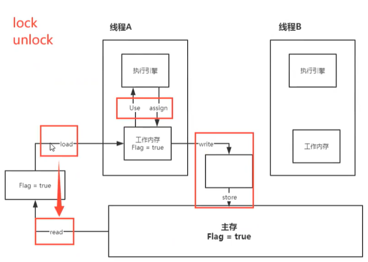
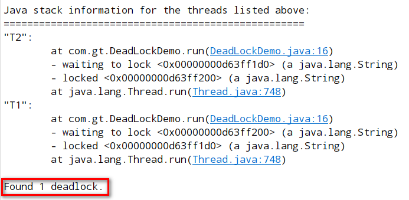

https://www.bilibili.com/video/BV1BJ411U7hW?p=170

# 1，什么是JUC

- 全在这3个包里

  ```java
  // juc = java.util.concurrent 的首字母
  import java.util.concurrent.*;
  import java.util.concurrent.atomic.*;  // 原子性
  import java.util.concurrent.locks.*;
  ```

- **Runnable** 没有返回值，效率比 **Callable** 相对低

- java 默认两个线程：main 线程、GC 线程

- java 不能开线程，是调的本地方法 start0 开的线程

- ==并发：==多线程操作同一个资源 （本质是充分利用CPU资源）

- ==并行：==多核 CPU 多线程同时执行（使CPU发挥最高性能用线程池）

- 线程分==工作内存==和==主内存==

- 查看 CPU 多少核

  ```java
  Runtime.getRuntime().availableProcessors()
  ```

- 线程状态

  ```java
  public enum State {
      // 新生
      NEW,
      // 运行
      RUNNABLE,
      // 阻塞
      BLOCKED,
      // 等待，一直等，直到被唤醒
      WAITING,
      // 超时等待，一段时间后自动唤醒
      TIMED_WAITING,
      // 终止
      TERMINATED;
  }
  ```

- 乐观锁：采用版本控制来实现，不是真正意义上的加锁
- 悲观锁：真正意义上的加锁。就像事务，处理完之前，别人无法访问

## wait / sleep 区别

- **1.来自不同的类**

  - wait 来自 Object

  - sleep 来自 Thread

    ```java
    // 尽量要用 TimeUnit
    TimeUnit.DAYS.sleep(1);
    ```

- **2.关于锁的释放**

  - wait 会释放锁
  - sleep 不会释放

- **3.使用的范围**

  - wait 必须在同步代码块中
  - sleep 任何地方


## 企业级多线程代码

在高内聚低耦合前提下，**线程**    **操作**    **资源类**

高内聚低耦合：空调好比资源类，其内部有制冷制热等功能，向外暴露接口

# 2，Lock 锁

各种锁概念：https://zhuanlan.zhihu.com/p/71156910

一个锁可以属于多种分类。

- **可重入锁**：又叫递归锁，即允许同一线程多次获取同一把锁；例如一个递归函数里有锁操作，递归过程中如果不会阻塞，则这个锁就是可重入锁。ReentrantLock也是可重入锁。

- **读写锁**：读写锁是配套使用的。
  - ==读锁==是共享锁，所以两个读锁之间不会等待
  - 一读一写之间，谁先获得谁执行，另一个等待
  - 两个写锁之间，谁先获得谁执行，另一个等待

- 传统的 synchronized 和 lock 的区别
  - 内置关键字和类的区别
  - synchronized 无法判断是否获取锁；lock 可以
  - synchronized 自动释放锁；lock 手动释放（不释放就死锁）
  - synchronized 线程1获得锁，线程2等待（如果1阻塞则一直等）；lock 不一定会一直等（tryLock方法）
  - synchronized 可重入锁，不可以中断，非公平；lock 可重入锁，可以判断有没有锁，公平/非公平都可以
  - synchronized 适合锁少量的同步代码；lock 适合锁大量同步代码，灵活度高

# 3，生产者消费者

- 即线程间通信（等待与唤醒）

> synchronized（老版） wait / notify

```java
// 例子为线程间对资源 n 进行加1减1交替操作
class Numb {
    private int n = 0;

    // +1
    public synchronized void add() throws InterruptedException {
        if (n != 0) wait(); // 等待
        n++;
        System.out.println(Thread.currentThread().getName() + ":" + n);
        notifyAll(); // +1完毕 通知其它线程
    }

    // -1
    public synchronized void sub() throws InterruptedException {
        if (n == 0) wait(); // 等待
        n--;
        System.out.println(Thread.currentThread().getName() + ":" + n);
        notifyAll(); // -1完毕 通知其它线程
    }
}

public static void main(String[] args) {
    Numb n = new Numb();

    new Thread(() -> {
        for (int i = 0; i < 10; i++) {
            try {
                n.add();
            } catch (InterruptedException e) {
                e.printStackTrace();
            }
        }
    }, "A").start();
    new Thread(() -> {
        for (int i = 0; i < 10; i++) {
            try {
                n.sub();
            } catch (InterruptedException e) {
                e.printStackTrace();
            }
        }
    }, "B").start();
}
// 结果： A:1 B:0 A:1 B:0 ...
```

> 上面代码 AB 两个线程没问题，但 ABCD 4个线程就有问题了（如 n 出现2 和 3）
>
> 因为==等待必须放在循环里，以防止“虚假唤醒”==

```java
// 上面代码 增加 C和D 两个线程导致的问题
// 将 if 改成 while 就解决了
while (n != 0) wait(); // if (n != 0) wait();
while (n == 0) wait(); // if (n == 0) wait();
```

> JUC（新版）生产/消费者

- Condition 接口

  - java.util.concurrent.locks

  - ==lock 取代 synchronized==

  - ==Condition.await 取代 wait==

  - ==Condition.signal 取代 notify==

```java
class Numb {
    private int n = 0;
    Lock lock = new ReentrantLock();
    Condition cd = lock.newCondition();

    // +1
    public void add() throws InterruptedException {
        lock.lock();
        try {
            while (n != 0) cd.await(); // 等待
            n++;
            System.out.println(Thread.currentThread().getName() + ":" + n);
            cd.signalAll(); // +1完毕 通知其它线程
        } finally {
            lock.unlock();
        }
    }

    // -1
    public void sub() throws InterruptedException {
        lock.lock();
        try {
            while (n == 0) cd.await(); // 等待
            n--;
            System.out.println(Thread.currentThread().getName() + ":" + n);
            cd.signalAll(); // -1完毕 通知其它线程
        } finally {
            lock.unlock();
        }
    }
}
```

> 上面代码有个问题，就是 ABCD 4个线程间是无序的。Condition可以解决

```java
// 示例为 ABC 3个线程 按顺序循环执行
class N {
    int n = 1;
    Lock lock = new ReentrantLock();
    // 分别控制3个线程
    Condition cd1 = lock.newCondition();
    Condition cd2 = lock.newCondition();
    Condition cd3 = lock.newCondition();

    public void do1() throws InterruptedException {
        lock.lock();
        try {
            while (n != 1) cd1.await(); // A等待
            n = 2;
            System.out.println(Thread.currentThread().getName());
            cd2.signal(); // B唤醒
        } finally {
            lock.unlock();
        }
    }
    public void do2() throws InterruptedException {
        lock.lock();
        try {
            while (n != 2) cd2.await(); // B等待
            n = 3;
            System.out.println(Thread.currentThread().getName());
            cd3.signal(); // C唤醒
        } finally {
            lock.unlock();
        }
    }
    public void do3() throws InterruptedException {
        lock.lock();
        try {
            while (n != 3) cd3.await(); // C等待
            n = 1;
            System.out.println(Thread.currentThread().getName());
            cd1.signal(); // A唤醒
        } finally {
            lock.unlock();
        }
    }
}
// main 方法
public static void main(String[] args) {
    N n = new N();
	// ABC仨线程分别调10次资源
    new Thread(() -> {
        try {
            for (int i = 0; i < 10; i++) n.do1();
        } catch (InterruptedException e) {
            e.printStackTrace();
        }
    }, "A").start();
    new Thread(() -> {
        try {
            for (int i = 0; i < 10; i++) n.do2();
        } catch (InterruptedException e) {
            e.printStackTrace();
        }
    }, "B").start();
    new Thread(() -> {
        try {
            for (int i = 0; i < 10; i++) n.do3();
        } catch (InterruptedException e) {
            e.printStackTrace();
        }
    }, "C").start();
}
// 结果：ABC ABC ... 10次
```

# 4，8锁现象

- 就是关于锁的8个问题

## 问题1

> AB两个线程调用同一个带锁资源，AB之间睡眠1秒，谁先执行？
>

```java
// 带锁的资源
class DataLock {
    public synchronized void A() {System.out.println("A");}
    public synchronized void B() {System.out.println("B");}
}
// main 方法
DataLock dt = new DataLock();

new Thread(() -> {dt.A();}, "A").start();
TimeUnit.SECONDS.sleep(1);
new Thread(() -> {dt.B();}, "B").start();
```

> 答：A 先执行。

## 问题2

> 在 “1” 基础上，资源A又睡眠了2秒，谁先执行？
>

```java
// 带锁资源
public synchronized void A() {
    try {
        TimeUnit.SECONDS.sleep(2);
    } catch (InterruptedException e) {
        e.printStackTrace();
    }
    System.out.println("A");
}
```

- 先获得锁先执行，即便资源A睡了2秒，但A方法没执行完，锁不能释放
- 又因为 synchronized 用在方法上实际锁的是 this（即方法调用者），所以 A 不释放 B 无法获得锁

> 答：还是A。

## 问题3

> 在 "2" 基础上，带锁资源加个**普通方法** C，B 线程调用 C ，谁先执行？
>

```java
// 带锁资源
public void C() {System.out.println("C");}
// main 方法
DataLock dt = new DataLock();

new Thread(() -> {dt.A();}, "A").start();
TimeUnit.SECONDS.sleep(1);
new Thread(() -> {dt.C();}, "C").start();
```

- 因为资源 C 是普通方法没有锁

> 答：C

## 问题4

> 在 "2" 基础上，main 里 new 两个资源分别给 AB 线程调，谁先执行？
>

```java
// main 方法
DataLock dtA = new DataLock();
DataLock dtB = new DataLock();

new Thread(() -> {dtA.A();}, "A").start();
TimeUnit.SECONDS.sleep(1);
new Thread(() -> {dtB.B();}, "B").start();
```

- 因为此时是两把锁（或两个调用者），资源A睡眠2秒，不影响线程B获得锁

> 答：B 先执行。

## 问题5

> 在 "2" 基础上，把带锁资源的两个方法变成静态，谁先执行？
>

```java
// 带锁的资源
class DataLock {
    public static synchronized void A() {
        try {
            TimeUnit.SECONDS.sleep(2);
        } catch (InterruptedException e) {
            e.printStackTrace();
        }
        System.out.println("A");
    }
    public static synchronized void B() {System.out.println("B");}
}
```

- 当 static synchronized 时，锁的就不是 this了，而是 DataLock.class 对象
- 因为 ==class 对象是全局唯一的==，所以在这个例子里效果和锁 this 是一样的

> 答：A 先执行。

## 问题6

> 在 "5" 基础上，main 里 new 两个资源分别给 AB 线程调，谁先执行？
>

- 因为锁的是 class（全局唯一），AB线程都用的同一把锁（即 class 对象）

> 答：还是 A。

## 问题7

> 在 "5" 基础上，把资源 B 的 static 去掉，谁先执行？
>

```java
// 带锁的资源
class DataLock {
    public static synchronized void A() {
        try {
            TimeUnit.SECONDS.sleep(2);
        } catch (InterruptedException e) {
            e.printStackTrace();
        }
        System.out.println("A");
    }
    // static 去掉
    public synchronized void B() {System.out.println("B");}
}
```

- 因为一个静态一个非静态，就是两把锁，AB线程没用同一把锁，所以 A 睡眠时不影响 B 获得锁

> 答：B 先执行。

## 问题8

> 在 "7" 基础上，main 里 new 两个资源分别给 AB 线程调，谁先执行？
>

- 和 "7" 一样，AB线程没用同一把锁，A 获得锁不影响 B 同时也获得锁

> 答：B 先执行。

# 5，集合类不安全

- 在被多线程操作时都会报 java.util.ConcurrentModificationException

- 集合类的老大 Collections

```java
// 线程不安全（List这样 Set同理）
List<String> list = new ArrayList<>();
// 解决办法：
// 1 Vector
List<String> list = new Vector<>();
// 2 Collections.synchronizedList
List<String> list = Collections.synchronizedList(new ArrayList<>());
// 3 JUC 解决办法
List<String> list = new CopyOnWriteArrayList<>();
```

## CopyOnWrite

- 写入时复制，简称 COW，计算机程序设计领域的一种优化策略
- 写入时与 Vector 区别
  - Vector 是用 synchronized 实现的，效率较低
  - CopyOnWrite 先lock 然后再复制出一份数据来进行写入，写入完再 set 回去，最后unLock

## HashSet

- 低层就是 HashMap

  ```java
  public HashSet() {map = new HashMap<>();}
  public boolean add(E e) {return map.put(e, PRESENT)==null;}
  ```

## HashMap

- 默认等价于

  ```java
  // 初始化容量，加载因子
  new HashMap<String, Object>(16, 0.75f);
  // 解决不安全Map-1
  Collections.synchronizedMap(new HashMap<String, Object>());
  // 解决不安全Map-2
  new ConcurrentHashMap<>();
  ```


# 6，Callable

- 1.有返回值   2.可以抛出异常  3.Runnable的方法是run，而Callable的方法是call

```java
class CB implements Callable<String> {
    @Override
    public String call() throws Exception {return "abc";}
}
// main 方法
FutureTask task = new FutureTask(new CB());
new Thread(task).start();
// get 方法可能会产生阻塞
System.out.println(task.get());  // abc

// 当多个线程跑同一个task时，CB.call 只会走一次
// 为提高效率 内部有缓存
new Thread(task, "A").start();
new Thread(task, "B").start();
```


# 7，常用的辅助类

## CountDownLatch

- 减法计数器

```java
// 计数器为6
CountDownLatch cl = new CountDownLatch(6);
for (int i = 1; i <= 6; i++) {
    new Thread(() -> {
        System.out.println(Thread.currentThread().getName());
        cl.countDown(); // 数量-1
    }, "Thread" + i).start();
}
cl.await(); // 等待计数器归0再往下执行
System.out.println("the end");
```

## CyclicBarrier

- 加法计数器
- ==不需要手动+1计数==（CountDownLatch需要手动countDown来-1计数）

```java
CyclicBarrier cb = new CyclicBarrier(7,
      () -> { System.out.println("the end thread"); });

for (int i = 1; i <= 7; i++) {
    final int fi = i; // 只有 final 外部变量 lambda 才能使用
    new Thread(() -> {
        System.out.println(fi);
        try {
            cb.await();
        } catch (InterruptedException e) {
            e.printStackTrace();
        } catch (BrokenBarrierException e) {
            e.printStackTrace();
        }
    }).start();
}
```

## Semaphore

- 信号量。多个资源互斥使用，并发限流，控制最大的线程数

```java
// 例如：3个车位6台车，前面的出来后面的才能进
Semaphore sh = new Semaphore(3);

for (int i = 1; i <= 6; i++) {
    new Thread(() -> {
        try {
            sh.acquire();  // 获得；若信息量已满，则等待直到有一个被释放为止
            System.out.println(Thread.currentThread().getName() + " IN");
            TimeUnit.SECONDS.sleep(3);
            System.out.println(Thread.currentThread().getName() + " OUT");
        } catch (InterruptedException e) {
            e.printStackTrace();
        } finally {
            sh.release(); // 释放；信号量+1，然后唤醒等待的线程
        }
    }, i + "").start();
}
```

## LockSupport

```java
// 手动阻塞/释放唤醒，要优于wait/notify
Thread t = new Thread(() -> {
    System.out.println("name's t");
    LockSupport.park();  //手动阻塞
    System.out.println("t end");
});
t.start();
Thread.sleep(3000);
LockSupport.unpark(t); //手动唤醒
```

# 8，读写锁

- 读的时候可以多个线程读，写的时候只能一个线程写

```java
class Cache {
    private volatile Map<Integer, Object> map = new HashMap<>();
    private ReadWriteLock lock = new ReentrantReadWriteLock();

    public void set(Integer k, Object v) {
        lock.writeLock().lock(); // 写锁

        try {
            System.out.println(Thread.currentThread().getName() + " write");
            map.put(k, v);
            System.out.println(Thread.currentThread().getName() + " write OK");
        } finally {
            lock.writeLock().unlock();
        }
    }

    public Object get(Integer k) {
        lock.readLock().lock(); // 读锁

        try {
            System.out.println(Thread.currentThread().getName() + " read");
            Object o = map.get(k);
            System.out.println(Thread.currentThread().getName() + " read OK");
            return o;
        } finally {
            lock.readLock().unlock();
        }
    }
}
// main 方法
Cache cache = new Cache();

for (int i = 1; i <= 5; i++) {
    final int fi = i;
    new Thread(() -> {cache.set(fi, fi + "");}, "write: " + i).start();
}

for (int i = 1; i <= 5; i++) {
    final int fi = i;
    new Thread(() -> {cache.get(fi);}, "read: " + i).start();
}
```


# 9，阻塞队列

- 阻塞
  - 写操作时队列满了，就必须阻塞等待有出列的
  - 读操作时队列为空，就必须阻塞等待有写入的
- 队列：FIFO，先进先出

## 4组 API

| 方式     | 抛出异常 | 不抛异常且有返回值 | 阻塞一起等待 | 阻塞超时退出                |
| -------- | -------- | ------------------ | ------------ | --------------------------- |
| 添加     | add      | offer              | put          | offer(v, timeOut, timeUnit) |
| 移除     | remove   | poll               | take         | poll(timeOut, timeUnit)     |
| 查首元素 | element  | peek               | -            | -                           |

## 同步队列（SynchronousQueue)

- 队列大小定死 1（进一个必须出来后才能再进）


# 10，线程池

- 用线程池来创建线程
- **用完要关闭**（shutdown方法）

- **池化技术：**事先准备好一些资源，有谁要用就来这里拿，用完还回来
  - 例如：线程池，连接池，内存池，对象池等

- 线程池好处：
  - 1.降低资源消耗
  - 2.提高响应速度
  - 3.方便管理
  - 4.线程利用，可以控制最大并发数

## ==线程池必会==

### 1.三大方法

```java
// 创建单个线程的线程池（池里只能有1条线程在运行）
Executors.newSingleThreadExecutor();
// 创建固定线程个数的线程池（池里最多能有n条线程在同时运行）
Executors.newFixedThreadPool(n);
// 创建可伸缩线程的线程池（只要资源够，同时运行多少都行）
Executors.newCachedThreadPool();
```

### 2.七大参数

- 三大方法调用的都是 ==ThreadPoolExecutor==

```java
public ThreadPoolExecutor(int corePoolSize, // 核心线程池大小(始终有效)
                          int maximumPoolSize, // 最大核心线程池大小(包含不忙时可以处理无效的)
                          long keepAliveTime, // 阻塞多长时间后释放
                          TimeUnit unit, // 阻塞时间的单位
                          BlockingQueue<Runnable> workQueue, // 阻塞队列
                          ThreadFactory threadFactory, // 线程工厂，创建线程的，一般不用动
                          RejectedExecutionHandler handler) { // 拒绝策略
    .......
}
```

- 自定义线程池

```java
ExecutorService pool = new ThreadPoolExecutor(
    3,
    // 最好 Runtime.getRuntime().availableProcessors(获取CPU核数) 替换 5
    5,// 最大承载（也就是 8 个） = 3（队列大小） + 5
    2,
    TimeUnit.SECONDS,
    new ArrayBlockingQueue<>(3),
    Executors.defaultThreadFactory(),
    new ThreadPoolExecutor.AbortPolicy() // 队列满了的话报错
);

try {
    // 最大承载 8 个，写 9 就报错
    for (int i = 0; i < 8; i++) {
        pool.execute(() -> 
                { System.out.println(Thread.currentThread().getName()); });
    }
} finally {
    pool.shutdown();
}
```

### 3.四大拒绝策略

```java
// 满了就报错
new ThreadPoolExecutor.AbortPolicy();
// 哪来的回哪去（main线程启动的线程池，那么超出被拒绝的部分就交由main线程处理）
new ThreadPoolExecutor.CallerRunsPolicy();
// 满了不报异常，但会丢掉任务
new ThreadPoolExecutor.DiscardPolicy()
// 满了不报异常，但会尝试和最早的竞争（如果最早的执行完了那么这个任务可以执行，否则被丢掉）
new ThreadPoolExecutor.DiscardOldestPolicy()
```

## 如何定义最大线程

### 1.CPU 密集型

- 几核的 CPU 就定义为几，可保证 CPU 效率最高
- 获取CPU核数：**Runtime.getRuntime().availableProcessors()**

### 2.IO 密集型

- 判断程序中十分消耗IO的线程有多少个
- 假如15个，那就 * 2 = 30

 

# 11，ForkJoin

- JDK1.7开始有的。用于并行执行任务，提高==大数据量==效率。
- **MapReduce**：把大任务拆分成若干个子任务
- 再将多个子任务的结果汇总计算，生成最终结果

- 特点：工作窃取
  - 比如AB两个线程执行，B先执行完后会窃取A没完成的部分来执行
  - 维护的都是双端队列

> ForkJoin 用法

```java
// 1. ForkJoinPool 用于执行
//    ForkJoinPool.Submit 异步执行
//    ForkJoinPool.execute 同步执行

// 2. ForkJoinTask<V>
//    RecursiveAction 递归事件，无返回值
//    RecursiveTask<V> 递归任务，有返回值

// 一个求和的例子
// 先继承 RecursiveTask
public class LambdaDemo extends RecursiveTask<Long> {
    private Long start;
    private Long end;
    private final Long limit = 10000L;

    public LambdaDemo(Long start, Long end) {
        this.start = start;
        this.end = end;
    }

    // 计算方法：返回计算结果
    @Override
    protected Long compute() {
        if ((end - start) < limit) {
            Long sum = 0L;
            for (Long i = 1L; i <= end; i++) {
                sum += i;
            }
            return sum;
        } else {
            Long mid = (start + end) / 2;
            LambdaDemo task1 = new LambdaDemo(start, mid);
            task1.fork();
            LambdaDemo task2 = new LambdaDemo(mid + 1, end);
            task2.fork();
            return task1.join() + task2.join();
        }
    }

    public static void main(String[] args) throws ExecutionException, InterruptedException {
        ForkJoinPool pool = new ForkJoinPool();
        // 10_0000 带下划线只提高可读性 无其它含义
        ForkJoinTask<Long> task = pool.submit(new LambdaDemo(1L, 10_0000L));
        System.out.println(task.get());
    }
}

// 效率更高的办法用 Lambda
LongStream.rangeClosed(0L, 10_0000L).parallel().reduce(0, Long::sum)
```


# 12，异步回调

- Future：返回未来的结果

- 异步执行，成功回调，失败回调

```java
// 无返回值异步调用
CompletableFuture<Void> future = CompletableFuture.runAsync(() -> {
    System.out.println(Thread.currentThread().getName() + " => Void");
});
future.get(); // 阻塞，等待执行结果

// 有返回值
CompletableFuture<Integer> future = CompletableFuture.supplyAsync(() -> {
    return 1024;
});
Integer i = future.whenComplete((t, u) -> {
    System.out.println("t:" + t); // 正常终了
    System.out.println("u:" + u); // 异常终了
}).exceptionally(e -> {
    System.out.println(e.getMessage());
    return 123; // 异常时返回的值
}).get();
```


# 13，JMM

- java 内存模型，仅是个概念或约定（不像jvm是真实存在的）

- 关于 JMM 一些同步约定
  - 线程解锁前：必须把共享变量==立刻==刷回主存
  - 线程加锁前：必须读取主存中的最新值到工作内存中
  - 加锁和解锁必须是同一把锁

- **线程 8 种操作**
  - lock：加锁
  - unlock：释放锁
  - read：把资源从主内存读出来
  - load：把 read 的资源加载到工作内存
  - assign：把执行引擎中的新值拷到工作内存副本中
  - store：从工作内存中读出新值
  - write：将 store 读出来的新值定入到主内存



> 问题：主内存中的值变了，AB线程不知道。。。14解决


# 14，volatile

- volatile 是 jvm 提供的==轻量级同步机制==

  - ==可见性：当一个线程修改了变量值，其它线程能够立即看到修改的值==

  - 保证可见性
  
    ```java
    // 不加 volatile 会死循环
    // 加 volatile 则保证可见性
    private volatile static int n = 0;
    
    public static void main(String[] args) throws InterruptedException {
        // 不加 volatile 的话线程不知道内存中的 n 发生了变化
        new Thread(() -> { while (n == 0); }).start();
        TimeUnit.SECONDS.sleep(2);
        n = 1;
        System.out.println(n);
  }
    ```

  - ==不保证原子性==

    - ==原子性==
      - db：要么都成功，要行都失败。
      - java：保证共享资源在一个线程写的时候不被另一个线程修改
  
    ```java
    // 加了 volatile 也不能保证 4000
    private volatile static int n = 0;
    public static void add() {n++;}
    
    public static void main(String[] args) {
        // 20个线程，每个线程add 200次
        // 理论上 n == 4000
        for (int i = 0; i < 20; i++) {
            new Thread(() -> { for (int j = 0; j < 200; j++) add(); }).start();
        }
    
        // 两个默认线程：main，gc
        while (Thread.activeCount() > 2) Thread.yield();
      	System.out.println(Thread.currentThread().getName() + ": " + n);
    }
  // 结果很多次执行不是 4000
    ```

    - **如何不用 lock 和 synchronized 来保证元子性？**
  
      - 通过原子类解决（java.util.concurrent.atomic）
  
      ```java
      // 带元子性的 int 类（底层用的 CAS ）
      private static AtomicInteger n = new AtomicInteger();
      public static void add() {
          n.getAndIncrement(); // +1 操作
      }
      ```
  
  - 禁止指令重排
  
    - 指令重排：java 代码 --> 编译器优化重排 --> 指令并行重排 --> 内存系统重排 --> 执行
    - 当多个线程操作某变量，若每个线程都要对其指令重排，可想而知最终结果会怎样
    - 利用内存屏障保证指令重排
    - 在单例模式中使用最多


# 15，单例模式

- 思想：构造器私有，别人 new 不了，保证程序中只有一份

## 饿汉式单例

- 一上来就加载，缺陷浪费资源

```java
public class A {
    // 私有化构造器
    private A() {}
    private final static A a = new A();
    public static A create() {return this.a;}
}
```

## 懒汉式单例

- 用的时候再加载，==单程单例OK，多线程下无法单例==，容易被反射破坏单例

```java
public class A {
    // 私有化构造器
    private A() {}
    private final static A a;
    public static A create() {
        if (a == null) a = new A();
        return a;
    }
}
```


# 16，深入 CAS

- CAS：compare and set，比较**工作内存**和**主内存**的值，如果是期望的，则执行操作，否则一直循环
- ==是 CPU 的并发原语（指令）==
- 直接操作内存，效率很高
- java 无法操作内存，但可以调用 C++（通过 native），C++可以操作内存
- **unsafe：**是 java 留的后门，可以通过它操作内存

```java
AtomicInteger i = new AtomicInteger(2020);
// p1: 期望值  p2：更新值
// 如果期望的值是 p1，那么就更新成 p2
i.compareAndSet(2020, 2021);
i.get(); // 2021
```

## 缺点

- 因为底层是自旋锁，所以**循环耗时**
- 一次只能保证一个共享变量的元子性
- 存在 ABA 问题

## ABA 问题

- AB 两个线程同时操作同一个资源，A 不知道 B 动过资源，B 也不知道 A 动过
- **解决：下一章原子引用**


# 17，原子引用

- 带版本号的原子操作。AtomicReference
- **对应乐观锁思想**

- ==大坑：==如果泛型类型是整型包装类时，值在-127到128之间会复用，否则在堆上重新产生（阿里规约一.四.7）

```java
// p1：值 p2：版本号
// 根据版本号改值
AtomicStampedReference i = new AtomicStampedReference(1, 1);

// 线程 A
new Thread(() -> {
    int v = i.getStamp(); // 获得当前版本号
    System.out.println("A1:" + v);
	// 改值
    System.out.println(i.compareAndSet(1, 2, v, v + 1));
    // 再改回来
    System.out.println(i.compareAndSet(2, 1, i.getStamp(), i.getStamp() + 1));

}, "A").start();

// 线程 B
new Thread(() -> {
    int v = i.getStamp(); // 获得当前版本号
    System.out.println("B1:" + v);

    System.out.println(i.compareAndSet(1, 3, v, v + 1));
    System.out.println(i.compareAndSet(3, 4, i.getStamp(), i.getStamp() + 1));
}, "B").start();
```


# 18，各种锁的理解

- 公平锁：不能插队，先来先执行
- 非公平锁：可以插队（默认）
- 可重入锁：可递归调用锁。
  - 比如A类里面两个带锁方法f1/f2，而f1又调了f2，此时外部调了f1时，锁要等f2也执行完才释放
  - 上面情况 lock是两把锁（lock1 -> lock2 -> unlock2 -> unlock1），synchronized 则是一把锁
  - lock 锁必须配对，否则死锁

- 自旋锁：不停循环查看是否有锁

```java
// 自定义个自旋锁
// 初始化 thread = null
AtomicReference<Thread> ref = new AtomicReference<>();
// 加锁
public void lock() {
    Thread thr = Thread.currentThread();
    System.out.println(thr.getName() + " ==> lock");
    // != null 则继续监听
    while (!ref.compareAndSet(null, thr));
}
// 解锁
public void unlock() {
    Thread thr = Thread.currentThread();
    System.out.println(thr.getName() + " ==> unlock");
    ref.compareAndSet(thr, null);
}

public static void main(String[] args) throws InterruptedException {
    SpinLockDemo lock = new SpinLockDemo();
    new Thread(() -> {
        lock.lock();
        try {
            TimeUnit.SECONDS.sleep(2);
        } catch (InterruptedException e) {
            e.printStackTrace();
        } finally {
            lock.unlock();
        }
    }, "T1").start();
    TimeUnit.SECONDS.sleep(1);
    new Thread(() -> {
        lock.lock();
        try {
            TimeUnit.SECONDS.sleep(2);
        } catch (InterruptedException e) {
            e.printStackTrace();
        } finally {
            lock.unlock();
        }
    }, "T2").start();
}
// 结果：T1 lock, T1 unlock, T2 lock, T2 unlock
```

- 解决死锁

  ```java
  // 死锁例子
  public class DeadLockDemo implements Runnable {
      String lockA = "A";
      String lockB = "B";
      public DeadLockDemo(String a, String b) {
          lockA = a;
          lockB = b;
      }
  
      @Override
      public void run() {
          synchronized (lockA) {
              System.out.println("A");
              synchronized (lockB) {
                  System.out.println("B");
              }
          }
      }
  
      public static void main(String[] args) {
          new Thread(new DeadLockDemo("A", "B"), "T1").start();
          new Thread(new DeadLockDemo("B", "A"), "T2").start();
      }
  }
  ```

  - 1.使用 ==JPS -l== 定位进程号

  - 2.使用 ==jstack 进程号== 找到死锁

  - 3.通过 **deadlock** 关键字查看死锁信息

    

# 19，ThreadLocal

## 1. 介绍

**官方描述：**用来提供线程内部的局部变量。这种变量在多线程环境下访问（get / set 访问）时能保证每个线程的变量独立于其它线程内的变量。ThreadLocal 实例通常都是 private static，用于关联线程和线程上下文。

**可理解为：**提供线程内的局部变量，不同线程间不会相互干扰，这种变更在线程生命周期内有效，减少同一个线程内多个函数或组件之间一些公共变量传递的复杂度。

**总结 ：**

- 线程并发：多线程并发场景下
- 传递数据：通过 ThreadLocal 在同一线程不同函数或组件中传递公共变量
- 线程隔离：每个线程的变量都是独立的，不相互影响

## 2. 基本用法

### 2.1 常用方法

| 方法                     | 描述                       |
| ------------------------ | -------------------------- |
| new ThreadLocal()        | 无参构造创建对象           |
| public void set(T value) | 设置当前线程绑定的局部变量 |
| public T get()           | 获取当前线程绑定的局部变量 |
| public void remove()     | 移除当前线程绑定的局部变量 |

### 2.2 例子

解决：线程隔离问题。多线程场景下，线程中的变量相互独立，线程A设置获取变量不影响线程B

```java
@Data
public class Demo1 {
    private String var1;

    public static void main(String[] args) {
        Demo1 dm = new Demo1();

        for (int i = 0; i < 5; i++) {
            new Thread(() -> {
                dm.setVar1(Thread.currentThread().getName());
                try { Thread.sleep(10); } catch (InterruptedException e) { e.printStackTrace(); }
                System.out.println(Thread.currentThread().getName() + ":" + dm.getVar1());
            }, "线程" + i).start();
        }
    }
}
```

> 结果：
>
> 线程2:线程4
> 线程1:线程4
> 线程4:线程4
> 线程3:线程4
> 线程0:线程4

上面例子结果显示各个线程取得的不是自己的变量，改善如下：

```java
public class Demo1 {
    private static ThreadLocal<String> tl = new ThreadLocal<>();
    private String var1;

    public void setVar1(String var1) {
        // 绑定当前线程变量
        tl.set(var1);
    }
    public String getVar1() {
        // 取出当前线程变量
        return tl.get();
    }

    public static void main(String[] args) {
        Demo1 dm = new Demo1();

        for (int i = 0; i < 5; i++) {
            new Thread(() -> {
                dm.setVar1(Thread.currentThread().getName());
                try { Thread.sleep(10); } catch (InterruptedException e) { e.printStackTrace(); }
                System.out.println(Thread.currentThread().getName() + ":" + dm.getVar1());
            }, "线程" + i).start();
        }
    }
}
```

> 结果：
>
> 线程1:线程1
> 线程0:线程0
> 线程2:线程2
> 线程3:线程3
> 线程4:线程4

### 2.3 与 synchronized 区别

在上面改善前的例子基础上

```java
synchronized (dm) {
    dm.setVar1(Thread.currentThread().getName());
    try { Thread.sleep(10); } catch (InterruptedException e) { e.printStackTrace(); }
    System.out.println(Thread.currentThread().getName() + ":" + dm.getVar1());
}
```

虽然 synchronized 也解决的问题，但 ThreadLocal ==省去了等待锁的时间==，**比 synchronized 有更高的并发性**


https://www.bilibili.com/video/BV1N741127FH?p=7