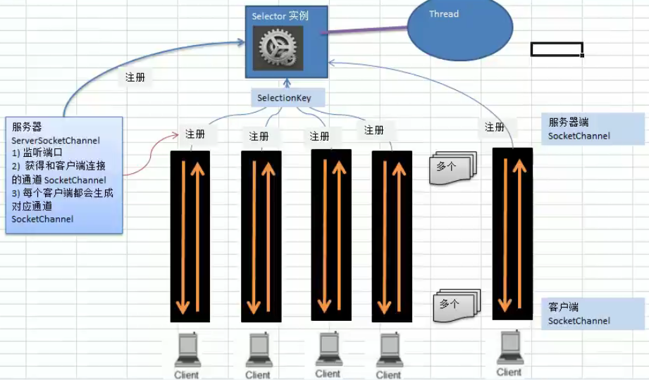
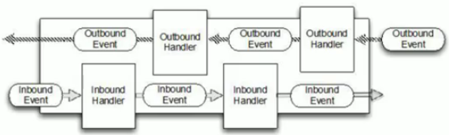
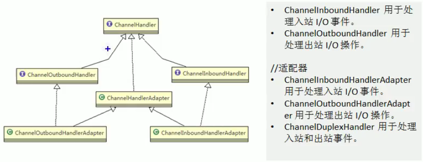
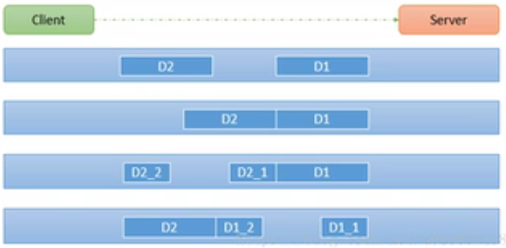
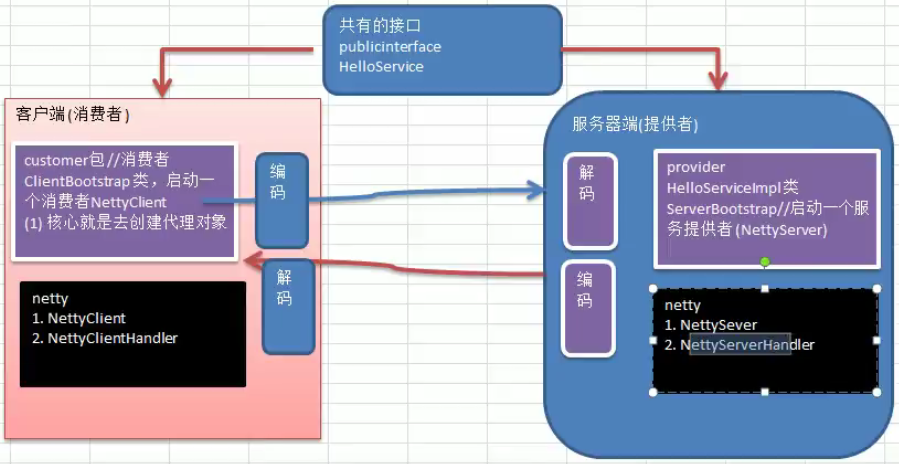

# 概念

## netty 介绍

- 由 jBoss 提供的一个 java 开源框架，现为 github 上的独立项目。
- 是一个异步、基于事件驱动的网络应用框架；用以快速开发高性能、高可靠性的网络 IO 程序。
- 主要针对在tcp协议下，面向客户端的高并发应用，或者p2p（点对点）场景下的大量数据持续传输的应用。
- 本质是一个 NIO 框架，适用于服务器通讯相关的多种应用场景。
- 要透彻理解netty，先要学习 nio，才能阅读 netty 源码。
- 最底层 TCP/IP  ->  往上一层为JDK IO/网络  ->  NIO  ->  netty

## 应用场景

- https://netty.io/wiki/related-projects.html
- **分布式系统**：各个节点间需要远程服务调用；高性能 RPC 框架必不可少，往往作为基础组件被 RPC 框架使用。比如 dubbo 等
- **游戏行业**：提供了 tpc/udp/http 协议栈，方便定制私有协议栈（比如：账号登陆服务）
- **地图服务**间通讯
- **大数据领域**：Hadoop 的高性能通信和序列化组件，默认采用netty进行跨界点通信。

## IO模型说明

IO模型可理解为：用什么样的通道进行数据发送和接收，很大程度上决定了程序通信的性能。

- **bio：**传统阻塞型。服务器维护每个客户端都要开启一个线程。适用于连接数目较小的架构。（在java.io包下）

- **nio：**同步非阻塞。只需要开启一个线程就能维护多个客户端。适用于连接数目较多且连接时间较短

- **aio：**异步非阻塞(nio.2)。对有效的请求才启动线程。目前未得到广泛应用。适用于连接数目多时间长

# BIO

## 1. server 端

```java
// 监听socket
ServerSocket serverSocket = new ServerSocket();
serverSocket.bind(new InetSocketAddress(8081));
// 阻塞：放弃了CPU资源
// 到这会阻塞 直到客户端 new Socket("127.0.0.1", 8081) 才会返回accept
Socket socket = serverSocket.accept();
// 从这往下应该开个线程才能处理并发
// 多线程缺点：因每个连接都要开线程 太浪费资源
// 若服务端不活跃线程较多则考虑单线程 然而BIO单线程无法处理并发 则会引入NIO
byte[] bytes = new byte[4];
// 又会阻塞 直到客户端 write(scanner.next().getBytes()) 才会返回 iCount
int iCount = socket.getInputStream().read(bytes);
// 接收的内容
String content = new String(bytes);
```

## 2. 客户端

```java
Socket socket = new Socket("127.0.0.1", 8081);
// 控制台输入4个字符后回车
Scanner scanner = new Scanner(System.in);
// 发送
socket.getOutputStream().write(scanner.next().getBytes());
```

## 3. telnet 客户端

```bash
# 也可以用 telnet 作为客户端
telnet 127.0.0.1 8081 # 连接
# 连接成功后会进入一个空白屏，此时按 ctrl + ] 进入命令行
send haha # 向服务端发送 haha
```

# NIO

都放在java.nio包下，并且对原java.io包中的很多类进行了改写。

三大核心部分：Channel（通道），Buffer（缓冲区），Selector（选择器）

三大核心之间关系：

- 每个 channel 都对应一个 buffer
- 每个 selector 对应一个线程，可以对应多个 channel
- 程序切换到哪个 channel 由事件（event）决定
- selector 根据不同事件，在各个不同 channel 上切换
- buffer 是一个内存块，底层是个数组

一个socket服务端nio例子：

```java
// 存放客户端连接
static List<SocketChannel> list = new ArrayList<>();
ServerSocketChannel channel = ServerSocketChannel.open();
channel.bind(new InetSocketAddress(8081));
// 默认阻塞 false 不阻塞
channel.configureBlocking(false);
while (true) {
    SocketChannel accept = channel.accept();
    //有连接保存连接
    if (accept != null) {
        accept.configureBlocking(false);
        list.add(accept);
    }
    //遍历是否有客户端发信
    for (SocketChannel client : list) {
        ByteBuffer bf = ByteBuffer.allocate(256);
        //收信
        if (client.read(bf) > 0) {
            System.out.println(new String(bf.array()));
        }
    }
}
//解决100次轮询有80次空轮询用epoll函数(只有linux好用)
```

## 1. buffer

- 子类有：ByteBuffer、ShortBuffer、CharBuffer、IntBuffer、LongBuffer、DoubleBuffer、FloatBuffer
- 四个重要属性：
  - Capacity：buffer的容量，在创建时定死了；定义5，就只能装5个
  - Limit：buffer的终点；定义了5，那limit就是5
  - Position：下一个要被读或写的元素位置（下标）
  - Mark：标记
- 重要的方法：
  - 跟上面4个属性对应的4个方法，有来返回这些值

### 1.1 基本读写操作

```java
IntBuffer ib = IntBuffer.allocate(5); // 创建能存5个整形元素的 buffer
for (int i = 0; i < ib.capacity(); i++) ib.put(i); // 往 buffer 写数据
// 从 buffer 读数据
ib.flip(); // 读写切换（由写切换成读）
while (ib.hasRemaining()) System.out.println(ib.get()); // 结果：0 1 2 3 4
ib.flip();   // 读写再切换
ib.put(100);
ib.flip();   // 读读再切换
System.out.println(ib.get()); // 100
```

### 1.2 get/put 类型要一致

==注意==：buffer put 进去什么类型（如：putInt，putChar），就要 get 什么类型（getInt，getChar）

```java
ByteBuffer bf = ByteBuffer.allocate(32); 
bf.putInt(1);
bf.putLong(2);
bf.putChar('大');
bf.putDouble(4);
bf.putFloat(5);
bf.putShort((short) 6);
bf.flip();
System.out.println(bf.getInt());    // 下：get的类型顺序要和上面put的类型顺序一致
System.out.println(bf.getLong());   //    否则取出的数据不是想要的，很可能还会报错
System.out.println(bf.getChar());
System.out.println(bf.getDouble());
System.out.println(bf.getFloat());
System.out.println(bf.getShort());
```

### 1.3 buffer转成只读

```java
ByteBuffer bf = ByteBuffer.allocate(8);
for (int i = 0; i < 8; i++) bf.put((byte) i);
bf.flip(); // 要读写转换
ByteBuffer readOnly = bf.asReadOnlyBuffer(); // asReadOnlyBuffer
while (readOnly.hasRemaining()) System.out.println(readOnly.get()); // 结果：0 ~ 7
```

### 1.4 MappedByteBuffer

让文件直接在内存中（==jvm堆外内存==，即：不占用宝贵的jvm内存）修改，如何同步到文件由nio来完成。

继承关系：DirectByteBufferR -> DirectByteBuffer -> MappedByteBuffer -> ByteBuffer -> Buffer -> Object

```java
// rw 表示读写
RandomAccessFile random = new RandomAccessFile("d:\\aa.txt", "rw");
FileChannel channel = random.getChannel();
/**
 * arg1：读写模式
 * arg2：可直接修改的起始位置
 * arg3：映射到内存的大小，即内存中可直接修改的范围是0 ~ 4
 *       假如aa.txt内容为：abcdef
 *       能修改的内容范围就是：abcde
*/
// map 实际类型是 DirectByteBuffer
MappedByteBuffer map = channel.map(FileChannel.MapMode.READ_WRITE, 0, 5);
map.put(0, (byte) 'A');
map.put(4, (byte) 'E');
random.close(); // 内容由原来的 abcdef 变成了AbcdEf
```

### 1.5 Scattering / Gathering

nio还支持通过多个buffer（即buffer数组）完成读写操作，即 **Scattering** 和 **Gathering**

- Scattering：表示将数据写入到buffer数组时，当一个buffer满了，再写入到下一个buffer
- Gathering：从buffer数组读取数据时，一个读完了再读下一个

```java
int maxLen = 8; // 最多接收8个字节
ServerSocketChannel server = ServerSocketChannel.open(); // 开启一个监听器
server.socket().bind(new InetSocketAddress(8080)); // socket绑定ip并启动
// 创建有2个元素的buffer数组，一个能将5字节，一个能装3字节
ByteBuffer[] bfs = new ByteBuffer[] {ByteBuffer.allocate(5), ByteBuffer.allocate(3)};
SocketChannel socket = server.accept(); // 等待客户端（telnet）连接
while (true) {
    int read = 0, write = 0;
    while (read < maxLen) {
        read += socket.read(bfs);
        System.out.println("读取了" + read + "个buffer");
        System.out.println("bfs=" + Arrays.stream(bfs).map(x -> new String(x.array())).collect(Collectors.joining()));
        Arrays.stream(bfs) // 打印2个buffer元素的position和limit
            .map(x -> "position=" + x.position() + ",limit=" + x.limit())
            .forEach(System.out::println);
    }
    Arrays.stream(bfs).forEach(ByteBuffer::flip); // 读写转换
    while (write < maxLen) write += socket.write(bfs);
    Arrays.stream(bfs).forEach(ByteBuffer::clear); // buffer复位，不是清空，点进去看一眼就清楚了
    System.out.println("read=" + read + ",write=" + write);
}
// 通过 telnet 发送数据进行测试
```

### 1.6 初始化带数据的buffer

```java
ByteBuffer bf = ByteBuffer.wrap("客户端发送的数据".getBytes(StandardCharsets.UTF_8)); // 函数wrap
```

## 2. channel

通道类似于流，但有以下区别：

- 通道可同时进行读写，流只能读或只能写
- 通道可实现异步读写
- 通道可从 buffer 中读数据，也可以写数据到 buffer

### 2.1 FileChannel

用于文件读写的读写操作

#### 2.1.1 int write(ByteBuffer)

把缓冲区的数据写到通道里

```java
// 通过 FileChannel 向文件里写数据
String s = "往文件里写的内容";
FileOutputStream out = new FileOutputStream("d:\\a.txt"); // 创建文件流(a.txt可以不存在)
FileChannel channel = out.getChannel();     // 从文件流中获取管道
ByteBuffer bf = ByteBuffer.allocate(1024);  // 创建缓冲区
bf.put(s.getBytes(StandardCharsets.UTF_8)); // 数据写入缓冲区
bf.flip();                                  // 读写转换
channel.write(bf);                          // 缓冲区数据读到管道（即数据写到文件中）
out.close();                                // 关闭流
```

#### 2.1.2 int read(ByteBuffer)

从通道读数据放到缓冲区

```java
// 通过 FileChannel 从文件里读数据
File file = new File("d:\\a.txt");   // 创建要读的文件（要用到内容大小）
FileInputStream in = new FileInputStream(file);  // 创建文件流
FileChannel channel = in.getChannel();  // 获取管道
ByteBuffer bf = ByteBuffer.allocate((int) file.length()); // 创建缓冲区
channel.read(bf); // 从管道读数据到缓冲区
System.out.println(new String(bf.array()));
in.close(); // 关闭流
```

```java
// 只用一个Buffer进行文件复制（a.txt复制到b.txt）
File file = new File("d:\\a.txt");
ByteBuffer bf = ByteBuffer.allocate((int) file.length());
FileInputStream in = new FileInputStream(file);
FileOutputStream out = new FileOutputStream("d:\\b.txt");
while(true) {
    bf.clean(); // 将posision、limit等复位
    if (in.getChannel().read(bf) == -1) break;
    bf.flip();
	out.getChannel().write(bf);
}
in.close();
out.close();
```

#### 2.1.3 long transferFrom

从目标通道复制数据到当前通道

```java
// transferFrom 拷贝文件
FileInputStream in = new FileInputStream("d:\\a.txt");
FileOutputStream out = new FileOutputStream("d:\\aa.txt");
FileChannel outChannel = out.getChannel();
FileChannel inChannel = in.getChannel();
// in是源文件，out是目标文件
outChannel.transferFrom(inChannel, 0, inChannel.size());

outChannel.close();
inChannel.close();
out.close();
in.close();
```

#### 2.1.4 long transferTo

把当前通道的数据复制到目标通道

```java
// transferTo 拷贝文件
FileOutputStream out = new FileOutputStream("d:\\aa.txt");
FileInputStream in = new FileInputStream("d:\\a.txt");
FileChannel outChannel = out.getChannel();
FileChannel inChannel = in.getChannel();
// in是源文件，out是目标文件
inChannel.transferTo(0, inChannel.size(), outChannel);

outChannel.close();
inChannel.close();
out.close();
in.close();
```

常用的 channel：

- DatagramChannel（UDP读写）

- ServerSocketChannel 

- SocketChannel（这俩用于TCP读写）

## 3. selector

### 3.1 介绍

- netty 的 IO 线程 NioEventLoop 聚合了 Selector（选择器，也叫多路复用器），可以同时并发处理成百上千个客户端连接。

- 当线程从某个客户端 socket 通道进行读写数据时，若没有数据可用时，该线程可以进行其它任务。

- 线程通常将非阻塞 IO 的空闲时间用于在其它通道上执行 IO 操作，所以单独的线程可以管理多个通道。

- 由于读写操作都是非阻塞的，这就可以充分提升 IO 线程的运行效率，避免由于频繁I/O阻塞导致的线程挂起。

  ```mermaid
  graph TB
  A[Thread] --> B{Selector}
  B --> C1(Channel)
  B --> C2(Channel)
  B --> C3(Channel)
  ```

### 3.2 相关方法

Selector 是一个抽象类，常用方法及说明：

```java
public abstract class Selector implements Closeable {
    static Selector open();           // 创建一个选择器对象
    
    int select();  // 监听所有注册的通道（没有IO事件就一直阻塞），直到有IO事件发生时，将对应的 SelectionKey 加入到内部集合中并返回
    int select(long timeout);         // timeout用来设置超时时间，如果没有IO事件则最多阻塞这些时间，到点儿自动返回
    int selectNow();                  // 不阻塞，立马返回
    
    Set<SelectionKey> keys();         // 选择器里所有已注册的SelectionKey（有事件发生 + 无事件发生的）
    Set<SelectionKey> selectedKeys(); // 有事件发生的SelectionKey
    // SelectionKey是关联Channel用的，其内部绑定了一个Channel，得到SelectionKey也就得到了Channel
    Selector wakeup();                // 唤醒 selector，立马返回
}
```

## 4. 网络编程原理

nio非阻塞网络编程相关的（Selector、SelectionKey、ServerSocketChannel、SocketChannel）关系梳理：

1. 服务器端首先会有一个ServerSocketChannel，用来监听客户端发起连接
2. 当有客户端连接时，便产生一个SocketChannel
3. 然后将 SocketChannel 注册到 Selector（可以注册多个）中去（通过AbstractSelectableChannel.register方法注册）
4. 注册后返回一个SelectionKey，会和Selector关联
5. Selector通过select方法返回有事件发生个数
6. 通过SelectionKey反向获得SocketChannel



## 5. 网络编程案例

### 5.1 服务端

```java
// 1.创建服务端 ServerSocketChannel
ServerSocketChannel server = ServerSocketChannel.open();
// 2.得到 Selector
Selector selector = Selector.open();
// 3.绑定服务端端口
server.socket().bind(new InetSocketAddress(6666));
// 4.设置非阻塞
server.configureBlocking(false);
// 5.把服务端的 ServerSocketChannel 注册到 selector，并且只关心 OP_ACCEPT
server.register(selector, SelectionKey.OP_ACCEPT);
// 6.循环等待客户端连接
while (true) {
    // select(1000)：阻塞1秒等待客户端连接，1秒后解除阻塞
    // select()：一直阻塞等待客户端连接
    // selectNow()：有没有客户端连接都不会阻塞等待
    if (selector.select(1000) == 0) {
        System.out.println("服务器等待了1秒无连接，不等待了。。。");
        continue;
    }
    // 如果select > 0（即有客户端有事件（指所有事件，并非只有客户端连接事件）发生），那就获取SelectionKey集合
    Set<SelectionKey> keys = selector.selectedKeys();
    // 遍历Set<SelectionKey>，处理事件
    Iterator<SelectionKey> iterator = keys.iterator();
    while (iterator.hasNext()) {
        SelectionKey selectionKey = iterator.next();
        if (selectionKey.isAcceptable()) { // 参考 6.1 SelectionKey
            SocketChannel clientChannel = server.accept();
            System.out.println("客户端连接成功，并生成了 SocketChannel");
            clientChannel.configureBlocking(false); // 设置非阻塞，否则报错
            // arg1：将客户端的SocketChannel注册到Selector中
            // arg2：关注读事件
            // arg3：给客户端绑定一个buffer
            clientChannel.register(selector, SelectionKey.OP_READ, ByteBuffer.allocate(1024));
        }
        if (selectionKey.isReadable()) {
            SocketChannel clientChannel = (SocketChannel) selectionKey.channel();
            // 获取客户端绑定的buffer
            ByteBuffer bf = (ByteBuffer) selectionKey.attachment();
            clientChannel.read(bf); // 读取客户端发送过来的信息（从channel读出数据到buffer）
            System.out.println("从客户端发送来的信息：" + new String(bf.array()).trim()); // trim：去掉后面的空格
        }
        // 从集合中手动移除当前SelectionKey，防止重复操作
        iterator.remove();
    }
}
```

### 5.2 客户端

```java
// 1.创建客户端
SocketChannel clientChannel = SocketChannel.open();
// 2.设置非阻塞
clientChannel.configureBlocking(false);
// 3.提供服务端的ip和端口
InetSocketAddress address = new InetSocketAddress("127.0.0.1", 6666);
// 4.连接服务端
if (!clientChannel.connect(address)) {
    while (!clientChannel.finishConnect()) {
        System.out.println("连接需要时间，客户端不会阻塞");
    }
}
// 5.如果连接成功就发送数据
//   wrap：初始化一个带数据的buffer
ByteBuffer bf = ByteBuffer.wrap("客户端发送的数据".getBytes(StandardCharsets.UTF_8));
clientChannel.write(bf);
System.in.read(); // 暂停命令行
```

## 6. API

### 6.1 SelectionKey

**表示Selector和Channel的注册关系，共4种：**

- OP_ACCEPT = > selectionKey.isAcceptable()：有新的客户端连接到服务端
- OP_CONNECT = > selectionKey.isConnectable()：连接已建立（只会被触发一次，之后会被移除，再之后就只有read和write会被触发）
- OP_READ = > selectionKey.isReadable()：读操作
- OP_WRITE = > selectionKey.isWritable()：写操作

> ServerSocketChannel的有效事件只有：OP_ACCEPT
> SocketChannel的有效事件为：OP_CONNECT、OP_READ、OP_WRITE

**相关方法：**

```java
public abstract class SelectionKey {
    Selector selector();         // 得到自己注册在哪个Selector
    SelectableChannel channel(); // 得到对应的channel
    Object attachment();         // 得到与channel绑定的数据，
                                 // 通常是 channel.register(selector, SelectionKey.OP_READ, ByteBuffer.allocate(1024)) 的第三个参数
    SelectionKey interestOps(int ops); // 改变关注的事件。如：selectionKey.interestOps(SelectionKey.OP_WRITE) 改成关注写事件的发生
}
```

### 6.2 ServerSocketChannel

用于服务器端监听新的客户端 Socket 连接

```java
public abstract class ServerSocketChannel extends AbstractSelectableChannel implements NetworkChannel {
    static ServerSocketChannel open();                  // 创建一个 ServerSocketChannel
    ServerSocketChannel bind(SocketAddress local);      // 设置服务器端口
    SelectableChannel configureBlocking(boolean block); // 设置阻塞/非阻塞模式，false：非阻塞（父类里）
    SocketChannel accept();                             // 接收一个客户端连接
    SelectionKey register(Selector sel, int ops, Object att); // 注册到选择器，并设置监听事件（父类里）
}
```

### 6.3 SocketChannel

网络IO通道，主要负责读写操作。NIO把缓冲区里的数据写入通道，或把通道里的数据读到缓冲区。

```java
public abstract class SocketChannel extends AbstractSelectableChannel
    implements ByteChannel, ScatteringByteChannel, GatheringByteChannel, NetworkChannel {
    
    static SocketChannel open(SocketAddress remote);          // 创建一个 SocketChannel 通道，参数为服务端ip/端口
    SelectableChannel configureBlocking(boolean block);       // 设置阻塞/非阻塞模式，false：非阻塞（父类里）
    boolean connect(SocketAddress remote);                    // 连接服务器
    boolean finishConnect();                                  // 能过外面套层while，以自旋方式等待connect连接成功
    int write(ByteBuffer src);                                // 往通道里写数据
    int read(ByteBuffer dst);                                 // 从通道里读数据
    SelectionKey register(Selector sel, int ops, Object att); // 注册到选择器，并设置监听事件（父类里）
}
```

## 7. NIO与零拷贝

零拷贝：从操作系统角度看，是指==没有CPU拷贝==

### 7.1 传统IO

```java
// 先看一个传统IO和网络编程的一段代码
File file = new File("xx.txt");
RandomAccessFile raf = new RandomAccessFile(file, "rw");

byte[] bt = new byte[(int)file.length()];
raf.read(bt);

Socket socket = new ServerSocket(8080).accept();
socket.getOutputStream().write(bt);
```

DMA拷贝：direct memory access，直接内存拷贝（不使用CPU）

传统IO一共经过==4次拷贝和3次状态切换==，代价很高：

- DMA 拷贝到内核（kernel）buffer
- 再用CPU拷贝到用户（user）buffer，在这里修改完毕后 
- 再用CPU拷贝到 socket buffer
- 最后通过DMA 拷贝到协议栈（protocol engine）

### 7.2 介绍

是网络编程的关键，很多性能优化都离不开。在java中，常用零拷贝有 mmap和 sendFile两种：

#### 7.2.1 mmap

> 适合小数据量读写

通过内存映射，将文件映射到内核缓冲区，同时用户空间可以共享内核空间的数据。这样，在进行网络传输时，就可以减少内核空间到用户控件的拷贝次数。

与传统IO相比，一共经过==3次拷贝和3次状态切换==：由于 kernel buffer 和 user buffer是共享的，此时数据可以在 kernel buffer 中修改。（即节省了一次从 kernel 到 user 的 CPU拷贝）

#### 7.2.2 sendFile

> 适合大数据量读写

是 Linux2.1 版本提供的函数，基本原理：数据根本不经过用户态，直接从内核缓冲区进入到 SocketBuffer。由于和用户态无关，就减少了一次上下文切换。

一共经过==3次拷贝和2次状态切换==：hard drive 通过 DMA 拷贝到 kernal buffer，再通过 CPU 拷贝到 socket buffer，最后通过DMA拷贝到协议栈（protocol engine）。

Linux2.4 版本中，做了一些修改，避免了从内核缓冲区拷贝到 Socket buffer 的操作，直接拷贝到协议栈。

此时==真正实现的零拷贝==：hard drive 通过 DMA 拷贝到 kernal buffer，然后直接拷贝到协议栈。（==注：==其实还是有一次从 kernal 到 socket 的 CPU 拷贝，但拷贝的信息很少，消耗很低可以忽略；如：length或offset）

### 7.3 案例

> 使用传统IO传递一个大文件，再用零拷贝传递一个大文件，看看两种方式耗时多少

```java
FileChannel.transferFrom/To(); // 这两个是关键方法
```

# AIO

- JDK7引入了 Asynchronous I/O，即 AIO。在进行 I/O 编程中，常用到两种模式：Reactor 和 Proactor。NIO 就是 Reactor，当有事件触发时，服务端得到通知进行相应处理。
- AIO即NIO2.0，叫异步不阻塞的 IO。AIO 引入异步通道的概念，采用Proactor模式，简化了程序编写，有效的请求才启动线程。
  - 特点：先由操作系统完成后才通知服务端程序启动线程去处理，一般用于连接数据较多且连接时间较长的应用
- 目前没有广泛应用，netty基于NIO。

# Netty

## 1. 介绍

### 1.1 原生NIO的问题

- 库和API繁杂，使用麻烦：需熟练掌握 Selector、ServerSocketChannel、SocketChannel、BtyeBuffer等。
- 需要具备其它额外技能：要熟悉java多线程
- 开发工作量和难度非常大：如客户端面临断连重连、网络闪断、半包读写、失败缓存、网络阻塞和异常流处理等
- NIO 的 bug：如Epoll bug，会导致selector空轮询，最终导致 CPU 100%

### 1.2 netty介绍

- 由 jboss 提供的 java 开源框架。提供异步的、基于事件驱动的网络应用程序框架，用以快速开发高性能、高可靠性的网络 IO 程序
- 帮你快速、简单的开发出一个网络应用，相当于简化和流程化了 NIO 的开发过程
- 是目前最流行的NIO框架，在互联网 / 大数据 / 分布式领域、游戏行业、通信行业等获得了广泛应用。知名的 elk、dubbo都采用了netty

### 1.3 特点

netty 对 jdk 原生 NIO 的 API 进行了封装，解决了其原生NIO的问题：

- 设计优雅：适用于各种阻塞/非阻塞 Socket；基于灵活、可扩展的事件模型，可清晰的分离关注点；高度可定制的线程模型（单线程、一个或多个线程池）
- 使用方便：详细的文档；没有其它依赖项，jdk5（netty 3.x）或 jdk6（netty 4.x）就足够了
- 高性能、高吞吐量：延迟低、减少资源消耗；最小化不必要的内存复制
- 安全：完整的 SSL/TLS 和 StartTLS 支持
- 社区活跃、不断更新

### 1.4 版本说明

- 3.x 版本太老，基本上不用
- 5.x 版本出现重大Bug，被官网废弃
- ==4.x 版本是目前推荐使用的稳定版==

### 1.5 线程模型介绍

- 目前存在的线程模型有：

  - 传统阻塞 IO 服务模型：

    - 采用阻塞IO模式获取输入的数据
    - 第个连接都需要独立的线程来完成数据的输入，业务处理，数据返回
    - 带来的问题：
      - 并发越大，创建的线程越多，占用了大量系统资源
      - 连接后如果没有可读数据，该线程会阻塞在 read 操作上，造成线程资源浪费

  - Reactor（叫法有：反映器、分发者、通知者）模式：一个或多个输入同时传递给服务端（基于事件驱动），服务端将它们分派给相应的线程处理

    - 针对传统IO模型2个缺点的解决方案：
      - 基于IO复用模型：多个连接共用一个阻塞对象，只需在一个阻塞对象等待，不需阻塞所有连接。当某个连接有新数据时，系统通知本应用，线程从阻塞状态返回并开始业务处理
      - 基于线程池复用线程资源：不必再为每个连接创建线程，将连接完成后任务分配给线程处理，一个线程可处理多个连接业务

    - 根据数量和资源池线程的数量不同，有3种典型实现： 
      - 单 Reactor 单线程：前台接待员和服务员是同一个人，全程为客户服务
      - 单 Reactor 多线程：1个前台接待员，多个服务员，接待员只负责接待
      - 主从 Reactor 多线程：多个前台接待员，多个服务员
    - 核心：
      - Reactor：在一个单独线程中运行，负责监听和分发事件
      - Handlers：处理由 Reactor 分发过来的事件

- netty 线程模式主要==基于主从 Reactor 多线程模型==做了一定改进，其主从 Reactor 多线程模型有多个 Reactor

## 2. netty 模型

### 2.1 简单版

1. 有 BossGroup 和 WorkerGroup 两个线程组

2. BossGroup 维护一个 Selector，并且只关注 Accept 事件

3. 当接收到 Accept 事件时，获取对应的 SocketChannel 并封装成 NIOSocketChannel，然后注册到 Worker 线程（循环监听）的 Selector 里，此后由 Worker 线程维护

4. 当 Worker 线程监听到 Selector 中有自己关注的事件，就进行处理（分配给一个handler）

### 2.2 进阶版

1. BossGroup 可以是多个线程，每个线程对应一个NIOEventLoop，每个 NioEventLoop 又对应一个 Selector，NioEventLoop 循环监听各自的 Selector；监听到后得到 SocketChannel 包装成 NioSocketChannel 注册到 WorkerGroup 的 Selector

2. WorkerGroup 结构同 BossGroup

### 2.3 详细版

NioEventLoopGroup：事件循环组，组中包含多个事件循环，每个事件循环都是 NioEventLoop

NioEventLoop：就是 while(true) { Selector.select(); }，即每个NioEventLoop都对应一个Selector

1. 抽象出两个线程池：都是NioEventLoopGroup类型

   BossGroup：专门接收客户端连接

   WorkerGroup：专门负责网络读写

2. NioEventLoopGroup 可以有多个 NioEventLoop

3. 每个 Worker 的 NioEventLoop 在处理业务时，都会使用 PipeLine（管道），pipeline 和 Channel 可以相互获得对方。PipeLine里又维护了很多处理器（handler）

==管道（pipeline）和通道（channel）区别：==

- pipline：可能通过多个 handler，底层是一双向链表
- channel：注重数据的读和写

## 3. 实例-C/S端通讯

```xml
<dependency> <!-- 依赖 -->
    <groupId>io.netty</groupId>
    <artifactId>netty-all</artifactId>
    <version>4.1.56.Final</version>
</dependency>
```


> 客户端给服务端发个消息，服务端再回给客户端一个消息

### 3.1 服务端

```java
public class TcpNettyServer { // 启动类
    public static void main(String[] args) throws InterruptedException {
        // 1. 创建 BossGroup 和 WorkerGroup 两个线程组（事件循环组）
        //    说明：bossGroup 只负责处理连接请求
        //         workerGroup 负责真正的业务处理
        //         两个者是 while(true) 循环
        //         两个group默认包含的NioEventLoop数为CPU核数 * 2
        NioEventLoopGroup bossGroup = new NioEventLoopGroup(); // 参数可指定EventLoop数
        NioEventLoopGroup workerGroup = new NioEventLoopGroup();

        try {
            // 2. 创建启动对象并配置服务端
            ServerBootstrap boot = new ServerBootstrap() // 链式进行配置
                .group(bossGroup, workerGroup)    // 设置两个线程组（事件循环组）
                .channel(NioServerSocketChannel.class)  // 使用 NioSocketChannel 作为通道
                .option(ChannelOption.SO_BACKLOG, 128) // 设置线程队列得到连接个数
                .childOption(ChannelOption.SO_KEEPALIVE, true) // 设置保持活动连接状态
                // 给 WorkerGroup 的 EventLoop 对应的管道设置处理器
                // ChannelInitializer 创建一个通道
                .childHandler(new ChannelInitializer<SocketChannel>() {
                    @Override
                    protected void initChannel(SocketChannel ch) {
                        // 给 pipeline 设置处理器，这里用自定义的 TcpNettyServerHandler
                        ch.pipeline().addLast(new TcpNettyServerHandler());
                    }
                });
            System.out.println("服务端已经OK！");
            // 3. 绑定端口并启动服务
            boot.bind(6666).sync()
                .channel().closeFuture().sync(); // 4. 监听关闭通道（并非启动后就关闭）
        } finally {
            bossGroup.shutdownGracefully(); // 优雅的关闭
            workerGroup.shutdownGracefully();
        }
    }
}
```

```java
/**
 * 说明：自定义 handler，需要继承 netty 规定好的某个适配器（HandlerAdapter）
 */
public class TcpNettyServerHandler extends ChannelInboundHandlerAdapter {
    /**
     * 读取数据事件（读取客户端发送过来的消息）
     * @param ctx 上下文对象，里面包含pipeline，channel和地址信息
     * @param msg 客户端发送过来的数据，默认 object 类型
     * @throws Exception
     */
    @Override
    public void channelRead(ChannelHandlerContext ctx, Object msg) {
        // 将 msg 转成 buf
        //    注意：这个是 io.netty 的 ByteBuf，不是 java.nio 的 ByteBuffer
        //         io.netty 的 ByteBuf 性能更高
        ByteBuf bf = (ByteBuf)msg;
        System.out.println("客户端消息：" + bf.toString(CharsetUtil.UTF_8));
        System.out.println("客户端地址：" + ctx.channel().remoteAddress());
        // super.channelRead(ctx, msg);
    }

    @Override // 数据读取完毕事件
    public void channelReadComplete(ChannelHandlerContext ctx) {
        // 给客户端回消息
        //   实际是 write + flush 两个方法
        //   将数据定稿buffer并刷新
        //   不能直接发字符串，需要用 Unpooled.copiedBuffer 给发送的数据编码
        ctx.writeAndFlush(Unpooled.copiedBuffer("Hello 客户端", CharsetUtil.UTF_8));
        // super.channelReadComplete(ctx);
    }

    @Override // 处理异常事件，需要在这里关闭通道
    public void exceptionCaught(ChannelHandlerContext ctx, Throwable cause) {
        ctx.channel().close(); // 或直接 ctx.close();
        // super.exceptionCaught(ctx, cause);
    }
}
```

### 3.2 客户端

```java
public class TcpNettyClient { // 启动类
    public static void main(String[] args) throws InterruptedException {
        // 1. 创建线程组（事件循环组），客户端只需要一个
        NioEventLoopGroup loopGroup = new NioEventLoopGroup();
        try {
            // 2. 创建启动对象并设置（客户端是 Bootstrap，服务端是 ServerBootstrap）
            Bootstrap boot = new Bootstrap()
                .group(loopGroup) // 设置线程线
                .channel(NioSocketChannel.class) // 设置通道（注：服务端是 NioServerSocketChannel）
                .handler(new ChannelInitializer<SocketChannel>() { // 设置处理器
                    @Override
                    protected void initChannel(SocketChannel ch) {
                        ch.pipeline().addLast(new TcpNettyClientHandler());
                    }
                });
            System.out.println("客户端已经OK！");
            // 3. 连接服务端并启动
            boot.connect("127.0.0.1", 6666).sync()
                    .channel().closeFuture().sync(); // 监听关闭通道
        } finally {
            loopGroup.shutdownGracefully();
        }
    }
}
```

```java
public class TcpNettyClientHandler extends ChannelInboundHandlerAdapter { // 处理器类
    /**
     * 当通道准备就绪就会触发该事件（客户端启动起来就发消息）
     * @param ctx
     */
    @Override
    public void channelActive(ChannelHandlerContext ctx) {
        // 向服务端发送消息
        ctx.writeAndFlush(Unpooled.copiedBuffer("Hello 服务器", CharsetUtil.UTF_8));
        // super.channelActive(ctx);
    }

    @Override // 读数据事件
    public void channelRead(ChannelHandlerContext ctx, Object msg) {
        ByteBuf bf = (ByteBuf) msg;
        System.out.println("服务端回复的消息：" + bf.toString(CharsetUtil.UTF_8));
        System.out.println("服务端地址：" + ctx.channel().remoteAddress());
        // super.channelRead(ctx, msg);
    }

    @Override
    public void exceptionCaught(ChannelHandlerContext ctx, Throwable cause) {
        ctx.channel().close();
        // super.exceptionCaught(ctx, cause);
    }
}
```

### 3.3 显示结果

```bash
# 服务端
服务端已经OK！
客户端消息：Hello 服务器
客户端地址：/127.0.0.1:60471
# 客户端
客户端已经OK！
服务端回复的消息：Hello 客户端
服务端地址：/127.0.0.1:6666
```

## 4. 任务队列（TaskQueue）

如果某个handler里有比较长时间的操作，执必会造成pipeline有一定的阻塞，因此可以把耗时长的handler提交到TaskQueue里异步执行。

任务队列中的task有3种典型使用场景：

- 自定义普通任务

  ```java
  @Override
  public void channelRead(ChannelHandlerContext ctx, Object msg) {
      // 一个比较耗时的业务 -> 异步执行 -> 提交到 channel 对应的 TaskQueue中
      ctx.channel().eventLoop().execute(() -> {
          try {
              Thread.sleep(10000);
              ctx.writeAndFlush(Unpooled.copiedBuffer("10秒后的异步队列消息", CharsetUtil.UTF_8));
          } catch (InterruptedException e) {
              e.printStackTrace();
          }
      });
      ctx.channel().eventLoop().execute(() -> { // 上个任务执行完后再执行
          try {
              Thread.sleep(20000);              // 也就是执行到这需要30秒
              ctx.writeAndFlush(Unpooled.copiedBuffer("20秒后的异步队列消息", CharsetUtil.UTF_8));
          } catch (InterruptedException e) {
              e.printStackTrace();
          }
      });
  
      System.out.println("channelRead complete...");
  }
  ```

  ```bash
  # 运行结果：
  # 服务端
  服务端已经OK！
  channelRead complete...
  # 客户端
  客户端已经OK！
  服务端回复的消息：Hello 客户端
  服务端地址：/127.0.0.1:6666
  服务端回复的消息：10秒后的异步队列消息
  服务端地址：/127.0.0.1:6666
  服务端回复的消息：20秒后的异步队列消息
  服务端地址：/127.0.0.1:6666
  ```

- 自定义定时任务

  ```java
  @Override
  public void channelRead(ChannelHandlerContext ctx, Object msg) {
      // 自定义定时任务提交到 scheduleTaskQueue 中
      ctx.channel().eventLoop().schedule(() -> {
          ctx.writeAndFlush(Unpooled.copiedBuffer("5秒后的异步队列消息", CharsetUtil.UTF_8));
      }, 5, TimeUnit.SECONDS);
  
      System.out.println("channelRead complete...");
  }
  ```

  ```bash
  # 运行结果：
  # 服务端
  服务端已经OK！
  channelRead complete...
  # 客户端
  客户端已经OK！
  服务端回复的消息：Hello 客户端
  服务端地址：/127.0.0.1:6666
  服务端回复的消息：5秒后的异步队列消息
  服务端地址：/127.0.0.1:6666
  ```

- 非当前Reactor线程调用Channel的各种方法，例如：

  - 在推送系统的业务线程里，根据用户标识，找到对应的channel，然后调用write方法向该用户推送消息，最终会提交到任务队列后被异步消费

  ```java
  private static ConcurrentMap<Integer, SocketChannel> map = new ConcurrentHashMap<>(); // 先定义个装客户端的集合
  
  ServerBootstrap boot = new ServerBootstrap()
      .group(bossGroup, workerGroup)
      .channel(NioServerSocketChannel.class)
      .option(ChannelOption.SO_BACKLOG, 128)
      .childOption(ChannelOption.SO_KEEPALIVE, true)
      .childHandler(new ChannelInitializer<SocketChannel>() {
          @Override
          protected void initChannel(SocketChannel ch) {
              map.put(ch.hashCode(), ch); // 将客户端添加到集合
              ch.pipeline().addLast(new TcpNettyServerHandler());
          }
      });
  // 其它写法跟上2个例子差不多
  ```

## 5. 异步模型

- netty中的I/O操作是异步的，包括bind、write、connect等操作会简单的返回一个 ChannelFuture
- 调用者并不能立刻获得结果，而是通过 Future-Listener 机制，方便的主动获取或通过通知机制获得 IO 操作结果
- 异步模型建立在 future 和 callback 之上。future 核心思想是：假设方法fun，计算过程可能非常耗时，等待 fun 返回结果不合适。可在调用fun时返回一个future，后续可通过future去监听fun的处理过程（即，future-listener 机制）

### 5.1 future 说明

- 表示异步的执行结果，可以通过future提供的方法来检察执行是否完成
- ChannelFuture 是个接口，可以添加监听器，当监听的事件发生时，就会通知到监听器

### 5.2 工作原理图



- netty中，拦截操作和转换出入栈数据只需要提供 callback 或利用 future 即可。使用得链式操作简单、高效并有利于高效可重用的代码
- netty框架的目标就是让业务逻辑从网络基础编码中分离、解脱出来
- 链式操作的每个阶段（数据读取、处理[编码]、传输、处理[解码]、显示）都对应着各自的 handler，来实现异步处理

### 5.3 Future-Listener 机制

当 Future 对象创建时，处于非完成状态，调用者可以通过返回的 ==ChannelFuture== 来获取操作执行的状态，注册监听来函数来执行完成后的操作。常见操作有：

- isDone：判断当前操作是否完成
- isSuccess：判断已完成的当前操作是否成功
- getCause：获取已完成的当前操作==失败原因==
- isCancelled：判断已完成的当前操作是否被取消
- addListener：注册监听器，当操作已完成（isDone），将会通知监听器；如果 Future 已完成，则通知指定的监听器

```java
ChannelFuture cf = boot.bind(6666).sync(); // 3. 绑定端口并启动服务

cf.addListener(future -> { // 注意：必须要在3.和4.之间 否则事件不走
    if (future.isDone()) {
        System.out.println("isDone OK!");
    }
    if (future.isSuccess()) {
        System.out.println("bind port 6666 成功!");
    } else {
        System.out.println("bind port 6666 失败!");
    }
});

cf.channel().closeFuture().sync(); // 4. 监听关闭通道（并非启动后就关闭）
```

```bash
# 结果：
服务端已经OK！
isDone OK!
bind port 6666 成功!
```

## 6. http服务实例

> 要求：1）监听6666端口，浏览器发出请求 http://localhost:6666
>
> ​           2）服务器返回 "hello 我是服务器"，并对特定资源进行过滤
>
> ​           3）目地：用 netty 怎么做 http 服务开发，并理解 handler 实例和客户端及请求的关系

```java
public class NettyHttpServer {
    public static void main(String[] args) throws InterruptedException {
        NioEventLoopGroup bossGroup = new NioEventLoopGroup();
        NioEventLoopGroup workerGroup = new NioEventLoopGroup();

        try {
            new ServerBootstrap()
                .group(bossGroup, workerGroup)
                .channel(NioServerSocketChannel.class)
                .childHandler(new NettyHttpServerInitializer())
                .bind(8080).sync()
                .channel().closeFuture().sync();
        } finally {
            bossGroup.shutdownGracefully();
            workerGroup.shutdownGracefully();
        }
    }
}
```

```java
public class NettyHttpServerInitializer extends ChannelInitializer<SocketChannel> {
    @Override // 向管道添加处理器
    protected void initChannel(SocketChannel ch) throws Exception {
        // 1. 添加 http 处理器
        //      codec -> 是 coder/decoder（编码/解码） 的缩写
        //      HttpServerCodec 是 netty 提供的处理http的编码/解码器
        ch.pipeline().addLast("MyServerCodec", new HttpServerCodec());
        // 2. 添加自定义处理器
        ch.pipeline().addLast("MyHttpHandler", new NettyHttpServerHandler());
    }
}
```

```java
/**
 * SimpleChannelInboundHandler：是之前例子里 ChannelInboundHandlerAdapter 的子类
 * HttpObject：客户端和服务端相互通信的数据，被封装成了 HttpObject
 */
public class NettyHttpServerHandler extends SimpleChannelInboundHandler<HttpObject> {
    @Override // 读取客户端数据
    protected void channelRead0(ChannelHandlerContext ctx, HttpObject msg) throws Exception {
        // 1. 判断 msg 是不是一个 HttpRequest 请求
        if (msg instanceof HttpRequest) {
            System.out.println("msg 类型：" + msg.getClass());
            System.out.println("客户端（浏览器）地址：" + ctx.channel().remoteAddress());
            // 2. 创建回复给浏览器的信息（io.netty.buffer.ByteBuf）
            ByteBuf content = Unpooled.copiedBuffer("hello 我是服务器", CharsetUtil.UTF_8);
            // 3. 创建http响应 -> HttpResponse
            //      arg1：http1.1    arg2：code 200   arg3：返回的信息
            DefaultFullHttpResponse res = new DefaultFullHttpResponse(
                HttpVersion.HTTP_1_1,
                HttpResponseStatus.OK,
                content
            );
            //  3.1 设置头信息（信息类型及长度）
            res.headers()
                .set(HttpHeaderNames.CONTENT_TYPE, "text/plain;charset=utf-8")
                .set(HttpHeaderNames.CONTENT_LENGTH, content.readableBytes());
            // 4. 返回 Response 给浏览器
            ctx.writeAndFlush(res);
        }
    }
}
```

```bash
# 结果：
#	客户端：
#		   浏览器输入 http://localhost:8080/
#		   显示：hello 我是服务器
#	服务端：
msg 类型：class io.netty.handler.codec.http.DefaultHttpRequest
客户端（浏览器）地址：/0:0:0:0:0:0:0:1:52068
msg 类型：class io.netty.handler.codec.http.DefaultHttpRequest
客户端（浏览器）地址：/0:0:0:0:0:0:0:1:52068
```

#### 6.1 填坑

> 1）当谷歌浏览器输入：http://localhost:6666 时显示网页打不开，是因为谷歌有非安全端口的限制
>
> ​	  把服务端端口改成8000+就行了（这里改成8080），浏览器输入 http://localhost:8080/ ok页面出来了

> 2）页面显示再来后发现是乱码：把 NettyHttpServerHandler 里的 CONTENT_TYPE 再加个 ==charset=utf-8== 就 ok 了
>
> ```java
> res.headers().set(HttpHeaderNames.CONTENT_TYPE, "text/plain;charset=utf-8")
> ```

#### 6.2 过滤请求

上面的例子中，每刷新一次浏览器都会有两个请求：

```bash
msg 类型：class io.netty.handler.codec.http.DefaultHttpRequest
客户端（浏览器）地址：/0:0:0:0:0:0:0:1:52068
msg 类型：class io.netty.handler.codec.http.DefaultHttpRequest
客户端（浏览器）地址：/0:0:0:0:0:0:0:1:52068
```

打开 F12 -> Network 就能看出，一次是 http://localhost:8080/，一次是 http://localhost:8080/favicon.ico

过滤掉 favicon.ico 这个请求：

```java
// 修改 NettyHttpServerHandler.channelRead0 里的代码：
if (msg instanceof HttpRequest) {
    HttpRequest req = (HttpRequest) msg;
    URI uri = new URI(req.uri()); // 取得 uri，注：是 java.net.URI
    if ("/favicon.ico".equals(uri.getPath())) {
        System.out.println("favicon.ico 的请求被过滤!");
        return;
    }
    ...
}
```

```bash
# 当再次刷新页面得到结果：
msg 类型：class io.netty.handler.codec.http.DefaultHttpRequest
客户端（浏览器）地址：/0:0:0:0:0:0:0:1:53719
favicon.ico 的请求被过滤!
```

#### 6.3 handler 和浏览器关系

浏览器页面每次刷新都独会享一份pipeline和handler，代码验证下：

```java
if (msg instanceof HttpRequest) { // 还是修改 NettyHttpServerHandler.channelRead0 里的代码
    System.out.println("pipeline hasCode：" + ctx.pipeline().hashCode() + "，handler hasCode：" + this.hashCode());
    ...
}
```

```bash
# 刷新3次页面得到结果：
pipeline hasCode：1225234066，handler hasCode：119553477 # http://localhost:8080/
pipeline hasCode：1225234066，handler hasCode：119553477 # http://localhost:8080/favicon.ico   下面两次刷新都是
favicon.ico 的请求被过滤!
pipeline hasCode：243568857，handler hasCode：1178127929
pipeline hasCode：243568857，handler hasCode：1178127929
favicon.ico 的请求被过滤!
pipeline hasCode：1392167176，handler hasCode：402152755
pipeline hasCode：1392167176，handler hasCode：402152755
favicon.ico 的请求被过滤!
```

## 8. 核心模块

### 8.1 Server/Bootstrap

Bootstrap 翻译过来意思是引导。一个Netty应用由一个Bootstrap开始，主要任务是配置整个Netty程序，串联各个组件；Netty中Bootstrap是客户端程序的启动引导类，ServerBootstrap是服务端启动引导类。

- handler 方法：给bossGroup（处理客户端连接）加handler
- childHandler 方法：给workerGroup（处理读写）加handler

### 8.2 Future/ChannelFuture

Netty中所有的IO都是异步的，不能立刻得知消息是否被正确处理。但是可以等待它执行完成；或注册一个监听，当操作执行成功或失败后会自动触发监听事件。

**常见方法有：**

- Channel channel()：返回当前正在IO操作的通道
- ChannelFutures sync()：等待异步操作执行完毕

### 8.3 Channel

1. Netty网络通信组件，用于执行网络IO操作
2. 通过Channel可获得当前网络连接的通道状态
3. 通过Channel可获得网络连接的配置参数（如：接收缓冲区大小）
4. 提供异步网络IO操作（建立连接、读写、绑定端口），这意味着任何IO调用都将立即返回，且不保证调用结束时IO操作会完成。
5. 调用立即返回一个ChannelFuture实例，通过实例上注册的监听器，当IO操作成功、失败或取消时会回调通知调用方。
6. 不同协议、不同阻塞类型的连接都有不同的Channel类型与之对应，常用的Channel类型有：
   - NioSocketChannel：异步的客户端TCP Socket连接
   - NioServerSocketChannel：异步的服务端TCP Socket连接
   - NioDatagramChannel：异步的UDP连接
   - NioSctpChannel：异步的客户端sctp连接
   - NioSctpServerChannel：异步的sctp服务端连接，这些通道涵盖了UDP和TCP网络IO及文件IO

### 8.4 ChannelHandler

1. 是一个接口，用于处理IO事件或拦截IO操作，并将其转发到ChannelPipeline（业务处理链）中的下一个处理程序

2. 实现类一览图：

   

3. Outbound（出栈）：客户端发消息给服务端，或服务端发消息给客户端
4. Inbound（入栈）：客户端接收服务端消息，或服务端接收客户端消息
5. 事件：
   - channelActive：通道就绪事件
   - channelRead：通道读取数据事件发生
   - channelReadComplete：数据读取完毕事件
   - channelInactive：通道处于非活动状态
   - handlerAdded：处理器被加入事件
   - handlerRemoved：处理器被移除事件

### 8.5 Pipeline

1. ChannelPipeline是一个handler的集合，负责处理和拦截In/Outbound的事件和操作，相当于一个贯穿Netty的链。（==或者可以理解为ChannelPipeline是保存ChannelHandler的List，用于处理或拦截Channel的入栈事件和出栈操作==）
2. ChannelPipeline实现了一种高级形式的拦截过滤器模式，使用户可以完全控制事件的处理方式，及Channel中各个ChannelHandler如何交互
3. 每个Channel有且仅有一个ChannelPipeline，它们可以相互获取对方
   - ChannelPipline中维护了一个由ChannelHandlerContext组成的双向链表，且每个ChannelHandlerContext又关联着ChannelHandler
   - 出入栈事件在一个双向链表中，入栈会从链表head往后传递到最后一个入栈的handler，出栈事件会从链表tail（尾）往前传递到最后一个出站的handler，两种类型的handler互不干扰

常用方法：

- addFirst：把一个处理器（handler）添加到链中第一个位置
- addLast：把一个处理器（handler）添加到链的最后一个位置

### 8.6 ChannelHandlerContext

1）保存Channel相关的上下文信息，同时关联一个ChannelHandler对象

2）同时也绑定了对应的pipeline和Channel的信息，方便对ChannelHandler调用

3）常用方法：

- ChannelFuture close()：关闭通道
- ChannelOutboundInvoker flush()：刷新
- ChannelFuture writeAndFlush(Object msg)：将数据写到ChannelPipeline中当前ChannelHandler的下一个ChannelHandler开始处（出栈）

### 8.7 ChannelOption

1）在创建Channel实例后，一般都需要设置ChannelOption参数

2）参数如下：

- ChannelOption.SO_BACKLOG：对应TCP/IP协议listen函数中的==backlog==参数，用来初始化服务器可连接队列大小。服务端处理客户端连接请求是顺序处理的，所以同一时间只能处理一个客户端连接。多个客户端来的时候，服务端将不能处理的客户端连接请求放在队列中等待处理，==backlog==参数指定了队列的大小
- ChannelOption.SO_KEEPALIVE：一直保持连接活动状态

### 8.8 NioEventLoopGroup

1）EventLoopGroup是一组EventLoop的抽象，Netty为了更好的利用多核CPU资源，一般会有多个EvenLoop同时工作，每个EventLoop都维护一个Selector

2）EventLoopGroup提供next接口，从组里按一定规则获取其中一个EventLoop来处理任务。在Netty服务端编程中，一般要提供两个EventLoopGroup（即Boss和worker）

### 8.9 Unpooled

1）提供一个专门用来操作缓冲区的工具类

2）==不用像ByteBuffer，进行flip读写转换==

3）常用方法：

- ByteBuf copiedBuffer(CharSequence, Charset)：通过给定的数据和字符编码返回一个ByteBuf对象

  ```java
  ByteBuf bf = Unpooled.copiedBuffer("hello world", CharsetUtil.UTF_8);
  
  if (bf.hasArray()) { // 上否有数组
      byte[] ar = bf.array(); // 取得数组
      new String(ar, CharsetUtil.UTF_8).trim(); // 转成字符串,trim去掉后面空格
      System.out.println(bf.arrayOffset()); // 偏移量：0
      System.out.println(bf.readerIndex()); // readerIndex：0
      System.out.println(bf.writerIndex()); // writerIndex：11
      System.out.println(bf.readableBytes()); // 可读取字节的数量：11。每当bf.readByte()时都会减少一个
      System.out.println(bf.getCharSequence(0, 4, CharsetUtil.UTF_8)); // hell：从0开始，读4个
  }
  ```

- ByteBuf buffer(len)：创建一个长度为len的ByteBuf对象

  ```java
  ByteBuf bf = Unpooled.buffer(10); // 创建一个包含Byte[10]的数组
  bf.capacity(); // 返回Byte的长度
  // ByteBuf将数据分成readerIndex、writerIndex和capacity三个区域：
  //	0 ~ readerIndex：已读取区域
  //	readerIndex ~ writerIndex：可读区域
  //	writerIndex ~ capacity：可写区域
  ```

## 9. 实例-群聊系统

要求：

1. 实现服务端和客户端之间数据简单通讯（无阻塞）
2. 实现多人群聊
3. 服务端：监测用户上线，下线，并实现消息转发功能
4. 客户端：通过Channel可以无阻塞发送消息给所有用户，同时可以接收其它用户发来的消息（由服务端转发得到）
5. 目地：进一步理解netty非阻塞网络编程机制

### 9.1 服务端

```java
public class GroupChatServer {
    private final int port = 8888;

    public void run() throws InterruptedException {
        NioEventLoopGroup boss = new NioEventLoopGroup(1);
        NioEventLoopGroup worker = new NioEventLoopGroup();

        try {
            ServerBootstrap boot = new ServerBootstrap().group(boss, worker)
                .channel(NioServerSocketChannel.class)
                .option(ChannelOption.SO_BACKLOG, 128)
                .childOption(ChannelOption.SO_KEEPALIVE, true)
                .childHandler(new ChannelInitializer<SocketChannel>() {
                    @Override
                    protected void initChannel(SocketChannel ch) {
                        ch.pipeline()
                            .addLast("decoder", new StringDecoder()) // 向pipeline里添加一个解码器
                            .addLast("encoder", new StringEncoder()) // 向pipeline里添加一个编码器
                            .addLast(new ChatServerHandler()); // 加入自己的业务处理器
                    }
                });
            System.out.println("服务端已启动！");
            boot.bind(port).sync().channel().closeFuture().sync();
        } finally {
            boss.shutdownGracefully();
            worker.shutdownGracefully();
        }
    }

    public static void main(String[] args) throws InterruptedException {
        new GroupChatServer().run();
    }
}
```

```java
public class ChatServerHandler extends SimpleChannelInboundHandler<String> {
    // 定义一个Channel组，来管理所有的Channel
    // GlobalEventExecutor.INSTANCE：全局事件执行器（是单例）
    private static ChannelGroup group = new DefaultChannelGroup(GlobalEventExecutor.INSTANCE);

    @Override // 表示建立连接，一旦连接，第一个被执行。将当前channel加入到channelGroup
    public void handlerAdded(ChannelHandlerContext ctx) {
        group.add(ctx.channel()); // 添加到channelGroup
    }

    @Override // 表示 channel 处于活动状态
    public void channelActive(ChannelHandlerContext ctx) {
        // 将该用户上线推送给其它用户
        group.writeAndFlush("用户【" + ctx.channel().remoteAddress() + "】上线！\n");
    }

    @Override // 表示 channel 处于不活动状态
    public void channelInactive(ChannelHandlerContext ctx) {
        // 将该用户下线推送给其它用户
        group.writeAndFlush("用户【" + ctx.channel().remoteAddress() + "】下线！\n");
    }

    @Override // 表示断开连接
    public void handlerRemoved(ChannelHandlerContext ctx) {
        // 不需要手动调用group.remove，当连接断开会自动remove
        // group.remove(ctx.channel());
        System.out.println("group size：" + group.size());
    }

    @Override // 读取数据
    protected void channelRead0(ChannelHandlerContext ctx, String msg) {
        Channel channel = ctx.channel();
        // 遍历channelGroup，根据不同状况，回送不同消息
        group.forEach(ch -> {
            if (channel != ch) { // 不是当前用户，就直接转发
                ch.writeAndFlush("用户 【" + channel.remoteAddress() + "】说：" + msg + "\n");
            }
        });
    }

    @Override // 异常时
    public void exceptionCaught(ChannelHandlerContext ctx, Throwable cause) throws Exception {
        ctx.channel().close(); // 关闭通道
    }
}
```

### 9.2 客户端

```java
public class GroupChatClient {
    private final String host = "127.0.0.1";
    private final int port = 8888;

    public void run() throws InterruptedException {
        NioEventLoopGroup group = new NioEventLoopGroup();

        try {
            ChannelFuture future = new Bootstrap()
                .group(group)
                .channel(NioSocketChannel.class)
                .handler(new ChannelInitializer<SocketChannel>() {
                    @Override
                    protected void initChannel(SocketChannel ch) throws Exception {
                        ch.pipeline()
                            .addLast("decoder", new StringDecoder())
                            .addLast("encoder", new StringEncoder())
                            .addLast(new ChatClientHandler());
                    }
                }).connect(host, port).sync();

            Channel channel = future.channel();
            System.out.println("-----" + channel.remoteAddress() + "-----");

            Scanner scanner = new Scanner(System.in);
            while (scanner.hasNextLine()) channel.writeAndFlush(scanner.nextLine() + "\n");
        } finally {
            group.shutdownGracefully();
        }
    }

    public static void main(String[] args) throws InterruptedException {
        new GroupChatClient().run();
    }
}
```

```java
public class ChatClientHandler extends SimpleChannelInboundHandler<String> {
    @Override
    protected void channelRead0(ChannelHandlerContext ctx, String msg) {
        System.out.println(msg.trim());
    }
}
```

运行结果：

- 启动服务端及3个客户端，每个客户端都会提示某客户端上线
- 在某一客户端命令行输入文字，此时其它客户端都会显示
- 当某一客户端关闭，其它客户端都会显示该客户端下线

## 10. 实例-心跳机制

实例要求：

1. 当服务器超过3秒没有读时，提示“读空闲”
2. 当服务器超过5秒没有写时，提示“写空闲”
3. 当服务器超过7秒没有读和写时，提示“读写空闲”

```java
public class HeartBeatServer { // 服务
    public static void main(String[] args) throws InterruptedException {
        NioEventLoopGroup boss = new NioEventLoopGroup();
        NioEventLoopGroup worker = new NioEventLoopGroup();

        try {
            new ServerBootstrap()
                .group(boss, worker)
                .channel(NioServerSocketChannel.class)
                .handler(new LoggingHandler(LogLevel.INFO)) // 日志处理器
                .childHandler(new ChannelInitializer<SocketChannel>() {
                    @Override
                    protected void initChannel(SocketChannel ch) throws Exception {
                        // IdleStateHandler：netty 提供的空闲状态处理器
                        //      arg1：当指3秒没有读，就发一个心跳包来检测是否连接状态
                        //      arg2：当指5秒没有写，就发一个心跳包来检测是否连接状态
                        //      arg3：表示7秒没有读和写，就发一个心跳包来检测是否连接状态
                        //
                        //   当 IdleStateHandler 触发后，就会传递给管道的下一个channel去处理
                        //      通过下一个handler的userEventTiggered,处理读/写/读写
                        ch.pipeline()
                            .addLast(new IdleStateHandler(3, 5, 7, TimeUnit.SECONDS))
                            .addLast(new HeartBeatHandler()); // 下面的处理器
                    }
                }).bind(8888).sync().channel().closeFuture().sync();
        } finally {
            boss.shutdownGracefully();
            worker.shutdownGracefully();
        }
    }
}
```

```java
public class HeartBeatHandler extends ChannelInboundHandlerAdapter { // 处理器
    @Override
    public void userEventTriggered(ChannelHandlerContext ctx, Object evt) {
        if (evt instanceof IdleStateEvent) {
            String s = "";
            IdleStateEvent e = (IdleStateEvent) evt;
            switch (e.state()) {
                case READER_IDLE:
                    s = "读空闲";
                    break;
                case WRITER_IDLE:
                    s = "写空闲";
                    break;
                case ALL_IDLE:
                    s = "读写空闲";
                    break;
            }
            System.out.println(ctx.channel().remoteAddress() + "--超时发生--" + s);
            // 此处得知是哪种空闲发生了，就可以做相应的业务处理
            // ctx.channel().close(); // 如果空闲一次就关了，那么下面结果里就会显示一条--读空闲
        }
    }
}
```

```bash
# 启动服务后，再启动群聊系统的 GroupChatClient
/127.0.0.1:56568--超时发生--读空闲
/127.0.0.1:56568--超时发生--写空闲
/127.0.0.1:56568--超时发生--读空闲
/127.0.0.1:56568--超时发生--读写空闲
/127.0.0.1:56568--超时发生--读空闲
/127.0.0.1:56568--超时发生--写空闲
/127.0.0.1:56568--超时发生--读空闲
/127.0.0.1:56568--超时发生--读写空闲
... # 会一直显示下去
```

## 11. 实例-长连接

http 协议是无状态的，浏览器和服务器间的请求/响应一次，下次会重新创建连接，netty 通过 webSocket 编程实现服务器和客户端长连接。实例要求：

1. 实现基于 websocket 的长连接全双工交互
2. 改变 http 协议多次请求的约束，实现长连接（服务器可以发消息给浏览器）
3. 浏览器和服务端会相互感知，比如服务器关闭浏览器会感知；浏览器关闭服务器也会感知

### 11.1 服务端

```java
public class NettyWebSocketServer {
    public static void main(String[] args) throws InterruptedException {
        NioEventLoopGroup boss = new NioEventLoopGroup();
        NioEventLoopGroup worker = new NioEventLoopGroup();

        try {
            new ServerBootstrap()
                .group(boss, worker)
                .channel(NioServerSocketChannel.class)
                .handler(new LoggingHandler(LogLevel.INFO))
                .childHandler(new ChannelInitializer<SocketChannel>() {
                    @Override
                    protected void initChannel(SocketChannel ch) {
                        ch.pipeline()
                            // 因为基于 http 协议，所以要使用 http 的编码解码器
                            // HttpServerCodec 参照 6. http服务实例
                            .addLast(new HttpServerCodec())
                            // 以块方式写（大数据包传输方式）
                            .addLast(new ChunkedWriteHandler())
                            // 说明：1. http 数据在传输过程中是分段的，HttpObjectAggregator 将分段聚合起来
                            //      2. 这就是为什么，当浏览器发送大数据包时，就会发出多次 http 请求
                            .addLast(new HttpObjectAggregator(8190))
                            // 说明：1. 对于 websocket，数据是以“帧”的形式传递
                            //      2. 可以看到 WebSocketFrame 下面有6子类
                            //      3. 浏览器请求url => ws://localhost:8888/xxx
                            //      4. 该handler核心功能：将 http 协议升级为 ws 协议，保持长连接
                            //      5. 浏览器先是一次状态码200的请求，然后切换成101
                            .addLast(new WebSocketServerProtocolHandler("/xxx"))
                            .addLast(new NettyWebSocketFrame01Handler()); // 自定义处理业务handler
                    }
                }).bind(8888).sync().channel().closeFuture().sync();
        } finally {
            boss.shutdownGracefully();
            worker.shutdownGracefully();
        }
    }
}
```

```java
// TextWebSocketFrame：表示一个文本帧（frame）
public class NettyWebSocketFrame01Handler extends SimpleChannelInboundHandler<TextWebSocketFrame> {
    @Override
    protected void channelRead0(ChannelHandlerContext ctx, TextWebSocketFrame msg) {
        LocalDateTime now = LocalDateTime.now();
        String s = "服务器时间 " + now.toLocalDate() + " " + now.toLocalTime() + "：" + msg.text();
        System.out.println("服务器收到消息：" + msg.text()); // .text方法得到文本内容
        // 回复消息
        ctx.channel().writeAndFlush(new TextWebSocketFrame(s));
    }

    @Override // 浏览器连接后触发
    public void handlerAdded(ChannelHandlerContext ctx) {
        // id.asLongText 表示唯一值
        // id.asShortText 不是唯一值
        System.out.println("handlerAdded发生 - LongText：" + ctx.channel().id().asLongText());
        System.out.println("handlerAdded发生 - ShortText：" + ctx.channel().id().asShortText());
    }

    @Override // 浏览器连接后再关闭，触发
    public void handlerRemoved(ChannelHandlerContext ctx) {
        System.out.println("handlerRemoved发生 - LongText：" + ctx.channel().id().asLongText());
        System.out.println("handlerRemoved发生 - ShortText：" + ctx.channel().id().asShortText());
    }

    @Override
    public void exceptionCaught(ChannelHandlerContext ctx, Throwable cause) {
        System.out.println("异常发生：" + cause.getMessage());
        ctx.channel().close();
    }
}
```

### 11.2 客户端

```html
<!DOCTYPE html>
<html lang="en">
<head>
    <meta charset="UTF-8">
    <title>Title</title>
    <style>
        textarea{height: 300px;width: 700px;}
    </style>
    <script>
        let socket;
        function send() {
            if (socket && socket.readyState == WebSocket.OPEN) {
                let el = document.querySelector('#send');
                socket.send(el.value);
                el.value = '';
            } else alert('连接未开启！');
        }
        function clearText() {
            document.querySelector('#response').value = '';
        }

        if (window.WebSocket) {
            socket = new WebSocket('ws://localhost:8888/xxx');

            socket.onmessage = function (ev) { // 接收服务器消息
                document.querySelector('#response').value += ev.data + '\n';
            }

            socket.onopen = function (ev) { // 连接开启
                document.querySelector('#response').value += '连接开启...\n';
            }

            socket.onclose = function (ev) { // 连接关闭
                document.querySelector('#response').value += '连接关闭...\n';
            }
        } else alert('不支持WebSocket');
    </script>
</head>
<body>
    <div>
        <textarea id="send"></textarea>
        <button onclick="send()">发送</button>
    </div>
    <div>
        <textarea id="response"></textarea>
        <button onclick="clearText()">清空</button>
    </div>
</body>
</html>
```

idea里先右键启动服务端，再右键启动客户端index.html

## 12. 编码解码器

### 12.1 基本介绍

1）编写网络应用程序时，因为数据在网络中传输的都是二进制字节码数据，在发送数据时需要编码，接收数据时则需要解码

2）codec（编解码器）有两部分组成：encoder（编码器）和 decoder（解码器）

**Netty 本身的编解码机制和问题分析**

1）netty 提供的编码器：

- StringEncoder：对字符串进行编码
- ObjectEncoder：对java对象进行编码

2）netty 提供的解码器：

- StringDecoder：对字符串进行解码
- ObjectDecoder：对java对象进行解码

3）ObjectEncoder/Decoder 可以对 POJO 或其它业务对象进行编解码，底层使用的是java序列化技术，而java序列化效率不高，存在以下问题：

- 无法跨语言
- 序列化后体积太大，是二进制码的5倍多
- 序列化性能低

=> ==引入了新的解决方案【google 的 Protobuf】==

### 12.2 Protobuf 介绍

1）谷歌发布的开源项目，全称 Google Protobuf Buffers，是一种轻便高效的结构化数据存储格式，可用于结构化数据串行化。

​      很适合做数据格式存储或==RPC数据交换格式==。目前很多公司由 http + json => tcp + protobuf

2）参考文档：https://developers.google.cn/protocol-buffers/

3）protobuf ==以 message 方式==来管理数据

4）支持跨平台跨语言，==支持目前绝大多数语言==，如C++，C#，java，python 等

5）高性能，高可靠性

6）protobuf 编译器能自动生成代码，protobuf是将类的定义使用.proto文件进行描述。在idea中编写.proto文件时会提示是否下载.proto插件，下载后可让语法高亮。然后通

​      过protoc.exe（==到上面参考文档的首页里下载，下protoc-3.14.0-win64.zip==）自动生成.java文件

### 12.3 入门示例

**编写程序，使用Protobuf完成下面功能：**

1）客户端发送一个 Student POJO 对象到服务器（通过protobuf编码）

2）服务端能接收 Student POJO 对象，并显示信息（通过 Protobuf 解码）

```xml
<dependency> <!-- 依赖 -->
    <groupId>com.google.protobuf</groupId>
    <artifactId>protobuf-java</artifactId>
    <version>3.14.0</version>
</dependency>
```

```protobuf
// 编写 Student.proto 文件

syntax = "proto3"; // 协议版本
option java_outer_classname = "StudentPOJO"; // 生成的外部类名，同时也是文件名
// protobuf 以 message 形式来管理数据
message Student { // 会在外部类 StudentPOJO 中生成内部类 Student，这才是真正要发送的对象
  // 类型参照 https://developers.google.cn/protocol-buffers/docs/proto3
  int32 id = 1; // int32 对就 java 的 int，1 是属性序号（不是值）
  string name = 2;
}
```

```bash
# 将该文件复制到 protoc.exe 所在目录下，并打开cmd执行：
protoc.exe --java_out=. Student.proto # java_out=, 等号左右不能有空格
# 最后成功生成了 StudentPOJO.java 文件
```


**在 3. 实例-C/S端通讯 基础上稍做修改**

#### 12.3.1 客户端

```java
// TcpNettyClient
Bootstrap boot = new Bootstrap()
    .group(loopGroup)
    .channel(NioSocketChannel.class)
    .handler(new ChannelInitializer<SocketChannel>() {
        @Override
        protected void initChannel(SocketChannel ch) {
            ch.pipeline()
                .addLast("", new ProtobufEncoder()) // 添加 protobuf 编码器
                .addLast(new TcpNettyClientHandler());
        }
    });
```

```java
@Override // TcpNettyClientHandler
public void channelActive(ChannelHandlerContext ctx) {
    // 发送 Student 对象
    StudentPOJO.Student ob = StudentPOJO.Student.newBuilder().setId(1).setName("二哈").build();
    ctx.writeAndFlush(ob);
}
```

#### 12.3.2 服务端

```java
// TcpNettyServer
ServerBootstrap boot = new ServerBootstrap()
    .group(bossGroup, workerGroup)
    .channel(NioServerSocketChannel.class)
    .option(ChannelOption.SO_BACKLOG, 128)
    .childOption(ChannelOption.SO_KEEPALIVE, true)
    .childHandler(new ChannelInitializer<SocketChannel>() {
        @Override
        protected void initChannel(SocketChannel ch) {
            ch.pipeline()
                // 添加 protobuf 解码器，并指定其接收的类型
                .addLast(new ProtobufDecoder(StudentPOJO.Student.getDefaultInstance()))
                .addLast(new TcpNettyServerHandler());
        }
    });
```

```java
@Override // TcpNettyServerHandler
public void channelRead(ChannelHandlerContext ctx, Object msg) {
    // 读取客户端发来的 StudentPOJO.Student
    StudentPOJO.Student ob = (StudentPOJO.Student) msg;
    System.out.println("Student.id=" + ob.getId() + ",Student.name=" + ob.getName());
}
```

```bash
# 运行结果：
# 客户端
客户端已经OK！
服务端回复的消息：Hello 客户端
服务端地址：/127.0.0.1:6666
# 服务端
服务端已经OK！
isDone OK!
bind port 6666 成功!
Student.id=1,Student.name=二哈
```

### 12.4 发送多类型示例

**使用 Protobuf 完成以下功能：**

1）客户端不同类型的 POJO 对象到服务端（通过 Protobuf 编码）

2）服务端接收各种类型对象（需要判断类型），并显示信息（通过 Protobuf  解码）

```protobuf
// 编写 POJO.proto 文件
syntax = "proto3";
option optimize_for = SPEED; // 快速解析
option java_package = "com.gtlookup.netty.easy.protobuf"; // 指定生成到哪个包下
option java_outer_classname = "POJO"; // 外部类/文件 名

// Protobuf 可用 message 管理其它的 message
message PojoType {
  enum PojoTypeEnum {
    StudentType = 0; // proto3 要求 enum 的编号从0开始
    SchoolType = 1;
  }

  PojoType pojoType = 1; // 1：属性序号

  oneof pojoBody { // oneof 表示 student 和 school 只能存在一个
    Student student = 2; // 2：属性序号
    School school = 3;   // 3：属性序号
  }
}

message Student {
  int32 id = 1;
  string name = 2;
}
message School {
  int32 id = 1;
  string SchoolName = 2;
  string Address = 3;
}
```

```bash
# 将该文件复制到 protoc.exe 所在目录下，并打开cmd执行：
protoc.exe --java_out=. POJO.proto
```

**根据 ==12.3 入门示例== 稍做改动：**

#### 12.4.1 客户端

```java
// TcpNettyClientHandler.channelActive
POJO.PojoType ob = null;
int i = new Random().nextInt(3); // 随机生成 0~2

if (i == 0) {
    ob = POJO.PojoType.newBuilder()
        .setPojoType(POJO.PojoType.PojoTypeEnum.StudentType)
        .setStudent(POJO.Student.newBuilder().setId(1).setName("student1").build())
        .build();
} else {
    ob = POJO.PojoType.newBuilder()
        .setPojoType(POJO.PojoType.PojoTypeEnum.SchoolType)
        .setSchool(POJO.School.newBuilder().setId(111).setSchoolName("大连大学").build())
        .build();
}
ctx.writeAndFlush(ob); // 发送
```

#### 12.4.2 服务端

```java
// TcpNettyServer ServerBootstrap.childHandler
ch.pipeline()
    // 添加 protobuf 解码器，并指定其接收的类型
    .addLast(new ProtobufDecoder(POJO.PojoType.getDefaultInstance()))
```

```java
// TcpNettyServerHandler.channelRead
POJO.PojoType ob = (POJO.PojoType) msg;
if (ob.getPojoType() == POJO.PojoType.PojoTypeEnum.SchoolType) {
    System.out.println("接收的数据类型为 School, id = " + ob.getSchool().getId() + ", name = " + ob.getSchool().getSchoolName());
}
if (ob.getPojoType() == POJO.PojoType.PojoTypeEnum.StudentType) {
    System.out.println("接收的数据类型为 Student, id = " + ob.getStudent().getId() + ", name = " + ob.getStudent().getName());
}
```

运行结果：

```bash
服务端已经OK！
isDone OK!
bind port 6666 成功!
接收的数据类型为 School, id = 111, name = 大连大学  # 第一个客户端
接收的数据类型为 Student, id = 1, name = student1  # 第二个客户端
```

## 13 实例-handler调用机制

实例要求：使用自定义编码解码器来说明netty的handler机制（客户端发送long到服务器，服务器发送long到客户端）

### 13.1 客户端发给服务端

#### 13.1.1 服务端

```java
public class ToLongDecoder extends ByteToMessageDecoder {
    /**
     * 会根据接收到的数据被调用多次，直到没有新的元素被加到list里，或者ByteBuf里没有更多可读字节为止
     * 如果list不为空，就会将list内容传递给下一个channelInBoundHandler处理，并且channelInBoundHandler里的方法也会被调用多次
     * @param ctx 上下文
     * @param in  入栈的 buffer
     * @param out 将解码后的数据传给下一个handler
     */
    @Override
    protected void decode(ChannelHandlerContext ctx, ByteBuf in, List<Object> out) {
        System.out.println("ToLongDecoder.decode 被调用");

        if (in.readableBytes() >= 8) { // 因为long有是8个字节，需要判断有8个字节才能读一个long
            out.add(in.readLong());
        }
    }
}
```

```java
public class Demo1ServerHandler extends SimpleChannelInboundHandler<Long> {
    @Override
    protected void channelRead0(ChannelHandlerContext ctx, Long msg) {
        System.out.println("从客户端读取到long：" + msg);
    }

    @Override
    public void exceptionCaught(ChannelHandlerContext ctx, Throwable cause) {
        ctx.channel().close();
    }
}
```

#### 13.1.2 客户端

```java
public class ToByteEncoder extends MessageToByteEncoder<Long> {
    @Override // 编码
    protected void encode(ChannelHandlerContext ctx, Long msg, ByteBuf out) {
        System.out.println("ToByteEncoder.encode 方法被调用");
        System.out.println("msg = " + msg);
        out.writeLong(msg);
    }
}
```

```java
public class Demo1ClientHandler extends SimpleChannelInboundHandler<Long> {
    @Override
    protected void channelRead0(ChannelHandlerContext ctx, Long msg) throws Exception { }
    @Override
    public void channelActive(ChannelHandlerContext ctx) {
        System.out.println("Demo1ClientHandler 发送数据");
        // ctx.writeAndFlush(123456L); // 对就服务端 if (in.readableBytes() >= 8) 每8个字节读一次
        
        // 分析：
        // 1. 发送16个字节数据，导致服务端 if (in.readableBytes() >= 8) 每8个读一次，这样就会被调用两次
        // 2. 此时发现 ToLongDecoder 没有被调用！why?
        //		原因是：ToByteEncoder => extends MessageToByteEncoder.write 方法里有行代码：
        //			   if (acceptOutboundMessage(msg)) 也就说只有Long型数据才会处理
        ctx.writeAndFlush(Unpooled.copiedBuffer("1234567812345678", CharsetUtil.UTF_8));
    }
}
```

运行结果：

```bash
# ctx.writeAndFlush(123456L) 场合
Demo1ClientHandler 发送数据
ToByteEncoder.encode 方法被调用
msg = 123456

ToLongDecoder.decode 被调用
从客户端读取到long：123456

# "1234567812345678" 场合
Demo1ClientHandler 发送数据

ToLongDecoder.decode 被调用
从客户端读取到long：3544952156018063160
ToLongDecoder.decode 被调用
从客户端读取到long：3544952156018063160
```

### 13.2 服务端回给客户端

#### 13.2.1 服务端

```java
// Demo1ServerHandler
@Override
protected void channelRead0(ChannelHandlerContext ctx, Long msg) {
    System.out.println("从客户端读取到long：" + msg);
    ctx.writeAndFlush(98765L); // 回给客户端
}
```

```java
// Demo1Server
ch.pipeline()
    .addLast(new ToLongDecoder())
    .addLast(new ToByteEncoder()) // 添加一个编码器，因为要回给客户端消息
    .addLast(new Demo1ServerHandler());
```

#### 13.2.2 客户端

```java
// Demo1Client
ch.pipeline()
    .addLast(new ToByteEncoder())
    .addLast(new ToLongDecoder()) // 添加一个解码器，因为要从服务端接消息
    .addLast(new Demo1ClientHandler());
```

```java
// Demo1ClientHandler
@Override
public void channelActive(ChannelHandlerContext ctx) {
    System.out.println("Demo1ClientHandler 发送数据");
    ctx.writeAndFlush(123456L);
}
```

运行结果：

```bash
# 客户端
Demo1ClientHandler 发送数据
ToByteEncoder.encode 方法被调用
msg = 123456
ToLongDecoder.decode 被调用
客户端收到的消息：98765
# 服务端
ToLongDecoder.decode 被调用
从客户端读取到long：123456
ToByteEncoder.encode 方法被调用
msg = 98765
```

### 13.3 结论

- 不论编码器还是解码器，接收的数据类型必须和发送的数据类型一致，否则 handler 不会执行
- 在解码器进行数据解码时，需要判断 ByteBuf 缓存的数据是否足够，否则接收到的结果会和预期不一致

## 14. 编解码器

### 14.1 ReplayingDecoder

1）public abstract class ReplayingDecoder<`S`> extends ByteToMessageDecoder

2）扩展了ByteToMessageDecoder，使用这个类==不必调用 if (in.readableBytes() >= n)==。泛型S指定了用户状态管理类型，Void 表示不需要状态管理

3）应用实例：ReplayingDecoder 编写解码器，对上面的例子进行简化

4）ReplayingDecoder 使用方便，但有些局限性：

- 并不是所有的 ByteBuf 操作都被支持，若调用了一个不被支持的方法，将会抛出 UnsupportedOperationException
- ReplayingDecoder 在某些情况下会稍慢于 ByteToMessageDecoder，例如网络缓慢并且消息格式复杂时，消息会被拆成多个碎片，导致速度变慢

```java
public class ToLongDecoder extends ReplayingDecoder<Void> { // Void 表示不需要状态管理
    @Override
    protected void decode(ChannelHandlerContext ctx, ByteBuf in, List<Object> out) {
        System.out.println("ToLongDecoder.decode 被调用");

        // ReplayingDecoder 不需要判断数据是否够读，内部会自动处理
        out.add(in.readLong());
        // if (in.readableBytes() >= 8) {
        //    out.add(in.readLong());
        // }
    }
}
```

运行结果：和上一个例子是一样一样的

### 14.2 其它解码器

1）LineBasedFrameDecoder：在 netty 内部也有使用，其使用行尾字符（\n或\r\r）作为分隔字符来解析数据

2）DelimiterBasedFrameDecoder：使用自定义字符作为消息分隔符

3）HttpObjectDecoder：一个 http 数据的解析器

4）LengthFieldBasedFrameDecoder：通过指定长度来标识整包消息，这样就可以自动处理黏包和半包消息

5）ZlibDecoder：压缩传输数据的解码器，使网络传输的数据量变小，速度也就变快了

### 14.3 其它编码器

上面的都有其对应的 Encoder

## 15. 整合 log4j

```xml
<dependency>
    <groupId>log4j</groupId>
    <artifactId>log4j</artifactId>
    <version>1.2.17</version>
</dependency>
```

```properties
# 创建文件 resources/log4j.properties
log4j.rootLogger=DEBUG, stdout
log4j.appender.stdout=org.apache.log4j.ConsoleAppender
log4j.appender.stdout.layout=org.apache.log4j.PatternLayout
log4j.appender.stdout.layout.ConversionPattern=[%p] %C{1} - %m%n
```

运行结果：

```
[DEBUG] InternalLoggerFactory - Using Log4J as the default logging framework
[DEBUG] MultithreadEventLoopGroup - -Dio.netty.eventLoopThreads: 24
[DEBUG] InternalThreadLocalMap - -Dio.netty.threadLocalMap.stringBuilder.initialSize: 1024
[DEBUG] InternalThreadLocalMap - -Dio.netty.threadLocalMap.stringBuilder.maxSize: 4096
[DEBUG] NioEventLoop - -Dio.netty.noKeySetOptimization: false
[DEBUG] NioEventLoop - -Dio.netty.selectorAutoRebuildThreshold: 512
[DEBUG] PlatformDependent - Platform: Windows
[DEBUG] PlatformDependent0 - -Dio.netty.noUnsafe: false
```

## 16. TCP粘包和拆包

### 16.1 介绍

1）TCP 是面向连接、面向流的，提供高可靠性服务。收发两端（C/S端）都要有一一对应的 socket。因此，发送端为了将多个发给接收端的包更有效的发给对方，使用了优化方

​      法（Nagl算法）。将多次间隔较小且数据量小的数据合并成一个大的数据块，然后进行封包。这样做虽然提高了效率，但接收端难于分辨出完整的数据包，因为==面向流的==

​      ==通信是无消息保护边界==的。

2）由于 TCP 无消息边界保护，需要在接收端处理消息边界问题，也就是我们所说的粘包、拆包问题

3）TCP 粘包、拆包分解图：



​    假设客户端分别发了两个数据包D1和D2给服务端，由于服务端一次读取到的字节数不确定，故可能存在以下四种情况：

- 服务端分两次读取到两个独立的数据包，分别是D1和D2，==没有粘包和拆包==
- 服务端一次接收了两个数据包，D1和D2粘在一起，称之为==粘包==
- 服务端分两次读取到了数据包，第一次读取了完整的D1包和部分D2包，第二次读取了D2包的剩下内容，称为TCP==拆包==
- 服务端分两次读取到了数据包，第一次读取了部分D1包，第二次读取了D1剩下内容和完整的D2包

### 16.2 粘包拆包案例

编写一个 netty 程序时，如果没有做处理，就会出现粘包拆包问题

#### 16.2.1 服务端

```java
public class PackingServer {
    public static void main(String[] args) throws InterruptedException {
        NioEventLoopGroup boss = new NioEventLoopGroup();
        NioEventLoopGroup worker = new NioEventLoopGroup();

        try {
            new ServerBootstrap()
                .group(boss, worker)
                .channel(NioServerSocketChannel.class)
                .childHandler(new ChannelInitializer<SocketChannel>() {
                    @Override
                    protected void initChannel(SocketChannel ch) {
                        ch.pipeline().addLast(new PackingServerHandler());
                    }
                })
                .bind(8888).sync()
                .channel().closeFuture().sync();
        } finally {
            boss.shutdownGracefully();
            worker.shutdownGracefully();
        }
    }
}
```

```java
public class PackingServerHandler extends SimpleChannelInboundHandler<ByteBuf> {
    private static int count; // 服务端接收消息次数
    @Override
    protected void channelRead0(ChannelHandlerContext ctx, ByteBuf msg) {
        byte[] bs = new byte[msg.readableBytes()];
        msg.readBytes(bs);
        System.out.println("服务端第" + (++count) + "次接收消息：" + new String(bs, CharsetUtil.UTF_8));
        // 回复客户端消息
        ctx.writeAndFlush(Unpooled.copiedBuffer("第" + count + "次回复客户端\n", CharsetUtil.UTF_8));
    }
}
```

#### 16.2.2 客户端

```java
public class PackingClient {
    public static void main(String[] args) throws InterruptedException {
        NioEventLoopGroup worker = new NioEventLoopGroup();

        try {
            new Bootstrap()
                .group(worker)
                .channel(NioSocketChannel.class)
                .handler(new ChannelInitializer<NioSocketChannel>() {
                    @Override
                    protected void initChannel(NioSocketChannel ch) {
                        ch.pipeline().addLast(new PackingClientHandler());
                    }
                })
                .connect("127.0.0.1", 8888).sync()
                .channel().closeFuture().sync();
        } finally {
            worker.shutdownGracefully();
        }
    }
}
```

```java
public class PackingClientHandler extends SimpleChannelInboundHandler<ByteBuf> {
    private static int count;
    @Override
    public void channelActive(ChannelHandlerContext ctx) {
        // 客户端发送10条数据
        for (int i = 0; i < 10; i++) {
            ctx.writeAndFlush(Unpooled.copiedBuffer("Hello Server " + i + "\n", CharsetUtil.UTF_8));
        }
    }

    @Override
    protected void channelRead0(ChannelHandlerContext ctx, ByteBuf msg) {
        byte[] bs = new byte[msg.readableBytes()];
        msg.readBytes(bs);
        System.out.println("客户端第" + (++count) + "次接收消息：" + new String(bs, CharsetUtil.UTF_8));
    }
}
```

#### 16.2.3 运行结果

```bash
# 运行第一个客户端
# 		服务端
服务端第1次接收消息：Hello Server 0
Hello Server 1
Hello Server 2
Hello Server 3
Hello Server 4
Hello Server 5
Hello Server 6
Hello Server 7
Hello Server 8
Hello Server 9
#		客户端
客户端第1次接收消息：第1次回复客户端
# 结果未出来粘包拆包问题
```

```bash
# 运行第二个客户端
# 		服务端
服务端第2次接收消息：Hello Server 0
服务端第3次接收消息：Hello Server 1
Hello Server 2
服务端第4次接收消息：Hello Server 3
Hello Server 4
Hello Server 5
Hello Server 6
Hello Server 7
服务端第5次接收消息：Hello Server 8
Hello Server 9
#		客户端
客户端第1次接收消息：第2次回复客户端
第3次回复客户端
第4次回复客户端
第5次回复客户端
# 结果运行第二个客户端出现了粘包拆包问题
```

## 17. 解决粘包拆包

1）使用自定义协议 + 编解码器来解决

2）关键就是解决服务端每次读取数据长度问题

**具体例子：**

1）要求客户端发送5个Message对象，每次只发送一个Message对象

2）服务端每次接收一个Message对象，每5次进行解码，每读取到一个Message，会回复一个Message对象给客户端

### 17.1 自定义协议

```java
@Data
@Accessors(chain = true)
public class MessageProtocol { // 自定义协议
    private int length; // 关键，服务器每次读取都按这个长度读
    private byte[] bytes; // 实际传输的数据
}
```

### 17.2 编码器

```java
public class MessageProtocolEncoder extends MessageToByteEncoder<MessageProtocol> {
    @Override
    protected void encode(ChannelHandlerContext ctx, MessageProtocol msg, ByteBuf out) {
        System.out.println("MessageProtocolEncoder 被调用");
        out.writeInt(msg.getLength());
        out.writeBytes(msg.getBytes());
    }
}
```

### 17.3  解码器

```java
public class MessageProtocolDecoder extends ReplayingDecoder<Void> { // ReplayingDecoder不需要判断多少字节读一次
    @Override
    protected void decode(ChannelHandlerContext ctx, ByteBuf in, List<Object> out) {
        System.out.println("MessageProtocolDecoder 被调用");
        // 需要将byte转成MessageProtocol
        byte[] bs = new byte[in.readInt()]; // MessageProtocolEncoder 里第一个写的int
        in.readBytes(bs); // 第二个写的byte
        // 将 in 里的数据做成 MessageProtocol 后放到 out 里传给一下个 handler
        MessageProtocol ob = new MessageProtocol().setLength(bs.length).setBytes(bs);
        out.add(ob);
    }
}
```

### 17.4 服务端

```java
public class UnPackingServer {
    public static void main(String[] args) throws InterruptedException {
        NioEventLoopGroup boss = new NioEventLoopGroup();
        NioEventLoopGroup worker = new NioEventLoopGroup();

        try {
            new ServerBootstrap()
                .group(boss, worker)
                .channel(NioServerSocketChannel.class)
                .childHandler(new ChannelInitializer<SocketChannel>() {
                    @Override
                    protected void initChannel(SocketChannel ch) {
                        ch.pipeline()
                            .addLast(new MessageProtocolDecoder())
                            .addLast(new MessageProtocolEncoder())
                            .addLast(new UnPackingServerHandler());
                    }
                }).bind(8888)
                .sync().channel()
                .closeFuture().sync();
        } finally {
            boss.shutdownGracefully();
            worker.shutdownGracefully();
        }
    }
}
```

```java
public class UnPackingServerHandler extends SimpleChannelInboundHandler<MessageProtocol> {
    private static int count = 0;

    @Override
    protected void channelRead0(ChannelHandlerContext ctx, MessageProtocol msg) {
        // 接收到数据并处理
        String s = new String(msg.getBytes(), CharsetUtil.UTF_8);
        System.out.println("服务端第" + (++count) + "次接收到信息：length=" + msg.getLength() + ",content=" + s);

        // 回复客户端消息
        byte[] res = UUID.randomUUID().toString().getBytes(StandardCharsets.UTF_8);
        MessageProtocol ob = new MessageProtocol().setBytes(res).setLength(res.length);
        ctx.writeAndFlush(ob);
    }
}
```

### 17.5 客户端

```java
public class UnPackingClient {
    public static void main(String[] args) throws InterruptedException {
        NioEventLoopGroup worker = new NioEventLoopGroup();

        try {
            new Bootstrap()
                .group(worker)
                .channel(NioSocketChannel.class)
                .handler(new ChannelInitializer<NioSocketChannel>() {
                    @Override
                    protected void initChannel(NioSocketChannel ch) throws Exception {
                        ch.pipeline()
                            .addLast(new MessageProtocolEncoder()) // 自定义编码器
                            .addLast(new MessageProtocolDecoder()) // 自定义解码器
                            .addLast(new UnPackingClientHandler());
                    }
                })
                .connect("127.0.0.1", 8888)
                .sync().channel().closeFuture().sync();
        } finally {
            worker.shutdownGracefully();
        }
    }
}
```

```java
public class UnPackingClientHandler extends SimpleChannelInboundHandler<MessageProtocol> {
    private static int count = 0;
    @Override
    public void channelActive(ChannelHandlerContext ctx) {
        // 向服务端发送10条消息
        for (int i = 0; i < 5; i++) {
            String s = "发给服务端消息" + i;
            byte[] bs = s.getBytes(StandardCharsets.UTF_8);
            MessageProtocol ob = new MessageProtocol().setBytes(bs).setLength(bs.length);
            ctx.writeAndFlush(ob);
        }
    }

    @Override
    protected void channelRead0(ChannelHandlerContext ctx, MessageProtocol msg) {
        String s = new String(msg.getBytes(), StandardCharsets.UTF_8);
        System.out.println("客户端第" + (++count) + "次接收消息：length=" + msg.getLength() + ",content=" + s);
    }
}
```

### 17.6 运行结果

```bash
# 第1个客户端
MessageProtocolEncoder 被调用
MessageProtocolEncoder 被调用
MessageProtocolEncoder 被调用
MessageProtocolEncoder 被调用
MessageProtocolEncoder 被调用
MessageProtocolDecoder 被调用
客户端第1次接收消息：length=36,content=e7d0dcaf-ba31-4918-9b10-6116610f2a19
MessageProtocolDecoder 被调用
客户端第2次接收消息：length=36,content=1f993c84-45ec-404c-9abe-8deb3343e58a
MessageProtocolDecoder 被调用
客户端第3次接收消息：length=36,content=c34a803a-99ad-4d11-ab26-eb6dbc59a34e
MessageProtocolDecoder 被调用
客户端第4次接收消息：length=36,content=c04adfaf-8592-4f59-a989-ddb6fdd9dc18
MessageProtocolDecoder 被调用
客户端第5次接收消息：length=36,content=ebb81383-556e-41eb-af08-d9a96a4a0cbf
# 第2个客户端
MessageProtocolEncoder 被调用
MessageProtocolEncoder 被调用
MessageProtocolEncoder 被调用
MessageProtocolEncoder 被调用
MessageProtocolEncoder 被调用
MessageProtocolDecoder 被调用
客户端第1次接收消息：length=36,content=c628f202-6e57-45f3-a9d5-d50efb8911cf
MessageProtocolDecoder 被调用
客户端第2次接收消息：length=36,content=6d92c995-4b04-4ccd-9924-dbf26b70d56b
MessageProtocolDecoder 被调用
客户端第3次接收消息：length=36,content=f62e29d4-5100-4466-910c-8d819c0f689a
MessageProtocolDecoder 被调用
客户端第4次接收消息：length=36,content=7b462028-b2a9-4be5-b251-62c1b6ed8bf0
MessageProtocolDecoder 被调用
客户端第5次接收消息：length=36,content=5c82f91b-85d5-4a00-83ae-f4b96e633ce7
# 服务端
MessageProtocolDecoder 被调用
服务端第1次接收到信息：length=22,content=发给服务端消息0
MessageProtocolEncoder 被调用
MessageProtocolDecoder 被调用
服务端第2次接收到信息：length=22,content=发给服务端消息1
MessageProtocolEncoder 被调用
MessageProtocolDecoder 被调用
服务端第3次接收到信息：length=22,content=发给服务端消息2
MessageProtocolEncoder 被调用
MessageProtocolDecoder 被调用
服务端第4次接收到信息：length=22,content=发给服务端消息3
MessageProtocolEncoder 被调用
MessageProtocolDecoder 被调用
服务端第5次接收到信息：length=22,content=发给服务端消息4
MessageProtocolEncoder 被调用
MessageProtocolDecoder 被调用
服务端第6次接收到信息：length=22,content=发给服务端消息0
MessageProtocolEncoder 被调用
MessageProtocolDecoder 被调用
服务端第7次接收到信息：length=22,content=发给服务端消息1
MessageProtocolEncoder 被调用
MessageProtocolDecoder 被调用
服务端第8次接收到信息：length=22,content=发给服务端消息2
MessageProtocolEncoder 被调用
MessageProtocolDecoder 被调用
服务端第9次接收到信息：length=22,content=发给服务端消息3
MessageProtocolEncoder 被调用
MessageProtocolDecoder 被调用
服务端第10次接收到信息：length=22,content=发给服务端消息4
MessageProtocolEncoder 被调用
```

# Netty 源码==(先跳过)==

## 1. 基本说明

1）只有看过源码，才能说掌握了 Netty 框架

2）在 io.netty.example 包下，有很多源码案例  https://netty.io/4.1/xref/overview-summary.html

## 2. 启动过程剖析

主要是指服务端，说明：

- Netty 调用 doBind 方法，跟到 NioServerSocketChannel 的 doBind 方法
- 并且服务端要跟要 NioEventLoop 的 ==run 方法（无限循环）==

> ==92~109源码分析部分先路过==


# 实现DubboRPC

## 1. 基本介绍

1）RPC（Remote Procedure Call）— 远程过程调用，是一个计算机通信协议。该协议允许运行于一台PC的程序调用另一台PC的程序，而程序员无需额外编程实现交互

2）两个或多个应用程序都分布在不同的服务器上，它们之间的调用都像是本地方法调用一样

3）常见的RPC框架：阿里的Dubbo、google的gRPC、go语言的rpcx、Appache的thrift、Spring的Spring Cloud

4）RPC调用流程：Client请求 -> 编码 -> 发送 -> Server接收 -> 解码 -> 调用API  -> 响应 -> 编码 -> 发送 -> Client接收 -> 解码 -> Client得到结果

术语说明：==在RPC中，Client 叫服务消费者，Server 叫服务提供者==

小结：RPC的目地是将上述 4）中的除【Client请求】和【Client得到结果】这两项外中间部分给封装起来，用户无需关心细节，可以像调本地方法一样调用远程服务

## 2. 实现Dubbo RPC

### 2.1 需求

1）Dubbo 底层用 Netty 实现的网络通信，要求用 Netty 实现一个简单的 RPC 框架

2）模仿 Dubbo 消费者和提供者约定接口和协议，消费者远程调用提供者的服务，提供者返回字符串

### 2.2 设计

1）创建一个接口，定义抽象方法。用于消费者和提供者间的约定

2）创建一个提供者，该类需要监听消费者的请求，并按照约定返回数据

3）创建一个消费者，调用提供者并返回数据




## 3. 实现Dubbo RPC 实现

### 3.1 API 接口

package com.gtlookup.rpc.service 包下

```java
// 提供者和消费者的公共接口
public interface HelloService {
    String hello(String msg);
}
```

```java
public class HelloServiceImpl implements HelloService {
    private int count = 0;
    @Override // 当消费者调用该方法时，返回字符串
    public String hello(String msg) {
        System.out.println("收到客户端消息：" + msg);
        if (StringUtil.isNullOrEmpty(msg)) {
            return "你好，客户端！收到一条空消息";
        } else {
            return "你好，客户端！消息已第" + (++count) + "次收到！[" + msg + "]";
        }
    }
}
```

### 3.2 netty C/S 实现

#### 3.2.1 服务端

package com.gtlookup.rpc.netty 包下

```java
public class RpcNettyServer {
    // 完成对 netty 的初始化和启动
    public static void run(int port) throws InterruptedException {
        NioEventLoopGroup boss = new NioEventLoopGroup(1);
        NioEventLoopGroup worker = new NioEventLoopGroup();

        try {
            new ServerBootstrap()
                .group(boss, worker)
                .channel(NioServerSocketChannel.class)
                .childHandler(new ChannelInitializer<SocketChannel>() {
                    @Override
                    protected void initChannel(SocketChannel ch) {
                        ch.pipeline()
                            .addLast(new StringDecoder())
                            .addLast(new StringEncoder())
                            .addLast(new RpcNettyServerHandler());
                    }
                })
                .bind(port).sync()
                .channel().closeFuture().sync();
        } finally {
            boss.shutdownGracefully();
            worker.shutdownGracefully();
        }
    }
}
```

```java
public class RpcNettyServerHandler extends ChannelInboundHandlerAdapter {
    private HelloService service = new HelloServiceImpl();
    @Override
    public void channelRead(ChannelHandlerContext ctx, Object msg) {
        String s = msg.toString();
        // 获取客户端消息，并调用 API
        System.out.println("msg = " + msg);
        // 在调用 API 时，需要定义一个协议。比如每个消息都以某个字符串开头：RPC#真正的消息内容
        if (s.startsWith(RpcClientBootstrap.agreement)) {
            s = s.substring(s.lastIndexOf("#") + 1);
            ctx.writeAndFlush(service.hello(s)); // 调用API并回给客户端
        }
    }

    @Override
    public void exceptionCaught(ChannelHandlerContext ctx, Throwable cause) {
        ctx.close();
    }
}
```

#### 3.2.2 客户端

```java
public class RpcNettyClient {
    private ExecutorService executors = Executors // 创建线程池，大小为 CUP 核数
            .newFixedThreadPool(Runtime.getRuntime().availableProcessors());
    private RpcNettyClientHandler handler;

    private void init() {
        handler = new RpcNettyClientHandler();
        NioEventLoopGroup worker = new NioEventLoopGroup();

        try {
            new Bootstrap()
                .group(worker)
                .channel(NioSocketChannel.class)
                .option(ChannelOption.TCP_NODELAY, true) // 不延时
                .handler(new ChannelInitializer<SocketChannel>() {
                    @Override
                    protected void initChannel(SocketChannel ch) {
                        ch.pipeline()
                            .addLast(new StringDecoder())
                            .addLast(new StringEncoder())
                            .addLast(handler);
                    }
                })
                .connect("127.0.0.1", 8888).sync();
                // .channel().closeFuture().sync(); // 注意：不能有这句，否则下面调init();会阻塞住
        } catch (Exception e) {
            e.printStackTrace();
        }
        // 注意：也不能有 finally shutdownGracefully，否则在代理中给服务端发消息不会解发服务端的 channelRead
    }

    /**
     * 使用代理模式，获取代理对象
     * @param cls 将要代理的对象类型
     * @param agreement 第条消息开头的协议部分字符串
     * @return
     */
    public Object getBean(final Class<?> cls, final String agreement) {
        return Proxy.newProxyInstance(
            Thread.currentThread().getContextClassLoader(),
            new Class<?>[] {cls},
            (proxy, method, args) -> {
                if (handler == null) init();
                // 设置要发送给服务端的消息（协议 + 内容）
                handler.setParam(agreement + args[0]);
                return executors.submit(handler).get();
            }
        );
    }
}
```

```java
public class RpcNettyClientHandler extends ChannelInboundHandlerAdapter implements Callable {

    private ChannelHandlerContext context; // 上下文
    private String result; // 返回结果
    private String param;  // 客户端传进来的参数

    @Override
    public void channelActive(ChannelHandlerContext ctx) {
        context = ctx;
    }

    @Override // 接收到服务端消息后触发，额外加上 synchronized
    public synchronized void channelRead(ChannelHandlerContext ctx, Object msg) {
        result = msg.toString();
        notify();
    }

    @Override
    public void exceptionCaught(ChannelHandlerContext ctx, Throwable cause) {
        ctx.close();
    }

    // 被代理对象调用，发送数据给服务端 -> wait 等待被channelRead唤醒 -> 返回结果
    @Override
    public synchronized Object call() throws InterruptedException {
        context.writeAndFlush(param);
        wait(); // 等待 channelRead 里的 notify 唤醒
        return result;
    }

    public void setParam(String param) {
        this.param = param;
    }
}
```

### 3.3 服务提供者

package com.gtlookup.rpc.consumer 包下

```java
public class RpcClientBootstrap {
    public static final String agreement = "RPC#"; // 协议，每次发消息的头字符串

    public static void main(String[] args) throws InterruptedException {
        // 创建消费者
        RpcNettyClient consumer = new RpcNettyClient();
        // 创建代理对象
        HelloService srv = (HelloService) consumer.getBean(HelloService.class, agreement);
        // 通过代理对象调用API
        for (int i = 0; i < 3; i++) {
            System.out.println("调用结果：" + srv.hello("hello dubbo"));
        }
    }
}
```

### 3.4 服务消费者

package com.gtlookup.rpc.provider 包下

```java
// 启动服务提供者
public class RpcServerBootstrap {
    public static void main(String[] args) throws InterruptedException {
        RpcNettyServer.run(8888);
    }
}
```

### 3.5 运行结果

分别运行 RpcServerBootstrap 和 RpcClientBootstrap

```bash
# 消费者端
调用结果：你好，客户端！消息已第1次收到！[hello dubbo]
调用结果：你好，客户端！消息已第2次收到！[hello dubbo]
调用结果：你好，客户端！消息已第3次收到！[hello dubbo]
# 提供者端
msg = RPC#hello dubbo
收到客户端消息：hello dubbo
msg = RPC#hello dubbo
收到客户端消息：hello dubbo
msg = RPC#hello dubbo
收到客户端消息：hello dubbo
```


# 附录

```java
ChannelInboundHandlerAdapter         // 不读写数据一般用这个父类
SimpleChannelInboundHandler<String>  // 有数据读写一般用这个子类
```


https://www.bilibili.com/video/BV1DJ411m7NR?p=113

