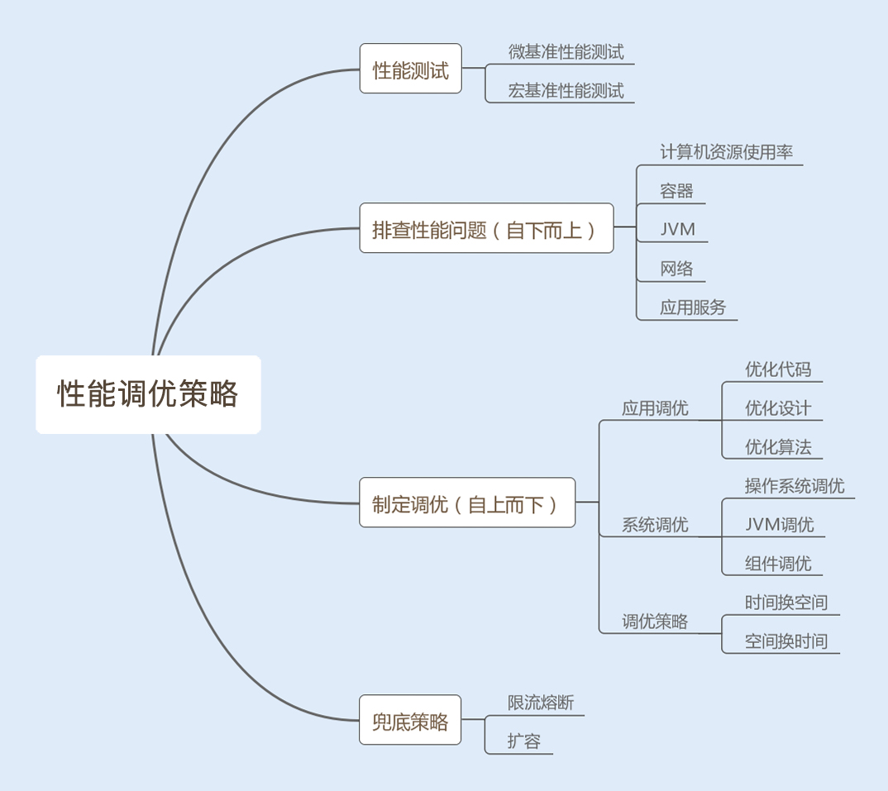
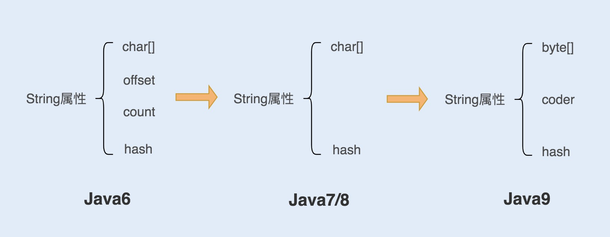
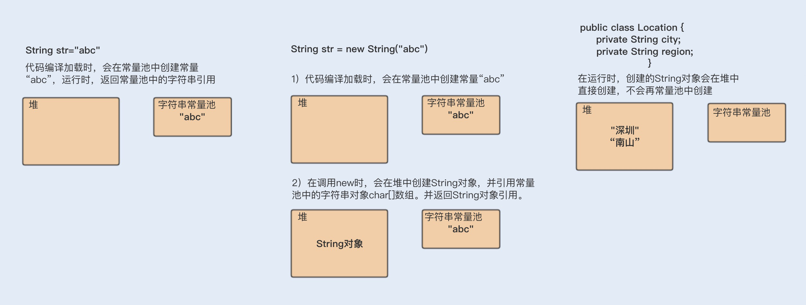
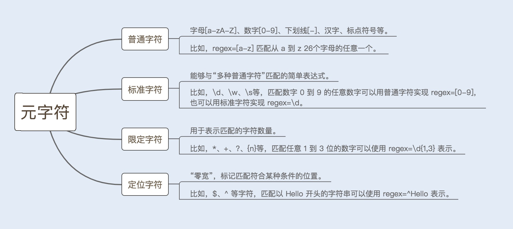
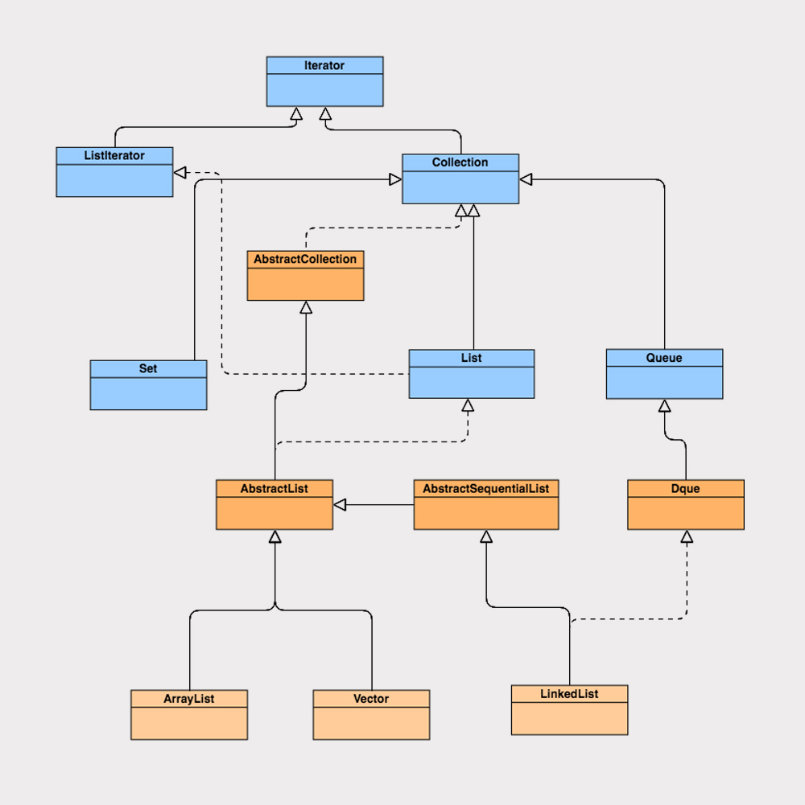
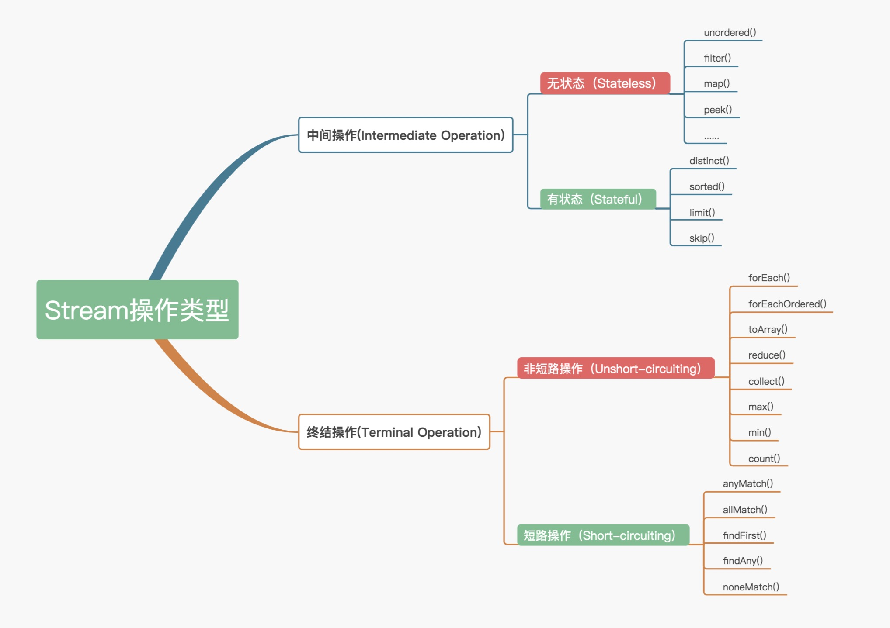
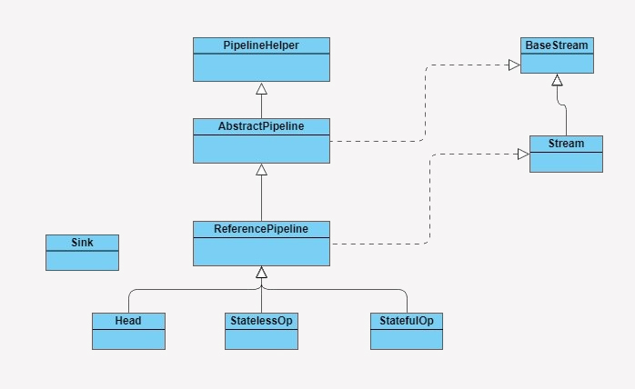
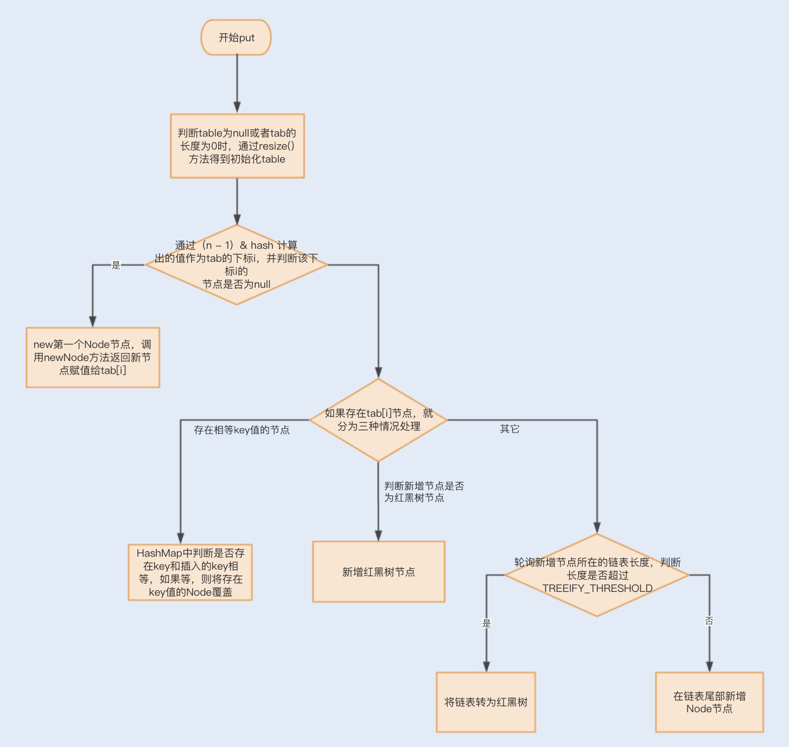
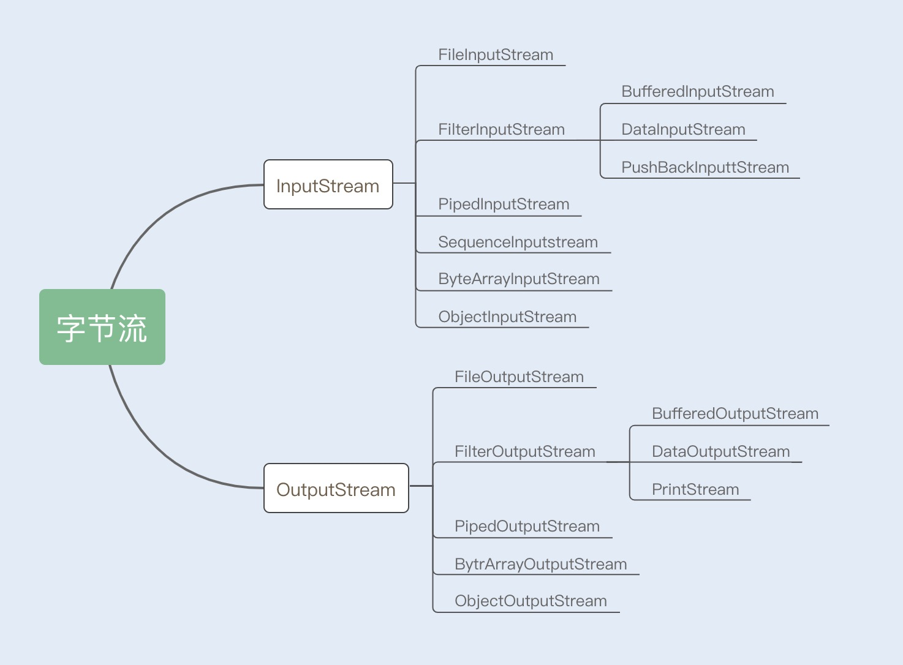
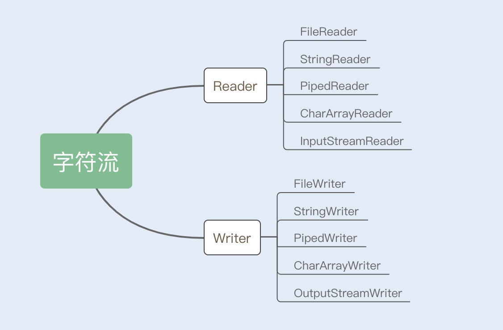

# 01.调优标准

## 名词

- ==原子性：==
  - db：要么都成功，要行都失败。
  - java：保证共享资源在一个线程写的时候不被另一个线程修改
- ==TPS：==每秒事务处理量
- ==RT：==响应时间
- ==IOPS：==每秒的输入输出量（或读写次数）----（Input/Output Per Second）
  - 单位时间内系统能处理 I/O 请求数量
- ==JNI：==即 Java Native Interface 的缩写，java 本地调用

> 什么时候介入调优？

- 项目前期不要介入调优，但要注意减少 IO 操作和降低竞争锁的使用。
- 开发结束后再调优。

> 哪些因素能体现系统性能？如此计算机资源是系统的瓶颈？

- **CPU：**递归，正则回溯，JVM 频繁 Full GC，大量线程上下文切换
- **内存：**内存被占满无法回收时，会溢出泄露
- **磁盘 I/O：**SSD硬盘也无法与内存比读写速度
- **网络带宽**
- **异常：**抛出异常要构建异常栈，对其捕获和处理。高并发下持续异常会影响性能
- **数据库：**会导致磁盘 I/O 瓶颈
- **锁竞争**
  - 多个线程读写同一资源时，为保证原子性会用到锁
  - 锁带来上下文切换，从而给系统性能带来开销
  - JDK1.6+对锁进行了优化，如：
    - 新增偏向锁、自旋锁、轻量级锁、锁粗化、锁消除等
    - 合理的使用锁、优化锁

> 响应时间

- 响应时间越短 性能越好
- 数据库响应时间：往往是整个请求链中最耗时的
- 服务端响应时间
- 网络响应时间
- 客户端响应时间：一般可以忽略不计，但大量的逻辑和页面元素会是系统瓶颈

> 吞吐量

- TPS 体现接口性能，越大性能越好
- 磁盘吞吐量/性能
  - 一种是 IOPS ，适用随机读写频繁的应用；如小文件存储，邮件服务器
  - 另一种是数据吞吐量
    - 指单位时间内可以可以成功传输的数据量
- 网络吞吐量
  - 不仅是带宽，还和CPU、网卡、防火墙、外部接口、I/O等紧密相关
  - 吞吐量大小主要由网卡处理能力、内部程序算法及带宽大小决定

> 计算机资源分配使用率

- 收 CPU、内存、磁盘 I/O、网络 I/O 来表示资源使用率。
- 这些参数好比木桶理论，其中一项分配不合理，对整个系统性能影响是毁灭性的。

> 总结

- 将以下指标作为性能调优标准
  - 响应时间、吞吐量、计算机分配使用率、负载承受能力


# 02.调优策略

## 性能测试攻略

- 提前发现性能瓶颈，是保障系统稳定的必要措施

### 1.微基准性能测试

- 测试精确到某个模块或方法
- 用不同实现方式对性能进行对比。如：同步/异步

### 2.宏基准性能测试

- 是一个综合测试，需考虑环境、场景和目标。
  - 环境：模拟线上真实环境
  - 场景：当测试某接口时，是否有其它**平行运行**的接口会造成干扰；有就要重视
  - 目标：通过吞吐量和响应时间来衡量是否达标
    - 达标了继续加大并发数，探底接口的 TPS
    - 循环测容易出性能问题的接口，观察 CPU、内存及 I/O 使用率变化
    - 性能测试易被干扰，要注意的问题：
      - 1.热身问题
        - 系统会运行的越来赶快，后面的访问比第一次访问快好几倍
        - 当虚拟机发现某些代码运行频繁会将其认定为**热点代码**（Hot Spot Code）
        - 虚拟机将热点代码编译成本地代码并**放到内存中**
      - 2.性能测试结果不稳定
        - 当每次跑的数据都一样，但测得性能结果有差异
        - 因为会受其它进程、网络波动及 JVM 垃圾回收不同影响
        - 可以通过多次测试求平均或统计曲线图，都在合理范围内便可通过测试
      - 3.多 JVM 情况下的影响
        - 当一台机器上只部署一个 tomcat（一个 JVM ）时性能会很好
        - 当部署多个 tomcat（即多 JVM）时就不一定了
        - 因为每个 JVM 都有系统资源使用权
        - 应避免线上环境一机多 JVM 
    - 合理分析结果，制定调优策略
      - 测试结果包括：平均/最大/最小吞吐量，响应时间，CPU/内存/IO/网络IO使用率，GC频率等
      - 通过自下而上分析找问题
        - 1.操作系统层面
          - CPU/内存/IO/网络的使用是否异常
          - 通过命令查找异常日志、分析找原因
        - 2.JVM 层面
          - 垃圾回收频率和内存分配发问是否异常
        - 3.服务层面：代码编写问题、数据库读写等待

## 应用层到 OS 层的策略

### 1.优化代码

- 代码导致内存举出（JVM内存用尽）->
- 系统内存耗尽导致 JVM 频繁回收，CPU 100% 下不来->
- for 循环 LinkedList 降低效率；改为 Iterator 循环

### 2.优化设计

- 单例模式减少频繁创建销毁对象

### 3.优化算法

### 4.时间换空间

- 将利用率高的数据存到常量里

### 5.空间换时间

- 分表分库（mysql 单表存千万以上读写会下降）

### 6.参数调优

- 当程序中需要创建大量对象时，可通过设置将对象直接放到老年代
- Web 容器线程池及 Linux 内核参数设置不当也会导致性能问题

## 兜底策略

- 限流：限制最大访问量。同时采取熔断措施，返回友好的不成功请求
- 智能横向扩容：访问量大时，自动新增服务
- 提前扩容：因横向扩容无法没跟瞬间高并发
  - docker 使用 k8s 作为容器管理系统，而 k8s 可实现智能化横向扩容和提前扩容 docker 服务

## 总结




# 03.字符串优化

- String 是占空间最大的对象，高效的使用可提高整体性能

## 如何实现



- java6及以前：可能导致内存泄露
- java7/8：解决了可能内存泄漏问题
- java9：char -> 16位，byte -> 8位
  - coder（值为0或1），0 代表单字节编码，1 代表 UTF-16

## 不可变性

- final 表示不可继承，String 里的 char[] 是 final + private 代表 String 不可更改

```java
String s = "abc";
s = "123";
// 不是不可变吗？上面代码不是可变的吗？
// abc 和 123 是两块内存
// s 只是引用了他们
// 当 s 引用其中一个时，是改变不了值的，只能再创建一个新的
```

## 不可变性的好处

- 保证 String 的安全
- 保证 hash 值不会频繁变更（确保唯一性），使得 HashMap 能实现相应的 key-value 缓存功能
- 可实现字符串常量池
  - 两种创建方式
    - 常量方式：String a = "abc"
      - JVM 先检索 “abc” 是否在常量池中，如果在则返回引用，否则在常量池中创建
      - 该方式可减少相同字符串**重复创建**，节约内存
    - 变量方式：string a = new String("abc")
      - 编译类文件时将“abc"放到常量结构
      - 类加载时”abc"在常量池中创建
      - new String 时调用构造方法，同时引用“abc"

## String 优化

### 1.超大字符串构建

```java
String s = "a" + "b" + "c";
// 首先生成 a 再生成 ab 再生成 abc；理论上是低效的
// 但运行时编译器给优化成了
String s = "abc";
```

```java
String s = "abc";
for (int i = 0; i < 10; i++) s = s + i;
// 编译器会优化成 StringBuilder 方式
// 但每次循环都会创建一个 StringBuilder，同样降低性能
// 所以字符串拼接时还要显式使用 StringBuilder
```

- 线程中拼字符串要使用 ==StringBuffer==（因为涉及到线程安全）
- StringBuffer还涉及到锁竞争，所以性能比 StringBuilder 差

### 2.用 ==String.intern== 节省内存

> 案例：twitter 每次发布消息都会产生一个地址信息，以当时用户量预估服务器需要 32G 内存来存储

```java
public class Location {
    private String city;
    private String region;
    private String countryCode;
    private double longitude;
    private double latitude;
} 
```

> 很多用户有重合信息，如：国家、省份、城市等

```java
// 将重合的信息单列出来
public class SharedLocation {
  private String city;
  private String region;
  private String countryCode;
}

public class Location {
  private SharedLocation sharedLocation;
  double longitude;
  double latitude;
}
```

> 存储大小减少到了 20G。但还是很大，用 ==String.intern==解决。具体做法是每次赋值用==intern==：若常量池中有，则返回对象引用，这样一开始的对象就会被回收。大小从 20G 降到了几百M

```java
SharedLocation sharedLocation = new SharedLocation();

sharedLocation.setCity(messageInfo.getCity().intern()); 
sharedLocation.setCountryCode(messageInfo.getRegion().intern());
sharedLocation.setRegion(messageInfo.getCountryCode().intern());

Location location = new Location();
location.set(sharedLocation);
location.set(messageInfo.getLongitude());
location.set(messageInfo.getLatitude());
```

> 为更好理解来个简单例子

```java
String a = new String("abc").intern();
String b = new String("abc").intern();
System.out.println(a == b); // 此时 a 和 b 是相等的
```



#### intern 原理

- 字符串常量：默认放在常量池中
- 变量
  - 对象创建在堆中
  - 同时字符串创建在常量池中
  - String 中的 char[] 引用常量池中的 char[]
  - 当调 **intern()**会查看常量池是否有同值字符串
    - 如果**没有**
      - JDK1.6 复制堆中字符串到常量池并返回引用，并且回收堆中字符串
      - JDK1.7+ 常量池合并到了堆中，所以不会再复制；但会把首次遇到的串添加到常量池
    - 如果**有**就返回引用
- 类似 HashTable 的实现方式，存储==数据过大会增加常量池负担==

### 3.字符串 Split 方法

- 使用正则实现的
- 因此性能不稳定，使用不当会引起回塑，导致 CPU 过高
- 可用 indexOf 替代 Split
  - org.springframework.util.==StringUtils.delimitedListToStringArray==是基于indexOf实现的


# 04.正则==（未完）==

## what 正则？

- 用些特定**元字符（在正则中具有特殊意义的专用字符）**来检索、匹配及替换合规的字符串



## 正则引擎

- 语法分析树：由正则写出的公式和程序对公式的分析所建立

- 状态机（或状态自动机）：**分析树**结合引擎生成的程序，用于字符匹配

- 引擎：一套用于建立**状态机**的核心算法

  - DFA 自动机：确定有限状态机

  - NFA 自动机：非确定有限状态机

  - 构造 DFA 的代价远大于 构造 NFA，但 DFA 的执行效率高于 NFA

    > 设：字符串长度 = n，NFA 状态数 = s；
    >
    > 则：DFA 匹配时间复杂度=O(n)，NFA匹配时间复杂度=O(ns)

  - 编程语言里用的都是基于 NFA


# 05.ArrayList 还是 LinkedList

- ArrayList 基于数组实现的，LinkedList 基于链表实现的
- LinkedList 增、删效率高，ArrayList 遍历效率高

## List 接口



### ArrayList 的实现

- 实现类

  ```java
  public class ArrayList<E> extends AbstractList<E>
          implements List<E>, RandomAccess, Cloneable, java.io.Serializable
  ```

  - Cloneable 接口：克隆
  - Serializable 接口：序列化
  - RandomAccess 接口：空接口。表示实现该接口的List都能**快速随机访问**

- 属性

  ```java
  //默认初始化容量
  private static final int DEFAULT_CAPACITY = 10;
  //对象数组
  transient Object[] elementData; 
  //数组长度
  private int size;
  ```

  - transient：表示被修饰的属性**不能被序列化**

    > ==问1：被 transient 修饰了，为什么 ArrayList 还能序列化？==
    >
    > - elementData 不是所有空间都存数据，如果序列化将浪费资源
    > - transient 为防止外部序列化
    > - ArrayList 内部提供了 writeObject 和 readObject 来完成序列/反序列化，从而省空间和资源

- 构造函数（共 3 个）

  ```java
  // 第一个
  public ArrayList(int initialCapacity) {
      //初始化容量不为零时，将根据初始化值创建数组大小
      if (initialCapacity > 0) {
          this.elementData = new Object[initialCapacity];
      } else if (initialCapacity == 0) {//初始化容量为零时，使用默认的空数组
          this.elementData = EMPTY_ELEMENTDATA;
      } else {
          throw new IllegalArgumentException("Illegal Capacity: "+
                                             initialCapacity);
      }
  }
  // 第二个
  public ArrayList() {
      //初始化默认为空数组
      this.elementData = DEFAULTCAPACITY_EMPTY_ELEMENTDATA;
  }
  // 第三个是传入一个集合
  ```

  - 当动态扩容时会导致一次内存复制，==构造时指定大小，减少扩容次数，从而提高性能==

- add 元素

  ```java
  // 添加到末尾
  public boolean add(E e) {
      ensureCapacityInternal(size + 1);  // 确认容量大小
      elementData[size++] = e;
      return true;
  }
  // 添加到任意位置
  public void add(int index, E element) {
      rangeCheckForAdd(index);
      ensureCapacityInternal(size + 1);  // 确认容量大小
      System.arraycopy(elementData, index, elementData, index + 1,
                       size - index);
      elementData[index] = element;
      size++;
  }
  ```

  - 确认容量大小，如果不够，就扩容1.5倍，之后将内容复制到新分配的地址

  ```java
  private void ensureExplicitCapacity(int minCapacity) {
      modCount++;
  
      // overflow-conscious code
      if (minCapacity - elementData.length > 0)
          grow(minCapacity);
  }
  private static final int MAX_ARRAY_SIZE = Integer.MAX_VALUE - 8;
  
  private void grow(int minCapacity) {
      // overflow-conscious code
      int oldCapacity = elementData.length;
      int newCapacity = oldCapacity + (oldCapacity >> 1);
      if (newCapacity - minCapacity < 0)
          newCapacity = minCapacity;
      if (newCapacity - MAX_ARRAY_SIZE > 0)
          newCapacity = hugeCapacity(minCapacity);
      // minCapacity is usually close to size, so this is a win:
      elementData = Arrays.copyOf(elementData, newCapacity);
  }
  ```

  - 添加任意位置会导致该位置后的元素==重排==，末尾添加则不会

    > ==问2：ArrayList 新增/删除影响效率，那么在大量元素下效率一个会慢？==
    >
    > 答：初始化指定其大小，添加时添加到末尾，性能反而会比其它 List 要好。

- delete 元素
  
  - 每次删除后都要重排，越靠前开销越大
- 遍历元素：遍历很快

### LinkedList 实现

- 基于双向链表实现

- 内部一个 Node 结构，包含：

  - 元素内容 item
  - 前指针 prev
  - 后指针 next

- 由 Node 结构连接而成的双向链表

- 实现类

  - 没实现 RandomAccess ，不能随机访问

- 属性

  ```java
  transient int size = 0;
  transient Node<E> first;
  transient Node<E> last;
  ```

  - 同样利用 readObject 和 writeObject 实现自身序列/反序列化

- add 元素：效率高，优势明显

- delete 元素：要删除的元素在中间，效率最低

- 遍历元素：与删除类似。for 遍历时，每次都循环半个 list，==用 iterator 方式迭代效率高些==

## ArrayList 和 LinkedList 性能对比

- add 对比**（花费时间）**
  - 从集合头部位置新增元素：ArrayList > LinkedList
  - 从集合中间位置新增元素：ArrayList < LinkedList
  - 从集合尾部位置新增元素：ArrayList < LinkedList

- 遍历对比**（花费时间）**
  - for(;;) 循环：ArrayList < LinkedList
  - 迭代器迭代循环：ArrayList ≈ LinkedList


# ==调优工具 -> 参照 centos.md==

# 06.Stream

> Hash 值：通过一定的哈希算法（如 md5，sha-1等），将一段长数据映射为矮小的数据。**特点是唯一**

## 如何优化遍历

### 1.操作分类

- 中间操作（Intermediate operations）：只记录（即只返回流），不进行计算操作
  - 无状态（Stateless）操作：元素的处理不受之前的影响
  - 有状态（Stateful）操作：只有拿到所有元素后才能继续下去
- 终结操作（Terminal operations）：进行计算操作
  - 短路（Short-circuiting）操作：遇到符合条件的就终止并返回结果
  - 非短路（Unshort-circuiting）操作：处理完所有才返回结果



### 2.源码实现



- BaseStream 和 Stream 为最顶端的接口
- ReferencePipeline
  - 一个结构类，实现了 BaseStream 和 Stream。
  - 将整个 Stream 操作组装成一个调用链，链上的上下关系就是 Sink
- Sink：定义每个 Stream 间的关系协议
  - 包含：begin、end、cancellationRequested、accpt 四个方法

### 3.操作叠加==（略过未读）==

- Stream 的各个操作由**处理管道**组成。JDK中每次中断操作会以使用阶段（Stage）命名
- 管道结构由 ReferencePipeline 实现

- ReferencePipeline 定义的三个内部类：
  - Head：定义数据源操作。xx.stream() 时会加载 head
  - StatelessOp：==无状态==中间操作
  - StatefulOp ：==有状态==中间操作
- AbstractPipeline
  - 生成一个中间操作 Stage 链
  - 调用最终操作时，生成最终 Stage

## 合理使用 Stream

- 循环少**或**单核 CPU情况下，常规迭代性能高
- 大数据循环**并且**多核 CPU 情况下，Stream 并行性能高


# 07.HashMap

- JDK1.7 数组 + 链表；
- ==JKD1.8 数组 + 链表 + 红黑树==
  - 红黑树用来提高链表的查询效率
  - **链表长度超过8后，效率比红黑树差**
  - 当 HashMap 长度超过8后，就会将链表转成红黑树

> 什么是哈希(hash)？
>
> 根据关键码值（Key value）直接进行访问的数据结构。通过把关键码值映射到表中一个位置来访问记录，以加快查找的速度。这个映射函数叫做==哈希函数==，存放记录的数组就叫做==哈希表==。

> ==什么时hash冲突==？https://www.bilibili.com/video/BV1jt411n7T5?from=search&seid=10550819835479256053 64:10
>
> 假如有五个自然数（==5,1,9,6,7==），想判断某个数(x)是否在这五个数中（不可以用HashMap），如何实现？
>
> ```java
> Object ary[] = new Object[5];
> // 通过 % 5取模来实现
> ary[5%5] = 5;
> ary[1%5] = 1;
> ary[9%5] = 9;
> ary[6%5] = 6; // 和上面的1%5一样都等于1，这就是传说中的 "hash碰撞/hash冲突"。解决办法为: ary[1] = asList(1, 6)
> ary[7%5] = 7;
> ```

## 重要属性

```java
// 由 Node 数组构成
transient Node<K,V>[] table;
// 边界值
int threshold;
// 加载因子
final float loadFactor;
```

- LoadFactor：用来设置哈希表的空间大小，默认是0.75
- Threshold：默认 12。
  - 如果太小 -> Node 数组过界 -> HashMap 重新 resize -> 数组复制到另一块内存 -> 影响效率

## 添加元素优化

### Object.hashCode()

```java
// 是本地方法
public native int hashCode();
```

- java6、7 返回的是随机数
- java8+ 默认通过和当前线程有关的一个随机数 + 三个确定值

### put() 里的hash计算

```java
public V put(K key, V value) {
    // put 前会先计算 hash 值
    return putVal(hash(key), key, value, false, true);
}
static final int hash(Object key) {
    // int 是32位二进制
    int h;
    // >>> 16：无符号右移16位，前16位补0
    // ^：位异或，相同为0不同为1
    return (key == null) ? 0 : (h = key.hashCode()) ^ (h >>> 16);
}
final V putVal(int hash, K key, V value, boolean onlyIfAbsent, boolean evict) {
    Node<K,V>[] tab; Node<K,V> p; int n, i;
    if ((tab = table) == null || (n = tab.length) == 0) n = (tab = resize()).length;
    // (n - 1) & hash 决定 node 在table数组的存储位置
    // n：代表 hash 表长度，都是2的n次方
    // 以保证 (n - 1) & hash 在 table 的范围内
    if ((p = tab[i = (n - 1) & hash]) == null)
        tab[i] = newNode(hash, key, value, null);
```

### put 流程



```java
final V putVal(int hash, K key, V value, boolean onlyIfAbsent,
               boolean evict) {
    Node<K,V>[] tab; Node<K,V> p; int n, i;
    if ((tab = table) == null || (n = tab.length) == 0)
        //1、判断当table为null或者tab的长度为0时，
        //即table尚未初始化，此时通过resize()方法得到初始化的table
        n = (tab = resize()).length;
    if ((p = tab[i = (n - 1) & hash]) == null)
        //1.1、此处通过 (n - 1) & hash 计算出的值作为tab的下标i，
        //并另p表示tab[i]，也就是该链表第一个节点的位置。并判断p是否为null
        tab[i] = newNode(hash, key, value, null);
        //1.1.1、当p为null时，表明tab[i]上没有任何元素，
        //那么接下来就new第一个Node节点，调用newNode方法返回新节点赋值给tab[i]
    else {
        //2.1下面进入p不为null的情况，有三种情况：
        //情况1：p为链表节点；
        //情况2：p为红黑树节点；
        //情况3：p是链表节点但长度为临界长度，要变成红黑树
        //    - TREEIFY_THRESHOLD，再插入任何元素就要变成红黑树了。
        Node<K,V> e; K k;
        if (p.hash == hash &&
            ((k = p.key) == key || (key != null && key.equals(k))))
            //2.1.1HashMap中判断key是否相同就是判断是key的hashCode是否相同
            //  - 若两个对象相等（equals），则他俩的 hashCode 一定相等
            //    - 前提是这俩对象的类没有重写 equals 方法
            //并且符合equals方法。这里判断了p.key是否和插入的key相等
            //如果相等，则将p的引用赋给e
            e = p;
        else if (p instanceof TreeNode)
            //2.1.2 p是红黑树节点，
            //那么肯定插入后仍然是红黑树节点，所以我们直接强制转型p后
            //调用TreeNode.putTreeVal方法，返回的引用赋给e
            e = ((TreeNode<K,V>)p).putTreeVal(this, tab, hash, key, value);
        else {
            //2.1.3 p为链表节点的情形
            //两类情况：插入后还是链表/插入后转红黑树。
            //上行转型代码也说明了TreeNode是Node的一个子类
            for (int binCount = 0; ; ++binCount) {
                //我们需要一个计数器来计算当前链表的元素个数，并遍历链表，
                //binCount就是这个计数器

                if ((e = p.next) == null) {
                    p.next = newNode(hash, key, value, null);
                    if (binCount >= TREEIFY_THRESHOLD - 1) 
                        //插入成功后，要判断是否需要转换为红黑树，
                        //因为插入后链表长度加1，而binCount并不包含新节点，
                        //所以判断时要将临界阈值减1
                        treeifyBin(tab, hash);
                        //当新长度满足转换条件时，调用treeifyBin方法，
                        //将该链表转换为红黑树
                    break;
                }
                if (e.hash == hash &&
                    ((k = e.key) == key || (key != null && key.equals(k))))
                    break;
                p = e;
            }
        }
        if (e != null) { // existing mapping for key
            V oldValue = e.value;
            if (!onlyIfAbsent || oldValue == null)
                e.value = value;
            afterNodeAccess(e);
            return oldValue;
        }
    }
    ++modCount;
    if (++size > threshold)
        resize();
    afterNodeInsertion(evict);
    return null;
}
```

## 获取元素优化

- 只有数组没有链表时，查询性能最好

- 当哈希冲突，就会产生链表

- **重写类的 hashCode() 方法，降低哈希冲突从而减少链表产生**

  - 重写 equals 必须重写 hashCode
  - 不能包含 equals 方法中没有的字段

  ```java
  @Override
  public int hashCode() {
      int result = 17; // 非 0 数值
      // 31是个神奇数字，任何数 n*31 都会被 jvm 优化成 (n << 5) - n
      result = 31 * result + (字段1 == null ? 0 : 字段1.hashCode());
      result = 31 * result + (字段n == null ? 0 : 字段n.hashCode());
      return result;
  }
  ```


# 08. I/O

- 字节流操作：InputStream / OutputStream

  

- 字符流操作：Reader / Writer

  

> 问：存储最小单元是==字节==，那为什么要分字节流操作和字符流操作呢？
>
> 字符到字节需转码，过程耗时，若不知道编码类型还容易乱码，所以提供了操作字符的接口

## 传统 I/O 性能问题

- 磁盘IO：磁盘 -> 内存 -> 磁盘。网络IO：网络 -> 内存 -> 网络。**都存在严重的性能问题**

### 1.多次内存复制

- Input 操作流程
  - jvm 发出 read 系统调用，read 向内核发起读请求
  - 内核向硬件发送读指令，并等待就绪
  - 内核把将要读取的数据复制到内核缓冲区
  - 内核将数据复制到用户缓冲区，read 调用返回
- 外设 -> 内核空间 -> 用户空间，发生两次复制。导致不必要的拷贝和上下文切换，从而降低 I/O 性能

### 2.阻塞

- InputStream.read 是 while 循环；一直等待，直到数据就绪才返回，否则线程处于阻塞状态
- 当大量请求时，创建大量监听线程
- 当多个线程阻塞等待，它们将不断抢夺 CPU 资源，导致大量 CPU 上下文切换，增加开销

## 优化 I/O 操作（NIO）

### 1.使用缓冲区优化读写流操作

- 传统 I/O 基于字节，NIO 基于块（Block）（面向Buffer）

- NIO 中最重要的两个组件
  - Buffer：一块连续内存，是 NIO 读写数据的中转地
    - 可将文件一次性读到内存（传统方式边读边处理）
  - Channel：缓冲数据的源头和目的地

### 2.使用 DirectBuffer 减少内存复制

- DirectBuffer 可以直接访问物理内存，减少 GC 压力
  - 普通 buffer 分配的是 jvm 堆内存
  - DirectBuffer 通过  unsafe.allocateMemory(size)  直接分配物理内存

- JDK 中 IOUtil.write 源码：

```java
if (src instanceof DirectBuffer)
    return writeFromNativeBuffer(fd, src, position, nd);

// Substitute a native buffer
int pos = src.position();
int lim = src.limit();
assert (pos <= lim);
int rem = (pos <= lim ? lim - pos : 0); 
ByteBuffer bb = Util.getTemporaryDirectBuffer(rem);
try {
    bb.put(src);
    bb.flip();
// ...............
```

- 因为是物理内存，所以创建和销毁代价很高
- 不由 GC 回收，而是通过 Java Reference 机制释放

### 3. 避免阻塞优化 I/O 操作

- 通道（channel）
  - 完成内核与磁盘间的 I/O 操作
  - 双向的，读/写可同时操作
- 多路复用器（selector）
  - 是 NIO 编程基础。检索多个 channel 处理可读还是可写状态。
  - 基于事件。在 selector 上注册 accept/read 事件
  - 一个线程使用一个 selector，轮询监听多个 channel 上的事件
  - 使用 epoll 机制，相比传统机制，没有最大 1024 个连接句柄的限制，理论上能轮询千、万个客户端


# 09. 网络之序列化==（未完）==

- 微服务间传输需要序列化，而序列化后数据体积变大，导致网络吞吐量下降

## java 序列化

- 将对象转换成二进制形式，即字节数组。只能对实现了 Serializable 接口序列化
- 不会序列化对象的 **transient** 的变量，及**静态**变量
- 实现 Serializable 接口会生成一个 serialVersionUID 版本号，用来验证序列化对象是否加载了反序列化的类
- **writeObject：**序列化重写接口
- **readObject：**反序列化重写接口
- **writeReplace：**对序列化之前的对象进行处理
- **readResolve：**对序列化之后的对象进行处理
- **ObjectOutPutStream：**输出流序列化
- **ObjectInputStream：**输入流序列化
- 缺陷：无法跨语言，易被攻击


# 11. NIO==（未完）==

```xml
# service.xml

# Connector(tomcat连接器) 的3种模式
# bio：性能最差，没任何优化
<Connector protocol="HTTP/1.1">...</Connector>
# nio：更好的并发和性能
<Connector protocol="org.apache.coyote.http11.Http11NioProtocol"></Connector>
# apr：以 JNI 形式处理。从OS级别处理异步IO，大大提高性能，是高并发产选模式
#      或 protocol="AJP/1.3"
<Connector protocol="org.apache.coyote.http11.Http11AprProtocol"></Connector>
```


# 12. 锁（上）