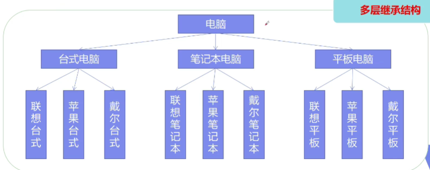

# 前言

## 23 种设计模式

- 创建型模式
  - 单例，工厂，抽象工厂，建造者，原型
- 结构型模式
  - 适配器，桥接，装饰，组合，外观，享元，代理
- 行为型模式
  - 模板方法，命令，迭代器，观察者，中介者，备忘录，解释器，状态，策略，职责链，访问者

## 面向对象七大原则

**开闭原则：**对修改关闭，对扩展开放。翻译成人话：就是**不用改源码就能实现功能扩展**

**里氏替换原则：**继承必须确保父类所拥有的性质在子类中仍然成立。翻译：**不要把父类的功能给变了**

**依赖倒置原则：**要面向接口编程，不要面向实现编程。

**单一职责原则：**控制类的粒度大小，将对象解耦，提高其内聚性。翻译：**一个方法只干好一件事，不要承担太多功能**

**接口隔离原则：**要为各个类建立它们需要的专用接口

**迪米特法则：**只与你的直接朋友交谈，不跟“陌生人”说话

**合成复用原则：**优先使用组合或聚集等关联关系来实现，其次才考虑使用继承关系来实现


# 创建型模式

## 1. 单例模式（Singleton）

场景：保证内存中只有一个实例存在，比如有各种 Mgr / Factory 来管理单例

### 写法1

饿汉式写法，**缺点：不论使用与否，都会加载**

```java
public class Demo1 {
    // 1. 将构造函数设置成私有，这样就能保证外部无法 new
    private Demo1() {}
    // 2. 一个静态实例，一开始就 new
    private static final Demo1 instance = new Demo1();
    // 3. 一个获取实例的公有方法
    public static Demo1 getInstance() { return instance; }
}
```

### 写法2

懒汉式写法（即懒加载）。**缺点：多线程访问时会出现多个实例**（当然在 getInstance 上锁一下就解决了，但会带来效率问题）

```java
public class Demo2 {
    private Demo2() {}
    private static Demo2 instance;
    public Demo2 getInstance() {
        // 用的时候调 getInstance() 方法，如果实例为空则new
        if (instance == null) instance = new Demo2();
        return instance;
    }
}
```

### 写法3

解决写法2的问题

```java
public class Demo3 {
    private Demo3() {}
    // 要加上 volatile
    private static volatile Demo3 instance;
    public Demo3 getInstance() {
        if (instance == null) {
            synchronized (Demo3.class) {
                // 双判断，如果锁里不判断实例是否为空，那么这个锁相当于没加
                if (instance == null) instance = new Demo3();
            }
        }
        return instance;
    }
}
```

### 写法4

完美的写法之一：**静态内部类方式**。==加载外部类时不会加载内部类，这样可实现懒加载==

```java
public class Demo4 {
    private Demo4() {}
    private static class Demo4Holder { private static final Demo4 instance = new Demo4();}
    public static Demo4 getInstance() { return Demo4Holder.instance; }
}
```

### 写法5

==enum 本身也是一个 class==

不仅解决线程同步，还防止反序列化和反射对实例进行破坏（因为枚举没有构造方法）

```java
public enum Demo5 {
    instance; // 实例

    private String s = "666"; // 成员
    private void m1() { System.out.println("m1"); } // 成员方法

    public static void main(String[] args) {
        // 通过 instance 访问成员变量和成员方法
        System.out.println(Demo5.instance.s);
        instance.m1();
    }
}
```

> 枚举为什么会防止反射破坏？

```java
// java.lang.reflect.Constructor
@CallerSensitive
public T newInstance(Object ... initargs)
    throws InstantiationException, IllegalAccessException,IllegalArgumentException, InvocationTargetException {
    if (!override) {
        if (!Reflection.quickCheckMemberAccess(clazz, modifiers)) {
            Class<?> caller = Reflection.getCallerClass();
            checkAccess(caller, clazz, null, modifiers);
        }
    }
    // 原因在这里
    if ((clazz.getModifiers() & Modifier.ENUM) != 0)
        throw new IllegalArgumentException("Cannot reflectively create enum objects");
    
    ConstructorAccessor ca = constructorAccessor;   // read volatile
    if (ca == null) {
        ca = acquireConstructorAccessor();
    }
    @SuppressWarnings("unchecked")
    T inst = (T) ca.newInstance(initargs);
    return inst;
}
```

> 枚举反编译后是带有 (String.class, int.class)  两个参数的构造函数


## 2. 策略模式（Strategy）

封装了做一件事情的不同实现方法

如果一个排序类，里面的 sort 方法只能给 int 型数组排序，如果想给 double 等多种类型排序，那么还要再写一个方法

```java
public class sorter {
    public static void sort(int[] arr) {...}
}
```

**策略模式就是把 “策略” 作为一个方法（或给定接口的实现）传到方法里**

```java
// 要排序的类型
@Data
@AllArgsConstructor
private static class A { private Integer v; }
// 策略接口，类型为泛型
private interface Sorted<T> { int sort(List<T> arr); }
// 排序方法，指定类型为 A
public static int method(List<A> list, Sorted<A> cp) { return cp.sort(list); }

public static void main(String[] args) {
    // 一组要排序的类型 A 数据
    List<A> list = Arrays.asList(new A(1), new A(2), new A(3));
	// 把方法以 lambda 方式传进去，或者实现了策略接口的实例
    System.out.println(method(list, x -> x.get(0).v)); // 1
    System.out.println(method(list, x -> x.get(1).v)); // 2
    System.out.println(method(list, x -> x.get(2).v)); // 3
}
```

## 3. 工厂模式（Factory）

```java
// 接口
interface IA { void method();}
// 实现类1
class A1 implements IA {
    @Override
    public void method() {
        System.out.println("A1");
    }
}
// 实现类2
class A2 implements IA {
    @Override
    public void method() {
        System.out.println("A2");
    }
}
```

- 作用：实现了创建者和调用者分离

- 核心本质：实例化对象不用 new，用工厂方法代替

- 详细分类：

  - 简单工厂模式：用来生产同一等级结构中的任意产品==（每次扩展都要修改工厂，所以没满足开闭原则）==

    ```java
    // 工厂
    class FactoryA {
        public static IA getInstance(int i) {
            if (i == 1) return new A1();
            if (i == 2) return new A2();
            return null;
        }
    }
    
    public class Demo1 {
        public static void main(String[] args) {
            // 使用工厂创建
            FactoryA.getInstance(1).method();
            FactoryA.getInstance(2).method();
        }
    }
    ```

  - 工厂方法模式：用来生产同一等级结构中的固定产品==（每个扩展都对应各自的工厂）==

    ```java
    // 工厂
    class FactoryA1 {
        public static IA getInstance() { return new A1(); }
    }
    class FactoryA2 {
        public static IA getInstance() { return new A2(); }
    }
    ```

  - 抽象工厂模式：围绕一个超级工厂创建其它工厂，该超级工厂又称为其它工厂的工厂

    ```java
    // 手机接口
    interface IPhone { void call();}
    // 路游接口
    interface IRouter { void wifi(); }
    // 华为手机
    static class HuaweiPhone implements IPhone {
        @Override
        public void call() { System.out.println("华为手机"); }
    }
    // 华为路游
    static class HuaweiRouter implements IRouter {
        @Override
        public void wifi() { System.out.println("华为路游"); }
    }
    // 小米手机
    static class XiaomiPhone implements IPhone {
        @Override
        public void call() { System.out.println("小米手机"); }
    }
    // 小米路游
    static class XiaomiRouter implements IRouter {
        @Override
        public void wifi() { System.out.println("小米路游"); }
    }
    ```

    ```java
    // 抽象工厂
    interface IFactory {
        // 获取电话工厂
        IPhone phoneFactory();
        // 获取路游工厂
        IRouter routerFactory();
    }
    
    // 华为工厂
    static class HuaweiFactory implements IFactory {
        @Override
        public IPhone phoneFactory() { return new HuaweiPhone(); }
    
        @Override
        public IRouter routerFactory() { return new HuaweiRouter(); }
    }
    // 小米工厂
    static class XiaomiFactory implements IFactory {
        @Override
        public IPhone phoneFactory() { return new XiaomiPhone(); }
    
        @Override
        public IRouter routerFactory() { return new XiaomiRouter(); }
    }
    ```

    ```java
    public static void main(String[] args) {
        IFactory huawei = new HuaweiFactory();
        huawei.phoneFactory().call();
        huawei.routerFactory().wifi();
    
        IFactory xiaomi = new XiaomiFactory();
        xiaomi.phoneFactory().call();
        xiaomi.routerFactory().wifi();
    }
    ```

- 需要满足OOP七大原则中的：开闭原则，依赖倒置原则，迪米特法则

  

## 4. 建造者模式（builder）

==工厂==模式==负责构建==对象，==建造者==模式==负责==把复杂对象给==组装==起来。提供了创建对象的最佳模式。

定义：多个简单对象构建一个复杂对象。将复杂的构建与表示分离，同样的构建过程可以创建不同的表示

用户只需要给出指定对象的类型和内容，建造者模式负责按顺序创建复杂对象（把构建过程和细节隐藏）

缺点：

- 该模式创建的对象一般具有较多的共同点，其组成部分相似；如果创建对象差异较大，则不适合该模式。因此，使用范围受限
- 如果对象内部变化复杂，可能导致需要定义很多具体建造者类来实现这种变化，导致系统变的很庞大

### 4.1 案例一

```java
@Data
@Accessors(chain = true)
@ToString
// 产品类
public class Product {
    private Integer id;
    private String name;
    private double price;
}
```

#### 4.1.1 抽象建造者

```java
// 定义方法和接口
public abstract class Builder {
    abstract Builder step1(); // 步骤 1
    abstract Builder step2(); // 步骤 2
    abstract Builder step3(); // 步骤 3
    // 完成上面3步后得到一个完整的产品
    abstract Product getProduct();
}
```

#### 4.1.2 具体的建造者

```java
// 完成所有步骤后返回产品
public class Worker extends Builder {
    private Product product = new Product();
    @Override
    Builder step1() {
        product.setId(1);
        System.out.println("步骤一：setId");
        return this;
    }

    @Override
    Builder step2() {
        product.setName("商品名");
        System.out.println("步骤二：setName");
        return this;
    }

    @Override
    Builder step3() {
        product.setPrice(1000);
        System.out.println("步骤三：setPrice");
        return this;
    }

    @Override
    Product getProduct() { return product; }
}
```

#### 4.1.3 指挥者

```java
// 核心，负责指挥建造一个复杂对象
public class Director {
    public Product build(Builder builder) {
        return builder.step1().step2().step3().getProduct();
    }
}
```

```java
public static void main(String[] args) {
    // 指挥者
    Director director = new Director();
    // 指挥具体的构建者来构建
    Product product = director.build(new Worker());
    System.out.println(product.toString());
}
```

> 结果：
>
> 步骤一：setId
> 步骤二：setName
> 步骤三：setPrice
> Product(id=1, name=商品名, price=1000.0)

## 5. 原型模式

以某个类为原型，把它拷贝出一份。一般用于==原型模式 + 工厂模式 => 有的大对象new出来恐怕会很耗资源，这时换成克隆就会节省很大开销==

### 5.1 潜克隆

```java
@Data
@AllArgsConstructor
// 当一个类只有实现它，并且@Override了clone方法，其实例才能调.clone()克隆实例，否则报错
// 是一个空接口，实际上只是做了个克隆标记
static class Video implements Cloneable {
    private String name;
    private Date createTime;

    @Override
    protected Object clone() throws CloneNotSupportedException {
        return super.clone();
    }
}

public static void main(String[] args) throws CloneNotSupportedException {
    Date date = new Date();
    // 原型对象
    Video v1 = new Video("23种设计模式视频教程", date);
    // 根据原型对象克隆出一个，也把对象里成员变量的引用也给拷过来了
    Video v2 = (Video) v1.clone();
    
    System.out.println(v1.toString()); // 2020
    System.out.println(v2.toString()); // 2020

    date.setYear(121); // 日期变了，此时v1/v2的值也都变了，这样不好，所以引出了深克隆

    System.out.println(v1.toString()); // 2021
    System.out.println(v2.toString()); // 2021
}
```

### 5.2 深克隆

可以通过序列化/反序列化，也可以改造下clone方法

```java
@Override // 将上面的clone方法改成这样，就实现了深克隆
protected Object clone() throws CloneNotSupportedException {
    Video v = (Video) super.clone();
    v.createTime = (Date) this.createTime.clone();
    return v;
}
// 结果：2020 2020 2021 2020
// 此时只有v1的date变了，因为new的时候v1说是date，而v2的date是clone来的
```

# 结构型模式

作用：从程序结构上松耦合，从而可以扩大整体的类结构，用来解决更大的问题

## 1. 适配器模式（Adapter）

1）将一个类的接口转换成用户希望的另一个接口。==适配器模式使得原本接口不兼容而不能一起工作的类可以在一起工作==

2）适配器模式角色分析

1. 目标接口：用户所期待（想要）的接口（可以是具体或抽象类或接口）

2. 需要适配的类：或叫适配者

3. 适配器：通过包装一个类，把原接口转换成目标接口

3）对象适配器优点（==比 [类适配器] 优先作用==）

- 一个对象适配器可以把多个不同的适配者适配到同一个目标
- 可以适配一个适配者的子类，由于适配器和适配者之间是关联关系，根据 “里氏代换原则”（参考附录），适配者子类也可通过适配器进行适配

4）类适配器缺点

- 对于 Java、C# 等不支持多重类继承的语言，一次最多只能适配一个适配者，不能同时适配多个适配者
- 像 Java、C# 等语言，类适配模式中的目标抽象类只能是接口，不能是类，其使用有一定局限性

5）适用场景

- 系统需要使用一些现有的类，而这些类的接口（如方法名）不符合系统需要，甚至没有这些类的代码。
- 想创建一个可以重复使用的类，用于与一些彼此之间没有太大关联的一些类，包括一些可能在将来引进的类一起工作。

下面例子：一个轻薄笔记本没有网线接口，这时需要一个扩展坞转换，再通过USB输出给笔记本（需要写3个类）

```java
// 接口转换器的抽象实现
public interface NetToUsb {
    // 处理请求，network => usb
    void netToUsb();
}
```

```java
// 被适配的类：网线
public class NetworkLine {
    public void connection() {
        System.out.println("连接网线上网");
    }
}
```

### 1.1 适配器一

```java
// 适配方式
// 1.继承（类适配器，java是单继承）
// 2.组合（对象适配器，更高级且常用）

// 扩展坞，用于连接网线和笔记本usb
public class Adapter extends NetworkLine implements NetToUsb {
    @Override
    public void netToUsb() {
        super.connection(); // 通过继承网线类，这里就可以上网了
    }
}
```

```java
// 笔记本类：想上网但插不上网线
public class Computer {
    // 上网的实现，找一个扩展坞来转换一下
    public void network(NetToUsb adp) { // 传一个转接口
        adp.netToUsb();
    }

    public static void main(String[] args) {
        Computer computer = new Computer();   // 笔记本
        NetworkLine line = new NetworkLine(); // 网线，但是这里用不到
        Adapter adapter = new Adapter();      // 扩展坞

        computer.network(adapter);  // 输出结果：连接网线上网
    }
}
```

### 1.2 适配器二

```java
// 热插扒适配器
public class Adapter2 implements NetToUsb {
    private NetworkLine line;

    public Adapter2(NetworkLine line) {
        this.line = line;
    }
    @Override
    public void netToUsb() {
        line.connection();
    }
}
```

```java
public static void main(String[] args) {
    Computer computer = new Computer();         // 笔记本
    NetworkLine line = new NetworkLine();       // 网线
    Adapter2 adapter = new Adapter2(line);      // 扩展坞

    computer.network(adapter); // 输出结果：连接网线上网
}
```

## 2. 桥接模式（Bridge）

桥接模式是==将抽象部分与它的实现部分分离==，使它们可以独立的变化 。它是一种对象结构模型模式，又称为柄体（Handle and Body）模式或接口模式

### 2.1 案例

分析：该图场景中有两个变化的维度，品牌（苹果/联想/戴尔）和类型（台式/笔记本/平板）。维度超过两个要考虑用桥接模式来进行优化



```java
// 一个品牌接口
public interface Brand {
    void info(); // 打印出品牌名
}
```

```java
// 一个苹果品牌，一个联想品牌
public class Apple implements Brand {
    @Override
    public void info() {
        System.out.print("苹果品牌"); // println后跟换行符，print不换行
    }
}
public class Lenovo implements Brand {
    @Override
    public void info() {
        System.out.print("联想品牌"); // 不换行，用于和子类打印的内容同一行
    }
}
```

```java
// 抽象的电脑类，自带品牌
public abstract class Computer {
    protected Brand brand;  // protected 可以被继承
    public Computer(Brand brand) {
        this.brand = brand;
    }

    public void info() {
        brand.info(); // 自带品牌
    }
}
// 台式机
class Desktop extends Computer {
    public Desktop(Brand brand) {
        super(brand);
    }

    @Override
    public void info() {
        super.info();
        System.out.println("台式机");
    }
}
// 笔记本
class Notebook extends Computer {
    public Notebook(Brand brand) {
        super(brand);
    }

    @Override
    public void info() {
        super.info();
        System.out.println("笔记本");
    }
}
```

```java
// 运行
public static void main(String[] args) {
    // 苹果笔记本
    Computer notebook = new Notebook(new Apple());
    notebook.info(); // 结果：苹果品牌笔记本
    // 联想台式机
    Computer desktop = new Desktop(new Lenovo());
    desktop.info();  // 结果：联想品牌台式机
}
```

### 2.2 优劣分析

**好处分析：**

- 桥接模式偶尔类似于多继承，但多继承违背了类的单一职责原则，复用性比较差，类的个数也非常多。桥接模式极大减少了子类个数，从而降低维护成本
- 桥接模式提高了系统可扩充性，在两个变化维度中任意扩展一个维度，都不需要修改原有系统。符合开闭原则，就像一个连接两个维度变化的桥。

**劣势分析：**

- 桥接模式的引入会增加系统的理解与设计难度，由于聚合关联关系建立在抽象层，要求开发者针对抽象进行设计与编程
- 桥接模式要求正确识别系统中两个独立变化的维度，因此其使用范围具有一定的局限性


# 行为型模式


# 附录

## 里氏代换原则

Liskov Substitution Principle LSP，面向对象设计的基本原则之一。里氏代换原则中说，任何基类可以出现的地方，子类一定可以出现。 LSP是继承复用的基石，只有当衍生类可以替换掉基类，软件单位的功能不受到影响时，基类才能真正被复用，而衍生类也能够在基类的基础上增加新的行为。里氏代换原则是对“开-闭”原则的补充。实现“开-闭”原则的关键步骤就是抽象化。而基类与子类的继承关系就是抽象化的具体实现，所以里氏代换原则是对实现抽象化的具体步骤的规范。


https://www.bilibili.com/video/BV1tK411W7xx?p=6  15:10

https://www.bilibili.com/video/BV1mc411h719?p=8 1552

https://blog.csdn.net/weixin_42139375/article/details/82503232   23种设计模式案例