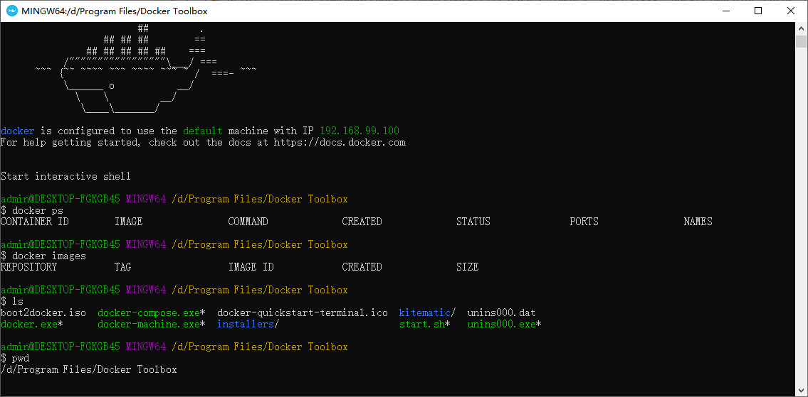

# win10家庭版

安装：https://blog.csdn.net/hao_kkkkk/article/details/79853752

下的这个：DockerToolbox-18.03.0-ce.exe

```bash
# 1. 安装 DockerToolbox-18.03.0-ce.exe
# 2. 装完后打不开参照 https://blog.csdn.net/qq_41723615/article/details/92799429
# 3. 下载 https://github.com/boot2docker/boot2docker/releases 并放到 C:\Users\xxx\.docker\machine\cache 下
# 4. 卸载打包安装的虚拟机。下载 https://www.virtualbox.org/wiki/Downloads 并安装
# 5. 双击运行 Docker Quickstart Terminal
```



安装成功！

```bash
# 如果已经开启了虚拟化，还是报
# This computer doesn't have VT-X/AMD-v enabled. Enabling it in the BIOS is mandatory
# 这个错
# 以管理员身份进入命令行
bcdedit # 发现最后一项目 hypervisorlaunchtype：auto
bcdedit /set hypervisorlaunchtype off # 这样一来 wsl2 又启动不了了
# 后重启
```

