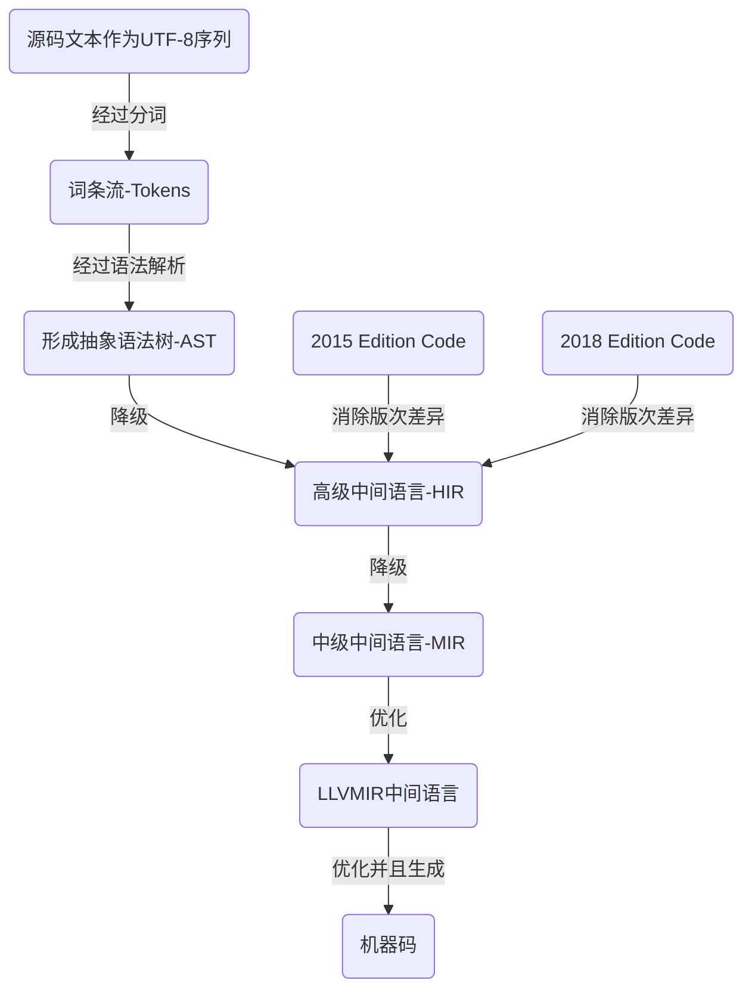
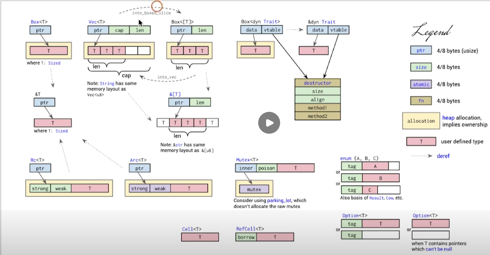

# 语言版本说明

1）master：发行版

2）nightly：开发版（也叫夜版），每晚都会更新

3）beta：测试版，每6周发布一次

4）stable：稳定版，每6周发布一次

**Edition 版次：**每三年发布一次

1. 2015 Edition：Rust1.0 ~ Rust1.30
2. 2018 Edition：Rust1.31
3. 2021 Edition：尚未确定

# Rust 编译过程



大部分语言在形成抽象语法树以后就会直接转序为字节码（或机器码），但 Rust 编译器在生成字节码之前，还增加了一些工序：

- 首页是语法树降级，也就是进一步简化，形成高级中间语言 HIR（用于代码检查、方法查找等工作）
- 然后将 HIR 进一步简化成 MIR（中级中间语言），MIR 用于借用检查、优化、代码生成（也就是宏）、泛型、单态化等
- 最终将 MIR 转译为 LLVM 中间语言，交由 LLVM 后端去生成机器码
- 注意：2015 Edition 或 2018 Edition 在到达 HIR 时，已经消除了那些版次差异。也就是说 HIR 是多个 Edition 的通用语言

# Rust 词法结构

包含六大部分：

- 关键字（Keywords）

  - 严格关键字（Strict）：不能用于变量名、方法名、参数名、宏名等等

    as/break/const/continue/crate/if/else/struct/enum/true/false/fn/for/in/let/loop/impl/mod/match/move/mut/pub/ref/return/self/Self/static

    super/trait/type/unsafe/use/where/while/async/await/dyn/main

  - 保留字（Reserved）：被保留的关键字不代表将来一定会使用

    abstract/become/box/do/final/macro/override/priv/typeof/unsized/virtual/yield/try

  - 弱关键字（Weak）：只有在特定的上下文中，才有特殊意义的关键字

    union/static/（2018 Edition）dyn（2015 Edition）

- 标识符（Identifier）：只支持ascii码字符串为标识符（正在支持非ascii作为标识符，如表情、数学符号），不能以数字开头

- 注释（Comment）

- 空白（Whitespace）：\n、\t、tab等

- 词条（Tokens）

  1. 语言项（item）
  2. 块（block）
  3. 语句（stmt）
  4. 表达式（expr）
  5. 模式（pattern）
  6. 关键字（keyword）
  7. 标识符（ident）
  8. 字面量（literal）
  9. 生命周期（lifetime）
  10. 可见性（vis）
  11. 标点符号（punctuation）
  12. 分配符（delimiter）
  13. 词条树（token tree）
  14. 属性（attribute）

- 路径（Path）：由名称空间限定符（::），在逻辑上分隔的一个或多个路径段组成的序列；路径有多种应用场景

  ```rust
  // 第一种应用：展示模块之间的关系
  pub mod a {
      fn foo() {}
      pub mod b {
          pub mod c {
              pub fn foo() {
                  // b::a
                  super::super::foo();
                  // c::b::a
                  self::super::super::foo();
              }
          }
      }
  }
  // 模块外调用
  a::foo();
  a::b::c::foo();
  ```

  ```rust
  // 第二种应用：完全限定列歧义调用
  trait T1 { fn f() { println!("T1.f"); } }
  trait T2 { fn f() { println!("T2.f"); } }
  struct S;
  impl S { fn f() { println!("S.f"); } }
  impl T1 for S {}
  impl T2 for S {}
  
  S::f(); // S.f
  <S as T1>::f(); // T1.f
  <S as T2>::f(); // T2.f
  ```

  ```rust
  // 第三种应用：在调用泛型函数时，需要指定具体类型
  (0..10).collect()::<Vec<_>>(); // 报错：expected one of `.`, `;`, `?`, `}`, or an operator 不知为啥
  let v = Vec::<u8>::with_capacity(1024);
  ```

# 面向表达式

## 1. 表达式语句

1）每行代码都可以看作是一个语句，语句分四各类型：

1. 声明语句：比如定义结构体、函数等
2. 流程控制语句：if else loop for 等
3. 表达式语句：专门用来求值的语句
4. 宏语句：专门用来文本替换或生成指定代码

## 2. Rust 语法的 ”骨架“

```rust
// 先来看一段代码，主要看代码结构
#![allow(unused)]
use std::collections::HashMap;

fn add_one(i: &mut i32) { *i += 1; }
fn add(i: &i32) -> i32 { let i = i + 1; i }

fn main() {
    let mut a = 41;
    add_one(&mut a);
    println!("{:?}", a);
    
    let a = 41;
    let b = add(&a);
    println!("{:?}", b);
    
    let mut h = HashMap::new();
    h.insert("a", 42);
    println!("a is {:?}", h["a"]);
}
```

```rust
// 完全可以缩成一整行，且照样正确执行
#![allow(unused)]use std::collections::HashMap;fn add_one(i: &mut i32) { *i += 1; }fn add(i: &i32) -> i32 { let i = i + 1; i }fn main() { let mut a = 41;add_one(&mut a);println!("{:?}", a);let a = 41;let b = add(&a);println!("{:?}", b);let mut h = HashMap::new();h.insert("a", 42);println!("a is {:?}", h["a"]); }
```

```rust
// 简化一下，只保留骨架
#![ ... ] use xxx; fn xxx(...) {...;} fn xxx(...) {...;...} fn main() {...;...;}
```

```rust
// 继续简化，把关键字也忽略掉，得到最终的代码结构
// Rust 只剩下三个关键元素：
#![ ... ] ; { ; } { ; } { ; ; }

// 属性：类似于 #![]
// 分号;：行分隔符
// 花括号{}：块分隔符
```

## 3. 面向表达式的语言

在其它语言中，;和{}仅是作为分隔符而已，但在 Rust 语言中这两个符号还有其它意义。

Rust 借鉴了函数式语言，面向表达式。;和{}是 Rust 语言的两个基本表达式

1）分号表达式： `; -> ()`意味着可以产生单元类型的值。;产生了值()

2）块表达式：由{}内包含的诸多行语句

3）求值规则：

1. 分号表达式返回值永远为自身的单元类型，即`()`

2. 分号表达式只有在块表达式最后一行才会进行求值，其它时候只作为`连接符`存在

3. 块表达式只对其最后一行表达式进行求值

   ```rust
   fn main() {
       ;
       ;
       {
           ()
       }
       {
           ();
           use std::vec::Vec;
       }
       ();
       &{;};
       ;
       ;
   }
   // 这段代码可以正常运行，并且可以验证上面3条求值规则
   // 1. main函数本身主是一个大的块表达式，并且没有标明返回值，所以默认返回单元类型，即()。
   // 2. main函数体内，最后一个;会返回单元类型的值，即()。
   // 3. 最后一个;上方所有的;都是作为`连接符`存在
   // 4. 行代码用;来分隔，多条行代码组成的块用{}来分隔
   // 5. 块表达式内部也遵循同样规则，块表达式只返回最后一行表达式的值
   ```

## 4. 表达式分类

```rust
// 在其它语言中，这仅仅是赋值而已
// 但在 Rust 中，这行赋值语句背后，还存在一个和内存管理相关的模型
let answer = 42;
// let 是绑定
// answer 是位置表达式
// 42 是值表达式
// 即：
let 位置表达式 = 值表达式;
// 位置表达式：存储值的地址
// 值表达式：具体的值
```

### 4.1 位置表达式

1）静态变量初始化。如：static mut COUNT: u32 = 0;

2）解引用表达式。如：*x

3）数组索引表达式。如：ar[i]

4）字段表达式。如：ob.field

5）以及上面4种表达式用括号括起来的`括号表达式`

​      除此之外都是值表达式

### 4.2 位置上下文

```rust
// 1.除了赋值给左侧外，还有`复合赋值操作`
let mut a = 1;
a += 1; // 复合赋值操作 +=

// 2. 一元 `借用` 和 `解引用`
let a = &mut 7;
*a = 42;    // 解引用操作
let b = &a;

// 3. 字段表达式
struct A { name: &'static str }
let a = A { name: "xxx" };
a.name; // 字段表达式

// 4. 数组索引表达式
let mut a = [1,2,3];
let b = &mut a;
a[1] = 42; // 索引表达式

// 5. 任意隐式借用
let mut v = vec![1,2,3];
v.push(4); // 因为 pub fn push(&mut self, value: T)，所以会隐式调用 &mut v（因为第1个参数是 &mut self）

// 6. let 语句初始化
let a: i32; // 但不给赋值，就属于一个位置上下文

// 7. if let / while let / match 的匹配表达式
let sl = ("a", "bxx");
if let ("a", b) = sl { println!("{}", b) } // 匹配表达式所在区域是位置上下文
else { println!("No") }
// 同理
while let (位置上下文) = ... {...}
match (位置上下文) {...}

// 8. 结构体更新语法中的 base 表达式（..操作符后面的区域）
let mut base = Point3d {x: 1, y: 2, z: 3};
let y = &mut base.y;
Point3d {y: 0, z: 10, .. base}; // 取出 base.x
```

除了以上8点外都是值上下文

## 5. 所有权在表达式上的体现

当位置表达式出现在了值上下文中

```rust
let sa = 42; // sa 是位置表达式，因为是i32类型（实现了 Copy），所以是栈存储
let sb = sa; // sa 出现在了值上下文中，发生了 Copy
sa; // OK

let ha = "hello".to_string(); // ha 是位置表达式，未实现 Copy，堆存储
let hb = ha; // ha 出现在值上下文，发生了 move
ha; // error
```

## 6. 不可变与可变

Rust 中定义一个变量默认是不可变的

```rust
// 不可变，如果想修改，可以用`继承式可变`
let a = 1;
let a = 2; // 再let一个同名的，叫继承式可变，也叫变量遮蔽

// 可变
let mut a = 1;
a = 2;
```

## 7. 可变/不可变引用

可变引用：可以看成独占引用

不可变引用：可以看成共享引用

```rust
let mut n1 = 1;
let mut n2 = 2;
let p = &mut n1; // 不可变引用（但是引用了可变值）
*p = 3; // 解引用后可以改值
p = &mut n2; // p 引用了 n1 后，试图改变成引用 n2 此时报错

let n1 = 1;
let n2 = 2;
let mut p = &n1; // 可变引用（引用了不可变值）
*p = 3; // 解引用后不可改值
p = & n2; // 可以p的引用改成n2
```

# 编译期计算

编译期计算的能力一般被称作编译期函数求值，Rust 支持两种方式：第一种比较完善；第二种 Rust 只支持一个最小化的可用子集，还在完善中

- 第一种：过程宏 + Build 脚本(build.rs)，几乎可以在编译时执行任意代码（包括类型计算、生成代码等等）
- 另一种：类似 C++ 的编译期常量表达式求值

编译期计算主要分为两大类：

- 常量函数（const fn）：编译器在编译时（而非运行时）去执行一些常量表达式
- 常量泛型（const generic）：目前存在缺陷

# Rust 中的类型

## 1. 基本数据类型

1）数字

- 整形：u8 ~ u128 + usize，i8 ~ i128 + isize
- 浮点：f32、f64

2）数组：[T;n]

3）字符：char

4）字符串：&str,String,&[u8],&[u8;N],Vec< u8 >,&u8,OsStr,OsString,Path,PathBuf,CStr,CString,&'static str
                    上面这一堆类型在 C 语言里都是 char *

5）slice（切片）：[T]、&[T]

6）pointer（指针）：包含三种指针类型

1. 原始指针：* const T 和 * mut T，等价于 C 语言里的指针，可以为空，一般用于 Unsafe Rust 中
2. NonNull 指针：是 Rust 语言建议的 *mut T 指针的替代指针；是非空指针，并且是遵循生命周期类型真协变规则
3. 函数指针：是指向代码的指针，而非数据；可以用它直接调用函数

7）引用：

- 分为可变（或叫独占）引用 &mut T，和不可变（或叫共享）引用 &T
- 引用和指针主要区别：
  - 引用不可能为空
  - 引用拥有生命周期
  - 引用受借用检查器保护，不会发生悬垂指针等问题

8）元组：唯一的异构序列

1. 可以在元组中放入不同类型的值

2. 不同长度的元组是不同类型的

3. 可把单元类型的值看成为一个空元组（即`;`的返回值`()`），但一般都把它看成单元类型而不是元组

4. 当元组只有一个元素时，要在元素末尾加逗号分隔，这是为了方便和括号操作符区分开来

   ```rust
   let v = (1); // 只有一个元素时这么写，其实是i32类型
   println!("{}", v == 1); // true
   let v = (1,); // 此时要在这唯一个元素后加个,号来区分
   println!("{}", v.0 == 1); // v.0 典型元组取值 结果：true
   ```

9）Unit

10）Never：代表不可能返回值的计算类型

1. 类型理论中，叫底类型，底类型不包含任何值，但它可以合并到任何其它类型
2. Never 类型用 `!`叹号表示
3. 目前还未稳定，但是在 Rust 内部已经在用了

11）函数指针：fn

```rust
fn t<T>() {}
let ft = t::<i32> as fn(); // 单态化，静态分发
```


## 2. 自定义复合类型

1）结构体 Struct

1. 具名结构体

   ```rust
   struct Point { x: f32, y: f32} // 具名结构体包含字段
   ```

2. 元组结构体

   ```rust
   struct Pair(i32, i32); // 虽然包含字段，但字段没有名字
   ```

   ```rust
   // 一般用于包装一些基本数据类型，去扩展它们的功能
   // 当一个结构体只包含一个成员的时候，这种模式就叫做 NewType 模式
   struct Score(u32);
   impl Score { fn pass(&self) -> bool { self.0 >= 60 } }
   
   Score(59).pass(); // 59分，不及格 结果：false 
   ```

3. 单元结构体

   ```rust
   // 1. 没有字段，可把它当作占位类型
   // 2. 实例就是它自身，不管创建多少个，编译器都会把它优化成同一个
   // 3. 不会占用实际内存空间，是一个零大小类型
   struct Unit;
   ```

   **结构体内存布局**

   Rust 编译器会对结构体进行==内存对齐==，以便提升 CPU 访问效率。对齐规则一般为：让结构体中每个成员都对齐最大那个成员

   ```rust
   struct A { a: u8, b: u32, c: u16 }
   println!("{:?}", std::mem::size_of::<A>()); // 结果：8，就是说占8个字节
   // u8 1字节 + u32 4字节 + u16 2字节 = 7字节
   // 按理说应该 u8 补3个，u16补2个，最后的结果应该是 3 * 4 = 12字节；可是，上面打印结果却是 8，why？
   // 实际上，Rust 编译器会进行字段重排，以便最大化优化内存占用
   struct A { b: u32, c: u16, a: u8 } // 字段重排后的优化结果
   // 重排后 b 是4字节，c 是2字节，a 补1个字节后变成2字节
   // 此时以 b 的4字节为基准，分配两个4字节就完美装下了 b c a，所以 std::mem::size_of::<A>() 测得结果是 8
   ```


2）枚举体 Enum

以枚举类型成员最大的对齐值为准，不需要为每个枚举值都对齐。枚举体实际上就是带 tag 的联合体，tag 可以理解为一种编号，就像元组索引那样。

```rust
enum A { One, Two } // 枚举体 A 中每个值实际上不占大小，但 tag 是占一个字节，所以枚举体 A 一共占一个字节
// H 和 M 是函数项构造器（也就是类型构造器）。因为和函数构造器类似，所以叫函数项构造器。
// 它会根据类型构造一个类似于函数项类型的东西，这里最大对齐类型值是 M<Box<u32>>，E 的 tag 只占一个字节，Box<u32>占8个字节
// 那么 tag 需要再补齐7个字节，再加上 M<Box<u32>> 的8字节，这样 E 就是16个字节
enum E { N, H(u32), M(Box<u32) } // H占4，M占8

println!("A {:?}", std::mem::size_of::<A>()); // 1
println!("Box<u32>: {:?}", std::mem::size_of::<Box<u32>>()); // 8
println!("E: {:?}", std::mem::size_of::<E>()); // 16
```

3）联合体 Union

和枚举体一样，只看最大的对齐值

```rust
// 联合体里没有 tag，所以只看里面字段类型，它的最大对齐字段是u64，占8字节，所以联合体 U 只占8个字节
union U { u: u32, v: u64 }

println!("U: {:?}", std::mem::size_of::<U>()); // 8
```

## 3. 容器类型

分为两大类：

1）内部可变容器：UnsafeCell、Cell、RefCell==（适合没有实现 Copy 的类型）==

是可共享的可变容器。支持内部可变性，可允许在必要情况下，在不可变基础上实施可变

1. 与继承式可变相对应：内部可变性和前面讲的继承式可变是相对应的，因为 Rust 默认不可变的，继承式可变是 Rust 默认的强制行为，实际开发中用来不是很灵活，所以标准库增加了内部可变性功能

2. 内部可变性是由可变性核心原语 UnsafeCell 泛型类型来支持的，本质上是把容器内的 T 原始可变指针，以 * mut T 返回。UnsafeCell 是 Safe Rust 中，唯一合法的可把不可变引用转变为可变指针的方法

3. Rust 标准库基于 UnsafeCell< T > 提供了 Cell< T > 和 RefCell< T >，实现了两个内部可变性容器

   ```rust
   use std::cell::Cell;
   // y 本身不可变，但可通过 cell 的 get / set 方法获取和修改值
   // cell 的 get 方法只能用于实现了 Copy 的类型，否则无法使用 get / set 方法
   struct Foo { x: u32, y: Cell<u32> }
   
   let foo = Foo { x: 1, y: Cell::new(2) };
   println!("Foo.x = {}, Foo.y = {}", foo.x, foo.y.get()); // 1, 2
   foo.y.set(7);
   println!("Foo.y = {}", foo.y.get()); // 7
   
   let s = "Hello".to_string();
   let bar = Cell::new(s);
   // 把容器里的值转移出来，而之前的实例 bar 就不能用了
   println!("{}", bar.into_inner()); // Hello
   println!("{}", bar.into_inner()); // 报错：`bar` moved due to this method call
   // 可以看出来，Cell 窗口是通过移入移出值来达到内部可变目的。
   // 如果想使用引用，需要使用 RefCell 窗口类型
   ```

   ```rust
   use std::cell::RefCell;
   // 放入动态可增长数组，不能实现 Copy，通过 borrow 和 borrow_mut 方法来操作内部的值
   // 这两个方法分别对应 Rust 里不可变和可变引用的概念
   let x = RefCell::new(vec![1, 2, 3, 4]);
   println!("{:?}", x.borrow()); // 结果：[1,2,3,4]
   x.borrow_mut().push(5);
   println!("{:?}", x.borrow()); // 结果：[1,2,3,4,5]
   ```

   ```rust
   // RefCell 有运行时的开销，维护运行时借用检查器。
   // 如果运行时违反了借用检查，就会出错，比如这段代码：
   use std::cell::RefCell;
   
   let x = RefCell::new(vec![1, 2, 3, 4]);
   let mut v1 = x.borrow_mut();
   v1.push(5);
   let mut v2 = x.borrow_mut(); // 报错：二次调用违反了可变引用独占的规则。这是一个运行时检查（非编译时检查）
   ```

2）集合容器：Vec、HashMap

## 4. 泛型

所谓泛型，就是把具体的类型给参数化。泛型也属于一种抽象方式，但==在 Rust 中它是零成本==，因为泛型在编译期就单态化。

==单态化==：指在实际调用的位置，生成具体类型相关的代码，==也叫静态分发==

```rust
fn foo<T>(x: T) -> T { x } // T 实际上是一种形参，只有在实际调用时才会传入具体的类型
println!("{}, {}, {}", foo(1), foo(true), foo("haha"))
```

```rust
// 当类型推断失效，需要手工指定类型的时候
foo(1); // 等价于
foo::<i32>(1);

foo("haha"); // 等价于
foo::<&'static str>("haha");
// 这种操作方式叫 `turbofish` 操作符
```

## 5. 特定类型

所谓特定类型，指专门有特殊用途的类型：

1. PhantomData< T >：幻影类型（或叫幽灵数据），一种用于 Unsafe Rust 的安全抽象

   ```rust
   struct MyIter<'a, T: 'a> {
       ptr: *const T,
       end: *const T,
       // 声明时不需要使用，但在实现过程中需要用到的类型
       _maker: marker::PhantomData<&'a T> // 不加这句会报：parameter `'a` is never used
   }
   ```

2. Pin< T >：固定类型，为了支持异步开发而特意引进，防止被引用的值发生移动的类型

## 6. 行为

Rust 内置 trait 分类：

- 所有权：Copy、Unpin、Drop
- 并发：Sync、Send
- 大小：Sized
- 默认值：Default
- 智能指针：Deref
- 类型转换：From、Into、AsRef

## 7. 奇型种

### 7.1 动态尺寸类型（DST）

全称 Dynamically Sized Type

- 大小未知，只能通过指针访问
- 指向 DST 的是一个胖指针（包含指针本身和一些额外信息，如长度）
- Rust主要提供两种 DST 类型：trait对象和slice
- trait对象中的具体类型是运行期间的虚表（vtable）。因此trait对象由两个指针（2倍指针大小）组成：
  - 一个是指向具体的数据结构
  - 一个是虚表指针
- slice的额外信息是其指向元素的数量

### 7.2 零尺寸类型（ZST）

Rust 允许一种类型尺寸大小为0，例如：

```rust
struct Foo; // 无任何成员，大小为0
struct Baz { foo: Foo, fun: (), baz: [u8; 0] } // 虽然有成员，但每个成员大小都是0，所以本身大小也是0
let b = Baz { foo: Foo, fun: (), baz: []};
println!("{}", std::mem::size_of_val(&b)) // 结果：0
```

safe rust 不用关心ZST，但 unsafe 必须考虑

### 7.3 空类型

Rust 支持不能被实例化的类型（只有类型而没有对应的值）

```rust
enum xxx {} // 通过空枚举定义空类型
println!("{}", std::mem::size_of::<xxx>()) // 结果：0
```

## 8. repr

Rust 允许程序员自己选择数据布局策略

`repr(C)`：数据顺序、大小、对齐方式和 C/C++ 一样

```rust
// 如果不想编译器自动优化重排（C表示按C语言结构体布局），就加这个宏
#[repr(C)] // 注掉是8
struct A { a: u8, b: u32, c: u16 }
println!("{:?}", std::mem::size_of::<A>()); // 结果：12
 
#[repr(C)] // 注掉是8
struct B { b: u32, c: u16, a: u8 } // 手动改变字段顺序后
println!("{:?}", std::mem::size_of::<B>()); // 结果：8
```

- ZST类型大小仍然是0

  ```rust
  struct A;
  #[repr(C)] // 注不注都是0
  struct B { a: A };
  println!("{}", std::mem::size_of::<A>());
  ```

- DST类型不是FFI安全的

- 若T是FFI安全的类型，那么Option< T >和T拥有同样的布局，也是安全的

- repr(C)和repr(u*)中无成员枚举不能被赋值为一个没有对应变量的整数，但C/C++能

  ```rust
  #[repr(C)]
  enum AB { A, B } // 无成员枚举类型
  let a = AB::A;
  let mut i: i32 = 0;
  i = a; // 报错。c/c++可以把一个枚举值赋给一个整形（因为默认是0）
  ```

  

`repr(transparent)`：只用于有单个非零大小字段（可能有其它零大小字段）的结构。保证整个布局和ABI与该字段相同

- ABI：应用程序二进制接口（Application Binary Interface），*ABI*包含了应用程序在这个系统下运行时必须遵守的编程约定。涵盖了各种细节：
  - 数据类型的大小、布局和对齐
  - 调用约定（控制着函数的参数如何传送以及如何接受返回值）。例如，是所有的参数都通过栈传递，还是部分参数通过寄存器传递；哪个寄存器用于哪个函数参数；通过栈传递的第一个函数参数是最先push到栈上还是最后
  - 系统调用的编码和一个应用如何向操作系统进行系统调用
  - 以及在一个完整的操作系统ABI中，目标文件和二进制格式、程序库等等

```rust
#[repr(C)] // 如果不想编译器自动优化重排（C表示按C语言结构体布局），就加这个宏
struct A { a: u8, b: u32, c: u16 }
println!("{:?}", std::mem::size_of::<A>()); // 结果：12

#[repr(C)]
struct A { b: u32, c: u16, a: u8 } // 手动改变字段顺序后
println!("{:?}", std::mem::size_of::<A>()); // 结果：8
```


# 函数

## 1. 常规函数

1）函数都拥有显示的类型签名

2）函数可以分三种类型：

- 自动函数

  ```rust
  fn sum(a: i32, b: i32) -> i32 { a + b }
  ```

- 关联函数

- 方法

  ```rust
  struct A(i32, i32);
  impl A {
      // 关联函数
      fn sum(a: i32, b: i32) -> i32 { a + b }
      // 方法
      fn math(&self) -> i32 { Self::sum(self.0, self.1) }
  }
  let a = A(1, 2);
  println!("{}", A::sum(a.0, a.1)); // 3
  println!("{}", a.math())          // 3
  ```

3）函数自身也是一种类型 -> 函数项类型（就是只写方法名，可以给变量赋值这种）

- 函数项类型，默认实现了 Copy / Clone / Sync / Send / Fn / FnMut / FnOnce

```rust
let a = A(1, 2);
let f_sum: fn(i32, i32) -> i32 = A::sum; // A::sum 为 Fn 类型
let f_math: fn(&A) -> i32 = A::math;     // A::math 为 Fn 类型，但 f_math = a.math 会报错，只能是 类型::方法 这种赋值，对象.方法 不行
println!("{}", f_sum(a.0, a.1)); // 3
println!("{}", f_math(&a));      // 3
```

## 2. 函数指针

==函数项类型==可通过显式指定函数类型转换为一个函数指针类型

写代码时尽量使用函数项类型，不到万不得已不要使用函数指针类型，这样有助于享受零大小类型的优化

```rust
let a = A(1, 2);
let f_sum: fn(i32, i32) -> i32 = A::sum; // 隐式转换成了 [函数指针] 类型（下一行也是）
let f_math: fn(&A) -> i32 = A::math;
// size_of_val 用于测量类型大小
println!("{:?}, {:?}", std::mem::size_of_val(&f_sum), std::mem::size_of_val(&f_math));   // 8, 8
println!("{:?}, {:?}", std::mem::size_of_val(&A::sum), std::mem::size_of_val(&A::math)); // 0, 0
// 函数指针类型大小为8，函数项类型大小为0，所以上面提到尽量用函数项类型，有助0大小优化
// 因为函数指针携带了指针信息，把以大小8
```

## 3. 闭包

1）函数无法捕获环境变量

```rust
let v = 1;
fn foo() { println!("{}", v) } // 报错：can't capture dynamic environment in a fn item
foo()
```

2）闭包可以捕获环境变量

```rust
// 简单点儿的
let v = 1;
let f = || println!("{}", v);
f() // 1
```

```rust
// 复杂点儿的
let v = 1;

// Fn
// fn foo(x: i32) -> impl Fn(i32) -> i32 { move |n| n + x }
// let f = foo(2);

// FnOnce
// fn foo(x: i32) -> impl FnOnce(i32) -> i32 { move |n| n + x }
// let f = foo(2);

// FnMut
fn foo(x: i32) -> impl FnMut(i32) -> i32 { move |n| n + x }
let mut f = foo(2); // 比起上面的 Fn 和 FnOnce 需要加 mut
println!("{}", f(5)); // 2 + 5 = 7

// fn foo(x: i32) -> impl FnOnce(i32) -> i32 这种写法理解为：
// 方法 foo 返回一个闭包(FnOnce类型)，而这个闭包是i32参数以及返回值是个i32的值
```

### 3.1 闭包实现原理

```rust
// 标准库里的

// FnOnce trait
pub trait FnOnce<Args> { type Output; extern "rust-call" fn call_once(self, args: Args) -> Self::Output; }
// FnMut trait，额外要实现 FnOnce
pub trait FnMut<Args>: FnOnce<Args> { extern "rust-call" fn call_mut(&mut self, args: Args) -> Self::Output; }
// Fn trait，额外要实现 FnMut 和 FnOnce
pub trait Fn<Args>: FnMut<Args> { extern "rust-call" fn call(&self, args: Args) -> Self::Output; }
```

1）闭包按使用场景分3种：

1. 捕捉环境变量并且消费掉：对应 Rust 机制 => 所有权（Ownership），则实现 ==FnOnce==（获取 self），会消费掉move进来的实例，所以闭包只能执行一次

   ```rust
   let s = "haha".to_string(); // 换成 i32 等复制语义的类型同样也只能执行一次闭包
   let f1 = || s;
   println!("{}", f1()); // 结果：haha
   println!("{}", f1()); // 报错：this value implements `FnOnce`, which causes it to be moved when called
   ```

   ==未捕获环境变量==场景下，编译器把这个闭包看成==函数指针==，例如：

   ```rust
   let f1 = || println!("f1");
   let f2 = || println!("f2");
   let ar1 = [f1, f2];     // OK
   
   let v = "f3";
   let f3 = || println!("{}", v);
   let ar2 = [f1, f2, f3]; // 报了 expected fn pointer, found closure 
   ```

   由此说明，==捕获和未捕获环境变量的闭包，类型是不一样的==

2. 捕获并修改了环境变量：对应 Rust 机制 => 可变借用（&mut T），则实现 ==FnMut==（获取 &mut self），不会消费掉move进来的实例，所以闭包可以重复执行多次

   ```rust
   let mut ar = [1, 2, 3];
   let mut f2 = |i| ar[0] = i;
   f2(999);
   println!("{:?}", ar); // 结果：[999, 2, 3]
   ```

3. 捕获但未修改环境变量：对应 Rust 机制 => 不可变借用（&T），则实现 ==Fn==（获取 &self），不会消费掉move进来的实例，所以闭包可以重复执行多次

   ```rust
   let v = 1;
   let f3 = || println!("v = {}", v);
   f3(); // 结果：v = 1
   f3(); // 结果：v = 1
   ```

```rust
let mut v = 1.to_string();
// 加 move 就是 FnOnce，不加 move 就是 FnMut
let mut f = move || v.push_str("2");
f();
println!("{}", v); // 执行到这加 move 报错，不加 move 结果：12
```

参考：https://github.com/ZhangHanDong/tao-of-rust-codes/issues/164

### 3.2 闭包其它概念

**3.2.1 逃逸闭包与非逃逸闭包**

能为函数返回，且不在函数调用过程中被销毁的闭包，就叫逃逸闭包，否则就是非逃逸闭包。

逃逸闭包能用，非逃逸编译不通过，所以用不了。

```rust
fn c_mut() -> impl FnMut(i32) -> [i32; 3] {
    // 把 ar 换成一个未实现 Copy 的类型(如String)，就叫非逃逸，因为编译不通过
    // String 未实现 Copy，当 move 时将 ar 的指针所有权转到闭包内，而堆上的字符串没变，
    // 此时离开作用域，堆上的字符串被释放，此时闭包里的 ar 指针就成了悬垂指针
    let mut ar = [0, 1, 2];
    // 如果不写 move，就不允许返回闭包
    // 因为 ar 是局部变量，move 作用是强制将 ar 所有权交到闭包里
    move |i| { ar[0] = i; ar }
}

let i = 42;
let mut f = c_mut();
println!("{:?}", f(i)) // 结果：[42, 1, 2]
```

**3.2.2 特殊情况：唯一不可变借用**

不可变引用属于共享引用（可以有多个），但有一种情况不可变引用只能有一个：

1. 闭包内对借用的值进行了修改
2. 在执行闭包那行代码之前，不可以出现第二个要被修改值的引用

```rust
let mut a = [1, 2, 3];
let x = &mut a; // 是一个不可变引用，但引用了可变变量a
{
    let mut c = || { (*x)[0] = 0; };
    // 不允许使用被闭包捕获的不可变引用
    // 因为上一行的 c 里已经修改了 x，所以就不能再进行不可变借用，所以报错
    let y = x; // Error
    c();
}
let z = x; // OK
```

```rust
// 将上例中的{}去掉，出现相同错误
let mut a = [1, 2, 3];
let x = &mut a;
let mut c = || { (*x)[0] = 0; };
let z = x; // cannot move out of `x` because it is borrowed
c(); // borrow later used here

// 但将 let z = x;拿到 c();下面是可以的
// 原因：
//		定义c时，x 已经借出去了，再 let z = x 就是二次借了
//		放在 c(); 下面好用是因为，c 在定义和执行之间没有发生二次借，c();执行完后才借的

// 再试
c();
let z = x; // 又报错，因为下一行又执行了 c(); 
c();

// 再再试
c();
{
    let z = x; // 还是报错，说明跟作用域{}无关。那就只能理解为，编译器不看{}，只要发现有别人引用我闭包里要修改的值就不行
}
c();
```

**3.2.3 闭包自身实现哪些 trait**

闭包会生成匿名结构体，这些匿名结构体会实现下面 5 个 trait：

- Sized：所有闭包都会默认实现

- Copy / Clone：取决于环境变量是否实现 Copy，以及它们如何被闭包使用；规则如下：

  1. 如果环境变量实现了 Copy，闭包如果以可变借用（&mut）捕获，并对其修改，则闭包自身不会实现 Copy，否则都会实现 Copy

     - 这可以理解为不能同时存在1个以上可变借用

  2. 如果环境变量自身是 move 语义（就是变量存堆上），且闭包内对捕获的变量有==修改或消耗==，则闭包自身不会实现 Copy

  3. 如果环境变量自身是 move 语义（就是变量存堆上），且显示用 move 把所有权转移到闭包（无论闭包里有没有修改和消耗），闭包本身不实现 Copy

     其实和 2. 说的是一回事儿，move || {} 后直接就交所有权了，闭包内是消耗的

     ```rust
     // 只是用来测试闭包是否实现了 Copy 而已
     fn foo_fn<T: Fn() + Copy> (f: T) { f() }
     fn foo_mut<T: FnMut() + Copy> (f: T) { f() }
     fn foo_once<T: FnOnce() + Copy> (f: T) { f() }
     ```

     ```rust
     // 1. 对实现 Copy 变量的引用进行修改
     let mut a = 1;
     let r = &mut a;
     let f = || *r += 1; // 加不加 move 都一样 报错：the trait `Copy` is not implemented for `&mut i32`
     foo_mut(f);
     // 2.1 对未实现 Copy 变量的引用修改
     let mut s = 1.to_string();
     let f = || s.push_str("2"); // 加不加 move 都一样 报错：the trait `Copy` is not implemented for `String`
     foo_mut(f);
     // 2.2 对未实现 Copy 变量的消耗
     let s = 1.to_string();
     let f = || {let v = s; }; // 加不加 move 都一样 报错：the trait `Copy` is not implemented for `String`
     foo_once(f);
     // 3. 显示 move 一个未实现 Copy 的变量
     let s = 1.to_string();
     let f = move || println!("{}", s); // 要加 move 报错：the trait `Copy` is not implemented for `String`
     foo_fn(f);
     ```

- Sync / Send：实现的3条简单规则（==后面详细讲==）

  1. 如果所有捕获的变量均实现了 Sync，则闭包实现 Sync
  2. 如果环境变量都不是【唯一不可变引用】方式捕获，并且都实现了 Sync，则闭包实现 Send
  3. 如果环境变量是以【唯一不可变引用】、【可变引用】、【Copy 或 Move 所有权】捕获的，那闭包实现 Send

# 模式匹配

模式匹配是一种结构性的解构。Rust 中，支持模式匹配的有：

1. let 声明

   ```rust
   struct Point { x: i32, y: i32 }
   
   let (a, b) = (1, 2);
   let Point{ x, y } = Point { x: 1, y: 2 };
   println!("{}, {}", x, y);
   ```

2. 函数和闭包参数

   ```rust
   // ref 模式
   let a = 7;
   let ref b = a; let b = &a; // 这两行是等价的
   ```

   ```rust
   // ref 比 &T好在，调用时不用加&
   fn sum(x: String, ref y: String) -> String { x + y }
   // to_owned：将str转成String，就是把栈上数据放到堆上
   // to_string：里面调的就是 String::from
   println!("{}", sum("1".to_owned(), "2".to_owned())); // 12
   ```

3. match 表达式

4. if let 表达式

   ```rust
   let x: &Option<i32> = &Some(1);
   if let Some(y) = x {y}
   ```

5. while let 表达式

6. for 表达式

# 智能指针

Rust 语义可分为值语义和指针语义，能存储在栈上的类型是值语义，堆上存储的类型是指针语义。==Rust 本质上是用 trait 来操控数据的行为==

```rust
let x = Box::new(7);
let y: i32 = *x; // 用*来取Box里的值
```

## 1. 智能指针工作机制

```rust
pub trait Derfer { // 如果一个类型实现了 Derfer，可以把该类型看成是一个智能指针
    type Target: ?Sized;
    fn derfer(&self) -> &Self::Target; // 解引用行为
}
```

```rust
// Box 实现 Derfer
impl<T: ?Sized> Derfer for Box<T> {
    type Target: T;
    fn defer(&self) -> &T { &**self } // &**self 看成是 &(*(*self))
}
```

## 2. 智能在何处？

主要体现在两个部分：

1. 可以自动解引用，提升开发体验

   ```rust
   use std::ops::Deref;
   
   // 先自己实现一个智能指针
   struct MyPointer<T>(T);
   impl<T> MyPointer<T> { fn new(x: T) -> MyPointer<T> { MyPointer(x) } }
   impl<T> Deref for MyPointer<T> {
       type Target = T;
       fn deref(&self) -> &T { &self.0 }
   }
   
   // 再写个自己的数据类型
   struct User { name: &'static str }
   impl User {
       fn print(&self) { println!("{}", self.name) }
   }
   
   let u = User { name: "haha" };
   let p = MyPointer::new(u);
   p.print(); // 自动给解引用成了 User
   let v: User = *p; // 手动解引用
   ```

   - 在调用函数时，传的参数也会自动解引用

     ```rust
     fn p_str(s: &str) { println!("{}", s) }
     p_str(&String::from("haha"));
     
     // 之所以 String 会自动解引用，是因为它实现了 Deref
     impl ops::Deref for String {
         type Target = str;
         #[inline]
         fn deref(&self) -> &str { unsafe { str::from_utf8_unchecked(&self.vec) }}
     }
     ```

   - ==自动解引用需要注意的地方==

     1. 使用 `*x` 这样手动解引用的方式，等价于 `*(x.deref())`
     2. 使用 `x.方法()` 或在函数参数位置上对 `x` 自动解引用等价于 `x.deref()`

2. 可以自动化管理内存，安全无忧

## 3. 标准库中有哪些智能指针

1. Box< T >
2. Vec< T > 和 String
3. Rc< T > 和 Arc< T >：共享所有权容器，Rc 用于单线程，Arc 用于多线程
4. HashMap<K, V>：虽然没实现 Deref，但实现了 Drop

# 字符与字符串

## 1. 字符

1）是 Unicode 标量值，其值对应于 Rust 中 u32 类型

2）占 4 个字节

3）可方便的转换为 utf8 编码字节序列

```rust
let s = '道';
let _u32 = s as u32;
println!("{}, U+{:x}, {}", _u32, _u32, s.escape_unicode()); // 36947, U+9053, \u{9053}
println!("{}", char::from(65)); // A
println!("{:?}", std::char::from_u32(0x9053)); // Some('道')
```

## 2. 字符串

1）UTF-8 字节序列，String 内部的数据结构是 Vec< u8 >

2）Rust 中常用的两大字符串类型为 str 和 String

3）其它字符串类型：

- Cstr / CString：C 语言用的
- OsStr / OsString：平台相关的
- Path / PathBuf：跨平台的路径

```rust
let s = str::from_utf8(&[0xE9u8, 0x81u8, 0x93u8]).unwrap();
println!("{}, {}", s, String::from("\u{9053}")); // 道, 道
let x = 0x9053;
let x_hex = 0xe98193;
let x_bin = 0b111010011000000110010011;
println!("x:{:b}, x_hex:{:b}, x_bin:0x{:x}", x, x_hex, x_bin);
// x:1001000001010011, x_hex:111010011000000110010011, x_bin:0xe98193
```

## 3. 标准库

Rust 标准库导读：字符与字符串相关

1）查看类型自身的介绍

2）查看类型自身实现方法

3）查看类型实现的 trait

# 集合容器

1）Vec< T >，动态可增加数组

2）VecDeque< T >，基于环形缓冲区的先进先出双端队列

3）LinkedList< T >，非侵入式双向链表实现

4）BinaryHeap< T >，二叉堆实现，可用做优先队列

5）HashMap<K, V> / BTreeMap<K, V>

6）HashSet< T > / BTreeSet< T >

# 迭代器

迭代器模式：

1. 设计模式中的一种行为模式
2. 常与集合使用，不暴露集合底层的情况下遍历集合元素
3. 将集合的遍历行为抽象为单独的迭代对象

```rust
trait Iterator { // 迭代器接口
    type Item;
    fn next(&mut self) -> Option<Self::Item>;
}
```

==Itertools==比较实用的第三方库

# 模块

## 1. 什么是模块

1）模块是一组语法项的集合

- 可以使用 mod 关键字定义
- 可以使用单个文件定义模块。Rust 里，单独一个文件（没有使用 mod 关键字）默认就是一个模块；如果用 mod 定义了一个模块，那也相当这个文件的子模块
- 可以把一个模块分成多个文件
  - 2015 Edition：新建一个文件夹，里面放模块的所有文件，其中还要有个特殊的文件 ==mod.rs==；此时该文件夹就是一个模块，子模块文件也要放在这里
  - 2018 Edition：定义有一个单独的命名文件 xxx.rs；如果有子模块，就放在 xxx.rs 同级目录下，并且文件夹名也要和 xxx.rs 同名，其它子模块放在这个目录下即可

2）模块化编程是一种软件设计思想，降低耦合，全球维护

3）模块有不同的定义方式

## 2. 多模块之间的关系

1）同级模块之间引用，要加上 use ==crate::==xx::xx;

2）导入父组模块使用 super 前缀，如：use super::xx:xx;

3）包外模块之间使用包名

# cargo 包管理器

## 1. 介绍

1）什么是包

1. Package 和 crate 都是指包
2. Package 是概念层的包，包含了单个名多个 crate
3. crate 是实际编译单元
4. codegen-unit：crate 默认被 LLVM 切割成 16 份

2）包管理器 Cargo 介绍

1. Rust 目前最好用的包管理器
2. Cargo 可以让包声明各种各种依赖，并且方便重复的构建
   - 引入了 Cargo.toml 和 Cargo.lock 元数据文件
   - 提取并构建各种依赖包
   - 使用正确的参数来调用 rustc 或其它工具构建包
   - 引入了约定，使得使用 Rust 包更加容易

3）包结构介绍

```
Cargo.lock
Cargo.toml
src/
	lib.rs
	main.rs
	bin/named-executable.rs
	multi-file-executable/
		main.rs
		some_module.rs
benches/
	large-input.rs
	multi-file-bench/
		main.rs
		bench_module.rs
examples/
	simple.rs
	muti-file-example/
		main.rs
		ex_module.rs
tests/
	some-integration-tests.rs
	multi-file-test/
		main.rs
		test_module.rs
```

4）TOML 介绍

Cargo.toml 和 Cargo.loc 区别：

1. Cargo.toml 是开发者定义的包依赖信息
2. Cargo.lock 是根据 Cargo.toml 的信息生成的确切依赖信息
3. Cargo.lock 是由 Cargo 自动生成，不需要开发者配置

```toml
[dependencies]
rand = {git = "https://github.com/rust-lang-nursery/rand.git"} # 默认是 crate.io 下载，也可指定到 github 下载
```

5）语法可见性：

- pub(self)：表示对当前模块可见

- pub(crate)：表示对当前 crate 中可见

  ```rust
  struct A;
  impl A {
      pub(crate) fn f1 () {}
      pub(self) fn f2 () {}
  }
  ```

- pub(super)：表示对父模块可见

- pub(in path)：表示对提供的路径可见

  ```rust
  mod lib {
      pub fn call() { lib_in_path() }
      pub(in crate::lib) fn lib_in_path() { lib_1::lib_1_in_path() }
      mod lib_1 { pub(super) fn lib_1_in_path() { println!("lib_1::lib_1_in_path()") } }
  }
  
  fn main() { crate::lib::call() } // 结果：lib_1::lib_1_in_path()
  ```

## 2. 实际项目结构

会看到 8 个 Rust 开源项目的结构：Rust、Wasmtime、Futures-rs、Async-std、Tokio、Rocket、Actix-web、TiKV（分布式存储）

# Rust 语言架构

1）安全管理（Safe Rust）：

​      基于类型系统的安全抽象：语义层（语言一致性），实现层

- 内存安全
- 并发安全

2）工程能力（Safe Rust）：泛型、trait、enum、struce

3）元编程（Safe Rust）：反射、声明宏、过程宏

4）安全边界（Unsafe Rust）：裸指针操作、静态变量、Union、PhantomData、型变、FFi（C-ABI、WebAssembly）

# 所有权

## 1. 语义模型

```rust
let x = "27" // x绑定"27"并拥有所有权
// x 是变量本身，可以是可变或不或变
let a = &x;  // 其引用（或借用）也可以拥有可变或不可变
// 作用域：进入到新作用域后是move还是copy过去的、引用的生命周期、RAll
```

由于栈帧特性，先定义的绑定后释放

## 2. 类型系统

编译器遵循**仿射类型**，资源最多只能被消耗一次

移动语义（move 默认）：资源 -> 消耗 -> 不能再用

复制语义（copy）：资源 -> 消耗 -> 可以再用。需要实现 copy trait

## 3. 内存管理

1）数据默认存到栈上

2）利用栈来自动管理堆内存（即栈上放指向堆的指针）



## 4. 所有权借用

变量的引用原则：

1. 引用的生命周期不能比引用的内容长

   ```rust
   let i = 1;
   let mut x = &i;
   { // 'a
       let j = 2;
       x = &j; // 当出了'a作用域，j被释放，但x还活着；此时x还引用的j
   }
   println!("{}", x) // 当用到被释放了的j，报错。此刻引用活的比引用的内容长
   ```

2. 当变量v的引用r1，在它往后的日子里遇到了另一个引用r2，并且它们之间有一个是可变引用，此时r1就无效了

   ```rust
   let mut v = 1;
   let r1 = &v;
   { // 作用域 'a
       let r2 = &mut v; // r1在往后的日子里遇到了r2，且它们中有一个是可变引用
       *r2 += 1;
       println!("{}", r2); // r2有效
       println!("{}", r1); // r1无效：cannot borrow `v` as mutable because it is also borrowed as immutable
   }
   println!("{}", r1); // 出了作用域'a，r2不存在了，r1依然无效。
   // 因为可变/不可变引用 "同时存在过" ，先出现的引用就会无效
   ```

## 5. 所有权共享

Clone trait 在语义上表示所有权共享，但如果像String这样类型，在底层实现上则是深拷贝

## 6. 分解借用

对于 struct 的每个成员可以单独借用。但不能对数组和slice的元素进行单独借用，因为数组和slice被看成是一个整体。如果非要单独借用数组或slice的元素，只能unsafe

## 7. 资源管理

基于所有权的资源管理 OBRM（Ownership Based Resource Management），又被称为 RAII（Resource Acquisition is Initialization，资源获取即初始化）。该模式简单说：

- 如果要获取资源，只需要创建一个管理它的对象
- 如果要释放资源，只要销毁这个对象，该对象负责回收资源

# Copy

枚举和结构化默认不实现 Copy，需要手动加 #[derver(Copy，Clone)]，才能实现。当成员里有未实现 Copy 的类型，则加了这个宏也没用，会报错。

想**实现 Copy 必须先实现 Clone，因为 Copy 继承了 Clone**。Copy 是一个隐藏行为，没法被重载（即便重写了也不会影响编译器行为，包括clone）

即便手动实现了一个类型的clone，也无法改变编译器行为。

```rust
let x = a; // 编译器自动 clone
let x = a.clone(); // 显示调用才能调到自己手动实现的clone
```

# Move

```rust
let s = Box::new("Hello".to_string());
let p1 = &s;          // 指向栈的指针
let p2 = s.as_ptr();  // 指向堆的指针
println!("{:p},{:p}", p1, p2);
```


# 生命周期

存在的意义是为避免悬垂指针。

## 1. 生命周期参数

可理解为作用域范围的名字，如 `'a`

```rust
// 记住：'long: 'short。因为 `static 最长，所以是所有生命周期的子类
// 'a: 'c, 'b: 'c, 'c 说明两个传进来的参数比返回值活的长，这是OK的
// 相反，如果返回值比传进来活的长（因为返回的是两个传进来其中之一），说白了指针比指向的值活的长，那就悬垂了
fn foo<'a: 'c, 'b: 'c, 'c>(s1: &'a str, s2: &'b str) -> &'c str {
    if s1.len() > s2.len() { s1 } else { s2 }
}
```

## 2. T 和 &T

```rust
trait A { fn f(&self); }
impl<T> A for fn(T) { fn f(&self) { println!("1") } }
impl<T> A for fn(&T) { fn f(&self) { println!("2") } }

let a: fn(_) = |_: u8| {};   // fn(_) => T
let b: fn(_) = |_: &u8| {};  // fn(_) => T
let c: fn(&_) = |_: &u8| {}; // fn(&_) => &T
a.f();b.f();c.f(); // 结果：1 1 2
```

## 3. 无边界生命周期

对一个函数来说，任何不是从输入那里来的输出生命周期都是无边界的

```rust
fn get_str<'a>() -> &'a str;
```

## 4. 子类型变性

Rust没有结构体继承概念，却有子类型机制，子类型是针对生命周期存在的，生命周期是代码的作用域，所以我们可以根据它们相互包含的关系来判断它们的继承关系。永久生命周期 `'static` 是所有生命周期的子类型

**变性**

变性是类型构造函数与它的参数相关的一个属性。如 `Vec` 是一个构造函数，参数是 `T`，返回值是 `vec<T>`。`&` 和 `&mut` 也是构造函数，它们有两个类型，一个是生命周期，一个是引用指向的类型

构造函数 F 的变性表示了它的输入子类型如何影响它的输出子类型。Rust 有三种变性，给定 Sub 是 Super的子类型：

- 如果`F<Sub>` 是 `F<Super>` 的子类型（子类型为通过），则 F 是协变
- 如果`F<Super>` 是 `F<Sub>` 的子类型（子类型为倒置），则 F 是逆变
- 否则  F 是不变的（不存在子类型关系）

Rust中协变远比逆变普遍和重要，逆变的存在几乎可以忽略，一些重要的变性：

- `&'a T` 对于 `'a` 和 `T` 是协变
- `&'a mut T` 对于 `'a` 是协变，对于 `T` 是不变
- `fn(T) -> U` 对于 `T` 是逆变，对于 `U` 是协变
- `Box`，`Vec` 以及所有的集合类对于它们保存的类型都是协变
- `UnsafeCell<T>`，`Cell<T>`,`RefCell<T>`,`Mutex<T>` 和其他的内部可变类型对于 `T` 都是不变

## 5. 高阶生命周期

```rust
// 这段代码编译不过，报：lifetime may not live long enough
let f = |x: &i32| x;
let i = &7;
f(i);
```

```rust
// 改成：
fn foo<T, F>(f: F) -> F where F: Fn(&T) -> &T { f } // 给闭包再套个方法，用来解决编译器不确定生命周期长度
let f = foo(|x: &i32| x);
let i = &7;
println!("{}", f(i));
```

# 类型转换

```rust
struct Foo {a: i32, b: i32};
#[derive(Debug)]
struct Bar {a: i32, b: i32};

let f = Foo {a: 1, b: 2};
// 裸指针非安全的，需要unsafe
let b: &Bar = unsafe { &*(&f as *const Foo as *const Bar) }; // 先转成 Foo 裸指针，再转成 Bar 裸指针，再解引用，再引用赋给b
println!("{:?}", b);
```

1）强制类型转换时都会发生隐式类型转换，但在匹配 trait 约束时不会发生

```rust
trait MyTrait {}
impl<'a> MyTrait for &'a i32 {}

fn foo(_x: impl MyTrait) {}
fn bar(_x: &i32) {}

let x: &mut i32 = &mut 7;
foo(x); // 匹配 trait 约束时不会发生隐式类型转换
bar(x); // 发生隐式类型转换：&mut i32 => &i32
```

2）显示类型转换是强制类型转换的超集，所有强制类型转换都可以通过显式转换的方式触发。某些场景只适用于显式类型转换

```rust
fn print(x: &i32) { println!("{}", x) }
let x: &mut i32 = &mut 7;
print(x); // 隐式转换
print(x as &i32); // 显式转换
```

## 变形

```rust
pub const unsafe fn transmute<T, U>(e: T) -> U // T是原类型，U是目标类型
```

### 大小端字节序

计算机硬件有两种储存数据的方式：大端字节序（big endian）和小端字节序（little endian）

大端字节序：低位字节在高地址，高位字节低地址上。这是人类读写数值的方法。
小端字节序：与上面相反。低位字节在低地址，高位字节在高地址。

```rust
// 比如：11 22 33 44
// 大端：11223344
// 小端：44332211
```

```rust
let ar = [0x78, 0x56, 0x34, 0x12];
let n = unsafe { std::mem::transmute::<[u8; 4], u32>(ar) }; // transmute 将原值复制到了目标值上

// 大端字节序：0x78563412 => 2018915346
// 小端字节序：0x12345678 => 305419896
println!("{}", n); // 结果：305419896，说明小端
println!("{}", u32::from_ne_bytes(ar)); // 305419896  本机字节序
println!("{}", u32::from_le_bytes(ar)); // 305419896  小端
println!("{}", u32::from_be_bytes(ar)); // 2018915346 大端
```

```rust
// transmute 会将原值移动到目标值。不想移动，就用transmute_copy
#[derive(Debug)]
struct Foo {x: u8}
let ar = [Foo{x: 7}];
let n = unsafe { std::mem::transmute::<[Foo;1], u8>(ar) };
println!("{}", n);
println!("{:?}", ar); // 报错：orrow of moved value: `ar`

let o: Foo = unsafe { std::mem::transmute_copy(&ar) };
println!("{:?}", o);   // 结果：Foo { x: 7 }
println!("{:?}", ar);  // 结果：[Foo { x: 7 }]
```

# 未初始化内存

未初始化的变量不允许读取（或叫使用）

```rust
let x: i32; // 未初始化
if true { x = 1 }
println!("{}", x); // 报：borrow of possibly-uninitialized variable: `x`，在 else 里赋个值是OK的

loop { if true { x = 1; break } } // 但是通过loop就OK，因为想break必须先给x赋值
```

当一个变量未实现Copy，则当它赋值给别的变量是，该变量处于未初始化状态

# 并发

1）通常情况下，Rust所有权系统就避免了数据竞争（不可出现1个以上可变引用）

2）内部可变性，通过Send和Sync trait 来保证

# 收藏

```bash
https://time.geekbang.org/course/intro/100060601  # 张汉东 付费
https://gitee.com/geektime-geekbang/geektime-Rust # 代码及pdf
https://rustc-dev-guide.rust-lang.org/ # rustc编译器工作原理 有early bound / late bound
```

