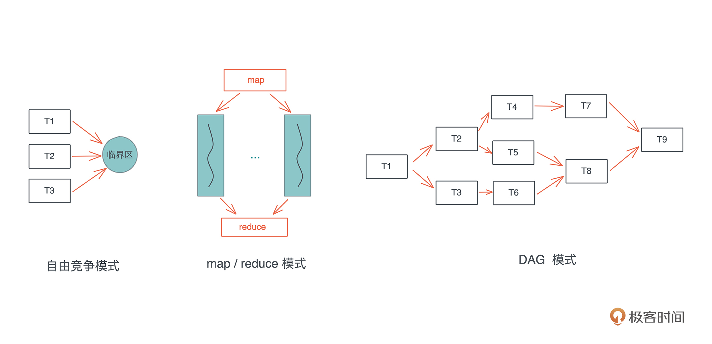

# 方法返回 str

```rust
// Box::leak 可以断开与原字符串的所有权关系
// 即 String => &mut str 后，两者之间各自独立
fn static_str() -> &'static str { Box::leak("a".to_string().into_boxed_str()) } // 或
fn static_str() -> Box<str> { "a".to_string().into_boxed_str() }

println!("{}", static_str()); // a
```

```rust
let rv: &mut str;
{
    let s = "a".to_string();
    rv = Box::leak(s.into_boxed_str());
}
println!("{}", rv) // a
```

# Cargo.toml

```toml
# 如果包名太长，可以重命名个简单的
# jsonwebtoken = "7" 可以重命名成 jwt
jwt = {version = "7", package = "jsonwebtoken"}
```

# RAII机制

https://blog.csdn.net/yyxyong/article/details/76099721

# 判断OS

```rust
if cfg!(windows) {     // windows 系统
    println!("this is windows");
} else if cfg!(unix) { // linux 系统，经测试 cfg!(linux) 不走该 if 传动
    println!("this is unix alike");
}
```

```rust
#[cfg(target_os = "macos")]   // mac 系统
static DEFAULT_PATH: &str = "path2";
#[cfg(target_os = "linux")]   // linux 系统
static DEFAULT_PATH: &str = "path0";
#[cfg(target_os = "windows")] // windows 系统
static DEFAULT_PATH: &str = "path1";
```

# Option 作为参数

```rust
fn a(v: Option<i32>) {}

a(Some(1));
a(1); // 此时编译不过
a(None);

fn a(v: impl Into<Option<i32>>) {} // 这么写，上面3种调用都可以了
// 扩展可得：
// 参数只要是：v: impl Into<T>，这种都可以在方法里通过 v.into() 得到
```

# 裸指针

```rust
// 赋空
let p: *const String = std::ptr::null();
```

# 取类型名

```rust
fn t_name<T>(t: T) {
    std::any::type_name::<T>();
} // 或直接给具体类型
std::any::type_name::<Vec<usize>>();
```

# 创建型设计模式

## 1. 单例模式

系统只允许拥有唯一个全局变量，单例对象的 struct 只允许唯一实例存在

```rust
use std::{
    mem::MaybeUninit,    // 未被初始化的内存
    sync::{Mutex, Once}  // 唯一
};

#[derive(Debug)]
struct Ob { inner: String }
// 1. 需要一个单例函数，其有两个作用
//      1) 保证返回值唯一
//      2) 用 Maybeunit 创建未被初始化的内存
// 2. 返回 &'static
fn single() -> &'static Mutex<Ob> {
    static mut O: MaybeUninit<Mutex<Ob>> = MaybeUninit::uninit();
    static ONE: Once = Once::new();
    ONE.call_once(|| unsafe {
        O.as_mut_ptr().write(Mutex::new(Ob { inner: "haha".to_string() }));
    });
    unsafe { &*O.as_ptr() }
}

fn main() {
    let o1 = single();
    let o2 = single();
    println!("{:?}", o1); // haha
    println!("{:?}", o2); // haha
    {
        let mut x = o1.lock().unwrap();
        x.inner = "hoho".to_string();
    }
    println!("{:?}", o1); // hoho
    println!("{:?}", o2); // hoho

    std::thread::spawn(move || {
        let mut x = o1.lock().unwrap();
        x.inner = "gaga".to_string();
    }).join().unwrap();
    println!("{:?}", o1); // gaga
    println!("{:?}", o2); // gaga
}
// 总结：无论调用多少次 single 方法，其返回的都指向同一块儿内存
```

## 2. 建造者模式

将一个复杂的构建与其表示相分离，使得同样的构建过程可以创建不同的表示

注：创建 != 多态（rust 里多太通过 trait 实现）

**角色：**

- builder：相当于底层的好建筑工人，用 trait 来完成多态
  - 负责构建对象各部分的功能，以及最后组装对象的功能
- director：相当于设计师，用 struct 完成主流程
  - 负责调用 builder 的功能来创建对象

```rust
#[derive(Debug, Clone)]
struct Product {  // 产品类：被构建的类型
    id: Option<usize>,
    name: Option<String>,
    price: Option<f32>
}

impl Product {
    fn new() -> Self { Self {id: None, name: None, price: None} }
}

trait Builder {                             // 抽象建造者
    type Target;                            // 绑定被构建对象的类型
    fn step1(&mut self) -> &mut Self;       // 构建步骤1
    fn step2(&mut self) -> &mut Self;       // 构建步骤2
    fn step3(&mut self) -> &mut Self;       // 构建步骤3
    fn get_product(&self) -> Self::Target;  // 构建完成后取出完整对象
}

struct Worker { inner: Product } // 实现 builder

impl Worker {
    fn new() -> Self { Self { inner: Product::new() } }
}
impl Builder for Worker {
    type Target = Product; // 绑定被构建对象的类型
    
    fn step1(&mut self) -> &mut Self {
        self.inner.id = Some(1);
        self
    }

    fn step2(&mut self) -> &mut Self {
        self.inner.name = Some(String::from("huawei"));
        self
    }

    fn step3(&mut self) -> &mut Self {
        self.inner.price = Some(4999.9);
        self
    }

    fn get_product(&self) -> Self::Target {
        self.inner.clone()
    }
}

struct Director; // 设计者、协调者

impl Director {
    fn build<T: Builder>(mut builder: T) -> T::Target {
        builder.step1().step2().step3().get_product()
    }
}

fn main() {
    let product = Director::build(Worker::new());
    println!("{:#?}", product)
}
// 想要建造其它类型，只需换掉 Worker 和 Product 就行，其它代码均可复用
```

## 3. 工厂模式

创建实例时不暴露创建逻辑，通过一个共同接口来指向新创建的实例。通过 trait 和 enum

```rust
trait Human { fn say(&self); } // 人，说什么语言
enum Nation { EN, CH, JP }     // 国籍

struct Chinese; // 中国人
impl Human for Chinese {
    fn say(&self) { println!("哈喽") }
}

struct American; // 美国人
impl Human for American {
    fn say(&self) { println!("hello") }
}

struct Japanese; // 日本人
impl Human for Japanese {
    fn say(&self) { println!("o ha you") }
}

struct Factory; // 工厂，通过国籍创建人
impl Factory {
    fn new(t: Nation) -> Box<dyn Human> {
        match t {
            Nation::EN => Box::new(American),
            Nation::CH => Box::new(Chinese),
            Nation::JP => Box::new(Japanese)
        }
    }
}

fn main() {
    Factory::new(Nation::CH).say(); // 哈喽
    Factory::new(Nation::EN).say(); // hello
    Factory::new(Nation::JP).say(); // o ha you
}
```

# 行为型设计模式

关注系统中对象之间的相互交互，研究系统在运行时对象之间的相互协调，明确对象的职责。重点是组件间相互作用

## 1. 迭代器模式

用于顺序访问集合的元素，不需要知道集合对象的底层表示，主要应用于遍历一个聚合对象

## 2. 略图模式

减少条件语句，用相同的方法调用；将方法作为参数传递

```rust
trait Say { fn say(&self); }

struct Dog;
impl Say for Dog { fn say(&self) { println!("旺旺") } }
struct Cat;
impl Say for Cat { fn say(&self) { println!("喵喵") } }

fn say(o: impl Say) { o.say() } // 或者值进来一个方法

fn main() {
    say(Dog); // 旺旺
    say(Cat); // 喵喵
}
```

## 3. 观察者模式

又称 `发布/订阅` 模式。定义对象间一对多的依赖关系，使得当某个对象改变状态，其所有依赖都会得到通知并更新

**四大角色：**

- trait subject：抽象被观察者，将所有观察者放入集合中并提供 `添加、删除、通知` 三个接口
- subject：具体被观察者，将改变的状态存入自身，给所有注册进来的观察者发送通知
- trait observer：抽象观察者，提供更新接口
- observer：具体观察者，实现的景象观察者定义的接口，在收到通知时更新自身状态

## 4. 责任链模式

# 结构型设计模式

## 1. 适配器模式

为两个不兼容的接口搭建一个桥梁

优点：符合开闭原则，解决接口不一致问题。缺点：增加阅读难度和系统复杂度（慎用）

## 2. 代理模式

一个类代表另一个类的功能。使用场景：Rc 的 ref counting，Spring 的事务及aop

```rust
trait T { fn exec(&self) { println!("exec") } }
struct A; // 被代理的类
impl T for A {}

struct Proxy<'a> { inner: &'a A } // 代理类
impl<'a> Proxy<'a> {
    fn new(r: &'a A) -> Self { Self { inner: r } }
    fn before(&self) { println!("proxy before") }
    fn after(&self) { println!("proxy after") }
    fn log(&self) { println!("proxy log") }
}

impl T for Proxy<'_> {
    fn exec(&self) {
        self.before();
        self.inner.exec(); // 在执行被代理方法之前、之后执行一些操作
        self.after();
        self.log();
    }
}

fn invoke<X: T>(x: &X) { x.exec() }

fn main() {
    let a = A;
    invoke(&a);
    invoke(&Proxy::new(&a))
}
// 结果：
// exec
// proxy before
// exec
// proxy after
// proxy log
```

# 并发（陈天 33~34）

并发常见工作模式：

- 自由竞争模式：任务间随时、任何方式访问临界区是不确定的，只要访问临界区获得独占访问即可
- map / reduce 模式：上一种基础上，把任务打散按相同处理完成后，再按一定顺序组合结果
- DAG 模式：把任务切成不相交且有依赖关系的子任务，后按依赖关系并发执行（典型场景：生产者/消费者模式）



并发模式背后的5个概念：Atomic、Mutex、Condvar、Channel、Actor model

## 1. Atomic

理解为线程安全（具有原子性）的类型（即不用加锁的类型，因为内部有锁），`std::sync::atomic` 下有大量的 `atomic` 数据结构，对应各种基础类型

```rust
// 简单实现的一个锁
pub fn lock(&self, op: impl FnOnce(&mut T)) { 
    // 如果没拿到锁，就一直等待 
    while *self.locked.borrow() != false {} // #1 
    // 拿到，赶紧加锁 
    *self.locked.borrow_mut() = true;       // #2 
    // 开始干活 
    op(&mut self.data.borrow_mut());        // #3 
    // 解锁 
    *self.locked.borrow_mut() = false;      // #4
}
// 会有如下问题：
// 1. 在多核情况下，#1 和 #2 之间，有可能其它线程也碰巧等待结束，把 locked 修改为 true。这样，存在多个线程拿到这把锁，破坏了任何线程都有独占访问的保证。
// 2. 即便在单核情况下，#1 和 #2 之间，也可能因为操作系统的可抢占式调度，导致问题 #1 发生。
// 3. 如今的编译器会最大程度优化生成的指令，如果操作之间没有依赖关系，可能会生成乱序的机器码，比如 #3 被优化放在 #1 之前，从而破坏了这个 lock 的保证。
// 4. 即便编译器不做乱序处理，CPU 也会最大程度做指令的乱序执行，让流水线的效率最高。同样会发生 #3 的问题。
```

```rust
// 而为解决上述4个问题，Atomic 内部都是这种实现
while self
    .locked // 先锁
    // 然后 CAS（Compare-and-swap）
    .compare_exchange(false, true, Ordering::Acquire, Ordering::Relaxed)
    .is_err() {
        
    // 性能优化：compare_exchange 需要独占访问，当拿不到锁时，
    // 先不停检测 locked 的状态，直到其 unlocked 后，再尝试拿锁
    while self.locked.load(Ordering::Relaxed) == true {}
}
```

```rust
// 为解决CPU指令优化高度后的乱序
pub enum Ordering {
    Relaxed, // 对编译器、CPU不做限制，可乱序执行（最宽松）
    // 当`写入`数据时：
    // - 对于当前线程：保证 #3 不会在 #4 之后执行
    // - 对于其它线程：如果用 Acquire 来读取该 atomic 数据，则看到的是修改后的结果
    //  （compare_exchange 参数可指定 Acquire） 
    Release,
    // 当`读取`数据时：
    // - 对于当前线程：保证 #3 不会在 #1 之前执行
    // - 对于其它线程：如果用 Release 修改数据，则修改的值对当前线程可见
    Acquire,
    // 是 Acquire + Release 的结合，用于操作之前和之后的 读/写 不乱序且结果对其它线程可见
    AcqRel,
    // 除 AcqRel 保证外，还对所有线程看到的所有 SeqCst 操作顺序一致（最严格）
    SeqCst
}
```

## 2. Mutex

`Atomic` 利用空转（死循环）来等待锁

而 `Mutex` lock 时让其它线程挂起，unlock 后唤醒其它线程，这样避免了空转，但又带来了线程上下文切换的开销

> ==`parking_lot`== 库

比标准库的 channel 快，稍慢于 go 的 channel

尝试先空转一会儿，再挂起。但会带来 `非公平锁` 的问题，为此，提供了 parking_lot 的 fair mutex

### semaphore

信号量。假如量大小为10，则可并发执行10个任务，后面的任务排队等待；

此时完成一个任务，信号量减1，排除的任务进来，信号量再加1

例子参照 `tokio.md -> Semaphore`

## 4.Condvar

`DAG`模式，往往和 `Mutex` 一起即用，`Mutex` 保证条件在读写时互斥，`Condvar` 用于控制线程的等待和唤醒，`等待的线程不会消耗 CPU`

两种状态：

- wait：线程在队列中等待，直到满足某个条件
- notify：当 `Condvar` 满足条件时，当前线程通知其他等待的线程可以被唤醒。可以通知单个、多个、甚至广播

```rust
use std::borrow::Borrow;
use std::sync::{Arc, Condvar, Mutex};
use std::thread;
use std::time::Duration;

fn main() {
    let pair = Arc::new((Mutex::new(4), Condvar::new()));
    let cl = pair.clone();

    let t = thread::spawn(move || {
        let (lock, cdr) = cl.borrow(); // 或 &*cl
        for _ in 0..4 {
            thread::sleep(Duration::from_secs(1));
            let mut b = lock.lock().unwrap();
            *b -= 1;
            cdr.notify_one(); // 通知主线程
            println!("child thread - value:{}", *b);
        }
    });

    let (lock, cdr) = &*pair; // 或 pair.borrow()
    {   // 这里套个{}作用是，当 i > 2 后就不会执行 cdr.wait 了
        // 出了{}，锁i被drop，子线程就不会阻塞，转而继续往下执行
        // 否则就会一直阻塞在 println!("after wait {}", *i); 不动
        let mut i = lock.lock().unwrap();
        println!("before wait {}", *i);
        while dbg!(*i) > 2 {
            println!("A");
            // 先阻塞并唤醒子线程，等待子线程通知
            // 传入Mutex i，便于知道要唤醒哪个线程
            i = cdr.wait(i).unwrap();
            println!("B");
        }
        println!("after wait {}", *i);
    }
    // {}去掉，这里加上 drop(i) 也是一样的

    t.join().unwrap();
} // 结果：
// before wait 4
// [src\main.rs:674] *i = 4
// A
// child thread - value:3
// B
// [src\main.rs:674] *i = 3
// A
// child thread - value:2
// B
// [src\main.rs:674] *i = 2
// after wait 2
// child thread - value:1
// child thread - value:0
```

## 5. channel

把读取和写入分离，用起来完全和锁无关，rust 下的四种 channel：

- oneshot：最简单一种，读/写各只有一次
- rendezvous：用来控制线程间同步，并不发数据，其 channel size 为 0。本质上就是对 `Mutex + Condvar` 的包装
- bounded：有个队列，但队列有上限，一旦队列被写满，再写就会被挂起(阻塞)。读者读一个，队列里就少一个，写者此时被唤醒并再往里写。一般会用 `Mutex + Condvar + VecDeque` 实现，也可直接用 ==`thread::park + thread::notify`== 来实现
- unbounded：无上限队列，如果写满，则自动扩容

根据读者/写者数量，channel 又分为：

- spsc：单生产单消费。可不依赖 Mutex，只用 atomics 就可实现
- spmc：单生产多消费。需要在消费侧读取时加锁
- mpsc：多生产单消费。需要在生产侧写时加锁
- mpmc：多生产多消费。需要在写入或读取时加锁

## 6. Actor model

标准库里没有实现，但 `actix-web` 是基于 Actor model 实现的

## 总结

1）Atomic 在处理简单的原生类型时非常有用，如果你可以通过 AtomicXXX 结构进行同步，那么它们是最好的选择。

2）当你的数据结构无法简单通过 AtomicXXX 进行同步，但你又的确需要在多个线程中共享数据，那么 Mutex / RwLock 可以是一种选择。不过，你需要考虑锁的粒度，粒度太大的 Mutex / RwLock 效率很低。

3）如果你有 N 份资源可以供多个并发任务竞争使用，那么，Semaphore 是一个很好的选择。比如你要做一个 DB 连接池。

4）当你需要在并发任务中通知、协作时，Condvar 提供了最基本的通知机制，而 Channel 把这个通知机制进一步广泛扩展开，于是你可以用 Condvar 进行点对点的同步，用 Channel 做一对多、多对一、多对多的同步。

# 架构设计

## Structure

架构的风格和结构，比如 `MVVM`、微服务。采取分层结构，把网络层、业务层和存储层分隔开

目前比较普遍的架构风格有：分层、流水线、插件、微服务、事件驱动等结构

1）事件驱动通常用 `channel` 实现

2）**不管用何种分布式架构，最终每个微服务内部还是分层、流水线和插件结构**

### 分层结构

意味着每一层的**职责范围**以及**层与层之间的接口**。`rust` 通过 `trait` 来定义接口，通过接口来分层

### 流水线结构

1）把要处理流程中的要素构建成一个个接口一致、功能单一的组件，然后根据不同参数选择合适的组件，并将它们组织成完整的流水线，最后依次执行

2）可以是架构级的宏观流水线，也可以是函数级的微观流水线；都是通过组合不同的基本功能，完成复杂的需求

### 插件(微内核)结构

1）插件结构也称微内核结构，让系统拥有一个足够小的核心，后围绕该核心以插件方式注入新功能

2）VS Code 就是典型的插件结构。其核心功能是文本编辑，通过各种插件实现代码高亮、错误检查、代码补全等

3）需要设计一套保证插件和核心之间稳定交互的接口

4）还需要设计一套注册机制，让插件可被注册到系统中，和从系统中删除

5）rust 下常用 `trait` 和 `trait object` 来构建插件机制

# 测试

1）单元测试可以放在每个 .rs 文件里

2）集成测试

- 创建一个与 src 平行的 tests 目录，且不需要 `#[cfg(test)]`（单元测试需要）
- 如果测试较为复杂，可在 `tests` 下 `cargo new` 一个项目。如：https://github.com/hyperium/tonic/tree/master/tests

## 性能测试

通过 `criterion` 库完成性能测试，参照 `lib.md -> criterion`

# FFI

https://blog.csdn.net/wangmarkqi/article/details/104618670  # rust 和 c / c++ 互动

https://doc.rust-lang.org/nomicon/ffi.html # FFI 教程

## 1. 相关概念

> **静态库**

```
将函数和数据编译进二进制文件(.lib)。使用时，程序会把静态库的函数和数据复制过来合并到自身，最终生成.exe文件，也就是说发布时只需要.exe，不需要静态库
```

> **动态库**

```
一般提供俩文件：一个引入库(.lib，非必要)和一个.dll。虽然引入库和静态库都是.lib，但有本质区别；引入库包含动态库导出的函数和变量符号名，而.dll文件包含实际的函数和数据
```

> **使用动态库好处**

```
1. 可使用多种编程语言：如用c++写dll，用vb调用
2. 增加产品功能：可用新的dll替代老的dll
3. 提供二次开发平台：用户可单独调用某软件的dll，实现二次开发
4. 节省内存：若多个应用使用同一个dll，该dll只需要存入内存一次，给所有应用共用
```

> **system32 和 syswow64**

```
当用 DependenciesGui 打开.dll时：
看到源引自 C:/windows/system32 表示该 dll 为64位的
看到源引处 C:/windows/syswow64 表示该 dll 为32位的
```

> **64位运行32位**

```
1. 添加一个交叉编译环境：rustup target add i686-pc-windows-msvc
2. cargo run --target i686-pc-windows-msvc
```

> extern "C" fn() ==可以简写成== extern fn()

## 2. 类型

```rust
use std::ffi::CString;
use std::os::raw::c_char;

// &str 转 *const c_char
let c: *const c_char = CString::new("haha")?.as_ptr();
// &str 转 *mut c_char
let c: *mut c_char = CString::new("haha")?.into_raw();

// WORD 实质是 unsigned short，对应 rust 是 u16
let c: char = 'R';
let u = c as u16; // 结果：82

// clang 的 char ar[4]，对应 rust 的 [c_char;4]
let s = "abcd";
let mut ar = ['\0';10]; // 要用\0初始化，否则最后一位不是\0的话显示会出其它字符
s.bytes()
	.zip(ar.iter_mut())
	.for_each(|(b, p)| *p = char::from(b));
println!("{:?}", ar); // 结果：['a', 'b', 'c', 'd', '0', '0', '0', '0', '0', '0']

// void * 或 NULL
let x: *mut c_void = std::ptr::null_mut();
```

### 2.1 传数组

```c
void test(int ar[]) {
    int len1 = sizeof(ar) / sizeof(ar[0]); // 8 / 4 = 2
    int ar1[] = {1,2,3,4};
    int len1 = sizeof(ar) / sizeof(ar[0]); // 16 / 4 = 4
    // 很奇怪，传进来的数组大小总是8
    int i = ar[0]; // 0 ~ 3 倒是正确
}
```

```rust
let f: Symbol<unsafe extern fn(*const i32)> = lib.get(b"test")?;
let ar = [1,2,3,4];
f(ar.as_ptr());
```

### 2.2 传二维数组

```c
void two(char ar[][7]) { // 最后方框要有大小
    ar[0][0]='a';ar[0][1]='a';ar[0][2]='a';ar[0][3]='a';
    ar[1][0]='b';ar[1][1]='b';ar[1][2]='b';ar[1][3]='b';
    ar[2][0]='c';ar[2][1]='c';ar[2][2]='c';ar[2][3]='c';
}
```

```rust
#[link(name="xxx")]
extern "C" {
    pub fn two(_: *mut [u8;7]);
}

fn main() {
    let mut ar = [['\0' as u8;7];7];
    unsafe { two(ar.as_mut_ptr()); }
    println!("{},", String::from_utf8_lossy(ar[0].as_slice())); // 结果：aaaa   ,
    println!("{},", String::from_utf8_lossy(ar[1].as_slice())); // 结果：bbbb   ,
    println!("{},", String::from_utf8_lossy(ar[2].as_slice())); // 结果：cccc   ,
}
```


https://www.jianshu.com/p/976bd24b2882  # c++与rust类型对应

## 3. 调用静态库

```rust
#[link(name="C:\\xx\\xx\\abc", kind="static")] // 假设静态库文件是：abc.lib
extern "C" {pub fn xxx();}
fn main() { unsafe { xxx(); } }
// 注意：如果静态库是32位的，则需要 cargo run --target i686-pc-windows-msvc
```


# 例子

```rust
.filter_map(Result::ok)
```

## 1. 多线程平均

```rust
// 有n多条数据需要处理，此时配置文件可配置线程数
// 每条线程平均处理多少条数据的算法
let vs = (1..=13).collect::<Vec<i32>>();
let sz = 5;
let len = vs.len() / sz + 1;

for i in 0..sz {
    let s = vs.iter().skip(i * len).take(len).map(|x| x.to_string()).collect::<Vec<String>>();
    println!("i: {}, {}", i, s.join(","));
}
```

