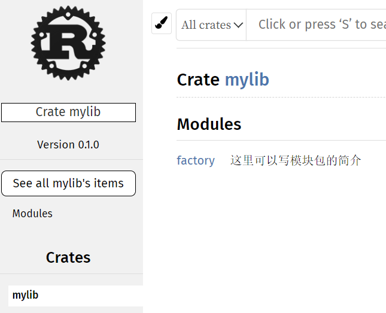
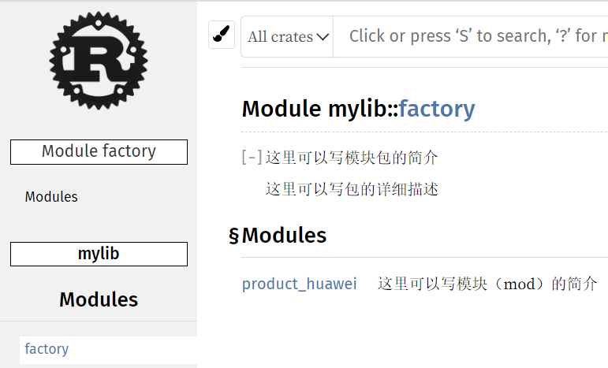
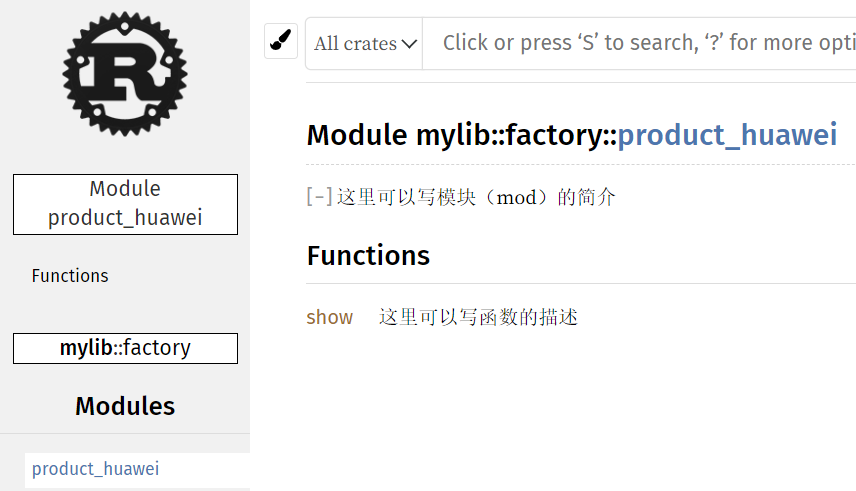
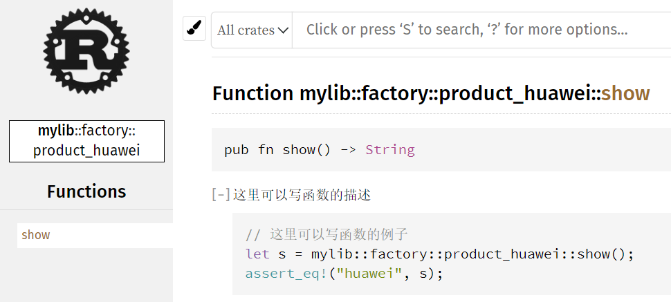

# 泛型

泛型是具体类型或其它属性的抽象替代，用于减少代码重复。==rust中，表示泛型的名称是随便起的：==

```rust
fn test<aa: Debug,bb: Debug,cc: Debug,dd: Debug>(a: aa, b: bb, c: cc, d: dd) {
    println!("{:?},{:?},{:?},{:?}", a, b, c, d);
}
test('a', 1, true, 99.99) // 'a',1,true,99.99
```

## 1. 函数中使用

```rust
pub mod Max {
    // PartialOrd + Copy 是对泛型的约束，即 T 要实现这两个接口
    // PartialOrd 表示 T 可以按顺序比较
    // Copy 表示 T 具有拷贝特性（比如i8 ~ i64，char，bool等）
    pub fn max<T: PartialOrd + Copy>(list: &[T]) -> T {
        let mut m = list[0];
        for &v in list.iter() {
            if v > m { m = v }
        }
        m
    }
    // 另一种方法是通过 where 来限定，也是一样的
    pub fn max<T>(list: &[T]) -> T where T: PartialOrd + Copy {
        let mut m = list[0];
        for &v in list.iter() {
            if v > m { m = v }
        }
        m
    }
}
```

```rust
use mylib::utils::Max;

fn main() {
    println!("{}", Max::max(&vec![3,6,9,0,1,2]));   // 9
    println!("{}", Max::max(&vec!['w', 'b', 'c'])); // w
    println!("{}", Max::max(&vec![true, false]));   // true
}
```

## 2. 结构体中使用

```rust
pub mod Cls {
    #[derive(Debug)]
    pub struct Size<T, U> { pub h: T, pub v: U} // T,U两种类型
}
```

```rust
use mylib::utils::Cls;

fn main() {
    println!("{:?}", Cls::Size { h: 1, v: 2.2 });     // Size { h: 1, v: 2.2 }
    println!("{:?}", Cls::Size { h: '大', v: true }); // Size { h: '大', v: true }
}
```

## 3. 结构体方法中

```rust
pub mod Cls {
    use std::fmt::Debug;

    #[derive(Debug)]
    pub struct Size<T, U> { pub h: T, pub v: U}

    impl<T: Debug, U: Debug> Size<T, U> { // 必须约束Debug才能打印，而且只能是{:?}
        pub fn print(&self) {
            println!("{:?}", self);
            println!("{:?},{:?}", self.h, self.v);
        }
    }
}
```

```rust
use mylib::utils::Cls;

fn main() {
    Cls::Size { h: 1, v: 2.2 }.print();
    Cls::Size { h: '大', v: true }.print();
}
// 运行结果：
Size { h: 1, v: 2.2 }
1,2.2
Size { h: '大', v: true }
'大',true
```

## 4. PhantomData

译为幽灵数据，被广泛用于 `定义时不需要，实现时需要` 的泛型参数

```rust
struct A<T> { // 编译会报错，因为泛型 T 没被用到
    id: usize,
    _tpy: String
}
```

```rust
use std::marker::PhantomData; // 长度为0，就像不存在一样。唯一作用是给类型做标记

struct A<T> {
    id: usize,
    _tpy: PhantomData<T> // OK 编译通过了
}
```

参考：陈天第23讲

## 5. 常用泛型限定

### 5.1 只能是引用

```rust
fn xxx<T: ?Sized>(_: &T) {}
```

### 5.2 不能是引用

```rust
fn test<T: 'static>(_: T) {}

let i = 7;
let o = Op { i: 7 };
// error：borrowed value does not live long enough
test(&i);
test(&o);

// 但是，这种写法是好用的
test("haha");
test(&7);
test(&Op { i: 7 });
// 想想也合理，这三行的入参都是没有所有权的
```


# trait

类似于其它语言中的接口，有四种基本用法：

- 接口抽象：对类型行为的统一约束
  - 接口中可以定义方法并支持默认实现
  - 接口中不能实现其它接口，但接口之间可以继承
  - 同一接口可同时被多个类型实现，但不能被同一类型实现多次
  - 使用 impl 关键字为类型实现接口方法，使用 trait 关键字来定义接口

- 泛型约束：将泛型行为限定在更有限的范围内
- 抽象类型：运行时作为一种间接的抽象类型使用，动态分发给具体的类型
- 标签trait：对类型进行约束，可以直接作为一种标签使用

## 1. 定义和实现

```rust
// 定义接口
pub trait ABC {
    fn get_number(&self) -> i8;
    fn get_string(&self) -> &String;
}
#[derive(Debug)]
pub struct Person { pub id: i8, pub name: String }
// 实现接口
impl ABC for Person {
    fn get_number(&self) -> i8 {
        self.id
    }
    fn get_string(&self) -> &String {
        &self.name
    }
}
```

```rust
let ob = Cls::Person{ id: 1, name: String::from("haha") };
println!("{},{}", ob.get_number(), ob.get_string()); // 1,haha
println!("{:?}", ob) // Person { id: 1, name: "haha" }
```

## 2. 作为参数

```rust
pub fn print(ob: impl ABC) { // 变量名: impl 接口
    println!("{}, {}", ob.get_number(), ob.get_string());
}
// 另一种写法，叫 trait bound
// 其实就是泛型在函数中使用
pub fn print<T: ABC>(ob: T) {
    println!("{}, {}", ob.get_number(), ob.get_string());
}
```

```rust
Cls::print(Cls::Person{ id: 1, name: String::from("haha") }); // 1, haha
```

## 3. 默认实现

```rust
// 基于4.1的例子
pub trait ABC {
    fn get_number(&self) -> i8;
    fn get_string(&self) -> String { // 在接口里写方法体，就是默认实现（和java一样）
        String::from("默认实现")
    }
}
```

```rust
impl ABC for Person {
    fn get_number(&self) -> i8 {
        self.id
    }
    fn get_string(&self) -> String { // 实现了该方法，那么就会走这个；如果注掉，就走接口里的默认实现
        self.name.clone() // &String 改成 String后，字符串类型就要 clone
    }
}
```

## 4. 成员方法与静态函数

- 关联函数：trait / struct 中定义的函数

- 成员方法：关联函数的第一个参数为 Self / mut Self 类型，且命名为self，通过变量实例使用==.==调用（针对对象实例实现）

- 静态函数：关联函数中没有参数为Self类型，通过类型加双冒号==::==的方式调用（针对类型实现）

  ```rust
  impl Shape {
      // 静态函数，只要变量名非self，就不能用.调用
      fn method(this: &self) {
          println!("{}", this.0);
      }
  }
  ```

## 5. 泛型约束

- 利用 trait 实现泛型约束，又叫 trait 限定（trait bound），格式如下：

  ```rust
  fn generic<T: MyTrait + MyOtherTrait + SomeStandardTrait>(t: T) {}
  ```

- 从数学角度理解，trait限定表达了一种交的思想

  ```rust
  // 示例一
  trait A: B + C // A = B和C的交集
  // 示例二
  impl<T: A + B> C for T // 给所有实现了A和B的类型T，实现C
  ```

- 泛型限定过多，导致可读性变差

  ```rust
  fn foo<T: A, K: B + C, R: D>(a: T, b: K, c: R) {}
  // 通过引入 where 关键字，进行重构
  fn foo<T,K,R>(a: T, b: K, c: R) where T: A, K: B + C, R: D {}
  ```

## 6. 子特性

- 利用 trait 声明为另一个 trait 的扩展

  ```rust
  trait Base {}
  trait Derived: Base {} // 等价于
  trait Derived where Self: Base {} // where Self 限定实现自己的 struce 还必须要实现哪些 trait
  ```

- 若满足 trait 扩展时，则需同时实现子 trait 中所有关联函数

  ```rust
  struct T;
  impl Base for T {}
  impl Derived for T {}
  ```

## 7. 函数返回限定

```rust
fn xxx() -> impl ABC {} // 方法的返回值要求实现接口ABC
```

## 8. 有条件实现接口

```rust
trait A { fn p_a(&self); }     // 私有接口A，方法p_a（模块外无法访问）
pub trait B { fn p_b(&self); } // 公有接口B，方法p_b
impl<T: A> B for T { // 帮实现了A的类型去实现B，也可以理解为继承
    fn p_b(&self) {
        self.p_a();
    }
}
pub struct A_B { pub a: String, pub b: String } // 结构体
impl A for A_B { // 结构体实现了A（也就是说上面第3行帮忙自动实现了B）
    fn p_a(&self) {
        println!("{}", self.a);
    }
}
```

```rust
use mylib::utils::Cls::{ABC, B}; // 用到一个模块下的多个类型，用{...}
// A_B并没有实现B，确可以调用接口B里的方法：
// 1. A_B只实现的接口A，但因为是私有的，模块外访问不到
// 2. 模块内部自动帮实现了A的类型实现了B，B可是公有接口，外部可以访问
// 3. 接口B里调用了接口A的方法
Cls::A_B {a: String::from("aaa"), b: String::from("bbb")}.p_b(); // 结果：aaa
```

## 9. 动 / 静态分发

https://zhuanlan.zhihu.com/p/163650432     动态分发

https://rustmagazine.github.io/rust_magazine_2021/chapter_4/ant_trait.html   trait 实现与分析

```rust
// 假设有如下接口各实现
trait Animal { fn speak(&self); }

struct Dog;
impl Animal for Dog { fn speak(&self) { println!("旺旺....."); } }

struct Cat;
impl Animal for Cat { fn speak(&self) { println!("喵喵....."); } }
```

```rust
// 静态分发一(泛型)
// 针对不同调用者，编译时生成不同版本的函数，好处是没有虚表寻址的开销，缺点是二进制文件变大
// 注意：静态分发的返回值必须是同一类型的（即只能返回Dog或Cat其中之一）
fn static_speak<T: Animal>(t: T) { t.speak(); } // 泛型，且T要实现Animal
static_speak(Dog); // 旺旺.....
static_speak(Cat); // 喵喵.....
```

```rust
// 静态分发二(impl)
// impl 也属于静态分发
fn impl_speak(t: impl Animal) { t.speak(); } // impl trait名
impl_speak(Dog); // 旺旺.....
impl_speak(Cat); // 喵喵.....
```

```rust
// 动态分发
fn dyn_speak(t: &Animal) { t.speak(); } // trait 的`引用`
dyn_speak(&Dog); // 旺旺.....
dyn_speak(&Cat); // 喵喵.....
```

## 10.  Self SIzed

```rust
trait Base { fn print(&self); }
struct A;
impl Base for A { fn print(&self) { println!("A") } }

let a: &Base = &A;
a.print() // 这个是OK的，结果：A
```

```rust
// 但当多加一个构造函数new（调用build）时，就会报：
trait Base {
    fn new() -> Self { Self::build(0) }
    fn build(p: usize) -> Self;
    fn print(&self);
}
struct A;
impl Base for A {
    fn build(p: usize) -> Self { A }
    fn print(&self) { println!("A") }
}

// 此时改成在 Self 后加上 where Self: Sized 限制就可以了
trait Base {
    fn new() -> Self where Self: Sized { Self::build(0) }
    fn build(p: usize) -> Self where Self: Sized;
    fn print(&self);
}
```

## 11. 供类型转换的 trait

Rust 提供了对值类型转换和对引用类型转换，两套 trait：

```rust
// 值类型到值类型的转换：

// 实现了 From 会自动实现 Into，但实现了 Into 不会自动实现 From
// 带 Try 的是怕在转换过程中出错，所以该 trait 返回的是 Result，其它都和 From / Into 一样 
From<T> / Into<T> / TryFrom<T> / TryInto<T>

// 引用类型到引用类型转换：
AsRef<T> / AsMut<T>
```

### 11.1 From / Into

这俩是成对的存在，表示一个类型 A 怎样处理变成类型 B；通常只需要为类型 B 实现 from。

此时以类型 A 为参数的方法，就自动获得了由类型 A 的 into 方法转换成类型 B。

即：`translate A to B,impl B how to from A`

```rust
#[derive(Debug)]
struct XY(i32, i32);
impl From<i32> for XY { fn from(v: i32) -> Self { XY(v, v) } }
impl XY {fn print(&self) { println!("{:?}", self) }}

fn main() {
    XY::from(123).print();  // (123, 123)
    let x: XY = 123.into();
    x.print();              // (123, 123)
}
```

### 11.2 TryFrom | TryInto

和 `From / Into` 一样，区别是 `into` 后返回 `Result`

### 11.3 ToString

把任何类型转成 `String`，==但是一般实现 `fmt::Display` 就会有 ToString==

```rust
// std::fmt::Display 例子
struct Xy { x: i32, y: i32 };
impl std::fmt::Display for Xy {
    fn fmt(&self, f: &mut Formatter<'_>) -> std::fmt::Result {
        write!(f, "x: {}, y: {}", self.x, self.y)
    }
}

Xy { x: 1, y: 2}.to_string() // 结果：x: 1, y: 2
// 比 ToString 好在可以直接 print
println!("{}", Xy { x: 1, y: 2})  // 结果：x: 1, y: 2
```

```rust
// std::string::ToString 例子
impl std::string::ToString for Xy {
    fn to_string(&self) -> String {
        format!("x: {}, y: {}", self.x, self.y)
    }
}

Xy { x: 1, y: 2}.to_string() // 结果：x: 1, y: 2
```

### 11.4 FromStr

实现该接口的类型，就能通过字符串的 `parse` 转换成本身

```rust
struct X(i32);
impl std::str::FromStr for X {
    type Err = std::num::ParseIntError;

    fn from_str(s: &str) -> Result<Self, Self::Err> {
        Ok(Self(s.parse::<i32>()?))
    }
}

let x = "7".parse::<X>().unwrap();
```


## 12. trait object

在运行时想让某个类型表现出 `trait` 行为，可将其赋给 `dyn T` 、`&dyn T` 、`Box<dyn T>` 、`Arc<dyn T>`。此时 Rust 创建一个 `trait object`，并为其赋满足该 `trait` 的 `vtable`

参数中使用：

```rust
use std::{error::Error, process::Command};

type BoxError = Box<dyn Error + Send + Sync>;
type R = Result<String, BoxError>;

trait Executor { fn run(&self) -> R; }

struct Shell<'a, 'b> {
    cmd: &'a str,
    args: &'b[&'a str]
}

impl<'a, 'b> Shell<'a, 'b> {
    fn new(cmd: &'a str, args: &'b [&'a str]) -> Self { Self {cmd, args} }
}

impl<'a, 'b> Executor for Shell<'a, 'b> {
    fn run(&self) -> R {
        let o = Command::new(self.cmd).args(self.args).output()?;
        Ok(String::from_utf8(o.stdout.to_owned())?)
    }
}
/// 使用泛型
fn exe(cmd: &impl Executor) -> R { cmd.run() }
/// 使用 trait object: &dyn T
fn exe_dyn(cmd: &dyn Executor) -> R { cmd.run() }     // 栈上
/// 使用 trait object: Box<dyn T>
fn exe_box(cmd: Box<dyn Executor>) -> R { cmd.run() } // 堆上，box 可作为返回值返回
```

```rust
let cmd = Shell::new("echo", &["a", "b"]);

println!("{}", exe(&cmd).unwrap());     // a b
println!("{}", exe_dyn(&cmd).unwrap()); // a b
let bx = Box::new(cmd);
println!("{}", exe_box(bx).unwrap())    // a b
```

## 13. Copy / Clone 区别

> `Copy` 详细：基础.md -> 基础 -> 9.3 栈上拷贝

两者区别：

1. `Copy` 内没方法，`Clone` 内有俩方法
2. `Copy` 给编译器用，告诉编译器该类型是 `copy`（不是`move`语义） 语义。
3. `Clone` 给程序员用的，要手动实现 `clone` 方法
4. 实现 `Drop` 则不能实现 `Copy`，而 `Clone` 没啥限制（除 unsized），任何类型都可实现
5. https://blog.csdn.net/piedaocaoren/article/details/86692822

# 反射

只能对 `'static` 生命周期的变量或常量进行反射，因为：

```rust
impl<T: 'static + ?Sized> Any for T
```

```rust
use std::any::Any;

fn foo<T: Any>(val: &T) {                // 1. 传进来引用
    let v = val as &Any;                 // 2. 转成 Any

    match v.downcast_ref::<String>() {   // 3. 通过 downcast_ref 转回原始类型，好用里面的值
        Some(_) => println!("String"),
        None => ()
    }
    match v.downcast_ref::<i32>() {
        Some(_) => println!("i32"),
        None => ()
    }
    match v.downcast_ref::<bool>() {
        Some(_) => println!("bool"),
        None => ()
    }
}

foo(&String::from("haha")); // String
foo(&7);                    // i32
foo(&true);                 // bool
```

```rust
let s = "haha";
let rf = &s as &std::any::Any;
let rfs = rf.downcast_ref::<&str>().unwrap();
println!("{}", rfs) // haha
```

# 生命周期

https://zhuanlan.zhihu.com/p/191457302

1）rust中==每个`引用`都有生命周期==，即引用保持有效的作用域。大部分时候生命周期是隐含并可以推断的，正如大部分时候类型可以推断一样

2）生命周期主要目标是避免悬垂引用

3）rust 编译器使用借用检查器来检查生命周期是否有效

4）只有==引用参数==才需要生命周期

```rust
// 错误案例：
let r;
{
    let x = 5;
    r = &x; // x为局部，r为全局，出了{}x就被释放了，r自然也无效了
    r = x;  // 这句是可以的，因为基本类型赋值时是会拷贝的
}
println!("{}", r)
```

## 1. 函数中的生命周期

```rust
fn max_len(x: &str, y: &str) -> &str {
    return if x.len() > y.len() {x} else {y}
}
// 该函数在编译时会出以下错误：
//fn max_len(x: &str, y: &str) -> &str {
//              ----     ----     ^ expected named lifetime parameter

// 意思是说需要给函数的参数/返回值加上生命周期
```

生命周期注解以单引号开头加个小写字母，如：=='a==

```rust
// 1. 函数名后加 <'a>
// 2. 参数类型加 &'a str
// 3. 返回值加
fn max_len<'a>(x: &'a str, y: &'a str) -> &'a str {
    return if x.len() > y.len() {x} else {y}
}
```

==生命周期注解是描述引用生命周期的办法，虽不能改变引用的生命周期，但可在合适地方声明两个引用的生命周期一致==

## 2. 结构体中生命周期

```rust
struct D {name: &str} // 这样写编译时提示要加生命周期
#[derive(Debug)]
struct D<'a> {name: &'a str} // 加完后
```

```rust
println!("{:?}", D{name: "haha"}); // D { name: "haha" }
```

## 3. 生命周期省略

1）没有生命周期注解却能编译，原因：早期的rust中必须显式的声明生命周期，后来rust团队将很明确的模式进行了注解的简化

2）遵守生命周期省略规则的情况下无需明确指定生命周期。函数或方法参数的生命周期被称为输入生命周期，返回值称为输出生命周期

3）编译器采用三条规则判断引用何时不用加生命周期注解，当编译器检索完这三条规则后仍不能计算出引用的生命周期，则会停止编译并产生错误

4）生命周期注解省略规则适用于 fn / impl 块定义：

```rust
// 1. 每个引用都有它自己的生命周期的参数
fn foo<'a>(a: &'a str);                  // 有一个生命周期
fn foo<'a, 'b>(a: &'a str, b: &'b str);  // 有两个生命周期
fn foo<'a, 'b, 'c ...>(a: &'a str, b: &'b str, c: &'c str, ...);  // 有n个生命周期
// 一个以上生命周期，表示传进来的参数不在同一个作用域（就是{}）下
```

```rust
// 2. 如果只有一个输入生命周期参数，那么它被赋予了所有输出参数的生命周期
fn test<'a>(s: &'a str) -> &'a str { s } // 等同于或叫生命周期省略为如下：
fn test(s: &str) -> &str { s }
```

```rust
// 3. 如果有多个输入生命周期参数，但其中一个是&self 或 &mut self，那么self的生命周期被赋予所有输出参数的生命周期
struct D { name: String, title: String}
impl D {
    pub fn test<'a>(&'a self, x: &str) -> &'a str {
        self.name.as_str()
    }
    // 省略生命周期，简写成：
    pub fn test(&self, x: &str) -> &str {
        self.name.as_str()
    }
    /****************************************/
    pub fn test(&self, x: &str) -> &str { x } // 如果返回的是x，则编译器会报：
    //                    ----     ----   ^ ...but data from `x` is returned here
    // 原因是：编译器推导出来的是 &self 和 -> &str（即第一个参数和返回值）是同一生命周期
    //        如果想编译通过，只能标注生命周期，改为：
    pub fn test<'a>(&self, x: &'a str) -> &'a str { x } // ok 编译/运行通过
}
```

```rust
fn overlap<'a>(s: &'a str, t: &'a str) -> &'a str;          // 返回值的生命周期不长于 s 且不长于 t

fn overlap(s: &str, t: &str) -> &'static str;               // 返回值的生命周期可以长于 s 或者 t
fn overlap<'a, 'b>(s: &'a str, t: &'b str) -> &'static str; // 展开后

fn overlap<'a>(s: &str, t: &str) -> &'a str;                // 返回值的生命周期与输入无关
fn overlap<'a, 'b, 'c>(s: &'a str, t: &'b str) -> &'c str;  // 展开后
```

## 4. 静态生命周期

定义方式：'static

其生命周期存活于整个程序期间，所有的字符字面值都拥有static生命周期，如：

```rust
let s: &'static str = 'hello';
```

## 5. 对生命周期的误解

参照 `rust-blog.md`

```rust
// 1. T 是 &T 和 &mut T 的超集；&T 和 &mut T 是不相交的集合 
// 2. T: 'static 包含全部 &'static T 同时，还包含全部拥有所有权类型的实例
//    应当被视为满足 'static 生命周期约束，而非 T 有着 'static 生命周期，比如：
let s = "abc".to_string() // s 拥有所有权，所以满足 'static 生命周期约束
// 3. T: 'a 包含 &'a T 同时还包含全部拥有所有权类型的实例，满足 'static 的可以转成 'a（长可以变短）
// 4. 几乎所有的 Rust 代码都是泛型代码，并且到处都带有被省略掉的泛型生命周期注解
// 5. 生命周期在编译时被静态确定，在运行时不能被改变。Rust 检查器假设每个条件分支都能被执行，会选最短命那个赋给变量，如：
struct Has<'a> { s: &'a str }

let long = "long".to_string();
let mut ob = Has { s: &long };

if false { // rust 检查器假设每个分支都能被执行
    let short = "short".to_string();
    ob.s = &short; // 在编译时，会选最短命的来确定引用的生命周期
    ob.s = &long;
}
println!("{}", ob.s) // 报：ob.s = &short; borrowed value does not live long enough
// 6. 重借用一个独占引用并不会结束其生命周期，哪怕它自身已经被 drop 掉了（尽量避免重借用一个独占引用为共享引用，不然你会遇到很多麻烦）
let mut a = 10;
let b: &i32 = &*(&mut a); // 重借用为不可变引用
// 7. 闭包并不遵循和函数一样的生命周期
fn f1(x: &i32) -> &i32 { x } // 函数这么写是OK的
let f1 = |x: &i32| x;        // 但闭包这么写就不行
let f1 = for<'a, 'b> |x: &'a i32| -> &'b i32 { x }; // 上一行展开后是这样
//	  改成这样就OK了
let f1: &dyn Fn(&i32) -> &i32 = &|x: &i32| x;
println!("{}", f1(&10)); // 结果：10
```

## 6. early / late bound

早(early)晚(late)限定

```rust
// late bound 晚限定例子：
struct A<T>(T);
// 定义时不知道，只有在使用时才限定（才单态化，即一种类型编译出一份）
let a = A::<i32>(7);
let b = A::<String>("haha".to_string())
```

```rust
// early bound 早限定例子：
struct A<T: Debug>(T); // 编译时就限定了，所以叫早限定
// 另一种 early bound
impl<'a> xxx<'a> {} // 只要是 impl 里的'x，都是 early bound
```

**两者区别**

```rust
fn late<'a>() {}       // late bound
fn early<'a: 'a>() {}  // early bound

// 调用时才能单态化，不能提前指定
let _ = late::<'static>;  // error: the late bound lifetime parameter is introduced(引入) here
let _ = early::<'static>; // ok
```


# 闭包

闭包是可以保存变量或作为参数传递给其它函数的==匿名函数==。闭包和函数不同点：闭包允许捕获调用者作用域中的值

闭包格式：|参数| { 代码 }

```rust
// 把闭包看做一个struct，捕获的环境相当于结构的成员
let s = String::new();
let f = move || s.to_string();

// 就相当于 
struct Closure { s: String }

// 结构上有个call方法

// FnOnce就是
impl Closure {
    // 这里把这个闭包消耗掉了
    fn call(self) { self.to_string() }
}

// Fn就是
impl Closure {
    // &self，所以你可以调用这个闭包多次
    fn call(&self) { self.to_string() }
}

// FnMut就是
impl Closure {
    // &mut self，你还能改self.s，也能调用多次
    fn call(&mut self) { self.to_string() }
}
```

## 1. 用法

```rust
// 无参
let func = || { println!("haha") };
// 简写
let func = || println!("haha");

func() // haha
```

```rust
// 一个参数一个返回值
let f = |x: i8| -> i8 { x + 1 };
// 简写（省略参数类型及返回值）
let f = |x| { x + 1 };
// 再简写（又省略了{}）
let f = |x| x + 1;

print!("{}", f(99)) // 100
```

## 2. ==注意==

> 一个闭包变量只能推导一种类型，先入为主（即，想多次使用的话必须是同一类型）

```rust
let f = |x| x;
println!("{}", f(99));   // 只有这行OK
println!("{}", f(99.9)); // 只有这行也OK，但两行都有就报错了

// 写成两个闭包变量是OK的
let f = |x| x;
let f1 = |x| x;
println!("{}", f(99));
println!("{}", f1(99.9));
```

> 当闭包要修改环境变量时，闭包本身也要 mut

```rust
let mut i = 1;
let mut f = || i = 2; // f 不加 mut 报错
f()
```


## 3. 捕获调用者变量

闭包有三种捕获调用者环境变量的方式，对应函数的三种取参方式，分别是：获取所有权、可变借用、不可变借用。

这三种方式被编码为以下三种 Fn trait：

- FnOnce：消费从周围作用域捕获的变量，闭包必须获取其所有权并在定义闭包时将其移进闭包。Once部分代表闭包不能多次获取相同变量的所有权

  ```rust
  let v1 = vec![1,2,3];
  let f1 = move || println!("{:?}", v1); // 通过 move，将v1所有权移到闭包中
  
  // 此时再打印v1，就报了 “^^ value borrowed here after move”，意思是v1的所有权已交给了闭包，此时v1已不可用
  // 如果没有 move，则打印OK
  println!("{:?}", v1)
  ```

- FnMut：获取可变的借用值，所以可以改变其环境的变量值

- Fn：从环境获取不可变的借用值

当创建一个闭包时，rust会根据其如何使用环境中的变量来推断闭包（匿名）函数中的变量类型。由于所有闭包都可以被调用至少一次，因此所有闭包都实现了FnOnce。

```rust
let i = 100; // 调用者本地变量
let f = |x| x + i;
println!("{}", f(99)); // 199
```

## 4. 结构体泛型中

本例实现一个缓存，第一次给一个值，以后都不会变了

```rust
struct Cache<T> where T: Fn(i32) -> i32 { // 闭包约束Fn是大写的F
    calc: T, // calc是一个闭包函数
    value: Option<i32> // value是Option枚举
}
impl<T> Cache<T> where T: Fn(i32) -> i32 {
    fn new(calc: T) -> Cache<T> {
        Cache {
            calc, // 当方法new传进来的参数与结构体属性同名时，可省略赋值
            value: None // 初始化创建时value给空
        }
    }
    fn value(&mut self, def: i32) -> i32 {
        match self.value { // Option枚举
            Some(v) => v,  // 有值就返回值
            None => {      // 没有值就通过闭包函数计算一个
                let v = (self.calc)(def); // self.calc必须加括号()
                self.value = Some(v); // value赋值
                v // 返回计算好的值
            }
        }
    }
}
```

```rust
let mut c = Cache::new(|x| x + 1); // 创建并传进去一个闭包函数
println!("{}", c.value(9)); // 10（第1次给什么值就是什么值）
println!("{}", c.value(2)); // 10
println!("{}", c.value(3)); // 10
```

## 5. 作为参数

函数类型是 `fn()`；而闭包类型则是 `Fn()、FnMut()、FnOnce()`，闭包类型前要加关键字 `impl`

用到环境变量是闭包类型`Fn()`，没用到环境变量的则是函数类型 `fn()`

```rust
// 无参无回值函数类型参数
fn foo(f: fn()) { f() }
foo(|| println!("haha")) // 结果：haha
// 有参有返回值函数类型参数
fn foo(f: fn(i32) -> i32) -> i32 { f(7) }
let v = foo(|x| x); // 结果：v = 7
```

```rust
let i = 7;
// 无参无返回值闭包参数
fn foo(f: impl Fn()) { f() }
foo(|| println!("{}", i))  // 7
// 有参有返回值闭包类型
fn foo(x: i32, f: impl Fn(i32) -> i32) { println!("{}", f(x)) }
foo(i, |x| x)              // 7
```


# 迭代器

1）迭代器负责遍历序列中的每一项和决定序列何时结束的逻辑

2）创建迭代器：迭代器是惰性的，意思是在调用迭代器方法之前，不会有任何效果

3）每个迭代器都实现了 trait Iterator

```rust
pub trait Iterator {
    type Item;
    // next 被要求实现的唯一方法
    // next 一次只返回一个元素，当迭代器结束时，返回None
    fn next(&mut self) -> Option<Self::Item>; // 第2行的 type Item 和 这行的Self::Item 这种用法叫做定义 trait 关联类型
    ...
}
```

## 1. 不可变引用

```rust
let v1 = vec![1,2,3];
let iter = v1.iter(); // 因为惰性，所以到这为止不会对v1有任何影响

// 循环迭代器
for v in iter {
    print!("{} ", v) // 1 2 3
}

// if let 用法（要注掉循环迭代，且要 let mut iter）
if let Some(v) = iter.next() { println!("{}", v) } // 1
if let Some(v) = iter.next() { println!("{}", v) } // 2
if let Some(v) = iter.next() { println!("{}", v) } // 3
if let Some(v) = iter.next() { println!("{}", v) } else { println!("None") } // None
```

## 2. 可变引用

就是利用迭代器改变元素值

```rust
let mut v1 = vec![1,2,3]; // 因为要修改原值，所以要加 mut
let mut iter = v1.iter_mut(); // 比上个例子多了_mut
for v in iter {
    *v = *v + 1;
}
println!("{:?}", v1); // [2, 3, 4]
```

## 3. 函数式应用

```rust
// 求和
let v1 = vec![1,2,3];
let iter = v1.iter();
let sum: i32 = iter.sum();
println!("{}", sum) // 6

// map每个元素 * 2
let v2: Vec<_> = v1.iter().map(|x| x * 2).collect(); // <_> 或 <i32> 都行
println!("{:?}", v2) // [2, 4, 6]

// 过滤元素
let v2: Vec<_> = v1.into_iter().filter(|x| *x > 2).collect(); // filter里的x是&i32，所以要 *x 取值后再 > 2
println!("{:?}", v2) // [3]
```

## 4. 自定义迭代器

```rust
// 1. 创建一个结构体及一个new自己的方法
struct A { n: i32 }
impl A { pub fn new() -> A { A { n: 0} } }
// 2. 给结构体实现Iterator接口
impl Iterator for A {
    type Item = i32;
    fn next(&mut self) -> Option<Self::Item> {
        self.n += 1;
        Some(self.n)
    }
}
```

```rust
// 3. 调用
let mut a = A::new();
for i in 0..10 {
    if let Some(n) = a.next() {
        print!("{} ", n) // 1 2 3 4 5 6 7 8 9 10 
    }
}
```

## 5.  iter & into_iter

iter 是取得引用（next 方法除外），而 into_iter 是取得所有权

```rust
let v1 = vec![1,2,3];
let v2 = v1.iter().map(|x| *x).collect::<Vec<i32>>();     // 后打印 v1 OK
let v2 = v1.into_iter().map(|x| x).collect::<Vec<i32>>(); // 后打印 v1 报：borrow of moved value: `v1`，说明v1没了所有权
println!("{:?}", v1);
```


# 组织管理

有 main.rs 的工程会生成可执行文件，没有的则生成库

Rust 中三个重要组织概念：

- 箱(Crate)：是二进制文件或库文件、是树状结构，==存在于`包(Package)`中==
- 包(Package)：Cargo new 时会创建一个工程，工程实际就是一个`包`，必须由一个 Cargo.toml 来管理包的基本信息及依赖项
- 模块(Module)：就是代码中 mod xx {}

```toml
# cargo.toml
[dependencies]

[profile.dev] # 对应 cargo build，不写的话这个是默认的
opt-level = 0

[profile.release] # 对应 cargo build --release
opt-level = 0 # build 后: Finished release [unoptimized] target(s) in 0.66s
opt-level = 3 # build 后：Finished release [optimized] target(s) in 0.71s
# 一般来说 level 越大，优化级别越好，用时就越长

# 重点：每次 build 时，最好先把 target 文件夹删掉
```

## 1. crate 发布与撤回

未实际操作过，只是步骤

1）通过 github 账号创建 crates.io 账号，并通过 cargo login 来登陆

2）发布前需要在 cargo.toml 中增加描述：

```toml
[package]
name = "package"
version = "0.1.1"
license = "xxx"
authors = ["gtlookup"]
edition = "2018"
```

3）发布

```basb
cargo publish
```

4）撤回指定版本

```bash
cargo yank --vers 0.1.0
```

## 2. 工作空间

```rust
// 1. 创建文件夹 space
// 2. 进去后再创建个 Cargo.toml
// 3. Cargo.toml 内容：
[workspace]
members = ["app"]
// 4. cargo new app          # 在app文件生成程序入口（main.rs）
Created binary (application) `app` package // 结果显示 new 成功了
//		此时会在 space 下生成 app 文件夹，里面有 src/main.rs
// 5. 再次编辑 space/Cargo.toml
[workspace]
members = ["app", "xlib"] // 加上xlib
// 5. cargo new xlib --lib   # 在xlib空间中生成库
//		在 space 文件夹下生成 xlib/src/lib.rs
//		编辑内容：
pub fn xlib_show() {
    println!("{}", "xlib_show")
}
// 6. 运行第4步的main.rs并调用第5步lib里的一个方法
//		编辑 space/app/Cargo.toml
[dependencies]
xlib = {path = "../xlib"}
// 7. 编辑 space/app/src/main.rs
use xlib::xlib_show;
fn main() {
    xlib_show()
}
// 8. 运行
//		cd 到 space 下
//		cargo run
//		显示结果：xlib_show
```

## 3. path

用于 lib 声明指定文件夹下的模块。

当 cargo new xxx --lib 后，lib.rs 里只能声明 /src 下的.rs文件，当你在 /src/util 下创建了 data_util.rs 文件后，会发现声明不了，这时就要用到 path 了

```rust
// src/util/data_util.rs
pub fn format() {}
// src/lib.rs
#[path = "util/data_util.rs"]
pub mod data_util;
// 如果文件夹 util 下文件太多怎么办？
// 1. 创建 util/mod.rs，在这里把所有的包都 pub mode xx 出来
// 2. 在 lib.rs 里只需要 pub mod util;一个就可以了

// 此时的 main.rs 就可以用了
use xxx::data_util;
fn main() { data_util::format() }
```

## ==坑点==

1）在 cargo new 的时候，members = ["xxx", "xxx"] 里必须添加一个，cargo new xxx 之后再填下一个，再 cargo new；否则会报个警告

2）members = ["lib"] 再 cargo new lib --lib 会报错，或许不能叫 lib

# 文档注释

该功能可以通过注释生成和官方api一样的html文档页，并且可以命令测试被注释的方法

```rust
// 1. cargo new --lib mylib 创建一个包
// 2. cd mylib 下
// 3. 假如新建一个factory.rs文件，里面代码如下：
```

```rust
//! 这里可以写模块包的简介
//!
//! 这里可以写包的详细描述
/// 这里可以写模块（mod）的简介
pub mod product_huawei {
    /// 这里可以写函数的描述
    /// ```
    /// // 这里可以写函数的例子
    /// let s = mylib::factory::product_huawei::show();
    /// assert_eq!("huawei", s);
    /// ```
    pub fn show() -> String {
        let s = String::from("huawei");
        println!("{}", s);
        s
    }
}
```

```rust
// 4. cargo doc --open 生成并在浏览器中打开，此时 mylib/target 下会生成一个doc文件夹，里面是一组静态页及资源
```









```rust
// 5. cargo test --doc 最后测试一个这个函数，关键处在注释里的 assert_eq!("huawei", s);
running 1 test
test src\factory.rs - factory::product_huawei::show (line 7) ... ok

test result: ok. 1 passed; 0 failed; 0 ignored; 0 measured; 0 filtered out; finished in 0.37s
//		如果改成assert_eq!("huawei11111111111", s);
running 1 test
test src\factory.rs - factory::product_huawei::show (line 7) ... FAILED

failures:

---- src\factory.rs - factory::product_huawei::show (line 7) stdout ----
Test executable failed (exit code 101).

stdout:
huawei

stderr:
thread 'main' panicked at 'assertion failed: `(left == right)`
  left: `"huawei1"`,
 right: `"huawei"`', src\factory.rs:6:1
note: run with `RUST_BACKTRACE=1` environment variable to display a backtrace


failures:
    src\factory.rs - factory::product_huawei::show (line 7)

test result: FAILED. 0 passed; 1 failed; 0 ignored; 0 measured; 0 filtered out; finished in 0.38s

error: test failed, to rerun pass '--doc'
```

# 智能指针

1）智能指针是一类数据结构，表现类似于指针，它们拥有一个引用计数。引用计数记录智能指针总共有多少个所有者，并且当没有任何所有者时清除数据。

​      普通引用和智能指针的区别：**引用只是借用数据指针，而智能指针则是拥有它们指向的数据。**

2）智能指针通常使用结构体实现。智能指针区别于常规结构体在于其==实现了 Deref 和 Drop== trait。

1. Deref trait 允许智能指针结构体表现的像引用一样，可以写即用于引用又用于智能指针的代码
2. Drop trait 允许我们自定义当智能指针离开作用域时执行的代码

3）几个标准库中的智能指针：

1. Box< T >：用于堆上分配
2. Rc < T >：一个引用计数类型，其数据可以有多个所有者（==线程不安全，不可用于多线程==），`use std::rc::RC`
3. Arc < T >：和  Rc 一样，==用于多线程==，`use std::sync::Arc`
4. Ref< T > 和 RefMut< T >：通过 RefCell< T >，访问一个在运行时（而不是在编译时）执行借用规则的类型。


## 1. Box

```rust
let a = Box::new(5); // a 存在栈上，5存在堆上，a指向5所在的内存
println!("{}", a);   // a 自动解引入，结果：5
```

1）最简单最直接的智能指针，允许将值放在堆上（比放在栈上慢），除此没有任何性能损失。

2）适用场景：

1. 当编译时大小未知的类型（比如 String），且要在大小确定的上下文中使用，如：

   ```rust
   // 先举个 c 语言代码例子
   struct List {
       int value;
       struct List next; // 正确的是 *next，这样编译器就知道 List 的大小了（因为*next只是个指针大小）
   }
   // 这里是一个编译时大小未知（真不知道 next 能指多少层），但又要在确定大小的上下文中使用（int value 可不是确定大小嘛）
   ```

   ```rust
   // 上面代码换成 Box 就能解决
   enum Link { Node(i32, Box<Link>), Nil }
   
   use crate::Link::{Node, Nil}
   let link = Node(1, Box::new(Node(2, Box::new(Node(3, Box::new(Nil))))));
   ```

2. 当希望数据不被拷贝的情况下转移所有权的时候

3. 当拥有一个值，只关心其类型是否实现特定的 trait 而不是哪个具体类型时

## 2. 解引用

```rust
// 解引用例子1
let a: A = A::new(); // 前提是 A 必须实现 Deref trait
let a1 = &a;
let a2 = *a1; // 解引用
```

```rust
// 解引用例子2
let x = 5; // 这段代码运行正常，说明 i32 实现了 Deref trait
let y = &x;
let z = *y; // 解引用
```

```rust
// 例子3，用 Box 解引用
let x = 1; // 栈上
let y = Box::new(x); // 利用栈上拷贝，拷贝一份给了new，然后通过new 将 1 怼到了堆上
let z = *y;
```

### 2.1 实现 Deref trait

手动实现一个Box的例子

```rust
use std::ops::Deref;

struct MeBox<T>(T); // 无成员变量且泛型的写法
impl<T> MeBox<T> {
    fn new(x: T) -> MeBox<T> { MeBox(x) }
}
impl<T> Deref for MeBox<T> { // 实现 Deref trait
    type Target = T;
    fn deref(&self) -> &T { &self.0 }
}
```

```rust
let x = 5;
let y = MeBox::new(x);
println!("{}", *y); // 结果：5
```

### 2.2 解引用多态

解引用会强制多态，解引用多态与可变性交互：

1. 当 T: Deref< Target = U >时，从 &T 到 &U
2. 当 T: DerefMut< Target = U > 时，从 &mut T 到  &mut U
3. 当 T: Deref< Target = U >时，从 &mut T 到 &U
4. 上面 2 3 点都是从可变到可变和不可变，但不会从不可变到可变

```rust
// 基于上一个例子
fn print(s: &str) {
    println!("{}", s)
}
let x = MeBox::new(String::from("haha"));
print(&x); // 先将 MeBox 变为 &String，再将 String 的解引用变为字符串 slice
```

## 3. Drop trait

Drop 类似于其它语言的析构函数，当值离开作用域后会自动被调用

```rust
struct Dog { name: String }
impl Drop for Dog { // 实现了 Drop trait 的 drop 方法
    fn drop(&mut self) { // 当析构时有可能要修改本身的计数器，所以要 mut
        println!("drop invoke")
    }
}
// 当 ob 离开main的作用域后，drop 方法就会被自动调用
fn main() { let ob = Dog { name: String::from("二哈") } } // 结果：drop invoke
```

### 3.1 提前释放

rust 提供了 std::mem::drop() 方法可实现提前释放

```rust
// 接前一个例子
let ob = Dog { name: String::from("二哈");
ob.drop(); // 如果手动调是不被允许的，编译不通过
drop(ob);  // ok 没问题，结果：drop invoke
```

### 3.2 特性

1）Drop trait 对于==泛型参数==，一定要==严格遵守==被引用的内容生命周期比引用本身长

2）如果不是泛型参数，那只能用static

## 4. RC智能指针

就是引用计数智能指针，当某个数据需要把所有权共享给其它指针，就需要用到**RC**

```rust
enum Link { Node(i32, Box<Link>), Nil }
use crate::Link::{Node, Nil}; // 不写的话，用的时候需要 Link::Node

// 公共部分，下面 a b 里都有它
let share = Node(4, Box::new(Node(5, Box::new(Node(6, Box::new(Nil))))));
let a = Node(1, Box::new(share)); // 此时 share 已将所有权交出去了
let b = Node(2, Box::new(share)); // 因此 这里会编译报错
```

```rust
// 用 Rc 代替 Box 可以解决上面的问题
enum Link { Node(i32, Rc<Link>), Nil }
use crate::Link::{Node, Nil};
use std::rc::Rc;

// 以上面不同点：share 就得用 Rc::new
let share = Rc::new(Node(4, Rc::new(Node(5, Rc::new(Node(6, Rc::new(Nil)))))));
let a = Node(1, Rc::clone(&share)); // 或者 share.clone() 也行，一样
let b = Node(2, share.clone());
```

### 4.1 Rc计数

当某块数据共享所有权后，其它指针每多一次对自己的引用，计数就会加1；每当引用的指针离开作用域，计数又会减1

Rc< T > 允许程序多个部分共享==只读==数据，因为可变的会造成数据竞争和不一致

```rust
let share = Rc::new(Node(4, Rc::new(Node(5, Rc::new(Nil)))));
println!("{}", Rc::strong_count(&share)); // 1
let a = Node(1, share.clone());
println!("{}", Rc::strong_count(&share)); // 2
{
    let b = Node(2, Rc::clone(&share));
    println!("{}", Rc::strong_count(&share)); // 3
}
println!("{}", Rc::strong_count(&share)); // 2，b离开作用域了，计数减1
```

### 4.2 与 Box 区别

```rust
// 区别一：Box 的值可以改 Rc的值不能改
let mut x1 = Box::new(1); // 可以改
let mut x2 = Rc::new(1);  // 不能改，Arc 也一样
*x1 = 2; // OK
*x2 = 2; // Err
```

```rust
// 区别二：
let x1 = Rc::new(7); // 换成 Box 地址不同
let x2 = x1.clone();
println!("{:p}, {:p}", x1.as_ref(), x2.as_ref()) // Rc / Arc 都相同
// 当Rc时，多次clone出来的真实数据地址相同，也就说通过clone共享同一块数据
// 当Box时，多次clone出来的真实数据地址不同，说明clone连同真实数据也clone
```

## 5. RefCell

1）内部可变性：**允许在使用不可变引用时改变数据**

2）通过 `RefCell<T>` 在运行时检查借用规则（通常是在编译时检查借用规则），`RefCell<T>`代表其数据的唯一所有权。类似于 `Rc<T>`，`RefCell<T>`只能用于==单线程==场景

3）选择 `Box<T>`、`Rc<T>`或`RefCell<T>`的理由：

- `Rc<T>`允许相同数据有多个所有者；`Box<T>` 和 `RefCell<T>`只有单一所有者
- `Box<T>` / `Rc<T>`==在编译时==进行不可变借用检察，而`RefCell<T>`却==在运行时==进行可变/不可变借用检察
- `RefCell<T>`即便自身不可变，也可以修改其内部值

### 5.1 改值

```rust
#[derive(Debug)]
enum Link { Node(Rc<RefCell<i32>>, Rc<Link>), Nil }
// Rc<RefCell<i32>>：首先是一个内部可变的i32引用，然后（Rc）是可以多所有者
```

```rust
let val = Rc::new(RefCell::new(5)); // 创建5，是内部可变引用，并可以多所有者
let share = Rc::new(Node(Rc::clone(&val), Rc::new(Nil))); // 供 a b 引用的共享数据
let a = Node(Rc::new(RefCell::new(1)), Rc::clone(&share));
let b = Node(Rc::new(RefCell::new(2)), Rc::clone(&share));

println!("val before -> {:?}", val);
println!("share before -> {:?}", share);
println!("a before -> {:?}", a);
println!("b before -> {:?}", b);
println!("**********************************");
*val.borrow_mut() += 100; // val += 100，修改RefCell内部值
println!("val after -> {:?}", val);
println!("share after -> {:?}", share);
println!("a after -> {:?}", a);
println!("b after -> {:?}", b);
```

```rust
// 运行结果：
val before -> RefCell { value: 5 }
share before -> Node(RefCell { value: 5 }, Nil)
a before -> Node(RefCell { value: 1 }, Node(RefCell { value: 5 }, Nil))
b before -> Node(RefCell { value: 2 }, Node(RefCell { value: 5 }, Nil))
**********************************
val after -> RefCell { value: 105 }
share after -> Node(RefCell { value: 105 }, Nil)
a after -> Node(RefCell { value: 1 }, Node(RefCell { value: 105 }, Nil))
b after -> Node(RefCell { value: 2 }, Node(RefCell { value: 105 }, Nil))
```

### 5.2 循环引用

```rust
#[derive(Debug)]
enum Link { Node(i32, RefCell<Rc<Link>>), Nil }
impl Link {
    // 取最后一个元素，用Option怕有空的
    fn last(&self) -> Option<&RefCell<Rc<Link>>> {
        match self {
            Node(_, el) => Some(el),
            Nil => None
        }
    }
}
```

```rust
use crate::Link::{Node, Nil};
use std::rc::Rc;
use std::cell::RefCell;

let a = Rc::new(Node(1, RefCell::new(Rc::new(Nil)))); // a 的尾部是 nil
println!("a rc.count = {}", Rc::strong_count(&a));
println!("a last = {:?}", a.last());

let b = Rc::new(Node(2, RefCell::new(Rc::clone(&a)))); // b 的尾部是 a
println!("a rc.count = {}", Rc::strong_count(&a));
println!("b rc.count = {}", Rc::strong_count(&b));
println!("b last = {:?}", b.last());

if let Some(ob) = a.last() { // 取得a的尾部（是Nil，不是None）
    *ob.borrow_mut() = Rc::clone(&b); // a的尾部指向b
}

println!("a rc.count = {}", Rc::strong_count(&a));
println!("b rc.count = {}", Rc::strong_count(&b));
// 注意：此时a和b的尾部都指向了对方，如果再调用a或b.last()的话就是死循环
// 下一节5.3 弱引用解决这个问题
```

```rust
// 运行结果：
a rc.count = 1
a last = Some(RefCell { value: Nil })
a rc.count = 2
b rc.count = 1
b last = Some(RefCell { value: Node(1, RefCell { value: Nil }) })
a rc.count = 2
b rc.count = 2
```

### 5.3 Weak< T > 弱引用

1）弱引用通过 Rc::downgrade 传递Rc实例的引用，调用 Rc::downgrade 会得到 Weak< T > 类型的智能指针，同时将 weak_count 加 1（非strong_coun加1）

2）区别在于：strong_count 需要为0实例才能被清理，而 weak_count 无需计数为 0 Rc 实例就能被清理

3）可通过 Rc::upgrade 方法返回 Option<Rc< T >> 对象

```rust
#[derive(Debug)]
enum Link { Node(i32, RefCell<Weak<Link>>), Nil } // Rc换成Weak弱引用
impl Link {
    fn last(&self) -> Option<&RefCell<Weak<Link>>> { // Rc换成Weak弱引用
        match self {
            Node(_, el) => Some(el),
            Nil => None
        }
    }
}
```

```rust
use crate::Link::{Node, Nil};
use std::rc::{Rc, Weak};
use std::cell::RefCell;

let a = Rc::new(Node(1, RefCell::new(Weak::new())));
println!("a rc.strong_count = {}, rc.weak_count = {}", Rc::strong_count(&a), Rc::weak_count(&a));
println!("a last = {:?}", a.last());

let b = Rc::new(Node(2, RefCell::new(Weak::new())));
if let Some(ob) = b.last() {
    *ob.borrow_mut() = Rc::downgrade(&a); // b 的尾部指向 a
}
println!("a rc.strong_count = {}, rc.weak_count = {}", Rc::strong_count(&a), Rc::weak_count(&a));
println!("b rc.strong_count = {}, rc.weak_count = {}", Rc::strong_count(&b), Rc::weak_count(&b));
println!("b last = {:?}", b.last());

if let Some(ob) = a.last() {
    *ob.borrow_mut() = Rc::downgrade(&b); // a 的尾部指向 b
}

println!("b rc.strong_count = {}, rc.weak_count = {}", Rc::strong_count(&b), Rc::weak_count(&b));
println!("{:?}", a.last());
println!("{:?}", b.last());
```

```rust
// 运行结果：
a rc.strong_count = 1, rc.weak_count = 0
a last = Some(RefCell { value: (Weak) })
a rc.strong_count = 1, rc.weak_count = 1
b rc.strong_count = 1, rc.weak_count = 0
b last = Some(RefCell { value: (Weak) })
b rc.strong_count = 1, rc.weak_count = 1
Some(RefCell { value: (Weak) })
Some(RefCell { value: (Weak) })
```

### 5.4 树形结构一

利用弱引用实现一个树形结构

```rust
#[derive(Debug)]
struct Node {
    value: i32,
    // 会有多个子节点引用同一个父节点，所以要 Weak 弱引用
    parent: RefCell<Weak<Node>>,
    // 但不会有多个父结点引用同一个子节点，所以不用 Weak
    child: RefCell<Vec<Rc<Node>>>
}
impl Node {
    fn new (v: i32, c: Vec<Rc<Node>>) -> Node {
        Node {
            value: v,
            parent: RefCell::new(Weak::new()),
            child: RefCell::new(c)
        }
    }
}
```

```rust
use std::rc::{Rc, Weak};
use std::cell::RefCell;

let leaf = Rc::new(Node::new(1, vec![])); // 创建子节点
println!("leaf parent = {:?}", leaf.parent.borrow().upgrade()); // 取得父节点指针（upgrade()返回Weak<T>）
let parent = Rc::new(Node::new(2, vec![Rc::clone(&leaf)]));  // 创建父节点，子结点为leaf
*leaf.parent.borrow_mut() = Rc::downgrade(&parent); // 将子节点的父节点指向 parent
println!("leaf parent = {:#?}", leaf.parent.borrow().upgrade()); // 指印父节点
```

```rust
// 运行结果：
leaf parent = None
leaf parent = Some(
    Node {
        value: 2,
        parent: RefCell {
            value: (Weak),
        },
        child: RefCell {
            value: [
                Node {
                    value: 1,
                    parent: RefCell {
                        value: (Weak),
                    },
                    child: RefCell {
                        value: [],
                    },
                },
            ],
        },
    },
)
```

## 6. Cow

写入时克隆，本质上是个智能指针。设计目地是减少复制，因大部分场景都是`读多写少`，利用 `Cow` 实现写时才做一次复制，这样大大减少复制次数。

用法：

- `Borrowed`：用于==包裹对象的引用==，对此对象的不可变访问（比如可直接调用此对象原有的不可变方法）

  ```rust
  let v = vec![1,2,3];
  let cw = Cow::Borrowed(&v);
  ```

- `Owned`：==包裹对象的所有者==，如果需要修改此对象，或需获得此对象所有权，`Cow` 提供方法做克隆处理，并避免多次重复克隆

  ```rust
  let cw: Cow<[_]> = Cow::Owned(vec![1,2,3]);
  ```

- `to_mut`：取得对象的可变借用。只有具有所有权调用才有效，多次调用只产生一次克隆

  ```rust
  let mut ar = vec![1,2,3];
  let mut cw = Cow::Borrowed(&ar);
  let vc1 = cw.to_mut();
  vc1.push(4); // ar: [1,2,3]，vc1:[1,2,3,4]
  let vc2 = cw.to_mut(); // 此时 vc1 已无效
  vc2.push(5); // ar: [1,2,3]，vc1:[1,2,3,4,5]
  ```

- `into_owned`：取得所有权的对象。调用之后原先的对象的生命周期就截止了

## 7.Pin

看 `异步编译.md` 的 Pin


# 多线程

## 1. 介绍

1）进程是资源分配的最小单位，线程是CPU调用的最小单位

2）在使用多线程时经常会遇到一些问题：

1. 竞争状态：多个线程以不一致的顺序访问数据或资源
2. 死锁：两个线程相互等待对方释放锁，造成两个线程永久等待
   - 线程A以 1->2->3 顺序获取这3个资源
   - 线程B以 2->1->3 顺序获取这3个资源
   - 此时线程A获取了资源1（A:1），线程B获取了资源2（B:2）
   - 接下来就是线程A等待资源2的释放，线程B等待资源1的释放  ----->  **这就造成了死锁**
3. 只会发生在特定情况下，且难以重现和修复

3）编程语言提供的线程叫绿色线程：

- 如go语言，底层实现了M:N模型，即M个绿色线程对应N个OS线程（go叫协程）
- Rust标准库只提供1:1线程模型的实现，即一个Rust线程对应一个OS线程（==Rust也有绿色线程库==）

4）运行时：二进制文件中包含的，由语言本身提供的代码（根据语言的不同可大可小）；==非汇编语言都会有一定数量的运行时代码==。“没有运行时”的语言是指“运行时”很小。Rust、C几乎没有运行时

5）优先级高的 进/线 程会抢占优先级低的资源，但协程没有抢占功能

## 2. 实例

### 2.1 启动线程

```rust
use std::thread;         // 引入线程包
use std::time::Duration; // 定时器包

fn main() {
    thread::spawn(|| { // 开启线程，可以传函数或闭包（把下面for这段放到 fn thr() {} 里，然后传个thr进来也行）
        for i in 1..10 {
            println!("spawn {}", i);
            thread::sleep(Duration::from_millis(1000));
        }
    });
    for i in 1..5 {
        println!("main {}", i);
        thread::sleep(Duration::from_millis(1000));
    }
}
// 运行结果：main 1 spawn 1 main 2 spawn 2 main 3 spawn 3 main 4 spawn 4
// 说明：
//		1. main先运行的，这在ajax下面alert一个道理
//		2. 线程里明明循环1到9，输出才1到4；因为主线程main里走到4就结束了，子线程当然就关闭了
```

### 2.2 等待子线程

```rust
// 例一：
let handle = thread::spawn(|| { // 返回一个handle
    for i in 1..10 {
        println!("spawn {}", i);
        thread::sleep(Duration::from_millis(1000));
    }
});
for i in 1..5 {
    println!("main {}", i);
    thread::sleep(Duration::from_millis(1000));
}
handle.join().unwrap(); // 等待子线程结束
// 运行结果：main 1 spawn 1 main 2 spawn 2 main 3 spawn 3 main 4 spawn 4 spawn 5 spawn 6 spawn 7 spawn 8 spawn 9
```

```rust
// 例二：
let handle = thread::spawn(|| {
    for i in 1..10 {
        println!("spawn {}", i);
        thread::sleep(Duration::from_millis(1000));
    }
});
handle.join().unwrap(); // 等待上面线程执行完
for i in 1..5 {
    println!("main {}", i);
    thread::sleep(Duration::from_millis(1000));
}
// 运行结果：spawn 1 spawn 2 spawn 3 spawn 4 spawn 5 spawn 6 spawn 7 spawn 8 spawn 9 main 1 main 2 main 3 main 4
```

### 2.3 move闭包

```rust
let v = vec![1,2,3];
// 会报 may outlive borrowed value `v` 这么个错
// 意思说线程里用到了 v，但又不知道 v 能存活多久，所以无法保证 v 始终有效，安全起见就会报错
// let thr = thread::spawn(|| println!("{:?}", v));

// 只要在 || 前加个 move 就解决上面问题，move 作用是把 v 的所有权移到线程里
let thr = thread::spawn(move || println!("{:?}", v));
println!("{:?}", v); // 此时再使用这个 v 就会报错，因为所有权已经给了线程
thr.join().unwrap();
```

## 3. 通道（消息传递）

### 3.1 介绍

1）rust 中一个实现消息传递并发的主要工具是`通道`。

​      通道由两部分组成：发送端（用来发送消息）和接收端（用来接收消息），两端任一个被丢弃就可以认为通道关闭

2）通道介绍

1. 通过 mpsc::channel 创建通道（多个生产者，单个消费者）

2. 通过 spmc::channel 创建通道（单个生产者，多个消费者）

3. 创建通道后返回的是发送者和消费者，如：

   ```rust
   let (tx, rx) = mpsc::channel(); // 多产单消
   let (tx, rx) = spmc::channel(); // 单产多消
   ```

### 3.2 实例一

```rust
use std::thread;
use std::sync::mpsc; // 多产单消

let (tx, rx) = mpsc::channel();
// 把 tx,rx move 到线程里
thread::spawn(move || tx.send(String::from("haha")).unwrap()); // 发送
println!("接收到 {}", rx.recv().unwrap()); // 接收并打印，结果：接收到 haha
// 注意：此时不需要接一个线程的handle，然后join等待子线程结束，recv 会阻塞
```

> 知识点：
>
> 1. 发送者的 send 方法返回一个 Result<T, E>。如果接收端被丢弃，将没有发送目标，此时发送会返回错误
> 2. 接收者的 recv 方法也返回 Result<T, E>。当发送端通道关闭时，也返回一个错误
> 3. 接收端的 recv 方法会阻塞，一直到有个消息到来解除阻塞。==try_recv 方法不会阻塞==，会立即返回

### 3.3 实例二

```rust
let (tx, rx) = mpsc::channel();
thread::spawn(move || {
    let s = String::from("haha");
    tx.send(s).unwrap();     // 发送时所有权已交出
    println!("发送了 {}", s); // 再用没所有权的变量就会报错：^ value borrowed here after move
});
println!("接收了 {}", rx.recv().unwrap());
```

### 3.4 实例三

```rust
// 发送多个值的例子
let (tx, rx) = mpsc::channel();
thread::spawn(move || {
    let vs = vec![String::from("are "), String::from("you "), String::from("ok?")]; // 要发送的多个值

    for s in vs { // 通过循环发送
        tx.send(s).unwrap();
        thread::sleep(Duration::from_secs(1)); // 发送完后停1秒
    }
});
for recv in rx { println!("{}", recv) } // 通过循环接收（但是这里没有了 recv 方法）
```

### 3.5 实例四

```rust
// 多个生产（发送）者实例
use std::thread;
use std::sync::mpsc;
use std::time::Duration;
use std::sync::mpsc::Sender;

fn send(tx: Sender<String>, vs: Vec<String>) {
    thread::spawn(move || {
        for v in vs {
            tx.send(v).unwrap();
            thread::sleep(Duration::from_secs(1));
        }
    });
}
```

```rust
let (tx, rx) = mpsc::channel();
let tx1 = mpsc::Sender::clone(&tx);
// let tx1 = tx.clone(); 和上一行一样

send(tx, vec![String::from("a"), String::from("b"), String::from("c")]);
send(tx1, vec![String::from("1"), String::from("2"), String::from("3"), String::from("4")]);

for r in rx { println!("{}", r) }

// 运行结果：1 a b 2 3 c 4
```

## 4. 互斥器

### 4.1 介绍

另外一种传递消息的方式，与通道不同点：

1）`通道类似于单所有权`方式，值传递到通道后，发送者就无法再使用这个值

2）`共享内存类似于多所有权`，即多个线程可以同时访问相同的内存位置

**互斥器：mutex**

1）**任何时刻，只允许一个线程来访问**某些数据

2）互斥器使用时，需要先获取到锁，使用后需要释放锁

3）**`Mutex<T>` 是一个智能指针，lock返回一个 MutexGuard 的智能指针**

4）MutexGuard 内部提供了 drop 方法，==当离开作用域时自动释放锁==

```rust
use std::sync::Mutex;

let m = Mutex::new(5);
{
    let mut num = m.lock().unwrap(); // 取锁里的值（智能指针）
    *num += 1;
}
println!("{:?}", m);  // Mutex { data: 6 }
```

### 4.2 线程间互斥

```rust
use std::thread;
use std::sync::Mutex;

let counter = Arc::new(Mutex::new(0));
let mut vs = vec![];

for _ in 0..10 {
    // 如果 counter 只是 Mutex 时，会报所有权传递多次的错
    // 如果 counter 是 Rc<Mutex> 时，则会报 Rc 是线程不安全的错
    // 所以只能用线程安全的 rc, 即 Arc
    let lock = Arc::clone(&counter); // 和 rc 用法一样
    let h = thread::spawn(move || {
        let mut n = lock.lock().unwrap();
        *n += 1;
    });
    vs.push(h);
}

for h in vs {
    h.join().unwrap();
}

println!("{}", counter.lock().unwrap()); // 结果：10
```

### 4.3 小结

1）Mutex< T > 提供内部可变性，类似于 RefCell< T >

2）RefCell< T > / Rc < T >非线程安全，而 Mutex< T > / Arc< T > 是线程安全的

## 5. send 和 sync 接口

有两个并发概念内嵌于 rust 语言中：std::marker 中的 Sync 和 Send 接口（trait）

1）通过 send 允许在线程间转移所有权==（能被安全的 `move` 到另一个线程）==

1. 标记 send 类型表明允许所有权在线程间传递。几乎所有的 Rust 类型都是 send，但 Rc< T > 不是
2. 任何完全由 send 类型组成的类型也会被自动标记为 send

2）==sync 允许在多个线程中被同时安全访问==

1. 实现 sync 的类型可以安全的在多个线程中拥有其值的引用（如果 &T 是 send 的话，T 就是 sync）
2. Rc< T >不是 sync（因为 Rc< T > 不是send），RefCell 和 Cell 系列类型也不是 sync，Mutex< T >是 sync

3）手动实现 send 和 sync 是不安全的，通常不需手动实现，因为 send / async 类型组成的类型本身就是 send / async 的。

## 6. 线程间共享

```rust
// 报：explicit lifetime required in the type of `v`
// 函数可能会被多次调用，从而产生多个可变借用，这是编译器不允许的
fn foo(v: &mut Vec<u32>) {
    std::thread::spawn(move || v.push(3));
}
let mut v = vec![1,2];
foo(&mut v);
```

```rust
// 改成用 Arc + Mutex
fn foo(v: Arc<Mutex<Vec<u32>>>) {
    std::thread::spawn(move || v.lock().unwrap().push(3));
}
let mut v = Arc::new(Mutex::new(vec![1,2]));
foo(v.clone());
foo(v.clone()); // 调多少次也没关系
std::thread::sleep(std::time::Duration::from_secs(1)); // 等待子线程跑完
println!("{:?}", v); // 结果：Mutex { data: [1, 2, 3, 3] }
```

# dyn 关键字

看到 `dyn` 就知道后面跟的是 `trait`

```rust
trait T {}
impl T for i32 {}
// 此时 Box<T> 会有歧义，T 到底是个泛型还是一个 trait？
fn f1() -> Box<T> {}
// 加上 dyn 就不会有歧义了。尽管目前 f1 f2 两种写法没啥区别，但可能 Box<T> 将要不再支持
fn f2() -> Box<dyn T> {}
```

# 面向对象

struct / enum + impl

rust 里没有继承概念，但可以通过 trait 来进行行为共享

## 1. trait 对象

本例展示一个类管理实现同一 trait 对象

```rust
trait Work { fn run(&self); } // 供被管理类实现的接口

struct Start {} // 实现类
impl Work for Start { fn run(&self) { println!("run Start") } }
struct Stop {}  // 实现类
impl Work for Stop { fn run(&self) { println!("run Stop") } }
```

```rust
// 管理实现 trait 对象的类
struct Task {
    // 问题：可不可以用泛型来实现？
    // 答：不可以，因为Vec里的类型要相同，比如 vec![1, 1.1] 会报错
    pub works: Vec<Box<dyn Work>> // dyn 表示对象必须实现 Work（不写dyn也没报错）
}
impl Task {
    pub fn new() -> Task {
        Task { works: vec![Box::new(Start{}), Box::new(Stop{})] }
    }
    pub fn start(&self) {
        for w in self.works.iter() {
            w.run();
        }
    }
}

Task::new().start(); // 运行结果：run Start run Stop
```

## 2. 非对象安全

典型的非对象安全方法：clone()

1）trait 对象动态分发

1. 在上例中，如果用泛型实现，编译器进行`单态化处理`，单态化的代码进行的是`静态分发`（就是说在编译时，编译器就知道该调哪个方法）
2. 使用 trait 对象时，Rust 必须使用`动态分发`。编译器无法知道 trait 代码的类型，所以不知道该调哪个类型哪个方法。为此 Rust 在运行时使用 trait 对象中的指针来记住要调用哪个方法

2）trait 对象要求对象安全

- 只有对象安全（object safe）的 trait 才可以组成 trait 对象。trait 方法满足以下两条才是对象安全的：

  1. 返回值类型不为 Self
  2. 方法没有任何泛型类型参数

  ```rust
  // 比如 Clone trait：
  pub trait Clone: Sized { fn clone(&self) -> Self; }
  struct A { pub list: Vec<Box<dyn Clone>> } // 报错：the trait `Clone` cannot be made into an object
  ```


# 模式

## 1. 概念

1）模式是 Rust 中特殊的语法，用来匹配值的结构

2）模式由如下内容组成：字面值、解构的数组、枚举、结构体或者元组、变量、通配符、占位符

3）`match` 不能自动解引用

```rust
// 1. match
//    必须要匹配完所有可能性，比如 bool 型就 true 和 false 两种可能性
match value {
    可能性1 => 表达式,
    可能性n => 表达式,
    // 如果像i32这样，可能性太多的类型，可以用_
    _ => println!("other")
}
// 2. if let
if let Some(x) = {} else if xx {} else if let Ok(xx) {} else {}
// 3. while let
//    只要模式匹配就一直循环
let mut vs = vec![1,2,3];
while let Some(v) = vs.pop() { println!("{}", v) } // 3 2 1
// 4. for
//    模式直接跟随 for 关键字，如：for x in y，这个 x 就是对应的模式
//    iter().enumerate() 产生一个迭代器的值和索引，并以元组形式返回
for (i, v) in vs.iter().enumerate() { println!("i:{}, v:{}", i, v) } // i:0, v:1 i:1, v:2 i:2, v:3
// 4. let
//    let 模式 = 表达式
let (x, y, z) = (1, false, '大');
let (x, .., z, _) = (1,2,3,4); // 忽略，可以是..也可以是_
// 5. 函数
//    函数里的参数也是模式
```

## 2. 可/不可反驳

1）模式有两种：refutable（可反驳）和 irrefutable（不可反驳）

- 能匹配任何可能值的模式叫不可反驳
- 匹配可能失败的模式叫可反驳

2）只能接受不可反驳模式的有：match、函数、let语句、for循环。原因：通过不匹配的值 ，程序无法进行有意义的工作

3）if let 和 while let 表达式被限制为只能接受可反驳模式，因为它们的定义就是为了处理有可能失败的条件

```rust
let x: Option<i32> = Some(1); // 只能配置Some(v)、None
let y: Option<i32> = None; // 只能配置Some(v)、None
let Some(v) = x; // 报错：pattern `None` not covered，因为 let 不可反驳模式
if let Some(v) = x {} // 没问题，因为 if let 接收可反驳模式
if let v = 1 {} // 虽然能运行，但会出 irrefutable if-let pattern 警告
```

## 3. 所有模式语法

### 3.1 匹配字面值

```rust
let x = 1;
match x {
    1 => println!("1"),
    2 => println!("2"),
    _ => println!("other")
};
```

### 3.2 匹配命名变量

```rust
let x = Some(1);
let y = 2;
match x {
    Some(1) => println!("1"), // Some(可以是变量、可以是字面值（常量）)
    Some(y) => println!("{}", y), // 此y不是上面的let y = 2
    _ => println!("other")
};
```

### 3.3 多个模式

```rust
let x = 1;
match x {
    1 || 2 => println!("1 or 2"),
    _ => println!("other")
}
```

### 3.4 通过..匹配

```rust
// 数字类型..
let x = 5;
match x {
    1..=5 => println!("1 to 5"), // 等价于 1|2|3|4|5
    _ => println!("other")
};
// 字符类型..
let x = 'r';
match x {
    'a'..='d' => println!("a to d"),
    'p'..='z' => println!("p to z"),
    _ => println!("other")
}; // 结果：p to z
```

### 3.5 解构并分解值

主要用于解构元组、结构体、枚举、引用

#### 3.5.1 结构体

```rust
// 解构
struct Point {x: i32, y: i32};

let p = Point{x: 1, y: 2};
let Point{x: a, y: b} = p; // 解构成 a b 两个变量
println!("a = {}, b = {}", a, b); // 结果： a = 1, b = 2

// 还可以简写成：
let Point{x, y} = p; // 解构成和结构体同名的两个变量（x和y）
println!("x = {}, y = {}", x, y);
```

```rust
// 匹配
let p = Point{x: 1, y: 2};
match p {
    Point{x, y: 2} => println!("match x only"),
    Point{x: 1, y} => println!("match y only"),
    Point{x, y} => println!("match all"),
}
```

#### 3.5.2 枚举

**解构枚举**

```rust
enum Message {
    Code,
    Msg(String),
    Color(i32, i32, i32)
}

let cd = Message::Code;
let m = Message::Msg(String::from("this is message"));
let c = Message::Color(128, 222, 213);

match c {
    Message::Code => println!("code"),
    Message::Msg(x) => println!("{}", x),
    Message::Color(r, g, b) => println!("r: {},g: {},b: {}", r, g, b)
};
// 结果：
// cd => code
// m => this is message
// c => r: 128,g: 222,b: 213
```

**解构嵌套枚举**

```rust
enum Message { Code, Msg(String), Color(Color) }
enum Color { RGB(i32,i32,i32), HSV(i32,i32,i32) }

let color = Message::Color(Color::RGB(128,224,132));

match color {
    // 把 Message::Color::RGB 给解构成 r g b
    Message::Color(Color::RGB(r, g, b)) => println!("r: {},g: {},b: {}", r, g, b),
    _ => println!("None")
}; // 结果：r: 128,g: 224,b: 132
```

**解构元组+结构体**

```rust
struct Point { x: i32, y: i32 }
let ((a, b), Point{x, y}) = ((1, 2), Point{x: 3, y: 4});
println!("{},{},{},{}", a, b, x, y); // 结果：1,2,3,4
```

### 3.6 匹配守卫

匹配守卫是一个指定于 ==match 分支模式之后的额外 if 条件==，必须满足才能选择此分支。

```rust
let x = Some(1);
match x {
    Some(x) if x < 3 => println!("< 3"), // 匹配守卫
    Some(x) => println!("{}", x),
    None => println!("Other") // None 或 _ 都行
};
```

```rust
let x = 4;
let y = false;
match x {
    4|5|6 if y => println!("4"), // 等价于 (x == 4 or x == 5 or x == 6) && y
    _ => println!("Other")
}
```

### 3.7 @运算符

@运算符允许在创建变量的同时，测试这个变量的值是否匹配模式。

```rust
enum Factory { Huawei{proId: i32} }

let pro = Factory::Huawei {proId: 15};
match pro {
    // 如果想要带出来个临时变量，必须 proId: 变量 @ n..=n1
    Factory::Huawei {proId: v @ 3..=7} => println!("{} are 3 to 7", v), // v @ 3..=7 测试值是不是在3到7之间
    // 如果不想带出变量，则 proId: n..=n1，就不用写变量 @ 了
    Factory::Huawei {proId: 10..=20} => println!("10 to 20"), // 否则看是否在10到20之间
    Factory::Huawei {proId} => println!("other") // 都不匹配走这个
}
```

### 3.8 解构枚举

```rust
enum T { A(i32) }
let v = T::A(7);
let T::A(x) = v;     // x = 7

enum T { A(i32, i32) }
let v = T::A(7, 8);
let T::A(x, y) = v; // x = 7, y = 8

enum T { A(i32), B(i32) } // 当枚举有两个值时，这么写就会报错
let v = T::A(7);
let T::A(x) = v;
```

# 不安全的Rust

## 1. 概念

1）此前讨论的都是安全的 Rust，即 Rust 在编译时会强制执行内存安全保证。不强制执行这类内存安全保证的就是不安全的 Rust。

2）不安全 Rust 存在的两大原因：

1. 静态分析本质上是保守的，就意味着`某些代码放在其它语言里可能是合法的，但 Rust 也会拒绝`。在此情况下，可以使用不安全的代码。
2. 底层计算机硬件固有的不安全性。如果 Rust 不允许进行不安全操作，有些任务根本就完成不了。

3）Rust 会通过 unsafe 关键字切换到不安全的 Rust，不安全的 Rust 具有以下超级力量：

1. 解引用裸指针
2. 调用不安全的函数或方法
3. 访问或修改可变静态变量
4. 实现不安全的 trait
4. 取联合体(union)里的成员变量

注意：unsafe 并不会关闭借用检查器或任何其它 Rust 安全检测规则，它只提供上述几个不被编译器检查内存安全的功能。unsafe 也不意味着块中的代码一定就是不OK的，它只是表示由程序员来确定安全。

## 2. 解引用裸指针

可变和不可变指针分别为：***mut T， *const T**

裸指针特性：

1. 允许忽略借用规则，可以**同时拥有可变和不可变指针**，或是**多个指向相同位置的可变指针**
2. 不保证指向的是有效内存
3. 允许为空
4. 不能实现任何自动清理的功能

```rust
let mut x = 5;
// 创建可变/不可变裸指针可以在安全代码中，只是不能在不安全（unsafe）代码块之外解引用裸指针
// 简单点：创建可以，用必须放在 unsafe {} 块里
let a = &x as *const i32;     // 创建不可变裸指针
let b = &mut x as *mut i32;   // 创建可变裸指针
//println!("{},{}", *a, *b);  // 报错！不允许在unsafe代码块之外
unsafe {
    println!("{},{}", *a, *b) // 结果：5,5
}
```

## 3. 调用不安全的方法

```rust
// 创建不安全的函数，以 unsafe 开头
unsafe fn fun() { println!("unsafe function") }
unsafe { fun() } // 调用时也要 unsafe 包起来，如果把 unsafe 去掉，则会报错
```

### 3.1 调C语言函数

```rust
extern "C" { fn abs(v: i32) -> i32; } // abs 是 C 语言里的函数
unsafe { println!("abs(-3): {}", abs(-3)) } // abs(-3): 3
```

### 3.2 C语言调Rust

==暂跳过，不成功==

```rust
// 1. 创建一个lib
cargo new --lib foo
// 2. 在 foo/src/lib.rs 里写给C语言调的函数
#![crate_type = "staticlib"]
#[no_mangle]
pub extern fn foo() { println!("use rust") }
// 3. 编辑 foo/Cargo.toml 文件
[package]
name = "foo"
version = "0.1.0"
authors = ["gtlookup"]
edition = "2018"
[dependencies]
// 加上下面这部分
[lib]
name = "foo"
crate-type = ["staticlib"]
// 4. cd foo，然后 cargo build，此时会生成的 target 文件夹里会有 foo.d 和 foo.lib 两个关键文件
```

## 4. 可变静态变量

Rust 中，==全局变量被称为可变静态变量==

静态变量和常量的区别：

- 静态变量有一个固定的内存地址
- 常量则允许在任何被用到的时候复制其数据
- 静态变量是可变的，可能是不安全的（要用unsafe包起来）

```rust
static mut COUNT: i32 = 0;
fn add(x: i32) { unsafe { COUNT += x } }

add(3);
// 修改和调用都要 unsafe
unsafe { println!("{}", COUNT) } // 结果：3
```

## 5. 不安全的 trait

1）当至少有一个方法中包含不安全的变量时，该 trait 就是不安全的

2）在 trait 声明之前加上 unsafe，同时实现 trait 时也要加上 unsafe

```rust
unsafe trait Foo { fn foo(&self); } // 定义不安全的 trait
struct Bar();
unsafe impl Foo for Bar { // 实现不安全的 trait
    fn foo(&self) { println!("foo") }
}

Bar().foo(); // 结果：foo
```

# 高级特征

## 1. 关联类型

1）关联类型在 trait 定义中指定占位符类型

- 关联类型是一个将类型占位符与 trait 相关联的方式
- trait 的实现者会针对特定的实现，在这个类型的位置指定相应的具体类型
- 如此可以定义一个使用多种类型的 trait

```rust
trait T {
    type item; // 占位符类型
    fn do_some(&mut self) -> Option<Self::item>;
}

struct A(i32);
impl T for A { // 实现
    type item = i32; // 指定点位符类型
    fn do_some(&mut self) -> Option<Self::item> {
        println!("{}", self.0);
        Some(self.0)
    }
}

let mut a = A(7);
a.do_some(); // 结果：7
```

> 问：为什么不用泛型实现？
>
> 答：因为泛型需要实现多个 impl

```rust
trait IterEx<T> { fn next(&mut self) -> Option<T>; }
struct A { value: i32 }

impl IterEx<i32> for A {
    fn next(&mut self) -> Option<i32> {
        println!("in i32");
        Some(3)
    }
}
impl IterEx<String> for A {
    fn next(&mut self) -> Option<String> {
        println!("in string");
        Some(String::from("haha"))
    }
}
```

```rust
let mut o = A{value: 1};
// 此时需要“完全类型限制语法”来调用，类似于强制类型转换
<A as IterEx<i32>>::next(&mut o);    // 结果：in i32
<A as IterEx<String>>::next(&mut o); // 结果：in string
```

## 2. 运算符重载

默认泛型类型的参数和运算符重载：

1. 使用泛型类型参数时，可以为泛型指定一个默认的具体类型
2. 运算符重载指在特定情况下，自定义运算符行为的操作
   - Rust 并不允许创建自定义运算符或者重载运算符
   - 不过对于 std::ops 中列出的运算符和相应的 trait，我们可以实现运算符相关 trait 来重载

==std::ops 下有 +=*/!|[i]（加减乘除非负号或下标） 等众多 trait==

### 2.1 运算符重载

```rust
use std::ops::Add; // 实现 + 的 trait

#[derive(Debug)]
struct Point { x: i32, y: i32}

impl Add for Point {
    type Output = Point; // 占位符类型
    fn add(self, p: Point) -> Point {
        Point {
            x: self.x + p.x,
            y: self.y + p.y
        }
    }
}
```

```rust
println!("{:?}", Point{x: 1, y: 2} + Point{x: 3, y: 4}) // 结果：Point { x: 4, y: 6 }
```

### 2.2 默认泛型参数

默认泛型参数好处是，在使用时可以不指定泛型参数，直接使用默认类型

```rust
// std::ops::Add 的 trait 是这样的
// 其中 <Rhs = Self> 是默认类型参数
// Rhs（right hand side）指以 + 号 (因为 trait Add) 右边的类型为作为自己的泛型
//		比如：x + 3 则 Rhs 为 i32 类型，x + "abc" 则 Rhs 为 &str 类型
pub trait Add<Rhs = Self> {
    type Output;
    fn add(self, rhs: Rhs) -> Self::Output;
}
```

```rust
// 实现一个【分钟】+【小时】的一个操作
// 小时+小时=小时，分钟+分钟=分钟，分钟+小时=分钟，小时+分钟=分钟

use std::ops::Add; // 实现 + 的 trait

#[derive(Debug)]
struct M(i32); // 分钟
#[derive(Debug)]
struct H(i32); // 小时

impl Add<M> for M { // 分钟 + 分钟 return 分钟
    type Output = M;
    fn add(self, p: M) -> M { M(self.0 + p.0) }
}
impl Add<H> for M { // 分钟 + 小时 return 分钟
    type Output = M;
    fn add(self, p: H) -> M { M(self.0 + (p.0 * 60)) }
}
impl Add<H> for H { // 小时 + 小时 return 小时
	type Output = H;
    fn add(self, p: H) -> H { H(self.0 + p.0) }
}
impl Add<M> for H { // 小时 + 分钟 return 分钟
	type Output = M;
    fn add(self, p: M) -> M { M((self.0 * 60) + p.0) }
}

println!("{:?}", M(1) + M(2));  // 1m + 2m = 3m
println!("{:?}", H(1) + H(2));  // 1h + 2h = 3h
println!("{:?}", M(10) + H(1)); // 10m + 1h = 70m
println!("{:?}", H(1) + M(10)); // 1h + 10m = 70m
```

```rust
// 另一个例子
trait Abc<Rhs = Self> {
    type Out;
    fn sub(self, rhs: Rhs) -> Self::Out;
}
#[derive(Debug)]
struct A(String);
impl Abc<A> for A {
    type Out = A;
    fn sub(self, rhs: A) -> Self::Out { A(format!("{}-{}", self.0, rhs.0)) }
}

let a = A("aaa".to_string());
let b = A("bbb".to_string());
println!("{:?}", a.sub(b)) // A("aaa-bbb")

// 改一下
// impl Abc<A> for A     ==>  impl Abc<String> for A
// fn sub(self, rhs: A)  ==>  fn sub(self, rhs: String)
// A(format!("{}-{}", self.0, rhs.0))  ==>  A(format!("{}-{}", self.0, rhs))
let a = A("aaa".to_string());
println!("{:?}", a.sub("bbb".to_string())) // A("aaa-bbb")
```

```rust
// 给`引用`实现 * 号
use std::ops::Mul;

#[derive(Debug)]
struct A(String);
impl<'a> Mul<&'a str> for &A { // 实现引用 for &A（还可以这么玩儿!!!）
    type Output = String;
    fn mul(self, rhs: &'a str) -> Self::Output { format!("{}{} * {}{}", self.0, rhs, self.0, rhs) }
}

let a = A("aaa".to_string());
let b = "bbb".to_string();
println!("{}", &a * &b);    // aaabbb * aaabbb
println!("{:?}, {}", a, b)  // A("aaa"), bbb。如果不是 for &A，这行就会没有所有权而报错！
```


## 3. 完全限定语法

完全限定语法：< Type as Trait >::function(...);

### 3.1 有self用法

```rust
trait A { fn print(&self); }
trait B { fn print(&self); }
struct Me; // 没有任何成员时，可省略{}，下面创建实现时也不用写{}

impl A for Me { fn print(&self) { println!("a for me") } }
impl B for Me { fn print(&self) { println!("b for me") } }
impl Me { fn print(&self) { println!("me") } }
```

```rust
let me = Me;    // 如果上面定义时加了{}，创建时也要加{}
me.print();     // me
Me::print(&me); // me
A::print(&me);  // a for me
B::print(&me);  // b for me
```

### 3.2 无self用法

```rust
trait A { fn print(); }
trait B { fn print(); }
struct Me;

impl A for Me { fn print() { println!("a for me") } }
impl B for Me { fn print() { println!("b for me") } }
impl Me { fn print() { println!("me") } }
```

```rust
Me::print();         // me
<Me as A>::print();  // a for me
<Me as B>::print();  // b for me
```

## 4. trait使用另一trait功能

有时我们可能会需要某个 trait 使用另一个 trait 的功能，此时，另一个 trait 也要被实现

```rust
trait A { fn a_fn(&self); }
trait B { fn b_fn(&self); }
trait AB: A + B { fn ab_fn(&self); } // AB 用到 A 和 B 的功能

struct Me;

impl A for Me { fn a_fn(&self) { println!("A") } }    // Me 实现 A
impl B for Me { fn b_fn(&self) { println!("B") } }    // Me 实现 B
impl AB for Me { fn ab_fn(&self) { println!("AB") } } // Me 实现 AB，前提 Me 必须先实现 A 和 B
```

```rust
let me = Me;
me.a_fn();  // A
me.b_fn();  // B
me.ab_fn(); // AB
```

## 5. NewType模式

NewType 模式用以在外部类型上实现外部 trait

孤儿规则（orphan rule）：只要 trait 或类型对于当前 crate 来说是本地的话，就可以在此类型上实现该 trait，否则不在本地就会报错。

一个绕开这个不在本地的限制方法是使用 NewType 模式（NewType pattern）

```rust
// 这个例子是给 Vec 实现 fmt::Display 的功能
// Vec 是外部类型，Display 是外部 trait

use std::fmt;
struct Cls(Vec<String>); // 用元组结构体包装一下 Vec<String> 类型，并为此类型扩展
// 如果单纯给 Vec 实现 Display，根据“孤儿规则”肯定会报错
// 此时可以给 Vec 和 Display 外面再包一层（本例叫 Cls）本地的，这样就绕开了“孤儿规则”
impl fmt::Display for Cls {
    fn fmt(&self, f: &mut fmt::Formatter) -> fmt::Result {
        write!(f, "({})", self.0.join(","))
    }
}
```

```rust
println!("{}", Cls(vec![String::from("A"), String::from("B")])) // 结果：(A,B)
```

# 高级类型

## 1. 类型别名

```rust
type Integer = i32; // 给 i32 取个别名叫 Integer

let x: i32 = 1;
let y: Integer = 2;
println!("x + y = {}", x + y)
```

类型别名的主要用途是减少重复，比如下面代码：

```rust
let f: Box<dyn Fn() + Send + `static> = Box::new(|| println!("hi"));
fn takes(f: Box<dyn Fn() + Send + `static>) {...}
fn returns() -> Box<dyn Fn() + Send + `static> {...}
```

这样看起来类型又长又乱，还容易写错，如果改成类型别名，就易读的多：

```rust
type Thunk = Box<dyn Fn() + Send + `static>; // 给这个老长的类型起个别名
let f: thunk = Box::new(|| println!("hi"));  // 下面3行都用别名替换了原来老长的类型，代码读起来也容易的多
fn takes(f: thunk) {...}
fn returns() -> thunk {...}
```

## 2. never type

Rust 有个叫 ！的特殊类型，在类型理论术语中，它被称为 empty type，因为它没有值。

我们更倾向于称之为 never type，在函数不返回的时候充当返回值

never type 有：loop continue，panic! 等

## 3. 动态大小类型

动态大小类型（dynamically sized types），有时被称为 “DST” 或 “unsized types”

这些类型允许我们处理只有在运行时才知道大小的类型，最典型的就是 &str

&str 有两个值：str 的地址和长度，长度是2 * usize

动态大小类型的黄金规则：必须将动态大小类型的值置于某种指针之后，如：Box< str > / Rc< str >

另一个动态大小类型是 trait，每个 trait 都是一个可以通过 trait 名称来引用的动态大小类型，为了将 trait 用于 trait 对象，

必须将他们放入指针之后，如：&Trait 或 Box< Trait >、Rc< Trait >

## 4. Sized trait

为了处理 DST，Rust 用 Sized trait 来决定一个类型的大小是否在编译时可知。这个 trait 自动为编译器在编译时就知道大小的类型实现。

```rust
// 例子
fn generic<T>(t: T) {...} // T为编译时就知道大小的类型
// 等价于
fn generic<T: Sized>(t: T) {...}
// 如何放宽这个限制？Rust 提供如下方式：
fn generic<T: ?Sized>(t: &T) {...} // Sized 前加个?表示：T 可能是 Sized，也可能不是 Sized 的

// 被 Sized 和 ?Sized 约束的 T 区别为：
// Sized：表示 t 可以是实例也可以是引用
// ?Sized：表示 UnSized，说明 t 只能是`引用`
// 理解: 已知类型大小放在栈上，未知大小放在堆上，而引用堆或栈上的指针是已知类型大小的，所以 ?Sized 必须是引用
```

# 高级函数

## 1. 函数指针

函数指针允许我们使用函数作为另一个函数的参数，函数的类型为 fn。指定参数为函数指针的语法类似于闭包。

```rust
fn add(x: i32) -> i32 { x + 1 }
// f 是参数为i32并返回i32的函数
fn do_add(f: fn(i32) -> i32, v: i32) -> i32 { f(v) + f(v) }

println!("{}", do_add(add, 5)) // 结果：12
```

## 2. 返回闭包

```rust
// 第一种Box方式
fn foo() -> Box<dyn Fn(i32) -> i32> { Box::new(|x| x + 1) }
println!("{}", foo()(3) * foo()(3)) // 结果：16
```

```rust
// 第二种impl方式
// 说明：
//		-> impl Fn() 表示foo返回实现Fn trait 的闭包
//			Fn() 表示闭包没有参数
//				 有参数写法是：Fn(i32)，返回的闭包也要有参数：move |x| x + n
//		-> i32 表示返回的闭包的返回值是i32类型
// 注意：
//		当一个函数(foo)返回闭包时，如果闭包里用到了foo方法里的变量，则必须加 move，否则报错
fn foo() -> impl Fn() -> i32 { let n = 5;move || n }
```

# 宏

一种代码生成技术

## 1. 介绍

1）Rust 中的宏主要有两种：

- 一种是使用 macro_rules! 的==声明宏==
- 一种是==过程宏==，而过程宏主要分三种：
  1. 自定义宏 #[derive]，在结构体、枚举等上指定通过 derive 属性添加代码
  2. 类似属性宏，定义可用于任意项的自定义属性
  3. 类似函数宏，看起来像函，但是作用于作为参数传递的 Token

2）宏和函数的区别：

1. 宏是一种为写其它代码而写代码的方式。宏对于减少大量编写代码和维护代码非常有用
2. 一个函数标签必须声明函数参数个数和类型，==宏只接受可变参数==
3. 宏的定义比函数定义更复杂
4. 在调用宏之前，必须定义并将其引入作用域，而函数则可以在任何地方定义和调用

## 2. 声明宏

```rust
let v = vec![1,2,3]; // vec! 就是一个声明宏
```

```rust
// 宏语法：macro_rules! 宏名 { ($参数1: expr, $参数2: expr...) => {} }
#![allow(unused)]
macro_rules! calc {
    // 1. 匹配分支
    //		等价于 eval 1 + 2
    //			eval 匹配 eval
    //			$e:expr 匹配 1 + 2，$e 的类型是 expr
    (eval $e: expr) => {{
        let v: usize = $e; // 计算表达式（1 + 2），结果3
        println!("{} = {}", stringify!{$e}, v); // stringify 将表达式 $e 转成字符串
    }}
}


fn main() {
    calc!{ eval 1 + 2 }	// 结果：1 + 2 = 3
    calc!{ eval (1 + 2) * (3 / 1) } // 结果：(1 + 2) * (3 / 1) = 9
}
```

模仿 Vec 写一个 my_vec! 的宏

```rust
// 1. cargo new mac_learn
// 2. cd mac_learn 并编辑 Cargo.toml 如下内容：
[workspace]
members = ["mac", "main"]
// 3. 删除 src 文件夹
// 4. cargo new mac --lib
// 5. cargo new main
// 6. 编辑 main/Cargo.toml
[dependencies]
mac = {path = "../mac"}
// 7. 编辑 mac/src/lib.rs
#[macro_export] // 表示可以被引入作用域
macro_rules! my_vec { // my_vec! 模仿vec!
    // => 前的 () 表示一个表达式
    // $() 又是一个表达式
    // ,逗号表示：,可有可无
    // * 表示匹配0个或多个 $($x: expr)
    ($($x: expr), *) => {
        {
            let mut tmp_vec = Vec::new();
            $(tmp_vec.push($x);)*
            tmp_vec
        }
    };
}
// 8. 编辑 main/src/main.rs
use mac;

fn main() {
    println!("{:?}", mac::my_vec![1,2,3]); // 结果：[1, 2, 3]
    // let v = mac::my_vec![1,2,3] 等价于下面
    // let mut v = Vec::new();
    // v.push(1);
    // v.push(2);
    // v.push(3);
}
```

## 3. 过程宏

### 3.1 简介

Rust 代码作为输入，在这些代码上进行操作，然后产生另一些代码作为输出，不像`声明宏`那样匹配对应模式然后以另一部分代码替换当前代码

定义过程宏的函数接受一个 TokenStream 作为输入并产生一个 TokenStream 作为输出。

> ==三类过程宏：==

```rust
#[proc_macro]           // `函数式` 过程宏
#[proc_macro_derive]    // `派生式` 过程宏
#[proc_macro_attribute] // `属性式` 过程宏
```

这也是宏的核心：宏所处理的源代码组成了输入 TokenStream，同时宏生成的代码是输出 TokenStream。如：

```rust
use proc_macro;
#[some_attribute]
pub fn some_name(input: TokenStream) -> TokenStream {}
```

```rust
#[derive(Debug)] // 过程宏 derive，要实现 fmt::Display trait
struct A { a: i32 } // 当 struct A 标注了这个宏，那么宏就帮 A 实现了 Display trait。
```

### 3.2 约束

1）必须定义在一个单独 `crate` 中

2）不能在一个 `crate` 中又定义又使用，否则会造成死锁

3）原理说明：

- `过程宏` 是在编译 `主程序` 之前，对 `主程序` 代码进行加工的一段程序，这段程序也要先编译后执行
- `主程序` 代码需要运行 `过程宏` 展开被 `过程宏` 装饰的代码，否则 `主程序` 代码不完整没法编译

4）必须定义在 `lib` 目标中，不能定义在 `bin` 目标中

### 3.3 定义

> 创建目录结构

```bash
mkdir macro-demo && cd macro-demo
cargo init --bin      # 1. 创建主工程，即：使用过程宏的`主程序`，相当于 cargo new xxx
mkdir derive && cd derive
cargo init --lib      # 2. 创建过程宏 crate，相当于 cargo new xx --lib
```

> 过程宏 crate

```toml
# 编辑 derive/Cargo.toml
[lib]
proc-macro = true # 告诉编译器，该 crate 是个过程宏 lib

[dependencies]    # 写过程宏常用的两个包
quote = "1.0.10"
syn = { version = "1.0.82", features = ["full", "extra-traits"]}
```

```rust
// derive/lib.rs

// TokenStream 跟词法分析相关，表示输入的源码文件经过词法分析后的结果
use proc_macro::TokenStream;

#[proc_macro_attribute] // 表示 `属性式` 过程宏
// 函数名就是过程宏的名
// attr：表示传给过程宏的参数，如下面调用处的 blog(::ideawand::com)
// item：表示被宏修饰的对象，如下面调用处的 fn foo(_: i32)
pub fn test_macro(attr: TokenStream, item: TokenStream) -> TokenStream {
    eprintln!("{:#?}", attr);
    eprintln!("{:#?}", item);
    item
}
```

> `主程序` 引用过程宏

```toml
[dependencies]
derive = { path = "./derive" }
```

```rust
use derive::test_macro;

#[test_macro(blog(::ideawand::com))]
// #[test_macro] 如果用这个，下面结果第1个 token 就是：TokenStream []
fn foo(_: i32) { println!("foo") }
fn main() { foo(6) }
```

> 展开结果：

```rust
// 通过 cargo check 就可以展开宏，结果：
// 对应 attr
TokenStream [
    Ident {
        ident: "blog",
        // 表示 `blog` 在源代码出现在第 38~42 个字节位置
        // 编译器会根据这个位置，在代码编译出错时给出具体位置
        span: #0 bytes(38..42),
    },
    Group { // Group 代表一对()
        // []{}()都会是一个Group，但 delimiter 的类型会变
        delimiter: Parenthesis,
        stream: TokenStream [
            Punct {
                ch: ':',
                spacing: Joint,
                span: #0 bytes(43..45),
            },
            Punct { // 代表一个标点符号
                ch: ':',
                spacing: Alone,
                span: #0 bytes(43..45),
            },
            Ident { // 代表一个标识，比如变量名、函数名、宏名、类名等
                ident: "ideawand",
                span: #0 bytes(45..53),
            },
            Punct {
                ch: ':',
                spacing: Joint,
                span: #0 bytes(53..55),
            },
            Punct {
                ch: ':',
                spacing: Alone,
                span: #0 bytes(53..55),
            },
            Ident {
                ident: "com",
                span: #0 bytes(55..58),
            },
        ],
        span: #0 bytes(42..59),
    },
]

// 对应 item
TokenStream [
    Ident {
        ident: "fn",
        span: #0 bytes(79..81),
    },
    Ident {
        ident: "foo",
        span: #0 bytes(82..85),
    },
    Group {
        delimiter: Parenthesis,
        stream: TokenStream [
            Ident {
                ident: "_",
                span: #0 bytes(86..87),
            },
            Punct {
                ch: ':',
                spacing: Alone,
                span: #0 bytes(87..88),
            },
            Ident {
                ident: "i32",
                span: #0 bytes(89..92),
            },
        ],
        span: #0 bytes(85..93),
    },
    Group {
        delimiter: Brace,
        stream: TokenStream [
            Ident {
                ident: "println",
                span: #0 bytes(100..107),
            },
            Punct {
                ch: '!',
                spacing: Alone,
                span: #0 bytes(107..108),
            },
            Group {
                delimiter: Parenthesis,
                stream: TokenStream [
                    Literal {          // Literal 表示源代码里的变量
                        kind: Str,     // 变量类型
                        symbol: "foo", // 变量值
                        suffix: None,
                        span: #0 bytes(109..114),
                    },
                ],
                span: #0 bytes(108..115),
            },
        ],
        span: #0 bytes(94..117),
    },
]
```

纯手写上面的结构是非常痛苦的，所以提供了两个库 ==`quote 和 syn`==，这俩库会生成语法树，能更友好的去写过程宏

### 3.4 quote / syn

```rust
use proc_macro::TokenStream;
use syn::{AttributeArgs, Item, parse_macro_input};

#[proc_macro_attribute]
pub fn test_macro(attr: TokenStream, item: TokenStream) -> TokenStream {
    // parse_macro_input!：将 TokenStream 解析成语法树
    // - as 并非 rust 内置的标准转换，而是 parse_macro_input! 提供的
    // parse_macro_input!(attr as AttributeArgs) 输出的是 Vec<NestedMeta> 类型的语法树节点
    eprintln!("{:#?}", parse_macro_input!(attr as AttributeArgs));
    let body = parse_macro_input!(item as Item); // 输出的是 Item 类型的语法树节点
    eprintln!("{:#?}", body);
    // quote! 将语法树节点及子节点转换回 TokenStream
    // - #body 的#号是 quote! 宏实现的语法，非 rust 表达式
    // - 返回的是 proc_macro2::TokenStream 类型的数据，所以要 into() 转成 proc_macro::TokenStream
    //   - proc_macro::TokenStream  是 rust 内置的类型
    //   - proc_macro2::TokenStream 是第三方包里的类型
    quote::quote!(#body).into()
    // 两种 TokenStream 的历史背景：
    // - rust 提供的 proc_macro::TokenStream 没有任何语意，就像异步的 Future 接口
    // - syn、quote、proc_macro2 这些第三方包基于 proc_macro::TokenStream 做了额外的实现
    //   就像 tokio、futures 基于 Future 实现异步一样
}
```

```rust
// main.rs
#[test_macro(blog(::ideawand::com))]
fn foo(_: i32) {
    println!("foo")
}
```

```rust

// cargo check 后，上面两段代码的展开结果：
[ // 方括号中间表示传给自定义过程宏的参数(即：blog(::ideawand::com))
    Meta(
        List(
            MetaList {
                path: Path {
                    leading_colon: None,
                    segments: [
                        PathSegment {
                            ident: Ident {
                                ident: "blog",
                                span: #0 bytes(38..42),
                            },
                            arguments: None,
                        },
                    ],
                },
                paren_token: Paren,
                nested: [
                    Meta(
                        Path(
                            Path {
                                leading_colon: Some(
                                    Colon2, // 表示双冒号::
                                ),
                                segments: [
                                    PathSegment {
                                        ident: Ident {
                                            ident: "ideawand",
                                            span: #0 bytes(45..53),
                                        },
                                        arguments: None,
                                    },
                                    Colon2,
                                    PathSegment {
                                        ident: Ident {
                                            ident: "com",
                                            span: #0 bytes(55..58),
                                        },
                                        arguments: None,
                                    },
                                ],
                            },
                        ),
                    ),
                ],
            },
        ),
    ),
]
Fn( // 表示下面都是函数体部分
    ItemFn {
        // 如果在 #[test_macro(blog(::ideawand::com))] 和 fn foo 之间加个 #[aaa]
        // 这个 attrs 里就会有相关内容
        attrs: [],
        // 如果给 fn foo 前加上 pub，这里就是 Public(VisPublic {pub_token: Pub})
        vis: Inherited,
        sig: Signature {
            constness: None,
            asyncness: None,
            unsafety: None,
            abi: None,
            fn_token: Fn,
            ident: Ident {
                ident: "foo",
                span: #0 bytes(82..85),
            },
            generics: Generics { // 表示函数的泛型
                lt_token: None,
                params: [],
                gt_token: None,
                where_clause: None,
            },
            paren_token: Paren,
            inputs: [ // foo函数的入参部分
                Typed(
                    PatType {
                        attrs: [],
                        pat: Wild(
                            PatWild {
                                attrs: [],
                                underscore_token: Underscore,
                            },
                        ),
                        colon_token: Colon,
                        ty: Path(
                            TypePath {
                                qself: None,
                                path: Path {
                                    leading_colon: None,
                                    segments: [
                                        PathSegment {
                                            ident: Ident {
                                                ident: "i32",
                                                span: #0 bytes(89..92),
                                            },
                                            arguments: None,
                                        },
                                    ],
                                },
                            },
                        ),
                    },
                ),
            ],
            variadic: None,
            output: Default,
        },
        block: Block { // 表示foo的函数体
            brace_token: Brace,
            stmts: [
                Expr(
                    Macro(
                        ExprMacro {
                            attrs: [],
                            mac: Macro {
                                path: Path {
                                    leading_colon: None,
                                    segments: [
                                        PathSegment {
                                            ident: Ident {
                                                ident: "println",
                                                span: #0 bytes(100..107),
                                            },
                                            arguments: None,
                                        },
                                    ],
                                },
                                bang_token: Bang,
                                delimiter: Paren(
                                    Paren,
                                ),
                                tokens: TokenStream [
                                    Literal {
                                        kind: Str,
                                        symbol: "foo",
                                        suffix: None,
                                        span: #0 bytes(109..114),
                                    },
                                ],
                            },
                        },
                    ),
                ),
            ],
        },
    },
)
```

https://www.bilibili.com/video/BV16A411N7m2?spm_id_from=333.999.0.0


```rust
// 1. 在上个例子创建的 mac/src/lib.rs 里声明一个 trait
pub trait HelloMacro { fn hello_macro(); }
// 2. cd 到 mac 文件夹下，cargo new mac_derive --lib
//    特别注意：目录结构是 mac/mac_derive，其中 mac 里放 trait，mac_derive 具体实现
// 3. 编辑 mac_derive/src/lib.rs
extern crate proc_macro;
use crate::proc_macro::TokenStream;
use quote::quote;
use syn;

fn impl_hello(ast: &syn::DeriveInput) -> TokenStream {
    let name = &ast.ident;
    let gen = quote! {
        impl HelloMacro for #name {
            fn hello_macro() {
                // stringify!(#name) 是标记 #[derive(HelloMacro)] 的结构体名
                println!("Hello, my name is {}", stringify!(#name));
            }
        }
    };
    gen.into()
}

#[proc_macro_derive(HelloMacro)]
pub fn hello_macro_derive(input: TokenStream) -> TokenStream {
    let ast = syn::parse(input).unwrap(); // parse 把 input 解析成 DeriveInput 结构体
    impl_hello(&ast)
}
```

```toml
# 4. 编辑 mac_derive/Cargo.toml
[lib]
proc-macro = true

[dependencies]
syn = "1.0.62"
quote = "1.0.9"
# 5. 编辑 main/Cargo.toml
[dependencies]
mac = {path = "../mac"}
mac_derive = {path = "../mac/mac_derive"}
```

```rust
// 6. 调用
use mac::HelloMacro;        // 这两个必须use进来
use mac_derive::HelloMacro; // 这两个必须use进来

#[derive(HelloMacro)]
struct A;

A::hello_macro(); // 结果：Hello, my name is A
```

> 说明：在 hello_macro_derive 函数的实现中，syn::parse(input).unwrap() 解析出的结构体相关内容：

```rust
DeriveInput {
    ident: Ident { ident: "Pancakes", span: #0 bytes(95..103) },
    data: Struct(
    	DataStruct {
            struct_token: Struct,
            fields: Unit,
            semi_token: Some(Semi)
        }
    )
}
```

## 5. 类属性宏

类属性宏与自定义派生宏相似，不同于 derive 为类生成代码，它们允许你创建新的属性

例子：可以创建一个名为 route 的属性用于注解 web 框架的函数

```rust
#[route(GET, "/")]
fn index() {}
// #[route] 将由框架本身定义成一个过程宏，其宏定义的函数签名看起来像：
#[proc_macro_attribute]
pub fn route(attr: TokenStream, item: TokenStream) -> TokenStream {}
```

说明：类属性宏其它工作方式和自定义宏工作方式一致

## 6. 类函数宏

类函数宏定义看起来像函数调用的宏。类似于 macro_rules!，比函数更灵活，例子：

```rust
// 如果有 sql! 宏，使用方式为：
let sql = sql!(select * from city where id=1);
// 则其定义为：
#[proc_macro]
pub fn sql(input: TokenStream) -> TokenStream {}
```

https://danielkeep.github.io/tlborm/book/mbe-macro-rules.html  宏教程

## 7. 标准库里的宏

### 7.1 dbg!

和 `println!` 差不多，用来打印调试信息。`dbg!` 会比 `println!` 多出所在文件、行数和表达式信息

```rust
let (a, b, c) = (1, 2, 3);
// 结果：
// [src\main.rs:251] a >= 1 = true
// [src\main.rs:251] b >= 1 = true
// [src\main.rs:251] c = 3
dbg!(a >= 1, b >= 1, c);
if dbg!(c > 2) {} // 结果：[src\main.rs:252] c > 2 = true
```

### 7.2 #[inline]

建议编译器把函数拷到调用者函数体中，这种优化对于短函数非常有用，和有利高性能。

- #[inline]：建议编译器内联该函数
- #[inline(always)]：要求编译器必须内联该函数
- #[inline(never)]：要求编译器不要内联该函数

### 7.3 eprintln!

用着和 `println!` 没什么区别，但前者输出到 `io::stdout` 里，而 `eprintln!` 则输出到 `io::stderr`

### 7.4 file! | line!

```rust
let l = line!(); // 显示 line!() 所在代码行
let s = file!(); // 显示 file!() 所在哪个文件
```

这两个宏只能获取当前行所在的文件及行号，估不了共通，比如：

```rust
// 假设在lib.rs的第10行，那么无论在哪里调用log方法，输出的都是 file: lib.rs, line: 10 
pub fn log() { println!("file: {}, line: {}", file!(), line!()) }
```

只能通过 ==panic::set_hook== 来解决这个问题

### 7.5 concat!

```rust
// 连接两个 &str 并返回新 &str
// 像 ["a", "b"].join("") 和 ["a", "b"].concat() 返回的都是 String
let ab: &str = concat!("a", "b"); // 必须是字面量，不能是变量
```

### 7.6 todo!

```rust
// 用于实现 trait 的方法中占位，达到编译通过的目地
trait Read { fn read(&self) -> Vec<String>; }
struct ReadAll;
impl Read for ReadAll {
    fn read(&self) -> Vec<String> { todo!() } // 用于占位，这样不需要写任何代码就能编译通过
}
```

### 7.7 stringify!

对传入的参数（没有任何限制）字符串化，并返回 `&'static str`

```rust
let s: &str = stringify!(1+2*3/4 abcd !@#$%^&*()_+{}:"<>?|");
// 结果：1 + 2 * 3 / 4 abcd! @ # $% ^ & * () _ + { } : "<>?|"
```

### 7.8 matches!

将 `match` 包了一层，达到简写目地

```rust
let o = Some(7);

let b = matches!(o, Some(x) if x > 6); // 结果：true
// 可以理解成如下：
let b = match o {
    Some(x) if x > 6 => true,
    _ => false
};
```

### 7.9 println!

```rust
#[derive(Debug)]
struct A { id: i32, name: String }
let a = A { id: 7, name: String::from("haha") };

println!("{:?}", a); // 一般都这么写
println!("{a:?}");   // 还可以这么写
```

### 7.10 dead_code

可以消除警告

```rust
// 当 test 没有被用到时，编译器会给出警告，加上dead_code就不会有警告
#[allow(dead_code)]
fn test() { }
```


# 附录

## 1. cargo build 报如下错

> ```
> Could not find directory of OpenSSL installation, and this `-sys` crate cannot
> proceed without this knowledge. If OpenSSL is installed and this crate had
> trouble finding it,  you can set the `OPENSSL_DIR` environment variable for the
> compilation process.
> ```

```bash
yum install pkg-config openssl-devel # 安装后重新 build 解决
```

## 2. openssl-sys

> ==error==: failed to run custom build command for `openssl-sys v0.9.70`

```bash
apt-get install openssl pkg-config libssl-dev # 装下这仨就可以 build 了
```


https://www.bilibili.com/video/BV1FJ411Y71o?p=81

