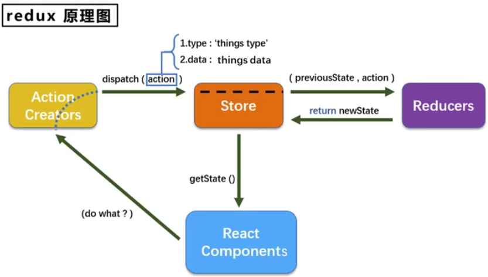
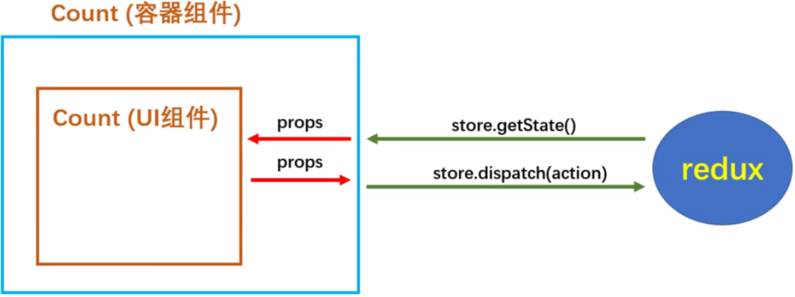

react 高效原因：虚拟dom + diffing算法（最小化页面重绘算法）

# Hello World

下面用的比较老的==版本，react 16.8==

```html
<!DOCTYPE html>
<html lang="en">
<head>
    <meta charset="UTF-8">
    <meta http-equiv="X-UA-Compatible" content="IE=edge">
    <meta name="viewport" content="width=device-width, initial-scale=1.0">
    <title>hello</title>
    <!-- react 的核心库 -->
    <script src="https://unpkg.com/react@16/umd/react.development.js"></script>
    <!-- react 操作 docm 的扩展库 -->
    <script src="https://unpkg.com/react-dom@16/umd/react-dom.development.js"></script>
    <!-- 将jsx语法转成浏览器认识的js语法，react里是jsx语法 -->
    <script src="https://unpkg.com/babel-standalone@6.15.0/babel.min.js"></script>
</head>
<body>
    <div id="dv"></div>

    <script type="text/babel"> // text/babel：表示babel.min.js 将 jsx 转换成浏览器认识的 js
        // 1. 创建虚拟dom
        const vDom = <h1>
            <span>hello world!</span>
        </h1>; // jsx 语法
        // 2. 渲染虚拟dom到页面
        ReactDOM.render(vDom, document.getElementById('dv')); // ReactDOM 大写DOM
    </script>
</body>
</html>
```

# jsx

1）全称 javascript XML

2）是 react 定义的一种类似于 XML 的 js 扩展语法：js + XML

3）本质是 `React.createElement(el, props, ...children)`  的语法糖

4）作用：用来简化创建虚拟 DOM

- 写法：`let el = <h1>Hello React</h1>`
- 注意一：它不是字符串，也不是 HTML / XML 标签
- 注意二：它最终生成的是一个 js 对象

5）标签名任意：HTML 标签或其它标签

<h4>语法规则</h4>

1）定义虚拟 dom 不要加引号

2）虚拟 dom 中混入js表达式==（非js语句，比如 for / if 不行）==，用格式：{变量.方法()}

```react
let id = 'idH1', text = 'hello react';
const vDom = <h1 id={id.toLocaleLowerCase()}>{text.toUpperCase()}</h1>; // 结果：<h1 id="idh1">HELLO REACT</h1>
```

- js 表达式：一个表达式产生一个值、能用 `let x` 接到值的都是表达式，比如

  ```js
  a        // 变量a是一个表达式
  a + b    // 变量 a + b 也是
  fun(a)   // 调用函数 fun 也是
  ar.map()
  function fun() {}
  ```

- 语句（代码）

  ```js
  if () {}
  for () {}
  switch() {}
  ```

3）指定样式名要用 `className`

```css
<style>.cls {background-color: #F00;}</style>
```

```react
let dom = <h1 className="cls">Hello React</h1>
```

4）内联样式要用 `style={{key: value}}` 来写，且多个单词的 'key' 要写成小驼峰（如：font-size => fontSize）

```react
let dom = <h1 style={{backgroundColor: '#F00', color: '#FFF'}}>Hello React</h1>
```

5）只能有一个根标签

```react
let dom = <h1>Hello React</h1>
	<h1>Hello React</h1> // 报错
let dom = <div>
        <h1>Hello React</h1>
		<h1>Hello React</h1>
    </div> // OK
```

6）标签必须要有 '闭合'，否则报错

7）标签首字母

- 若小写开头，则转成 html 同名标签。html 若没有该标签，则报错
- 若大写开头，则渲染成组件。若组件未定义，则报错

8）循环显示一组数据

```react
let ar = [1, 2, 3];
let dom = <ul>
        { ar.map(x => <li>{ 'row - ' + x }</li>) }
    </ul>
// ok 正常显示了，但出现了警告：Warning: Each child in a list should have a unique 'key' prop.
// 因为 react 的 diffing 算法需要这个 'key' 作为唯一值，不加会影响效率
```

```react
// 把循环的下标给标签的 'key' 属性，问题解决！
let ar = [1, 2, 3];
let dom = <ul>
        { ar.map((v, i) => <li key={i}>{ 'row - ' + v }</li>) }
    </ul>;
```

# 开发者工具

```bash
# 1. https://www.jianshu.com/p/a3412a2bcf9e 到这里按提示下载
# 2. 下载后的 .crx 文件重命名为 .zip
# 3. 解压缩该文件
# 4. 谷歌浏览器添加扩展解压后的文件夹
```

# 组件

定义组件分为函数式组件和类式组件

## 1. 函数式组件

用函数定义的组件就叫`函数式组件`

```react
// 1. 创建组件
// 		注意1：函数名就是组件名，但首字母必须大写。
//		注意2：此时方法 A 里的 this 是 undefined 的，因为 babel 编译后开启了严格模式（'use strict' 即不允许 function 的 this 指向 window）
function A() { return <h1>Hello React</h1> }
// 2. 渲染组件
ReactDOM.render(<A />, document.getElementById('dv')); // 注意3：render 第1个参数 <组件名 /> 这么写
```

函数式组件无法用 `state` 和 `refts` 但可以用 `props`，因为函数可以传参

```react
function A(props) { // 自动收集标签传进来的属性到 props 里
    let {name, age} = props; // 解构，=号左边{}括起来与实例同名属性的变量
    return <h1>name：{name}, age：{age}</h1>
}
A.defaultProps = { age: 11 }; // 默认属性 age=11

ReactDOM.render(<A name="gt" />, document.getElementById('dv'));
```


## 2. 类式组件

用类定义的组件就叫`类式组件`，类相关知识参照==附录.类==

```react
// 1. 创建类式组件
class A extends React.Component { // 2. 类名即组件名，必须继承 React.Component
    render() { return <h1>Hello world!</h1> } // 3. render 方法返回组件内容
}
ReactDOM.render(<A />, document.getElementById('dv')); // 4. 渲染组件
```

### 2.1 三大核心 - state

```react
// 这个例子是点击 h1 标签改变里面内容（x 和 y 来回切换）

// 1. 创建类式组件
class A extends React.Component {
    constructor(props) {
        super(props); // 组件属性必须传给父类
        this.state = { b: true }; // 初始化组件状态，state 必须是对象，否则报错
    }
    render() {
        let s = this.state.b ? 'x' : 'y';
        return <h1 onClick={this.click.bind(this)}>{s}</h1>
    }
    click() {
        // 此时 this 是 undefined，参考上面 2.1 里的 this 指向
        // 在构造函数里加上：this.click = this.click.bind(this); 可以解决
        // 或者11行改成：return <h1 onClick={this.click.bind(this)}>{s}</h1>; 加个.bind(this)也可以解决
        console.log(this);
        // this.state.b = !this.state.b; 状态不可直接更改，这么改无效！且不会重新渲染(走render方法)
        this.setState({b: !this.state.b}); // 正确写法需借助内部 API（setState），且该方法会合并原有的state，且每次都会重新render
    }
}
// 2. 渲染组件
ReactDOM.render(<A />, document.getElementById('dv'));
```

```react
// 简写上面例子
class A extends React.Component {
    state = { b: true }; // 参照 2.1 的 a = 1，所以构造函数也省了
	// 注意：构造函数能不写就不写。如果要写，就要加上 super(props)，否则构造函数里的 this.props 为 undefined

    render() {
        let s = this.state.b ? 'x' : 'y';
        return <h1 onClick={this.click}>{s}</h1>
    }
    click = () => { // 匿名函数永远会指向 this
        this.setState({b: !this.state.b});
    }
}
```

### 2.2 三大核心 - props

```react
// 1. 创建类式组件
class A extends React.Component {
    render() {
        return <h1>name：{this.props.name}, age：{this.props.age}</h1> // 显示属性
    }
}
// 2. 渲染组件：往组件里传俩属性
ReactDOM.render(<A name="gt" age={27} />, document.getElementById('dv')); // {27} 传数值类型，默认字符串
```

```react
// 整块数据往组件里传（利用...展开运算符）
let ob = {name: 'gt', age: 27};
ReactDOM.render(<A {...ob} />, document.getElementById('dv'));
```

展开运算符参照==附录.展开运算符==

#### 默认值

```react
class A extends React.Component {
    static defaultProps = { age: 999 }; // 方法一：推荐（参考：附录.类）
    render() {
        return <h1>name：{this.props.name}, age：{this.props.age}</h1>
    }
}
A.defaultProps = { age: 999 }; // 方法二：不推荐
ReactDOM.render(<A name="gt" />, document.getElementById('dv')); // 没给 age 属性，默认显示 999
```

#### 只读不能写

只能读不能写，否则报错

```react
render() {
    this.props.name = 'haha'; // 报：Cannot assign to read only property 'name' of object '#<Object>'
    return <h1>name：{this.props.name}, age：{this.props.age}</h1>
}
```

### 2.3 三大核心 - refs

类似于给标签加个id，然后用document.getElementByid取dom一样。给组件内的html元素加个`ref`属性（类似id），然后用`this.refs.id`取元素对象

#### 2.3.1 字符串refs（==过时==）

官方已经不推荐使用，因为已经是过时了的 api

```react
// 点按钮或焦点离开输入框都弹内容
class A extends React.Component {
    click = () => { alert(this.refs.txt.value) }
    blur = () => { alert(this.refs.txt.value) }
    render() {
        return <div>
            <input onBlur={this.blur} ref="txt" type="text" />
            <button onClick={this.click}>alert</button>
        </div>
    }
}
```

#### 2.3.2 回调refs

```react
// 改下 2.3.1 例子
class A extends React.Component {
    click = () => { alert(this.txt.value) }
    blur = () => { alert(this.txt.value) }
    render() { // ref = { 回调方法，参数是html元素 }。单独提出来个方法也行，如：ref = { this.fun }
        return <div>
            <input onBlur={this.blur} ref={ x => this.txt = x } type="text" />
            <button onClick={this.click}>alert</button>
        </div>
    }
}
```

#### 2.3.3 createRef

`React.createRef()`返回一个容器，用来存放 ref 标识的结点。注意：容器里只能存一个 ref，即 “专人专用”

```react
class A extends React.Component {
    myRef = React.createRef() // 创建容器
    click = () => { alert(this.myRef.current.value) } // 要用 current 取
    blur = () => { alert(this.myRef.current.value) }
    render() {
        return <div>                 {/* 绑定 ref。如果在多个元素上绑定，则最后一个会覆盖前面的 */}
            <input onBlur={this.blur} ref={ this.myRef } type="text" />
            <button onClick={this.click}>alert</button>
        </div>
    }
}
```

# 事件处理

官方说不要过渡使用 refs，会影响效率，尽可能少写 ref

```react
// 比如，焦点离开后 alert 内容，就没必要用 ref
class A extends React.Component {
    blur = e => alert(e.target.value) // 凡是事件都会返回 event，通过 target 取元素
    render() {
        return <input onBlur={this.blur} type="text" />
    }
}
```

# 表单

## 非受控组件

表单里的输入控件现用现取

```react
login = () => {
    let { account, password } = this; // 解构出来
    alert(`${account.value}, ${password.value}`);
}
render() {
    return <form>
    	<input type="text" name="account" ref={ x => this.account = x } />
        <input type="password" name="password" ref={ x => this.password = x } />
        <button type="button" onClick={this.login}>登陆</button>
    </form>
}
```

## 受控组件

```react
state = {account: ''} // 初始化状态
change = e => this.setState({account: e.target.value}) // 将输入的内容保存到状态里

render() {
    return <form>                         {/* 添加 change 事件 */}
        <input type="text" name="account" onChange={this.change} />
        <button type="button">登陆</button>
    </form>
}
```

```react
// 保存表单所有项目到状态里，方法一：
state = {account: '', password: ''} // 初始化
saveFormToState = k => e => this.setState({[k]: e.target.value}) // 传进来下标k，返回设置状态的闭包函数。[k]参考`附录.str作为ob.key`
login = () => alert(`${this.state.account}, ${this.state.password}`) // 显示内容
render() {
    return <form>
        <input type="text" name="account" onChange={this.saveFormToState('account')} />
        <input type="password" name="password" onChange={this.saveFormToState('password')} />
        <button type="button" onClick={this.login}>登陆</button>
    </form>
}
```

```react
// 保存表单所有项目到状态里，方法二：
saveFormToState = e => this.setState({[e.target.name]: e.target.value}) // 通过name取k
render() {
    return <form>
        <input type="text" name="account" onChange={this.saveFormToState} />      {/* 与上面不同，这里不用传k */}
        <input type="password" name="password" onChange={this.saveFormToState} /> {/* 与上面不同，这里不用传k */}
        <button type="button" onClick={this.login}>登陆</button>
    </form>
}
```

# 生命周期

## 旧版16.8

`componentWillMount`：render 之前（组件将要挂载）调用，且只调用一次

`componentDidMount`：render 之后（即组件挂载完毕后）调用，且只调用一次

`componentWillUnmount`：组件卸载前调用

`shouldComponentUpdate `：返回 true 重新渲染，false 则不渲染。默认返回true

`componentWillUpdate`：render 之前调用（组件将要更新）

> ==挂载顺序：==
>
> 构造器 -> componentWillMount -> render -> componentDidMount

> ==更新顺序：==
>
> 父组件render -> componentWillReceiveProps -> shouldComponentUpdate -> componentWillUpdate -> 当前组件render -> componentDidUpdate
>
> ```react
> // 比如这种两个父子关系的组件才能有这种顺序效果（B是A的子组件）
> class A extends React.Component {
>     state = {text: 'A text'}
>     click = () => this.setState({text: 'BBBB'})
>     render() {
>         return <div>
>             <button onClick={this.click}>button</button>
>             <div>A</div>
>             <B text={this.state.text} />
>         </div>
>     }
> }
> class B extends React.Component {
>     // 当点击A组件按钮时，这个勾子被触发
>     // 页面初始化后不会触发，只有点按钮才触发
>     // 并且还能得到父组件传过来的参数 ---> props
>     componentWillReceiveProps(props) { console.log('componentWillReceiveProps'); }
>     
>     render() { return <div>B, {this.props.text}</div> }
> }
> ```

> ==setState顺序：==
>
> shouldComponentUpdate -> componentWillUpdate -> 当前组件render -> componentDidUpdate

> ==forceUpdate顺序==（强制更新，即不调setState情况下记组件重新渲染）：
>
> componentWillUpdate -> 当前组件render -> componentDidUpdate

## 新版17.02

```js
componentWillMount => UNSAFE_componentWillMount
componentWillUpdate => UNSAFE_componentWillUpdate
componentWillReceiveProps => UNSAFE_componentWillReceiveProps
// 新版这3个要加上 UNSAFE_
// 旧版的`顺序`可以用于新版的`顺序`（前提是这3个勾子加上了UNSAFE_），但是官方给了最新的生命周期图，还是要用新的
```

> ==挂载顺序==：
>
> 构造器 -> getDerivedStateFromProps -> render -> componentDidMount

> ==更新顺序==：由 new Props、setState、forceUpdate 触发
>
> getDerivedStateFromProps -> shouldComponentUpdate -> render -> getSnapshotBeforUpdate -> componentDidUpdate

```js
// 这个勾子一般用不到，只有一种场景适用；即 state 时刻取决于 props
// 1. 需要加 `static`
// 2. 参数传进来了组件的 props 和 state
static getDerivedStateFromProps(props, state) {
    // 可以返回 null 或 this.state 里包裹的对象。
    // 一般就返回 null
    // 如果返回state对象，就会覆盖 state。比如写死 return { count: 100 }，此时组件再怎么操作都会是100
    return null;
}
```

```js
 // 传进来旧（更改前）的props和旧（更改前）的state。val 是 getSnapshotBeforUpdate 的返回值
componentDidUpdate(prevProps, prevState, val) { ... }
```

```js
// 这个勾子一般用不到
// 在渲染之前调用（使得组件发生更改前从DOM捕获些信息，如滚轮位置）
getSnapshotBeforUpdate(prevProps, prevState) { // 传进来旧（更改前）的props和旧（更改前）的state
    return null; // 返回值给 componentDidUpdate 的第3个参数
}
```

# diffing算法

1）虚拟DOM中key的作用：

- 简单说：key是虚拟DOM对象的标识，在更新显示时key起类似db里主键作用
- 详细说：当状态中数据发生变化时，react会根据`新数据`生成`新虚拟DOM`，然后新旧虚拟DOM进行diff比较，规则如下：
  - 旧虚拟DOM中找到了与新虚拟DOM相同的key：
    - 若虚拟DOM中内容没变，直接使用之前的真实DOM
    - 若虚拟DOM中内容变了，则生成新的真实DOM替换之前的真实DOM
  - 旧虚拟DOM中未找到与新虚拟DOM相同的key，根据数据创建真实DOM，随后渲染

2）用map里的index作为key可能引发的问题：

- 若对数据进行：逆序添加、逆序删除等破坏顺序操作，会产生没有必要的真实DOM更新（界面效果没问题，但效率底）
- 若结构中还包括输入类DOM，会产生错误DOM更新（界面看同样没问题）
- 注意！若不存在对数据的逆序添加、逆序删除等破坏顺序操作，仅用于渲染展示，使用 index 作为 key 没问题
- ==解决==：用数据的唯一id作为key值

# 脚手架

整体架构为：react + webpack + es6 + eslint

## 1. 创建并启动

```bash
# 1. 全局安装脚手架
cnpm i -g create-react-app
# 2. 创建项目
create-react-app 项目名
# 3. 启动
cnpm start
```

## 2. 其它命令

```bash
cnpm run build # 打包编译成静态文件给生产环境用
cnpm test      # 运行测试环境，一般用不到
cnpm run eject # 默认隐藏了所有 webpack 相关的配置文件，该命令为显示所有配置文件。一旦执行显示，就无法再隐藏回去
```

## 3. index.html

```html
<!DOCTYPE html>
<html lang="en">
  <head>
    <meta charset="utf-8" />
    <!-- %PUBLIC_URL% 脚手架里的public路径 -->
    <link rel="icon" href="%PUBLIC_URL%/favicon.ico" />
    <!-- 用于移动端网页适配 -->
    <meta name="viewport" content="width=device-width, initial-scale=1" />
    <!-- 浏览器页签 + 地址栏颜色（只支持安卓原生系统的浏览器） -->
    <meta name="theme-color" content="#000000" />
    <!-- 网站介绍，用于搜索引擎seo -->
    <metaname="description"content="Web site created using create-react-app"/>
    <!-- 添加到手机桌面上的应用图标 -->
    <link rel="apple-touch-icon" href="%PUBLIC_URL%/logo192.png" />
    <!-- 应用加壳时的配置文件 -->
    <link rel="manifest" href="%PUBLIC_URL%/manifest.json" />
    <title>React App</title>
  </head>
  <body>
    <!-- 当浏览器不支持js时，显示这句话 -->
    <noscript>You need to enable JavaScript to run this app.</noscript>
    <div id="root"></div>
  </body>
</html>
```

## 4. index.js

看似 index.html 没有引这个文件，其实是在隐藏的webpack.config.js里配的

```react
import React from 'react';
import ReactDOM from 'react-dom';
import './index.css';
import App from './App';
import reportWebVitals from './reportWebVitals';

ReactDOM.render(
  <React.StrictMode> {/* 检索写的不合理的地方 */}
    <App />
  </React.StrictMode>,
  document.getElementById('root')
);

// If you want to start measuring performance in your app, pass a function
// to log results (for example: reportWebVitals(console.log))
// or send to an analytics endpoint. Learn more: https://bit.ly/CRA-vitals
reportWebVitals(); // 项目性能监测
```

## 5. 手动创建应用

1）把 public 和 src 文件夹删掉

2）重新创建 public/index.html：程序入口页面

```html
<div id="root"></div>
```

3）重新创建 src/index.js：入口js

```react
import React from 'react';   // 引入核心库
import Dom from 'react-dom'; // 引入dom
import App from './App';     // 引入App。可以叫App.jsx用来区分组件还是一般js文件（注意：改成.jsx后必须重新npm start，否则报错）

Dom.render(<App/>, document.getElementById('root'));
```

4）创建 src/App.js

```react
// 这里应该是主的组件（相当于main函数一样），其它组件都应该从这里引入并应用
import {Component} from 'react';
import Hello from './components/Hello'; // 因为组件Hello的文件名是index.jsx，所以引入时直接引/Hello就可以

class App extends Component { // export class 是直接暴露
    render() { return <Hello/> }
}

export default App; // 默认暴露
```

5）创建Hello组件

```react
// src/components/Hello/index.jsx
// 这里敲上 rcc + 回车会生成下面代码（rfc生成函数组件）
import {Component} from 'react';

export default class Hello extends Component { render() { return <h1>Hello</h1> } }
```

# 样式组件化

防止各组件的.css文件中有同名的class，导致import进来的覆盖前面的

```react
// 1. index.css 改名为 index.module.css（假设有个.title的class）
// 2. 引入css：import 'index.css' 改成
import hello from './index.module.css';
// 3. 应用
<div className={hello.title}></div>
// 4. 多class
<div className={[hello.title, hello.blue].join(' ')}></div>
```

# 标签元素

## checkbox

```react
<input type="checkbox" defaultChecked={this.state.b} /> // defaultChecked 初期化时给个默认值（只走一次）
// 如果直接 checked={this.state.b} 的话，页面上就没法点这个checkbox了（除非加onChange控制）
```

# 类型限制

```react
import PropTypes from 'prop-types'; // 1. 先 npm i prop-types

export default class Hello extends Component {
    static propTypes = { // 2. static
        p1: PropTypes.number.isRequired, // 数值型、必须
        p2: PropTypes.object.isRequired  // {}型、必须
        // 类型还有：string、array、func、bool、symbol 等
    }
    render() { return <h1>Hello-{this.props.p1}-{this.props.p2.a}</h1> } // 用p1、p2参数
}

// 调用 Hello 组件
export default class App extends Component {
    // 如果给了不正确类型或没传必须参数，浏览器上f12后会看到红色报错，但画面依然正常显示
    render() {return <Hello p1={7} p2={{a: 'haha'}} />} // 传 p1、p2参数
}
```

# axios

1）封闭了 XmlHttpRequest 对象的 ajax

2）promise 风格

3）可以用在浏览器端和 node 服务端应用（双端应用）

4）比 jquery 更轻

## 1. 安装

```bash
cnpm i axios
```

## 2. 例子

```react
import axios from '_axios@0.21.1@axios';

render() {
    axios.get('http://localhost:8080').then(
        y => console.log(y.data), // 成功回调，数据在.data里
        n => console.log(n) // 失败回调
    );
    return <h1>haha</h1>
}
```

## 3. 配置代理

### 3.1 方法一

只能配置一个代理

```json
// 1. 在 package.json 添加代理
"proxy": "http://localhost:8080" // 服务端的 ip:port
```

```react
// 2. 修改请求地址
axios.get('http://localhost:3000/home') // 3000没有的资源找8080要！
//		注意两点：
//			1. 3000是客户端的端口
//			2. axios 请求的地址不能在客户端存在，否则返回的是客户端。如：
//				http://localhost:3000 返回的是 http://localhost:3000/index.html 的内容
```

### 3.2 方法二

```js
// 1. 创建 src/setProxy.js
const proxy = require('http-proxy-middleware');

module.exports = function(app) {
    app.use(
        proxy('/api1', { // 第1个代理，遇到 /api1，应付触发 8080 代理
            target: 'http://localhost:8080', // 转发给后端
            changeDrigin: true, // 默认 false，控制服务端收到响应头中 host 字段的值
            pathRewrite: { '^/api1': '' } // 将请求前将api1替换为空，否则无法请求服务端8080
        }), proxy('/api2', { // 第2个代理
            target: 'http://localhost:8081', // 第2个请求8081
            changeDrigin: true,
            pathRewrite: { '^/api2': '' }
        })
    );
}
```

```react
// 2. 组件文件
//		服务8080：http://localhost:8080/home ==> 返回 haha
//		服务8081：http://localhost:8081      ==> 返回 index
import {Component} from 'react';
import axios from '_axios@0.21.1@axios';

export default class App extends Component {
    click = x => {
        return _ => {
            let ar = x === 8080 ? ['api1', '/home'] : ['api2', ''];
            // ${ar[0]}${ar[1]}：api1/home 或 api2（api2后不能有/，否则访问不到）
            axios.get(`http://localhost:3000/${ar[0]}${ar[1]}`).then(
                y => console.log(y.data),
                n => console.log(n)
            );
        }
    }
    render() {
        return <div>
            <button onClick={this.click(8080)}>请求服务8080</button>
            <button onClick={this.click(8081)}>请求服务8081</button>
        </div>
    }
}
```

## 4. 拦截

```js
import axios from 'axios';

axios.interceptors.request.use(cf => {
    // 请求前发生，可用来取token，如果没取到，则跳到login画面
    return cf;
}, err => Promise.reject(err)); // 请求前报错，一般不容易发生

axios.interceptors.response.use(res => {
    // 正常返回，一般可判断是否是业务错误
    // 如：res.data.success，当然 success 是后台定的结构
    return res.data;
}, err => {
    // 服务器报错会进来，如：401、403、404
    return Promise.reject(err);
});

export default axios; // 其它地方用的时候就 import 该文件
```

## 5. 终止请求

```js
axios.interceptors.request.use(req => {
    throw new axios.Cancel('cancel req'); // 终止
}, err => Promise.reject(err));
```


# fetch

和 axios 区别在于，fetch 是浏览器原生的，而 axios 是个库。==（用的少，因为有的浏览器不兼容）==

```js
fetch(url).then(
	y => { console.log('连接服务器成功'); return r.json(); },
    // n => console.log('连接服务器失败') // 是没连上服务器才报的错，像404、403都不会走这里，因为404、403是服务器返回的
    //									   或谷歌浏览器开发工具 -> Network -> No throttling 改成 Offline
).then(
	y => console.log('服务器返回的数据是：', y),
    // n => console.log('获取数据失败')
).catch(x => console.log('失败', x)); // 上面两个错误可以统一在这里
```

```js
// 简单的取服务端方法
let res = await fetch(url);
let data = await res.json();
```

# 消息发布订阅

适用于多个组件间消息通讯，避免了父子之间传来传去太过麻烦

```bash
yarn add pubsub-js # 添加依赖
```

```react
import PubSub from 'pubsub-js';

PubSub.publishSync('topic1', 'haha'); // 发布
let token = PubSub.subscribe('topic1', (m, d) => console.log(m, d)); // 订阅，结果：topic1 haha
PubSub.unsubscribe(token); // 取消订阅
```

# 槽（slot）

```react
// 父组件
render() { return <A>
		<h1>haha</h1>
    	<h2>haha</h2>
	</A>
} // 也可以通过 <A children={<h1>haha</h1>} /> 往子组件里传
```

```react
// 子（A）组件
render() { return <div>{this.props.children}</div> }
```

# 路由

## 1. react-router-dom

react 的一个插件库，专门用来实现SAP（web）应用，基于 react 项目基本都会用到

```bash
yarn add react-router-dom # 添加依赖
```

### 1.1 Link

相当于 `a` 标签

```react
import {Link, BrowserRouter, HashRouter, Route} from 'react-router-dom';
import Home from './Home';
import About from './About';

render() {
    return <div>
        // 也可以换成 HashRouter，作用参考上面
        <BrowserRouter> // 1. 一组路由只能放在一个 BrowserRouter 或 HashRouter 里，一般会放到 App 最外层组件里
        	<Link to="/home">Home</Link> // to 相当于 href
            <Link to="/about">About</Link>
    		<Route path="/home" component={Home} />   // path 绑定哪个 Link.to，component 绑定该路由要跳哪个组件
       		<Route path="/about" component={About} />
        </BrowserRouter>
    </div>
}
```

### 1.2 NavLink

用于设置被点的 `a` 标签的 class

```react
<NavLink activeClassName="cls1" to="/home">Home</NavLink> // 被点后 class='cls1'，不写的话默认class='active'
// 可以把 activeClassName 和 className 封装进一个普通组件里，用新封装的NavLink就不必写这两个属性了
```

### 1.3 Switch

```react
// 如果一个 path 绑了多个组件，那么当点了 /home 后，Home 和 About 两个组件都会显示
<Route path="/home" component={Home} />
<Route path="/home" component={About} />
// 外面包一层 Switch，就不会多个都显示了，会显示第一个与 path 配置的组件（这里是 Home）
<Switch>
    <Route path="/home" component={Home} />
    <Route path="/home" component={About} />
</Switch>
```

### 1.4 Route.exact

属性 exact 用于开启严格匹配，一般不要加，需要时候再加。有时候加了会导致无法匹配二级路由

```react
<Link to="/home/a/b">Home</Link>               // 当点了 /home/a/b 后
<Route path="/home" component={Home} />        // 也会匹配到 Home 组件
<Route exact path="/home" component={Home} />  // 但当加上 exact 属性后就不会匹配到了
```

### 1.5 Redirect

当没有任何匹配的路由时，走这个重定向路由

```react
<Route path="/home" component={Home} />
<Route path="/about" component={About} />
<Redirect to="/about" /> // 当 localhost:3000/ 时，默认显示 About 组件（不写就哪个组件也不显示）
```

### 1.6 多级(嵌套)路由

```react
// app 组件
render() {
    return <div>
        <HashRouter>
            <Link to="/home">Home</Link> <br/>
            <Link to="/about">About</Link>
            // home 下显示 news 和 message 两个子组件
            // 此时若开启严格模式（exact），news 和 message 就无法显示了
            <Route path="/home" component={Home} />
            <Route path="/about" component={About} />
        </HashRouter>
    </div>
}
```

```react
// home 组件
render() {
    // home 下的二级路由要 /home/**
    return <div>
        <NavLink to="/home/news">News</NavLink><br/>
        <NavLink to="/home/message">Message</NavLink>
        <Switch>
            <Route path="/home/news" component={News} />
            <Route path="/home/message" component={Message} />
        </Switch>
    </div>
}
```

### 1.7 给路由传参

**方法一：**传 props.match.params 参数

```react
// 在上面 1.6 基础上
// Detail 组件
render() {
    let {id, msg} = this.props.match.params; // 传过来的参数在 props.match.params 里
    return <div>
        <div>ID: {id}</div>
        <div>MSG: {msg}</div>
    </div>
}
```

```react
// Message 组件
ar = [{id: 1, msg: '消息1'}, {id: 2, msg: '消息2'}, {id: 3, msg: '消息3'}];
render() {
    return <ul>
        // 动态传参
        {this.ar.map(x => <li key={x.id}><Link to={`/home/message/detail/${x.id}/${x.msg}`}>{x.msg}</Link></li>)}
        <Route path="/home/message/detail/:id/:msg" component={Detail} /> // 声明参数
    </ul>
}
```

**方法二**：传 props.location.search 参数

```react
{
    this.ar
        .map(x => <li key={x.id}>
                 <Link to={`/home/message/detail?id=${x.id}&msg=${x.msg}`}>{x.msg}</Link>
             </li>)
} // 传参

<Route path="/home/message/detail" component={Detail} /> // 声明

import qs from 'querystring'; // 参考 附录.querystring
let {id, msg} = qs.parse(this.props.location.search.slice(1)); // 取参。slice：先去掉第1位的?号
```

**方法三**：传 props.location.state 参数。上两种参数会出现在地址栏里，这种不会

```react
{
    this.ar.map(x => 
        <li key={x.id}>
            // replace 外层若是 BrowserRouter 可以不加，若是 HashRouter 则必须要加，否则只有第1次点好用
            // pathname：定义路由
            // state：传的参数
            <Link replace to={{pathname: '/home/message/detail', state: {id: x.id, msg: x.msg}}}>{x.msg}</Link>
            // 不写 replace 默认是 push 压栈这种，点浏览器回退是一层一层退，不会错过任何一个历史（有痕）
            // 而加了 replace 就意味着会替换之前的，回退时会错过好多历史（无痕）
        </li>
    )
}
<Route path="/home/message/detail" component={Detail} /> // 声明
let {id, msg} = this.props.location.state; // 取得参数
```

### 1.8 编码方式跳转

```js
// params方式
this.props.history.replace(`/home/message/detail/${id}/${msg}`); // 无痕
this.props.history.push(`/home/message/detail/${id}/${msg}`); // 有痕
// search方式
this.props.history.replace(`/home/message/detail?id=${id}&msg=${msg}`); // 无痕
this.props.history.push(`/home/message/detail?id=${id}&msg=${msg}`); // 有痕
// state方式
this.props.history.replace(`/home/message/detail`, {id: id, msg: msg}); // 无痕
this.props.history.push(`/home/message/detail`, {id, msg}); // 有痕
```

### 1.9 WithRouter

用于加工一个`一般组件`，使其拥有`路由组件`的特有属性

```react
import { NavLink, Route, Switch, withRouter } from 'react-router-dom'; // 1. 引入 withRouter
import News from './News';
import Message from './Message';

class index extends Component {
    back = _ => {
        this.props.history.goBack();    // 5. 后退
    }
    go = _ => {
        this.props.history.goForward(); // 4. 前进
    }

    render() { 
        return <div>
            // 3. 在一般组件 Home 里加前进和后退按钮
            <button onClick={this.back}>回退</button>&nbsp;<button onClick={this.go}>前进</button>
            <NavLink to="/home/news">News</NavLink><br/>
            <NavLink to="/home/message">Message</NavLink>
            <Switch>
                <Route path="/home/news" component={News} />
                <Route path="/home/message" component={Message} />
            </Switch>
        </div>
    }
}

export default withRouter(index); // 2. 要暴露一个 withRouter
```

## 2. 一般 & 路由组件

组件分为一般组件和路由组件

```react
<Home />                                 // 这是一般组件
<Route path="/home" component={Home} />  // 这是路由组件
// 当在路由组件 Home 里 console.log(this.props) 时，会出现：
history: {length: 32, action: "PUSH", location: {…}, createHref: ƒ, push: ƒ, …}
location: {pathname: "/home", search: "", hash: "", state: undefined}
match: {path: "/home", url: "/home", isExact: true, params: {…}}
staticContext: undefined
// 说明路由器会自动给路由组件里传以上这些参数
```

## 3. 多级路由的问题

```react
// 当二级路由场合，点完这个标签再f5刷新页面，结果发现css文件没加载进来
<Route path="/user/home" component={Home} />
// 查看 public/index.html发现，css是这么引的
<link rel="stylesheet" href="./css/bootstrap.css" />

// 第一种解决办法：把 /css 前面的 . 去掉
<link rel="stylesheet" href="/css/bootstrap.css" />
// 第二种解决办法：换成%PUBLIC_URL%
<link rel="stylesheet" href="%PUBLIC_URL%/css/bootstrap.css" />
// 第三种解决办法：把 BrowserRouter 换成 HashRouter
```

## 4. Hash / Browser Router

HashRouter 与 BrowserRouter 的区别：

1. 底层原理：
   - BrowserRouter  用 H5 的 history API，不兼容IE9及以下版本
   - HashRouter 底层实现是URL的哈希值
2. url 表现形式：
   - BrowserRouter：localhost:3000/home/news
   - HashRouter：localhost:3000/#/home/news，其==#==号后的内容不会发送给服务端
3. 刷新后对路由 state 传参的影响（==重要==）
   - BrowserRouter 没有任何影响，因为 state 保存在 history 对象中
   - HashRouter 刷新后会导致 state 参数丢失
4. HashRouter 可用于解决一些路径错误相关的问题

# UI 组件库

## 1. 流行的UI介绍

1）material-ui：国外的

- 官网：http://material-ui.com
- github：https://github.com/callemall/material-ui

2）ant-design：国内蚂蚁金服的

- 官网：https://ant.design/index-cn
- github：https://github.com/ant-design/ant-design

3）element-ui for react

## 2. ant-design（antd）

组件介绍：https://ant.design/components/overview-cn/

看更详细的文档说明：官网首页 -> 文档 -> 版本先3.x

```bash
yarn add antd # 安装
```

```js
import { Button } from 'antd';   // 引入按钮
import 'antd/dist/antd.css';     // 引入所有组件的所有样式
import 'antd/dist/antd.min.css'; // 5.0 以后会报警告，改成 .min.css 就 ok 了

<Button type="primary">Primary Button</Button>
```

### 2.1 按需引入

单写`import 'antd/dist/antd.css';`是很大的，就算打包后至少有60k，这样不好

```bash
# 1. 引入 react-app-rewired 和 customize-cra
# yarn add react-app-rewired customize-cra # 3.x 版

yarn add @craco/craco
```

```json
// 2. 修改 package.json 里的启动配置
/*"scripts": {
    "start": "react-app-rewired start", // "react-scripts start",
    "build": "react-app-rewired build", // "react-scripts build",
    "test": "react-app-rewired test" // "react-scripts test"
}*/ // 3.x 版

"scripts": {
    "start": "craco start", // "react-scripts start",
    "build": "craco build", // "react-scripts build",
    "test": "craco test"    // "react-scripts test",
}
```

```bash
# 3. 引入 babel-plugin-import（用于按需加载组件代码和样式的 label 插件）
yarn add babel-plugin-import
```

```js
// 4. 根目录下创建 config-overrides.js // 3.x 版
/*const { override, fixBabelImports } = require('customize-cra');

module.exports = override(
    fixBabelImports('import', {
        libraryName: 'antd',
        libraryDirectory: 'es',
        style: 'css' // 表示按需引入的是 css
    })
);*/ // 3.x 版

// 4. 根目录下创建 craco.config.js     // 4.x 版
module.exports = {
    babel: {
        plugins: [
            ['import', {libraryName: 'antd', libraryDirectory: 'es', style: 'css'}]
        ]
    }
};
```

```js
// 5. 删掉组件里引入的css
import 'antd/dist/antd.css'; // 删掉
```

### 2.2 自定义主题

原理：找到 antd.less，改到它的主题颜色，让其自动编译成 css

```bash
# 1. 安装 less
# yarn add less less-loader # 3.x 版

yarn add craco-less # 4.x 版
```

```js
// 2. 根目录下 craco.config.js
const CracoLessPlugin = require('craco-less');

module.exports = {
    babel: {
        plugins: [
            ['import', {libraryName: 'antd', libraryDirectory: 'es', style: true}] // 这里要改成 true
        ]
    },
    plugins: [{
        plugin: CracoLessPlugin,
        options: {
            lessLoaderOptions: {
                lessOptions: {
                    modifyVars: { '@primary-color': '#1DA57A' }, // 绿色主题
                    javascriptEnabled: true,
                }
            }
        }
    }
]};
```

```react
// 3. 启动后发现：
<Button type="primary">Primary Button</Button> // 由原来蓝色按钮变成了绿色按钮
```

### 2.3 icon

```bash
yarn add @ant-design/icons # 安装
```

### 2.4 表单

> 表单验证通过后提交

```react
import { Form, Input, Button } from 'antd';
import { register } from '../../api/register';

export default function Register(props) {
    // 1. 创建 from
    const [form] = Form.useForm();
    const rules = { // 表单项验证规则
        account: [{ required: true, message: '请输入用户名！' }],
        password: [{ required: true, message: '请输入密码！' }],
        passwordConfirm: [{ required: true, message: '请输入确认密码！' }]
    };
    // 2. 表单提交事件
    const onFinish = async o => console.log(await register(o));
    // 3. form={form} 用于 useForm 和页面表单绑定
    // 4. onFinish={onFinish} 表单提交事件，即验证通过后的处理
    // 5. rules={rules.account} 绑定表单项验证规则
    // 6. htmlType="submit" 指定按钮为提交按钮
    return <Form form={form} onFinish={onFinish}>
        <Form.Item name="account" rules={rules.account}>
            <Input placeholder="用户名" />
        </Form.Item>
        <Form.Item name="password" rules={rules.password}>
            <Input.Password placeholder="密码" />
        </Form.Item>
        <Form.Item name="passwordConfirm" rules={rules.passwordConfirm}>
            <Input.Password placeholder="确认密码" />
        </Form.Item>
        <Form.Item>
            <Button type="primary" htmlType="submit">注册</Button>
        </Form.Item>
    </Form>;
}
```

> 必填项 + 数字验证（限制）

```react
<Form.Item
    label="端口："
    name="port"
    rules={[
        { required: true, message: '请输入端口' },
        {
            type: 'integer',
            message: '请输入数字',
            transform: x => Number(x) // 注意：需要转成数值型才能通过验证
        }
    ]}>
    <Input maxLength="4" />
</Form.Item>
```

### 2.5 树右键菜单

```react
import { Tree, Menu, Dropdown } from 'antd';

// 可以直接返回<Menu
// 也可以返回闭包，在闭包里返回 <Menu，这样就可以根据右键不同位置显示不同的 menu
const menu = (
    <Menu>
        <Menu.Item key="1" onClick={ _ => console.log('menu 1') }>1st menu item</Menu.Item>
        <Menu.Item key="2">2nd menu item</Menu.Item>
        <Menu.Item key="3">3rd menu item</Menu.Item>
    </Menu>
);
// 1. Dropdown 里包 Tree
// 2. overlay={menu} trigger={['contextMenu']}
return <Dropdown overlay={menu} trigger={['contextMenu']}>
    <Tree
        showIcon
        blockNode={true}
        defaultExpandAll
        switcherIcon={<DownOutlined />}
        loadData={onLoadData}
        treeData={makeNodes(props.nodes)}
    />
</Dropdown>
```

### 2.6 警告解决

#### 2.6.1 missing dependency

> React Hook useEffect has a missing dependency: 'props'. Either include it or remove the dependency array. However, 'props' will change when *any* prop changes, so the preferred fix is to destructure the 'props' object outside of the useEffect call and refer to those specific props inside useEffect  react-hooks/exhaustive-deps

```react
useEffect(_ => {
    request('AllConnect', { json: '' }).then(x => props.load(x.data));
}, []); // eslint-disable-line react-hooks/exhaustive-deps
// 加上上面注释就 ok 了
```

#### 2.6.2 default case

> Expected a default case  default-case

```react
// 原因是 swich case 时没加 default，加上就行了
```

#### 2.6.3 `useForm` is not

> Instance created by `useForm` is not connected to any Form element. Forget to pass `form` prop?

```react
// 因为你在调用 form 方法时，Modal 还未初始化导致 form 没有关联任何 Form 组件
// 可以通过给 Modal 设置 forceRender 将其预渲染
import { useEffect } from 'react';
// 1. 在 hook 里 form.setFieldsValue
useEffect(_ => form.setFieldsValue({ name: 'kkk'}); // 初始化表单内容，用于编辑画面
return <Modal
      forceRender={true}       // 2. 设置强制渲染
      // destroyOnClose={true} // 3. 不能设置`关闭即销毁`
/>
```

# fontawesome

```bash
# 安装
yarn add @fortawesome/fontawesome-svg-core
yarn add @fortawesome/free-solid-svg-icons
yarn add @fortawesome/react-fontawesome
```

```react
import { FontAwesomeIcon } from '@fortawesome/react-fontawesome';
import { faAddressBook } from '@fortawesome/free-solid-svg-icons';

<FontAwesomeIcon icon={faAddressBook} /> // antd 里用直接加上这行就行
```


# redux

中文文档：http://redux.org.cn

## 1. 是什么

1）是一个专门用于==状态管理==的库（不是 react 插件库）

2）可用在 react、angular、vue（有自己的 vuex） 等项目中，但基本与 react 配合使用

3）作用是集中管理 react 应用中多个组件==共享==状态

## 2. 什么情况下用

1）某组件状态需要让其它组件随时拿到

2）一个组件需要改变另一组件的状态（通信）

3）原则：能不用就不用，如果不用比较吃力再考虑用

## 3. 三个核心概念



### 3.1 action

1）动作对象

2）包含2个属性

- type：标识属性，值为字符串，唯一且必要属性
- data：数据，任意值类型，可选属性（初次是没有值的）

3）例如：{ type: 'ADD_PRODUCT', data: { name: '手机', price: '3999' }}

### 3.2 reducer

`好比饭店后厨`

1）用于初始化状态、加工状态

2）加工时根据旧的 state 和 action，产生新的 state 的==纯函数==

### 3.3 store

将 state、action、reducer 联系在一起的对象（`好比饭店老板`）

> **store API**

```js
getState();            // 返回 store 里维护的数据
dispatch(xx);          // 分发，调用 reducer 改状态
subscribe(x => xxx)    // 监听 store 状态，当发生变化后会走 subscribe 里的方法体
```

## 4. 求和示例(精减)

这是一个 redux 精减版示例

```bash
yarn add redux # 1. 安装
```

```js
// 2. 创建 reducer，文件 count_reducer.js 
// 	  2.1. 为 Count 组件服务的 reducer
//    2.2. 会接到俩参数：之前的状态(pre)，动作对象(action)
export default function countReducer(pre = 0, action) { // pre 初始化 0
    let { type, data } = action;
    switch(type) {
        case 'add':
        case 'addJ':
        case 'addAsync':
            return pre + data;
        case 'sub':
            return pre - data;
        default:
            return pre;
    }
}
```

```js
// 3. 创建 store，文件 store.js
// createStore：专门创建 redux 中最核心的 store 对象
import { createStore } from "redux";
// 引入为 Count 组件服务的 reducer
import countReducer from './count_reducer';

export default createStore(countReducer); // 暴露
```

```js
// 4. 监听 state 发生变化后，重新渲染，文件 index.js
dom.render(<App />, document.getElementById('root')); // 最开始挂载 App 组件
//	  监听 state 状态改变
store.subscribe(_ => dom.render(<App />, document.getElementById('root'))); // 每当 state 变化后再重新渲染 App 组件
```

```react
// 5. 在 Count 组件里应用
import React, { Component } from 'react';
import store from '../../redux/store';

export default class Count extends Component {
    selectValue = 0;

    add = _ => {
        store.dispatch({ type: 'add', data: Number.parseInt(this.selectValue) }); // 改状态，负责调 countReducer
    }
    sub = _ => {
        store.dispatch({ type: 'sub', data: Number.parseInt(this.selectValue) });
    }
    addJ = _ => {
        if (store.getState() % 2 === 1) { // 取状态
            store.dispatch({ type: 'addJ', data: Number.parseInt(this.selectValue) });
        }
    }
    addAsync = _ => {
        setTimeout(_ => store.dispatch({ type: 'addAsync', data: Number.parseInt(this.selectValue) }), 1);
    }
    change = el => {
        this.selectValue = el.target.value;
    }

    render() {
        return (
            <div>
                <h1>求和为：{store.getState()}</h1>
                <select onChange={this.change}>
                    <option value={0}></option>
                    <option value={1}>1</option>
                    <option value={2}>2</option>
                    <option value={3}>3</option>
                </select>&nbsp;&nbsp;
                <button onClick={this.add}>+</button>&nbsp;&nbsp;
                <button onClick={this.sub}>-</button>&nbsp;&nbsp;
                <button onClick={this.addJ}>奇数加</button>&nbsp;&nbsp;
                <button onClick={this.addAsync}>异步加</button>
            </div>
        )
    }
}
```

## 5. 略完整版示例

比上一个精减版的多了一个 action

```js
// 1. 添加 action，文件 count_action.js
// 	  专门为 Count 组件生成 action 对象

// 加法 action
export const createAddAction = data => ({ type: 'add', data });
// 减法 action
export const createSubAction = data => ({ type: 'sub', data });
```

```js
// 2. 修改 Count 组件
import { createAddAction, createSubAction } from '../../redux/count_action';

add = _ => {
    store.dispatch(createAddAction(Number.parseInt(this.selectValue))); // 利用加法 action 创建
}
sub = _ => {
    store.dispatch(createSubAction(Number.parseInt(this.selectValue)));
}
addJ = _ => {
    if (store.getState() % 2 === 1) {
        store.dispatch(createAddAction(Number.parseInt(this.selectValue)));
    }
}
```

## 6. 异步action

常用于 ajax 请求后修改状态。

一般管 object 类型的 action 叫同步 action，管 function 类型的 action 叫异步 action，比如：

```js
return { type: 'add', data: 1 }; // 同步 action
return _ => {xxx};               // 异步 action
```

```bash
yarn add redux-thunk # 1. 先安装一个中间件
```

```js
// 2. 修改 store.js
// 	  引入中间件 applyMiddleware
import { createStore, applyMiddleware } from "redux";
import countReducer from './count_reducer';
// 引入redux-thunk，用于支持异步 action
import thunk from "redux-thunk";

export default createStore(countReducer, applyMiddleware(thunk)); // 利用中间件支持 thunk
```

```js
// 3. 修改 count_action.js

// 异步加 action
export const createAddAsyncAction = data => {
    // function 在被中间件调用后会传进来一个 dispatch
    return dispatch => dispatch({ type: 'addAsync', data }); // 返回一个 function 代表异步 action
};
```

```js
// 4. 修改 Count 组件
import { createAddAsyncAction } from '../../redux/count_action';

addAsync = _ => {
    // createAddAsyncAction 创建异步 action
    store.dispatch(createAddAsyncAction(Number.parseInt(this.selectValue)));
}
```

# react-redux

react 是脸书出品，但 redux 并非脸书出品，但脸书自己又出了个 react-redux，用起来更简单；==但是，也需要非脸书出品的 redux==

## 1. 模型图

1）所有的 UI 组件都应该包裹一个窗口组件，他们是父子关系

2）react-redux 把组件分成两类（**UI组件、容器组件**）。容器组件真正与 redux 交互，里面可随意使用 redux 的 api

3）UI 组件中不能使用任何 redux 的 api，UI 组件只做呈现及事件监听

4）容器组件是 UI 组件和 redux api 之间的桥梁，通过 props 传给UI组件两个参数：

1. redux 中保存的状态
2. 用于操作状态的方法



## 2. 使用

```bash
yarn add react-redux # 1. 安装
```

```js
// 2. 创建容器组件 src/containers/Count/index.jsx

//    2.1 引入 ui 组件
import Count from "../../components/Count";
//    2.2 引入 connect 用于连接 ui 组件和 redux
import { connect } from 'react-redux';
//    2.3 引入 action
import { createAddAction, createSubAction, createAddAsyncAction } from '../../redux/count_action';

// a函数的返回值作为传给UI组件的状态，就像：
// <CountUI a={{count: state}}，UI组件用的话就 this.props.count
const a = state => ({ count: state }); // state 就是 store.getState()

// b函数的返回值是一个函数，作为操作`状态（即a的返回值）`的方法，就像：
// <CountUI b={{ add: x => ..., sub: ... }}
const b = dispatch => ({
    add: x => dispatch(createAddAction(x)),          // 加操作
    sub: x => dispatch(createSubAction(x)),          // 减操作
    addAsync: x => dispatch(createAddAsyncAction(x)) // 异步加（异步经历了两次 dispatch）
});
// b 可以简写成一个object，如：
// const b = { add: createAddAction, sub: createSubAction, addAsync: createAddAsyncAction};
// 此时传递给 add 一个 {type: 'add', data: n}，react-redux 会自动帮忙 dispatch

// a 建议命名为 mapStateToProps
// b 建议命名为 mapDispatchToProps
export default connect(a, b)(Count); // 2.4 创建并暴露容器组件
```

```react
// 3. 使用容器组件。 src/App.jsx

// 引入容器组件
import Count from './containers/Count';
// 引入 store
import store from './redux/store';

render() {
    // Count是容器组件，并且要传 store 进去
    return <div>
        <Count store={store} />
    </div>
}
```

```js
// 5. UI组件 src/components/Count/index.jsx
add = _ => this.props.add(this.selectValue * 1);
sub = _ => this.props.sub(this.selectValue * 1);
addJ = _ => {
    if (this.props.count % 2 === 1) {
        this.props.add(this.selectValue * 1);
    }
}
addAsync = _ => this.props.addAsync(this.selectValue * 1);
```

```js
// 6. src/App.jsx
//		react-redux 就不需要 store.subscribe 来监听状态的变化了

// import store from './redux/store';
dom.render(<App />, document.getElementById('root'));
// store.subscribe(_ => dom.render(<App />, document.getElementById('root')));
```

## 3. Provider

就上个例子说，如果 App 里需要显示多个`容器组件`（Count1、Count2、Countn...），有几个就要写几个 store={store}==（2.3那段）==，挺麻烦的。

Provider 就提供解决这个问题的办法：

```react
// 1. 在 src/index.js 里把 provider 加进去
import App from './App';
import store from './redux/store';
import { Provider } from 'react-redux';

// 给 provider 传个 store，然后其它容器组件都不用再传 store 了
dom.render(<Provider store={store}><App /></Provider>, document.getElementById('root'));
```

```react
// 2. 删掉给容器组件传 store；src/App.jsx
import Count from './containers/Count';
render() {
    // 删掉了 store={store}
    return <div><Count /></div>
}
```

## 4. 整合UI/容器组件

到目前为止，UI组件和容器组件分别占用一个文件；如果百来个这样的组件，那就是乘以2的文件数了

react-redux 规定要分UI组件和容器组件，但是，可以把这两个组件放到一个文件里嘛

```react
// 1. 删掉 components 文件夹
// 2. 将 UI 组件复制到容器组件里即可 src/containers/Count/index.jsx

import { connect } from 'react-redux';
import { createAddAction, createSubAction, createAddAsyncAction } from '../../redux/count_action';

import React, { Component } from 'react';

// 将UI组件复制进来，去掉 export default，因为只有容器组件会用到，就当一个私有class
class Count extends Component {
    selectValue = 0;

    add = _ => this.props.add(this.selectValue * 1);
    sub = _ => this.props.sub(this.selectValue * 1);
    addJ = _ => {
        if (this.props.count % 2 === 1) {
            this.props.add(this.selectValue * 1);
        }
    }
    addAsync = _ => this.props.addAsync(this.selectValue * 1);
    change = el => {
        this.selectValue = el.target.value;
    }

    render() {
        return <div>
            <h1>求和为：{this.props.count}</h1>
            <select onChange={this.change}>
                <option value={0}></option>
                <option value={1}>1</option>
                <option value={2}>2</option>
                <option value={3}>3</option>
            </select>&nbsp;&nbsp;
            <button onClick={this.add}>+</button>&nbsp;&nbsp;
            <button onClick={this.sub}>-</button>&nbsp;&nbsp;
            <button onClick={this.addJ}>奇数加</button>&nbsp;&nbsp;
            <button onClick={this.addAsync}>异步加</button>
        </div>
    }
}

const a = state => ({ count: state });
const b = dispatch => ({
    add: x => dispatch(createAddAction(x)),
    sub: x => dispatch(createSubAction(x)),
    addAsync: x => dispatch(createAddAsyncAction(x))
});

export default connect(a, b)(Count);
```

## 5. 数据共享

实现 Top 和 Buttom 两套组件数据共享

```js
// 1. action
//    1.1 src/redux/actions/bottom.js
export const addBottomAction = o => ({type: 'add_bottom', data: o});
//    1.2 src/redux/actions/top.js
export const addTopAction = o => ({type: 'add_top', data: o});
```

```js
// 2. reducer
//    2.1 src/redux/reducers/bottom.js
export default function bottomReducer(pre = [], action) {
    let { type, data } = action;
    // 如果 data 有值，并且是 bottom 组件的点击事件
    if (data && type === 'add_bottom') return [...pre, data];
    // pre.push 不好用，必须深拷贝
    // 	  因为底层会拿 pre 和 return 进行比较，如果一样就不做处理
    //    那。。。当 pre.push 时，pre 和 return 肯定一样了，所以只能用深拷贝写法
    //    参考 `附录.纯函数`
    return pre;
}
//    2.1 src/redux/reducers/top.js
export default function topReducer(pre = [], action) {
    let { type, data } = action;
    if (data && type === 'add_top') return [...pre, data];
    return pre;
}
```

```react
// 3. 组件
//    3.1 src/containers/Bottom/index.jsx
import { connect } from 'react-redux';
import { addBottomAction } from '../../redux/actions/bottom';
render() {
    // 显示别人数据
    return <div>
        <h4>上方组件数据个数：{this.props.top.length}</h4>
    </div>
}
export default connect(
    // 传给 UI 组件，top 要显示其它组件的数据，bottom 自己的数据
    state => ({top: state.top, bottom: state.bottom}),
    { add: addBottomAction }
)(Bottom);


//    3.2 src/containers/Top/index.jsx
import { connect } from 'react-redux';
import { addTopAction } from '../../redux/actions/top';
render() {
    // 显示别人数据
    return <div>
        <h4>下方组件数据个数：{this.props.bottom.length}</h4>
    </div>
}
export default connect(
    // top 自己数据，bottom 别人数据
    state => ({top: state.top, bottom: state.bottom}),
    { add: addTopAction }
)(Top);
```

==共享关键==

```js
// 4. src/redux/store.js
//	  4.1 引进 combineReducers
import { createStore, applyMiddleware, combineReducers } from "redux";
import bottom from './reducers/bottom';
import top from './reducers/top';
import thunk from "redux-thunk";
//    4.2 将两个组件的 reducer 合并到 store 里
export default createStore(combineReducers({top, bottom}), applyMiddleware(thunk));
```

## 6. 代码结构优化

1）当 reducer 特别多时，store 需要每个都引进来，麻烦。只要新建一个js文件，汇总这些 reducer 然后交给 store 即可

2）尽量使用同名的object赋值，如：

```js
let data = 1, type = 'find', ob = { data, type };
```

## 7. 例子

https://gitee.com/leeyamaster/react-redux-exercise/tree/master

## 8. 总结

> reducer 和容器组件的关系

```react
// 1. store
// 	  combineReducers 后，state 里会有 connection, mainLeftTree 两个属性
export default createStore(combineReducers({ connection, mainLeftTree }), applyMiddleware(thunk));
// 2. reducer
export default function reducer(state = { isVisible: false, isLoading: false }, action) {
    let {type, data} = action;
    if (Connection.VISIBLE === type) return {...state, isVisible: data};
    if (Connection.LOADING === type) return {...state, isLoading: data};
    return state;
}
// 3. 容器组件
export default connect(
    state => ({
        // key 是给UI组件通过 props. 调用的
        // state.connection 里的俩属性是上面 2.reducer.state 定义的
        isVisible: state.connection.isVisible,
        isLoading: state.connection.isLoading
    }),
    // 给UI组件通过 props. 调用的，参数传给上面2.reducer.action.data
    { visible, loading }
)(UI组件);
```

# redux 开发者工具

```bash
yarn add redux-devtools-extension # 1. 安装
# 2. 谷歌上安装 redux 的开发者工具
```

```js
// 3. 在 store 里加上支持开发者工具的代码
import { composeWithDevTools } from 'redux-devtools-extension';
export default createStore(..., composeWithDevTools(applyMiddleware(thunk)));
```

# antd-admin

基于 `antd` 的后台框架

```bash
https://gitee.com/mirrors/AntD-Admin # 代码，含示例及文档，基于 umi，还得重新学。。。

# 另一个，感觉还可以
https://gitee.com/sxfad/react-admin                # 代码
https://sxfad.github.io/react-admin/build/#/login  # 在线示例
https://sxfad.github.io/react-admin/#/README       # 文档
```

# umi

乌米，蚂蚁金服底层前端框架

```bash
https://umijs.org/zh-CN/docs
```


# 扩展

## 1. setState

其实是有两种写法的，之前只用一种

```react
// 1. 对象式 setState(ob, [callback])
//		ob：之前一直用的，对象类型
//		callback：可选回调，在状态和render都更新后才被调用

state = { count: 0 }
click = _ => {
    this.setState({count: this.state.count + 1}, _ => console.log('回调完成', this.state.count))
    console.log('click完成', this.state.count);
    // 结果：click完成 0 回调完成 1
    // 所以说 setState 是异步的，且回调完成后 state 里的值才会变
}
render() {
    return <div>
        <h1>{this.state.count}</h1>
        <button onClick={this.click}>+1</button>
	</div>
}
```

```react
// 2. 函数式 setState(fn, [callback])
//		fn：是一个函数，其返回值是第1种用法的ob，参数是 state 和 props
//		callback：同上

this.setState(
    (state, props) => ({count: state.count + 1}),
    _ => console.log('回调完成', this.state.count)
);
console.log('click完成', this.state.count);
```

## 2. lazyLoad

懒加载。如果组件特别多，加载会很慢，可以用懒加载，就是用的时候再加载，比上来不管用还是不用就都加载快

```react
// 1. 引入 lazy、Suspense
import React, { Component, lazy, Suspense } from 'react';
// 2. 删除 home 和 about 组件的引入
// import Home from './Home';
// import About from './About';
// 3. 改成用 lazy 引入进来
const Home = lazy(_ => import('./Home'));
const About = lazy(_ => import('./About'));

return <BrowserRouter>
    <Link to="/home">Home</Link> <br/>
    <Link to="/about">About</Link>
    // 4. 把 Route 外面包一层 Suspense，并指定 fallback
    //    fallback 可以是个组件，也可以是 html，用于懒加载完之前显示的内容
    //    重点：fallback 的组件不能懒加载
    <Suspense fallback={<h2>loading...</h2>}>
        <Route path="/home" component={Home} />
        <Route path="/about" component={About} />
    </Suspense>
</BrowserRouter>
```

## 3. Hooks

### 3.1 是什么

1）是 react 16.8 增加的新特性、新语法

2）可以在函数组件中使用 state 及其它 react 特性

### 3.2 三个常用Hook

1）State Hook： React.useState()

```react
// 1. 让函数组件也能用 state，并进行数据读写操作
// 2. const [值, 操作值的方法] = React.useState(初值)
// 3. 操作值的方法2种用法：
//	  3.1 fn(newValue)
//    3.2 fn(oldValue => newValue)

import React from "react";

export default function useHooks3() { // 必须 use 开头
    const [count, fn] = React.useState(0);
    coust [xx, xxx] = React.useState('使用不同状态，就要多写一份');

    function add() { // 按钮事件
        fn(count + 1);  // 第1种写法
        fn(v => v + 1); // 第2种写法
    }
    
    return <div>
        <h2>求和：{count}</h2>
        <button onClick={add}>+1</button>
    </div>
}
```

2）Effect Hook：React.useEffect()

```js
// 1. 用于生命周期的钩子
// 2. 可以看作是如下三个生命周期函数的组合：
//		componentDidMount：render 后调用，且只调用一次
//		componentDidUpdate：每当 render 后都会调用
//		componentWillUnmount：组件卸载时调用
// 3. 语法说明：
//		React.useEffect(_ => {
//			3.1 useEffect的第2个参数如果不写，相当于 componentDidUpdate  每次
//			3.2 useEffect的第2个参数是空数组[]，相当于 componentDidMount 一次
//			3.3 useEffect的第2个参数是[a, b, c]，当这仨变量改变时就会走这个函数体
//				说明，[a,b,c] 来自于：
//					const [a, fn] = React.useState(0)
//					const [b, fn] = React.useState('haha')
//					const [c, fn] = React.useState(true)
//
//			return _ => {
//				// 用于组件卸载时调用，相当 componentWillUnmount
//				// 比如：取消定时器、取消订阅，都可以在这里写
//			};
//		}, [stateValue]);
```

3）Ref Hook：React.useRef()

```react
// 相当类式组件里的 ref
export default function useHooks3() {
	const _ref = React.createRef(); // 创建 ref

    function fn() {
        alert(_ref.current.value); // 取值
    }

    return <div>
        <input type="text" ref={_ref} /> // 绑定
        <button onClick={fn}>alert</button>
    </div>
}
```

## 4. Fragment

用来替代 render 里不得不包的div

```react
import { Fragment } from 'react';

render() {
    return <Fragment>
    	<button>button1</button>
        <button>button2</button>
    </Fragment>
    // 或者更简单写法，直接写空标签
    // 区别在于 Fragment 可以写 key={...}，而空标签 <></> 不可以写`任何属性`
    return <>
    	<button>button1</button>
        <button>button2</button>
    </>
}
```

## 5. Context

一种组件间通信方式，常用于`祖组件`与`后代组件`间通信；==避免逐层传递==

注意：应用开发一般不用 Context，一般封装插件时用 Context

```react
// 这个例子 C 是 B 的子组件，B 又是 A 的子组件

const Ctx = React.createContext(); // 1. 创建 context

function B() {
    return <>
    	// 5. xxx.Consumer 这种用法`类式组件`和`函数式组件`都能用
        //	  3 和 4 先声明再使用只能用在`类式组件`里
        <h3>组件B，A的属性是：<Ctx.Consumer>{ v => v }</Ctx.Consumer></h3>
        <C />
    </>
}

class C extends Component {
    static contextType = Ctx; // 3. 子孙组件里声明，不声明不能用；必须用 contextType 接
    render() {
        return <>
        	// 4. 使用 this.context
            <h4>组件C，A的属性是：{this.context}</h4>
        </>
    }
}

export default class A extends Component {
    state = { count: 10 };

    render() {
        return <>
            <h2>组件A</h2>
        	// 2. 把子孙组件用 xx.Provider 给包起来，且 value 属性和 state 绑定
        	//    要传多个可写成：value={{ a: 1, b: 2 }}
            <Ctx.Provider value={this.state.count}><B /></Ctx.Provider>
        </>
    }
}
```

## 6. 组件优化

**组件的2个问题：**

1. 只要执行 setState()，即使不改变状态，组件也会重新 render。（效率低）
2. 只当前组件重新 render，就会重新 render 子组件。（效率低）

**高效做法：**

​      只有当组件 state 或 props 数据发生变化时才重新 render

**原因：**

​      默认 shouldComponentUpdate 总是返回 true

**解决办法1：**

- 重写 shouldComponentUpdate 方法

- 比较新旧 state 或 props 数据，如果有变化返回 true，否则返回 false

  ```js
  shouldComponentUpdate(props, state) {
      // props 和 state 是新值
      // this.props 和 this.state 是旧值
      
      // 父组s件里判断 state，子组件里判断 props
      return state.count !== this.state.count;
  }
  ```

**解决办法2：**

- 使用 PureComponent，它重写了 shouldComponentUpdate，只有 state 或 props 有变化才返回 true

- 只进行  state 或 props 的浅比较

  ```react
  import React, { PureComponent } from 'react';
  
  export default class A extends PureComponent // 继承 PureComponent 即可
  ```

## 7. 动态传组件

举例说：在组件A里，指定组件C是组件B的子组件，并且组件B的属性要传递给组件C

```react
export default class A extends PureComponent {
    render() {
        return <>
        	// 1. 给 B 传一个回调方法，参数 v 是 B 回调传回来的，并且将 v 传给组件C
            //    建议 x 命名为 render
            <B x={ v => <C nm={v} /> } />
        </>
    }
}

class B extends PureComponent {
    state = { nm: 'B属性' };
    render() {
        return <>
            <h3>组件B</h3>
            // 2. B 调用回调，并传递本组件的属性
            {this.props.x(this.state.nm)}
        </>
    }
}

class C extends PureComponent {
    render() {
        return <>
            <h4>组件C</h4>
            // 3. 使用 B 传进来的属性
            B组件.nm = {this.props.nm}
        </>
    }
}
```

## 8. 错误边界

理解：用来捕获后代组件错误，渲染出备用页面（不要让一个子组件的错误影响整个组件）

特点：只能捕获后代组件生命周期产生的错误，不能捕获自己组件产生的错误和其它组件在合成事件、定时器中产生的错误

使用方式：getDerivedStateFromError 配合 componentDidCatch

```react
export default class A extends PureComponent {
    state = { hasErr: '' };

	// 1. 添加错误回调
	// 当本组件的子组件出现了错误，会调这个方法，并携带错误消息
    static getDerivedStateFromError(err) {
        console.log('错误显示：', err);
        return {hasErr: err} // 更新 state.hasErr
    }

    // 当本组件的子组件出现了错误，会调这个方法
	componentDidCatch() {
        console.log('用于统计错误次数，反馈给服务器，便于开发人员排查错误');
    }

    render() {
        return <>
            // 2. 有错显示提示，没错正常显示子组件
            { this.state.hasErr ? <h3>系统错误！</h3> : <B x={v => <C nm={v} />} /> }
        </>
    }
}
```

==注意：==只有发布环境（npm run build）才会一直显示`<h3>系统错误！</h3>`，开发环境会一闪而过后再次显示崩了的页面

## 9. 通信方式总结

**组件间关系：**

- 父子组件
- 兄弟组件（非嵌套组件）
- 祖孙组件（跨级组件）

**通信方式：**

1. props：
   - children props
   - render props：就是`扩展.7.动态传组件`
2. 消息订阅-发布：pubs-sub、event 等
3. 集中式管理：redux、dva 等
4. Context：生产者-消费者模式

**好的搭配方式：**

- 父子组件：props
- 兄弟组件：消息订阅-发布、集中式管理
- 祖孙组件：消息订阅-发布、集中式管理、Context（开发用的少，封装插件用的多）


# 附录

## API

```react
ReactDOM.render(<A name="gt" />, document.getElementById('dv')); // 挂载组件到页面
ReactDOM.unmountComponentAtNode(document.getElementById('dv'));  // 卸载组件
```

https://developer.mozilla.org/zh-CN/docs/Web/JavaScript   es 语法（百度搜 mdn，然后选javascript）

## 类

这个是原生 js 就支持的

```react
class Person {
    static x = 1; // 公有静态成员，类用，实例不能用
    a = 1;        // 公有成员变量，类实例用
    constructor(name, age) { // 构造函数
        this.name = name;    // 成员变量可不用预先声明
        this.age = age;
    }
    print() {
        console.log(`name: ${this.name}, age: ${this.age}`);
    }
}

let u = new Person('gt', 27);
u.print(); // 结果：name: gt, age: 27

u.print.call({name: 'haha', age: 999});   // 结果：name: haha, age: 999
u.print.bind({name: 'haha', age: 999})(); // 结果：name: haha, age: 999
```

> **继承**

```react
class User extends Person {
    constructor(id, name, age) {
        super(name, age); // super 必须放在最前面
        this.id = id;
    }
    print() {
        console.log(`id: ${this.id}, name: ${this.name}, age: ${this.age}`);
    }
}
let u = new User(1, 'gt', 27);
u.print(); // 结果：id: 1, name: gt, age: 27
```

> **this 指向**

```react
// 给上面User类加个printThis方法
printThis() { console.log(this) }

let u = new User(1, 'gt', 27);
u.printThis();       // 结果：User {name: "gt", age: 27, id: 1}
let f = u.printThis;
f();				 // 结果：undefined
```

## 解构

```js
let o = { a: 1, b: 2, c: { id: 1, name: 'haha' } };
let { a, b, c: {name} } = o; // name 属于连续解构；此时 c 无效
let { c: {name: haha }} = o; // 给 name 重命个名叫 haha
console.log(a, b, name); // 1 2 haha
```

## 展开运算符

```js
let ar1 = [1,2,3];
console.log(...ar1); // 结果：1 2 3
let ar2 = [4,5,6];
let ar3 = [...ar1, ...ar2]; // 合并数组，结果：[1,2,3,4,5,6]

// 求全
function sum(...ns) { // 调用时不确定传几个值
    return ns.reduce((pre, v) => pre + v);
}
console.log(sum(1,2,3,4)); // 结果：10

// 注意：不能展开对象 -> {key: value}
let o1 = {a: 1, b: 2};
console.log(...o1); // 没报错，但什么也没打印出来

// 可以用...来对对象进行深拷贝
let o2 = {...o1};
o1.a = 33;
console.log(o2); // 结果：{a: 1, b: 2}

let o3 = o2; // 相当于 o2 引用了 o1，一个改了另一个也改
o2.a = 33;
console.log(o3); // 结果：{a: 33, b: 2}
```

## 高阶函数

```js
// 1）若一个函数接收的参数中有函数，那么就高阶
function foo(f) { f() }
// 2）若一个函数返回一个函数，那么就高阶
function foo() { return x => x + 1 }
// 常见高阶函数：Promise、setTimeout、Array.map等
```

## 纯函数

1）一类特别的函数：只要是同样的输入（实参），必定得到同样的输出（返回）

2）必须遵守以下约束：

- 不得改写参数数据
- 不能网络调用和IO操作
- 不调用 Date.now() 或 Math.random() 等不纯的方法

3）redux 的 reducer 函数必须是一个纯函数

## 函数柯里化

通过函数调用继续返回函数的方式，实现多次接收参数最后统一处理的函数编码形式（俗称`套娃`）

```js
// 假如一个求合函数一般这么写
function sum(a, b, c) { return a + b + c }
// 套娃（柯里化）写法
function sum(a) { return b => c => a + b + c } // sum(1)(2)(3) 结果：6
```

## str作为ob.key

```js
let k = 'a';
let o1 = {k: 123};   // 结果：k = 123，想让 a 作为 key 怎么弄？
let o2 = {[k]: 123}; // k外套个[]，结果OK：{a: 123}
```

## list / item

```react
state = { data: [{id:1, name:'a1'}, {id:2, name: 'a2'}] }
render() {
    return {
        this.state.data.map(x => <item key={x.id} {...x} />) // {...x} 相当于 id={x.id} name={x.name}
    }
}
```

## 子通知父

```react
// 父组件
cb = dt => console.log(dt) // 子调父方法
render() {
    <Item call={this.cb} />
}
// 子组件
click = e => this.props.call({a: 'haha'}) // 点击回调，结果：{a: 'haha'}
render() {
    return <button onClick={this.click}>Button</button>
}
```

## nanoid

返回一个全球唯一随机字符串

```bash
cnpm i -S nanoid # 安装
```

```react
import {nanoid} from 'nanoid';
console.log(nanoid()); // 直接调
```

## 原则

1）state 在哪里，操作 state 的方法就在哪里

2）如何确定数据放到哪个 state 里？

- 一个组件使用：放到自身 state 里
- 多个组件使用：放到共同父组件 state 里（官方称：状态提升）

3）父子之间通信：

- `父`给`子`传递数据：通过 props 传递
- `子`给`父`传递数据：父通过 props 给子传递一个回调函数

## export default 和 export

export default 一个模块只能有一个，export 可以有多个

```react
export default function fn() {}
import fn from './xxx'; // fn 不用写成 {fn}

export function fn() {}
import { fn } from './xxx'; // 必须写成 { fn }
```

## rcc

```react
// vscode 里 react 的快捷键，敲上 acc 后敲回车生成代码：
import React, { Component } from 'react'
export default class index extends Component {render() {return <div></div>}}
```

## querystring

一个将 object 与 url 格式相互转换的库

```js
import qs from 'querystring';

let s = qs.stringify({id: 1, nm: 'haha'});    // 结果：id=1&nm=haha
let o = qs.parse('orderId=1&orderName=订单1'); // 结果： {orderId: "1", orderName: "订单1"}
```

## lambda返回对象

```js
let fn1 = a => a;               // fn1(1) 返回 1
let fn2 = _ => { a: 1, b: 2};   // 想返回一个 { a: 1, b: 2} 对象，这么写错误，会把{}当成函数体的{}
let fn2 = _ => ({ a: 1, b: 2}); // 在外层加个()就可以了
```

