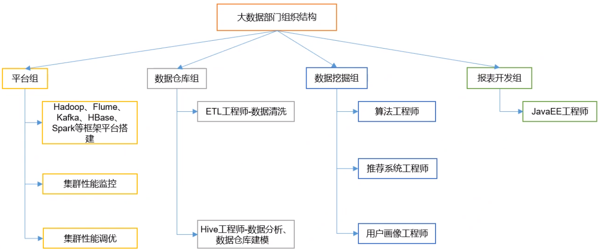

https://www.bilibili.com/video/BV1BJ411U7hW?p=1 最全的 java 技术栈

学习路径：linux - hadoop - hdfs - zookeeper - ha - mapreduce - shuffle - hive - flume - sqoop - hbase

​                   scala - spark - kafka - elasticsearch - logstash - kibana

# 1. 理论

Hadoop 2.x 与 Hadoop 3.x 区别

https://blog.csdn.net/wshyb0314/article/details/82184680

https://www.w3cschool.cn/hadoop/ 概念

## 1.1 大数据概念

> B -> KB -> MB -> GB -> TB -> PB -> EB

- 处理流程：获取数据，处理数据，展示结果

## 1.2 大数据特点（5v）

1，Volume（大量）

- 人类所有印刷的材料 200PB
- 历史上全人类说过的话 5EB
- PC 硬盘 TB 级
- 一些大企业数据量接近 EB 级

2，Velocity（高速）

3，Variety（多样）

- 结构/非结构，数据库/文本，日志/音频/视频/图片/地理位置

4，Value（低价值密度）

- 价值密度高低与数据总量大小成反比
- 如：在一天监控视频中，我们只关心某一时间段
- 如何==快速对有价值数据 “提纯” 成为目前大数据背景下待解决的难题==

5，Veracity（真实性）

## 1.3 大数据部门组织结构

# 2. 从 Hadoop 框架讨论大数据生态

## 2.1 Hadoop 是什么

- 由 apache 开发的分布式系统架构
- 解决==海量数据存储（HDFS）==和==分析计算（MapReduce）==问题

### 2.1.1 大文件怎么存？

- 存储大文件需要存放在多个机器上
  - 文件要分块 block（128M）
  - 不同的块放在不同的 `HDFS` 节点
- 为对外提供访问
  - 有一个统一的 `HDFS Master`
  - 它保存整个系统的文件信息
  - 所有文件元数据的修改都从 `Master` 开始

### 2.1.2 大数据怎么计算？

把大的任务分成许多小的任务并行计算

### 2.1.3 如何让计算跑在集群中？

- 可以设置一个集群的管理者，这个地方叫 `Yarn`
  - 集群管理者有一个 `Master`，用于接收和分配任务
  - 集群管理者有多个 `Slave`，用于运行任务

## 2.2 三大发行版本

- Apache：最原始，最基础的版本。用于入门学习
- Cloudera：大型互联网企业用的多
- Hortonworks：文档较好

## 2.3 Hadoop 的优势（4高）

- 高可靠性：底层维护多个数据副本，即使某个计算元素或存储挂了，也不会导致数据丢失。
- 高扩展性：在集群间全本任务数据，可方便的扩展数以千计的节点。
- 高效性：在 MapReduce 的思想下，Hadoop 是并行工作的，以加快任务处理速度。
- 高容错性：能够自动将失败的任务重新分配。

## 2.4 Hadoop 组成

### Hadoop 1.x 组成

- MapReduce：计算 + 资源 调度
- HDFS：数据存储
- Common：辅助工具

### Hadoop 2.x/3.x 组成

- MapReduce：计算
- Yarn：资源调度
- HDFS：数据存储
- Common：辅助工具

https://www.bilibili.com/video/BV19E411y7rK?p=4

# 3，Hadoop 3.2.1 单机安装

所需软件：jdk7 +，ssh 和 pdsh

