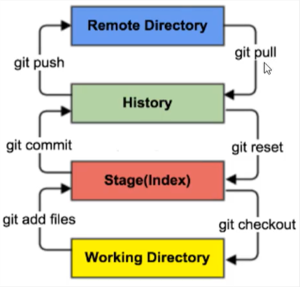

https://www.liaoxuefeng.com/wiki/896043488029600

- git 与 区别
  - git：分布式
  - svn：集中式

# 安装

```bash
yum install git
```

# 基础理念

## 工作区域

- 本地三个工作区域
  - 工作目录（working directory）：当前项目目录
  - 暂存区（stage/index）：修改过，尚未提交的都在暂存区（git add 后都在暂存区）
  - 资源库（repository 或 git directory）
- 远程 git 仓库（remote directory）



- HEAD：指向某个版本的指针

## 工作流程

- 1，在工作目录中添加、修改文件
- 2，将需要版本管理的文件放入暂存区
- 3，将暂存区的文件提交到 git 仓库

## 文件四种状态

- 未跟踪：untracked。没有 git add 过的文件
- 已入库：unmodify。已入库且未修改，即仓库中的文件和本地文件完全一致
- 已修改：modified。可用 git checkout 从仓库取文件覆盖本地
- 暂存状态：staged。git add . 过的文件

# 常用命令

## 查看所有配置

```bash
git config -l
```

## 查看系统配置

```bash
git config --system --list
```

## 查看本地配置

```bash
git config --global --list
```

## 配置信息位置

所有配置信息都保存在本地

- --system：Git\etc\gitconfig
- --global：C:\Users\11487\\.gitconfig

## 设置用户信息

```bash
git config --global user.name "用户名"
git config --global user.email "邮箱"
git config --global --replace-all user.email "邮箱"  # 变更用户信息
```

## 初始化项目

```bash
git init
```

## 克隆仓库代码

```bash
git clone [url]

# 当报 [remote: 找不到代码库，请确认是否有权限且代码库路径正确] 错时：
git clone https://用户名@github.com/xx/xx.git
```

## 查看没提交的文件

```bash
# 文件名可不写
git status [文件名]
```

## 提交到暂存区

```bash
# git add 文件名.扩展名
git add . # . 指所有文件，也可指定文件名
# 添加所有html文件
git add *.html
```

## 提交到本地仓库

```bash
# 先要 git add
git commit -m "备注信息"
# -a 不用先 git add
git commit -a -m "备注信息"
```

## 重新输入账号密码

```bash
# git push 后提示重新输入账号密码
git config --system --unset credential.helper
```

## 查看修改内容

```bash
git 版本key1 版本key2 路径/文件  # 查看某个文件从`版本1(旧)`到`版本2(新)`的修改内容
git diff 版本1 版本2 [路径/文件] # 查看某个文件从`版本1(旧)`到`版本2(新)`的修改内容

git show 版本key # 这个版本所有修改的文件内容
git show 版本key:文件名 > 保存文件名 # 提取某个版本的某个文件
git diff [路径/文件] # 查看未提交文件的修改内容
```

## 查看提交履历

```bash
git log # 退出按 q
# 简约版履历
git log --pretty=oneline
# 过往所有履历
git reflog
```

## 提交到远程仓库

```bash
git push
```

## 生成公钥

```bash
# 对应目录 C:\Users\11487\.ssh
ssh-keygen
```

## 退回上一版本

```bash
git reset --hard HEAD^
```

## 撤销 add

```bash
git reset # 撤销全部add的，加文件名可撤销指定add的文件
```

## 退回指定版本

```bash
# 1. 先 git log 查看要回退版本的id
# 2. reset 回退
git reset --hard id # id 的前几位就行，不用全写
```

## 放弃修改

```bash
git checkout . # 放弃所有修改的文件
git checkout -- 文件名 # 放弃单个文件 或 *.html一组
```

## 找回误删文件

```bash
git reset HEAD 文件路径/文件名
git checkout 文件路径/文件名
```

## 查看远程仓库地址

```bash
git remote -v
# 重新设置地址
git remote rm origin # 移除旧的
git remote add origin http://192.168.2.5:8441/r/~guan_t/tjj.git  # 添加新的
# idea还是不好用的话，执行
git branch --set-upstream-to=origin/master master
```

## 连接远程服务

1、在本地创建一个版本库（即文件夹），通过git init把它变成Git仓库；

2、把项目复制到这个文件夹里面，再通过git add .把项目添加到仓库；

3、再通过git commit -m "注释内容"把项目提交到仓库

4、在Github上设置好SSH密钥后，新建一个远程仓库，

​      通过 git remote add origin https://github.com/guyibang/TEST2.git 将本地仓库和远程仓库进行关联

5、最后通过 git push -u origin master 把本地仓库的项目推送到远程仓库

   （也就是Github）上;

   （若新建远程仓库的时候自动创建了README文件会报错，解决办法看上面）


# 忽略文件

- 项目根目录下新建 .gitignore 文件

```bash
# 符号为注释符
*.txt     # 忽略所有 .txt文件
!lib.txt  # 但 lib.txt 文件除外
buili/    # 忽略 build 下的所有文件
doc/*.txt # 忽略 doc 下所有 .txt 文件，不包括 doc/子文件夹 下的文件
```

# 提交部分文件

```bash
git status -s ./   # 1. 查看`当前目录`下哪些文件需要提交
git add ./*        # 2. cd到指定目录下各个添加
git commit -m "xx" # 3. 提交
git push           # 4. 提交远程
```

# git 分支

```bash
# 列出所有`本地`分支
git branch
# 列出所有`远程`分支
git branch -r
# 新建分支，但依然停留在当前分支
git branch [分支名]
# 新建分支，并切换到该分支
git checkout -b [分支名]
git checkout -b develop origin/develop # 从远程分支origin/develop创建并切换本地分支develop
# 合并指定分支到当前分支
git merge [分支名]
# 删除分支
git branch -d [分支名]
# 删除远程分支
git push origin --delete [分支名]
git branch -dr [remote/branch]

git switch [分支名] # 专门用来创建、切换分支 https://www.talktocomputer.site/blogs/79/
```

# pull 后代码丢失

> 方法一

- 1，git stash list：查看本地未提交代码

- 2，git stash apply stash@{0}：恢复本地丢失代码

> 方法二

- 1，idea右键项目->Local History->Show History
- 2，选中要恢复的文件后点Revert Selection


# 服务器

- gitblit windows版git服务器
