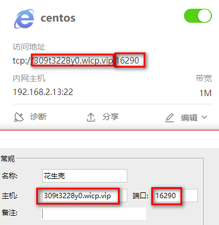

# 花生壳

花生壳免费域名：309t3228y0.wicp.vip

phddns start（启动）| stop（停止）| status（状态及sn码）| restart（重启）|
phddns reset（重置）
phddns version（版本）



- **根据官网上安装好后拿sn码去官网登陆绑定**

root / 123456


# ngrok

> 内网穿透工具

- 1.注册账号  http://www.ngrok.cc/
- 2.购买（0元）
- 3.下载

```bash
# 1. 注册后 [开通隧道] 里的 [本地端口] 为 127.0.0.1:22
# 2. 下载后是一个sunny文件
# 3. 开777权限
chmod 777 ./sunny
# 4. 开启，setsid 表示后台运行
setsid ./sunny clientid 078604d272761b8c
```


# 钉钉

```bash
# 钉钉基于ngrok的内网穿透
# 访问 http://abc.vaiwan.com
# -subdomain=abc => http://abc.vaiwang.com
# linux下先 chmod 777 ./ding，下面语句才好用
ding -config=./ding.cfg -subdomain=abc 8080
```