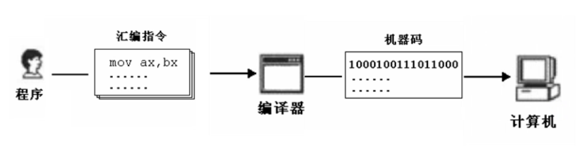
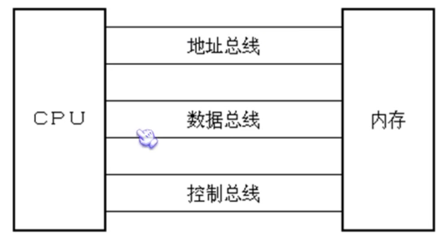
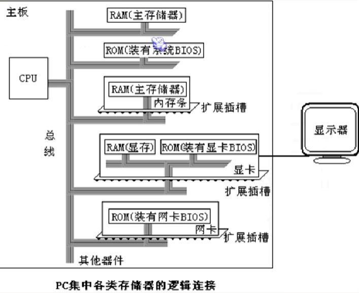
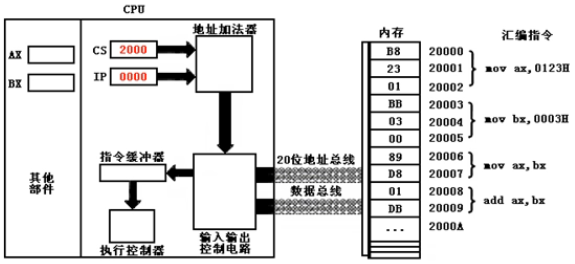

# 概念

## 1. 机器语言

机器可以正确执行的命令，指令：01010000 （push ax），电平脉冲：0是凹下去，1是凸起来

## 2.汇编语言的产生



## 3. 汇编语言的组成

由三类组成：

- 汇编指令（机器码助记符）
- 伪指令（由编译器执行，编译器认识，机器不认识）
- 其它符号（由编译器识别）

汇编语言的核心是汇编指令，它决定了汇编语言的特性。

## 4. 存储器

- CPU是计算机的核心部件，它控制整个计算机的运行并进行运算，要想让一个CPU工作，必须向它提供指令和数据。

- ==指令和数据在存储器中存放，也就是平时所说的内存。==（内存只是其中一个主要存储器）指令是告诉CPU怎么做，数据是告诉CPU做什么东西。
- 一台PC中，内存的作用仅次于CPU
- 离开内存，性能再好的CPU也无法工作
- 磁盘不同于内存，磁盘上的数据或程序如果不读到内存中，就无法被CPU使用。

## 5. 指令和数据

- 指令和数据是应用上的概念
- 在内存或磁盘上，指令和数据没有任何区别，都是二进制信息

## 6. 存储单元

显存：显卡里的内存

- 存储器被划分为若干个存储单元，每个存储单元从0开始顺序编号
- 例如：一个存储器有128个存储单元，编号从0到127

## 7. CPU对存储器的读和写

- CPU要想进行数据的读写，必须和外部器件（标准说法是芯片）进行三类信息交互

  - 存储单元地址（地址信息）
  - 器件选择，读或写命令（控制信息）
  - 读或写数据（数据信息）

- CPU是通过什么将地址、数据和控制信息传到存储芯片上的呢？

  - 计算机能处理、传输的信息都是电信号，电信号当然要用导线传输

  - 在计算机中专门有连接CPU和其它芯片的导线，通常称为总线

    - 物理上是一根根导线的集合

    - 逻辑上划分为：==地址总线，数据总线，控制总线==

      

- CPU在内存中读的演示：
  - CPU的要读取信息地址发出一个地址（经地址总线）
  - CPU的控制信息器件发出读指令（经控制总线）
  - 从第1步的地址返回信息并存放CPU存储数据的器件（经数据线）

- CPU在内存中写的演示：和读的顺序一样，最后一步和读相反（把CPU存储数据器件里的信息写到内存）

## 8. 地址总线

64位性能的三要素：64位CPU + 64位操作系统 + 64位软件 ，缺一不可

- CPU通过地址总线来指定存储单元
- 地址总线上能传多少个不同信息，就决定了CPU可以对多少个存储单元进行寻址
- 一个CPU有32条地址总线，则说明CPU的地址总线宽度为32
- 这样CPU最多可以寻找2^32个内存单元

## 9. 数据总线

- CPU与内存或其它器件之间的数据传送是通过数据总线来进行的
- 数据总线的宽度决定了CPU和外界的数据传输速度（比如传32位数据，16位CPU要传两次，32位CPU就传一次）

## 10. 控制总线

- CPU对外部器件的控制是通过控制总线来进行的（控制总线是总称，是一些不同控制线的集合）
- 控制总线的宽度决定了CPU对外部器件的控制能力

## 小结

- 汇编指令是机器指令的助记符，同机器指令一一对应
- 每种CPU都有自己的汇编指令集
- CPU可以直接使用的信息在存储器中存放
- 在存储器中指令和数据没有任何区别，都是二进制信息
- 存储单元从0开始编号
- 一个存储单元可以存8个bit，即8位二进制
- 每个CPU都有许多管脚，这些管脚和总线相连。一个CPU相连的三种总线宽度标志了这个CPU的不同方面性能：
  - 地址总线宽度决定了CPU的寻址能力
  - 数据总线宽度决定了CPU与其它器件进行数据传送时的一次数据传送量
  - 控制总线宽度决定了CPU对系统中其它器件的控制能力

## 11. 内存地址空间

一个cpu的地址宽度为10，那么可以寻址1024（2^10）个地址单元，这1024个可寻到的内存单元就构成了cpu的内存地址空间

### 11.1 主板

1）每台PC都有个主板，主板上有核心器件和一些主要器件

2）这些器件通过地址总线、数据总线、白控制总线相连

### 11.2 接口

1）计算机系统中，所有可用程序控制工作的设备必须受到cpu的控制

2）cpu对外部设备不能直接控制（如显示器、音箱、打印机等）。直接控制这些设备进行互操作的是插在扩展槽上的接口

## 12. 各类存储器芯片

从读写上分两类：

- 随机存储器(RAM)：内存相当一个大的随机存储器，一断电数据立刻消失
- 只读存储器(ROM)

从功能和连接上分：随机存储器RAM、装有BIOS的ROM、接口上的RAM



主存储器地址空间：00000 ~ 9FFFF

显存地址空间：A0000 ~ BFFFF

各类ROM地址空间：C0000 ~ FFFFF


# 寄存器(CPU工作原理)

CPU由运算器、控制器、寄存器等器件组成，这些器件靠内部总线相连

内部总线：实现CPU内部各个器件之间的联系

外部总线：实现CPU和主板上其它器件的联系

8086所有寄存器都是16位，可存放两个字节


## 1. 通用寄存器

16位，AX、BX、CX、DX 通常用来存放一般性数据，逻辑结构：从右到左 15 ~ 0

> 存放数据：例如存放18

二进制表示：00010010

| 15   | 14   | 13   | 12   | 11   | 10   | 9    | 8    | 7    | 6    | 5    | 4    | 3    | 2    | 1    | 0    |
| ---- | ---- | ---- | ---- | ---- | ---- | ---- | ---- | ---- | ---- | ---- | ---- | ---- | ---- | ---- | ---- |
| 0    | 0    | 0    | 0    | 0    | 0    | 0    | 0    | 0    | 0    | 0    | 1    | 0    | 0    | 1    | 0    |

8086上一代CPU中的寄存器都是8位，为保证兼容，这4个寄存器可分为两个独立的8位寄存器使用：

- AX：分AH（高）和AL（低）
- BX：分BH（高）和BL（低）
- CX：分CH（高）和CL（低）
- DX：分DH（高）和DL（低）

8086CPU的8位寄存器存储逻辑：AH（15~8），AL（7~0）

8086CPU的8位寄存器存储状况：

| 寄存器 | 数据             | 值             |
| ------ | ---------------- | -------------- |
| AX     | 0100111000100000 | 20000（4E20H） |
| AH     | 01001110         | 78（4EH）      |
| AL     | 00100000         | 32（20H）      |

一个字=2字节（word = 2B）

## 2. 物理地址

CPU访问内存单元时要给出内存单元地址，所有内存单元构成的存储空间是一个一维的线性空间。该地址称为**物理地址**

## 3. 16位结构的CPU

1）运算器一次最多可处理16位数据

2）寄存器最大宽度16位

3）寄存器和运算器间通路是16位

## 4. 8086给出物理地址的方法

1）8086有20位地址总线，可传送20位地址，寻址能力为1M（2^20 / 1024 = 1024）

2）8086内部16位结构，只能传送16位地址，表现出的寻址能力却只有64K（2^16 / 1024 = 64）

## 5. 合成物理地址

**8086CPU读写内存时发生的事：**

1. CPU中的相关部件提供两个16位地址，一个称为段地址，一个称为偏移地址
2. 段地址和偏移地址通过内部总线送入一个称为地址加法器的部件
3. 地址加法器将两个16位地址合并成一个20位的地址

**地址加载器合成物理地址方法：**==物理地址 = 段地址*16 + 偏移地址==

**`段地址*16` 有个更常用说法，即数据左移4位二进制位：**

| 移位位数 | 二进制  | 十六进制 | 十进制 |
| -------- | ------- | -------- | ------ |
| 0        | 10B     | 2H       | 2      |
| 1        | 100B    | 4H       | 4      |
| 2        | 1000B   | 8H       | 8      |
| 3        | 10000B  | 10H      | 16     |
| 4        | 100000B | 20H      | 32     |

数据移位关系：

- 一个数据的二进制形式左移1位，相当于乘以2
- 一个数据的二进制形式左移n位，相当于乘以2的n次方
- 一个数据的十六进制形式左移1位，相当于乘以16
- 一个数据的十进制形式左移1位，相当于乘以10
- 一个数据的n进制形式左移1位，相当于乘以n

## 6. 段的概念

错误认识：内存被划分成一个个段，每个段都有段地址

其实：内存并没有分段，段的划分来自于CPU，由于8086CPU用 “段地址 * 16 + 偏移地址 = 物理地址” 的方式给出内存单元的物理地址，使得我们可以用分段的方式来管理内存

在编程时可根据需要，将若干地址连续的内存单元看成一个段，用段地址 * 16 定位段的起始地址，用偏移地址定位侧面中的内存单元

注意：

- 段地址一定是16的倍数
- 偏移地址为16位，16位地址的寻址能力为64K，所以一个段的长度最大64K

小结：

- | 物理地址 | 段地址 | 偏移地址 |
  | -------- | ------ | -------- |
  | 21F60H   | 2000H  | 1F60H    |
  |          | 2100H  | 0F60H    |
  |          | 21F0H  | 0060H    |
  |          | 21F6H  | 0000H    |
  |          | 1F00H  | 2F60H    |

- 结论：CPU可以用不同的段地址和偏移地址形成同一个物理地址

如果给定一个段地址，公通过变化偏移地址来进行寻址，最多可定位64K个内存单元

## 7. 段寄存器

就是提供段地址的寄存器，8086CPU有 CS（代码段）、DS（数据段）、SS（堆栈段）、ES（附加段） 4个段寄存器

当CPU访问内存时，由这4个段寄存器提供内存单元的段地址

## 8. CS和IP

是8086CPU中最关键的两个寄存器，它们指示了CPU当前要读取指令的地址

CS：代码段寄存器

IP：指令指针寄存器

> CPU读取和执行指令相关部件



> CPU工作流程

1）从CS:IP指向内存单元读取指令，读取的指令进入指令缓冲器

2）IP = IP + 所读取指令的长度，从而指向下一条指令

3）执行指令。转到1），重复该过程

> CPU工作过程

- 在CPU加电启动或复位后（即CPU刚开始工作时），CS和IP被设置为CS=FFFFH，IP=0000H，即CPU从FFFF0H单元读取指令执行

- FFFF0H（FFFFH(段) * 16 + 0H）单元中的指令是CPU开机后执行的第一条指令

> 修改CS、IP指令

- CPU中，程序员能用指令读写的部件只有寄存器
- CPU从何处执行指令是由CS、IP的内容决定，程序员通过改CS、IP的内容来控制CPU执行目标指令


## 9. 代码段

1）在编程是可根据需要将一组内存单元定义为一个段

2）可将长度为N（N <= 64KB）的一组代码存在一组地址连续且起始地址为16倍数的内存单元中，这段内存用来存放代码，从而定义了一个代码段

> 如何让代码段中的指令被执行？

- 将一段内存当作代码段，只是编程时的安排，CPU并不会执行这种安排
- CPU只认被 CS : IP 指向的内存单元中的指令


# 寄存器(内存访问)

## 内存中字的存储

在0地址处开始存放20000（4E20H）：

| 0    | 20H   ==>    低地址(AL) |
| ---- | ----------------------- |
| 1    | 4EH   ==>    高地址(AH) |
| 2    | 12H                     |
| 3    | 00H                     |

任何两个地址连续的内存单元，可将N号单元和N+1号单元看成**两个内存单元**，也可看成一个地址为N的**字单元中的高位字节单元和低位字节单元**

## DS和[address]

1）CPU要读取一个内存单元的时候，必须先给出这个内存单元的地址

2）在8086CPU中，内存地址由段地址和偏移地址组成

3）8086CPU中有一个DS寄存器，通常用来存放要访问的数据的地址

> 例如：要读取10000H单元的内容，可用如下程序 段：

```bash
mov bx, 1000H # 10000H = 1000:0
mov ds, bx    # 不能直接 move ds,10000H，因为8086不支持将数据直接送往段寄存器，必须通过”通用寄存器“
mov al, [0]   # 将1000:0(ds[0])的数据放到al(寄存器)中。
mov [0], al   # 将寄存器的数据送入内存单元中
# mov中的[]是个内存单元，[]中的0是该内存单元的偏移地址，它的段地址是ds
```

## 数据段

比如用 123B0H ~ 123B9H 这段空间来存数：

- 段地址：123BH（123B0H右移一位）
- 长度：10字节（0~9）


# 指令

## mov

赋值指令，但不能将内存数据赋给段寄存器，需要通过通用寄存器

```bash
mov ax,7
mov cs,ax # 不能 mov cs,7
```

## jmp

跳转指令，同时修改CS、IP内容

```bash
jmp 段地址 : 偏移地址
# 例：
jmp 2AE3:3 # 跳转到 2AE33
jmp 3:0B16 # 跳转到 0B46
```

仅修改IP内容：

```bash
jmp 寄存器
# 例：
jmp ax # 类似 mov IP, ax
```

### 例子

设即使值：CS=2000H，IP=0000H

| 地址   | 内存中机器码 | 指令          | 地址   | 内存中机器码 | 指令          |
| ------ | ------------ | ------------- | ------ | ------------ | ------------- |
| 10000H | DB           |               | 20000H | B8           |               |
|        | 23           | mov ax, 0123H |        | 22           | mov ax, 6622H |
|        | 01           |               |        | 66           |               |
| 10003H | B8           |               | 20003H | EA           |               |
|        | 00           | mov ax, 0000  |        | 03           |               |
|        | 00           |               |        | 00           | jmp 1000 : 3  |
| 10006H | 8B           | mov bx, ax    |        | 00           |               |
|        | D8           |               |        | 10           |               |
| 10008H | FF           |               | 20008H | 89           |               |
| 10009H | E3           | jmp bx        |        | C1           | mov cx, ax    |

```bash
# 上面运行过程为：
mov ax, 6622H
jmp 1000 : 3 # 段=1000
mov ax, 0000
mov bx, ax   # bx = 0000
jmp bx       # 相当于 jmp 1000 : 0000，第3行把段设置成了1000
# 重复执行下面指令，死循环
mov ax, 0123H
mov ax, 0000
mov bx, ax
jmp bx
```

## push|pop

出栈入栈指令

段寄存器SS(堆栈段)：存入栈顶的段地址；寄存器SP：存入栈顶的偏移地址；任意时刻，SS:SP都指向栈顶元素

- push ax
  - SP = SP - 2
  - 将 ax 中的内容送入 SS:SP 指向的内存单元，SS:SP 此时指向新栈顶

### 寄存器

```bash
push ax # 将寄存器中的数据入栈
push bx # 用一个寄存器接收出栈数据
```

### 段寄存器

==可以在段寄存器和内存之间传递数据（mov 不可以在段寄存器和内存间互传）==

```bash
push ds # 将段寄存器中的数据入栈
pop  es # 用一个段寄存器接收出栈数据
```

### 内存单元

```bash
push [0] # 将一个字的内存单元入栈，栈操作都是以字(16bit)为单位
pop  [2] # 用一个字的内存单元接收出栈数据
```

### 空栈SP指向

当 10000H~1000FH 初始为空栈，那么==SP指向10H==（0FH + 1），push 1122后，SP - 2 = 0EH

### 例子

> 一、10000H~1000FH 初始为空栈，ax=1，bx=2，让ax、bx内容互换

```bash
-a 2000:0 # 从2000段开始写指令
2000:0000 mov ax,1000 
2000:0003 mov ss,ax  # 初始堆栈寄存器
2000:0005 mov ax,1   # ax=1
2000:0008 mov bx,2   # bx=2
2000:000B push ax    # push 1
2000:000C push bx    # push 2
2000:000D pop ax     # ax = pop 2
2000:000E pop bx     # bx = pop 1

-r cs
2000
-r ip
0  # 到 2000:0 下单步执行

-t # 单步执行，最后ax=2,bx=1
```

## inc

给寄存器自加1

```assembly
inc bx ; bx 加 1
```


# debug工具

## win10下安装

1）https://www.dosbox.com/download.php?main=1 下载并安装

2）https://www.pcsoft.com.cn/iopdfbhjl/35986?module=soft&t=website 下载 debug.exe

3）放到 D:\GT\debug\debug.exe

4）打开 `DOSBox` 所在目录，双击 `DOSBox 0.74-3 Options.bat`，后自动打开配置文件，拉到最下，并添加内容：

```bash
MOUNT C D:\GT\debug
C:
debug
```

5）运行 `DOSBox 0.74-3`

## 命令用法

R：查看、改变CPU寄存器内容

D：查看内存中的内容

E：改写内存中的内容

U：将内存中的机器指令翻译成汇编指令

T：执行一条机器指令

A：以汇编指令的格式在内存中写入一条机器指令

> 一个累加的例子

```bash
-a 2000:0           # 从 2000:0 开始输入指令
2000:0000 add ax,1
2000:0003 jmp 0     # 循环 ax+1
2000:0005
-r cs               # 修改cs寄存器
CS 073F             # cs初始内容
:2000               # 改成2000
-r ip               # 修改ip寄存器
IP 0100             # 初始内容
:0                  # 改成0
-t  # 执行add ax,1，结果：AX=0001
-t  # 执行jmp 0，结果：AX=0001
-t  # 执行add ax,1，结果：AX=0002
-t  # 执行jmp 0，结果：AX=0002
...
```

> 赋值10000H=23,10001H=11,10002H=22,10003H=66

```bash
-e 1000:0 23 11 22 66 # 赋值
-d 1000:0 3 # 查看1000下0~3的内容
# 结果：
# 1000:0000 23 11 22 66
```


# 第一个程序

编写一个完整的汇编语言程序，并生成.exe文件在系统中执行

```assembly
; 1. 下载 masm6.15
; 2. 创建代码文件 d:\gt\demo\assembly\demo\1.asm
assume cs:demo

demo segment
    mov ax,2
    add ax,ax
    add ax,ax

    mov ax,4c00H
    int 21H
demo ends

end
; 3. 拷贝 masm6.15 下的 link.exe、masm.exe、ml.exe 到代码文件目录下
; 4. cmd 到该目录执行：
     masm 1.asm # 编译
     link 1.obj # 链接生成 .exe
     ml 1.asm   # 或者直接 ml 完成上面两步
; 5. 打开 DOSBox 0.74-3（将配置文件恢复最开始样子）来运行可执行文件
; 5. MOUNT d d:\gt\demo\assembly\demo
; 6. d:
; 7. 1.exe ;运行可执行文件
```


## 源程序

一个汇编源程序里分为：

- 汇编指令：会编译为机器码，最终被CPU执行
- 伪指令：会被编译器处理，不会被CPU执行
  - `段名 segment`：表示一个段的开始
  - `段名 ends`：表示一个段的结束

一个源程序由多个段组成（==至少有一个段==），这些段用来放代码、数据或当作栈空间使用；

assume：含义为”假设“

- 假设某一段寄存器和程序中的某个用 `segment ... ends` 定义的段关联
- 通过 `assume` 说明的关联，编译器可将段寄存器和某一具体的段相关联

```assembly
assume cs:codesg    ; 伪指令，cs(代码段)关联名叫 `codesg` 的段
codesg segment      ; 伪指令，codesg 段开始
start: mov ax,0123H ; 汇编指令
	   mov bx,0456H
	   add ax,bx
codesg ends         ; 伪指令，codesg 结束
end                 ; 伪指令，汇编程序的结束标记
```

## 段结束|程序结束|程序返回

| 目的                 | 相关指令                | 指令性质 | 指令执行者         |
| -------------------- | ----------------------- | -------- | ------------------ |
| 通知编译器一个段结束 | 段名 ends               | 伪指令   | 编译时由编译器执行 |
| 通知编译器程序结束   | end                     | 伪指令   | 编译时由编译器执行 |
| 程序返回             | mov ax,4c00H<br>int 21H | 汇编指令 | 编译时由CPU执行    |

## 编译

将源程序编译成机器码

## 连接

1）当源程序很大时，可将它分成多个源文件编译，系缚 个源程序编译成目标文件后，再将目标文件连接到一起生成一个可执行文件

2）程序中调用某库文件，要将库文件和程序生成的目标文件连接到一起生成可执行文件

## 可执行文件运行原理

DOS 中，可执行文件中的程序 P1 若要运行，必须有个正在运行的程序 P2，将 P1 从可执行文件中加载进内存，将 CPU 控制权交给 P1，P1 才得以运行

当 P1 运行完后，将 CPU 控制权交还给 P2

## 操作系统外壳

1）任何通用的操作系统都要提提供一个称为 `shell`  的外壳程序，用户使用这个程序来操作计算机系统工作

2）Dos 中有个 `command.com` 程序，称为命令解释器，也就是 Dos 系统的 shell

以上面 1.exe 程序为例：

1. Dos中执行 1.exe 时，是 command 将 1.exe 加载到内存
2. command 设置 CPU 的 CS:IP 指向程序的第一条指令（即程序入口），从而使程序得以运行

# [bx]和内存单元

[bx] 和 [0] 类似，[0] 表示内存单元，其偏移地址是 0

```assembly
mov ax, [0]  ; error，不能像在debug里这样写，必须要通过bx

mov bx, 0
mov ax, [bx] ; ok
```


https://www.bilibili.com/video/BV1zW411n79C?p=24&vd_source=2ddb3806f7e4c08fd841529f280d8bee


https://fishc.com.cn/thread-1053-1-1.html 《WIN32汇编语言程序设计》《Windows程序设计（SDK）》

http://www.boobooke.com/m2/