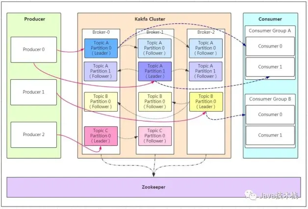

# 概述

kafka是一种高吞吐量的分布式==发布/订阅==消息系统，下图展示 kafka 相关术语及关系：




## 1. broker

kafka 集群包含一个或多个服务器节点，各服务器节点称为 broker。broker 存储 topic

## 2. topic

每条发到 kafka 集群的消息都有一个类别，这个类别就叫 topic。

## 3. partition

topic 的分区，每个 topic 可有多个分区（但至少有一个分区），作用是做负载，提高 kafka 吞吐量。同一 topic 在不同分区的数据不重复

## 4. replication

每个分区都有多个副本，作用是备份（只有一个副本是 leader）。当主分区（leader）故障时会选择一个备份（follower）成为 leader。kafka 默认最大副本数量是10，且副本数不能大于 broker 数。follower 和 leader 绝对在不同机器上，同一台机只能存同一个分区的一份副本。

- leader：负责数据的读写
- follower：当 leader 发生`写`操作时，会通知所有 follower 进行数据同步

## 5. message

每一条消息的主体

## 6. consumer group

1）消费者组下可有一个或多个消费者实例，消费者实例可以是进程或线程

2）每个消费者组都有一个唯一的 groupId（字符串类型）

3）消费者组订阅的 topic 下的每个分区只能由该组下的一个消费者消费（该分区可被其它**消费者组**消费）

## 7. zookeeper

kafka 集群依赖 zk 保存集群的元信息，以保证系统的可用性

# 安装

## 1. 下载解压

```bash
wget https://downloads.apache.org/kafka/2.8.0/kafka_2.13-2.8.0.tgz # 1.下载
tar -xzvf kafka_2.13-2.8.0.tgz  # 2.解压
```

## 2. zookeeper

下载的 kafka 里自带了 zk，可直接用，但与原生稍有不同：

```bash
bin/zookeeper-server-start.sh # 启动命令文件
bin/zookeeper-server-stop.sh  # 停止命令文件
config/zookeeper.properties   # zk配置文件
```

```bash
# 1. 把zk的运行内存改小些
vim bin/zookeeper-server-start.sh # 编辑

if [ "x$KAFKA_HEAP_OPTS" = "x" ]; then
    export KAFKA_HEAP_OPTS="-Xmx128M -Xms128M" # 原本512m，改成了128m
fi

bin/zookeeper-server-start.sh -daemon config/zookeeper.properties # 2. 启动zk -daemon 表示后台运行
bin/zookeeper-server-stop.sh -daemon config/zookeeper.properties  # 3. 关闭zk
```

## 3. kafka

```bash
# 1. 阿里云控制台上手动开放9092端口，以及命令开放防火墙端口
# 2. 配置 kafka
vim config/server.properties

# listeners=PLAINTEXT://localhost:9092 要注掉
advertised.listeners=PLAINTEXT://47.105.141.18:9092 # 外网IP
# 上面这两行就能保证阿里云上的kafka能被本机连上

bin/kafka-server-start.sh -daemon config/server.properties # 3. 启动 kafka
bin/kafka-server-stop.sh config/server.properties          #    关闭 kafka

# 4. 测试
bin/kafka-topics.sh --zookeeper localhost:2181 --create --replication-factor 1 --partitions 1 --topic test # 创建topic
bin/kafka-topics.sh --list --zookeeper localhost:2181 # 查看topic，结果：test
#		用两个窗口执行发送和接收，a窗口发送一个，b窗口接收一个
bin/kafka-console-producer.sh --broker-list localhost:9092 --topic test # 发送消息（注意：端口号别写错）
# 消费者接收消息
#		--from-beginning 表示从头开始拉取数据，不加表示只拉取启动后产生的数据
bin/kafka-console-consumer.sh --bootstrap-server localhost:9092 --topic test --from-beginning

bin/kafka-topics.sh --zookeeper localhost:2181 --delete --topic test # 删除topic
```

# 整合 springboot

==说明：==kafka 在阿里云上安装，本地工程连阿里云上kafka

```xml
<dependency>
    <groupId>org.springframework.boot</groupId>
    <artifactId>spring-boot-starter-web</artifactId>
</dependency>
<dependency> <!-- kafka 依赖 -->
    <groupId>org.springframework.kafka</groupId>
    <artifactId>spring-kafka</artifactId>
</dependency>
<dependency> <!-- @Slf4j 的依赖 -->
    <groupId>org.projectlombok</groupId>
    <artifactId>lombok</artifactId>
</dependency>
```

```yaml
spring:
  kafka:
    bootstrap-servers: 47.105.141.18:9092 # 阿里云上kafka服务地址
```

```java
@Slf4j
@RestController
public class ApiController {
    // 1. 用于发送消息（生产者用）
    @Autowired
    private KafkaTemplate<String, Object> template;

    // 2. 生产者
    @GetMapping("producer/{msg}")
    public void producer(@PathVariable String msg) {
        // topic1 是事先创建好的 topic，即：
        // bin/kafka-topics.sh --zookeeper localhost:2181 --create --replication-factor 1 --partitions 1 --topic topic1
        template.send("topic1", msg).addCallback(y -> { // 生产成功
            RecordMetadata m = y.getRecordMetadata();
            String topic = m.topic(); // 主题topic
            int partition = m.partition(); // 分区
            log.info("发送成功：主题 -> " + topic + ", 分区 -> " + partition);
        }, n -> { // 生产失败
            log.error("发送失败：" + n.getMessage());
        });
    }
	// 3. 消费者
    @KafkaListener(topics = "topic1", groupId = "consumer-group") // 这两个参数必须指定
    public void consumer(ConsumerRecord x) {
        Optional<Object> op = Optional.ofNullable(x.value());
        if (op.isPresent()) log.info("消费消息：" + op.get());
    }
}
```

```bash
# 测试
http://47.105.141.18:8080/producer/12 # 发送消息：12
# 结果：
com.kafka.controller.ApiController       : 发送成功：主题 -> topic1, 分区 -> 0
com.kafka.controller.ApiController       : 消费消息：12
```

# 整合 go

参考：go/记.md/kafka

# 收藏

```bash
https://kafka.apachecn.org/ # 中文文档
```

