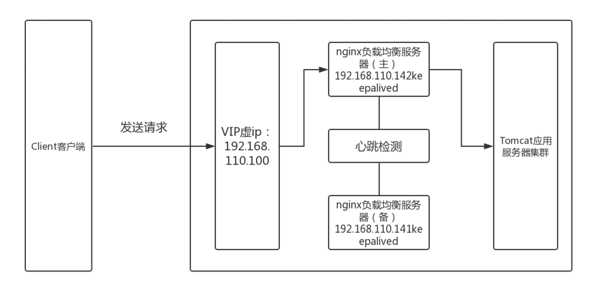

http://www.yunweipai.com/35361.html 中文教程

https://keepalived.org/doc/ 官方文档

https://segmentfault.com/a/1190000022186901 # docker 下应用

https://www.bilibili.com/video/BV13R4y1b7VR?from=search&seid=14612905055869181387&spm_id_from=333.337.0.0 规避单点问题

# 词条

## LVS

是 `Linux Virtual Server` 的简写，即 `Linux 虚拟服务器`，是一种虚拟的服务器集群系统

## IPVS

`IP 虚拟服务器`（IP Virtual Server，简称 IPVS）。是运行在 `LVS` 下提供负载均衡功能的一种技术。

## VIP

虚拟 `IP` 地址

## VRRP

1）`虚拟路由冗余协议`（Virtual Router Redundancy Protocol），解决局域网中配置静态网关出现单点失效现象的路由协议。

2）将多台提供相同功能的路由器组成一个路由器组

- 该组里有一个 `master` 和多个 `backup`
- `master` 上有个对外提供服务的 `VIP`
- `master` 发组播，当 `backup` 收不到时就认为 `master` 挂了，此时根据 `VRRP` 的优先级选一个 `backup` 当 `master`，并且 `VIP` 也自动转移到了新 `master` 身上

3）Keeplived 基于该协议


# 概要

为 `均衡负载` 和 `高可用` 提供的框架，是解决 `HA` 集群的一种方式。



## 功能

1）均衡负载，为集群上真实服务器分配 IP 流量，提供一个或多个高可用的虚拟服务

2）健康状况检查与维护

3）可以单独用，也可一起用

## 设计

1）用 ansi C 写的

2）守护进程被分成三个进程

- 一个最小化父进程，负责子进程的监控（或叫看门狗）
- 一个子进程负责 VRRP 框架
- 另一个负责健康检索

3）看门狗每5秒向子进程发送 hello

## 集群类型

1）LB：均衡负载集群，解决压力

2）HA：高可用集群，解决安全

3）HPC：高性能集群，解决高性能

# 环境搭建

## 安装

```bash
docker pull centos:7                         # 1. 拉取 centos7 镜像
# 2. 运行centos7
#    --privileged=true：可以docker内真正拥有root权限
#    /usr/sbin/init：可以在docker内使用systemctl命令
docker run -id --name=keep1 --privileged=true centos:7 /usr/sbin/init
docker exec -it keep1 /bin/bash              # 3. 进入容器
# 4. 安装epel-release，后才能安 nginx，否则报 error nothing todo
yum install -y epel-release
# 5. 安装这4个，-y 表示直接安装忽略询问
#    net-tools：可以使用ifconfig命令，来查看网卡
#    initscripts：可以使用 service 命令
yum install -y net-tools vim keepalived nginx initscripts
```

## keepalived.conf 说明

```bash
# /etc/keepalived/keepalived.conf
###### 全局配置 ######

global_defs {
  notification_email {
  root@localhost # keepalived 发生故障切换时邮件发送的目标邮箱，可以按行区分写多个
  root@wangxiaochun.com 
  29308620@qq.com 
  }
  notification_email_from keepalived@localhost  # 发邮件的地址
  smtp_server 127.0.0.1     # 邮件服务器地址
  smtp_connect_timeout 30   # 邮件服务器连接timeout
  router_id ha1.example.com # 每个keepalived主机唯一标识，建议使用当前主机名，但多节点重名不影响
  # 对所有通告报文都检查，会比较消耗性能，启用此配置后，如果收到的通告报文和上一个报文是同一个路由器，
  # 则跳过检查，默认值为全检查
  vrrp_skip_check_adv_addr
  # 严格遵守VRRP协议, 禁止以下状况:
  #    1. 无VIP地址
  #    2. 配置了单播邻居
  #    3. 在VRRP版本2中有IPv6地址，开启动此项会自动开启iptables防火墙规则，建议关闭此项配置,
  vrrp_strict
  vrrp_garp_interval 0 # gratuitous ARP messages报文发送延迟，0表示不延迟
  vrrp_gna_interval 0  # unsolicited NA messages （不请自来）消息发送延迟
  vrrp_mcast_group4 224.0.0.18 # 指定组播IP地址，默认值：224.0.0.18 范围：224.0.0.0到239.255.255.255
  vrrp_iptables        # 开启此项，当vrrp_strict开启时，不添加防火墙规则，否则VIP无法访问
}

###### 配置虚拟路由 ######
# * 主和备仅 state、priority 不一样，其它都可一样
vrrp_instance <STRING> {
    # 配置参数：
    state MASTER|BACKUP  # 当前节点在此虚拟路由器上的初始状态，状态为MASTER或者BACKUP
    interface IFACE_NAME # 绑定网卡名，如：ens32,eth0,bond0,br0
    # 虚拟路由组编号，值为0~255（主备为同一组，所以必须相同）
    virtual_router_id 7
    priority 100     # 权重，主高于备，范围：1-254，每个keepalived主机节点此值不同
    advert_int 1     # 心跳包间隔秒ovt
    authentication { # 认证机制
        auth_type AH|PASS
        auth_pass <PASSWORD> # 预共享密钥，仅前8位有效，同一个虚拟路由器的多个keepalived节点必须一样
    }
    virtual_ipaddress { # 虚拟IP
        <IPADDR>/<MASK> brd <IPADDR> dev <STRING> scope <SCOPE> label <LABEL>
        192.168.200.100         # 指定VIP，不指定网卡，默认为eth0,注意：不指定/prefix,默认为/32
        192.168.200.101/24 dev eth1                 # 指定VIP的网卡
        192.168.200.102/24 dev eth2 label eth2:1    # 指定VIP的网卡label 
    }
}
```

## 主备示例

```bash
# 1. 参照 `安装` 创建两个容器，分别是 keep1 和 keep2
#    此时 keep1 的 ip 为 172.17.0.2
#    此时 keep2 的 ip 为 172.17.0.3
# 2. 分别修改 /usr/share/nginx/html/index.html
#    keep1: <h1>keep1 master</h1>
#    keep2: <h1>keep2 backup</h1>
# 3. docker 进入到 keep1 并编辑 /etc/keepalived/keepalived.conf 设为主机
global_defs {
   router_id LVS_DEVEL
}

vrrp_instance VI_1 {
    state MASTER # 主
    interface eth0
    virtual_router_id 7
    priority 100 # 权重大于从
    advert_int 2
    authentication {
        auth_type PASS
        auth_pass 123456
    }
    virtual_ipaddress {
        172.17.0.100
    }
}
# 4. docker 进入到 keep2 并编辑 /etc/keepalived/keepalived.conf 设为从机
global_defs {
   router_id LVS_DEVEL
}

vrrp_instance VI_1 {
    state BACKUP # 从
    interface eth0
    virtual_router_id 7
    priority 99  # 权重小于主
    advert_int 2
    authentication {
        auth_type PASS
        auth_pass 123456
    }
    virtual_ipaddress {
        172.17.0.100
    }
}
```

```bash
# 5. 退出 docker 容器 执行
while true;do curl 172.17.0.100;sleep 1;done; # 一直显示 keep1 master
# 6. 进入 keep1 后
systemctl stop keepalived # 停掉 keepalived 后 5. 就会一直显示 keep2 backup
# 7. 再次开启 keep1
systemctl start keepalived # 5. 又一直显示 keep1 master
```

