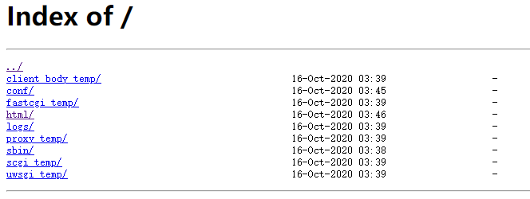

# 1. 基础知识

中文文档：https://www.nginx.cn/doc/

## 1.1 优点

- 高并发量：官方说支持 5w（实际1w多） 并发连接数的响应
- 内存消耗少：善于处理静态文件，相较于其它web服务器（如apache），占用更少内存及资源
- 简单稳定：配置简单（一个conf文件），运行简单（nginx命令），且运行稳定
- 模块化程度高：自由配置相应功能
- 支持Rewrite重写规则：能够根据域名、url等请求关键点，实现定制化的高质量分发
- 低成本：负载均衡功能很强大而且免费开源
- 支持多系统：nginx完全用c语言从头写的，可以在各系统 上编译使用

## 1.2 缺点

- 动态处理差：善于处理静态文件，但处理动态页面能力比apache之类重量级web服务稍差
- rewrite弱：虽支持rewrite，但比apach之类 重量级web服务能力稍差


# 2. 安装 - 命令

```bash
# 安装

# 1. 下载
wget http://nginx.org/download/nginx-1.19.3.tar.gz
# 2. 解压
tar -zxvf nginx-1.19.3.tar.gz
# 3. 安装make依赖包
yum -y install gcc-c++ make pcre-devel zlib zlib-devel openssl openssl-devel libtool
# 4. cd到解压文件夹后
./configure
make && make install # 6.安装
```

```bash
# 命令
cd /usr/local/nginx/sbin

./nginx -v                                   # 查看版本
./nginx -V                                   # 查看开启模块信息
./nginx -t                                   # 测试配置文件写的是否正确
./nginx                                      # 启动
./nginx -c /usr/local/nginx/conf/nginx.conf  # 根据配置文件启动
./nginx -s stop                              # 停止nginx
./nginx -s reload                            # 重启
ps -ef|grep nginx                            # 查看是否启动成功
netstat -tnulp | grep nginx                  # 和 ps -ef|grep nginx 一样，但多了端口信息。（安装：yum install net-tools）
```


# 3. 目录配置

- 工作目录：--conf-path=conf/nginx.conf
- 执行文件：--sbin-path=nginx.exe
- 日志目录：--http-log-path=logs/access.log
- 启动文件：能够启动停止nginx的文件
- web目录：显示nginx首页的目录

到 nginx -V 显示出来的信息里面搜（比如搜：--conf-path找到工作目录）


# 4. nginx.conf - 全局配置

## 4.1 配置结构

- 全局配置段

  ```nginx
  user  nobody;                 # 工作用户（工作进程）
  worker_processes  1;          # 工作进程数（理论上越大越好，值为auto表示跟cpu核心数一样）
  pid logs/nginx.pid;           # nginx.pid里的内容为nginx运行服务的进程号，服务一停该文件被自动删除
  
  events {
      worker_connections  1024; # 每个进程的最大连接数
      use epoll                 # 使用epoll为内核模型
  }
  ```

- http配置段

  ```nginx
  http {
      sendfile on;                            # 开启文件高效传输模式
      tcp_nopush on;                          # 防止网络阻塞
      tcp_nodelay on;                         # 防止网络延时
      keepalive_temiout 65;                   # 长连接超时时长
      types_hash_max_size 2048;               # 每个连接最大字节数
      include mime.types;                     # 文件mime.types的内容为允许客户端请求的数据格式
      default_type  application/octet-stream; # 默认客户端请求的数据格式
  	
      ssl_protocols TLSv1 TLSv1.1 TLSv1.2;
      ssl_perfer_server_ciphers on;           # 开启https传输模式
      
      access_log logs/access.log;             # 成功log文件路径
      error_log logs/error.log;               # 异常log文件路径
      
      gzip on;                                # 开启gzip压缩
      gzip_disable "msie6";                   # ie6不压缩
      
      include xxx/xxx.conf;                   # 包含xx配置文件
  ```

  - server配置段：项目或应用名==（http段可以包含多个server）==

    ```nginx
    server {
        listen 80 default_server;         # 该项目监听80端口，default_server
        listen [::]:80 default_server;    # [::]:80 相当于0.0.0.0:80
        root D:/www;                      # 浏览器上显示 D:/www 路径下的静态页
        index a.html b.htm idx.html;      # 默认首页，有a显示a，有b显示b，ab都没有显示idx.html
        
        server_name  localhost;
    ```

    > listen属性

    | 形式           | 描述                 | 示例                  | 完整示例              |
    | -------------- | -------------------- | --------------------- | --------------------- |
    | ip:port        | 精确表示             | listen 10.10.10.10:99 | listen 10.10.10.10:99 |
    | ip             | 自动监听ip:80        | listen 10.10.10.10    | listen 10.10.10.10:80 |
    | port           | 自动监听 全地址:port | listen 99 或 [::]:99  | listen 0.0.0.0:99     |
    | default_server | 自动使用默认地址     | listen default_server | listen localhost:80   |

    - location配置段：url配置


## 4.2 nginx访问过程原理

**0.0.0.0:80：**表示127.0.0.1和本机ip都能访问


# 5. vscode-sftp 配置

安装vscode的插件sftp，来配置nignx.conf

安装好后ctrl+shift+p，弹出下拉中选SFTP:config

```javascript
{
    "name": "My Server",
    "host": "localhost", 		// 服务器地址
    "protocol": "sftp",         // 协议sftp
    "port": 22,
    "username": "root",
    "remotePath": "/etc/nginx",
    "uploadOnSave": true        // 保存后直接上传
}
// 下一步：在左侧菜单右键->download folder，然后输入linux密码，文件就会下载下来
// 最后惊喜的发现，只要修改完文件一保存，就自动同步到linux上了
```


# 6. root,alias,index

```nginx
# root index
location / {                     # '/'表示根路径访问
    root   D:/nginx-web;         # 到哪个路径下去匹配首页文件
    index  index.html index.htm; # 匹配的首页文件
}

# alias：匹配非根路径，root匹配根路径
# 注意：如果是/test的话，不是匹配localhost:8080/test，而是D:/nginx-web/test
location /test { 
    root D:/nginx-web # 想要实现/test路径效果，只需把root改成alias即可
}
```


# 7. server_name 配置

可以配置server_name后，通过域名访问

```bash
server {
    listen 8080;
    server_name gtlookup;

    location / {
        root   html/gtlookup; # 配置域名
        index  index.html;
    }
}
```

```bash
# 1. vi /etc/hosts 添加
127.0.0.1 gtlookup
# 2. 访问
curl -XGET gtlookup:8080 # 本机可以通过域名访问，其它机器只能通过ip访问
```


# 8. location 配置常见动作

## 8.1 匹配规则

| 类型    | 含义                   | 匹配方式 | 优先级 | 样式                      |
| ------- | ---------------------- | -------- | ------ | ------------------------- |
| = /路径 | 精确匹配               | 前缀     | 1      | location = /image {}      |
| `^~`    | 优先匹配               | 前缀     | 2      | location `^~` /page {}    |
| `~`     | 普通正则-大小写敏感    | 正则符号 | 3      | location `~` .(jpe?g)$ {} |
| `~*`    | 普通 正则-大小写不敏感 | 正则符号 | 3      | `~*.(jpe?g)$ {}`          |
| /       | 通常匹配               | 前缀     | 4      | location / {}             |
| <路径>  | 前缀匹配               | 前缀     | *      | location /index {}        |


# 9. try_files

```bash
# 指令语法
try_files file ... /uri   # /代表要跳的页面，而$uri/表示：$uri加斜线
try_files file ... =code  # =代表返回的code
# 作用：响应时按顺序查找file，打到则返回file内容，否则进行内部重定向（uri）或返回状态码（code）
```

```nginx
# 常见示例

location / { # 如果找到指定uri就返回uri内容，否则返回404
    try_files $uri $uri/ =404; # 访问 $uri或$uri/，以外返回404
}
location / { # 如果找到1/1.html就返回uri内容，否则返回3.html内容
    try_files 1.html 2.html /3.html;
}

location @backup { # 定义@backup
    return http://www.baidu.com  # 跳转到百度
}
location / { # 如果找到指定url就返回uri内容，否则内部重定向到名为@backup的location
    try_files $uri @backup;
}
```

```nginx
# 如：
server {
    listen 8080;

    location / {
        root   html/gtlookup;
        index  index.html;
        # try_files $uri /index.html; ### 不管怎么访问 x.x.x.x:8080/asdf任何值，页面上都会显示 index.html
        # try_files $uri $uri/ =404;  ### html/gtlookup下没有的页面就显示404，如：http://x.x.x.x:8080/aaa
    }
}
```


# 10. location 临时跳转

可以通过302代码，进行内部/外部重定向跳转

```nginx
server {
    listen 8080;
    location / {
        return 302 http://www.baidu.com; # 访问 http://localhost:8080 直接跳百度
        return 302 /login;               # 内部跳400
    }
    
    location /login {
        return 400;
    }
}
```


# 11. location 访问控制

通过配置allow / deny属性，允许或阻止ip地址的访问权限

```nginx
server {
    listen 8080;
    
    location / {
        root html/gtlookup;
        index index.html;
        allow 192.168.2.227; # 只允许这个ip访问
        deny all;            # 其它ip访问一律403
    }
}
```


# 12. location 目录列表

通过autoindex属性的配置，在浏览器中显示文件列表，供访问下下载

```nginx
server {
    listen 8080;
    
    location / {
        root /usr/local/nginx;  # 显示哪个目录下的文件
        autoindex on;           # 开启文档列表
        autoindex_localtime on; # 本地时间
    }
}
```




# 13. 配置反向代理

- 正向代理：代理请求方向服务方**发起请求**（隐藏请求方身份）
- 反向代理：代理服务方向请求方**提供服务**（隐藏服务方身份）

```nginx
# 反向代理
server {
    listen 80;
    location / {
        proxy_pass http://192.168.2.227:8080; # 代理的服务
    }
}
```


# 14. 负载均衡,常见高度算法

```nginx
# 负载均衡配置
upstream upname {
    # 负载均衡算法一
    server 192.168.2.227:7777;            # 代理的服务器1
    server 192.168.2.227:8888 weight=2;   # 代理的服务器2
    # weight代表权重，默认=1。8888=2，7777=1，表示8888每跑两次7777才跑1次
    
    
    # 负载均衡算法二
    ip_hash;  # ip_hash：表示第一次请求落到哪个服务，以后就是哪个提供服务
    server 192.168.2.227:7777;
    server 192.168.2.227:8888;
}

server { # nginx入口服务
    listen 80; # 入口服务的端口
    location / {
        proxy_pass http://upname; # upstream upname
    }
}
```


# 附录

## 前后分离配置方法

```nginx
server {
    listen 8000; # 前端接口
    location / {
        # 以vue为例，把web的端口和api的端口代理成相同的8000
        # .env文件：
        # 	NODE_ENV=production
        # 	VUE_APP_PREVIEW=false
        # 	VUE_APP_API_BASE_URL=http://47.105.141.18:8000/api #（=http://前端ip:前端接口/api）
        root html/company;  # 然后把npm run build后dist下的所有文件拷贝到html/company下
        index index.html;
    }
    location ^~ /api/ {
        proxy_pass http://47.105.141.18:8080/;  # 代理的真实api接口
    }
}
```

## 开启websocket

```nginx
# 开启websocket代理，如ws://xxx/xx/xx
map $http_upgrade $connection_upgrade {
    default upgrade;
    '' close;
}
upstream upname {
    server 192.168.2.244:8888;
    server 192.168.2.244:8889;
}

server {
    listen 80;
    location / {
        proxy_pass http://upname;
        proxy_set_header Upgrade $http_upgrade;          # ws代理
        proxy_set_header Connection $connection_upgrade; # ws代理
    }
    location /a.html { # 配置个静态页
        root html;
        index a.html;
    }
}
```


https://www.bilibili.com/video/BV1dk4y1q7dm?p=22