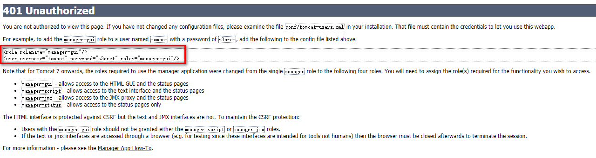
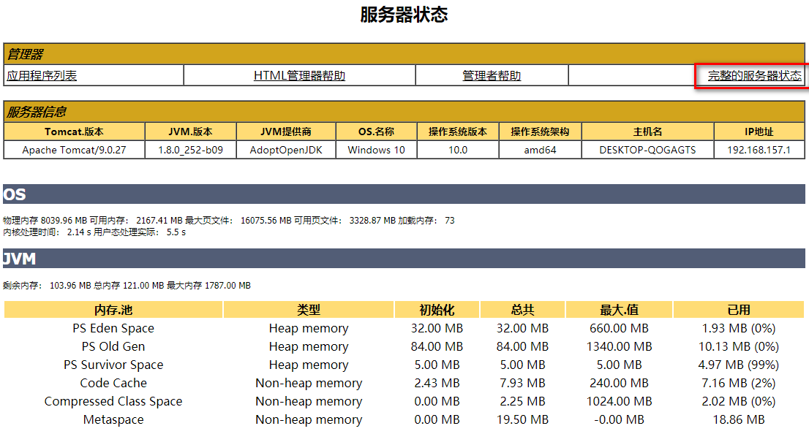

# 查看 tomcat 内存大小

1. startup.bat 启动

2. http://localhost:8080/manager/html 后点[取消]

3. 复制这两行到 conf/tomcat-users.xml

   

   ```xml
   <?xml version="1.0" encoding="UTF-8"?>
   <tomcat-users xmlns="http://tomcat.apache.org/xml"
                 xmlns:xsi="http://www.w3.org/2001/XMLSchema-instance"
                 xsi:schemaLocation="http://tomcat.apache.org/xml tomcat-users.xsd"
                 version="1.0">
   	<role rolename="manager-gui"/>
       <!-- 账号密码随意改 -->
   	<user username="tomcat" password="tomcat" roles="manager-gui"/>
   </tomcat-users>
   ```

4. 保存后重启tomcat

5. http://localhost:8080/manager/html 后输入账号密码

6. 点[完整的服务器状态]

   

# 设置 tomcat 内存大小

```bash
# bin/catalina.bat
# -Xms：设置启动时内存大小
# -Xmx：设置运行时最大可用内存
# -Xss：设置启动时每个线程分配的内存大小
# -Xmn：堆内新生代的大小

# jdk1.8+已作废 下
# -XX:PermSize：设置永久代大小
# -XX:MaxPermSize: 设置最大永久代大小
# jdk1.8+已作废 上

# -XX:MetaspaceSize：设置元空间大小 上面永久代作废改用这个 不在jvm内存 而在本机内存
set JAVA_OPTS=-Xms256m -Xmx2g
setlocal # 在 setlocal 上面
```

# 填坑

> org.apache.catalina.loader.WebappClassLoaderBase.clearReferencesJdbc Web应用程序 [abi] 注册了JDBC驱动程序 [com.mysql.jdbc.Driver]，但在Web应用程序停止时无法注销它。 为防止内存泄漏，JDBC驱动程序已被强制取消注册。
>
> ```bash
> # 将 WEB-INF\lib\mysql-connector-java-xxx.jar 拷贝到 tomcat\lib 下
> ```

