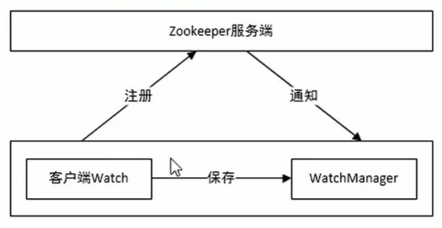
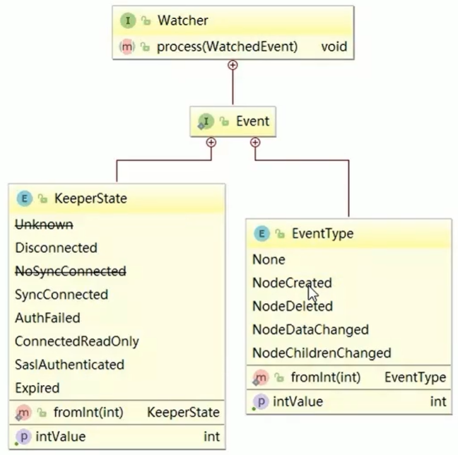
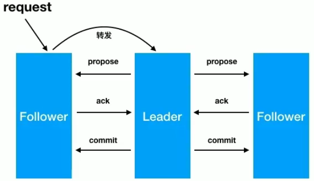

# 简介

zookeeper 英文名"动物园管理者"，因为其管理的其它组件多数都以动物作为名字。

zk 是一个经典的==分布式数据一致性解决方案==，致力于为分布式应用提供一个高性能、高可用，具有严格顺序访问控制能力的分布式协调存储服务。

## 1. 应用场景

- 维护配置信息
  - 用来集中管理集群中每台服务器的配置信息，一旦信息发生变化，会通过发布 / 订阅方式通知集群中每台服务器。
- 分布式锁服务
- 集群管理
  - 将从集群中加入/移除服务的情况通知给正在运行的其它服务，以便调整或分配资源。
  - 对故障的服务做出诊断并尝试修复。
- 生成分布式唯一ID

## 2. 设计目标

- 高性能：将全量数据存储在内存中，并直接服务于客户端所有非事务请求，由其适用以读为主的应用场景。
- 高可用：
  - 一般以集群方式对外提供服务，一般3到5台就可组成一个可用的zk集群，每台机器间都会保持通信。
  - 只要集群中超过一半的机器能够正常工作，那么整个集群就能正常对外服务。
- 严格顺序访问：对来自客户端的每个请求，zk都会分配一个全局唯一的递增编号，这个编号反映了所有事务操作的先后顺序。


# 数据模型

ZK的数据节点可视为树形结构，树中的节点称为znode，一个znode可以有多个子节点，使用path来定位某了znode（如：/a/a-1/a-1-1/a-1-1-1，分别为/根节点/1级节点/2极节点/3极节点）。znode兼具文件和目录两种特点，即像文件一样维护数据，又像目录一样作为路径标识的一部分。

## 1. znode组成部分

- 节点数据：即 znode data，path 和 data 关系就像 java map 中的 kety 和 value。
- 节点的子节点：children
- 节点的状态stat：描述当前节点的创建、修改记录，包括cZxid、ctime等。
  - 属性说明：当对节点进行写操作时，会自动创建事务ID；读不会

    | 属性           | 说明                                                         |
    | -------------- | ------------------------------------------------------------ |
    | cZxid          | 数据节点创建时的事务ID                                       |
    | ctime          | 数据节点创建的时间                                           |
    | mZxid          | 数据节点最后一次更新的事务ID                                 |
    | mtime          | 数据节点最后一次更新的时间                                   |
    | pZxid          | 子节点最后一次更新的事务ID                                   |
    | cversion       | 子节点的更新次数                                             |
    | dataVersion    | 节点数据的更新次数                                           |
    | aclVersion     | 节点的ACL==（权限相关）==更新次数                            |
    | ephemeralOwner | 若是临时节点，则表示创建该节点的sessionID；<br>若是持久节点，则该属性为0。==（可判断是临时还是持久节点）== |
    | dataLength     | 数据内容长度                                                 |
    | numChildren    | 当前节点的子节点数                                           |

## 2. 节点类型

zk 中有**临时节点**和**永久节点**两种，类型在创建时就已经确定，并且不能改变。

- 临时节点：
  - 其生命周期依赖于创建它们的会话。一旦会话结束，临时节点将被删除，也可手动删除。
  - 每个临时节点都会绑定到一个客户端会话，并且对所有客户端都是可见的。
  - ==临时节点不能有子节点==。
- 永久节点：其生命周期不依赖于会话，并且只有在客户端执行删除操作时才能被删除。


# 单机安装

==当前最新版本==：

```
ZooKeeper CLI version: 3.6.2--803c7f1a12f85978cb049af5e4ef23bd8b688715, built on 09/04/2020 12:44 GMT
```

zk因为是java写的，所以先需要安装jdk1.8后才能安装zk

```bash
# docker 安装
docker pull zookeeper # 下载
docker run -id --name=me-zk -p 2181:2181 -v /root/docker/zk/conf:/conf -v /root/docker/zk/data:/data zookeeper
```

## 配置

docker安装完zk后就不需要配置了，如果解压包安装的话还是需要配置。

```bash
# 1. 将 zoo_sample.cfg 改成 zoo.cfg
# 2. 编辑 zoo.cfg 文件
clientPort=2181                    # zk对外服务的端口号
dataDir=/data                      # 保存内存持久化快照文件的路径
dataLogDir=/datalog                # log文件目录
tickTime=2000
initLimit=5                        # 集群中的follower服务器与leader服务器之间初始连接时的超时时间（tickTime的倍数）
syncLimit=2                        # follower和leader之间发送消息，请求和应答的最大时间长度。（tickTime的倍数）
autopurge.snapRetainCount=3
autopurge.purgeInterval=0
maxClientCnxns=60
standaloneEnabled=true
admin.enableServer=true            # 是否启动后台管理
server.1=localhost:2888:3888;2181
```


# 常用命令

## 1. 登陆前的命令

```bash
zkServer.sh start  # 启动
zkServer.sh stop   # 停止
zkServer.sh status # 查看状态
#   ZooKeeper JMX enabled by default
#   Using config: /conf/zoo.cfg                                            # 配置文件位置
#   Client port found: 2181. Client address: localhost. Client SSL: false. # 连接信息
#   Mode: standalone
zkCli.sh                                # 登陆localhost:2181的zk
zkCli.sh -timeout 5000 -server ip:port  # 登陆指定ip端口的zk
```

## 2. 登陆后的命令

```bash
# ************全部命令**************
addWatch [-m mode] path # optional mode is one of [PERSISTENT, PERSISTENT_RECURSIVE] - default is PERSISTENT_RECURSIVE
addauth scheme auth
close # 关闭连接，但不退出，需要quit退出
config [-c] [-w] [-s]
connect host:port

# 新增节点
# -s:有序节点（不写为无序），-e:临时节点（不写为持久化节点），path:节点路径，data:写入的数据
create [-s] [-e] [-c] [-t ttl] path [data] [acl]
create -s -e /gt abcd        # 例：创建有序临时节点 /gt，数据abcd
#	Created /gt0000000000    # 有序的被创建成功，会给后面自动加序列号
							 # 重点：有序节点的序号是由父节点来维护的
#	Created /gt              # 无序的被创建成功

# 删除节点
delete [-v version] path       # -v起乐观锁的作用。当有子节点时删不掉
deleteall path [-b batch size] # 删除节点及子节点

delquota [-n|-b] path

# 获取节点信息（有序的要在后面补0，如：get /gt0000000000）
# -s：显示节点全部属性，不写只显示值
# -w：给该节点添加一个监视器，当该节点被修改会触发一个回调事件
#		WATCHER::
#		WatchedEvent state:SyncConnected type:NodeDataChanged path:/gt # 表示当前节点 /gt 被修改
get [-s] [-w] path

getAcl [-s] path
getAllChildrenNumber path
getEphemerals path
history # 查看敲过的命令
listquota path

# 查看节点列表
# -s：显示节点所有属性
# -R：显示所有子节点（竖着排）
# -w：监听器，与 get / stat 不同，只监听该节点下子节点的数量变化（即add/del操作）
ls [-s] [-w] [-R] path # ls / 查看所有根节点

printwatches on|off
quit # 退出登陆（退出后临时节点自动删除）
reconfig [-s] [-v version] [[-file path] | [-members serverID=host:port1:port2;port3[,...]*]] | [-add serverId=host:port1:port2;port3[,...]]* [-remove serverId[,...]*]
redo cmdno
removewatches path [-c|-d|-a] [-l]

# 修改节点数据。版本为可选项，默认每次修改都+1
# -s：修改后直接显示节点全部信息
# -v: 起乐观锁的作用。-v n，n只能是最后一次的版本号，否则修改不成功。(修改子节点不会触发)
set [-s] [-v version] path data

setAcl [-s] [-v version] [-R] path acl
setquota -n|-b val path

# 查看节点状态，与get -s 不同的是不会返回数据
# -w：监听器，跟get一样
stat [-w] path

sync path
version # 查看zk的版本
```


# 监听器

参照上面的 get / ls / stat 的 -w 参数，每个==监听器只能用一次==，监听到一次变化后就不会再监听。


# acl 权限控制

zk类似文件系统，客户端可以增删改节点，zk的 acl（access controller list）访问控制列表可以控制增删改的权限。

```bash
ls -la 	# 显示项里有文件权限
#	drwxr-xr-x.  4 root root   29 Nov  7 19:00 docker
#   rwx 为前3位，表示当前登陆用户对该文件的权限（读/写/执行）
#	r-x 为中间3位，表示当前组用记对该文件的权限（读/执行）
#	r-x 后3位，表示其它组用户对该文件的权限

setAcl [-s] [-v version] [-R] path acl # 设置权限的整体格式
getAcl [-s] path					   # 读取权限
```

acl权限控制涵盖三方面：

- 权限模式（scheme）：权限的策略

  - world：world:anyone，表示节点允许任何人做任何操作==（默认，即创建完就拥有cdrwa）==

    ```bash
    setAcl /gt world:anyone:drwa # （cdrwa少个c），不允许创建子节点
    ```

  - ip：  允许某ip进行或增或删可改操作

    ```bash
    # path ip:允许的ip:权限
    setAcl /gt ip:127.0.0.1:cdrwa,ip:192.168.2.36:cdrwa # 给多个ip开启权限
    ```

  - auth：  密码可以明文，和digest很像

    ```bash
    # addauth scheme auth     # 第一步先添加认证用户（auth和digest）
    addauth digest acc:123    # 账号acc，密码123
    setAcl /n1 auth:acc:cdrwa # 设置权限
    # 此时 get /n1 是能取到的，因为已经addauth了
    # 但quit后重新登陆，则需要重新 addauth
    get /n1 # 就可以访问了
    ```

  - digest：密码必须加密，和auth很像

    - 与auth模式的两点不同：
      - 不需要先addauth
      - 需要提供加密后的密码

    ```bash
    # setAcl path digest:账号:加密后的密码:acl
    setAcl /n1 digest:acc:kkSs0iUNGV03wPUYlKMU7tobjaA=:cdrwa # 取加密后的密码参照 centos.me -> 获取加密密码
    # 此时 get /n1 是能取到的，因为已经addauth了
    # 但quit后重新登陆，则需要重新 addauth
    addauth digest acc:123 # 重新addauth的密码给明文就行
    get /n1 # 就可以访问了
    ```

- 权限对象（id）：授权的对象

- 权限（permission）：授予的权限

  | 权限   | acl 简写 | 描述                       |
  | ------ | -------- | -------------------------- |
  | create | c        | 创建节点                   |
  | delete | d        | 删除节点                   |
  | read   | r        | 读节点数据及显示子节点列表 |
  | write  | w        | 设置节点数据               |
  | admin  | a        | 拥有管理权限               |


特性：

- zk的权限控制是基于每个节点的，需要对每个节点设置权限
- 每个节点支持设置多种权限控制方案和多个权限
- 子节点不会继承父节点的权限；客户端无权访问某节点，但有可能访问其子节点

## 1. 多种授权

```bash
addauth digest acc:123 # 先添加权限用户
setAcl /n1 ip:127.0.0.1:cdrwa,auth:acc:cdrwa,digest:acc:kkSs0iUNGV03wPUYlKMU7tobjaA=:cdrwa # ip,auth,digest三种模式
getAcl /n1		# 结果：
#	'ip,'127.0.0.1
#	: cdrwa
#	'digest,'acc:kkSs0iUNGV03wPUYlKMU7tobjaA=
#	: cdrwa
#	'digest,'acc:kkSs0iUNGV03wPUYlKMU7tobjaA=
#	: cdrwa
```

## 2. 超级管理员

zk的权限管理模式有一种叫super（超级管理员），该模式提供一个超管可以方便访问任何权限的节点。

```bash
# 添加超级管理员

# 假设超级管理员是 super:admin
# 1. super:admin取密码
echo -n super:admin | openssl dgst -binary -sha1 | openssl base64  # xQJmxLMiHGwaqBvst5y6rkB6HQs=
# 2. 在zkServer.sh里搜
nohup "$JAVA" $ZOO_DATADIR_AUTOCREATE "-Dzookeeper.log.dir=${ZOO_LOG_DIR}" \
    "-Dzookeeper.log.file=${ZOO_LOG_FILE}" "-Dzookeeper.root.logger=${ZOO_LOG4J_PROP}" \
# 3. 添加
"-Dzookeeper.DigestAuthenticationProvider.superDigest=super:xQJmxLMiHGwaqBvst5y6rkB6HQs="
# 4. 修改后为
nohup "$JAVA" $ZOO_DATADIR_AUTOCREATE "-Dzookeeper.log.dir=${ZOO_LOG_DIR}" \
    "-Dzookeeper.log.file=${ZOO_LOG_FILE}" "-Dzookeeper.root.logger=${ZOO_LOG4J_PROP}" \
    "-Dzookeeper.DigestAuthenticationProvider.superDigest=super:xQJmxLMiHGwaqBvst5y6rkB6HQs=" \
# 5. zkCli.sh登陆后，添加超管
addauth digest super:admin
# 6. get /n1 就可以访问带权限的节点了
```

==注意：==如果是docker容器运行的，发现超管不好用，那么修改上述第3，4步

```bash
start-foreground) # 搜索 .log.file 发现添加到 start-foreground 这里管用
    ZOO_CMD=(exec "$JAVA")
    if [ "${ZOO_NOEXEC}" != "" ]; then
      ZOO_CMD=("$JAVA")
    fi
    "${ZOO_CMD[@]}" $ZOO_DATADIR_AUTOCREATE "-Dzookeeper.log.dir=${ZOO_LOG_DIR}" \
    "-Dzookeeper.log.file=${ZOO_LOG_FILE}" "-Dzookeeper.root.logger=${ZOO_LOG4J_PROP}" "-Dzookeeper.DigestAuthenticationProvider.superDigest=super:xQJmxLMiHGwaqBvst5y6rkB6HQs=" \   # 这里！！！
    -XX:+HeapDumpOnOutOfMemoryError -XX:OnOutOfMemoryError='kill -9 %p' \
    -cp "$CLASSPATH" $JVMFLAGS $ZOOMAIN "$ZOOCFG"
    ;;
```


# javaApi

```xml
<!-- 添加依赖 -->
<dependency>
    <groupId>org.apache.zookeeper</groupId>
    <artifactId>zookeeper</artifactId>
    <version>3.6.2</version>
</dependency>
<!-- @Test依赖，参照java -> junit.md -->
```

## 1. 创建节点

```java
// 同步方式
create(String path, byte[] data, List<ACL> acl, CreateMode mode);
// 异步方式
create(String path, byte[] data, List<ACL> acl, CreateMode mode, AsyncCallback.StringCallback cb, Object ctx);

// path：节点路径，如：/n1/n2/n3...
// data：存到节点上的数据
// acl：权限列表。api 提供了一个静态接口 ZooDefs.Ids 来获取一些基本的acl列表。如：ZooDefs.Ids.OPEN_ACL_UNSAFE
// mode：节点类型（枚举）
// cb：异步回调接口
// ctx：传递上下文参数
```

### 1.1 创建连接

```java
public static void main(String[] args) throws IOException, InterruptedException {
    CountDownLatch latch = new CountDownLatch(1);

    // 创建连接（是异步创建的）
    // arg1：服务器ip及端口
    // arg2：服务器与客户端超时时间，单位毫秒
    //       当与服务器之间断网没超过这个时间又重新连上，则依然好用。
    //       断网时长超过这个时间则算session过期
    // arg3：监视器对象，new Watcher() { @Override process}
    //       可以监听服务器与客户端之间的状态
    ZooKeeper zk = new ZooKeeper("192.168.2.36:2181", 5000, e -> {
        if (e.getState() == Watcher.Event.KeeperState.SyncConnected) {
            System.out.println("连接成功!!!");
            latch.countDown();
        }
    });

    latch.await();

    System.out.println(zk.getSessionId()); // 打印会话id
    zk.close(); // 释放资源
}
// 结果：
//		连接成功!!!
//		72057599390318593
```

### 1.2 world/ip授权模式

```java
List<ACL> acls = new ArrayList<>();           // 权限列表
Id id = new Id("world", "anyone");            // 权限模式和授权对象

acls.add(new ACL(ZooDefs.Perms.CREATE, id));  // c
acls.add(new ACL(ZooDefs.Perms.DELETE, id));  // d
acls.add(new ACL(ZooDefs.Perms.READ, id));    // r
acls.add(new ACL(ZooDefs.Perms.WRITE, id));   // w
acls.add(new ACL(ZooDefs.Perms.ADMIN, id));   // a

id = new Id("id", "127.0.0.1");				  // ip模式
acls.add(new ACL(ZooDefs.Perms.ALL, id));	  // cdrwa
// arg3：权限列表
//      OPEN_ACL_UNSAFE：world:anyone:cdrwa
//      READ_ACL_UNSAFE：world:anyone:r
//      CREATOR_ALL_ACL：只有创建者才有权限（cdrwa）
//						只能和 addauth digest acc:123 连用
//						也就是 zk.addAuthInfo("digest", "acc:123".getBytes());
// arg4：节点类型
//      PERSISTENT：持久化节点
//		PERSISTENT_SEQUENTIAL：持久化有序节点
//		EPHEMERAL：临时节点
//		EPHEMERAL_SEQUENTIAL：临时有序节点
String n = zk.create("/n3", "n3".getBytes(), acls, CreateMode.PERSISTENT); // 返回结果：n=/n3
```

### 1.3 auth 授权模式

```java
zk.addAuthInfo("digest", "acc:123".getBytes()); // addauth digest acc:123
List<ACL> acls = new ArrayList<>();
Id id = new Id("auth", "acc");
acls.add(new ACL(ZooDefs.Perms.READ, id));      // 相当于 setAcl /n3 auth:acc:r
zk.create("/n2", "n2".getBytes(), acls, CreateMode.PERSISTENT); // 或者 ZooDefs.Id.CREATOR_ALL_ACL
```

### 1.4 digest 授权模式

```java
// 相当于 setAcl /n4 digest:acc1:QuZWekycNDpId6Mm8ViN+Rdb3Q0=:cdrwa
List<ACL> acls = new ArrayList<>();
Id id = new Id("digest", "acc1:QuZWekycNDpId6Mm8ViN+Rdb3Q0=");
acls.add(new ACL(ZooDefs.Perms.ALL, id));
zk.create("/n4", "n4".getBytes(), acls, CreateMode.PERSISTENT);
```

### 1.5 异步创建

```java
List<String> ctxs = Arrays.asList("ctx1", "ctx2", "ctx3");
zk.create(
    "/n6", "n6".getBytes(),
    ZooDefs.Ids.OPEN_ACL_UNSAFE,
    CreateMode.PERSISTENT,
    (r, p, ctx, n) -> {
        System.out.println(r);   // 0：代表创建成功
        System.out.println(p);   // 节点路径（无论创建成功与否，都为zk.create的arg1）
        System.out.println(ctx); // 上下文参数
        System.out.println(n);   // 节点路径（如果创建不成功r!=0时，为null）
    },
    ctxs
);
```

## 2. 更新节点

```java
// 同步方式
setData(String path, byte[] data, int version);
// 异步方式
setData(String path, byte[] data, int version, AsyncCallback.StatCallback cb, Object ctx);
// version：节点的当前版本，每次更新自动加1，起乐观锁的作用。
// cb：异步回调函数
// ctx：传递上下文参数
```

### 2.1 同步更新

```java
// arg3：-1 代表不用乐观锁功能
Stat s = zk.setData("/n1", "n11".getBytes(), -1);
System.out.println(JSON.toJSONString(s));
```

```json
// 返回结果：节点属性
{
  "aversion":0,
  "ctime":1605151553344,
  "cversion":0,
  "czxid":234,
  "dataLength":2,
  "ephemeralOwner":0,
  "mtime":1605151877706,
  "mzxid":239,
  "numChildren":0,
  "pzxid":234,
  "version":2
}
```

### 2.2 异步更新

```java
zk.setData(
    "/n1",
    "n".getBytes(),
    -1,
    (r,p,ctx,stat) -> {
        System.out.println(r);                       // 0：代表更新成功
        System.out.println(p);                       // 节点路径（无论更新成功与否，都为zk.setData的arg1）
        System.out.println(ctx);                     // 上下文参数
        System.out.println(JSON.toJSONString(stat)); // 更新后的结点属性
    },
    "i am ctx"
);
```

## 3. 删除节点

```java
// 同步方式
delete(String path, int version);
// 异步方式
delete(String path, int version, AsyncCallback.VoidCallback cb, Object ctx);
```

### 3.1 同步删除

```java
zk.delete("/n1", -1); // -1：不开启乐观锁功能
```

### 3.2 异步删除

```java
zk.delete(
    "/n1",
    -1,
    (r,p,ctx) -> {
        System.out.println(r);     // 0：代表删除成功
        System.out.println(p);     // 节点路径（无论删除成功与否，都为zk.delete的arg1）
        System.out.println(ctx);   // 上下文参数
    },
    "i am ctx"
);
```

## 4. 查看节点

```java
// 同步方式
getData(String path, boolean b, Stat stat);
// 异步方式
getData(String path, boolean b, Stat stat, AsyncCallback.DataCallback cb, Object ctx);
// b：是否使用连接对象中注册的监视器
// stat：节点属性
```

### 4.1 同步查看

```java
Stat s = new Stat();                       // 取得节点值顺便取得节点属性
byte[] bs = zk.getData("/n1", false, s);   // 返回 byte[]
System.out.println(new String(bs));        // 节点值
System.out.println(JSON.toJSONString(s));  // 节点属性
```

### 4.2 异步查看

```java
zk.getData(
    "/n1",
    false,
    (r,p,ctx,data,stat) -> {
        System.out.println(new String(data));         // 节点值
        System.out.println(JSON.toJSONString(stat));  // 节点属性
    },
    "i am ctx"
);
```

## 5. 查看子节点

```java
// 同步方式
getChildren(String path, boolean b);
// 异步方式
getChildren(String path, boolean b, AsyncCallback.ChildrenCallback cb, Object ctx);
```

### 5.1 同步查看

```java
List<String> ls = zk.getChildren("/n1", false); // 返回/n1下所有子节点
```

### 5.2 异步查看

```java
zk.getChildren(
    "/n1",
    false,
    (r,p,ctx,ls) -> {
        System.out.println(ls);  // 返回/n1下所有子节点
    },
    "ctx"
);
```

## 6. 检索节点是否存在

```java
// 同步方式
exists(String path, boolean b);
// 异步方式
exists(String path, boolean b, AsyncCallback.StatCallback cb, Object ctx);
```

### 6.1 同步方式

```java
Stat s = zk.exists("/n2", false); // 返回null表示不存在
```

### 6.2 异步方式

```java
zk.exists("/n1", false, (r,p,ctx,stat) -> {
    System.out.println(stat); // 存在返回节点信息，否则返回null
}, "ctx");
```

## ==解决java连zk慢==

> 原因：当使用ip创建ZooKeeper对象时，如果host中没有ip到主机名的映射，ZooKeeper创建过程中会调用ZooInetAddress.getHostName()这个方法从网络中获取主机名，这里耗费时间太长所致。通过调试定位到SaslServerPrincipal类的
>
> ```java
> static String getServerPrincipal(WrapperInetSocketAddress addr, ZKClientConfig clientConfig) {
>     String configuredServerPrincipal = clientConfig.getProperty(ZKClientConfig.ZOOKEEPER_SERVER_PRINCIPAL);
>     if (configuredServerPrincipal != null) { // 如果不为空，就不耗时了
>         // If server principal is already configured then return it
>         return configuredServerPrincipal;
>     }
>     String principalUserName = clientConfig.getProperty(
>         ZKClientConfig.ZK_SASL_CLIENT_USERNAME,
>         ZKClientConfig.ZK_SASL_CLIENT_USERNAME_DEFAULT);
>     String hostName = addr.getHostName();
>     ......
> 
>         if (canonicalize) {
>             WrapperInetAddress ia = addr.getAddress();
>             ......
>                 String canonicalHostName = ia.getCanonicalHostName();
>             //avoid using literal IP address when security check fails
>             if (!canonicalHostName.equals(ia.getHostAddress())) {
>                 hostName = canonicalHostName;
>             }
> 
>         }
>     String serverPrincipal = principalUserName + "/" + hostName;
>     return serverPrincipal;
> }
> ```

**传入ZKClientConfig对象解决慢的问题**

```java
String cnn = "192.168.2.36:2181";
CountDownLatch latch = new CountDownLatch(1);
ZKClientConfig cf = new ZKClientConfig();
cf.setProperty(ZKClientConfig.ZOOKEEPER_SERVER_PRINCIPAL, ZKClientConfig.ZK_SASL_CLIENT_USERNAME_DEFAULT + "/" + cnn);
zk = new ZooKeeper(cnn, 5000, e -> {
        if (e.getState() == Watcher.Event.KeeperState.SyncConnected) {
            System.out.println("连接成功!!!");
            latch.countDown();
        }
    },
	false, // true 表示只读
	new StaticHostProvider(new ConnectStringParser(cnn).getServerAddresses()), // ip和主机名的映射
	cf // ZKClientConfig 对象
);

latch.await();
```

# 事件监听机制

## 1. watcher概念

zk提供了发布/订阅功能，多个订阅者可同时监听某一特定主题对象，当该主题自身状态变化时（如节点内容改变、子节点列表改变等）会实时通知所有订阅者。

zk采用watcher机制实现发布订阅功能。被订阅主题发生变化时会==异步==通知客户端，因此客户端不必在watcher注册后轮询阻塞，从而减轻客户端压力。

watcher机制实际上与观察者模式类似，也可看作是一种观察者模式在分布式场景下的实现方式。

实现==watcher接口==的对象称为监视器（或监听器）对象。


## 2. watcher架构

watcher实现由三部分组成：zk服务端，zk客户端，客户端的ZKWatchManager对象

客户端首先将watcher注册到服务端，同时将watcher对象保存到客户端的watch管理器中。当zk服务端监听的数据状态发生变化时，服务端会主动通知客户端，接着客户端的watch管理器会触发相关的watcher回调相应的处理，从而完成整体的数据发布/订阅流程。



## 3. watcher特性

| 特性           | 说明                                                         |
| -------------- | ------------------------------------------------------------ |
| 一次性         | watcher是一次性的，一旦被触发就会移除，再次使用时需要重新注册 |
| 客户端顺序回调 | watcher回调是顺序串行化执行的，只有回调后客户端才能看到最新的数据状态。<br>一个watcher回调逻辑不就太多，以免影响别的watcher执行 |
| 轻量级         | WatchEvent是最小的通信单元，结构上只包含通知状态、事件类型和节点路径，<br>并不会告诉数据节点==变化前后==的具体内容 |
| 时效性         | watcher只有在当前session彻底失效时都会无效，若在session有效期内快速重连成功，<br>则wathcer依然存在，仍可接收到通知 |

## 4. watcher接口设计

watcher是一个接口，任何实现了watcher接口的类就是一个新的watcher。watcher内部包含两个枚举类：KeeperState、EventType

服务端回调的方法就是Watcher.process




### 4.1 通知状态（KeeperState）

是客户端与服务端连接状态发生变化时对应的通知类型。路径为org.apache.zookeeper.Watcher.Event.KeeperState，是一个枚举：

| 枚举属性      | 说明                     |
| ------------- | ------------------------ |
| SyncConnected | 客户端与服务器正常连接时 |
| Disconnected  | 客户端与服务器断开连接时 |
| Expired       | 会话session失效时        |
| AuthFailed    | 身份认证失败时           |

### 4.2 事件类型（EventType）

是数据节点发生变化时对应的通知类型。==当EventType变化时KeeperState永远处于SyncConnected状态；当KeeperState发生变化时，EventType永远为None。==路径为 org.apache.zookeeper.Watcher.Event.EventType，也是个枚举：

| 枚举属性            | 说明                                                         |
| ------------------- | ------------------------------------------------------------ |
| None                | 无                                                           |
| NodeCreated         | Watcher监听的数据节点被创建时                                |
| NodeDeleted         | Watcher监听的数据节点被删除时                                |
| NodeDataChanged     | Watcher监听的数据节点内容发生变化时（无论内容数据是否变化 ） |
| NodeChildrenChanged | Watcher监听的数据节点的子节点列表发生变化时                  |

**注：**客户端接收到的相关事件通知中只包含状态及类型等信息，不包含节点变化前后的具体内容，变化前的数据需要业务自身存储。

## 5. 捕获响应事件

在zk中采用zk.getChildren(path, isWatch)、zk.exists(path, isWatch)、zk.getData(path, isWatch, stat)这样方式为某个节点注册监听。

**调用的注册方法和可监听事件之间的关系：**

| 注册方式                      | Created | ChildrenChanged | Changed | Deleted |
| ----------------------------- | ------- | --------------- | ------- | ------- |
| zk.exists("/n1", isWatch)     | 可监控  |                 | 可监控  | 可监控  |
| zk.getData("/1", isWatch)     |         |                 | 可监控  | 可监控  |
| zk.getChildren("/n", isWatch) |         | 可监控          |         | 可监控  |

## 6. 注册watcher的方法

### 6.1 客户端与服务器的连接状态

```java
// 实现了Watcher接口就代表是一个监听
public class ZKConnectionWatcher implements Watcher {
    static final String CNN = "192.168.2.36:2181";       // zk服务器ip
    static CountDownLatch latch = new CountDownLatch(1); // 计数对象
    static ZooKeeper zk;                                 // 连接对象

    public static void main(String[] args) throws IOException, InterruptedException {
        ZKClientConfig cf = new ZKClientConfig();
        cf.setProperty(
            ZKClientConfig.ZOOKEEPER_SERVER_PRINCIPAL, 
            ZKClientConfig.ZK_SASL_CLIENT_USERNAME_DEFAULT + "/" + CNN
        );
        zk = new ZooKeeper(
            CNN,
            5000,
            new ZKConnectionWatcher(), // 监听者为实现 Watcher 接口的类
            false, // true 表示只读
            new StaticHostProvider(new ConnectStringParser(CNN).getServerAddresses()), // ip和主机名的映射
            cf // ZKClientConfig 对象
        );
        latch.await();
        System.out.println("sessionId：" + zk.getSessionId());
        TimeUnit.SECONDS.sleep(20); // 睡长一点，方便测试断开/超时状态
        zk.close();
        System.out.println("结束");
    }

    @Override
    public void process(WatchedEvent e) {
        // 为什么要判断==None，参照【4.2 事件类型（EventType）】
        if (e.getType() == Event.EventType.None) {
            switch (e.getState()) {
                case SyncConnected:  // 当断网后在new ZooKeeper.arg2时间内重新连上网，则还会监听到这个状态
                    System.out.println("连接成功");
                    latch.countDown(); // 连接成功后让main往下走
                    break;
                case Disconnected:   // sleep(20)这期间内把网断开会监听到这个状态
                    System.out.println("断开连接");
                    break;
                case Expired:		 // 当断网时长超过new ZooKeeper.arg2的时长，会监听到
                    System.out.println("会话超时");
                    // 在这里可以再次 new ZooKeeper 创建连接
                    break;
                case AuthFailed:
                    // 先设置权限：addauth digest acc:123 -> setAcl /n1 auth:acc:cdrwa
                    // 然后在上面.sleep()之前执行这两句
                    // zk.addAuthInfo("digest1", "acc:123".getBytes()); // 必须把zk.addAuthInfo的arg1写错才能触发
                    // zk.getData("/n1", false, null);
                    System.out.println("认证失败");
                    break;
            }
        }
    }
}
```

### 6.2 检查节点是否存在

==注：启动的监视器只能监听一次状态变化==

```java
// 使用连接对象(zk)的监视器
exists(String path, boolean true);
// 自定义监视器
exists(String path, Watcher w);
// 能够监听到的状态：
// NodeCreated：节点创建
// NodeDeleted：节点删除
// NodeDataChanged：节点内容发生变化
```

#### 6.2.1 连接对象的监视器

```java
// 创建连接
new ZooKeeper(
    "xxx",
    xxx,
    e -> {
        System.out.println("连接对象参数");
        if (e.getState() == Watcher.Event.KeeperState.SyncConnected) {
            latch.countDown();
        }
        System.out.println("path=" + e.getPath());
        System.out.println("eventType=" + e.getType());
    }
);
// 监听n1节点
zk.exists("/n1", true); // true 表示用zk的监听器
// sleep一段时间，这段时间内对n1执行create/delete/set操作都会被监听到
```

#### 6.2.2 自定义监视器

解决只能监听一次，每次监听到后就在process里再次注册监听。

```java
Watcher w = new Watcher() { // 必须要new Watcher写法，否则lambda写法zk.exists("/n1", this)的this不识别
    @Override
    public void process(WatchedEvent e) {
        try {
            System.out.println("exists2 path=" + e.getPath());
            System.out.println("exists2 eventType=" + e.getType());
            zk.exists("/n1", this); // 监听到后再次注册监听
        } catch (KeeperException ex) {
            ex.printStackTrace();
        } catch (InterruptedException ex) {
            ex.printStackTrace();
        }
    }
};
zk.exists("/n1", w); // 初次监听
// sleep一段时间，这段时间内对n1执行create/delete/set操作都会被监听到
```

#### 6.2.3 注册多个监听器

### 6.3 查看节点

==注：如果监听的/n1不存在，会报错==。此时再次监听时一定要判断节点是否是被==删除事件==，如果是就不要再注册了。

```java
// 使用连接对象(zk)的监视器
getData(String path, boolean true, Stat stat);
// 自定义监视器
getData(String path, Watcher w, Stat stat);
// 参监听到的状态：
// NodeDeleted：节点删除
// NodeDataChanged：节点内容发生变化
```

#### 6.3.1 连接对象的监视器

```java
zk.getData("/n1", true, null); // true 表示用zk的监听器
// sleep一段时间，这段时间内对n1执行delete/set操作都会被监听到
```

#### 6.3.2 自定义监听

```java
zk.getData("/n1", e -> {
    System.out.println("getData2 path=" + e.getPath());
    System.out.println("getData2 eventType=" + e.getType());
}, null);
// sleep一段时间，这段时间内对n1执行delete/set操作都会被监听到
```

### 6.4 查看子节点

```java
// 使用连接对象(zk)的监视器
getChildren(String path, boolean true);
// 自定义监视器
getChildren(String path, Watcher w);
// 能监听到的状态：
// NodeChildrenChanged：子节点发生增加删除变化（set监听不到）
// NodeDeleted：当前节点被删除
```

#### 6.4.1 连接对象的监视器

```java
zk.getChildren("/n1", true);
// sleep一段时间，这段时间内对n1的子节点执行delete/create以及当前节点的delete操作都会被监听到
```

#### 6.4.2 自定义监听

```java
zk.getChildren("/n1", e -> {
    System.out.println(e.getPath());
    System.out.println(e.getType());
});
// sleep一段时间，这段时间内对n1的子节点执行delete/create以及当前节点的delete操作都会被监听到
```


# 配置中心案例

场景：db的用户名和密码放在一个配置文件中，应用读取该配置文件并缓存。当用户名或密码改变时，还要重新加载到缓存比较麻烦，通过zk可以轻松完成。

设计思路：

1. 连接zk服务器
2. 读取zk中的配置信息，注册watcher，存入java本地变量
3. 当zk中的配置信息发生变化时，通过wathcer的回调方法捕获数据变化事件
4. 重新获取配置信息

```java
public class ZkMysqlConfig implements Watcher {
    final String CNN = "192.168.2.36:2181";
    CountDownLatch latch;
    private ZooKeeper zk;
    // 下：本地变量
    private String url;
    private String userName;
    private String password;
    // 上：本地变量

    public ZkMysqlConfig() {
        initZK(); // 创建连接
    }

    private void initZK() {
        try {
            latch = new CountDownLatch(1);
            zk = new ZooKeeper(CNN, 5000, this);
            latch.await();
        } catch (Exception e) {
            e.printStackTrace();
        }
    }

    private void readZK() { // 读取数据到本地
        try {
            url = new String(zk.getData("/config/mysql/url", true, null)); // true：用zk的监听器
            userName = new String(zk.getData("/config/mysql/username", true, null));
            password = new String(zk.getData("/config/mysql/password", true, null));

            System.out.println("url：" + url);
            System.out.println("username：" + userName);
            System.out.println("password：" + password);
        } catch (Exception e) {
            e.printStackTrace();
        }
    }

    @Override
    public void process(WatchedEvent e) {
        switch (e.getType()) {
            case None:                  // 当KeeperState发生变化时，EventType永远为None
                switch (e.getState()) {
                    case SyncConnected:
                        System.out.println("连接成功");
                        latch.countDown(); // 连接成功让程序往下走
                        readZK();          // 连接成功读取数据到本地
                        break;
                    case Disconnected:
                        System.out.println("连接断开");
                        initZK();         // 断开连接尝试重新连接
                        break;
                    case Expired:
                        System.out.println("连接超时");
                        break;
                    case AuthFailed:
                        System.out.println("验证失败");
                        break;
                }
                break;
            case NodeDataChanged:       // 当EventType变化时KeeperState永远处于SyncConnected状态
                System.out.println("节点变化");
                readZK();
                break;
        }
    }

    public static void main(String[] args) throws InterruptedException { // 入口方法
        ZkMysqlConfig cf = new ZkMysqlConfig();
        TimeUnit.SECONDS.sleep(60);
    }
}
```

# 分布式唯一ID案例

在单库单表中可以用自增列作为表唯一id，但在分表分库环境中就不行了。此时可以用zk在分布式环境下生成全局唯一id。

设计思路：

1. 连接zk服务器
2. 指定路径生成临时有序节点（==重点：有序节点的序号是由父节点来维护的==）
3. 取出序列号作为分布式环境下全局唯一id

```java
// 在上一个案例基础上
static final String defaultPath = "/uniqueId/table01/id";
// 当删除table01后再创建永久节点table01，再在/uniqueId/table01下创建有序节点又会从0开始
public String getUniqueId() {
    String id = "";
    try {
        // 创建临时有序节点
        id = zk.create(defaultPath, "".getBytes(), ZooDefs.Ids.OPEN_ACL_UNSAFE, CreateMode.EPHEMERAL_SEQUENTIAL);
    } catch (Exception e) {
        e.printStackTrace();
    }
    return id.replaceAll(defaultPath, ""); // 只取临时节点名后面数字部分
}
```

# 分布式锁案例

设计思路：

1. 每个客户端往/Lock下创建临时有序节点/Lock/lock_。
2. 获取/Lock下的子节点并倒序排，判断自己是否排在第一位，如果是则获得锁成功
3. 如果排第一位不是自己，则监听自己前一位节点。如：自己是lock_0004，则前一位是lock_0003
4. 当前一位节点的客户端执行完（即释放临时节点），则会被自己监听到
5. 监听逻辑重新执行第2步

下面实例中，锁这部分最核心的代码就是==rootWatcher==这两块儿。

```java
public class ZKLock {
    static final String IP = "192.168.2.36:2181";
    CountDownLatch latch = new CountDownLatch(1);
    ZooKeeper zk;
    static final String LOCK_ROOT_PATH = "/locks";
    static final String LOCK_NODE_PATH = "/lock_";
    String lock; // 保存当前创建的锁节点
    Watcher watcher = new Watcher() { // 用来监听锁的释放
        @Override
        public void process(WatchedEvent e) {
            if (e.getType() == Watcher.Event.EventType.NodeDeleted) {
                synchronized (this) {
                    notify(); // 锁已经释放，通知线程继续trLock
                }
            }
        }
    };
    Watcher rootWatcher = new Watcher() { // 用来监听root节点的创建
        @Override
        public void process(WatchedEvent e) {
            if (e.getType() == Event.EventType.NodeCreated) {
                synchronized (this) {
                    notify(); // 通知其它线程root已创建，可以往下执行了
                }
            }
        }
    };

    public ZKLock() {
        zk = new ZooKeeper(...);
        latch.await();
    }
    // 获取锁
    public void lock() throws Exception {
        createLock(); // 创建锁节点
        tryLock();    // 尝试获取锁
    }
    // 创建锁节点
    private void createLock() throws Exception {
        // 判断rootPath不存在则创建
        if (zk.exists(LOCK_ROOT_PATH, rootWatcher) == null) {
            synchronized (rootWatcher) {
                zk.create(
                    LOCK_ROOT_PATH, "".getBytes(),
                    ZooDefs.Ids.OPEN_ACL_UNSAFE, CreateMode.PERSISTENT,
                    (r,p,ctx,n) -> {},  // create必须异步，否则锁没意义
                    null
                );
                rootWatcher.wait();
            }
        }
        // 创建锁（临时有序）节点
        lock = zk.create(
                LOCK_ROOT_PATH + LOCK_NODE_PATH,
                "".getBytes(),
                ZooDefs.Ids.OPEN_ACL_UNSAFE,
                CreateMode.EPHEMERAL_SEQUENTIAL
        );
    }
    // 尝试获取锁
    private void tryLock() throws Exception {
        // 获取root下所有子节点（没有父节点前缘）
        List<String> ls = zk.getChildren(LOCK_ROOT_PATH, false);
        Collections.sort(ls, (x, y) -> y.compareTo(x)); // 降序
        int i = ls.indexOf(lock.replaceAll(LOCK_ROOT_PATH + "/", "")); // create出来的带有父节点，所以要把父节点部分去掉
        if (i == 0) { // 是第1个表示获得锁成功
            System.out.println(Thread.getcurrent().getName() + "：获取锁[" + lock + "]成功！");
            return;
        } else {      // 不是第1个就要监听前一个获得锁的节点
            String s = ls.get(i - 1); // 获取被锁的节点
            // 监听释放锁，判断null是因为有可能正要监听时正好释放了锁
            if (zk.exists(LOCK_ROOT_PATH + s, watcher) == null) {
                tryLock(); // 继续获取锁
            } else {
                synchronized (watcher) {
                    watcher.wait(); // 等待锁释放
                }
                tryLock(); // 继续获取锁
            }
        }
    }
    // 释放锁
    private void unLock() throws Exception {
        // zk.delete(lock, -1); 可以不用手机删，因为是临时节点，所以zk.close后会自动删除
        zk.close();
        System.out.println(Thread.getcurrent().getName() + "：锁已经释放");
    }

    public static void main(String[] args) throws Exception {
        class TicketSeller { // 模拟一个售票行为测试ZKLock
            public void sellTicketWithLock() throws Exception {
                ZKLock zkLock = new ZKLock();
                zkLock.lock();   // 获得锁
                sell();          // 售票
                zkLock.unLock(); // 释放锁
            }
            private void sell() throws InterruptedException {
                System.out.println(Thread.getcurrent().getName() + "：开始售票");
                TimeUnit.SECONDS.sleep(5);
                System.out.println(Thread.getcurrent().getName() + "：售票结束");
            }
        }

        for (int i = 0; i < 5; i++) { // 5个线程做测试
            new Thread(() -> {
                try {
                    new TicketSeller().sellTicketWithLock();
                } catch (Exception e) {
                    e.printStackTrace();
                }
            }, i + "").start();
        }
    }
}
```


# zookeeper集群

## 1. 环境搭建

搭建一个包含3台节点的集群，分别为2181，2182，2183

1. 再做2台zk服务（2182，2183）

2. 修改zoo.cfg配置

   ```bash
   clientPort=2181     # 其它两台为2182，2183
   dataDir=/2181/data  # 数据快照所在路径
   tickTime=2000
   initLimit=5
   syncLimit=2
   
   # 配置集群信息：server.A=B:C:D
   #		A：一个数字，表示这台服务器在集群中的唯一编号
   #		B：服务器ip
   #		C：zk服务器之间通信的端口
   #		D：leader选举的端口
   # 如：
   server.1=192.168.2.36:2287:3387
   server.2=192.168.2.36:2288:3388
   server.3=192.168.2.36:2289:3389 # 每台zk服务的zoo.cfg里都要写3个
   ```
   
3. 在dataDir下创建myid文件，然后在myid文件添加上一步的server.A数字。

   ```bash
   echo "1" > myid # 群集中每台服务都要在各自dataDir目录下执行
   ```

4. zkServer.sh start 启动每台服务

   > 如果 zkServer.sh status 发现报错：Error contacting service. It is probably not running.
   >
   > ==需要将3台都start后，再回头查看status==，此时就应该正常了。
   >
   > Mode：follower leader follower


## 2. 一致性协议（zab）

又叫zab协议，全称是 Zookeeper Atomic Broadcast（zk原子广播）。zk是通过zab协议来保证分布式事务的最终一致性。

基于zab协议，zk集群中的角色主要有以下三类：

| 角色                                   | 描述                                                         |
| -------------------------------------- | ------------------------------------------------------------ |
| 领导者（leader）                       | 负责投票的发起和决议，更新系统状态                           |
| 学习者（learner）： 跟随者（follower） | 用于接收客户请求并向客户端返回结果，在选主过程中参与投票     |
| 学习者（learner）：观察者（observer）  | 可以接收客户端连接，将写请求转发给 leader 节点。但不参加投票过程，<br>只同步 leader 的状态。目地是为了扩展系统，提高读取速度 |
| 客户端（client）                       | 请求发起方                                                   |

### 2.1 zab工作原理

集群中每个节点（无论什么角色）都会保存一分群集中数据的副本。

zab广播模式工作原理（==集群环境写操作==）：通过两阶段提交协议解决数据一致性



- 1.leader 从客户端收到一个写请求
- 2.leader 生成一个新的事务并为这个事务生成一个唯一的ZXID
- 3.leader 将这个事务提议（propose）发送给所有的 follows 节点
- 4.follower 节点将收到的事务请求加入到历史队列（history queue）中，并发送 ==ack（反馈消息）== 给 leader
- 5.当 leader 收到大多数 follower（半数以上节点）的 ack 消息，leader 会发送 commit 请求
- 6.当 follower 收到 commit 请求时，从历史队列中将事务请求 commit

***此时当其中一台zk create /n1 n1，其它两台zk上会同步出现 /n1 节点***

## 3. leader选举

### 3.1 服务器状态

| 状态      | 描述                                                         |
| --------- | ------------------------------------------------------------ |
| looking   | 寻找leader状态。当服务器处于该状态时会认为当前集群中没有leader，因此需要进入leader选举状态。 |
| leading   | 领导者状态。表明当前服务器角色是leader。                     |
| following | 跟随者状态。表明当前服务器角色是follower。                   |
| observing | 观察者状态。表明当前服务器角色是observer。                   |

### 3.2 启动时leader选举

在集群初始化阶段，当有一台服务器 *server1* 启动时，其单独无法进行和完成leader选举，当第二台服务器 *server2* 启动时，此时两台机器可以相互通信，每台机器都试图找到leader，于是进入leader选举过程：

- 每个server发出一个投票。由于是初始情况，*server1* 和 *server2* 都会将自己作为leader服务器来进行投票，每次投票会包含所推举的服务器的myid和zxid，用（myid,zxid）来表示。此时 *server1* 的投票为（1，0），*server2* 的投票为（2，0），然后各自将投票发给集群中其它机器。
- 集群中的每台服务器接收来自集群中各个服务器的投票。
- **处理投票**（针对每个投票，服务器都需要将别人的投票和自己的投票进行pk）规则：
  - 优先检查zxid，zxid大的服务器优先作为leader。
  - 如果zxid相同，那么就比较myid，myid大的服务器作为leader。
- **统计投票**：每次投票后，服务器都会统计投票信息，判断是否已经有过半机器接受到相同的投票信息。对于 *server1*、*server2* 而言，都统计出集群中已经有两台机器接受了（2，0）的投票信息，此时便认为已经选出了leader。
- **改变服务器状态**：一量确定了leader，每个服务器就会更新自己的`状态`，如果是follower，那就变为`following`，如果是leader，就变为`leading`。

### 3.3 运行时的leader选举

在zk运行期间，leader与非leader服务器各司其职，即使当有非leader服务器宕机或新加入，此时也不会影响leader，但是一旦leader服务器挂了，那么整个集群将暂停对外服务，进入新一轮leader选举，其过程和启动时的leader选举基本一致。

假设正在运行的 *server1*、*server2*、*server3* 三台服务器，当前leader是 *server2*，若某一时刻leader挂了，此时便开始leader选举，过程如下：

- **变更状态**：leader宕机后，余下的服务器都会将自己的状态变为`looking`（观察者状态），然后开始进入leader选举过程。
- **每个服务会发出一个投票**（在运行期间，每个服务器上的zxid可能不同，此时假定 *server1* 的zxid为122，*server3* 的zxid为122，在第一轮投票中，*server1* 和 *server3* 都会投自己，产生投票（1，122），（3，122），然后各自将投票发送给集群中所有机器）
- **接收来处各个服务器的投票**（与启动时过程相同）。
- **处理投票**（与启动时过程相同，此时，*server3* 将成为leader）。
- **统计投票**（与启动时过程相同）。
- **改变服务器状态**（与启动时过程相同）。

## 4. observer角色及配置

角色特点：

- 不参与集群的leader选举
- 不参与集群中写数据的ack反馈
- 但同样会同步数据

**为了使用observer角色，在任何想变成observer角色的配置文件中加入如下配置**：

```bash
peerType=observer # zoo.cfg
```

**并在所有server的配置文件中加上**：

```bash
server.3=192.168.2.36:2289:3389:observer # zoo.cfg
# 最后重启集群内的所有服务
```

## 5. api连接集群

```java
// arg1：集群内的zk服务ip:port（如：localhost:2181,localhost:2182...）
Zookeeper(String cnn, int sessionTimeOut, Watcher watcher);
// 如：
new ZooKeeper("localhost:2181,localhost:2182,localhost:2181,localhost:2183", 5000, ...)
```


# 开源客户端curator

## 1. curator介绍

curator是Netflix公司开源的一个zk客户端，后捐献给apache。curator框架在zk原生API接口上进行了包装，解决了很多zk客户端非常底层的细节开发。提供zk各种应用场景（如：分布式锁服务、集群leader选举、共享计算器、缓存机制、分布式队列等）的抽象封装，实现了Fluent（即链式编程）风格的API接口，是最好用、最流行的zk客户端。

- 原生zkAPI的不足：
  - 连接对象异步创建，需要开发人员自动编码等待
  - 连接没有超时自动重连机制
  - watcher一次注册生效一次
  - 不支持递归创建树形节点
- curator特点：
  - 解决了session会话超时重连
  - watcher反复注册
  - 简化开发api
  - 遵循Fluent风格的API
  - 提供了分布式锁服务、共享计算器、缓存机制等

```xml
<!-- curator依赖 -->
<!-- curator-framework：对zookeeper的底层api的一些封装。 -->
<!-- curator-client：提供一些客户端的操作，例如重试策略等。 -->
<!-- curator-recipes：封装了一些高级特性，如：Cache事件监听、选举、分布式锁、分布式计数器、分布式Barrier等。 -->
<!--                  一个recipes就包含了client和framework -->
<dependency>
    <groupId>org.apache.curator</groupId>
    <artifactId>curator-recipes</artifactId>
    <version>5.1.0</version>
    <exclusions>
        <exclusion> <!-- recipes默认加载zookeeper3.6.0，这里给排除掉用下面的3.6.2版本 -->
            <groupId>org.apache.zookeeper</groupId>
            <artifactId>zookeeper</artifactId>
        </exclusion>
    </exclusions>
</dependency>
<dependency>
    <groupId>org.apache.zookeeper</groupId>
    <artifactId>zookeeper</artifactId>
    <version>3.6.2</version>
</dependency>
```

```java
static final String CNN = "192.168.2.36:2182,192.168.2.36:2183,192.168.2.36:2184";

public static void main(String[] args) {
    CuratorFramework cli = CuratorFrameworkFactory.builder() // 创建连接对象
        .connectString(CNN)                  // 连接串
        .sessionTimeoutMs(20000)             // 超时时间20秒
        .connectionTimeoutMs(20000)          // 连接超时20秒
        .retryPolicy(new RetryOneTime(3000)) // 重连机制（本例为超时后3秒重连1次（仅1次））
        .namespace("create")                 // 命名空间（以 /create 作为父节点），不写则默认根节点
        .build();

    cli.start(); // 打开连接
    boolean b = cli.isStarted(); // 是否连接成功，该方法未来将被删除
	cli.getState();              // 改用这个。LATENT：start()没调用，STARTED：start()被调用，STOPPED：close()被调用
    cli.close(); // 关闭连接
}
```

## 2. 四种重连策略

```java
new RetryOneTime(3000);               // 第一种：3秒后只连1次
new RetryNTimes(3, 3000);             // 第二种：每3秒重连一次，一共会重连3次
new RetryUntilElapsed(10000, 3000);   // 第三种：每3秒重连一次，10秒后停止重连
// 重连间隔计算公式：arg1 * Math.max(1, random.nextInt(1 << (retryCount + 1)))
new ExponentialBackoffRetry(1000, 3); // 第四种：随着重连次数的增加，重连间隔也会加长，一共重连3次
```

## ==3. curator 慢的问题==

发现通过curator连zk时很慢，但也没找到好的解决办法，所以只能把 CuratorFramework 作为 bean 放到springboot里了。

虽然是慢，但只是第一次读写时候慢，一次过后只要连接不段还是很快的。

```java
@Bean
public CuratorFramework curatorFramework() {
    CuratorFramework cli = CuratorFrameworkFactory.builder()
        .connectString("192.168.2.36:2182,192.168.2.36:2183,192.168.2.36:2184")
        .sessionTimeoutMs(20000)
        .connectionTimeoutMs(20000)
        .retryPolicy(new ExponentialBackoffRetry(1000, 3))
        .namespace("create")
        .build();
    cli.start();
    log.info("zookeeper连接成功：" + cli.isStarted());
    return cli;
}
```

然后将springboot的启动器设置成 *Update classes and resources*，这样就不用每次修改都重启了。

## 4. 基本用法

### 4.1 创建节点

```java
// eg1
cli.create()
    .withMode(CreateMode.PERSISTENT)      // 节点类型：永久（默认）
    .withACL(ZooDefs.Ids.OPEN_ACL_UNSAFE) // 权限列表：world:anyone:cdrwa
    .forPath("/n1", "n1".getBytes());	  // arg1：节点路径，agr2：节点值
// eg2
cli.create().forPath("/n1", "n1".getBytes()); // 等同于eg1，不写withMode/withACL的话默认永久且world:anyone:cdrwa
// eg3：自定义权限列表
List<ACL> lst = new ArrayList<>();
lst.add(new ACL(ZooDefs.Perms.ALL, new Id("ip", "192.168.2.240")));
cli.create().withACL(lst).forPath("/n3", "n3".getBytes());
// eg4：递归创建
cli.create().creatingParentsIfNeeded().forPath("/n1/n11/n111", "n111".getBytes());
// eg5：异步创建节点
//    结果：end /n7 CREATE
cli.create().inBackground((c, e) -> {
    System.out.println(e.getPath());
    System.out.println(e.getType());
}).forPath("/n7", "n7".getBytes());
System.out.println("end");
```

- creatingParentsIfNeeded：如果父节点不存在，则一层一层递增创建（与下面不同点在于创建的不是==容器节点==）
- creatingParentContainersIfNeeded：如果父节点不存在，使用 CreateMode.CONTAINER 递增创建
  - ==CreateMode.CONTAINER==：==容器节点==是zk最新版本中的一个新功能，可用于leader和lock等

### 4.2 更新节点

```java
// eg1
cli.setData().forPath("/n1", "n11".getBytes());
// eg2：带乐观锁的更新
cli.setData().withVersion(2).forPath("/n1", "n11".getBytes()); // withVersion(-1)表示不加锁
// eg3：异步方式更新
//    结果：end /n2 SET_DATA
cli.setData()
    .inBackground((c, e) -> {
        System.out.println(e.getPath());
        System.out.println(e.getType());
    })
    .forPath("/n2", "n22".getBytes());
System.out.println("end");
```

### 4.3 删除节点

```java
// eg1
cli.delete().forPath("/n7"); // 节点/n7下不能有子节点，否则报错
// eg2：带乐观锁删除
cli.delete().withVersion(0).forPath("/n6");
// eg3：连子节点一起删除
cli.delete().deletingChildrenIfNeeded().forPath("/n1");
// eg4：异步删除
//    结果：end /n6 DELETE
cli.delete().inBackground((c, e) -> {
    System.out.println(e.getPath());
    System.out.println(e.getType());
}).forPath("/n6");
System.out.println("end");
```

### 4.4 查看节点

```java
// eg1
cli.getData().forPath("/n2"); // 需要 new String(rlt) 转成字符串
// eg2：读取节点属性
//    结果：{
//            "aversion":0,"ctime":1606276872653,"cversion":0,"czxid":25769803788,"dataLength":3,
//            "ephemeralOwner":0,"mtime":1606285212526,"mzxid":25769803808,"numChildren":0,
//            "pzxid":25769803788,"version":1
//         }
Stat stat = new Stat();
String s = new String(cli.getData().storingStatIn(stat).forPath("/n2"));
System.out.println(JSON.toJSONString(stat));
// eg3：异步读取
//    结果：end /n6 GET_DATA n22
cli.getData()
    .inBackground((c, e) -> {
        System.out.println(e.getPath());
        System.out.println(e.getType());
        System.out.println(new String(e.getData()));
    })
    .forPath("/n2");
System.out.println("end");
```

### 4.5 查看子节点

```java
// eg1
List<String> lst = cli.getChildren().forPath("/n4");
// eg2：异步方式
//    结果：end /n4 CHILDREN [n44]
cli.getChildren()
    .inBackground((c, e) -> {
        System.out.println(e.getPath());
        System.out.println(e.getType());
        System.out.println(e.getChildren());
    })
    .forPath("/n4");
System.out.println("end");
```

### 4.6 节点是否存在

```java
// eg1，结果：{
//              "aversion":0,"ctime":1606281488995,"cversion":1,"czxid":25769803799,
//              "dataLength":0,"ephemeralOwner":0,"mtime":1606281488995,"mzxid":25769803799,
//              "numChildren":1,"pzxid":25769803800,"version":0
//           }
Stat stat = cli.checkExists().forPath("/n4"); // 如果换成不存在的节点返回 null
System.out.println(JSON.toJSONString(stat));
// eg2：异步方式判断
//    结果：end /n4 EXISTS
//         {
//              "aversion":0,"ctime":1606281488995,"cversion":1,"czxid":25769803799,"dataLength":0,
//              "ephemeralOwner":0,"mtime":1606281488995,"mzxid":25769803799,"numChildren":1,
//              "pzxid":25769803800,"version":0
//         }
cli.checkExists()
    .inBackground((c, e) -> {
        System.out.println(e.getPath());
        System.out.println(e.getType());
        System.out.println(JSON.toJSONString(e.getStat()));
    })
    .forPath("/n4");
System.out.println("end");
```

## 5. watcher API

curator 提供两种 watcher（cache）来监听节点变化。

- Node Cache：只监听某一特定节点，监听节点的创建和修改
- PathChildren Cache：监控一个节点的子节点。当一个子节点增加、更新、删除时，Path Cache 会改变它的状态，并包含最新子节点及数据及状态。

==但是：上面这两个在新版本中有了替代者，在未来版本中会被删除。==

替代它们的是==CuratorCache==。

### 5.1 api 详解

#### 5.1.1 CuratorCacheListener

- event：当节点被创建、修改、删除时被调用

- enum Type：上面event的类型
  - NODE_CREATED：创建节点
  - NODE_CHANGED：修改节点
  - NODE_DELETED：删除节点
- builder：返回一个CuratorCacheListenerBuilder接口

#### 5.1.2 CuratorCacheListenerBuilder

当**CuratorCacheListener**.builder()时会返回一个CuratorCacheListenerBuilder接口

| 方法名                   | 参数                                                         | 功能                                                         |
| ------------------------ | ------------------------------------------------------------ | ------------------------------------------------------------ |
| forAll                   | CuratorCacheListener                                         | 一个标准监听器                                               |
| forCreates               | Consumer`<ChildData>`                                        | 只监听创建                                                   |
| forChanges               | ChangeListener：<br>void event(ChildData oldNode, ChildData node) | 只监听更新                                                   |
| forCreatesAndChanges     | ChangeListener                                               | 监听创建和更新                                               |
| forDeletes               | Consumer`<ChildData>`                                        | 只监听删除                                                   |
| forInitialized           | Runnable                                                     | 监听CuratorCacheListener.initialized                         |
| ==forPathChildrenCache== | String 节点路径<br>CuratorFramework 客户端实例<br>PathChildrenCacheListener | 监听子节点发生变化<br>（==官方也没给出怎么用的例子，<br>所以只能用PathChildrenCache了==） |
| forTreeCache             | CuratorFramework<br>TreeCacheListener                        | 监听本身及其子节点                                           |
| forNodeCache             | NodeCacheListener                                            |                                                              |

### 5.2 实例

```java
// eg1：监听某节点的变化
//	set /create/n1 n11 结果：path:/n1 data:n11 stat:...
CuratorCache build = CuratorCache.builder(cli, "/n1").build(); // agr1：CuratorFramework，arg2：节点path
CuratorCacheListener listener = CuratorCacheListener
    .builder()
    .forNodeCache(() -> { // new NodeCacheListener
        ChildData dt = build.stream().findFirst().get();
        System.out.println("path:" + dt.getPath());
        System.out.println("data:" + new String(dt.getData()));
        System.out.println("stat:" + JSON.toJSONString(dt.getStat()));
    })
    .build(); // 创建一个监听器
build.listenable().addListener(listener); // 添加监听器
build.start(); // 开始监听
TimeUnit.SECONDS.sleep(30); // 睡30秒
build.close(); // 用完一定要关闭，不然下次再用会执行两次，再没关3次...依以类推
```

```java
// eg2：监听子节点变化
//    注意：原本可以用CuratorCacheListenerBuilder.forPathChildrenCache来替代本例中未来将要删除的PathChildrenCache
//         但官方例子没有给出怎么用，所以只能用PathChildrenCache了
PathChildrenCache cache = new PathChildrenCache(cli, "/n4", true);
cache.getListenable().addListener((c, e) -> {
    // 父节点信息
    System.out.println(e.getType()); // 结果：CHILD_ADDED，CHILD_REMOVED，CHILD_UPDATED
    // 子节点信息
    ChildData child = e.getData();
    System.out.println(child.getPath());             // 结果：/n4/n41
    // 当 new PathChildrenCache(cli, "/n4", false) arg3为false时，最新值取不到
    System.out.println(new String(child.getData())); // 最新的值，结果：n41
    System.out.println(child.getStat());
});
cache.start(); // 开始监听
TimeUnit.SECONDS.sleep(30);
cache.close(); // 关闭
```

## 6. 事务

cli.inTransaction() 在未来版本会被删除，这里采用新写法。

```java
// 不加事务
cli.create().forPath("/n1", "n1".getBytes());    // 创建一个不存在的节点，ok正常通过
cli.setData().forPath("/n11", "n11".getBytes()); // 修改一个不存在的节点，err崩了
// 但最终/n1节点还是被创建了
```

```java
// 加事务
List<CuratorTransactionResult> list = cli.transaction().forOperations(
    cli.transactionOp().create().forPath("/n1", "n1".getBytes()),    // 切记要 cli.transactionOp().create()
    cli.transactionOp().setData().forPath("/n11", "n11".getBytes())
);
list.stream().forEach(x -> System.out.println(JSON.toJSONString(x))); // 打印返回结果
// 与上面同样的条件，最终/n1节点没有被创建
```

## 7. 分布式锁

- *各种锁概念参照 -> JUC并发.md -> 2，Lock 锁*
- InterProcessMutex：分布式可重入排它锁
- InterProcessReadWriteLock：分布式读写锁

```java
// 排它锁
@GetMapping("lock/{name}")
public Object lock(@PathVariable String name) throws Exception {
    // arg1：连接对象
    // arg2：节点路径
    InterProcessMutex lock = new InterProcessMutex(cli, "/n1"); // 节点/n1可以理解为要锁的key
    System.out.println(name + "等待获取锁");
    lock.acquire(); // 获取锁 下：要锁的操作
    for (int i = 0; i < 10; i++) {
        System.out.println(name + i);
        TimeUnit.SECONDS.sleep(3);
    }
    lock.release(); // 释放锁 上：要锁的操作
    System.out.println(name + "释放了锁");
    return name;
}
// 先访问 http://localhost:8080/loca/a 后访问 http://localhost:8080/loca/b 会锁
```

```java
// 读写锁
@GetMapping("read/lock/{name}") // 读锁
public Object readLock(@PathVariable String name) throws Exception {
    InterProcessReadWriteLock lock = new InterProcessReadWriteLock(cli, "/n1");
    InterProcessMutex readLock = lock.readLock(); // 读锁
    System.out.println("读【" + name + "】等待获取锁");
    readLock.acquire(); // 获取锁 下：要锁的操作
    for (int i = 0; i < 10; i++) {
        System.out.println(name + i);
        TimeUnit.SECONDS.sleep(3);
    }
    readLock.release(); // 释放锁 上：要锁的操作
    System.out.println("读【" + name + "】释放了锁");
    return name;
}
@GetMapping("write/lock/{name}") // 写锁
public Object writeLock(@PathVariable String name) throws Exception {
    InterProcessReadWriteLock lock = new InterProcessReadWriteLock(cli, "/n1");
    InterProcessMutex writeLock = lock.writeLock(); // 写锁
    System.out.println("写【" + name + "】等待获取锁");
    writeLock.acquire(); // 获取锁 下：要锁的操作
    for (int i = 0; i < 10; i++) {
        System.out.println(name + i);
        TimeUnit.SECONDS.sleep(3);
    }
    writeLock.release(); // 释放锁 上：要锁的操作
    System.out.println("写【" + name + "】释放了锁");
    return name;
}
// 先访问 http://localhost:8080/read/loca/a 后访问 http://localhost:8080/read/loca/b    不会锁
// 先访问 http://localhost:8080/write/loca/c 后访问 http://localhost:8080/write/loca/d  会锁
// 先访问 http://localhost:8080/read/loca/a 后访问 http://localhost:8080/write/loca/d   会锁
// 先访问 http://localhost:8080/write/loca/c 后访问 http://localhost:8080/read/loca/b   会锁
```


# zk四字监控命令

zk支持某些特定的四字命令与其交互。它们大多是查询命令，用来获取zk服务的当前状态及相关信息。用户在客户端可以通过 telnet 或 nc 向zk提交相应命令。zk常用的四字命令：

| 命令 | 描述                                                         |
| ---- | ------------------------------------------------------------ |
| conf | 输出相关服务配置的详细信息。比如端口、zk数据及日志配置路径、最大连接数、session超时时间、serverId等 |
| cons | 列出所有连接到这台服务器的客户端连接（会话）的详细信息。包括“接受/发送”的包数量、sessionId、操作延迟、最后的操作执行等信息 |
| crst | 重置当前这台服务器所有连接（会话）的统计信息                 |
| dump | 列出未经处理的会话和临时节点                                 |
| envi | 输出关于服务器的环境详细信息                                 |
| ruok | 测试服务是否处于正确运行状态。如果正常排架“imok”，否则返回空 |
| stat | 输出服务器的详细信息：接收/发送包数量、连接数、模式（leader/follower）、节点总数、延迟、所有客户端列表==(与srvr相似)== |
| srst | 重置server状态                                               |
| wchs | 列出服务器watches的简洁信息：连接总数、watching节点总数和watches总数 |
| wchc | 通过session分组，列出watch的所有节点，它的输出是一个与watch相关的会话的节点列表 |
| mntr | 列出集群的健康状态。包括“接受/发送”包数量、操作延迟、当前服务模式（leader/follower）、节点总数、watch总数、临时节点总数 |

## 1. 安装telnet和nc

```bash
yum install telnet.x86_64 # 安装telnet
telnet 127.0.0.1 2182 # 连接
# 安装nc
wget http://vault.centos.org/6.6/os/x86_64/Packages/nc-1.84-22.el6.x86_64.rpm
rpm -iUv nc-1.84-22.el6.x86_64.rpm
```

## 2. 开启四字命令

==重点：==想让telnet或nc起作用，要先开启zk的四字命令，否则telnet/nc都不好用

```bash
# 在 zoo.cfg 里添加配置
4lw.commands.whitelist=*
```

## 3. conf

```bash
echo conf | nc localhost 2182 # 查看信息命令
```

| 属性              | 描述                                                         |
| ----------------- | ------------------------------------------------------------ |
| clientPort        | 对外服务的端口号                                             |
| dataDir           | 数据快照文件目录，默认情况下10万次事务操作生成一次快照       |
| dataLogDir        | 事务日志文件目录，生产环境中放在独立的磁盘上                 |
| tickTime          | 服务器之间或客户端与服务器之间维持心跳的时间间隔（单位毫秒） |
| maxClientCnxns    | 最大连接数                                                   |
| minSessionTimeout | 最小session超时 minSessionTimeout = tickTime * 2             |
| maxSessionTimeout | 最大session超时 maxSessionTimeout = tickTime * 20            |
| serverId          | 服务器编号                                                   |
| initLimit         | 集群中的follower服务器(F)与leader服务器(L)之间初始连接时能容忍的最多心跳数 |
| syncLimit         | 集群中的follower服务器(F)与leader服务器(L)之间请求和应答间能容忍的最多心跳 |
| electionAlg       | 0：基于UDP的LeaderElection<br />1：基于UDP的FastLeaderElection<br />2：基于UDP和认证的FastLeaderElection<br />3：基于TCP的FastLeaderElection 在3.4.10版本中，默认值为3另外三种算法已经被弃用，并且有计划在之后的版本中将它们彻底删除而不再支持 |
| electionPort      | 选举端口                                                     |
| quorumPort        | 数据通信端口                                                 |
| peerType          | 是否为观察者，1表示为观察者                                  |

==注意==：以上这些不是写在zoo.cfg里的，非是通过四字命令显示出来的内容。

## 4. cons

```bash
echo cons | nc localhost 2182 # 命令
# 结果：
 /0:0:0:0:0:0:0:1:42962[0](queued=0,recved=1,sent=0)  # nc连接zk的会话
 /127.0.0.1:45662[1](
 			queued=0,recved=15,sent=15,sid=0x200d4822bfe0002,lop=PING,est=1606430996044,to=30000,
 			lcxid=0x0,lzxid=0x800000008,lresp=3619619499,llat=0,minlat=0,avglat=0,maxlat=3
 		)
```

| 属性     | 描述                                                         |
| -------- | ------------------------------------------------------------ |
| ip       | 客户端ip地址                                                 |
| port     | 客户端端口号                                                 |
| queued   | 当前连接等待被处理的请求数，请求缓存在队列中                 |
| received | 当前连接收到的包数                                           |
| sent     | 当前连接发送的包数                                           |
| sid      | 当前连接会话(session)id                                      |
| lop      | 当前连接最后的操作：GETD（读取数据）DELE（删除数据）CREA（创建数据） |
| est      | 创建连接时的时间戳                                           |
| to       | 当前连接的超时时间                                           |
| lcxid    | 当前连接会话的操作id（客户端每一步操作都会+1）               |
| lzxid    | 当前连接最大事务id（与创建一个节点后，再get -s 的 cZxid 值相等） |
| lresp    | 当前连接最后响应时间戳                                       |
| llat     | 最后（最新）延时                                             |
| minlat   | 最小延时                                                     |
| maxlat   | 最大延时                                                     |
| avglat   | 平均延时                                                     |

## 5. dump

```bash
echo dump | nc localhost 2182 # 命令
# 结果：
SessionTracker dump:
Global Sessions(2): # 一共两个客户端连接
0x200d4822bfe0002       30000ms # 客户端2
0x300d48235cb0000       30000ms # 客户端1
ephemeral nodes dump:
Sessions with Ephemerals (2):
0x300d48235cb0000:     # 客户端1里的两个临时节点 /n3 /n4
        /n3
        /n4
0x200d4822bfe0002:     # 客户端2里的两个临时节点 /n1 /n2
        /n1
        /n2
Connections dump:
Connections Sets (1)/(1):
1 expire at Fri Nov 27 11:06:36 CST 2020:
        ip: /0:0:0:0:0:0:0:1:52884 sessionId: 0x0
```

## 6. envi

```bash
echo envi | nc localhost 2182 # 命令
```

| 属性              | 描述                                        |
| ----------------- | ------------------------------------------- |
| zookeeper.version | zk版本                                      |
| host.name         | 服务器名                                    |
| java.version      | java版本                                    |
| java.vendor       | java提供商                                  |
| java.home         | 环境目录                                    |
| java.class.path   | classpath                                   |
| java.library.path | 第三方库指定非java类包的位置（如：dll，so） |
| java.io.tmpdir    | 默认的临时文件路径                          |
| java.compiler     | JIT编译器名称                               |
| os.name           | 操作系统名（Linux）                         |
| os.arch           | (amd64)                                     |
| os.version        | 3.10.0-1127.13.1.el7.x86_64                 |
| user.name         | linux登陆的用户名                           |

## 7. ruok

```bash
echo ruok | nc localhost 2182 # 结果：imok
```

## 8. stat

```bash
echo stat | nc localhost 2182 # 结果：
Zookeeper version: 3.6.2--803c7f1a12f85978cb049af5e4ef23bd8b688715, built on 09/04/2020 12:44 GMT
Clients:
 /0:0:0:0:0:0:0:1:52974[0](queued=0,recved=1,sent=0)

Latency min/avg/max: 0/0.0/0
Received: 13
Sent: 13
Connections: 1
Outstanding: 0
Zxid: 0x80000000f
Mode: follower
Node count: 17
```

| 属性                | 描述       |
| ------------------- | ---------- |
| Zookeeper version   | 版本       |
| Latency min/avg/max | 延时       |
| Received            | 收包       |
| Sent                | 发包       |
| Connections         | 接连数     |
| Outstanding         | 堆积数     |
| Zxid                | 最大事物id |
| Mode                | 服务器角色 |
| Node count          | 节点数     |

# ZooInspector

是一款zk客户端可视化工具

下载地址：https://issues.apache.org/jira/secure/attachment/12436620/ZooInspector.zip

```bash
# 解压后进入build文件夹
java -jar zookeeper-dev-ZooInspector.jar # 启动可视化界面
```

# taokeeper监控工具(==放弃==)

基于zk的监控管理工具，由淘宝团队开源的zk管理中间件，安装前要求服务先配置 nc 和 sshd

```bash
# 下载地址：
https://github.com/downloads/alibaba/taokeeper/taokeeper.sql                        # 数据脚本
https://github.com/downloads/alibaba/taokeeper/taokeeper-monitor.tar.gz             # 主程序
https://github.com/downloads/alibaba/taokeeper/taokeeper-monitor-config.properties  # 配置文件
```

这个东西太老太难配了，只好用其它来代替（如：Prometheus 和 zabbix）。==Prometheus== 要优于 zabbix，前者用go写的具支持k8s，后者C+PHP写的具容器支持较差。


https://www.bilibili.com/video/BV1M741137qY?p=74