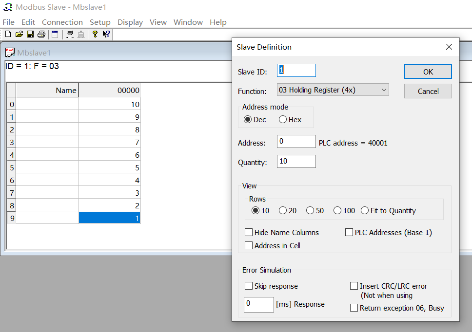

# 通信协议

## 说明

1）开源免费

2）应用在多种电气接口及通信介质中（介质有：串口、以太网等）

3）报文帧简单紧凑

4）**串口**下应用的协议：ModbusRtu、ModbusAscii、ModbusTcp(可以串口，但几乎不用)

5）ModbusTcp 协议下用 ModbusUdp

6）**以太网**下应用的协议：...RtuOverTcp、...RtuOverUdp、...AsciiOverTcp、...AsciiOverUdp

7）Modbus 一共上述 8 种协议

## 存储区

不同存储区分存不同数据类型

- 数据类型：布尔量、寄存器

- 读写性：只读、读写

4种存储区：

- 只读布尔量：输入线圈      （1区：10001~19999）

- 只读寄存器：输入寄存器  （3区：30001~39999）

- 读写布尔量：输出线圈      （0区：00001~09999）

- 读写寄存器：输出寄存器  （4区：40001~49999）
- 特殊情况有 400001~465535

## 功能码

读取输入线圈：            0x02

读取输入寄存器：        0x04

读取输出线圈：            0x01

读取输出寄存器：        0x03

写入单个输出线圈：    0x05

写入多个输出线圈：    0x0F

写入单个输出寄存器：0x06

写入多个输出寄存器：0x10

## 调试神器

1）ModbusPoll：扮演**客户端**或主站角色

2）ModbusSlave：扮演**服务器**或从站角色

3）VSPD：扮演虚拟串口

## 分析

在串行链路中的报文格式：从站地址 + 功能码 + 数据 + 校验

- 从站地址：设备编号，区分，modbus 一主多从
- 功能码：参照上面的功能码
- 数据：根据功能码变

| 从站地址 | 功能码 | 起始(高) | 起始(低) | 数量(高) | 数量(低) | 校验 |
| -------- | ------ | -------- | -------- | -------- | -------- | ---- |
|          |        |          |          |          |          |      |

### 例子



```bash
# Tx:000000-00 08 00 00 00 06 01 03 00 00 00 0A
# 去掉 000000-
# Tx:00 08 00 00 00 06 01 03 00 00 00 0A
00：从站地址
08：功能码
00 00：起始地址
00 06：数量
00 0A：校验

# # Rx:000001-00 08 00 00 00 17 01 03 14 00 0A 00 09 00 08 00 07 00 06 00 05 00 04 00 03 00 02 00 01
# 去掉 000001-
# Rx:00 08 00 00 00 17 01 03 14 00 0A 00 09 00 08 00 07 00 06 00 05 00 04 00 03 00 02 00 01
00：从站地址
08：功能码
14：字节计数（20字节）
00 0A 00 09 00 08 00 07 00 06 00 05 00 04 00 03 00 02 00 01：数据值
```


